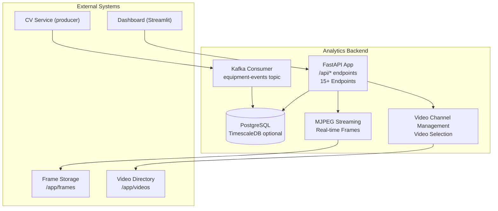
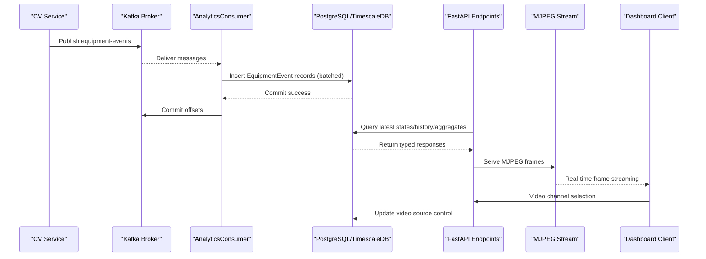
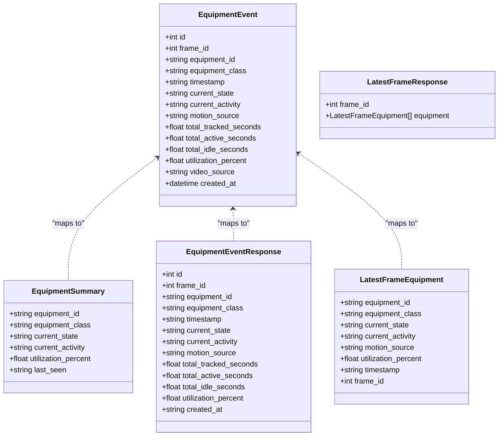
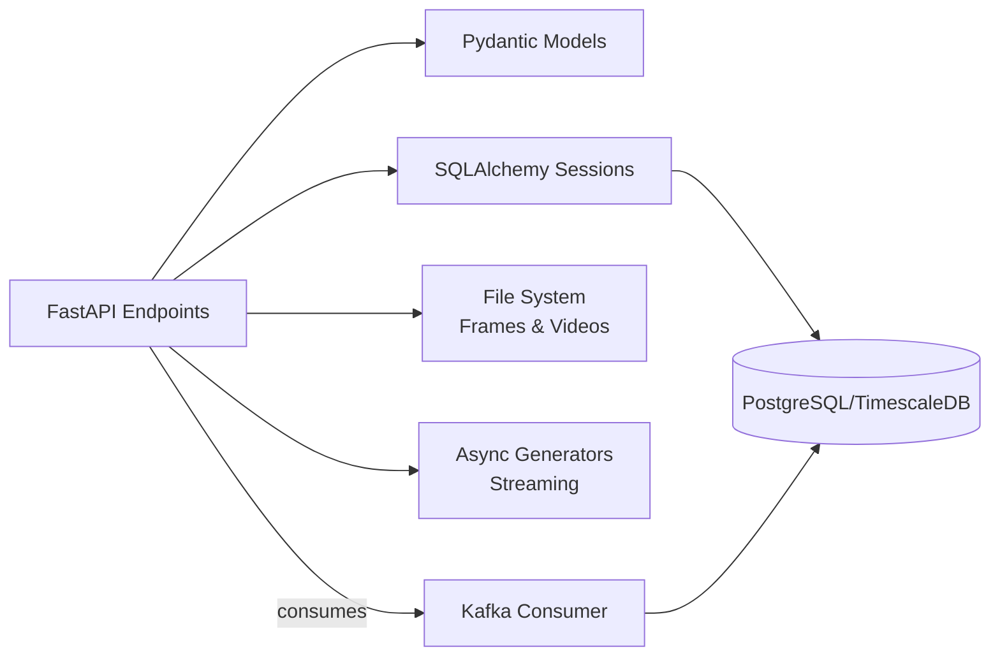

# API Reference

<cite>
**Referenced Files in This Document**
- [README.md](file://README.md)
- [docker-compose.yml](file://docker-compose.yml)
- [config/settings.yaml](file://config/settings.yaml)
- [services/analytics_backend/src/api.py](file://services/analytics_backend/src/api.py)
- [services/analytics_backend/src/db_models.py](file://services/analytics_backend/src/db_models.py)
- [services/analytics_backend/src/main.py](file://services/analytics_backend/src/main.py)
- [services/analytics_backend/src/consumer.py](file://services/analytics_backend/src/consumer.py)
- [services/analytics_backend/Dockerfile](file://services/analytics_backend/Dockerfile)
- [services/analytics_backend/requirements.txt](file://services/analytics_backend/requirements.txt)
</cite>

## Update Summary
**Changes Made**
- Added comprehensive documentation for new MJPEG streaming endpoints
- Documented video channel management endpoints
- Enhanced frame retrieval endpoints documentation
- Updated endpoint catalog with all 15+ endpoints
- Added new response models and schemas
- Enhanced real-time streaming capabilities documentation
- Updated architecture diagrams to reflect complete system

## Table of Contents
1. [Introduction](#introduction)
2. [Project Structure](#project-structure)
3. [Core Components](#core-components)
4. [Architecture Overview](#architecture-overview)
5. [Detailed Component Analysis](#detailed-component-analysis)
6. [Endpoint Catalog](#endpoint-catalog)
7. [Request/Response Schemas and Validation](#requestresponse-schemas-and-validation)
8. [Authentication and Security](#authentication-and-security)
9. [API Versioning Strategy](#api-versioning-strategy)
10. [Practical Client Implementation Examples](#practical-client-implementation-examples)
11. [Integration Patterns](#integration-patterns)
12. [Dependency Analysis](#dependency-analysis)
13. [Performance Considerations](#performance-considerations)
14. [Troubleshooting Guide](#troubleshooting-guide)
15. [Conclusion](#conclusion)
16. [Appendices](#appendices)

## Introduction
This document provides a comprehensive API reference for the FastAPI REST endpoints that serve equipment monitoring data. The system now includes 15+ comprehensive endpoints covering equipment listing, historical data retrieval, utilization analytics, real-time frame streaming, and video channel management. It covers all HTTP methods, URL patterns, request/response schemas, error handling, authentication, rate limiting, API versioning, and practical client implementation examples. It also explains how API responses relate to the underlying database models and provides guidance for debugging, error handling, and performance optimization.

## Project Structure
The analytics backend exposes REST endpoints built with FastAPI and serves data stored in PostgreSQL with optional TimescaleDB optimization. Kafka ingestion populates the database asynchronously, enabling real-time dashboards and analytics. The system now includes comprehensive MJPEG streaming capabilities and video channel management.



**Diagram sources**
- [services/analytics_backend/src/api.py:159-648](file://services/analytics_backend/src/api.py#L159-L648)
- [services/analytics_backend/src/consumer.py:23-269](file://services/analytics_backend/src/consumer.py#L23-L269)
- [services/analytics_backend/src/db_models.py:22-67](file://services/analytics_backend/src/db_models.py#L22-L67)
- [docker-compose.yml:64-79](file://docker-compose.yml#L64-L79)

**Section sources**
- [README.md:340-384](file://README.md#L340-L384)
- [docker-compose.yml:1-99](file://docker-compose.yml#L1-L99)

## Core Components
- FastAPI application with typed Pydantic models for request/response validation.
- SQLAlchemy ORM models backed by PostgreSQL, with optional TimescaleDB hypertable for time-series optimization.
- Kafka consumer that ingests equipment events and persists them to the database.
- Health-checked database sessions and CORS-enabled endpoints for dashboard integration.
- Real-time MJPEG streaming for continuous frame delivery.
- Video channel management for dynamic video source selection.
- Comprehensive frame retrieval and storage system.

Key capabilities:
- Retrieve latest equipment states, per-equipment history, aggregate utilization metrics, latest frame data, and database statistics.
- Stream real-time annotated frames via MJPEG for live monitoring.
- Manage video channels and dynamically select video sources.
- Strong typing and schema validation via Pydantic models.
- Graceful shutdown handling and robust error propagation.

**Section sources**
- [services/analytics_backend/src/api.py:159-648](file://services/analytics_backend/src/api.py#L159-L648)
- [services/analytics_backend/src/db_models.py:22-67](file://services/analytics_backend/src/db_models.py#L22-L67)
- [services/analytics_backend/src/consumer.py:23-269](file://services/analytics_backend/src/consumer.py#L23-L269)

## Architecture Overview
The API layer sits atop a Kafka-driven ingestion pipeline and a relational database. The consumer subscribes to the equipment-events topic, transforms messages into database records, and commits offsets after successful writes. The FastAPI endpoints query the database to serve analytics and monitoring data, including comprehensive real-time streaming capabilities and video channel management.



**Diagram sources**
- [services/analytics_backend/src/consumer.py:93-229](file://services/analytics_backend/src/consumer.py#L93-L229)
- [services/analytics_backend/src/db_models.py:22-67](file://services/analytics_backend/src/db_models.py#L22-L67)
- [services/analytics_backend/src/api.py:159-648](file://services/analytics_backend/src/api.py#L159-L648)

## Detailed Component Analysis

### Authentication and Security
- No authentication middleware is configured in the FastAPI app. All endpoints are public.
- CORS is enabled for all origins to support dashboard and frontend clients.
- Rate limiting is not implemented in the API layer.
- MJPEG streaming includes connection management to prevent resource exhaustion.

Operational note:
- For production deployments, consider adding authentication (e.g., API keys or OAuth), rate limiting, and stricter CORS policies.

**Section sources**
- [services/analytics_backend/src/api.py:24-40](file://services/analytics_backend/src/api.py#L24-L40)
- [services/analytics_backend/src/main.py:124-131](file://services/analytics_backend/src/main.py#L124-L131)

### API Versioning Strategy
- The FastAPI app declares a version string in the application metadata.
- No explicit URL versioning scheme is used (e.g., /v1/). Clients should pin to the documented endpoint versions.

**Section sources**
- [services/analytics_backend/src/api.py:24-31](file://services/analytics_backend/src/api.py#L24-L31)

## Endpoint Catalog

### Health and Status Endpoints

#### GET /api/health
- Purpose: Health check verifying API availability and database connectivity.
- Response model: HealthResponse
- Success: 200 OK with status, database connection status, and message.
- Errors: 503 Service Unavailable if database initialization fails.

Response schema:
- status: string
- database: string
- message: string

Example response:
- status: "healthy"
- database: "connected"
- message: "Equipment Analytics API is running"

Status codes:
- 200 OK
- 503 Service Unavailable

**Section sources**
- [services/analytics_backend/src/api.py:162-179](file://services/analytics_backend/src/api.py#L162-L179)

### Equipment and Utilization Endpoints

#### GET /api/equipment
- Purpose: List all tracked equipment with their latest state snapshot.
- Query parameters:
  - channel: string, optional filter by video source ("all" for all channels)
- Response model: List of EquipmentSummary
- Success: 200 OK with equipment list ordered by latest record per equipment_id.
- Errors: 500 Internal Server Error on query failure.

Response schema (EquipmentSummary):
- equipment_id: string
- equipment_class: string
- current_state: string
- current_activity: string
- utilization_percent: float
- last_seen: string (ISO 8601) or null

Status codes:
- 200 OK
- 500 Internal Server Error

Notes:
- The endpoint returns the latest record per equipment by joining against a subquery that selects the maximum id per equipment_id.
- Supports optional channel filtering for multi-camera setups.

**Section sources**
- [services/analytics_backend/src/api.py:182-225](file://services/analytics_backend/src/api.py#L182-L225)

#### GET /api/equipment/{equipment_id}/history
- Purpose: Retrieve time-series history for a specific equipment.
- Path parameters:
  - equipment_id: string (required)
- Query parameters:
  - limit: integer, default 100, min 1, max 1000
- Response model: List of EquipmentEventResponse
- Success: 200 OK with history ordered by created_at descending.
- Errors: 404 Not Found if no events exist for the equipment; 500 Internal Server Error on query failure.

Response schema (EquipmentEventResponse):
- id: integer
- frame_id: integer
- equipment_id: string
- equipment_class: string
- timestamp: string
- current_state: string
- current_activity: string
- motion_source: string
- total_tracked_seconds: float
- total_active_seconds: float
- total_idle_seconds: float
- utilization_percent: float
- created_at: string (ISO 8601) or null

Status codes:
- 200 OK
- 404 Not Found
- 500 Internal Server Error

**Section sources**
- [services/analytics_backend/src/api.py:228-286](file://services/analytics_backend/src/api.py#L228-L286)

#### GET /api/utilization/summary
- Purpose: Aggregate utilization statistics across all equipment.
- Query parameters:
  - channel: string, optional filter by video source ("all" for all channels)
- Response model: UtilizationSummaryResponse
- Success: 200 OK with totals, counts, averages, and per-equipment summaries.
- Errors: 500 Internal Server Error on query failure.

Response schema (UtilizationSummaryResponse):
- total_equipment: integer
- active_count: integer
- inactive_count: integer
- avg_utilization: float
- equipment: List of EquipmentUtilizationSummary

Per-equipment summary (EquipmentUtilizationSummary):
- equipment_id: string
- equipment_class: string
- total_tracked_seconds: float
- total_active_seconds: float
- total_idle_seconds: float
- utilization_percent: float
- event_count: integer

Status codes:
- 200 OK
- 500 Internal Server Error

**Section sources**
- [services/analytics_backend/src/api.py:289-371](file://services/analytics_backend/src/api.py#L289-L371)

#### GET /api/latest-frame
- Purpose: Retrieve the latest processed frame data for all equipment in that frame.
- Query parameters:
  - channel: string, optional filter by video source ("all" for all channels)
- Response model: LatestFrameResponse
- Success: 200 OK with frame_id and equipment list.
- Errors: 500 Internal Server Error on query failure.

Response schema (LatestFrameResponse):
- frame_id: integer
- equipment: List of LatestFrameEquipment

Per-equipment data (LatestFrameEquipment):
- equipment_id: string
- equipment_class: string
- current_state: string
- current_activity: string
- motion_source: string
- utilization_percent: float
- timestamp: string
- frame_id: integer

Status codes:
- 200 OK
- 500 Internal Server Error

**Section sources**
- [services/analytics_backend/src/api.py:374-422](file://services/analytics_backend/src/api.py#L374-L422)

#### GET /api/stats
- Purpose: General statistics about events in the database.
- Query parameters:
  - channel: string, optional filter by video source ("all" for all channels)
- Response model: Dictionary-like structure
- Success: 200 OK with total_events, unique_equipment, and frame_range.
- Errors: 500 Internal Server Error on query failure.

Response schema:
- total_events: integer
- unique_equipment: integer
- frame_range: object
  - min: integer
  - max: integer

Status codes:
- 200 OK
- 500 Internal Server Error

**Section sources**
- [services/analytics_backend/src/api.py:425-455](file://services/analytics_backend/src/api.py#L425-L455)

### Frame and Image Endpoints

#### GET /api/latest-frame-image
- Purpose: Serve the latest annotated frame as a JPEG image.
- Response: FileResponse with latest_frame.jpg
- Success: 200 OK with image file.
- Errors: 404 Not Found if no frame is available yet.

Response schema:
- Image file: latest_frame.jpg

Status codes:
- 200 OK
- 404 Not Found

**Section sources**
- [services/analytics_backend/src/api.py:466-486](file://services/analytics_backend/src/api.py#L466-L486)

#### GET /api/frame/{frame_id}
- Purpose: Serve a specific frame by its ID.
- Path parameters:
  - frame_id: integer (required)
- Response: FileResponse with annotated frame image
- Success: 200 OK with image file.
- Errors: 404 Not Found if frame doesn't exist.

Response schema:
- Image file: frame_{frame_id}.jpg

Status codes:
- 200 OK
- 404 Not Found

**Section sources**
- [services/analytics_backend/src/api.py:624-647](file://services/analytics_backend/src/api.py#L624-L647)

### Streaming Endpoints

#### GET /api/stream/mjpeg
- Purpose: MJPEG stream endpoint for continuous real-time frame streaming.
- Response: StreamingResponse with multipart/x-mixed-replace stream
- Success: 200 OK with continuous frame stream.
- Behavior: Auto-closes after ~60 seconds to prevent stale connection pile-up.

Response schema:
- Stream: multipart/x-mixed-replace frames
- Headers: Cache-Control, Connection management

Status codes:
- 200 OK (streaming)
- 500 Internal Server Error

Streaming characteristics:
- Polls at ~10Hz (balance between responsiveness and CPU)
- Auto-reconnect support built into client
- Connection timeout prevents resource exhaustion

**Section sources**
- [services/analytics_backend/src/api.py:489-560](file://services/analytics_backend/src/api.py#L489-L560)

### Video Channel Management Endpoints

#### GET /api/videos
- Purpose: List all available video files as channels.
- Response: JSON with videos, current video, and total channels.
- Success: 200 OK with video directory listing.
- Behavior: Reads from /app/videos directory.

Response schema:
- videos: List of video objects
  - filename: string
  - size_mb: float
  - channel_id: string
- current_video: string or null
- total_channels: integer

Status codes:
- 200 OK

**Section sources**
- [services/analytics_backend/src/api.py:567-593](file://services/analytics_backend/src/api.py#L567-L593)

#### POST /api/videos/select
- Purpose: Select a video channel to process.
- Request body: {"filename": "video_name.mp4"}
- Response: JSON with status, selected video, and message.
- Success: 200 OK with selection confirmation.
- Errors: 400 Bad Request if filename missing; 404 Not Found if video not found.

Response schema:
- status: string
- selected_video: string
- message: string

Status codes:
- 200 OK
- 400 Bad Request
- 404 Not Found

**Section sources**
- [services/analytics_backend/src/api.py:596-621](file://services/analytics_backend/src/api.py#L596-L621)

## Request/Response Schemas and Validation
All endpoints use Pydantic models for validation and serialization. The models define strict field types and optional fields where applicable. Responses are automatically serialized to JSON with consistent field names.

Validation highlights:
- Query parameter limits enforced (e.g., history endpoint limit).
- Database session dependency ensures safe access and automatic cleanup.
- Health endpoint validates database connectivity before responding.
- Streaming endpoints include connection management and timeout handling.
- Video channel endpoints validate file existence and handle special "all" case.

**Section sources**
- [services/analytics_backend/src/api.py:77-153](file://services/analytics_backend/src/api.py#L77-L153)
- [services/analytics_backend/src/api.py:56-71](file://services/analytics_backend/src/api.py#L56-L71)
- [services/analytics_backend/src/api.py:159-179](file://services/analytics_backend/src/api.py#L159-L179)

## Relationship Between API Responses and Database Models
The API responses are derived from the EquipmentEvent database model. The model fields map directly to response fields, with additional computed summaries in aggregation endpoints. New response models include streaming-specific data structures.



**Diagram sources**
- [services/analytics_backend/src/db_models.py:22-67](file://services/analytics_backend/src/db_models.py#L22-L67)
- [services/analytics_backend/src/api.py:77-153](file://services/analytics_backend/src/api.py#L77-L153)

**Section sources**
- [services/analytics_backend/src/db_models.py:22-67](file://services/analytics_backend/src/db_models.py#L22-L67)
- [services/analytics_backend/src/api.py:77-153](file://services/analytics_backend/src/api.py#L77-L153)

## Practical Client Implementation Examples

### Basic HTTP Requests

- Python (requests)
  - GET /api/equipment
    - url: http://localhost:8000/api/equipment
    - headers: {}
    - response: List of EquipmentSummary
  - GET /api/equipment/{id}/history?limit=100
    - url: http://localhost:8000/api/equipment/DT-001/history?limit=100
    - headers: {}
    - response: List of EquipmentEventResponse
  - GET /api/utilization/summary
    - url: http://localhost:8000/api/utilization/summary
    - headers: {}
    - response: UtilizationSummaryResponse
  - GET /api/latest-frame
    - url: http://localhost:8000/api/latest-frame
    - headers: {}
    - response: LatestFrameResponse
  - GET /api/stats
    - url: http://localhost:8000/api/stats
    - headers: {}
    - response: { total_events, unique_equipment, frame_range }

- JavaScript (fetch)
  - GET /api/health
    - url: http://localhost:8000/api/health
    - headers: {}
    - response: HealthResponse

- cURL
  - curl -X GET "http://localhost:8000/api/equipment" -H "accept: application/json"

### Real-time Streaming

- JavaScript (MJPEG Streaming)
  ```javascript
  // Basic streaming setup
  const streamUrl = 'http://localhost:8000/api/stream/mjpeg';
  const imgElement = document.getElementById('mjpeg-stream');
  
  function connectStream() {
      imgElement.src = streamUrl + '?t=' + Date.now();
  }
  
  // Auto-reconnect with exponential backoff
  imgElement.onerror = function() {
      setTimeout(connectStream, 2000);
  };
  ```

### Video Channel Management

- Python (selecting video channel)
  ```python
  import requests
  
  # List available videos
  response = requests.get('http://localhost:8000/api/videos')
  print(response.json())
  
  # Select a video channel
  response = requests.post('http://localhost:8000/api/videos/select', 
                         json={'filename': 'construction_site.mp4'})
  print(response.json())
  ```

Common patterns:
- Use limit parameter for history endpoints to constrain payload size.
- Parse timestamps as ISO 8601 strings.
- Handle 404 for missing equipment history.
- Implement auto-reconnect for MJPEG streams.
- Use channel parameter for multi-camera setups.

**Section sources**
- [services/analytics_backend/src/api.py:159-648](file://services/analytics_backend/src/api.py#L159-L648)

## Integration Patterns
- Dashboard integration: Poll /api/latest-frame and /api/utilization/summary periodically for real-time updates.
- Historical analysis: Use /api/equipment/{id}/history with appropriate limit to paginate results.
- Monitoring: Call /api/health to verify service availability and database connectivity.
- Live monitoring: Connect to /api/stream/mjpeg for real-time frame streaming.
- Video management: Use /api/videos endpoints to manage video sources dynamically.
- Frame analysis: Access individual frames via /api/frame/{frame_id} for debugging.

**Section sources**
- [services/analytics_backend/src/api.py:159-648](file://services/analytics_backend/src/api.py#L159-L648)

## Dependency Analysis
The API layer depends on:
- SQLAlchemy engine/session for database access.
- Pydantic models for request/response validation.
- Kafka consumer for ingestion pipeline (not part of API surface, but affects data freshness).
- File system for frame storage and video management.
- Async generators for streaming endpoints.



**Diagram sources**
- [services/analytics_backend/src/api.py:12-19](file://services/analytics_backend/src/api.py#L12-L19)
- [services/analytics_backend/src/db_models.py:158-168](file://services/analytics_backend/src/db_models.py#L158-L168)
- [services/analytics_backend/src/consumer.py:23-78](file://services/analytics_backend/src/consumer.py#L23-L78)

**Section sources**
- [services/analytics_backend/src/api.py:12-19](file://services/analytics_backend/src/api.py#L12-L19)
- [services/analytics_backend/src/db_models.py:158-168](file://services/analytics_backend/src/db_models.py#L158-L168)
- [services/analytics_backend/src/consumer.py:23-78](file://services/analytics_backend/src/consumer.py#L23-L78)

## Performance Considerations
- Database indexing: The EquipmentEvent model includes indexes on equipment_id, video_source, and created_at to optimize queries for latest records, channel filtering, and time-series analytics.
- TimescaleDB: The backend attempts to convert the equipment_events table into a hypertable on created_at for time-series optimization. This improves performance for time-range queries and aggregations.
- Batch ingestion: The Kafka consumer batches writes to reduce transaction overhead and improve throughput.
- Query limits: The history endpoint enforces a maximum limit to prevent oversized responses.
- Pool configuration: The SQLAlchemy engine uses connection pooling and pre-ping to handle concurrent requests efficiently.
- Streaming optimization: MJPEG stream polls at ~10Hz to balance responsiveness and CPU usage.
- Connection management: Streaming endpoints auto-close after 60 seconds to prevent resource exhaustion.
- File I/O optimization: Frame storage uses efficient file naming and directory structure.

Recommendations:
- Tune limit parameter for history queries based on UI refresh cadence.
- For high-frequency dashboards, consider caching latest-frame responses at the application layer.
- Monitor database query performance and adjust pool sizes if needed.
- Implement proper streaming client-side reconnection logic.
- Use channel filtering for multi-camera setups to reduce query load.

**Section sources**
- [services/analytics_backend/src/db_models.py:32-44](file://services/analytics_backend/src/db_models.py#L32-L44)
- [services/analytics_backend/src/db_models.py:103-155](file://services/analytics_backend/src/db_models.py#L103-L155)
- [services/analytics_backend/src/consumer.py:31-33](file://services/analytics_backend/src/consumer.py#L31-L33)
- [services/analytics_backend/src/api.py:232-233](file://services/analytics_backend/src/api.py#L232-L233)
- [services/analytics_backend/src/api.py:489-560](file://services/analytics_backend/src/api.py#L489-L560)

## Troubleshooting Guide
Common issues and resolutions:
- Database not initialized:
  - Symptom: 503 Service Unavailable on health checks.
  - Cause: Database engine not set before API startup.
  - Resolution: Ensure the backend initializes the database and sets the engine before serving requests.
- Missing equipment history:
  - Symptom: 404 Not Found on /api/equipment/{id}/history.
  - Cause: No events recorded for the specified equipment.
  - Resolution: Verify Kafka ingestion is running and equipment events are being published.
- Slow queries:
  - Symptom: High latency on utilization/summary or latest-frame endpoints.
  - Cause: Lack of TimescaleDB hypertable or missing indexes.
  - Resolution: Confirm TimescaleDB setup and indexes; consider reducing query limits.
- CORS errors:
  - Symptom: Cross-origin requests blocked.
  - Cause: Strict browser security policies.
  - Resolution: Ensure the API allows the origin of the dashboard or frontend.
- Streaming issues:
  - Symptom: MJPEG stream disconnects or doesn't receive frames.
  - Cause: Frame file not generated or connection timeout.
  - Resolution: Verify CV service is running, frames directory has latest_frame.jpg, and implement proper reconnection logic.
- Video channel problems:
  - Symptom: 404 Not Found when selecting video.
  - Cause: Video file doesn't exist in /app/videos directory.
  - Resolution: Ensure video files are mounted to the correct directory.

Monitoring approaches:
- Use /api/health to confirm service and database health.
- Track /api/stats to monitor event ingestion progress.
- Observe Kafka consumer logs for ingestion errors and batch commit behavior.
- Monitor streaming endpoint performance and connection counts.
- Verify frame file generation and storage.

**Section sources**
- [services/analytics_backend/src/api.py:63-70](file://services/analytics_backend/src/api.py#L63-L70)
- [services/analytics_backend/src/api.py:159-179](file://services/analytics_backend/src/api.py#L159-L179)
- [services/analytics_backend/src/api.py:254-258](file://services/analytics_backend/src/api.py#L254-L258)
- [services/analytics_backend/src/consumer.py:194-228](file://services/analytics_backend/src/consumer.py#L194-L228)

## Conclusion
The FastAPI endpoints provide a robust, typed interface for querying equipment monitoring data with comprehensive real-time streaming capabilities. The system now includes 15+ endpoints covering equipment listing, historical data retrieval, utilization analytics, real-time frame streaming, and video channel management. They integrate seamlessly with the Kafka ingestion pipeline and PostgreSQL database, offering real-time dashboards, historical analytics, and live monitoring. For production, consider adding authentication, rate limiting, and stricter CORS policies, and monitor ingestion and query performance to ensure reliable operation.

## Appendices

### Complete Endpoint Summary
- Health and Status: GET /api/health
- Equipment: GET /api/equipment, GET /api/equipment/{id}/history
- Utilization: GET /api/utilization/summary, GET /api/latest-frame, GET /api/stats
- Frames: GET /api/latest-frame-image, GET /api/frame/{frame_id}
- Streaming: GET /api/stream/mjpeg
- Video Channels: GET /api/videos, POST /api/videos/select

**Section sources**
- [README.md:236-246](file://README.md#L236-L246)
- [services/analytics_backend/src/api.py:159-648](file://services/analytics_backend/src/api.py#L159-L648)

### Configuration References
- Database URI and credentials are loaded from config/settings.yaml.
- Kafka bootstrap servers and topic are configured for ingestion.
- The backend container exposes port 8000.
- Video directories are mounted for frame and video storage.

**Section sources**
- [config/settings.yaml:47-58](file://config/settings.yaml#L47-L58)
- [docker-compose.yml:64-79](file://docker-compose.yml#L64-L79)
- [services/analytics_backend/Dockerfile:19-22](file://services/analytics_backend/Dockerfile#L19-L22)