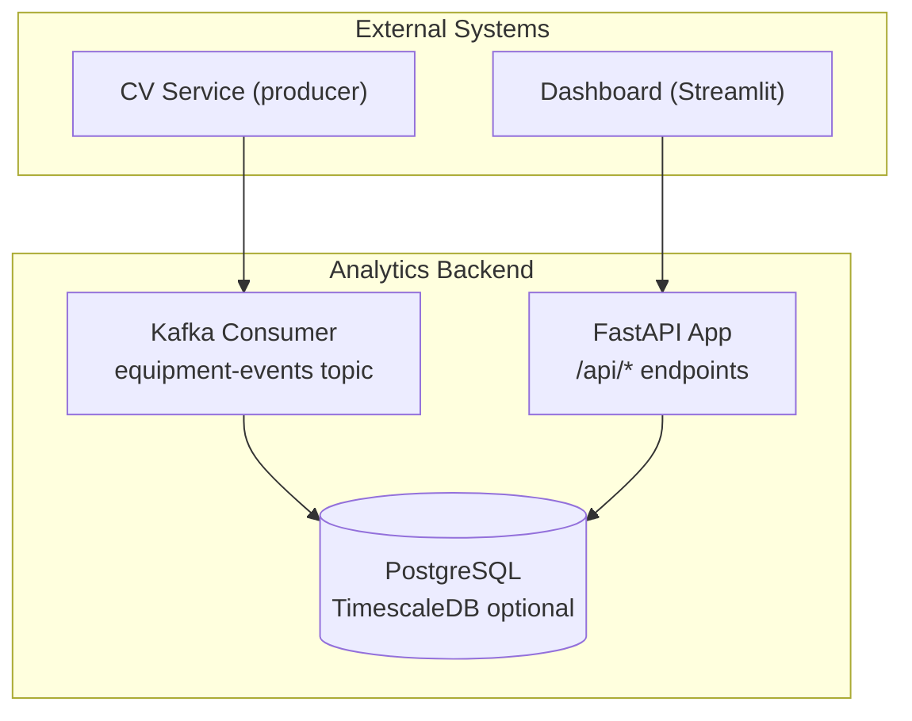
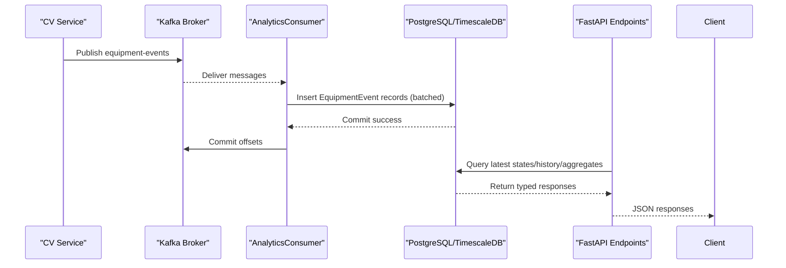
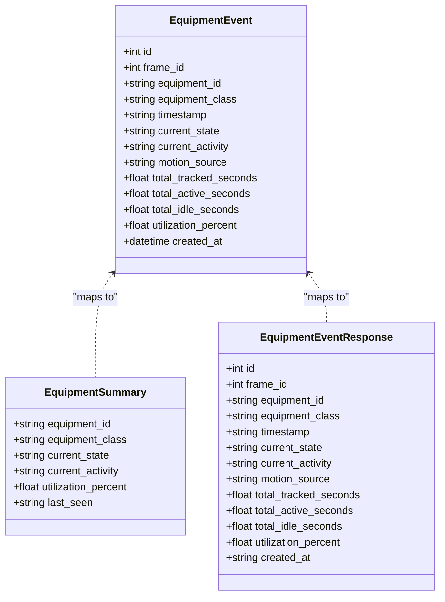
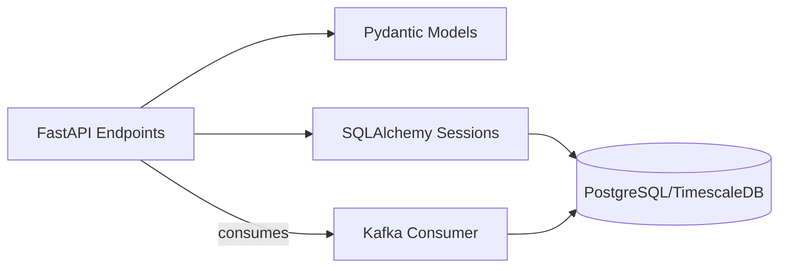

# API Reference

<cite>
**Referenced Files in This Document**
- [README.md](file://README.md)
- [docker-compose.yml](file://docker-compose.yml)
- [config/settings.yaml](file://config/settings.yaml)
- [services/analytics_backend/src/api.py](file://services/analytics_backend/src/api.py)
- [services/analytics_backend/src/db_models.py](file://services/analytics_backend/src/db_models.py)
- [services/analytics_backend/src/main.py](file://services/analytics_backend/src/main.py)
- [services/analytics_backend/src/consumer.py](file://services/analytics_backend/src/consumer.py)
- [services/analytics_backend/Dockerfile](file://services/analytics_backend/Dockerfile)
- [services/analytics_backend/requirements.txt](file://services/analytics_backend/requirements.txt)
</cite>

## Table of Contents
1. [Introduction](#introduction)
2. [Project Structure](#project-structure)
3. [Core Components](#core-components)
4. [Architecture Overview](#architecture-overview)
5. [Detailed Component Analysis](#detailed-component-analysis)
6. [Dependency Analysis](#dependency-analysis)
7. [Performance Considerations](#performance-considerations)
8. [Troubleshooting Guide](#troubleshooting-guide)
9. [Conclusion](#conclusion)
10. [Appendices](#appendices)

## Introduction
This document provides a comprehensive API reference for the FastAPI REST endpoints that serve equipment monitoring data. It covers all HTTP methods, URL patterns, request/response schemas, error handling, authentication, rate limiting, API versioning, and practical client implementation examples. It also explains how API responses relate to the underlying database models and provides guidance for debugging, error handling, and performance optimization.

## Project Structure
The analytics backend exposes REST endpoints built with FastAPI and serves data stored in PostgreSQL with optional TimescaleDB optimization. Kafka ingestion populates the database asynchronously, enabling real-time dashboards and analytics.

**Diagram sources**
- [services/analytics_backend/src/api.py:159-444](file://services/analytics_backend/src/api.py#L159-L444)
- [services/analytics_backend/src/consumer.py:23-268](file://services/analytics_backend/src/consumer.py#L23-L268)
- [services/analytics_backend/src/db_models.py:22-67](file://services/analytics_backend/src/db_models.py#L22-L67)
- [docker-compose.yml:64-79](file://docker-compose.yml#L64-L79)

**Section sources**
- [README.md:340-384](file://README.md#L340-L384)
- [docker-compose.yml:1-95](file://docker-compose.yml#L1-L95)

## Core Components
- FastAPI application with typed Pydantic models for request/response validation.
- SQLAlchemy ORM models backed by PostgreSQL, with optional TimescaleDB hypertable for time-series optimization.
- Kafka consumer that ingests equipment events and persists them to the database.
- Health-checked database sessions and CORS-enabled endpoints for dashboard integration.

Key capabilities:
- Retrieve latest equipment states, per-equipment history, aggregate utilization metrics, latest frame data, and database statistics.
- Strong typing and schema validation via Pydantic models.
- Graceful shutdown handling and robust error propagation.

**Section sources**
- [services/analytics_backend/src/api.py:159-444](file://services/analytics_backend/src/api.py#L159-L444)
- [services/analytics_backend/src/db_models.py:22-67](file://services/analytics_backend/src/db_models.py#L22-L67)
- [services/analytics_backend/src/consumer.py:23-268](file://services/analytics_backend/src/consumer.py#L23-L268)

## Architecture Overview
The API layer sits atop a Kafka-driven ingestion pipeline and a relational database. The consumer subscribes to the equipment-events topic, transforms messages into database records, and commits offsets after successful writes. The FastAPI endpoints query the database to serve analytics and monitoring data.

**Diagram sources**
- [services/analytics_backend/src/consumer.py:93-229](file://services/analytics_backend/src/consumer.py#L93-L229)
- [services/analytics_backend/src/db_models.py:22-67](file://services/analytics_backend/src/db_models.py#L22-L67)
- [services/analytics_backend/src/api.py:159-444](file://services/analytics_backend/src/api.py#L159-L444)

## Detailed Component Analysis

### Authentication and Security
- No authentication middleware is configured in the FastAPI app. All endpoints are public.
- CORS is enabled for all origins to support dashboard and frontend clients.
- Rate limiting is not implemented in the API layer.

Operational note:
- For production deployments, consider adding authentication (e.g., API keys or OAuth), rate limiting, and stricter CORS policies.

**Section sources**
- [services/analytics_backend/src/api.py:24-37](file://services/analytics_backend/src/api.py#L24-L37)
- [services/analytics_backend/src/main.py:124-131](file://services/analytics_backend/src/main.py#L124-L131)

### API Versioning Strategy
- The FastAPI app declares a version string in the application metadata.
- No explicit URL versioning scheme is used (e.g., /v1/). Clients should pin to the documented endpoint versions.

**Section sources**
- [services/analytics_backend/src/api.py:24-28](file://services/analytics_backend/src/api.py#L24-L28)

### Endpoint Catalog

#### GET /api/health
- Purpose: Health check verifying API availability and database connectivity.
- Response model: HealthResponse
- Success: 200 OK with status, database connection status, and message.
- Errors: 503 Service Unavailable if database initialization fails.

Response schema:
- status: string
- database: string
- message: string

Example response:
- status: "healthy"
- database: "connected"
- message: "Equipment Analytics API is running"

Status codes:
- 200 OK
- 503 Service Unavailable

**Section sources**
- [services/analytics_backend/src/api.py:159-177](file://services/analytics_backend/src/api.py#L159-L177)

#### GET /api/equipment
- Purpose: List all tracked equipment with their latest state snapshot.
- Response model: List of EquipmentSummary
- Success: 200 OK with equipment list ordered by latest record per equipment_id.
- Errors: 500 Internal Server Error on query failure.

Response schema (EquipmentSummary):
- equipment_id: string
- equipment_class: string
- current_state: string
- current_activity: string
- utilization_percent: float
- last_seen: string (ISO 8601) or null

Status codes:
- 200 OK
- 500 Internal Server Error

Notes:
- The endpoint returns the latest record per equipment by joining against a subquery that selects the maximum id per equipment_id.

**Section sources**
- [services/analytics_backend/src/api.py:179-223](file://services/analytics_backend/src/api.py#L179-L223)

#### GET /api/equipment/{equipment_id}/history
- Purpose: Retrieve time-series history for a specific equipment.
- Path parameters:
  - equipment_id: string (required)
- Query parameters:
  - limit: integer, default 100, min 1, max 1000
- Response model: List of EquipmentEventResponse
- Success: 200 OK with history ordered by created_at descending.
- Errors: 404 Not Found if no events exist for the equipment; 500 Internal Server Error on query failure.

Response schema (EquipmentEventResponse):
- id: integer
- frame_id: integer
- equipment_id: string
- equipment_class: string
- timestamp: string
- current_state: string
- current_activity: string
- motion_source: string
- total_tracked_seconds: float
- total_active_seconds: float
- total_idle_seconds: float
- utilization_percent: float
- created_at: string (ISO 8601) or null

Status codes:
- 200 OK
- 404 Not Found
- 500 Internal Server Error

**Section sources**
- [services/analytics_backend/src/api.py:225-284](file://services/analytics_backend/src/api.py#L225-L284)

#### GET /api/utilization/summary
- Purpose: Aggregate utilization statistics across all equipment.
- Response model: UtilizationSummaryResponse
- Success: 200 OK with totals, counts, averages, and per-equipment summaries.
- Errors: 500 Internal Server Error on query failure.

Response schema (UtilizationSummaryResponse):
- total_equipment: integer
- active_count: integer
- inactive_count: integer
- avg_utilization: float
- equipment: List of EquipmentUtilizationSummary

Per-equipment summary (EquipmentUtilizationSummary):
- equipment_id: string
- equipment_class: string
- total_tracked_seconds: float
- total_active_seconds: float
- total_idle_seconds: float
- utilization_percent: float
- event_count: integer

Status codes:
- 200 OK
- 500 Internal Server Error

**Section sources**
- [services/analytics_backend/src/api.py:286-368](file://services/analytics_backend/src/api.py#L286-L368)

#### GET /api/latest-frame
- Purpose: Retrieve the latest processed frame data for all equipment in that frame.
- Response model: LatestFrameResponse
- Success: 200 OK with frame_id and equipment list.
- Errors: 500 Internal Server Error on query failure.

Response schema (LatestFrameResponse):
- frame_id: integer
- equipment: List of LatestFrameEquipment

Per-equipment data (LatestFrameEquipment):
- equipment_id: string
- equipment_class: string
- current_state: string
- current_activity: string
- motion_source: string
- utilization_percent: float
- timestamp: string
- frame_id: integer

Status codes:
- 200 OK
- 500 Internal Server Error

**Section sources**
- [services/analytics_backend/src/api.py:370-416](file://services/analytics_backend/src/api.py#L370-L416)

#### GET /api/stats
- Purpose: General statistics about events in the database.
- Response model: Dictionary-like structure
- Success: 200 OK with total_events, unique_equipment, and frame_range.
- Errors: 500 Internal Server Error on query failure.

Response schema:
- total_events: integer
- unique_equipment: integer
- frame_range: object
  - min: integer
  - max: integer

Status codes:
- 200 OK
- 500 Internal Server Error

**Section sources**
- [services/analytics_backend/src/api.py:418-444](file://services/analytics_backend/src/api.py#L418-L444)

### Request/Response Schemas and Validation
All endpoints use Pydantic models for validation and serialization. The models define strict field types and optional fields where applicable. Responses are automatically serialized to JSON with consistent field names.

Validation highlights:
- Query parameter limits enforced (e.g., history endpoint limit).
- Database session dependency ensures safe access and automatic cleanup.
- Health endpoint validates database connectivity before responding.

**Section sources**
- [services/analytics_backend/src/api.py:77-153](file://services/analytics_backend/src/api.py#L77-L153)
- [services/analytics_backend/src/api.py:56-71](file://services/analytics_backend/src/api.py#L56-L71)
- [services/analytics_backend/src/api.py:159-177](file://services/analytics_backend/src/api.py#L159-L177)

### Relationship Between API Responses and Database Models
The API responses are derived from the EquipmentEvent database model. The model fields map directly to response fields, with additional computed summaries in aggregation endpoints.

**Diagram sources**
- [services/analytics_backend/src/db_models.py:22-67](file://services/analytics_backend/src/db_models.py#L22-L67)
- [services/analytics_backend/src/api.py:77-153](file://services/analytics_backend/src/api.py#L77-L153)

**Section sources**
- [services/analytics_backend/src/db_models.py:22-67](file://services/analytics_backend/src/db_models.py#L22-L67)
- [services/analytics_backend/src/api.py:77-153](file://services/analytics_backend/src/api.py#L77-L153)

### Practical Client Implementation Examples

Note: The following examples demonstrate HTTP requests and expected responses. Replace placeholders with actual values.

- Python (requests)
  - GET /api/equipment
    - url: http://localhost:8000/api/equipment
    - headers: {}
    - response: List of EquipmentSummary
  - GET /api/equipment/{id}/history?limit=100
    - url: http://localhost:8000/api/equipment/DT-001/history?limit=100
    - headers: {}
    - response: List of EquipmentEventResponse
  - GET /api/utilization/summary
    - url: http://localhost:8000/api/utilization/summary
    - headers: {}
    - response: UtilizationSummaryResponse
  - GET /api/latest-frame
    - url: http://localhost:8000/api/latest-frame
    - headers: {}
    - response: LatestFrameResponse
  - GET /api/stats
    - url: http://localhost:8000/api/stats
    - headers: {}
    - response: { total_events, unique_equipment, frame_range }

- JavaScript (fetch)
  - GET /api/health
    - url: http://localhost:8000/api/health
    - headers: {}
    - response: HealthResponse

- cURL
  - curl -X GET "http://localhost:8000/api/equipment" -H "accept: application/json"

Common patterns:
- Use limit parameter for history endpoints to constrain payload size.
- Parse timestamps as ISO 8601 strings.
- Handle 404 for missing equipment history.

**Section sources**
- [services/analytics_backend/src/api.py:159-444](file://services/analytics_backend/src/api.py#L159-L444)

### Integration Patterns
- Dashboard integration: Poll /api/latest-frame and /api/utilization/summary periodically for real-time updates.
- Historical analysis: Use /api/equipment/{id}/history with appropriate limit to paginate results.
- Monitoring: Call /api/health to verify service availability and database connectivity.

**Section sources**
- [services/analytics_backend/src/api.py:159-444](file://services/analytics_backend/src/api.py#L159-L444)

## Dependency Analysis
The API layer depends on:
- SQLAlchemy engine/session for database access.
- Pydantic models for request/response validation.
- Kafka consumer for ingestion pipeline (not part of API surface, but affects data freshness).

**Diagram sources**
- [services/analytics_backend/src/api.py:12-19](file://services/analytics_backend/src/api.py#L12-L19)
- [services/analytics_backend/src/db_models.py:158-168](file://services/analytics_backend/src/db_models.py#L158-L168)
- [services/analytics_backend/src/consumer.py:23-78](file://services/analytics_backend/src/consumer.py#L23-L78)

**Section sources**
- [services/analytics_backend/src/api.py:12-19](file://services/analytics_backend/src/api.py#L12-L19)
- [services/analytics_backend/src/db_models.py:158-168](file://services/analytics_backend/src/db_models.py#L158-L168)
- [services/analytics_backend/src/consumer.py:23-78](file://services/analytics_backend/src/consumer.py#L23-L78)

## Performance Considerations
- Database indexing: The EquipmentEvent model includes indexes on equipment_id and created_at to optimize queries for latest records and time-series analytics.
- TimescaleDB: The backend attempts to convert the equipment_events table into a hypertable on created_at for time-series optimization. This improves performance for time-range queries and aggregations.
- Batch ingestion: The Kafka consumer batches writes to reduce transaction overhead and improve throughput.
- Query limits: The history endpoint enforces a maximum limit to prevent oversized responses.
- Pool configuration: The SQLAlchemy engine uses connection pooling and pre-ping to handle concurrent requests efficiently.

Recommendations:
- Tune limit parameter for history queries based on UI refresh cadence.
- For high-frequency dashboards, consider caching latest-frame responses at the application layer.
- Monitor database query performance and adjust pool sizes if needed.

**Section sources**
- [services/analytics_backend/src/db_models.py:32-43](file://services/analytics_backend/src/db_models.py#L32-L43)
- [services/analytics_backend/src/db_models.py:103-155](file://services/analytics_backend/src/db_models.py#L103-L155)
- [services/analytics_backend/src/consumer.py:31-33](file://services/analytics_backend/src/consumer.py#L31-L33)
- [services/analytics_backend/src/api.py:232-233](file://services/analytics_backend/src/api.py#L232-L233)

## Troubleshooting Guide
Common issues and resolutions:
- Database not initialized:
  - Symptom: 503 Service Unavailable on health checks.
  - Cause: Database engine not set before API startup.
  - Resolution: Ensure the backend initializes the database and sets the engine before serving requests.
- Missing equipment history:
  - Symptom: 404 Not Found on /api/equipment/{id}/history.
  - Cause: No events recorded for the specified equipment.
  - Resolution: Verify Kafka ingestion is running and equipment events are being published.
- Slow queries:
  - Symptom: High latency on utilization/summary or latest-frame endpoints.
  - Cause: Lack of TimescaleDB hypertable or missing indexes.
  - Resolution: Confirm TimescaleDB setup and indexes; consider reducing query limits.
- CORS errors:
  - Symptom: Cross-origin requests blocked.
  - Cause: Strict browser security policies.
  - Resolution: Ensure the API allows the origin of the dashboard or frontend.

Monitoring approaches:
- Use /api/health to confirm service and database health.
- Track /api/stats to monitor event ingestion progress.
- Observe Kafka consumer logs for ingestion errors and batch commit behavior.

**Section sources**
- [services/analytics_backend/src/api.py:63-70](file://services/analytics_backend/src/api.py#L63-L70)
- [services/analytics_backend/src/api.py:159-177](file://services/analytics_backend/src/api.py#L159-L177)
- [services/analytics_backend/src/api.py:254-258](file://services/analytics_backend/src/api.py#L254-L258)
- [services/analytics_backend/src/consumer.py:194-228](file://services/analytics_backend/src/consumer.py#L194-L228)

## Conclusion
The FastAPI endpoints provide a robust, typed interface for querying equipment monitoring data. They integrate seamlessly with the Kafka ingestion pipeline and PostgreSQL database, offering real-time dashboards and historical analytics. For production, consider adding authentication, rate limiting, and stricter CORS policies, and monitor ingestion and query performance to ensure reliable operation.

## Appendices

### Endpoint Summary
- GET /api/health: Health check
- GET /api/equipment: Latest equipment states
- GET /api/equipment/{id}/history: History with limit
- GET /api/utilization/summary: Aggregated utilization
- GET /api/latest-frame: Latest frame data
- GET /api/stats: Database statistics

**Section sources**
- [README.md:236-246](file://README.md#L236-L246)
- [services/analytics_backend/src/api.py:159-444](file://services/analytics_backend/src/api.py#L159-L444)

### Configuration References
- Database URI and credentials are loaded from config/settings.yaml.
- Kafka bootstrap servers and topic are configured for ingestion.
- The backend container exposes port 8000.

**Section sources**
- [config/settings.yaml:47-58](file://config/settings.yaml#L47-L58)
- [docker-compose.yml:64-79](file://docker-compose.yml#L64-L79)
- [services/analytics_backend/Dockerfile:19-22](file://services/analytics_backend/Dockerfile#L19-L22)