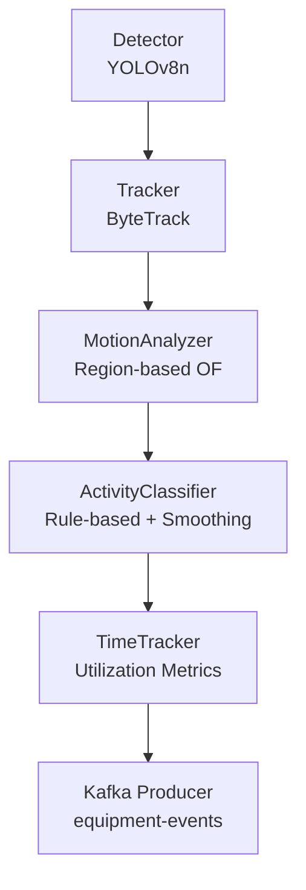
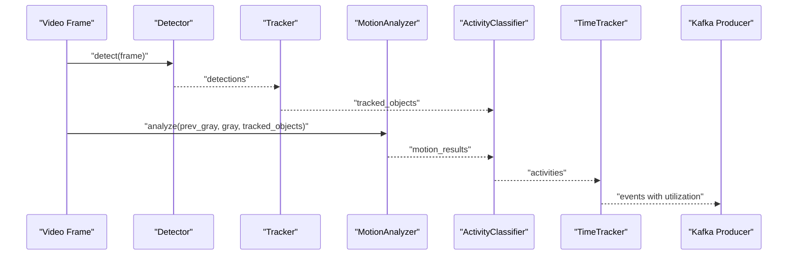
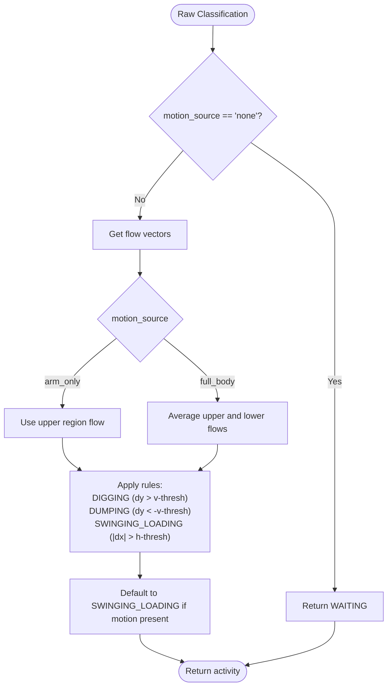
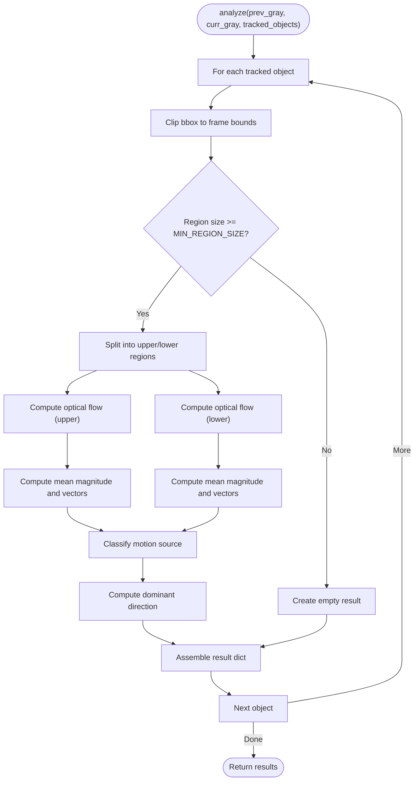
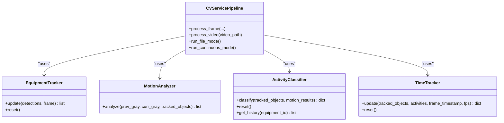
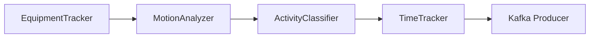

# Activity Classification

<cite>
**Referenced Files in This Document**
- [activity_classifier.py](file://services/cv_service/src/activity_classifier.py)
- [motion_analyzer.py](file://services/cv_service/src/motion_analyzer.py)
- [tracker.py](file://services/cv_service/src/tracker.py)
- [main.py](file://services/cv_service/src/main.py)
- [time_tracker.py](file://services/cv_service/src/time_tracker.py)
- [settings.yaml](file://config/settings.yaml)
- [test_activity_classifier.py](file://tests/test_activity_classifier.py)
- [README.md](file://README.md)
</cite>

## Table of Contents
1. [Introduction](#introduction)
2. [Project Structure](#project-structure)
3. [Core Components](#core-components)
4. [Architecture Overview](#architecture-overview)
5. [Detailed Component Analysis](#detailed-component-analysis)
6. [Dependency Analysis](#dependency-analysis)
7. [Performance Considerations](#performance-considerations)
8. [Troubleshooting Guide](#troubleshooting-guide)
9. [Conclusion](#conclusion)
10. [Appendices](#appendices)

## Introduction
This document explains the rule-based activity classification subsystem that categorizes construction equipment states into DIGGING, SWINGING_LOADING, DUMPING, and WAITING. The classifier integrates detection and tracking outputs with motion analysis results to produce robust, temporally consistent activity predictions. It uses a state machine approach with N-frame smoothing to minimize flickering caused by noisy motion detection and applies explicit rules based on optical flow direction and motion source classification.

## Project Structure
The activity classification pipeline is orchestrated by the CV service main entrypoint and consists of:
- Detection: YOLOv8-based equipment detection
- Tracking: ByteTrack-based multi-object tracking with persistent IDs
- Motion Analysis: Region-based optical flow to distinguish articulated motion
- Activity Classification: Rule-based classification with N-frame smoothing
- Time Tracking: Accumulates utilization metrics per equipment
- Kafka Publishing: Streams structured events for downstream analytics

**Diagram sources**
- [main.py:323-372](file://services/cv_service/src/main.py#L323-L372)
- [detector.py:85-169](file://services/cv_service/src/detector.py#L85-L169)
- [tracker.py:159-264](file://services/cv_service/src/tracker.py#L159-L264)
- [motion_analyzer.py:88-166](file://services/cv_service/src/motion_analyzer.py#L88-L166)
- [activity_classifier.py:71-125](file://services/cv_service/src/activity_classifier.py#L71-L125)
- [time_tracker.py:53-120](file://services/cv_service/src/time_tracker.py#L53-L120)

**Section sources**
- [README.md:1-54](file://README.md#L1-L54)
- [main.py:104-142](file://services/cv_service/src/main.py#L104-L142)

## Core Components
- ActivityClassifier: Implements rule-based classification and N-frame smoothing
- MotionAnalyzer: Computes region-based optical flow and classifies motion source
- EquipmentTracker: Provides tracked objects with persistent equipment IDs
- TimeTracker: Aggregates utilization metrics per equipment
- CVServicePipeline: Orchestrates the end-to-end pipeline and publishes events

Key configuration parameters affecting activity classification:
- activity.smoothing_window: Buffer size for mode-based smoothing
- activity.vertical_flow_threshold: Vertical motion sensitivity
- activity.horizontal_flow_threshold: Horizontal motion sensitivity
- motion.magnitude_threshold: Minimum optical flow magnitude to consider motion
- motion.upper_region_ratio: Fraction of bounding box for upper region

**Section sources**
- [settings.yaml:36-39](file://config/settings.yaml#L36-L39)
- [settings.yaml:31-34](file://config/settings.yaml#L31-L34)
- [activity_classifier.py:46-69](file://services/cv_service/src/activity_classifier.py#L46-L69)
- [motion_analyzer.py:59-86](file://services/cv_service/src/motion_analyzer.py#L59-L86)

## Architecture Overview
The pipeline processes video frames through detection, tracking, motion analysis, and classification, then aggregates time-based utilization metrics and publishes structured events.

**Diagram sources**
- [main.py:323-372](file://services/cv_service/src/main.py#L323-L372)
- [detector.py:85-169](file://services/cv_service/src/detector.py#L85-L169)
- [tracker.py:159-264](file://services/cv_service/src/tracker.py#L159-L264)
- [motion_analyzer.py:88-166](file://services/cv_service/src/motion_analyzer.py#L88-L166)
- [activity_classifier.py:71-125](file://services/cv_service/src/activity_classifier.py#L71-L125)
- [time_tracker.py:53-120](file://services/cv_service/src/time_tracker.py#L53-L120)

## Detailed Component Analysis

### ActivityClassifier
Implements rule-based classification with N-frame smoothing:
- Raw classification rules:
  - DIGGING: arm_only motion with dominant vertical downward flow (dy > vertical_flow_threshold)
  - DUMPING: arm_only motion with dominant vertical upward flow (dy < -vertical_flow_threshold)
  - SWINGING_LOADING: horizontal dominant motion (|dx| > horizontal_flow_threshold) regardless of motion_source
  - WAITING: motion_source == "none"
  - Default fallback: SWINGING_LOADING for any motion_source with motion
- Temporal smoothing:
  - Maintains a sliding window per equipment ID
  - Returns the mode (most frequent) activity over N frames
  - On ties, prefers the most recent classification
- Output structure:
  - current_state: "ACTIVE" or "INACTIVE"
  - current_activity: DIGGING, SWINGING_LOADING, DUMPING, or WAITING
  - activity: alias for current_activity
  - motion_source: "full_body", "arm_only", or "none"

**Diagram sources**
- [activity_classifier.py:166-231](file://services/cv_service/src/activity_classifier.py#L166-L231)

**Section sources**
- [activity_classifier.py:23-125](file://services/cv_service/src/activity_classifier.py#L23-L125)
- [activity_classifier.py:233-286](file://services/cv_service/src/activity_classifier.py#L233-L286)
- [test_activity_classifier.py:439-543](file://tests/test_activity_classifier.py#L439-L543)

### MotionAnalyzer
Computes region-based optical flow to classify motion source:
- Splits each tracked object’s bounding box into upper (arm/boom) and lower (base/tracks) regions using upper_region_ratio
- Computes Farneback dense optical flow for each region
- Calculates mean magnitude and mean flow vectors per region
- Classifies motion source:
  - "full_body": both regions moving
  - "arm_only": only upper region moving
  - "none": neither region moving
- Determines dominant direction from the region with higher motion magnitude

**Diagram sources**
- [motion_analyzer.py:88-166](file://services/cv_service/src/motion_analyzer.py#L88-L166)
- [motion_analyzer.py:192-251](file://services/cv_service/src/motion_analyzer.py#L192-L251)

**Section sources**
- [motion_analyzer.py:24-87](file://services/cv_service/src/motion_analyzer.py#L24-L87)
- [motion_analyzer.py:192-251](file://services/cv_service/src/motion_analyzer.py#L192-L251)

### EquipmentTracker
Provides tracked objects with persistent equipment IDs across frames:
- Uses ByteTrack via supervision library
- Assigns friendly IDs with class-based prefixes (e.g., "DT-001", "VH-002")
- Maintains mappings from internal track IDs to equipment IDs and classes
- Supports resetting state for new videos

Integration note: The tracker supplies equipment_id and bbox to the motion analyzer and activity classifier.

**Section sources**
- [tracker.py:19-83](file://services/cv_service/src/tracker.py#L19-L83)
- [tracker.py:159-264](file://services/cv_service/src/tracker.py#L159-L264)

### TimeTracker
Accumulates utilization metrics per equipment:
- Updates counters per frame using current_state from activity classification
- Computes total_tracked_seconds, total_active_seconds, total_idle_seconds
- Calculates utilization_percent as total_active_seconds / total_tracked_seconds
- Builds per-equipment and aggregate statistics

**Section sources**
- [time_tracker.py:21-51](file://services/cv_service/src/time_tracker.py#L21-L51)
- [time_tracker.py:53-120](file://services/cv_service/src/time_tracker.py#L53-L120)
- [time_tracker.py:122-265](file://services/cv_service/src/time_tracker.py#L122-L265)

### Integration with Tracking and Motion Analysis
The CV service orchestrator wires components together:
- Detector produces detections
- Tracker converts detections to tracked objects with equipment_id and bbox
- MotionAnalyzer computes motion results keyed by equipment_id
- ActivityClassifier classifies activities using tracked_objects and motion_results
- TimeTracker aggregates utilization metrics
- Events are built and published to Kafka

**Diagram sources**
- [main.py:42-142](file://services/cv_service/src/main.py#L42-L142)
- [tracker.py:159-264](file://services/cv_service/src/tracker.py#L159-L264)
- [motion_analyzer.py:88-166](file://services/cv_service/src/motion_analyzer.py#L88-L166)
- [activity_classifier.py:71-125](file://services/cv_service/src/activity_classifier.py#L71-L125)
- [time_tracker.py:53-120](file://services/cv_service/src/time_tracker.py#L53-L120)

**Section sources**
- [main.py:323-372](file://services/cv_service/src/main.py#L323-L372)

## Dependency Analysis
- ActivityClassifier depends on:
  - MotionAnalyzer results for motion_source and flow_vectors
  - EquipmentTracker outputs for equipment_id and bbox
- MotionAnalyzer depends on:
  - Grayscale frames and tracked object bounding boxes
  - Configuration parameters for thresholds and region ratios
- TimeTracker depends on:
  - ActivityClassifier outputs for current_state
  - Tracked objects for equipment identity

**Diagram sources**
- [tracker.py:159-264](file://services/cv_service/src/tracker.py#L159-L264)
- [motion_analyzer.py:88-166](file://services/cv_service/src/motion_analyzer.py#L88-L166)
- [activity_classifier.py:71-125](file://services/cv_service/src/activity_classifier.py#L71-L125)
- [time_tracker.py:53-120](file://services/cv_service/src/time_tracker.py#L53-L120)

**Section sources**
- [activity_classifier.py:94-125](file://services/cv_service/src/activity_classifier.py#L94-L125)
- [motion_analyzer.py:127-166](file://services/cv_service/src/motion_analyzer.py#L127-L166)

## Performance Considerations
- CPU optimization strategies:
  - YOLOv8n (nano) model for lightweight inference
  - Frame skipping reduces processing load
  - Frame resizing minimizes pixel count
  - Region-based optical flow limits computation to bounding boxes
- Tuning guidelines:
  - Increase smoothing_window to reduce flickering
  - Adjust magnitude_threshold and flow thresholds to balance sensitivity
  - Tune upper_region_ratio for camera-specific equipment poses

[No sources needed since this section provides general guidance]

## Troubleshooting Guide
Common issues and remedies:
- Ambiguous states:
  - If both regions move with low magnitudes, motion_source may be "full_body" but directionless; classifier falls back to SWINGING_LOADING
  - Increase magnitude_threshold to filter out noise
- Flickering between states:
  - Increase smoothing_window to stabilize predictions
  - Verify thresholds are appropriate for the scene
- Missing motion data:
  - Classifier gracefully handles missing motion results by using empty defaults (WAITING)
- Incorrect motion_source classification:
  - Validate upper_region_ratio and magnitude_threshold
  - Ensure tracked bounding boxes are valid and sufficiently sized

**Section sources**
- [test_activity_classifier.py:355-389](file://tests/test_activity_classifier.py#L355-L389)
- [activity_classifier.py:127-164](file://services/cv_service/src/activity_classifier.py#L127-L164)
- [motion_analyzer.py:324-355](file://services/cv_service/src/motion_analyzer.py#L324-L355)

## Conclusion
The rule-based activity classification subsystem provides a robust, interpretable, and efficient solution for categorizing construction equipment activities. By combining region-based motion analysis with N-frame smoothing and explicit rules, it achieves temporal consistency while remaining configurable and easy to tune. Integration with tracking and time analytics enables comprehensive utilization reporting and scalable event streaming.

[No sources needed since this section summarizes without analyzing specific files]

## Appendices

### Classification Rules and Threshold Tuning
- DIGGING: arm_only motion with dominant vertical downward flow (dy > vertical_flow_threshold)
- DUMPING: arm_only motion with dominant vertical upward flow (dy < -vertical_flow_threshold)
- SWINGING_LOADING: horizontal dominant motion (|dx| > horizontal_flow_threshold) for arm_only or full_body
- WAITING: motion_source == "none"
- Default: SWINGING_LOADING for any motion_source with motion

Tuning tips:
- Increase smoothing_window for smoother transitions
- Lower magnitude_threshold for more sensitive motion detection
- Adjust vertical_flow_threshold and horizontal_flow_threshold to match typical equipment motion scales

**Section sources**
- [activity_classifier.py:166-231](file://services/cv_service/src/activity_classifier.py#L166-L231)
- [settings.yaml:36-39](file://config/settings.yaml#L36-L39)

### Practical Examples and Evaluation Logic
- Rule evaluation logic:
  - For arm_only equipment, use upper region flow vectors
  - For full_body equipment, average upper and lower flow vectors
  - Compare against thresholds to determine dominant direction
- Temporal consistency checking:
  - N-frame smoothing buffer stores recent classifications
  - Mode-based voting selects the most frequent activity
  - Tie-breaking prefers the most recent classification
- Activity prediction mechanisms:
  - Classifier returns current_state and current_activity per equipment
  - TimeTracker accumulates utilization metrics for reporting

**Section sources**
- [activity_classifier.py:233-286](file://services/cv_service/src/activity_classifier.py#L233-L286)
- [test_activity_classifier.py:211-310](file://tests/test_activity_classifier.py#L211-L310)

### Integration Details and Event Schema
- Event structure includes:
  - frame_id, equipment_id, equipment_class, timestamp
  - utilization: current_state, current_activity, motion_source
  - time_analytics: total_tracked_seconds, total_active_seconds, total_idle_seconds, utilization_percent

**Section sources**
- [main.py:270-321](file://services/cv_service/src/main.py#L270-L321)
- [README.md:263-285](file://README.md#L263-L285)