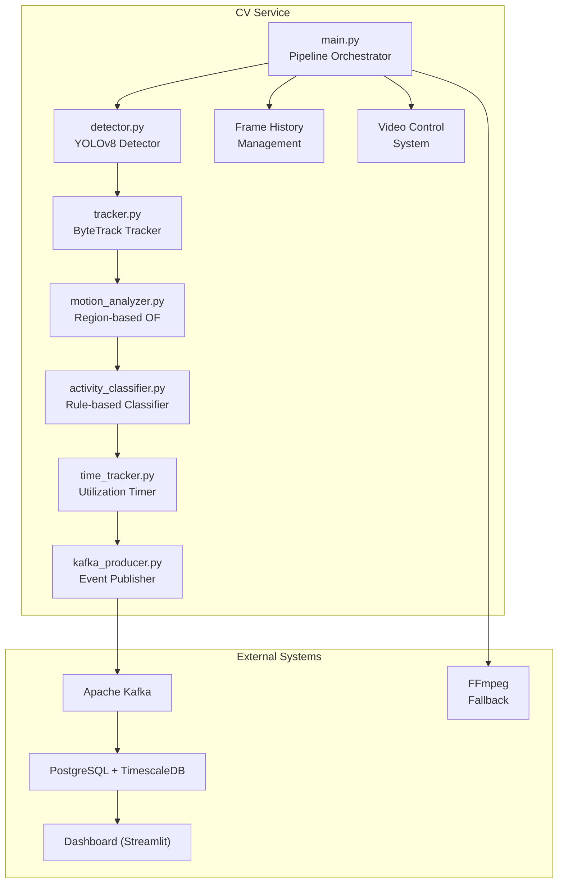
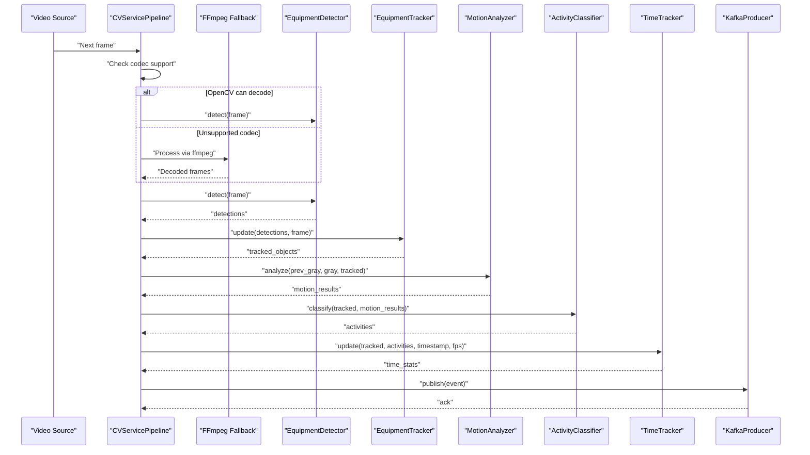
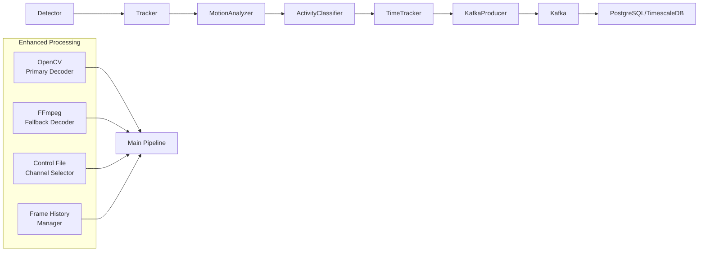
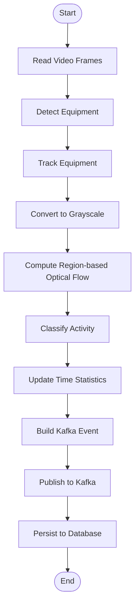
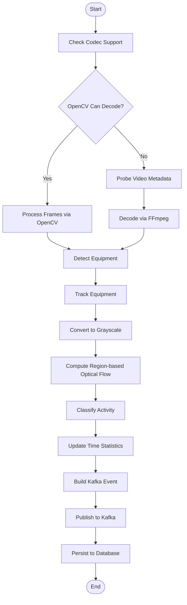
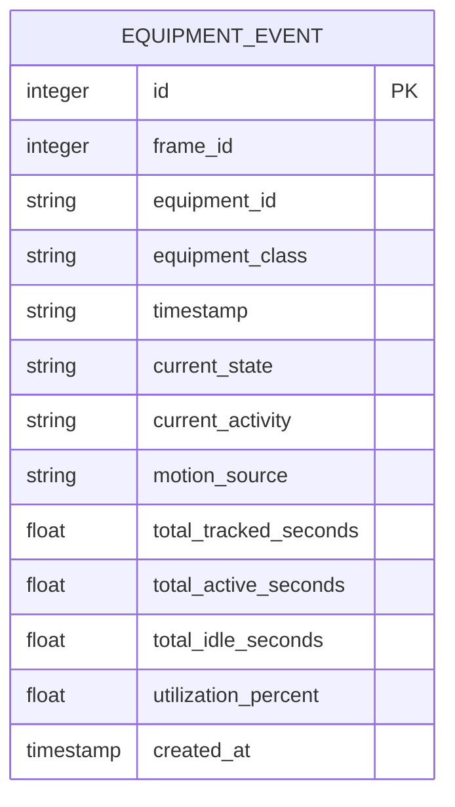

# Computer Vision Pipeline

<cite>
**Referenced Files in This Document**
- [README.md](file://README.md)
- [settings.yaml](file://config/settings.yaml)
- [main.py](file://services/cv_service/src/main.py)
- [detector.py](file://services/cv_service/src/detector.py)
- [tracker.py](file://services/cv_service/src/tracker.py)
- [motion_analyzer.py](file://services/cv_service/src/motion_analyzer.py)
- [activity_classifier.py](file://services/cv_service/src/activity_classifier.py)
- [time_tracker.py](file://services/cv_service/src/time_tracker.py)
- [kafka_producer.py](file://services/cv_service/src/kafka_producer.py)
- [db_models.py](file://services/analytics_backend/src/db_models.py)
- [test_activity_classifier.py](file://tests/test_activity_classifier.py)
- [test_motion_analyzer.py](file://tests/test_motion_analyzer.py)
- [test_time_tracker.py](file://tests/test_time_tracker.py)
</cite>

## Update Summary
**Changes Made**
- Enhanced video processing capabilities with ffmpeg fallback mechanisms for unsupported codecs
- Added dynamic video channel switching through control files
- Implemented frame history management with MAX_FRAME_HISTORY controls
- Improved frame skipping with effective FPS calculation
- Added comprehensive error handling throughout the pipeline
- Enhanced frame annotation and visualization capabilities

## Table of Contents
1. [Introduction](#introduction)
2. [Project Structure](#project-structure)
3. [Core Components](#core-components)
4. [Architecture Overview](#architecture-overview)
5. [Detailed Component Analysis](#detailed-component-analysis)
6. [Enhanced Video Processing Pipeline](#enhanced-video-processing-pipeline)
7. [Dynamic Video Channel Management](#dynamic-video-channel-management)
8. [Frame History and Memory Management](#frame-history-and-memory-management)
9. [Dependency Analysis](#dependency-analysis)
10. [Performance Considerations](#performance-considerations)
11. [Troubleshooting Guide](#troubleshooting-guide)
12. [Conclusion](#conclusion)
13. [Appendices](#appendices)

## Introduction
This document explains the computer vision processing pipeline that powers equipment monitoring. The pipeline performs multi-stage processing on video streams to detect, track, and classify construction equipment activities in real time. It integrates YOLOv8 object detection, ByteTrack multi-object tracking, region-based optical flow analysis, rule-based activity classification, and utilization time tracking. The pipeline publishes structured events to Apache Kafka for downstream analytics and dashboard consumption.

The pipeline is designed for CPU-only environments with aggressive optimizations (frame skipping, resizing, and lightweight models) to enable real-time processing on modest hardware. It uses a zero-shot approach for detection (COCO classes mapped to construction vehicles) and a region-based optical flow technique to distinguish articulated motion (e.g., excavator arm) from whole-body motion.

**Updated** Enhanced with advanced video processing capabilities including ffmpeg fallback mechanisms, dynamic video channel switching, and comprehensive error handling for production-grade reliability.

## Project Structure
The pipeline is implemented as a modular Python service with clear separation of concerns. The central orchestrator coordinates all stages, while specialized modules handle detection, tracking, motion analysis, classification, and time accounting. Configuration is centralized in a YAML file, and events are streamed to Kafka for persistence and visualization.

**Diagram sources**
- [main.py:48-721](file://services/cv_service/src/main.py#L48-L721)
- [detector.py:18-170](file://services/cv_service/src/detector.py#L18-L170)
- [tracker.py:19-341](file://services/cv_service/src/tracker.py#L19-L341)
- [motion_analyzer.py:24-442](file://services/cv_service/src/motion_analyzer.py#L24-L442)
- [activity_classifier.py:23-306](file://services/cv_service/src/activity_classifier.py#L23-L306)
- [time_tracker.py:21-265](file://services/cv_service/src/time_tracker.py#L21-L265)
- [kafka_producer.py:17-228](file://services/cv_service/src/kafka_producer.py#L17-L228)

**Section sources**
- [README.md:1-391](file://README.md#L1-L391)
- [settings.yaml:1-59](file://config/settings.yaml#L1-L59)

## Core Components
This section outlines the five core stages of the pipeline and their roles:

- EquipmentDetector: Runs YOLOv8 to detect vehicles/equipment in each frame and filters results to target classes.
- EquipmentTracker: Assigns persistent IDs to detections using ByteTrack and maintains track continuity across frames.
- MotionAnalyzer: Computes region-based optical flow (upper arm/boom vs lower base/tracks) to classify motion sources.
- ActivityClassifier: Applies rule-based logic with N-frame smoothing to classify activities (DIGGING, SWINGING_LOADING, DUMPING, WAITING).
- TimeTracker: Accumulates utilization time per equipment and computes utilization percentages.

Each stage produces structured outputs consumed by the next stage, culminating in Kafka events enriched with time analytics.

**Updated** Enhanced with video processing orchestration, dynamic channel management, and frame history controls.

**Section sources**
- [detector.py:18-170](file://services/cv_service/src/detector.py#L18-L170)
- [tracker.py:19-341](file://services/cv_service/src/tracker.py#L19-L341)
- [motion_analyzer.py:24-442](file://services/cv_service/src/motion_analyzer.py#L24-L442)
- [activity_classifier.py:23-306](file://services/cv_service/src/activity_classifier.py#L23-L306)
- [time_tracker.py:21-265](file://services/cv_service/src/time_tracker.py#L21-L265)

## Architecture Overview
The pipeline is orchestrated by a single entry point that iterates frames, applies detection and tracking, analyzes motion, classifies activities, tracks utilization, and publishes events. The orchestrator manages configuration, resource initialization, and graceful shutdown.

**Diagram sources**
- [main.py:229-395](file://services/cv_service/src/main.py#L229-L395)
- [detector.py:85-170](file://services/cv_service/src/detector.py#L85-L170)
- [tracker.py:159-265](file://services/cv_service/src/tracker.py#L159-L265)
- [motion_analyzer.py:88-167](file://services/cv_service/src/motion_analyzer.py#L88-L167)
- [activity_classifier.py:71-126](file://services/cv_service/src/activity_classifier.py#L71-L126)
- [time_tracker.py:53-121](file://services/cv_service/src/time_tracker.py#L53-L121)
- [kafka_producer.py:91-169](file://services/cv_service/src/kafka_producer.py#L91-L169)

## Detailed Component Analysis

### EquipmentDetector (YOLOv8)
- Purpose: Detect vehicles/equipment using YOLOv8 and filter to target classes.
- Inputs: Single BGR frame.
- Outputs: List of detections with bounding boxes, confidence, class ID, and class name.
- Key configuration:
  - model: Path to YOLOv8 model weights.
  - confidence_threshold: Minimum detection confidence.
  - device: CPU/CUDA device selection.
  - input_size: Inference resolution.
  - target_classes: COCO class IDs mapped to equipment (e.g., [2, 5, 7]).
  - class_names: Mapping from class IDs to friendly names.

Implementation highlights:
- Validates configuration keys and loads the model.
- Runs inference and parses results into a standardized format.
- Filters detections by confidence and target classes.

Practical example:
- A frame containing a truck triggers detection with a high-confidence bounding box and class name "truck".

**Section sources**
- [detector.py:18-170](file://services/cv_service/src/detector.py#L18-L170)
- [settings.yaml:8-20](file://config/settings.yaml#L8-L20)

### EquipmentTracker (ByteTrack)
- Purpose: Assign persistent equipment IDs to detections and maintain track continuity.
- Inputs: Detections from EquipmentDetector and the current frame.
- Outputs: Tracked objects with equipment_id, equipment_class, bbox, confidence, and internal track_id.
- Key configuration:
  - track_thresh: Detection confidence threshold for track activation.
  - track_buffer: Frames to keep lost tracks alive.
  - match_thresh: IOU threshold for matching detections to tracks.
  - equipment_id_prefix: Prefix mapping per class (e.g., truck -> "DT").

Implementation highlights:
- Converts detections to supervision format and updates the tracker.
- Generates unique equipment IDs with class-based prefixes.
- Uses IoU-based matching to associate tracked detections with original detections.

Practical example:
- A newly detected truck gets equipment_id "DT-001" and persists across frames.

**Section sources**
- [tracker.py:19-341](file://services/cv_service/src/tracker.py#L19-L341)
- [settings.yaml:21-30](file://config/settings.yaml#L21-L30)

### MotionAnalyzer (Region-based Optical Flow)
- Purpose: Detect motion sources by computing optical flow in upper and lower regions of tracked equipment bounding boxes.
- Inputs: Previous and current grayscale frames, tracked objects.
- Outputs: Motion classification per tracked object (full_body, arm_only, none) with flow statistics and dominant direction.
- Key configuration:
  - magnitude_threshold: Minimum optical flow magnitude to consider motion.
  - upper_region_ratio: Fraction of bbox height for upper region (default 0.5).
  - flow_method: Optical flow algorithm (currently Farneback).

Implementation highlights:
- Clips bounding boxes to frame boundaries and validates sizes.
- Splits each region and computes dense optical flow.
- Computes mean magnitudes and flow vectors per region.
- Classifies motion source based on region magnitudes and determines dominant direction.

Practical example:
- Upper region motion with high vertical flow indicates arm_only motion; lower region motion indicates full_body motion.

**Section sources**
- [motion_analyzer.py:24-442](file://services/cv_service/src/motion_analyzer.py#L24-L442)
- [settings.yaml:31-35](file://config/settings.yaml#L31-L35)

### ActivityClassifier (Rule-based Classification)
- Purpose: Classify equipment activity using motion analysis results and N-frame smoothing.
- Inputs: Tracked objects and motion results.
- Outputs: Activity classification per equipment (DIGGING, SWINGING_LOADING, DUMPING, WAITING) with state and motion source.
- Key configuration:
  - smoothing_window: N-frame smoothing window.
  - vertical_flow_threshold: Vertical motion threshold for arm-only activities.
  - horizontal_flow_threshold: Horizontal motion threshold for swinging/loading.

Implementation highlights:
- Builds a motion map keyed by equipment_id.
- Applies raw classification rules:
  - arm_only with dominant downward motion -> DIGGING
  - arm_only with dominant upward motion -> DUMPING
  - horizontal motion -> SWINGING_LOADING
  - no motion -> WAITING
- Applies N-frame smoothing via mode-based voting to prevent flickering.
- Maps activity to state: ACTIVE for non-WAITING, INACTIVE otherwise.

Practical example:
- An excavator arm moving downward is classified as DIGGING; smoothing prevents rapid flips.

**Section sources**
- [activity_classifier.py:23-306](file://services/cv_service/src/activity_classifier.py#L23-L306)
- [settings.yaml:36-40](file://config/settings.yaml#L36-L40)

### TimeTracker (Utilization Time Tracking)
- Purpose: Track total tracked seconds, active seconds, idle seconds, and utilization percentage per equipment.
- Inputs: Tracked objects, activities, frame timestamp, and FPS.
- Outputs: Aggregated time analytics per equipment and helpers for totals.
- Key behavior:
  - Initializes per-equipment counters on first appearance.
  - Increments total_tracked_seconds every processed frame.
  - Increments total_active_seconds if current_state is ACTIVE, else total_idle_seconds.
  - Calculates utilization_percent as total_active_seconds / total_tracked_seconds.
  - Persists counters across temporary disappearances.

Practical example:
- Over 10 seconds of processing at 30 FPS, a piece of equipment accumulating 7 seconds active yields 70% utilization.

**Section sources**
- [time_tracker.py:21-265](file://services/cv_service/src/time_tracker.py#L21-L265)

### Kafka Producer (Event Publishing)
- Purpose: Publish structured events to Kafka topic "equipment-events".
- Inputs: Event dictionary built from pipeline outputs.
- Key schema:
  - frame_id, equipment_id, equipment_class, timestamp
  - utilization: current_state, current_activity, motion_source
  - time_analytics: total_tracked_seconds, total_active_seconds, total_idle_seconds, utilization_percent
- Behavior:
  - Serializes events to JSON.
  - Partitions by equipment_id for ordering.
  - Asynchronous produce with delivery callbacks and retry logic.
  - Flushes remaining messages on completion.

Practical example:
- A frame with a truck classified as ACTIVE in DIGGING state generates a Kafka message with time analytics.

**Section sources**
- [kafka_producer.py:17-228](file://services/cv_service/src/kafka_producer.py#L17-L228)
- [settings.yaml:41-46](file://config/settings.yaml#L41-L46)

## Enhanced Video Processing Pipeline

**Updated** The pipeline now includes sophisticated video processing capabilities with automatic codec detection and fallback mechanisms.

### Video Codec Support and Fallback Mechanisms
The enhanced pipeline automatically detects codec compatibility and employs ffmpeg as a fallback for unsupported codecs:

- **OpenCV First Approach**: Attempts to decode videos using OpenCV's VideoCapture
- **Automatic Fallback Detection**: If OpenCV fails or reports unsupported codecs, automatically switches to ffmpeg subprocess
- **FFprobe Metadata Extraction**: Uses ffprobe to extract video metadata (FPS, dimensions, frame count)
- **Raw Frame Extraction**: ffmpeg extracts raw BGR24 frames for consistent processing

### Advanced Frame Processing
- **Frame Skipping Optimization**: Processes only every Nth frame based on configuration (`frame_skip`)
- **Effective FPS Calculation**: Calculates effective processing FPS accounting for frame skipping
- **Smart Resizing**: Maintains aspect ratio while resizing frames to configured width
- **Timestamp Generation**: Creates precise timestamps in HH:MM:SS.mmm format

### Comprehensive Error Handling
- **Codec Failure Recovery**: Automatic fallback to ffmpeg when OpenCV cannot decode
- **Graceful Degradation**: Continues processing with reduced functionality when components fail
- **Resource Cleanup**: Proper cleanup of video resources and subprocess handles
- **Logging and Monitoring**: Extensive logging for debugging and operational monitoring

**Section sources**
- [main.py:195-395](file://services/cv_service/src/main.py#L195-L395)
- [settings.yaml:3-6](file://config/settings.yaml#L3-L6)

## Dynamic Video Channel Management

**Updated** The pipeline now supports dynamic video channel switching through control files for flexible multi-camera setups.

### Control File System
The system uses a simple text file mechanism for video channel selection:

- **Control File Location**: `/app/frames/selected_video.txt`
- **Format**: Plain text containing video filename or "all" for sequential processing
- **Real-time Updates**: CV service checks for control file changes every 10 frames
- **Graceful Switching**: Current video processing completes before switching channels

### Channel Selection Logic
- **Specific Channel**: When a filename is specified, only that video is processed
- **All Channels**: When "all" is specified or file is missing, sequential processing occurs
- **Runtime Changes**: Channel can be switched during processing without restarting the service
- **State Reset**: Pipeline components are reset when switching between channels

### Integration with Dashboard
The control system integrates with the analytics dashboard for remote channel management:
- **Web Interface**: Users can select channels through the Streamlit dashboard
- **API Endpoint**: REST API endpoint `/api/videos/select` for programmatic control
- **Status Reporting**: Current channel selection is displayed in the dashboard

**Section sources**
- [main.py:630-781](file://services/cv_service/src/main.py#L630-L781)
- [api.py:596-613](file://services/analytics_backend/src/api.py#L596-L613)

## Frame History and Memory Management

**Updated** Enhanced frame management system with controlled history retention and memory optimization.

### Frame History Controls
The system maintains a controlled history of processed frames:

- **MAX_FRAME_HISTORY**: Configurable limit for retained frames (default: 100 frames)
- **Latest Frame**: Always maintains the most recent annotated frame for live preview
- **Periodic Cleanup**: Old frames are automatically cleaned up to control memory usage
- **JPEG Compression**: Frames saved with optimized compression settings

### Memory Optimization Features
- **Selective Retention**: Only retains frames that exceed the cleanup threshold
- **Efficient Storage**: Uses JPEG format with quality settings optimized for visualization
- **Cleanup Triggers**: Cleanup runs every 50 processed frames to balance performance and memory
- **Error Resilience**: Cleanup operations don't interrupt video processing

### Visualization Benefits
- **Live Preview**: Dashboard always displays the latest processed frame
- **Historical Analysis**: Ability to review recent frames for debugging and validation
- **Performance Monitoring**: Frame history helps monitor processing performance and quality

**Section sources**
- [main.py:35-36](file://services/cv_service/src/main.py#L35-L36)
- [main.py:518-628](file://services/cv_service/src/main.py#L518-L628)
- [settings.yaml:3-6](file://config/settings.yaml#L3-L6)

## Dependency Analysis
The pipeline exhibits clear stage-to-stage dependencies and external integrations:

- Stage dependencies:
  - Detector -> Tracker (detections to tracked objects)
  - Tracker -> MotionAnalyzer (tracked objects to motion results)
  - MotionAnalyzer -> ActivityClassifier (motion results to activities)
  - ActivityClassifier -> TimeTracker (activities to time stats)
  - TimeTracker -> KafkaProducer (events to Kafka)
- External dependencies:
  - YOLOv8 model for detection.
  - ByteTrack via supervision for tracking.
  - OpenCV for optical flow and image processing.
  - Kafka for event streaming.
  - PostgreSQL/TimescaleDB for persistence.
  - FFmpeg for codec fallback processing.

**Diagram sources**
- [main.py:229-395](file://services/cv_service/src/main.py#L229-L395)
- [kafka_producer.py:91-169](file://services/cv_service/src/kafka_producer.py#L91-L169)

**Section sources**
- [main.py:104-142](file://services/cv_service/src/main.py#L104-L142)
- [kafka_producer.py:17-228](file://services/cv_service/src/kafka_producer.py#L17-L228)

## Performance Considerations
- CPU-first design:
  - YOLOv8n (nano) reduces parameter count and improves speed.
  - Frame skipping (default 3) reduces processing load.
  - Resize width (default 640) lowers pixel count.
  - Crop-based optical flow avoids full-frame computation.
- **Enhanced Performance Features**:
  - **Automatic Codec Detection**: Reduces processing overhead by avoiding unsupported codecs.
  - **Effective FPS Calculation**: Accurate timing accounting for frame skipping.
  - **Memory Management**: Controlled frame history prevents memory exhaustion.
  - **Graceful Degradation**: Maintains operation even when individual components fail.
- Practical tuning guidelines:
  - Increase smoothing_window to reduce flickering.
  - Adjust magnitude_threshold and flow thresholds for sensitivity.
  - Increase frame_skip or reduce resize_width for CPU savings.
  - Monitor frame history cleanup to balance memory usage.

## Troubleshooting Guide
Common issues and resolutions:

- Detection failures:
  - Verify model path and device availability.
  - Adjust confidence_threshold and target_classes.
- Tracking gaps:
  - Tune track_thresh, track_buffer, and match_thresh.
  - Ensure sufficient overlap between frames for matching.
- Motion classification anomalies:
  - Check magnitude_threshold and upper_region_ratio.
  - Validate frame quality and lighting conditions.
- Activity flickering:
  - Increase smoothing_window.
  - Review horizontal and vertical thresholds.
- Time tracking inconsistencies:
  - Confirm FPS passed to update() matches video FPS.
  - Ensure activities include current_state consistently.
- Kafka publishing errors:
  - Verify bootstrap_servers and topic configuration.
  - Check producer buffer limits and network connectivity.
- **Enhanced Troubleshooting**:
  - **Codec Issues**: Check ffmpeg installation and permissions if fallback fails.
  - **Video Channel Problems**: Verify control file permissions and path correctness.
  - **Memory Issues**: Monitor frame history cleanup and adjust MAX_FRAME_HISTORY.
  - **Performance Degradation**: Check effective FPS calculations and frame skipping settings.

**Section sources**
- [detector.py:68-84](file://services/cv_service/src/detector.py#L68-L84)
- [tracker.py:61-84](file://services/cv_service/src/tracker.py#L61-L84)
- [motion_analyzer.py:72-87](file://services/cv_service/src/motion_analyzer.py#L72-L87)
- [activity_classifier.py:56-69](file://services/cv_service/src/activity_classifier.py#L56-L69)
- [time_tracker.py:82-87](file://services/cv_service/src/time_tracker.py#L82-L87)
- [kafka_producer.py:59-69](file://services/cv_service/src/kafka_producer.py#L59-L69)

## Conclusion
The pipeline combines efficient computer vision primitives with robust state management to deliver real-time equipment monitoring. By leveraging region-based optical flow and rule-based classification, it accurately distinguishes articulated motion from whole-body movement, enabling precise activity classification and utilization tracking. The modular design, centralized configuration, and event-driven architecture support scalability and maintainability.

**Updated** The enhanced pipeline now provides production-grade reliability with automatic codec fallback, dynamic channel management, comprehensive error handling, and efficient memory management, making it suitable for enterprise-scale equipment monitoring deployments.

## Appendices

### Practical Example: End-to-End Workflow
- Input: A video file placed in the configured input directory.
- Processing:
  - Frame iteration with resizing and skipping.
  - YOLOv8 detection of target classes.
  - ByteTrack assignment of persistent equipment IDs.
  - Region-based optical flow analysis to classify motion sources.
  - Rule-based activity classification with smoothing.
  - Time tracking and utilization computation.
  - Kafka event publication.
- Output: Events stored in PostgreSQL/TimescaleDB and visualized in the dashboard.

### Enhanced Video Processing Flow
**Updated** The enhanced processing includes codec detection and fallback mechanisms:

**Section sources**
- [main.py:229-395](file://services/cv_service/src/main.py#L229-L395)

### Configuration Reference
Key parameters and their impact:
- video.frame_skip: Controls processing rate.
- video.resize_width: Reduces inference cost.
- detection.model/confidence_threshold/device/input_size/target_classes/class_names: Detection behavior.
- tracking.track_thresh/track_buffer/match_thresh/equipment_id_prefix: Tracking behavior.
- motion.magnitude_threshold/upper_region_ratio/flow_method: Motion analysis behavior.
- activity.smoothing_window/vertical_flow_threshold/horizontal_flow_threshold: Classification behavior.
- kafka.bootstrap_servers/topic/client_id/consumer_group: Event streaming behavior.
- database.host/port/name/user/password/uri: Persistence configuration.
- dashboard.api_url/refresh_interval/page_title: Dashboard behavior.
- **Enhanced Configuration**:
  - MAX_FRAME_HISTORY: Controls frame history retention.
  - selected_video.txt: Dynamic channel selection control file.

**Section sources**
- [settings.yaml:3-59](file://config/settings.yaml#L3-L59)

### Data Model for Persistence
Events are persisted in PostgreSQL with TimescaleDB support for time-series optimization. The model captures equipment state, activity, motion source, and utilization metrics.

**Diagram sources**
- [db_models.py:22-67](file://services/analytics_backend/src/db_models.py#L22-L67)

### Validation via Tests
Unit tests validate each component's behavior:
- ActivityClassifier tests cover rule-based classification and smoothing.
- MotionAnalyzer tests cover optical flow computation, region splitting, and direction detection.
- TimeTracker tests cover time accumulation, utilization calculation, and edge cases.

**Section sources**
- [test_activity_classifier.py:1-543](file://tests/test_activity_classifier.py#L1-L543)
- [test_motion_analyzer.py:1-411](file://tests/test_motion_analyzer.py#L1-L411)
- [test_time_tracker.py:1-482](file://tests/test_time_tracker.py#L1-L482)

### Enhanced Error Handling and Logging
**Updated** The pipeline includes comprehensive error handling and logging:

- **Video Processing Errors**: Automatic fallback to ffmpeg with detailed logging
- **Component Failures**: Graceful degradation with fallback mechanisms
- **Resource Management**: Proper cleanup of video resources and subprocess handles
- **Memory Management**: Controlled frame history with automatic cleanup
- **Channel Switching**: Safe switching between video channels without data loss

**Section sources**
- [main.py:224-227](file://services/cv_service/src/main.py#L224-L227)
- [main.py:389-396](file://services/cv_service/src/main.py#L389-L396)
- [main.py:608-628](file://services/cv_service/src/main.py#L608-L628)