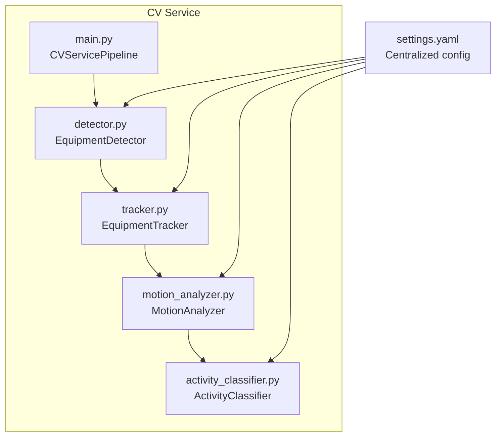
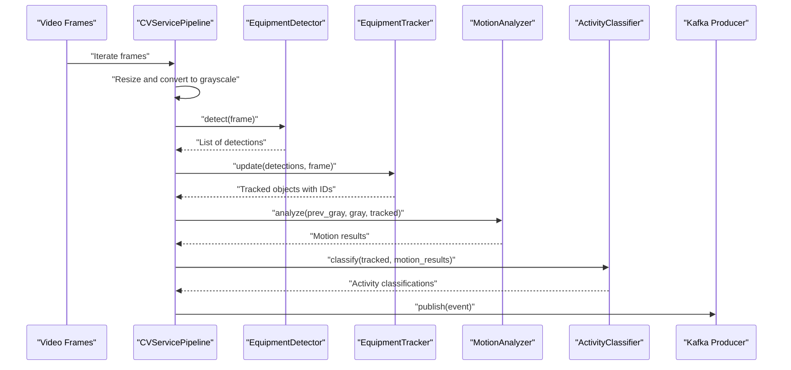
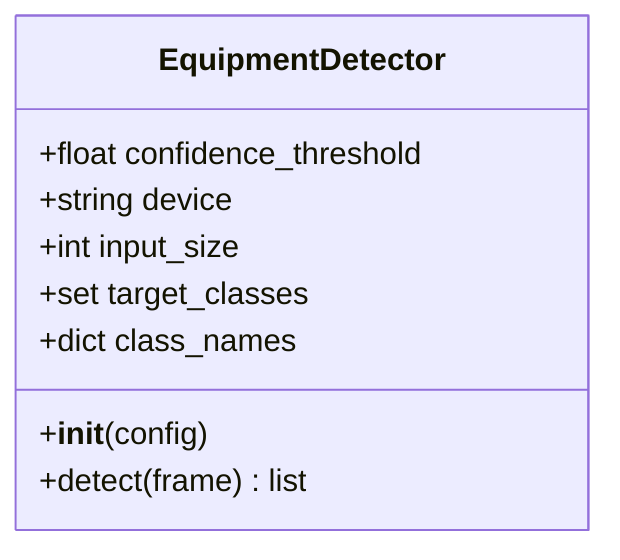
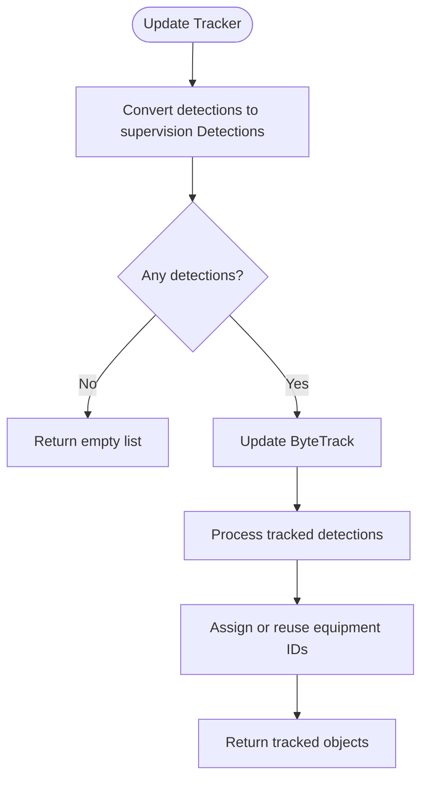
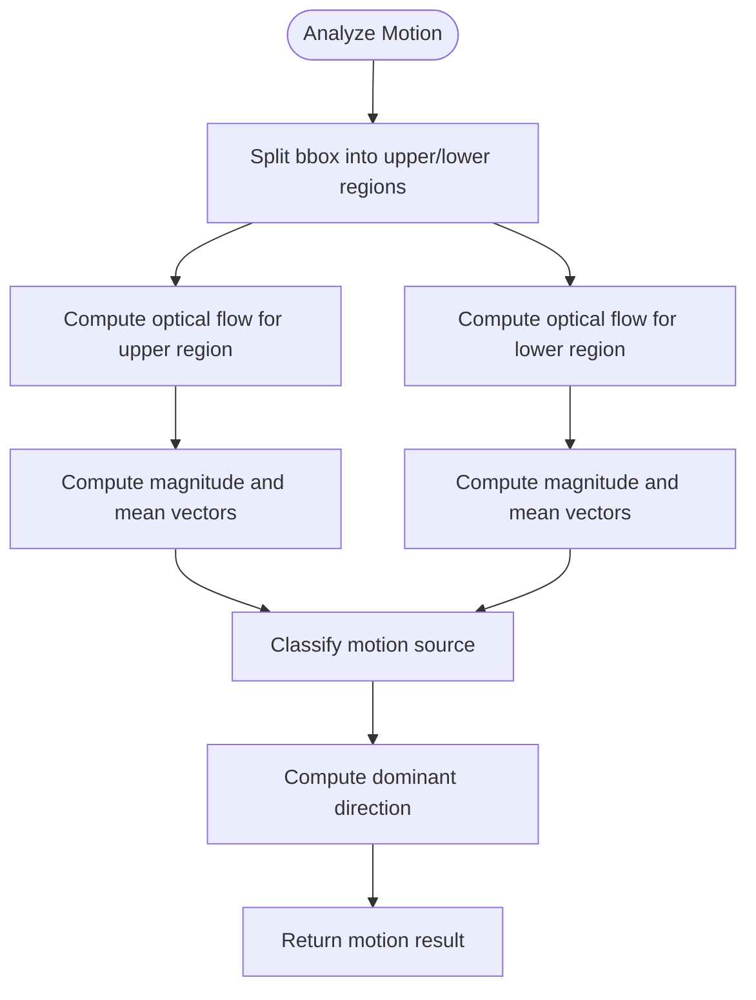
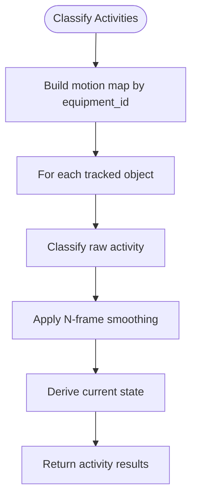
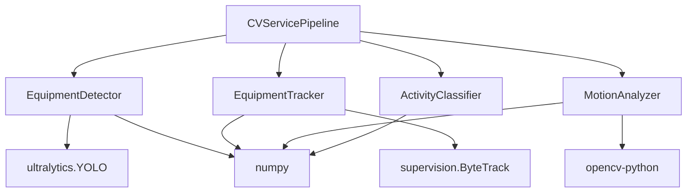

# Equipment Detection

<cite>
**Referenced Files in This Document**
- [detector.py](file://services/cv_service/src/detector.py)
- [settings.yaml](file://config/settings.yaml)
- [main.py](file://services/cv_service/src/main.py)
- [test_detector.py](file://tests/test_detector.py)
- [conftest.py](file://tests/conftest.py)
- [tracker.py](file://services/cv_service/src/tracker.py)
- [motion_analyzer.py](file://services/cv_service/src/motion_analyzer.py)
- [activity_classifier.py](file://services/cv_service/src/activity_classifier.py)
- [README.md](file://README.md)
</cite>

## Table of Contents
1. [Introduction](#introduction)
2. [Project Structure](#project-structure)
3. [Core Components](#core-components)
4. [Architecture Overview](#architecture-overview)
5. [Detailed Component Analysis](#detailed-component-analysis)
6. [Dependency Analysis](#dependency-analysis)
7. [Performance Considerations](#performance-considerations)
8. [Troubleshooting Guide](#troubleshooting-guide)
9. [Conclusion](#conclusion)
10. [Appendices](#appendices)

## Introduction
This document explains the equipment detection subsystem that identifies construction vehicles (cars, buses, trucks) in video frames using a YOLOv8-based object detection pipeline. It covers detector initialization, model loading, detection parameters, COCO class filtering, and integration with OpenCV for frame preprocessing and post-processing. Practical examples demonstrate confidence thresholds, bounding box processing, and class mapping from COCO to equipment categories. It also provides performance tuning guidance, model optimization techniques, and troubleshooting tips for false positives and missed detections.

## Project Structure
The equipment detection pipeline is implemented as part of the CV service and integrates with tracking, motion analysis, and activity classification modules. Configuration is centralized in a YAML file.

**Diagram sources**
- [detector.py:18-170](file://services/cv_service/src/detector.py#L18-L170)
- [tracker.py:19-341](file://services/cv_service/src/tracker.py#L19-L341)
- [motion_analyzer.py:24-442](file://services/cv_service/src/motion_analyzer.py#L24-L442)
- [activity_classifier.py:23-306](file://services/cv_service/src/activity_classifier.py#L23-L306)
- [main.py:42-571](file://services/cv_service/src/main.py#L42-L571)
- [settings.yaml:1-59](file://config/settings.yaml#L1-L59)

**Section sources**
- [main.py:104-142](file://services/cv_service/src/main.py#L104-L142)
- [settings.yaml:8-20](file://config/settings.yaml#L8-L20)

## Core Components
- EquipmentDetector: Loads a YOLOv8 model and runs inference on frames, filtering detections by COCO class IDs and confidence threshold. It returns structured detection results with bounding boxes, confidence scores, and class names.
- EquipmentTracker: Maintains persistent equipment IDs across frames using ByteTrack and converts detection dictionaries into tracked objects with friendly IDs.
- MotionAnalyzer: Computes region-based optical flow to distinguish articulated motion (arm_only) from full-body motion (full_body) and classifies dominant direction.
- ActivityClassifier: Applies rule-based logic with N-frame smoothing to classify activities (DIGGING, SWINGING_LOADING, DUMPING, WAITING) based on motion analysis results.
- CVServicePipeline: Orchestrates the entire pipeline, including frame iteration, resizing, grayscale conversion, and event building/publishing.

**Section sources**
- [detector.py:18-170](file://services/cv_service/src/detector.py#L18-L170)
- [tracker.py:19-341](file://services/cv_service/src/tracker.py#L19-L341)
- [motion_analyzer.py:24-442](file://services/cv_service/src/motion_analyzer.py#L24-L442)
- [activity_classifier.py:23-306](file://services/cv_service/src/activity_classifier.py#L23-L306)
- [main.py:42-571](file://services/cv_service/src/main.py#L42-L571)

## Architecture Overview
The equipment detection subsystem is part of a multi-stage pipeline that transforms raw video frames into structured events for downstream analytics and dashboards.

**Diagram sources**
- [main.py:323-372](file://services/cv_service/src/main.py#L323-L372)
- [detector.py:85-169](file://services/cv_service/src/detector.py#L85-L169)
- [tracker.py:159-264](file://services/cv_service/src/tracker.py#L159-L264)
- [motion_analyzer.py:88-166](file://services/cv_service/src/motion_analyzer.py#L88-L166)
- [activity_classifier.py:71-125](file://services/cv_service/src/activity_classifier.py#L71-L125)

## Detailed Component Analysis

### EquipmentDetector
The detector encapsulates YOLOv8 inference with configurable parameters and COCO class filtering.

- Initialization:
  - Validates required configuration keys: model path, confidence threshold, device, input size, target COCO class IDs, and class name mapping.
  - Loads the YOLOv8 model and logs initialization status.
- Detection:
  - Runs inference with imgsz, device, and verbose controls.
  - Parses results to extract bounding boxes, confidences, and class IDs.
  - Filters detections by target classes and confidence threshold.
  - Maps class IDs to friendly names and returns a list of detection dictionaries.

**Diagram sources**
- [detector.py:18-84](file://services/cv_service/src/detector.py#L18-L84)

Key configuration parameters and defaults:
- Model: yolov8n.pt
- Confidence threshold: 0.4
- Device: cpu
- Input size: 640
- Target classes: [2, 5, 7] (COCO: car, bus, truck)
- Class names mapping: {2: "car", 5: "bus", 7: "truck"}

Practical examples:
- Confidence threshold filtering: detections below 0.4 are discarded.
- Bounding box processing: boxes are returned as [x1, y1, x2, y2] lists.
- Class mapping: COCO class IDs mapped to friendly names for downstream use.

Integration with OpenCV:
- The detector expects BGR frames as numpy arrays.
- Inference internally resizes frames according to imgsz.

**Section sources**
- [detector.py:35-84](file://services/cv_service/src/detector.py#L35-L84)
- [detector.py:114-169](file://services/cv_service/src/detector.py#L114-L169)
- [settings.yaml:8-20](file://config/settings.yaml#L8-L20)
- [test_detector.py:81-112](file://tests/test_detector.py#L81-L112)

### EquipmentTracker
The tracker maintains persistent equipment IDs across frames using ByteTrack and converts detection dictionaries into tracked objects.

- Initialization:
  - Validates configuration keys for track thresholds, buffer, matching threshold, and equipment ID prefixes.
  - Initializes ByteTrack with supervision library.
- Update:
  - Converts detection dictionaries to supervision Detections format.
  - Updates ByteTrack and assigns friendly equipment IDs with class-based prefixes.
  - Matches tracked detections back to original detections by IoU to preserve class names.

**Diagram sources**
- [tracker.py:159-264](file://services/cv_service/src/tracker.py#L159-L264)

Configuration parameters:
- track_thresh: detection confidence threshold for track activation
- track_buffer: number of frames to keep lost tracks alive
- match_thresh: IoU threshold for matching detections to tracks
- equipment_id_prefix: mapping of class names to ID prefixes (e.g., truck: DT, car: VH, bus: BU)

**Section sources**
- [tracker.py:35-84](file://services/cv_service/src/tracker.py#L35-L84)
- [tracker.py:159-264](file://services/cv_service/src/tracker.py#L159-L264)
- [settings.yaml:21-29](file://config/settings.yaml#L21-L29)

### MotionAnalyzer
The motion analyzer performs region-based optical flow analysis to distinguish articulated motion from full-body motion.

- Initialization:
  - Validates magnitude threshold, upper region ratio, and flow method.
- Analysis:
  - Splits each tracked object’s bounding box into upper and lower regions.
  - Computes Farneback optical flow for each region.
  - Computes mean magnitudes and flow vectors, classifies motion source, and determines dominant direction.

**Diagram sources**
- [motion_analyzer.py:88-166](file://services/cv_service/src/motion_analyzer.py#L88-L166)
- [motion_analyzer.py:192-251](file://services/cv_service/src/motion_analyzer.py#L192-L251)

Configuration parameters:
- magnitude_threshold: minimum optical flow magnitude to consider as moving
- upper_region_ratio: fraction of bbox height for upper region (default 0.5)
- flow_method: optical flow algorithm (default Farneback)

**Section sources**
- [motion_analyzer.py:59-87](file://services/cv_service/src/motion_analyzer.py#L59-L87)
- [motion_analyzer.py:324-356](file://services/cv_service/src/motion_analyzer.py#L324-L356)
- [settings.yaml:31-34](file://config/settings.yaml#L31-L34)

### ActivityClassifier
The activity classifier applies rule-based logic with N-frame smoothing to classify equipment activities.

- Initialization:
  - Loads smoothing window, vertical flow threshold, and horizontal flow threshold.
- Classification:
  - Builds a motion map from motion results.
  - Classifies raw activity based on motion source and direction.
  - Applies N-frame smoothing to prevent flickering.
  - Determines current state (ACTIVE/INACTIVE) from smoothed activity.

**Diagram sources**
- [activity_classifier.py:71-125](file://services/cv_service/src/activity_classifier.py#L71-L125)
- [activity_classifier.py:233-258](file://services/cv_service/src/activity_classifier.py#L233-L258)

Configuration parameters:
- smoothing_window: N-frame smoothing window size (default 5)
- vertical_flow_threshold: threshold for vertical motion (default 1.5)
- horizontal_flow_threshold: threshold for horizontal motion (default 1.5)

**Section sources**
- [activity_classifier.py:46-69](file://services/cv_service/src/activity_classifier.py#L46-L69)
- [activity_classifier.py:166-232](file://services/cv_service/src/activity_classifier.py#L166-L232)
- [settings.yaml:37-39](file://config/settings.yaml#L37-L39)

### Integration with OpenCV
- Frame preprocessing:
  - Frames are resized to a configured width and converted to grayscale for motion analysis.
  - Grayscale conversion is performed before optical flow computation.
- Post-processing:
  - Detection results are parsed and filtered by confidence and class.
  - Tracked objects are returned with friendly equipment IDs and bounding boxes.

**Section sources**
- [main.py:236-244](file://services/cv_service/src/main.py#L236-L244)
- [main.py:351-352](file://services/cv_service/src/main.py#L351-L352)
- [detector.py:114-122](file://services/cv_service/src/detector.py#L114-L122)

## Dependency Analysis
The detector depends on YOLOv8 for inference and numpy for array operations. The tracker depends on supervision ByteTrack for multi-object tracking. The motion analyzer depends on OpenCV for optical flow. The activity classifier depends on the motion analyzer outputs. The pipeline orchestrator coordinates all components and publishes events to Kafka.

**Diagram sources**
- [detector.py:12](file://services/cv_service/src/detector.py#L12)
- [tracker.py:13](file://services/cv_service/src/tracker.py#L13)
- [motion_analyzer.py:17](file://services/cv_service/src/motion_analyzer.py#L17)
- [main.py:24-29](file://services/cv_service/src/main.py#L24-L29)

**Section sources**
- [detector.py:12](file://services/cv_service/src/detector.py#L12)
- [tracker.py:13](file://services/cv_service/src/tracker.py#L13)
- [motion_analyzer.py:17](file://services/cv_service/src/motion_analyzer.py#L17)
- [main.py:24-29](file://services/cv_service/src/main.py#L24-L29)

## Performance Considerations
- Model choice: YOLOv8n (nano) is selected for CPU-only environments to balance speed and accuracy.
- Frame skipping: Process every Nth frame to reduce computational load.
- Resize: Reduce frame width to decrease pixel count while maintaining acceptable accuracy.
- Crop-based flow: Compute optical flow only within bounding boxes to avoid full-frame computation.
- Device selection: Use CPU for inference; CUDA is supported but not enabled by default.

Tuning guidelines:
- Reduce flickering: increase smoothing_window (e.g., 7–10).
- More sensitive motion: lower magnitude_threshold (e.g., 1.5).
- CPU savings: increase frame_skip (e.g., 5) or reduce resize_width (e.g., 480).

**Section sources**
- [README.md:177-198](file://README.md#L177-L198)
- [README.md:307-312](file://README.md#L307-L312)
- [settings.yaml:3, 4, 5, 19, 20:3-20](file://config/settings.yaml#L3-L20)

## Troubleshooting Guide
Common issues and resolutions:
- False positives:
  - Increase confidence_threshold (e.g., from 0.4 to 0.5).
  - Narrow target_classes to only include expected equipment types.
  - Adjust class_names mapping to avoid ambiguous labels.
- Missed detections:
  - Decrease confidence_threshold to capture weaker predictions.
  - Reduce frame_skip to process more frames.
  - Increase resize_width to improve detection resolution.
- Tracking drift or ID swaps:
  - Tune match_thresh and track_buffer to stabilize tracks.
  - Ensure adequate overlap between frames for consistent matching.
- Motion misclassification:
  - Adjust magnitude_threshold to be more or less sensitive to motion.
  - Modify upper_region_ratio to better align with equipment geometry.
  - Increase smoothing_window to reduce flickering.

Validation and testing:
- Unit tests verify detection output format, filtering by confidence and class, and class name mapping.
- Fixtures provide realistic sample frames and detection/tracked/motion/activity structures for testing.

**Section sources**
- [test_detector.py:113-190](file://tests/test_detector.py#L113-L190)
- [test_detector.py:191-249](file://tests/test_detector.py#L191-L249)
- [conftest.py:74-164](file://tests/conftest.py#L74-L164)

## Conclusion
The equipment detection subsystem leverages YOLOv8 for robust vehicle detection, ByteTrack for persistent tracking, and region-based optical flow for articulated motion analysis. The modular design enables easy tuning of detection confidence, motion sensitivity, and activity classification thresholds. With CPU-friendly configurations and targeted optimizations, the pipeline delivers real-time performance suitable for production deployments.

## Appendices

### Detection Results Structure and Confidence Scoring
- Detection dictionary keys:
  - bbox: [x1, y1, x2, y2] as a list
  - confidence: detection confidence score (0–1)
  - class_id: COCO class ID (int)
  - class_name: friendly class name (e.g., "truck", "car", "bus")

Confidence scoring mechanism:
- Scores are extracted from YOLOv8 inference results and filtered against the configured threshold.

**Section sources**
- [detector.py:96-101](file://services/cv_service/src/detector.py#L96-L101)
- [detector.py:159-165](file://services/cv_service/src/detector.py#L159-L165)
- [test_detector.py:100-111](file://tests/test_detector.py#L100-L111)

### COCO Class Filtering Logic
- Target classes are defined as a set of COCO class IDs (e.g., [2, 5, 7]).
- During detection, only results whose class IDs belong to this set are retained.
- Class names mapping provides human-readable labels for downstream processing.

**Section sources**
- [detector.py:65, 149-150](file://services/cv_service/src/detector.py#L65,L149-L150)
- [settings.yaml:13-19](file://config/settings.yaml#L13-L19)

### Practical Examples
- Detection confidence threshold: adjust detection.confidence_threshold in settings.yaml.
- Bounding box processing: bbox coordinates are returned as lists for JSON serialization.
- Class mapping: COCO class IDs mapped to equipment categories via class_names.

**Section sources**
- [settings.yaml:10, 16-19](file://config/settings.yaml#L10,L16-L19)
- [test_detector.py:215-249](file://tests/test_detector.py#L215-L249)