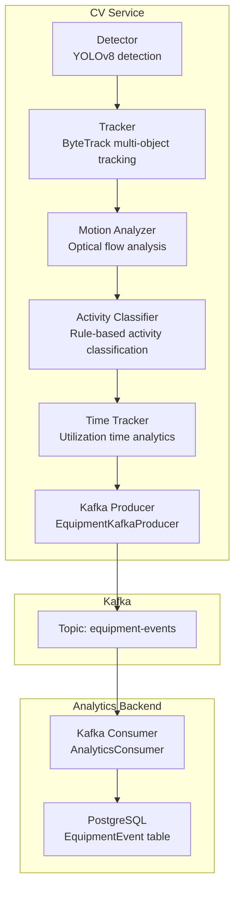
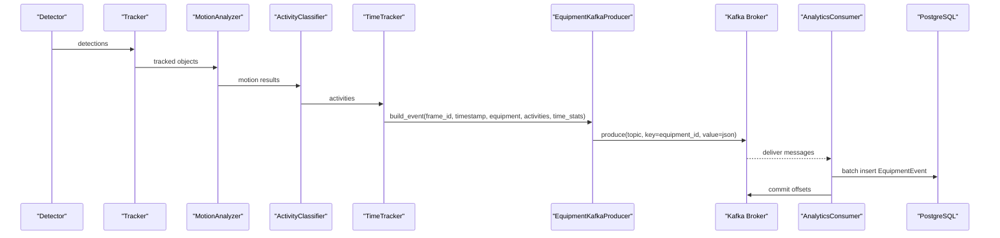
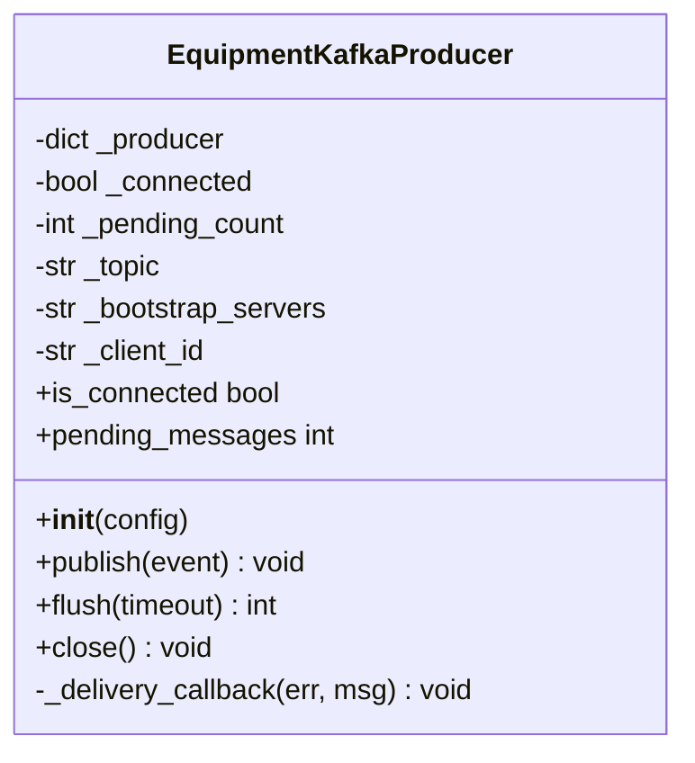
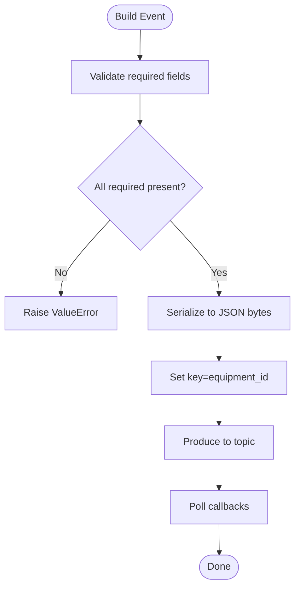
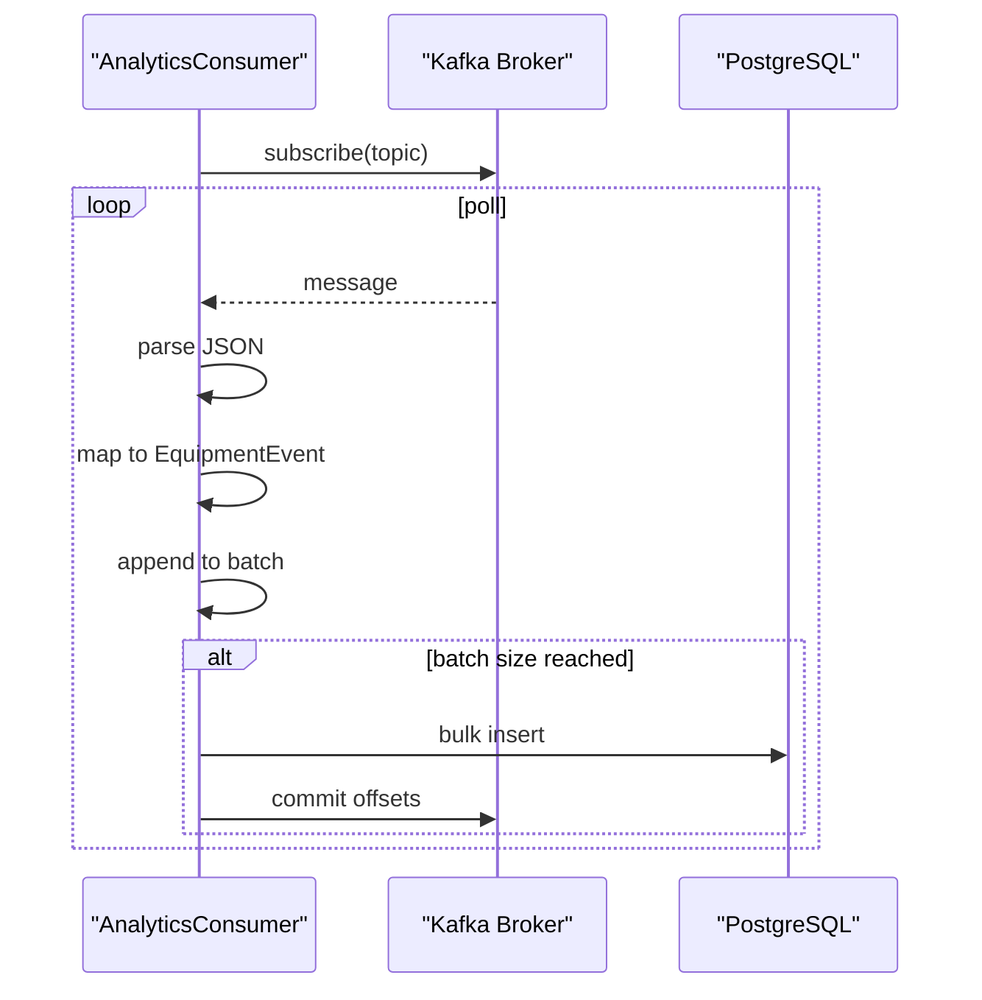
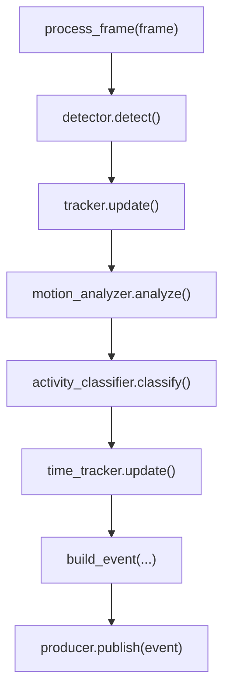
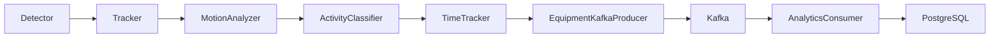

# Event Streaming

<cite>
**Referenced Files in This Document**
- [kafka_producer.py](file://services/cv_service/src/kafka_producer.py)
- [main.py](file://services/cv_service/src/main.py)
- [settings.yaml](file://config/settings.yaml)
- [consumer.py](file://services/analytics_backend/src/consumer.py)
- [db_models.py](file://services/analytics_backend/src/db_models.py)
- [detector.py](file://services/cv_service/src/detector.py)
- [tracker.py](file://services/cv_service/src/tracker.py)
- [motion_analyzer.py](file://services/cv_service/src/motion_analyzer.py)
- [activity_classifier.py](file://services/cv_service/src/activity_classifier.py)
- [time_tracker.py](file://services/cv_service/src/time_tracker.py)
</cite>

## Table of Contents
1. [Introduction](#introduction)
2. [Project Structure](#project-structure)
3. [Core Components](#core-components)
4. [Architecture Overview](#architecture-overview)
5. [Detailed Component Analysis](#detailed-component-analysis)
6. [Dependency Analysis](#dependency-analysis)
7. [Performance Considerations](#performance-considerations)
8. [Troubleshooting Guide](#troubleshooting-guide)
9. [Conclusion](#conclusion)
10. [Appendices](#appendices)

## Introduction
This document describes the event streaming subsystem responsible for publishing equipment utilization and activity events from the computer vision pipeline to Apache Kafka. It explains the Kafka producer implementation, configuration, event serialization, topic management, and message formatting. It also covers event schema structure, partitioning strategies, consumer coordination, performance characteristics, batching policies, retry mechanisms, and monitoring delivery success rates. Practical examples demonstrate event building from processing results, Kafka connection setup, and error handling strategies.

## Project Structure
The event streaming spans two services:
- Producer service (CV service): Orchestrates the video processing pipeline and publishes events to Kafka.
- Consumer service (Analytics backend): Subscribes to Kafka, deserializes events, and persists them to PostgreSQL.

**Diagram sources**
- [main.py:323-421](file://services/cv_service/src/main.py#L323-L421)
- [kafka_producer.py:17-228](file://services/cv_service/src/kafka_producer.py#L17-L228)
- [consumer.py:23-268](file://services/analytics_backend/src/consumer.py#L23-L268)
- [db_models.py:22-67](file://services/analytics_backend/src/db_models.py#L22-L67)

**Section sources**
- [main.py:1-571](file://services/cv_service/src/main.py#L1-L571)
- [settings.yaml:41-46](file://config/settings.yaml#L41-L46)

## Core Components
- EquipmentKafkaProducer: Asynchronous Kafka producer with delivery callbacks, retries, batching, and flush/close semantics.
- AnalyticsConsumer: Kafka consumer that reads events, parses JSON, batches writes, and commits offsets.
- EquipmentEvent model: SQLAlchemy ORM mapping for persistence.
- CV pipeline orchestration: Builds event payloads from processing results and invokes the producer.

Key responsibilities:
- Producer: Serialize event payload to JSON, set partition key to equipment_id, handle delivery callbacks, manage buffer backpressure, and flush pending messages.
- Consumer: Subscribe to topic, parse JSON, map fields to model, batch insert, and commit offsets.

**Section sources**
- [kafka_producer.py:17-228](file://services/cv_service/src/kafka_producer.py#L17-L228)
- [consumer.py:23-268](file://services/analytics_backend/src/consumer.py#L23-L268)
- [db_models.py:22-67](file://services/analytics_backend/src/db_models.py#L22-L67)
- [main.py:270-321](file://services/cv_service/src/main.py#L270-L321)

## Architecture Overview
The producer emits equipment events to a single Kafka topic. The consumer subscribes to the same topic, decodes JSON, and persists records to PostgreSQL. The producer uses a partition key derived from equipment_id to ensure ordering per equipment.

**Diagram sources**
- [main.py:323-421](file://services/cv_service/src/main.py#L323-L421)
- [kafka_producer.py:91-169](file://services/cv_service/src/kafka_producer.py#L91-L169)
- [consumer.py:93-200](file://services/analytics_backend/src/consumer.py#L93-L200)
- [db_models.py:22-67](file://services/analytics_backend/src/db_models.py#L22-L67)

## Detailed Component Analysis

### Producer: EquipmentKafkaProducer
- Initialization
  - Reads configuration keys: bootstrap_servers, topic, client_id.
  - Sets producer configuration for reliability and performance:
    - acks: "all" for durability.
    - retries and retry.backoff.ms for transient failures.
    - linger.ms and batch.size for batching.
    - socket.timeout.ms and request.timeout.ms for connection stability.
  - Creates Producer instance and logs initialization.

- Event Publishing
  - Validates required fields: frame_id, equipment_id, equipment_class, timestamp.
  - Serializes event to UTF-8 JSON bytes.
  - Uses equipment_id as the message key to ensure per-equipment ordering.
  - Produces asynchronously and triggers poll(0) to drain delivery callbacks.
  - Handles BufferError by polling briefly and retrying once.
  - Emits debug/info logs for delivery and errors.

- Delivery Callback
  - Decrements pending message count.
  - Logs error details on failure; logs partition/offset on success.

- Flush and Close
  - flush(timeout): blocks until pending messages are delivered or timeout.
  - close(): flushes with generous timeout, warns on remaining messages, resets state.

- Monitoring
  - is_connected property indicates connectivity.
  - pending_messages property exposes approximate queue depth.

**Diagram sources**
- [kafka_producer.py:17-228](file://services/cv_service/src/kafka_producer.py#L17-L228)

**Section sources**
- [kafka_producer.py:25-69](file://services/cv_service/src/kafka_producer.py#L25-L69)
- [kafka_producer.py:91-169](file://services/cv_service/src/kafka_producer.py#L91-L169)
- [kafka_producer.py:170-209](file://services/cv_service/src/kafka_producer.py#L170-L209)

### Event Schema and Message Formatting
- Producer enforces a strict event schema and validates required fields before publishing.
- Consumer expects a compatible schema for parsing.

Schema enforced by producer:
- frame_id: integer
- equipment_id: string
- equipment_class: string
- timestamp: string (HH:MM:SS.mmm)
- utilization: {
  - current_state: string ("ACTIVE" or "INACTIVE")
  - current_activity: string
  - motion_source: string
}
- time_analytics: {
  - total_tracked_seconds: float
  - total_active_seconds: float
  - total_idle_seconds: float
  - utilization_percent: float
}

**Diagram sources**
- [main.py:270-321](file://services/cv_service/src/main.py#L270-L321)
- [kafka_producer.py:125-149](file://services/cv_service/src/kafka_producer.py#L125-L149)

**Section sources**
- [main.py:270-321](file://services/cv_service/src/main.py#L270-L321)
- [kafka_producer.py:95-112](file://services/cv_service/src/kafka_producer.py#L95-L112)

### Topic Management and Partitioning
- Topic name is configured in settings.yaml and used by both producer and consumer.
- Partitioning strategy:
  - Message key is set to equipment_id, ensuring that all events for the same equipment are routed to the same partition.
  - This enables per-equipment ordering and simplifies downstream aggregation.

**Section sources**
- [settings.yaml:42-43](file://config/settings.yaml#L42-L43)
- [kafka_producer.py:131-132](file://services/cv_service/src/kafka_producer.py#L131-L132)

### Consumer Coordination and Persistence
- Consumer configuration:
  - Subscribes to the configured topic.
  - Uses manual commit for precise control.
  - Commits offsets after successful batch write.
- Persistence:
  - Maps parsed fields to EquipmentEvent model.
  - Batches inserts and commits periodically or when batch size threshold is reached.
  - Uses SQLAlchemy bulk_save_objects for efficient writes.

**Diagram sources**
- [consumer.py:93-200](file://services/analytics_backend/src/consumer.py#L93-L200)
- [db_models.py:22-67](file://services/analytics_backend/src/db_models.py#L22-L67)

**Section sources**
- [consumer.py:35-77](file://services/analytics_backend/src/consumer.py#L35-L77)
- [consumer.py:143-200](file://services/analytics_backend/src/consumer.py#L143-L200)
- [db_models.py:22-67](file://services/analytics_backend/src/db_models.py#L22-L67)

### Producer Configuration and Reliability
- Reliability:
  - acks=all ensures leader and in-sync replicas acknowledge.
  - retries=3 with retry.backoff.ms=100 mitigates transient failures.
- Performance:
  - linger.ms=5 and batch.size=16384 enable batching to reduce network overhead.
  - socket.timeout.ms and request.timeout.ms improve resilience under load.
- Backpressure:
  - On BufferError, producer polls briefly and retries once to avoid dropping events.

**Section sources**
- [kafka_producer.py:40-53](file://services/cv_service/src/kafka_producer.py#L40-L53)
- [kafka_producer.py:153-168](file://services/cv_service/src/kafka_producer.py#L153-L168)

### Consumer Configuration and Batch Policies
- Consumer group and topic are configured in settings.yaml.
- Manual commit policy with periodic flush and explicit commit after successful batch write.
- Batch size and timeout thresholds control throughput and latency trade-offs.

**Section sources**
- [settings.yaml:42-45](file://config/settings.yaml#L42-L45)
- [consumer.py:31-33](file://services/analytics_backend/src/consumer.py#L31-L33)
- [consumer.py:51-59](file://services/analytics_backend/src/consumer.py#L51-L59)
- [consumer.py:195-204](file://services/analytics_backend/src/consumer.py#L195-L204)

### Event Building Workflow
The CV pipeline constructs an event for each tracked equipment per frame:
- Extract equipment_id and equipment_class from tracked object.
- Retrieve activity classification and motion source from activity classifier.
- Derive current_state from activity classification.
- Retrieve time analytics for the equipment from time tracker.
- Build event dictionary and publish via EquipmentKafkaProducer.

**Diagram sources**
- [main.py:323-372](file://services/cv_service/src/main.py#L323-L372)
- [main.py:270-321](file://services/cv_service/src/main.py#L270-L321)
- [kafka_producer.py:91-169](file://services/cv_service/src/kafka_producer.py#L91-L169)

**Section sources**
- [main.py:323-421](file://services/cv_service/src/main.py#L323-L421)
- [main.py:270-321](file://services/cv_service/src/main.py#L270-L321)

## Dependency Analysis
- Producer depends on confluent_kafka Producer and JSON serialization.
- Consumer depends on confluent_kafka Consumer and SQLAlchemy ORM.
- CV pipeline composes detector, tracker, motion analyzer, activity classifier, and time tracker to produce events consumed by the analytics backend.

**Diagram sources**
- [main.py:24-29](file://services/cv_service/src/main.py#L24-L29)
- [kafka_producer.py:12-14](file://services/cv_service/src/kafka_producer.py#L12-L14)
- [consumer.py:15-18](file://services/analytics_backend/src/consumer.py#L15-L18)
- [db_models.py:12-15](file://services/analytics_backend/src/db_models.py#L12-L15)

**Section sources**
- [main.py:24-29](file://services/cv_service/src/main.py#L24-L29)
- [kafka_producer.py:12-14](file://services/cv_service/src/kafka_producer.py#L12-L14)
- [consumer.py:15-18](file://services/analytics_backend/src/consumer.py#L15-L18)
- [db_models.py:12-15](file://services/analytics_backend/src/db_models.py#L12-L15)

## Performance Considerations
- Batching and linger:
  - linger.ms=5 and batch.size=16384 balance throughput and latency.
- Retries and backoff:
  - retries=3 with retry.backoff.ms=100 reduce transient failure impact.
- Buffer backpressure:
  - On BufferError, poll briefly and retry once to prevent drops.
- Consumer batching:
  - BATCH_SIZE=100 and BATCH_TIMEOUT=5.0 optimize write throughput.
- Manual commit:
  - Ensures offsets are committed only after successful persistence.
- Time-series optimization:
  - TimescaleDB hypertable on created_at improves analytics performance.

**Section sources**
- [kafka_producer.py:40-53](file://services/cv_service/src/kafka_producer.py#L40-L53)
- [kafka_producer.py:153-168](file://services/cv_service/src/kafka_producer.py#L153-L168)
- [consumer.py:31-33](file://services/analytics_backend/src/consumer.py#L31-L33)
- [consumer.py:195-204](file://services/analytics_backend/src/consumer.py#L195-L204)
- [db_models.py:103-155](file://services/analytics_backend/src/db_models.py#L103-L155)

## Troubleshooting Guide
- Producer initialization failures:
  - KafkaException during Producer creation raises and logs error; verify bootstrap_servers and topic configuration.
- Missing required fields:
  - ValueError raised when event lacks frame_id, equipment_id, equipment_class, or timestamp.
- Delivery failures:
  - Delivery callback logs error string and topic/key; inspect broker logs and network connectivity.
- Buffer full conditions:
  - BufferError handled by polling and retry; monitor pending_messages to assess backpressure.
- Consumer errors:
  - JSON decode errors, Kafka exceptions, and DB commit failures are logged; ensure schema alignment and DB availability.
- Offset management:
  - Manual commit requires successful batch write; verify commit after flush.

**Section sources**
- [kafka_producer.py:59-68](file://services/cv_service/src/kafka_producer.py#L59-L68)
- [kafka_producer.py:125-129](file://services/cv_service/src/kafka_producer.py#L125-L129)
- [kafka_producer.py:153-168](file://services/cv_service/src/kafka_producer.py#L153-L168)
- [consumer.py:129-132](file://services/analytics_backend/src/consumer.py#L129-L132)
- [consumer.py:212-224](file://services/analytics_backend/src/consumer.py#L212-L224)

## Conclusion
The event streaming subsystem integrates tightly with the CV pipeline to publish equipment utilization and activity events reliably to Kafka. The producer emphasizes durability and performance with acknowledgments, retries, batching, and backpressure handling. The consumer focuses on robust ingestion, batching, and precise offset management. Together, they form a scalable foundation for downstream analytics and dashboards.

## Appendices

### Configuration Reference
- Kafka producer configuration keys:
  - bootstrap_servers, topic, client_id
- Kafka consumer configuration keys:
  - bootstrap_servers, topic, consumer_group

**Section sources**
- [settings.yaml:41-46](file://config/settings.yaml#L41-L46)
- [kafka_producer.py:35-37](file://services/cv_service/src/kafka_producer.py#L35-L37)
- [consumer.py:52-54](file://services/analytics_backend/src/consumer.py#L52-L54)

### Event Payload Mapping
- Producer event schema fields are mapped to EquipmentEvent model fields by the consumer.

**Section sources**
- [main.py:270-321](file://services/cv_service/src/main.py#L270-L321)
- [consumer.py:178-190](file://services/analytics_backend/src/consumer.py#L178-L190)
- [db_models.py:22-43](file://services/analytics_backend/src/db_models.py#L22-L43)