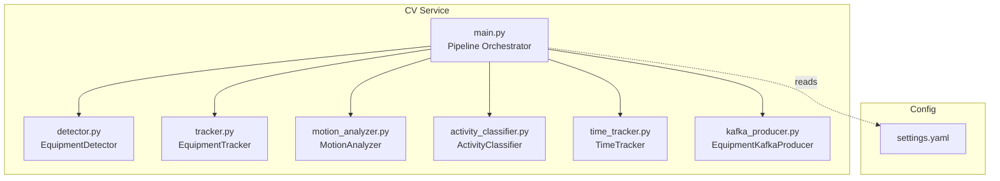
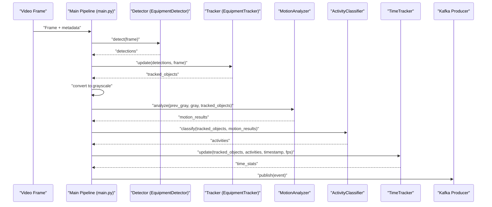
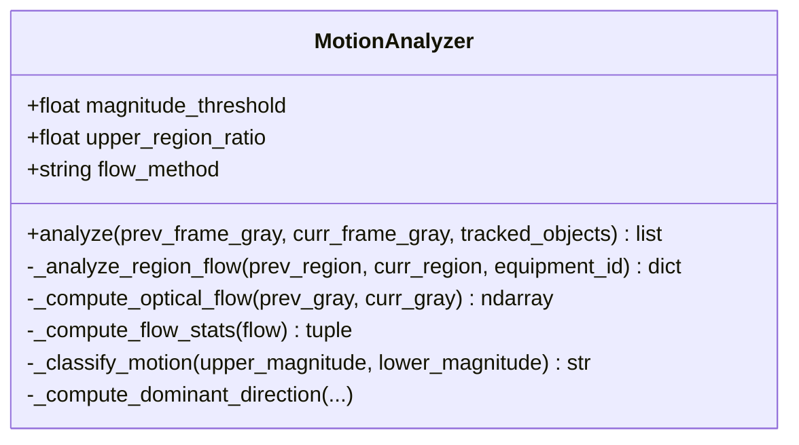
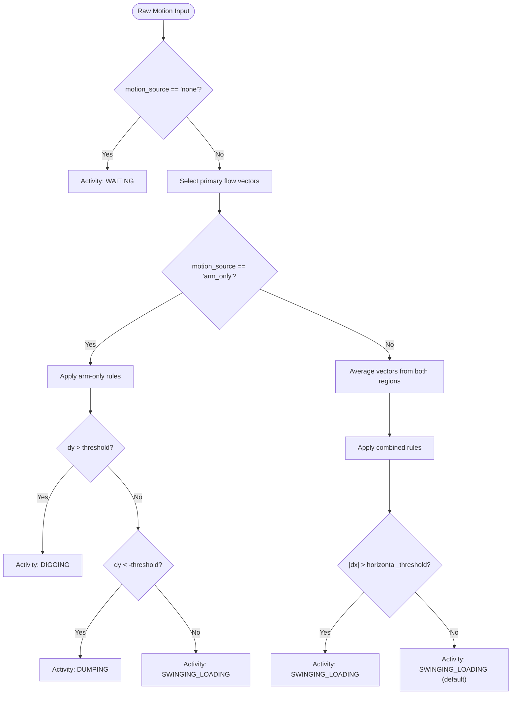
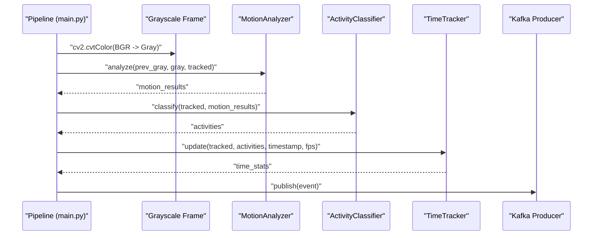
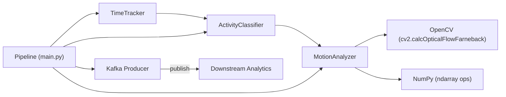

# Motion Analysis

<cite>
**Referenced Files in This Document**
- [motion_analyzer.py](file://services/cv_service/src/motion_analyzer.py)
- [activity_classifier.py](file://services/cv_service/src/activity_classifier.py)
- [main.py](file://services/cv_service/src/main.py)
- [settings.yaml](file://config/settings.yaml)
- [test_motion_analyzer.py](file://tests/test_motion_analyzer.py)
- [tracker.py](file://services/cv_service/src/tracker.py)
- [time_tracker.py](file://services/cv_service/src/time_tracker.py)
- [kafka_producer.py](file://services/cv_service/src/kafka_producer.py)
</cite>

## Table of Contents
1. [Introduction](#introduction)
2. [Project Structure](#project-structure)
3. [Core Components](#core-components)
4. [Architecture Overview](#architecture-overview)
5. [Detailed Component Analysis](#detailed-component-analysis)
6. [Dependency Analysis](#dependency-analysis)
7. [Performance Considerations](#performance-considerations)
8. [Troubleshooting Guide](#troubleshooting-guide)
9. [Conclusion](#conclusion)

## Introduction
This document explains the motion analysis subsystem that enables optical flow–based motion detection for construction equipment. The system distinguishes articulated motion (e.g., excavator arm moving while tracks remain still) from whole-body motion (e.g., driving), enabling accurate activity classification such as digging, swinging/loading, dumping, and waiting. It documents the MotionAnalyzer class, frame differencing techniques, motion vector calculation, region-based analysis, and the integration with grayscale frame processing. Practical examples demonstrate motion threshold tuning, motion source determination, and motion intensity analysis. The relationship between motion vectors and activity classification is explained, along with computational efficiency considerations, parameter tuning for different equipment types, and handling of camera motion artifacts.

## Project Structure
The motion analysis subsystem is part of the Computer Vision (CV) service pipeline. The relevant files are organized under services/cv_service/src, with configuration centralized in config/settings.yaml. Tests reside under tests and exercise the MotionAnalyzer behavior.

**Diagram sources**
- [main.py:104-142](file://services/cv_service/src/main.py#L104-L142)
- [motion_analyzer.py:24-87](file://services/cv_service/src/motion_analyzer.py#L24-L87)
- [activity_classifier.py:23-70](file://services/cv_service/src/activity_classifier.py#L23-L70)
- [settings.yaml:31-39](file://config/settings.yaml#L31-L39)

**Section sources**
- [main.py:104-142](file://services/cv_service/src/main.py#L104-L142)
- [settings.yaml:31-39](file://config/settings.yaml#L31-L39)

## Core Components
- MotionAnalyzer: Computes dense optical flow using Farneback on region-based sub-regions (upper/lower) of tracked equipment bounding boxes, classifies motion source, and determines dominant direction.
- ActivityClassifier: Translates motion analysis results into activity labels (digging, swinging/loading, dumping, waiting) using N-frame smoothing and thresholds.
- Pipeline integration: The main orchestrator converts frames to grayscale, runs detection and tracking, performs motion analysis, classifies activities, tracks time, and publishes events.

Key configuration parameters:
- motion.magnitude_threshold: Minimum optical flow magnitude to consider motion.
- motion.upper_region_ratio: Fraction of bounding box height for the upper (arm/boom) region.
- motion.flow_method: Optical flow method (currently Farneback).
- activity.smoothing_window: Frames to smooth activity classification.
- activity.vertical_flow_threshold and activity.horizontal_flow_threshold: Direction thresholds for activity rules.

**Section sources**
- [motion_analyzer.py:59-87](file://services/cv_service/src/motion_analyzer.py#L59-L87)
- [activity_classifier.py:46-69](file://services/cv_service/src/activity_classifier.py#L46-L69)
- [settings.yaml:31-39](file://config/settings.yaml#L31-L39)

## Architecture Overview
The motion analysis pipeline integrates detection, tracking, motion analysis, activity classification, time tracking, and event publishing.

**Diagram sources**
- [main.py:323-372](file://services/cv_service/src/main.py#L323-L372)
- [motion_analyzer.py:88-166](file://services/cv_service/src/motion_analyzer.py#L88-L166)
- [activity_classifier.py:71-125](file://services/cv_service/src/activity_classifier.py#L71-L125)

## Detailed Component Analysis

### MotionAnalyzer: Region-Based Optical Flow
The MotionAnalyzer class performs region-based optical flow analysis to distinguish articulated motion from whole-body motion.

- Region splitting: Each tracked object’s bounding box is split vertically into an upper region (e.g., arm/boom) and a lower region (e.g., base/tracks) using a configurable ratio.
- Dense optical flow: Farneback dense optical flow is computed independently for each region.
- Statistics: Magnitude and mean flow vectors (dx, dy) are computed per region.
- Classification: Motion source is classified as:
  - full_body: both regions exceed magnitude threshold
  - arm_only: only upper region exceeds threshold
  - full_body: only lower region exceeds threshold (driving with stationary arm)
  - none: neither region exceeds threshold
- Dominant direction: Determined from the region with higher motion magnitude, using OpenCV coordinate convention (y increasing downward).

**Diagram sources**
- [motion_analyzer.py:24-87](file://services/cv_service/src/motion_analyzer.py#L24-L87)
- [motion_analyzer.py:192-251](file://services/cv_service/src/motion_analyzer.py#L192-L251)
- [motion_analyzer.py:324-355](file://services/cv_service/src/motion_analyzer.py#L324-L355)
- [motion_analyzer.py:357-417](file://services/cv_service/src/motion_analyzer.py#L357-L417)

Practical examples and usage patterns:
- Motion threshold setting: Adjust motion.magnitude_threshold to filter noise and camera shake. Higher thresholds reduce false positives but risk missing subtle motion.
- Motion source determination:
  - arm_only indicates articulated motion (e.g., digging, swinging).
  - full_body indicates either whole-body motion (driving) or lower-region-only motion (driving with stationary arm).
  - none indicates no significant motion.
- Motion intensity analysis: Compare upper_magnitude and lower_magnitude to understand which parts are moving and how strongly.
- Dominant direction: Use dominant_direction to infer motion orientation (up/down/left/right) for activity rules.

Integration with grayscale frames:
- The pipeline converts frames to grayscale before motion analysis. MotionAnalyzer expects grayscale arrays and operates on cropped sub-regions derived from tracked bounding boxes.

Relationship to activity classification:
- ActivityClassifier consumes motion_source, dominant_direction, and flow_vectors to classify activities. For example, arm_only with strong vertical downward motion is classified as digging; horizontal motion is classified as swinging/loading; arm_only with upward motion is dumping; otherwise, waiting or default swinging/loading depending on thresholds.

Computational efficiency considerations:
- Farneback parameters are tuned for construction equipment: pyramid scale, levels, averaging window size, iterations, and polynomial neighborhood parameters are preconfigured to balance accuracy and speed.
- Frame skipping reduces processing load; the pipeline skips frames based on video.frame_skip.
- Region size checks prevent unnecessary computation on tiny regions.

Handling camera motion artifacts:
- The system relies on relative motion within tracked regions. Camera shake affects both frames similarly, so dense optical flow differences cancel out spatially. However, large camera motion can overwhelm local flow; consider increasing magnitude_threshold or using higher-quality stabilization.

Parameter tuning for different equipment types:
- Excavators and cranes: Use moderate magnitude_threshold and adjust upper_region_ratio to capture boom/arm motion.
- Trucks and tractors: Increase lower-region sensitivity; full_body classification is common during travel.
- General tuning: Start with defaults in settings.yaml and adjust magnitude_threshold and upper_region_ratio based on observed false positives/negatives.

**Section sources**
- [motion_analyzer.py:88-166](file://services/cv_service/src/motion_analyzer.py#L88-L166)
- [motion_analyzer.py:192-251](file://services/cv_service/src/motion_analyzer.py#L192-L251)
- [motion_analyzer.py:253-293](file://services/cv_service/src/motion_analyzer.py#L253-L293)
- [motion_analyzer.py:294-322](file://services/cv_service/src/motion_analyzer.py#L294-L322)
- [motion_analyzer.py:324-355](file://services/cv_service/src/motion_analyzer.py#L324-L355)
- [motion_analyzer.py:357-417](file://services/cv_service/src/motion_analyzer.py#L357-L417)
- [settings.yaml:31-39](file://config/settings.yaml#L31-L39)
- [main.py:351-357](file://services/cv_service/src/main.py#L351-L357)

### ActivityClassifier: Motion-to-Activity Mapping
The ActivityClassifier translates motion analysis results into activity labels using rule-based logic and N-frame smoothing.

Rules:
- DIGGING: arm_only AND dominant vertical downward motion (dy > vertical_flow_threshold)
- SWINGING_LOADING: (arm_only OR full_body) AND horizontal motion (|dx| > horizontal_flow_threshold)
- DUMPING: arm_only AND dominant vertical upward motion (dy < -vertical_flow_threshold)
- WAITING: motion_source == "none"
- Default: SWINGING_LOADING when motion exists but no specific rule applies

Smoothing:
- N-frame mode-based smoothing prevents flickering between states by selecting the most frequent activity over the last N frames.

**Diagram sources**
- [activity_classifier.py:166-231](file://services/cv_service/src/activity_classifier.py#L166-L231)
- [activity_classifier.py:233-286](file://services/cv_service/src/activity_classifier.py#L233-L286)

**Section sources**
- [activity_classifier.py:71-125](file://services/cv_service/src/activity_classifier.py#L71-L125)
- [activity_classifier.py:166-231](file://services/cv_service/src/activity_classifier.py#L166-L231)
- [activity_classifier.py:233-286](file://services/cv_service/src/activity_classifier.py#L233-L286)

### Pipeline Integration and Results
The main pipeline orchestrates detection, tracking, motion analysis, activity classification, time tracking, and event publishing.

- Grayscale conversion: Frames are converted to grayscale for motion analysis.
- Motion analysis: MotionAnalyzer produces motion_source, magnitudes, dominant_direction, and flow_vectors per tracked object.
- Activity classification: ActivityClassifier maps motion results to activity labels with smoothing.
- Time tracking: TimeTracker accumulates utilization metrics per equipment.
- Event building and publishing: Events include equipment_id, equipment_class, timestamps, utilization, and time analytics.

**Diagram sources**
- [main.py:323-372](file://services/cv_service/src/main.py#L323-L372)
- [motion_analyzer.py:88-166](file://services/cv_service/src/motion_analyzer.py#L88-L166)
- [activity_classifier.py:71-125](file://services/cv_service/src/activity_classifier.py#L71-L125)
- [time_tracker.py:53-120](file://services/cv_service/src/time_tracker.py#L53-L120)
- [kafka_producer.py:91-169](file://services/cv_service/src/kafka_producer.py#L91-L169)

**Section sources**
- [main.py:323-372](file://services/cv_service/src/main.py#L323-L372)
- [kafka_producer.py:91-169](file://services/cv_service/src/kafka_producer.py#L91-L169)

## Dependency Analysis
The MotionAnalyzer depends on OpenCV for dense optical flow and NumPy for array operations. The pipeline composes multiple modules with clear interfaces.

**Diagram sources**
- [motion_analyzer.py:276-288](file://services/cv_service/src/motion_analyzer.py#L276-L288)
- [activity_classifier.py:166-231](file://services/cv_service/src/activity_classifier.py#L166-L231)
- [time_tracker.py:53-120](file://services/cv_service/src/time_tracker.py#L53-L120)
- [kafka_producer.py:91-169](file://services/cv_service/src/kafka_producer.py#L91-L169)

**Section sources**
- [motion_analyzer.py:276-288](file://services/cv_service/src/motion_analyzer.py#L276-L288)
- [activity_classifier.py:166-231](file://services/cv_service/src/activity_classifier.py#L166-L231)
- [time_tracker.py:53-120](file://services/cv_service/src/time_tracker.py#L53-L120)
- [kafka_producer.py:91-169](file://services/cv_service/src/kafka_producer.py#L91-L169)

## Performance Considerations
- Frame skipping: Reduce processing load by skipping frames (video.frame_skip). This lowers CPU usage but may reduce temporal resolution.
- Farneback tuning: Preconfigured parameters balance accuracy and speed for construction equipment. Adjust only if necessary.
- Region size checks: Prevents computation on tiny regions, avoiding unnecessary overhead.
- Grayscale conversion: Reduces dimensionality and speeds up optical flow computation.
- Smoothing: N-frame smoothing reduces flickering and stabilizes activity classification, trading off slight latency for stability.

[No sources needed since this section provides general guidance]

## Troubleshooting Guide
Common issues and resolutions:
- Invalid bounding boxes: The analyzer clips bounding boxes to frame boundaries and returns empty results for invalid or too-small regions. Ensure detection precedes tracking and that tracked objects have valid bboxes.
- Optical flow failures: Farneback computation can fail on very small or invalid regions. The analyzer logs errors and returns None, which leads to zero magnitudes and “none” motion classification.
- Threshold tuning: If motion is missed, increase magnitude_threshold slightly; if false positives occur, decrease it. Also adjust upper_region_ratio to better isolate arm/boom areas.
- Dominant direction ambiguity: When magnitudes are low, dominant_direction becomes “none.” Increase thresholds or improve lighting/textures in tracked regions.
- Camera motion artifacts: Large camera shake can overwhelm local flow. Consider increasing thresholds or stabilizing input video.

Validation and testing:
- Tests cover initialization, result formatting, bbox clipping, minimum region size, invalid bbox handling, and dominant direction computation. Use these as references for expected behavior.

**Section sources**
- [motion_analyzer.py:134-154](file://services/cv_service/src/motion_analyzer.py#L134-L154)
- [motion_analyzer.py:290-292](file://services/cv_service/src/motion_analyzer.py#L290-L292)
- [test_motion_analyzer.py:166-230](file://tests/test_motion_analyzer.py#L166-L230)
- [test_motion_analyzer.py:289-411](file://tests/test_motion_analyzer.py#L289-L411)

## Conclusion
The motion analysis subsystem provides robust, region-based optical flow analysis tailored for construction equipment. By distinguishing articulated motion from whole-body motion and translating motion vectors into activity labels with smoothing, it enables accurate utilization tracking and downstream analytics. Proper configuration of thresholds and region ratios, combined with frame skipping and efficient optical flow parameters, delivers a balance between accuracy and performance. The modular design integrates cleanly into the broader CV pipeline, producing structured events suitable for Kafka-based analytics.