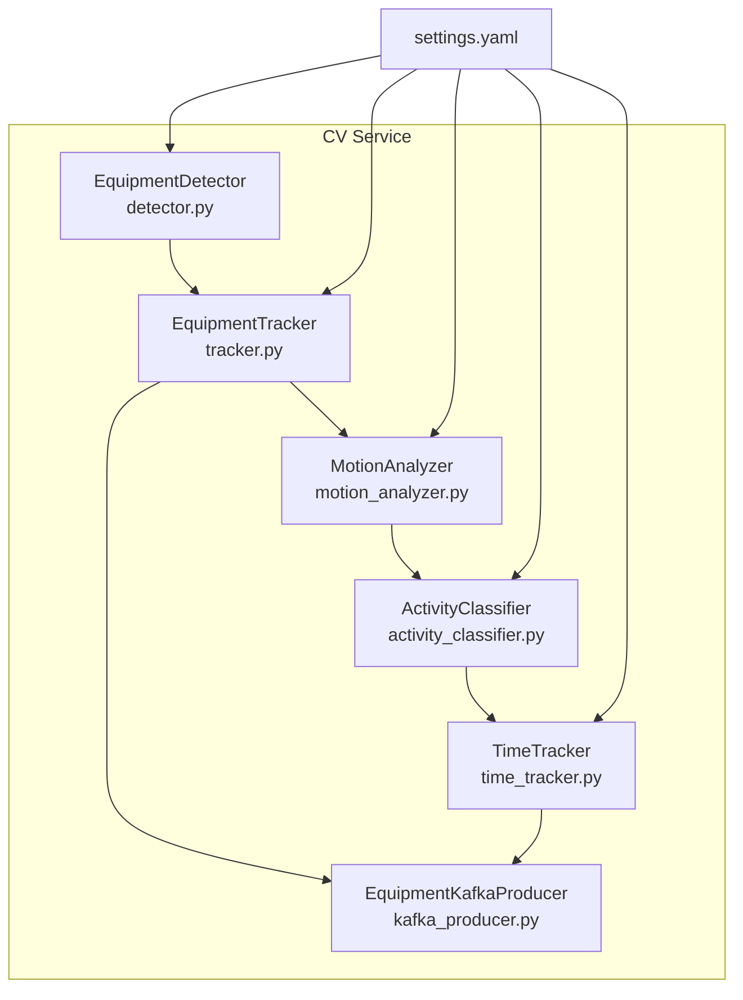
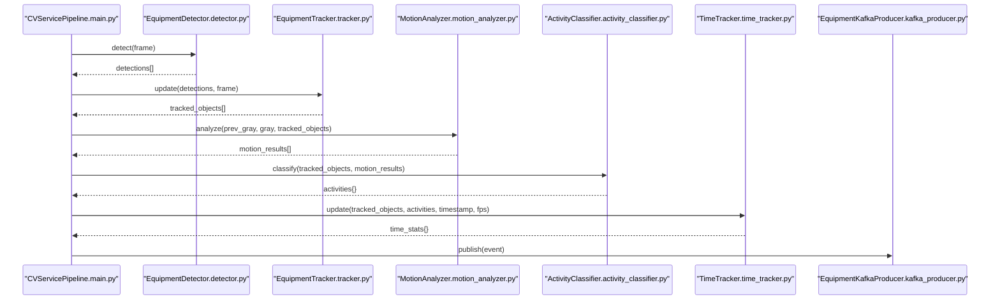
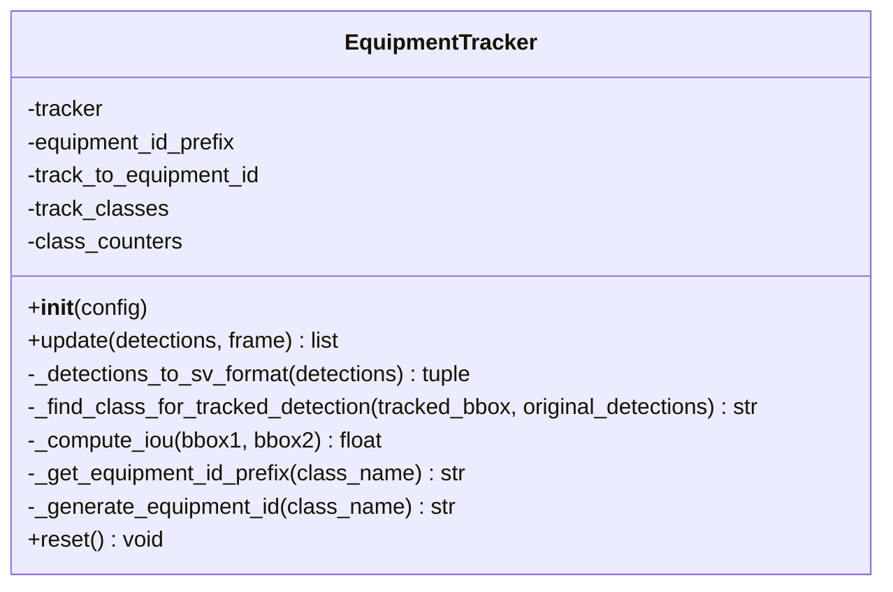
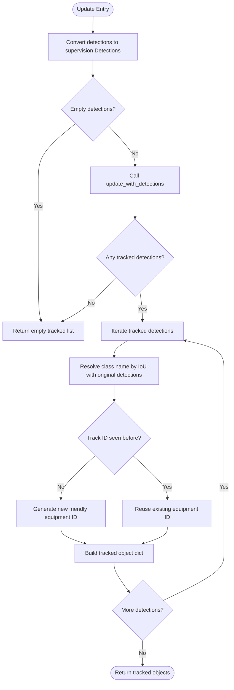
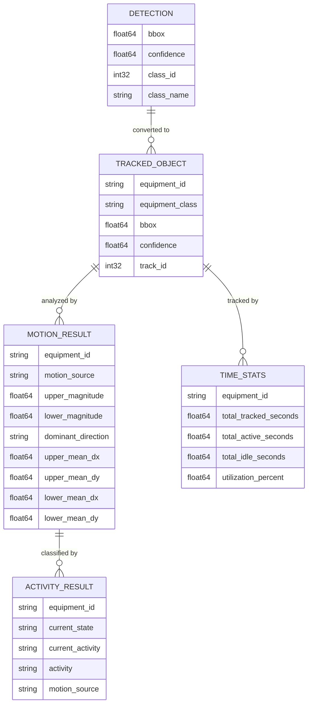
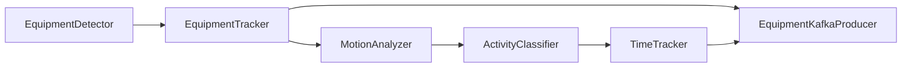

# Object Tracking

<cite>
**Referenced Files in This Document**
- [tracker.py](file://services/cv_service/src/tracker.py)
- [detector.py](file://services/cv_service/src/detector.py)
- [main.py](file://services/cv_service/src/main.py)
- [settings.yaml](file://config/settings.yaml)
- [motion_analyzer.py](file://services/cv_service/src/motion_analyzer.py)
- [activity_classifier.py](file://services/cv_service/src/activity_classifier.py)
- [time_tracker.py](file://services/cv_service/src/time_tracker.py)
- [kafka_producer.py](file://services/cv_service/src/kafka_producer.py)
- [README.md](file://README.md)
</cite>

## Table of Contents
1. [Introduction](#introduction)
2. [Project Structure](#project-structure)
3. [Core Components](#core-components)
4. [Architecture Overview](#architecture-overview)
5. [Detailed Component Analysis](#detailed-component-analysis)
6. [Dependency Analysis](#dependency-analysis)
7. [Performance Considerations](#performance-considerations)
8. [Troubleshooting Guide](#troubleshooting-guide)
9. [Conclusion](#conclusion)
10. [Appendices](#appendices)

## Introduction
This document explains the multi-object tracking subsystem that maintains object identity across video frames using the ByteTrack algorithm integrated via the supervision library. It covers tracker initialization, ID generation strategy, tracking parameters, association algorithms, and integration with detection results. Practical examples demonstrate track initialization, ID persistence, termination conditions, and handling occlusions. It also addresses performance considerations, memory management for long sequences, parameter tuning, and tracking quality metrics.

## Project Structure
The tracking subsystem resides in the CV service and integrates with detection, motion analysis, activity classification, and time tracking modules. Configuration is centralized in the settings file.

**Diagram sources**
- [main.py:104-142](file://services/cv_service/src/main.py#L104-L142)
- [settings.yaml:8-30](file://config/settings.yaml#L8-L30)

**Section sources**
- [main.py:104-142](file://services/cv_service/src/main.py#L104-L142)
- [settings.yaml:8-30](file://config/settings.yaml#L8-L30)

## Core Components
- EquipmentTracker: Wraps supervision’s ByteTrack, converts detection dicts to supervision Detections, updates the tracker, and assigns persistent friendly IDs.
- EquipmentDetector: Runs YOLOv8 inference and filters detections by confidence and target classes.
- MotionAnalyzer: Computes region-based optical flow to differentiate articulated motion from whole-body motion.
- ActivityClassifier: Rule-based classification with N-frame smoothing to stabilize activity transitions.
- TimeTracker: Accumulates utilization metrics per tracked equipment across frames.
- KafkaProducer: Publishes structured events to Kafka for downstream analytics.

**Section sources**
- [tracker.py:19-341](file://services/cv_service/src/tracker.py#L19-L341)
- [detector.py:18-170](file://services/cv_service/src/detector.py#L18-L170)
- [motion_analyzer.py:24-442](file://services/cv_service/src/motion_analyzer.py#L24-L442)
- [activity_classifier.py:23-306](file://services/cv_service/src/activity_classifier.py#L23-L306)
- [time_tracker.py:21-265](file://services/cv_service/src/time_tracker.py#L21-L265)
- [kafka_producer.py:17-228](file://services/cv_service/src/kafka_producer.py#L17-L228)

## Architecture Overview
The pipeline orchestrator initializes components and processes frames in sequence: detection, tracking, motion analysis, activity classification, time tracking, and event publishing.

**Diagram sources**
- [main.py:323-372](file://services/cv_service/src/main.py#L323-L372)
- [detector.py:85-170](file://services/cv_service/src/detector.py#L85-L170)
- [tracker.py:159-264](file://services/cv_service/src/tracker.py#L159-L264)
- [motion_analyzer.py:88-166](file://services/cv_service/src/motion_analyzer.py#L88-L166)
- [activity_classifier.py:71-125](file://services/cv_service/src/activity_classifier.py#L71-L125)
- [time_tracker.py:53-120](file://services/cv_service/src/time_tracker.py#L53-L120)
- [kafka_producer.py:91-169](file://services/cv_service/src/kafka_producer.py#L91-L169)

## Detailed Component Analysis

### EquipmentTracker: ByteTrack Integration and ID Management
- Initialization:
  - Validates required keys: track_thresh, track_buffer, match_thresh, equipment_id_prefix.
  - Creates supervision ByteTrack with track_activation_threshold, lost_track_buffer, minimum_matching_threshold.
  - Initializes mappings for track-to-ID, class tracking, and per-class counters.
- Detection conversion:
  - Transforms detection dicts into supervision Detections with xyxy, confidence, class_id.
- Update workflow:
  - Calls update_with_detections on supervision tracker.
  - Iterates tracked detections, extracts bbox and confidence, and resolves class name via IoU matching to original detections.
  - Assigns a new friendly equipment_id if the track_id is unseen; otherwise reuses existing mapping.
  - Returns tracked objects enriched with equipment_id, equipment_class, bbox, confidence, and internal track_id.
- ID generation:
  - Prefix derived from equipment_id_prefix by class name or default fallback.
  - Sequential numbering per class using class_counters.
- Termination and reset:
  - Lost tracks are kept alive for track_buffer frames; after that, they are removed by supervision.
  - reset clears all mappings and counters.

**Diagram sources**
- [tracker.py:19-341](file://services/cv_service/src/tracker.py#L19-L341)

**Section sources**
- [tracker.py:35-84](file://services/cv_service/src/tracker.py#L35-L84)
- [tracker.py:127-158](file://services/cv_service/src/tracker.py#L127-L158)
- [tracker.py:159-264](file://services/cv_service/src/tracker.py#L159-L264)
- [tracker.py:266-328](file://services/cv_service/src/tracker.py#L266-L328)
- [tracker.py:329-341](file://services/cv_service/src/tracker.py#L329-L341)

### Association Algorithm and Matching Logic
- Supervision’s ByteTrack performs Kalman filtering and association using IoU and temporal consistency.
- The tracker assigns internal tracker_id to each detection; EquipmentTracker maps these to persistent friendly IDs.
- Class name resolution:
  - For each tracked detection, the system finds the best-matching original detection by IoU between tracked bbox and original bbox.
  - A minimum IoU threshold is used to decide whether a match is valid.
- Occlusion handling:
  - Lost tracks persist for track_buffer frames; if no match occurs within this window, they are removed.
  - During brief occlusions, the tracker attempts to re-associate when overlap resumes.

**Diagram sources**
- [tracker.py:159-264](file://services/cv_service/src/tracker.py#L159-L264)
- [tracker.py:266-328](file://services/cv_service/src/tracker.py#L266-L328)

**Section sources**
- [tracker.py:159-264](file://services/cv_service/src/tracker.py#L159-L264)
- [tracker.py:266-328](file://services/cv_service/src/tracker.py#L266-L328)

### Practical Examples

- Track initialization:
  - On first detection, EquipmentTracker generates a new friendly ID (e.g., “DT-001” for a truck) and stores the mapping.
  - The internal tracker_id is associated with the new equipment_id.
- ID persistence:
  - Subsequent frames reuse the same equipment_id for the same internal tracker_id, even if the detection is temporarily absent.
- Track termination:
  - After track_buffer frames without a match, the internal tracker_id is removed by supervision; EquipmentTracker stops using that mapping.
- Handling occlusions:
  - If a detection is occluded and later reappears, the system attempts to re-associate using IoU matching; if successful, the same equipment_id persists.

**Section sources**
- [tracker.py:242-251](file://services/cv_service/src/tracker.py#L242-L251)
- [tracker.py:266-328](file://services/cv_service/src/tracker.py#L266-L328)

### Integration with Detection Results and Data Structures
- Detection format:
  - EquipmentDetector returns a list of dicts with bbox, confidence, class_id, class_name.
- Tracking output:
  - EquipmentTracker returns a list of dicts with equipment_id, equipment_class, bbox, confidence, track_id.
- Motion analysis input:
  - MotionAnalyzer expects tracked_objects with equipment_id and bbox.
- Activity classification input:
  - ActivityClassifier consumes tracked_objects and motion_results to produce activities{}.
- Time tracking input:
  - TimeTracker consumes tracked_objects and activities{} to update utilization metrics.

**Diagram sources**
- [detector.py:96-109](file://services/cv_service/src/detector.py#L96-L109)
- [tracker.py:178-184](file://services/cv_service/src/tracker.py#L178-L184)
- [motion_analyzer.py:108-121](file://services/cv_service/src/motion_analyzer.py#L108-L121)
- [activity_classifier.py:84-90](file://services/cv_service/src/activity_classifier.py#L84-L90)
- [time_tracker.py:74-80](file://services/cv_service/src/time_tracker.py#L74-L80)

**Section sources**
- [detector.py:96-109](file://services/cv_service/src/detector.py#L96-L109)
- [tracker.py:178-184](file://services/cv_service/src/tracker.py#L178-L184)
- [motion_analyzer.py:108-121](file://services/cv_service/src/motion_analyzer.py#L108-L121)
- [activity_classifier.py:84-90](file://services/cv_service/src/activity_classifier.py#L84-L90)
- [time_tracker.py:74-80](file://services/cv_service/src/time_tracker.py#L74-L80)

### Tracking Quality Metrics
- IoU-based class matching:
  - Used to resolve class names for tracked detections by selecting the best IoU match among original detections.
- Utilization metrics:
  - TimeTracker accumulates total_tracked_seconds, total_active_seconds, total_idle_seconds, and computes utilization_percent.
- Activity stability:
  - ActivityClassifier applies N-frame smoothing to reduce flickering and stabilize activity classification.

**Section sources**
- [tracker.py:266-328](file://services/cv_service/src/tracker.py#L266-L328)
- [time_tracker.py:173-187](file://services/cv_service/src/time_tracker.py#L173-L187)
- [activity_classifier.py:233-286](file://services/cv_service/src/activity_classifier.py#L233-L286)

## Dependency Analysis
- EquipmentTracker depends on supervision’s ByteTrack for multi-object tracking and association.
- EquipmentDetector depends on YOLOv8 for inference.
- MotionAnalyzer depends on OpenCV for optical flow computation.
- ActivityClassifier depends on MotionAnalyzer outputs.
- TimeTracker depends on ActivityClassifier outputs.
- KafkaProducer depends on confluent-kafka for event publishing.

**Diagram sources**
- [main.py:104-142](file://services/cv_service/src/main.py#L104-L142)
- [tracker.py:127-158](file://services/cv_service/src/tracker.py#L127-L158)
- [motion_analyzer.py:253-293](file://services/cv_service/src/motion_analyzer.py#L253-L293)
- [activity_classifier.py:71-125](file://services/cv_service/src/activity_classifier.py#L71-L125)
- [time_tracker.py:53-120](file://services/cv_service/src/time_tracker.py#L53-L120)
- [kafka_producer.py:91-169](file://services/cv_service/src/kafka_producer.py#L91-L169)

**Section sources**
- [main.py:104-142](file://services/cv_service/src/main.py#L104-L142)

## Performance Considerations
- CPU optimization strategies:
  - YOLOv8n (nano) reduces model size and latency.
  - Frame skipping reduces processing load by processing every Nth frame.
  - Resize reduces pixel count for inference.
  - Crop-based optical flow limits computation to bounding boxes.
- Parameter tuning:
  - track_thresh: Lower thresholds increase sensitivity but may introduce false positives.
  - track_buffer: Larger buffers improve resilience to short occlusions.
  - match_thresh: Higher thresholds improve robustness to false associations.
  - smoothing_window: Larger windows reduce flickering but may delay state transitions.
  - magnitude_threshold: Lower thresholds increase sensitivity to motion.
- Memory management:
  - EquipmentTracker maintains lightweight mappings; reset clears state between videos.
  - TimeTracker accumulates counters per equipment; reset clears state for new videos.

**Section sources**
- [README.md:177-198](file://README.md#L177-L198)
- [README.md:307-312](file://README.md#L307-L312)
- [settings.yaml:21-30](file://config/settings.yaml#L21-L30)
- [tracker.py:329-341](file://services/cv_service/src/tracker.py#L329-L341)
- [time_tracker.py:201-210](file://services/cv_service/src/time_tracker.py#L201-L210)

## Troubleshooting Guide
- Missing configuration keys:
  - EquipmentTracker raises ValueError if required keys are missing.
- Empty or invalid frames:
  - EquipmentTracker logs warnings and returns empty results.
- Detection failures:
  - EquipmentDetector catches inference errors and returns empty detections.
- Tracker update failures:
  - EquipmentTracker logs errors and returns empty results.
- Kafka delivery issues:
  - EquipmentKafkaProducer logs delivery failures and retries; use flush to ensure completion.

**Section sources**
- [tracker.py:52-56](file://services/cv_service/src/tracker.py#L52-L56)
- [tracker.py:192-194](file://services/cv_service/src/tracker.py#L192-L194)
- [detector.py:123-125](file://services/cv_service/src/detector.py#L123-L125)
- [tracker.py:207-209](file://services/cv_service/src/tracker.py#L207-L209)
- [kafka_producer.py:80-89](file://services/cv_service/src/kafka_producer.py#L80-L89)

## Conclusion
The multi-object tracking subsystem integrates supervision’s ByteTrack with a custom ID assignment strategy to maintain persistent identities across frames. It combines detection, association, motion analysis, activity classification, and time tracking into a cohesive pipeline. With careful parameter tuning and CPU-friendly configurations, it delivers robust performance for real-time equipment monitoring.

## Appendices

### Configuration Reference
- Tracking parameters:
  - track_thresh: Detection confidence threshold for track activation.
  - track_buffer: Frames to keep lost tracks alive.
  - match_thresh: IoU threshold for matching detections to tracks.
  - equipment_id_prefix: Mapping of class names to ID prefixes.

**Section sources**
- [settings.yaml:21-30](file://config/settings.yaml#L21-L30)

### Example Event Schema Published to Kafka
- Fields include frame_id, equipment_id, equipment_class, timestamp, utilization, and time_analytics.

**Section sources**
- [kafka_producer.py:95-112](file://services/cv_service/src/kafka_producer.py#L95-L112)