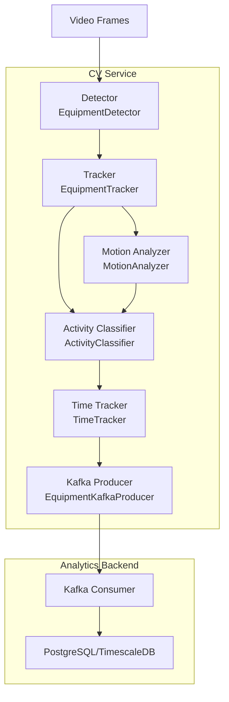
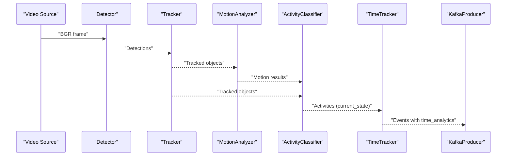
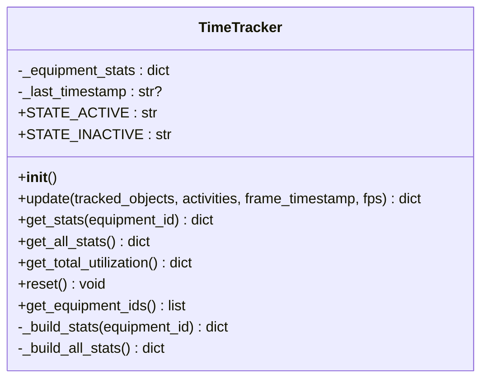
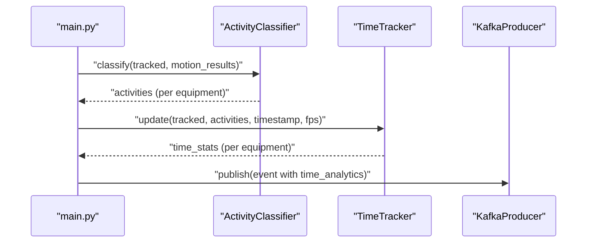
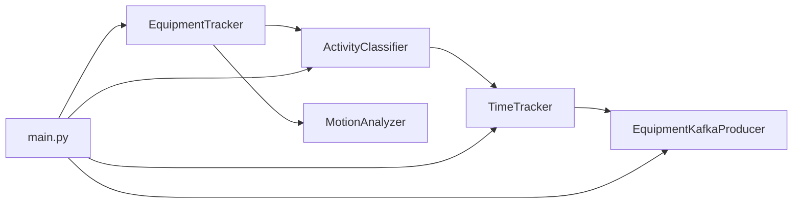

# Utilization Tracking

<cite>
**Referenced Files in This Document**
- [time_tracker.py](file://services/cv_service/src/time_tracker.py)
- [main.py](file://services/cv_service/src/main.py)
- [activity_classifier.py](file://services/cv_service/src/activity_classifier.py)
- [motion_analyzer.py](file://services/cv_service/src/motion_analyzer.py)
- [kafka_producer.py](file://services/cv_service/src/kafka_producer.py)
- [settings.yaml](file://config/settings.yaml)
- [test_time_tracker.py](file://tests/test_time_tracker.py)
- [README.md](file://README.md)
</cite>

## Table of Contents
1. [Introduction](#introduction)
2. [Project Structure](#project-structure)
3. [Core Components](#core-components)
4. [Architecture Overview](#architecture-overview)
5. [Detailed Component Analysis](#detailed-component-analysis)
6. [Dependency Analysis](#dependency-analysis)
7. [Performance Considerations](#performance-considerations)
8. [Troubleshooting Guide](#troubleshooting-guide)
9. [Conclusion](#conclusion)

## Introduction
This document explains the utilization tracking subsystem responsible for computing equipment utilization statistics from video streams. It focuses on the TimeTracker class, which accumulates tracked time, active time, idle time, and utilization percentages per equipment across frames. It also covers how the tracker integrates with activity classification results, timestamp handling, and the broader CV pipeline, along with performance considerations for long video sequences.

## Project Structure
The utilization tracking lives in the CV service and participates in the end-to-end pipeline:
- Detection, tracking, motion analysis, and activity classification feed the TimeTracker.
- TimeTracker returns per-equipment statistics that are embedded into Kafka events.
- The analytics backend consumes events and persists time analytics.

**Diagram sources**
- [main.py:323-372](file://services/cv_service/src/main.py#L323-L372)
- [time_tracker.py:21-265](file://services/cv_service/src/time_tracker.py#L21-L265)
- [kafka_producer.py:17-228](file://services/cv_service/src/kafka_producer.py#L17-L228)

**Section sources**
- [README.md:1-391](file://README.md#L1-L391)
- [settings.yaml:1-59](file://config/settings.yaml#L1-L59)

## Core Components
- TimeTracker: Maintains cumulative time counters per equipment and computes utilization percent.
- ActivityClassifier: Produces activity state used by TimeTracker to decide active vs idle increments.
- MotionAnalyzer: Supplies motion metadata used by ActivityClassifier.
- KafkaProducer: Emits events enriched with time analytics for downstream consumption.

Key responsibilities:
- TimeTracker.update(): Increments counters per frame based on activity state and FPS-derived time deltas.
- TimeTracker.get_stats()/get_all_stats(): Returns current per-equipment statistics including utilization_percent.
- Integration in main.py: Calls TimeTracker.update() after activity classification and embeds results into events.

**Section sources**
- [time_tracker.py:21-265](file://services/cv_service/src/time_tracker.py#L21-L265)
- [activity_classifier.py:23-306](file://services/cv_service/src/activity_classifier.py#L23-L306)
- [motion_analyzer.py:24-442](file://services/cv_service/src/motion_analyzer.py#L24-L442)
- [main.py:323-372](file://services/cv_service/src/main.py#L323-L372)
- [kafka_producer.py:91-169](file://services/cv_service/src/kafka_producer.py#L91-L169)

## Architecture Overview
The pipeline stages leading to utilization statistics:

**Diagram sources**
- [main.py:345-372](file://services/cv_service/src/main.py#L345-L372)
- [time_tracker.py:53-120](file://services/cv_service/src/time_tracker.py#L53-L120)
- [activity_classifier.py:71-125](file://services/cv_service/src/activity_classifier.py#L71-L125)
- [motion_analyzer.py:88-166](file://services/cv_service/src/motion_analyzer.py#L88-L166)
- [kafka_producer.py:91-169](file://services/cv_service/src/kafka_producer.py#L91-L169)

## Detailed Component Analysis

### TimeTracker: Initialization, Statistics, and Utilization Calculation
- Initialization: Creates empty per-equipment stats and initializes last timestamp reference.
- Update cycle:
  - Computes time_delta = 1.0 / max(fps, 1.0) per frame.
  - For each tracked equipment:
    - Ensures stats entry exists.
    - Reads current_state from activity classification (defaults to INACTIVE).
    - Increments total_tracked_seconds.
    - Increments total_active_seconds if ACTIVE, otherwise total_idle_seconds.
  - Returns aggregated stats for all tracked equipment.
- Accessors:
  - get_stats(equipment_id): Returns per-equipment stats including utilization_percent.
  - get_all_stats(): Returns stats for all tracked equipment.
  - get_total_utilization(): Aggregates across all equipment and computes average utilization_percent.
- Reset: Clears all stats and resets last timestamp.

Utilization calculation:
- utilization_percent = (total_active_seconds / total_tracked_seconds) * 100.0 if total_tracked_seconds > 0 else 0.0.

**Diagram sources**
- [time_tracker.py:21-265](file://services/cv_service/src/time_tracker.py#L21-L265)

**Section sources**
- [time_tracker.py:37-120](file://services/cv_service/src/time_tracker.py#L37-L120)
- [time_tracker.py:122-156](file://services/cv_service/src/time_tracker.py#L122-L156)
- [time_tracker.py:157-199](file://services/cv_service/src/time_tracker.py#L157-L199)
- [time_tracker.py:201-265](file://services/cv_service/src/time_tracker.py#L201-L265)

### Integration with Activity Classification and Timestamp Handling
- Activity state mapping:
  - ActivityClassifier returns current_state = "ACTIVE" or "INACTIVE".
  - TimeTracker treats any missing or non-ACTIVE state as INACTIVE.
- Timestamp handling:
  - TimeTracker stores the last processed frame_timestamp for reference.
  - Events include a human-readable timestamp string "HH:MM:SS.mmm" for traceability.
- FPS-driven time delta:
  - Effective time per frame is 1/fps seconds, ensuring consistent accumulation regardless of frame skip.

**Diagram sources**
- [main.py:359-371](file://services/cv_service/src/main.py#L359-L371)
- [activity_classifier.py:71-125](file://services/cv_service/src/activity_classifier.py#L71-L125)
- [time_tracker.py:53-120](file://services/cv_service/src/time_tracker.py#L53-L120)
- [kafka_producer.py:91-169](file://services/cv_service/src/kafka_producer.py#L91-L169)

**Section sources**
- [main.py:359-371](file://services/cv_service/src/main.py#L359-L371)
- [activity_classifier.py:109-124](file://services/cv_service/src/activity_classifier.py#L109-L124)
- [time_tracker.py:82-120](file://services/cv_service/src/time_tracker.py#L82-L120)
- [kafka_producer.py:91-169](file://services/cv_service/src/kafka_producer.py#L91-L169)

### Practical Examples: Time Window Processing, State Transitions, and Aggregation
- Time window processing:
  - Each call to update() increments counters by time_delta = 1/fps.
  - Over many frames, total_tracked_seconds grows linearly with frame count; active and idle seconds reflect state distribution.
- Activity state transitions:
  - ACTIVE frames increment total_active_seconds; INACTIVE frames increment total_idle_seconds.
  - Unknown or missing current_state defaults to INACTIVE.
- Statistical aggregation:
  - get_total_utilization() sums across all equipment and computes average utilization_percent.

Validation via tests demonstrates:
- Active vs idle increments under different FPS values.
- Persistence of stats when equipment disappears and reappears.
- Correct utilization_percent computation and zero-div protection.

**Section sources**
- [test_time_tracker.py:48-212](file://tests/test_time_tracker.py#L48-L212)
- [test_time_tracker.py:284-322](file://tests/test_time_tracker.py#L284-L322)
- [test_time_tracker.py:350-384](file://tests/test_time_tracker.py#L350-L384)
- [test_time_tracker.py:389-482](file://tests/test_time_tracker.py#L389-L482)

### Time Zone Considerations
- The system uses a local timestamp string "HH:MM:SS.mmm" for each frame.
- No explicit time zone conversion is performed; timestamps are treated as local wall-clock time.
- For distributed deployments, consider normalizing timestamps to UTC at ingestion or analytics boundaries if cross-site comparisons are required.

**Section sources**
- [time_tracker.py:57-89](file://services/cv_service/src/time_tracker.py#L57-L89)
- [main.py:305-321](file://services/cv_service/src/main.py#L305-L321)

### Leap Second Handling
- The pipeline does not rely on leap second-aware time sources; it increments counters by fixed time_delta per frame.
- No special handling is implemented for leap seconds; the approach remains robust for typical video frame rates.

**Section sources**
- [time_tracker.py:82-86](file://services/cv_service/src/time_tracker.py#L82-L86)

### Performance Optimization for Long Video Sequences
- Frame skipping: Reduce processing load by processing every Nth frame (configurable).
- Resize: Downscale frames to reduce computation cost.
- CPU-friendly algorithms: YOLOv8n, ByteTrack, and region-based optical flow are optimized for CPU.
- Batch publishing: Kafka producer batches and flushes efficiently.

**Section sources**
- [settings.yaml:3-6](file://config/settings.yaml#L3-L6)
- [settings.yaml:188-198](file://config/settings.yaml#L188-L198)
- [kafka_producer.py:17-228](file://services/cv_service/src/kafka_producer.py#L17-L228)

## Dependency Analysis
- TimeTracker depends on activity state from ActivityClassifier and tracked equipment from EquipmentTracker.
- main.py orchestrates the pipeline and passes activities and tracked objects to TimeTracker.
- KafkaProducer consumes events enriched with time_analytics.

**Diagram sources**
- [main.py:323-372](file://services/cv_service/src/main.py#L323-L372)
- [time_tracker.py:21-265](file://services/cv_service/src/time_tracker.py#L21-L265)
- [kafka_producer.py:17-228](file://services/cv_service/src/kafka_producer.py#L17-L228)

**Section sources**
- [main.py:323-372](file://services/cv_service/src/main.py#L323-L372)
- [time_tracker.py:21-265](file://services/cv_service/src/time_tracker.py#L21-L265)
- [kafka_producer.py:17-228](file://services/cv_service/src/kafka_producer.py#L17-L228)

## Performance Considerations
- Time delta computation: Using 1/fps ensures consistent accumulation even with frame skipping.
- Memory footprint: Stats are stored per equipment; memory scales with number of distinct equipment seen.
- Throughput: Kafka producer batching and asynchronous delivery minimize backpressure.
- Accuracy vs speed: Tuning smoothing_window and thresholds balances responsiveness and stability.

[No sources needed since this section provides general guidance]

## Troubleshooting Guide
Common issues and resolutions:
- Division by zero in utilization_percent:
  - Behavior: Returns 0% when total_tracked_seconds is 0.
  - Cause: Querying stats for equipment not yet tracked.
  - Resolution: Ensure update() is called at least once per equipment or handle zero stats upstream.
- FPS edge cases:
  - Behavior: time_delta = 1.0 when fps=0 or negative; treated as 1-second increments.
  - Resolution: Provide a valid positive fps from video metadata.
- Missing current_state:
  - Behavior: Defaults to INACTIVE, counting as idle time.
  - Resolution: Verify ActivityClassifier output includes current_state.
- Equipment disappearance/reappearance:
  - Behavior: Stats persist across frames where equipment is absent.
  - Resolution: Intended behavior; reset TimeTracker at video start if needed.

**Section sources**
- [time_tracker.py:173-187](file://services/cv_service/src/time_tracker.py#L173-L187)
- [time_tracker.py:82-86](file://services/cv_service/src/time_tracker.py#L82-L86)
- [test_time_tracker.py:187-212](file://tests/test_time_tracker.py#L187-L212)
- [test_time_tracker.py:389-408](file://tests/test_time_tracker.py#L389-L408)

## Conclusion
The TimeTracker provides a lightweight, robust mechanism for computing equipment utilization statistics from video frames. By basing increments on activity state and FPS-derived time deltas, it offers accurate per-equipment and aggregate metrics suitable for real-time dashboards and persistent analytics. Its integration with the CV pipeline and Kafka ensures scalable, event-driven delivery of utilization insights.