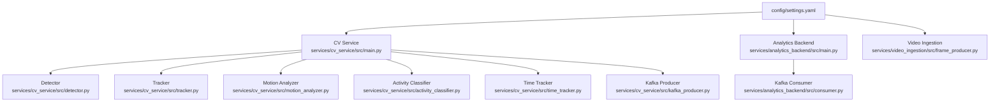
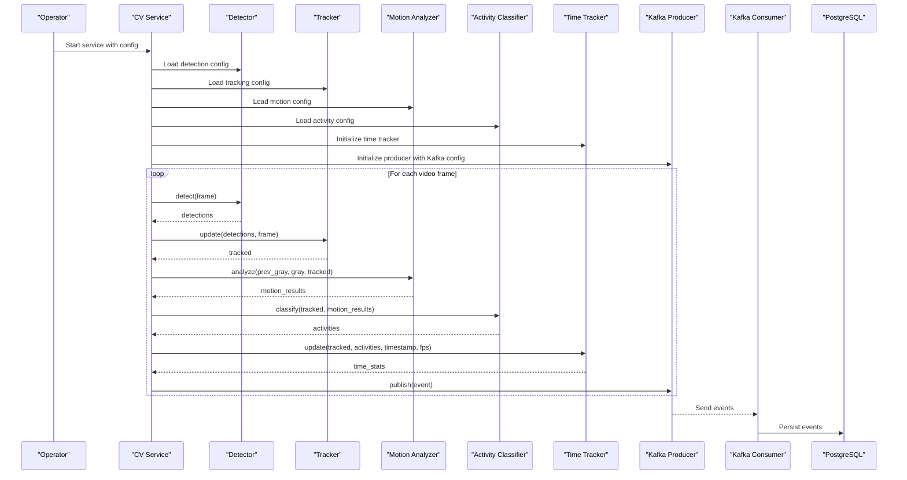
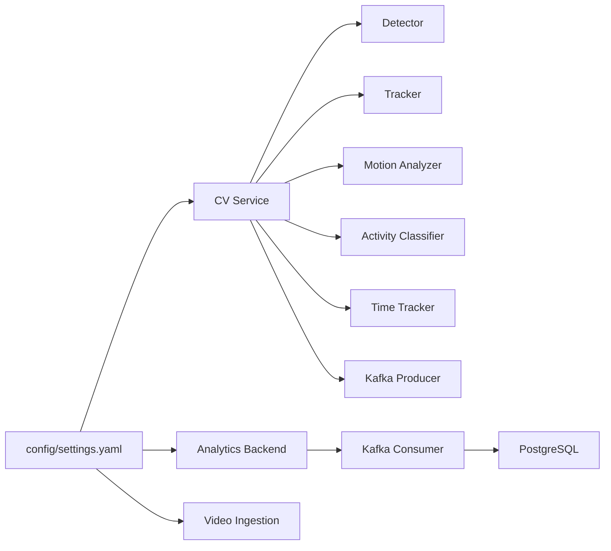

# Configuration Management

<cite>
**Referenced Files in This Document**
- [settings.yaml](file://config/settings.yaml)
- [main.py](file://services/cv_service/src/main.py)
- [detector.py](file://services/cv_service/src/detector.py)
- [tracker.py](file://services/cv_service/src/tracker.py)
- [motion_analyzer.py](file://services/cv_service/src/motion_analyzer.py)
- [activity_classifier.py](file://services/cv_service/src/activity_classifier.py)
- [time_tracker.py](file://services/cv_service/src/time_tracker.py)
- [kafka_producer.py](file://services/cv_service/src/kafka_producer.py)
- [main.py](file://services/analytics_backend/src/main.py)
- [consumer.py](file://services/analytics_backend/src/consumer.py)
- [frame_producer.py](file://services/video_ingestion/src/frame_producer.py)
- [docker-compose.yml](file://docker-compose.yml)
</cite>

## Table of Contents
1. [Introduction](#introduction)
2. [Project Structure](#project-structure)
3. [Core Components](#core-components)
4. [Architecture Overview](#architecture-overview)
5. [Detailed Component Analysis](#detailed-component-analysis)
6. [Dependency Analysis](#dependency-analysis)
7. [Performance Considerations](#performance-considerations)
8. [Troubleshooting Guide](#troubleshooting-guide)
9. [Conclusion](#conclusion)

## Introduction
This document describes the centralized configuration system that manages all tunable parameters for the equipment monitoring pipeline. The configuration is defined in a single YAML file and consumed by all services in the pipeline. It covers video processing, detection thresholds, motion analysis, activity classification, and performance optimization. The document explains parameter categories, defaults, acceptable ranges, impacts on system behavior, tuning guidelines, and production best practices.

## Project Structure
The configuration is centralized in a single YAML file and mounted into all services. Services load the configuration at startup and pass relevant sections to their respective components.

**Diagram sources**
- [settings.yaml](file://config/settings.yaml)
- [main.py](file://services/cv_service/src/main.py)
- [detector.py](file://services/cv_service/src/detector.py)
- [tracker.py](file://services/cv_service/src/tracker.py)
- [motion_analyzer.py](file://services/cv_service/src/motion_analyzer.py)
- [activity_classifier.py](file://services/cv_service/src/activity_classifier.py)
- [time_tracker.py](file://services/cv_service/src/time_tracker.py)
- [kafka_producer.py](file://services/cv_service/src/kafka_producer.py)
- [main.py](file://services/analytics_backend/src/main.py)
- [consumer.py](file://services/analytics_backend/src/consumer.py)
- [frame_producer.py](file://services/video_ingestion/src/frame_producer.py)

**Section sources**
- [settings.yaml](file://config/settings.yaml)
- [main.py](file://services/cv_service/src/main.py)
- [main.py](file://services/analytics_backend/src/main.py)
- [frame_producer.py](file://services/video_ingestion/src/frame_producer.py)

## Core Components
The configuration is organized into logical categories that align with pipeline stages:

- Video processing: frame skipping, resizing, and input directory
- Detection: model selection, confidence threshold, device, input size, target classes, and class names
- Tracking: track thresholds, buffer, matching threshold, and equipment ID prefixes
- Motion analysis: magnitude threshold, upper region ratio, and optical flow method
- Activity classification: smoothing window and directional thresholds
- Kafka: bootstrap servers, topic, client ID, and consumer group
- Database: host, port, name, user, password, and URI
- Dashboard: API URL, refresh interval, and page title

Each category is documented with defaults, acceptable ranges, and behavioral impact.

**Section sources**
- [settings.yaml](file://config/settings.yaml)

## Architecture Overview
The configuration is loaded by each service and passed to pipeline components. The CV service orchestrates detection, tracking, motion analysis, activity classification, time tracking, and Kafka publishing. The analytics backend consumes events from Kafka and writes them to PostgreSQL. The dashboard queries the backend for visualization.

**Diagram sources**
- [main.py](file://services/cv_service/src/main.py)
- [detector.py](file://services/cv_service/src/detector.py)
- [tracker.py](file://services/cv_service/src/tracker.py)
- [motion_analyzer.py](file://services/cv_service/src/motion_analyzer.py)
- [activity_classifier.py](file://services/cv_service/src/activity_classifier.py)
- [time_tracker.py](file://services/cv_service/src/time_tracker.py)
- [kafka_producer.py](file://services/cv_service/src/kafka_producer.py)
- [consumer.py](file://services/analytics_backend/src/consumer.py)

## Detailed Component Analysis

### Video Processing Configuration
- frame_skip: Integer ≥ 1. Controls frame rate reduction for CPU efficiency. Higher values reduce inference cost but lower temporal resolution.
- resize_width: Integer ≥ 1. Target width for resizing frames before inference. Reduces memory and compute costs.
- input_dir: String path. Directory containing video files for processing.

Impact on system behavior:
- Lower frame_skip improves temporal fidelity but increases CPU usage.
- Smaller resize_width reduces memory bandwidth and speeds up inference.
- Incorrect input_dir leads to no video processing.

Tuning guidelines:
- Start with frame_skip 3–5 for moderate CPU savings.
- Adjust resize_width to balance quality vs. speed; typical values 320–1280.
- Ensure input_dir exists and contains supported video formats.

**Section sources**
- [settings.yaml](file://config/settings.yaml)
- [main.py](file://services/cv_service/src/main.py)
- [frame_producer.py](file://services/video_ingestion/src/frame_producer.py)

### Detection Configuration
- model: String path or filename. Path to YOLOv8 weights.
- confidence_threshold: Float in (0, 1]. Lower values increase recall but may raise false positives.
- device: String "cpu" or "cuda". Determines inference device.
- input_size: Integer ≥ 1. Model input size (e.g., 640).
- target_classes: List of COCO class IDs to detect (e.g., [2, 5, 7]).
- class_names: Dict mapping class IDs to friendly names.

Impact on system behavior:
- Lower confidence_threshold increases detections but may degrade accuracy.
- CUDA acceleration significantly improves throughput on compatible hardware.
- Incorrect target_classes or class_names mislabels detections.

Tuning guidelines:
- Start with confidence_threshold 0.3–0.5 depending on lighting and camera angle.
- Use CUDA if available; otherwise CPU inference is supported.
- Verify target_classes match intended equipment (COCO IDs).

**Section sources**
- [settings.yaml](file://config/settings.yaml)
- [detector.py](file://services/cv_service/src/detector.py)

### Tracking Configuration
- track_thresh: Float in (0, 1]. Detection confidence threshold to activate tracks.
- track_buffer: Integer ≥ 1. Number of frames to retain lost tracks.
- match_thresh: Float in (0, 1]. IOU threshold for matching detections to tracks.
- equipment_id_prefix: Dict mapping class names to ID prefixes (e.g., truck: DT).

Impact on system behavior:
- Lower track_thresh creates more tracks; higher values reduce fragmentation.
- Larger track_buffer allows smoother re-identification after brief occlusions.
- Lower match_thresh increases drift; higher values improves stability.

Tuning guidelines:
- Start with track_thresh 0.2–0.35 and match_thresh 0.7–0.85.
- Increase track_buffer for scenes with frequent occlusions.

**Section sources**
- [settings.yaml](file://config/settings.yaml)
- [tracker.py](file://services/cv_service/src/tracker.py)

### Motion Analysis Configuration
- magnitude_threshold: Float ≥ 0. Controls sensitivity to motion. Lower values increase sensitivity.
- upper_region_ratio: Float in (0, 1). Fraction of bounding box height for upper region (arm/boom).
- flow_method: String "farneback". Optical flow algorithm used.

Impact on system behavior:
- Lower magnitude_threshold increases sensitivity to subtle motion but may cause flicker.
- upper_region_ratio determines which part of the equipment is considered for articulated motion.
- Farneback is optimized for construction equipment motion.

Tuning guidelines:
- Start with magnitude_threshold 1.5–2.5; adjust based on scene noise.
- Use 0.4–0.6 for upper_region_ratio depending on equipment height.

**Section sources**
- [settings.yaml](file://config/settings.yaml)
- [motion_analyzer.py](file://services/cv_service/src/motion_analyzer.py)

### Activity Classification Configuration
- smoothing_window: Integer ≥ 1. Number of frames for mode-based smoothing to reduce flicker.
- vertical_flow_threshold: Float ≥ 0. Minimum vertical flow magnitude for direction decisions.
- horizontal_flow_threshold: Float ≥ 0. Minimum horizontal flow magnitude for direction decisions.

Impact on system behavior:
- Larger smoothing_window stabilizes activity transitions but adds latency.
- Lower thresholds increase sensitivity to small motions.
- Improper thresholds cause misclassification between activities.

Tuning guidelines:
- Start with smoothing_window 3–7 for balanced responsiveness.
- Calibrate vertical and horizontal thresholds to match equipment motion patterns.

**Section sources**
- [settings.yaml](file://config/settings.yaml)
- [activity_classifier.py](file://services/cv_service/src/activity_classifier.py)

### Kafka Configuration
- bootstrap_servers: String host:port list. Kafka broker endpoints.
- topic: String. Topic name for equipment events.
- client_id: String. Producer client identifier.
- consumer_group: String. Consumer group for analytics backend.

Impact on system behavior:
- Incorrect bootstrap_servers prevents event publishing/consuming.
- Topic mismatch causes events to go unseen by consumers.

Tuning guidelines:
- Ensure bootstrap_servers reflect the deployed Kafka cluster.
- Use distinct consumer groups for multiple consumers.

**Section sources**
- [settings.yaml](file://config/settings.yaml)
- [kafka_producer.py](file://services/cv_service/src/kafka_producer.py)
- [consumer.py](file://services/analytics_backend/src/consumer.py)

### Database Configuration
- host: String hostname.
- port: Integer port number.
- name: String database name.
- user: String username.
- password: String password.
- uri: String connection URI.

Impact on system behavior:
- Incorrect credentials or URI prevent analytics backend from writing events.

Tuning guidelines:
- Use strong credentials and secure network access.
- Ensure TimescaleDB availability and health checks.

**Section sources**
- [settings.yaml](file://config/settings.yaml)
- [main.py](file://services/analytics_backend/src/main.py)

### Dashboard Configuration
- api_url: String base URL for analytics backend.
- refresh_interval: Integer seconds. How often the dashboard polls backend.
- page_title: String page title for the dashboard UI.

Impact on system behavior:
- Incorrect api_url prevents dashboard from loading data.

Tuning guidelines:
- Adjust refresh_interval based on backend capacity and latency.

**Section sources**
- [settings.yaml](file://config/settings.yaml)

## Dependency Analysis
Configuration dependencies across services:

**Diagram sources**
- [settings.yaml](file://config/settings.yaml)
- [main.py](file://services/cv_service/src/main.py)
- [main.py](file://services/analytics_backend/src/main.py)
- [frame_producer.py](file://services/video_ingestion/src/frame_producer.py)

Key observations:
- All services depend on the central configuration file.
- CV service composes multiple components that each consume subsets of configuration.
- Analytics backend and Kafka consumer share Kafka configuration.
- Database configuration is consumed by the analytics backend.

**Section sources**
- [settings.yaml](file://config/settings.yaml)
- [main.py](file://services/cv_service/src/main.py)
- [main.py](file://services/analytics_backend/src/main.py)

## Performance Considerations
- CPU usage reduction:
  - Increase frame_skip to process fewer frames.
  - Reduce resize_width to lower memory bandwidth and inference cost.
  - Use CUDA device for detection if available.
- Sensitivity tuning:
  - Increase magnitude_threshold and thresholds to reduce false positives.
  - Decrease smoothing_window for faster response to state changes.
- Throughput optimization:
  - Tune Kafka linger.ms and batch.size for producer batching.
  - Adjust consumer batch size and timeout for database writes.
- Stability:
  - Increase smoothing_window to reduce flickering.
  - Adjust track_buffer to handle occlusions.

[No sources needed since this section provides general guidance]

## Troubleshooting Guide
Common configuration issues and resolutions:

- Configuration file not found:
  - Services search multiple standard paths. Ensure the file exists at one of the expected locations.
  - Verify volume mounts in Docker compose if running containers.

- Detection errors:
  - Confirm model path exists and device matches runtime capabilities.
  - Validate target_classes and class_names mappings.

- Motion analysis instability:
  - Increase magnitude_threshold to reduce noise-induced motion.
  - Adjust upper_region_ratio to focus on the correct equipment parts.

- Activity classification flicker:
  - Increase smoothing_window to smooth out transient states.
  - Calibrate vertical and horizontal thresholds to match equipment motion.

- Kafka connectivity issues:
  - Verify bootstrap_servers and topic names.
  - Ensure Kafka is healthy and reachable from the service container.

- Database persistence failures:
  - Check database host, port, credentials, and URI.
  - Confirm TimescaleDB health and schema initialization.

**Section sources**
- [main.py](file://services/cv_service/src/main.py)
- [main.py](file://services/analytics_backend/src/main.py)
- [detector.py](file://services/cv_service/src/detector.py)
- [motion_analyzer.py](file://services/cv_service/src/motion_analyzer.py)
- [activity_classifier.py](file://services/cv_service/src/activity_classifier.py)
- [kafka_producer.py](file://services/cv_service/src/kafka_producer.py)
- [consumer.py](file://services/analytics_backend/src/consumer.py)

## Conclusion
The centralized configuration system provides a unified, maintainable way to tune the equipment monitoring pipeline. By organizing parameters into logical categories and validating them at load time, the system enables predictable behavior across services. Proper tuning of frame skipping, detection thresholds, motion analysis, and activity classification yields improved accuracy, reduced flicker, and optimized CPU usage. Production deployments should leverage environment-specific overrides, robust validation, and careful monitoring of performance metrics.