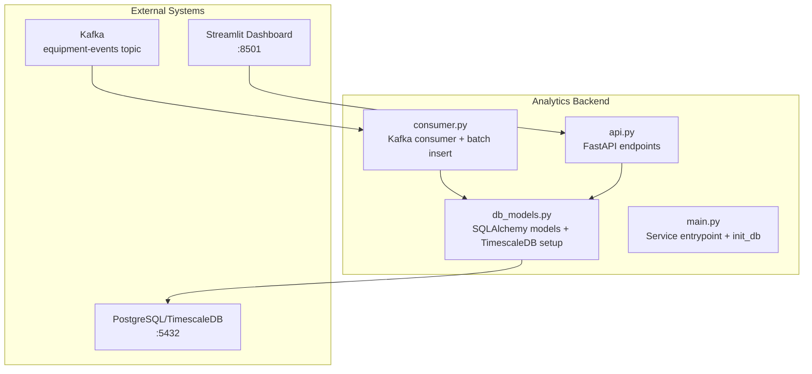
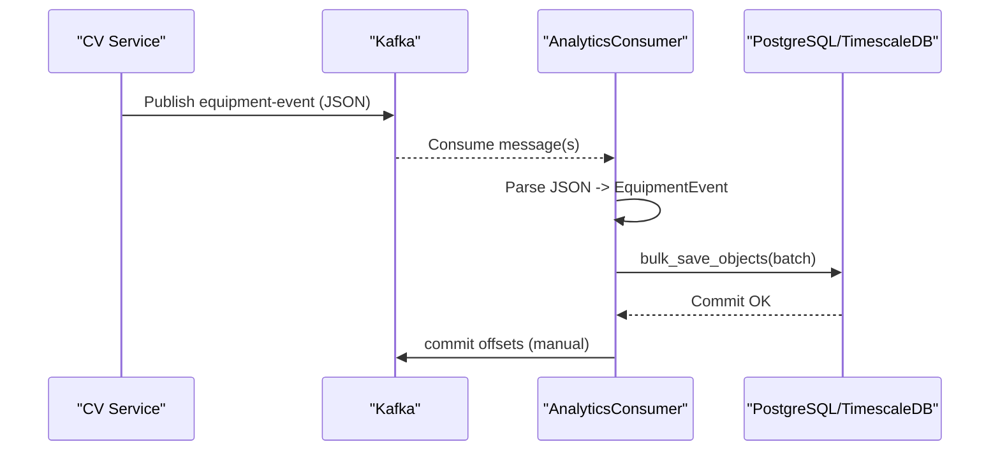
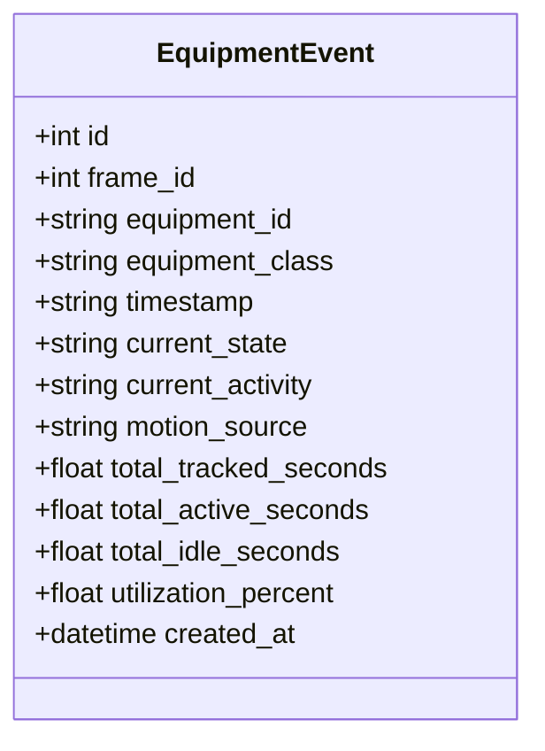
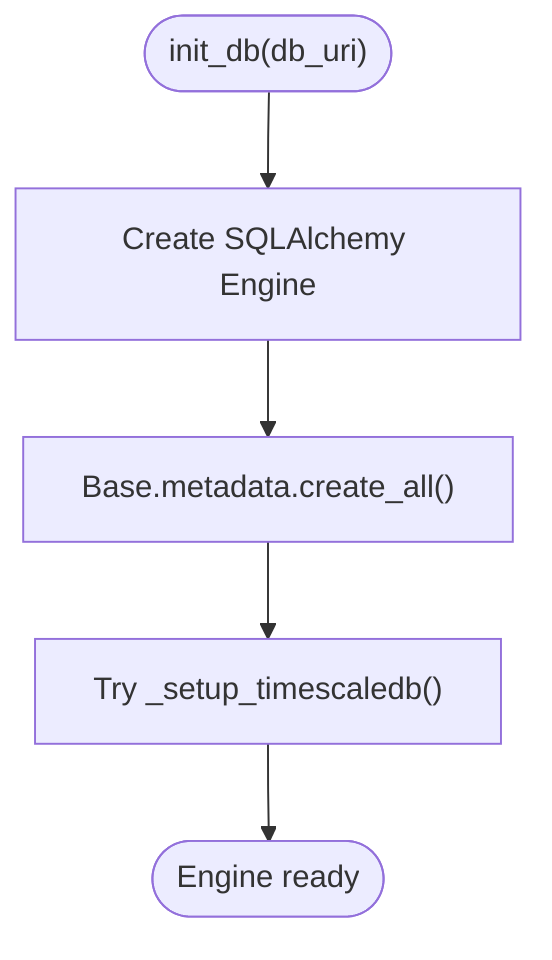
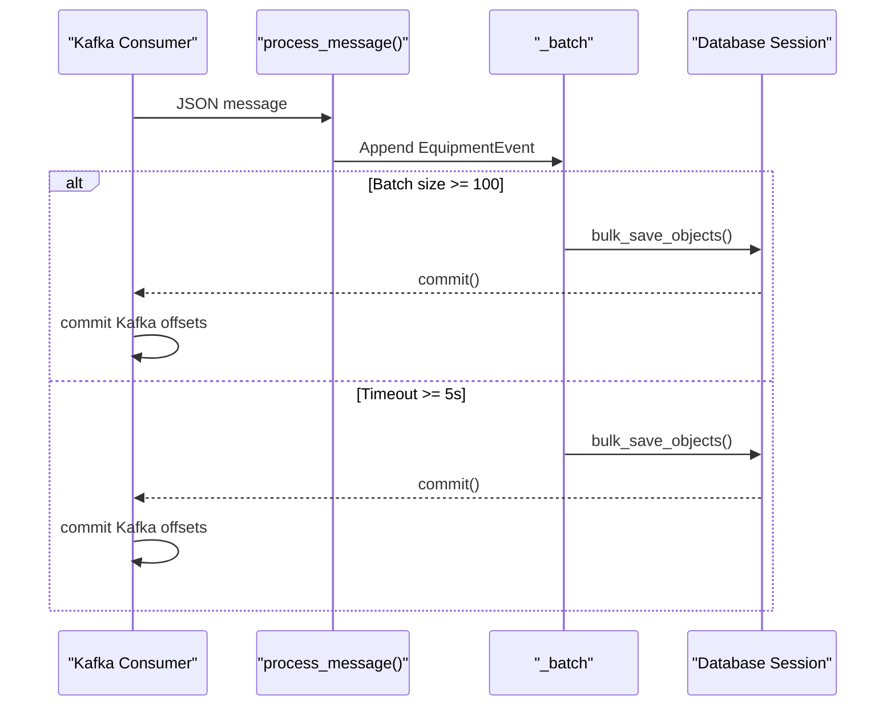
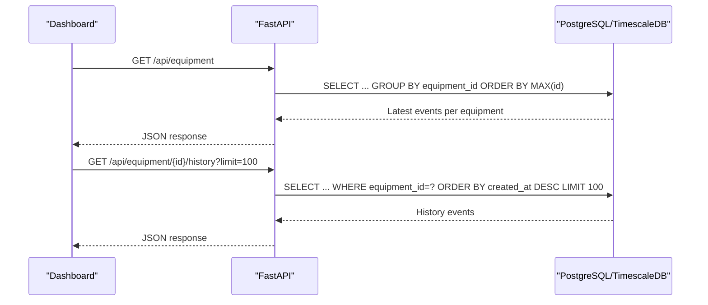
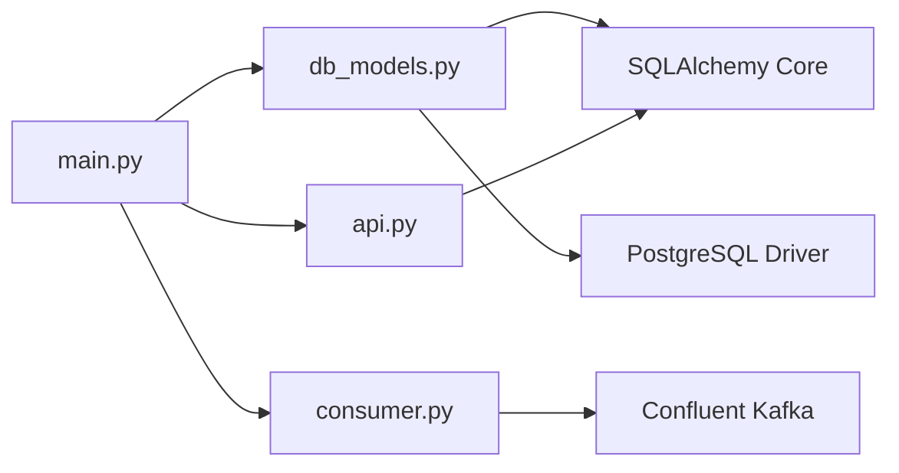
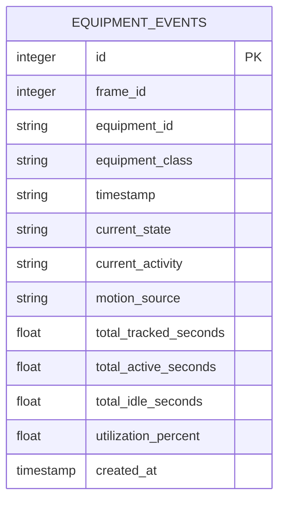

# Database Design

<cite>
**Referenced Files in This Document**
- [db_models.py](file://services/analytics_backend/src/db_models.py)
- [api.py](file://services/analytics_backend/src/api.py)
- [consumer.py](file://services/analytics_backend/src/consumer.py)
- [main.py](file://services/analytics_backend/src/main.py)
- [settings.yaml](file://config/settings.yaml)
- [docker-compose.yml](file://docker-compose.yml)
- [requirements.txt](file://services/analytics_backend/requirements.txt)
- [README.md](file://README.md)
</cite>

## Table of Contents
1. [Introduction](#introduction)
2. [Project Structure](#project-structure)
3. [Core Components](#core-components)
4. [Architecture Overview](#architecture-overview)
5. [Detailed Component Analysis](#detailed-component-analysis)
6. [Dependency Analysis](#dependency-analysis)
7. [Performance Considerations](#performance-considerations)
8. [Troubleshooting Guide](#troubleshooting-guide)
9. [Conclusion](#conclusion)
10. [Appendices](#appendices)

## Introduction
This document provides comprehensive database design documentation for the PostgreSQL/TimescaleDB implementation used to store equipment monitoring data. It focuses on the EquipmentEvent model, field definitions, data types, indexing and constraints optimized for time-series data, validation rules, business logic constraints, data integrity measures, access patterns, time-series optimization strategies, performance considerations for high-frequency event streams, data lifecycle and retention, security, backup and disaster recovery, and migration/version management.

## Project Structure
The database layer is implemented in the analytics backend service using SQLAlchemy ORM against PostgreSQL with optional TimescaleDB hypertable support. Kafka is used for ingestion of high-frequency event streams, which are persisted to the database in batches.

**Diagram sources**
- [db_models.py:70-100](file://services/analytics_backend/src/db_models.py#L70-L100)
- [api.py:44-71](file://services/analytics_backend/src/api.py#L44-L71)
- [consumer.py:35-78](file://services/analytics_backend/src/consumer.py#L35-L78)
- [main.py:90-103](file://services/analytics_backend/src/main.py#L90-L103)

**Section sources**
- [db_models.py:1-191](file://services/analytics_backend/src/db_models.py#L1-L191)
- [api.py:1-444](file://services/analytics_backend/src/api.py#L1-L444)
- [consumer.py:1-268](file://services/analytics_backend/src/consumer.py#L1-L268)
- [main.py:64-149](file://services/analytics_backend/src/main.py#L64-L149)
- [docker-compose.yml:35-50](file://docker-compose.yml#L35-L50)

## Core Components
- EquipmentEvent model: Stores per-frame equipment state and utilization metrics with a primary key and time-series oriented indexes.
- Database initialization: Creates tables and attempts to convert the events table into a TimescaleDB hypertable keyed by created_at.
- Kafka consumer: Reads events from the equipment-events topic and performs batched inserts into the database.
- FastAPI endpoints: Provide read-only access to latest equipment states, history, summaries, and statistics.

Key characteristics:
- Time-series focus: created_at is the primary time dimension for TimescaleDB.
- Equipment-centric: equipment_id is indexed for efficient filtering and aggregation.
- High-frequency ingestion: batched writes with manual Kafka commit for reliability.

**Section sources**
- [db_models.py:22-67](file://services/analytics_backend/src/db_models.py#L22-L67)
- [db_models.py:70-100](file://services/analytics_backend/src/db_models.py#L70-L100)
- [consumer.py:143-200](file://services/analytics_backend/src/consumer.py#L143-L200)
- [api.py:179-284](file://services/analytics_backend/src/api.py#L179-L284)

## Architecture Overview
The ingestion pipeline decouples CV processing from persistence using Kafka. Events are produced by the CV service and consumed by the analytics backend, which persists them to PostgreSQL/TimescaleDB. The FastAPI service exposes read endpoints for dashboards and integrations.

**Diagram sources**
- [consumer.py:143-200](file://services/analytics_backend/src/consumer.py#L143-L200)
- [db_models.py:70-100](file://services/analytics_backend/src/db_models.py#L70-L100)

## Detailed Component Analysis

### EquipmentEvent Model
The EquipmentEvent model defines the schema for storing equipment monitoring snapshots.

Fields and types:
- id: Integer, primary key, autoincrement.
- frame_id: Integer, not null.
- equipment_id: String(20), not null, indexed.
- equipment_class: String(50), not null.
- timestamp: String(20), not null (video timestamp "HH:MM:SS.mmm").
- current_state: String(10), not null ("ACTIVE"/"INACTIVE").
- current_activity: String(30), not null (e.g., DIGGING, SWINGING_LOADING, DUMPING, WAITING).
- motion_source: String(20), not null ("full_body"/"arm_only"/"none").
- total_tracked_seconds: Float, default 0.0.
- total_active_seconds: Float, default 0.0.
- total_idle_seconds: Float, default 0.0.
- utilization_percent: Float, default 0.0.
- created_at: DateTime, default UTC, indexed.

Indexes and constraints:
- Primary key on id.
- Index on equipment_id for filtering/grouping.
- Index on created_at for time-series queries and TimescaleDB hypertable partitioning.
- No explicit unique constraints; ingestion ensures idempotency via database constraints and Kafka offsets.

Validation and business logic:
- State/activity/motion_source constrained to predefined enumerations via application-level checks in the consumer and API responses.
- Utilization metrics are non-negative floats; enforced by type and defaults.
- Timestamp format is fixed by producer; consumer validates presence.

Data integrity:
- Session-managed transactions with rollback on errors.
- Batched writes with explicit commit and offset commit for at-least-once delivery guarantees.

**Diagram sources**
- [db_models.py:22-67](file://services/analytics_backend/src/db_models.py#L22-L67)

**Section sources**
- [db_models.py:22-67](file://services/analytics_backend/src/db_models.py#L22-L67)
- [consumer.py:178-190](file://services/analytics_backend/src/consumer.py#L178-L190)
- [api.py:77-107](file://services/analytics_backend/src/api.py#L77-L107)

### Database Initialization and TimescaleDB Setup
The init_db function:
- Creates the SQLAlchemy engine with connection pooling and pre-ping enabled.
- Creates all tables defined in the Base metadata.
- Attempts to enable TimescaleDB extension and convert the equipment_events table into a hypertable keyed by created_at.

Behavior:
- Idempotent: checks for existing hypertable and extension.
- Graceful fallback: logs warnings if TimescaleDB is unavailable and continues with standard tables.

**Diagram sources**
- [db_models.py:70-100](file://services/analytics_backend/src/db_models.py#L70-L100)
- [db_models.py:103-156](file://services/analytics_backend/src/db_models.py#L103-L156)

**Section sources**
- [db_models.py:70-100](file://services/analytics_backend/src/db_models.py#L70-L100)
- [db_models.py:103-156](file://services/analytics_backend/src/db_models.py#L103-L156)

### Kafka Consumer and Batch Insertion
The AnalyticsConsumer:
- Subscribes to the equipment-events topic.
- Parses JSON messages and constructs EquipmentEvent instances.
- Maintains a batch buffer and flushes on size or timeout thresholds.
- Commits Kafka offsets after successful database writes.

Batching strategy:
- Size threshold: 100 messages.
- Time threshold: 5.0 seconds.
- Uses bulk_save_objects for efficient inserts.

Error handling:
- JSON decode errors, processing exceptions, and database errors are logged and handled without losing messages.

**Diagram sources**
- [consumer.py:143-200](file://services/analytics_backend/src/consumer.py#L143-L200)
- [consumer.py:206-228](file://services/analytics_backend/src/consumer.py#L206-L228)

**Section sources**
- [consumer.py:23-78](file://services/analytics_backend/src/consumer.py#L23-L78)
- [consumer.py:143-200](file://services/analytics_backend/src/consumer.py#L143-L200)
- [consumer.py:206-228](file://services/analytics_backend/src/consumer.py#L206-L228)

### API Endpoints and Access Patterns
Endpoints and typical queries:
- GET /api/equipment: Latest state per equipment using a subquery to select the maximum id per equipment_id.
- GET /api/equipment/{id}/history: History for a specific equipment ordered by created_at descending with a configurable limit.
- GET /api/utilization/summary: Aggregated stats using latest records per equipment and counting total events per equipment.
- GET /api/latest-frame: Latest frame data by selecting the maximum frame_id and retrieving all events for that frame.
- GET /api/stats: Basic statistics including total events, unique equipment, and frame range.

Access patterns:
- Equipment-centric filtering via equipment_id.
- Time-series slicing via created_at ordering and limits.
- Aggregation by latest record per equipment using subqueries.

**Diagram sources**
- [api.py:179-284](file://services/analytics_backend/src/api.py#L179-L284)

**Section sources**
- [api.py:179-284](file://services/analytics_backend/src/api.py#L179-L284)
- [api.py:286-368](file://services/analytics_backend/src/api.py#L286-L368)
- [api.py:370-416](file://services/analytics_backend/src/api.py#L370-L416)
- [api.py:419-444](file://services/analytics_backend/src/api.py#L419-L444)

### Data Validation Rules and Business Logic Constraints
- Enumerations enforced by producer/consumer:
  - current_state: "ACTIVE" or "INACTIVE".
  - current_activity: DIGGING, SWINGING_LOADING, DUMPING, WAITING.
  - motion_source: "full_body", "arm_only", "none".
- Numeric constraints:
  - utilization_percent and time counters are floats; defaults ensure non-negative values.
- Temporal constraints:
  - timestamp is a string in "HH:MM:SS.mmm" format; ingestion ensures presence.
- Idempotency:
  - Consumer uses manual Kafka commits after successful DB writes to avoid duplicates.

**Section sources**
- [consumer.py:178-190](file://services/analytics_backend/src/consumer.py#L178-L190)
- [api.py:77-107](file://services/analytics_backend/src/api.py#L77-L107)

### Data Lifecycle, Retention, and Archival
- Current implementation does not define explicit retention or archival policies in the repository.
- Recommendation: Define retention windows (e.g., keep 90 days) and archive older partitions to cold storage or separate schema/tablespace. TimescaleDB’s continuous aggregates and compression can be considered for long-term storage optimization.

[No sources needed since this section provides general guidance]

### Security, Backup, and Disaster Recovery
- Security:
  - Database credentials are configured via environment variables in docker-compose and settings.yaml.
  - Network exposure is container-local; external access should be controlled via reverse proxies/firewalls.
- Backup:
  - Use logical backups (e.g., pg_dump) or physical backups of the TimescaleDB volume.
  - Schedule periodic backups and test restore procedures.
- Disaster Recovery:
  - Maintain hot standby or multi-region replication.
  - Automate failover and validate recovery time objectives (RTO/RPO).

**Section sources**
- [docker-compose.yml:35-50](file://docker-compose.yml#L35-L50)
- [settings.yaml:47-58](file://config/settings.yaml#L47-L58)

### Migration and Version Management
- Current schema is defined via SQLAlchemy declarative models and created at runtime.
- Migration strategy recommendation:
  - Adopt Alembic for versioned migrations.
  - Use schema diffs to evolve tables safely.
  - Maintain backward compatibility for API endpoints and consumer parsing.

[No sources needed since this section provides general guidance]

## Dependency Analysis
The analytics backend depends on:
- SQLAlchemy ORM for database modeling and sessions.
- psycopg2-binary for PostgreSQL connectivity.
- confluent-kafka for event ingestion.
- FastAPI/Uvicorn for serving REST endpoints.

**Diagram sources**
- [requirements.txt:1-8](file://services/analytics_backend/requirements.txt#L1-L8)
- [db_models.py:12-15](file://services/analytics_backend/src/db_models.py#L12-L15)
- [consumer.py:15](file://services/analytics_backend/src/consumer.py#L15)
- [api.py:12-17](file://services/analytics_backend/src/api.py#L12-L17)

**Section sources**
- [requirements.txt:1-8](file://services/analytics_backend/requirements.txt#L1-L8)
- [db_models.py:12-15](file://services/analytics_backend/src/db_models.py#L12-L15)
- [consumer.py:15](file://services/analytics_backend/src/consumer.py#L15)
- [api.py:12-17](file://services/analytics_backend/src/api.py#L12-L17)

## Performance Considerations
- Indexing:
  - equipment_id is indexed for filtering and grouping.
  - created_at is indexed and used as the TimescaleDB partitioning key.
- Time-series optimization:
  - TimescaleDB hypertable creation is attempted automatically; ensure TimescaleDB is available in production.
- Ingestion throughput:
  - Batch size 100 with 5-second timeout balances latency and throughput.
  - bulk_save_objects reduces round-trips.
- Connection pooling:
  - Engine configured with pool_size and max_overflow; pool_pre_ping enabled for robustness.
- Query patterns:
  - Latest state per equipment uses subqueries on id; ensure appropriate indexes exist.
  - History queries order by created_at; leverage the created_at index.

[No sources needed since this section provides general guidance]

## Troubleshooting Guide
Common issues and resolutions:
- TimescaleDB not available:
  - The setup function logs a warning and continues with standard tables. Verify TimescaleDB installation and permissions.
- Kafka consumer errors:
  - JSON decode failures and processing errors are logged; inspect message payloads and consumer configuration.
  - Manual commits occur after successful writes; ensure offsets are committed to avoid reprocessing.
- Database connectivity:
  - Engine uses pool_pre_ping; monitor connection pool exhaustion and tune pool_size/max_overflow.
- API health:
  - Health endpoint executes a simple query to verify connectivity; failures indicate database issues.

**Section sources**
- [db_models.py:151-156](file://services/analytics_backend/src/db_models.py#L151-L156)
- [consumer.py:129-133](file://services/analytics_backend/src/consumer.py#L129-L133)
- [consumer.py:222-225](file://services/analytics_backend/src/consumer.py#L222-L225)
- [api.py:159-177](file://services/analytics_backend/src/api.py#L159-L177)

## Conclusion
The EquipmentEvent model and associated ingestion pipeline provide a robust foundation for storing high-frequency equipment monitoring data. The schema emphasizes equipment-centric filtering and time-series access patterns, with optional TimescaleDB optimization. Operational practices around batching, indexing, and TimescaleDB setup support scalable ingestion and querying. Future enhancements should focus on formalizing retention/archival, adopting Alembic migrations, and hardening security and backup procedures.

## Appendices

### Database Schema Diagram

**Diagram sources**
- [db_models.py:22-67](file://services/analytics_backend/src/db_models.py#L22-L67)

### Sample Data Structures
- Kafka message schema (topic: equipment-events):
  - Fields include frame_id, equipment_id, equipment_class, timestamp, utilization (current_state, current_activity, motion_source), time_analytics (total_tracked_seconds, total_active_seconds, total_idle_seconds, utilization_percent).
- API response models:
  - EquipmentSummary: latest state per equipment.
  - EquipmentEventResponse: full event record.
  - EquipmentUtilizationSummary: per-equipment utilization metrics.
  - UtilizationSummaryResponse: aggregate statistics.
  - LatestFrameResponse: latest frame data for all equipment.

**Section sources**
- [README.md:263-285](file://README.md#L263-L285)
- [api.py:77-153](file://services/analytics_backend/src/api.py#L77-L153)