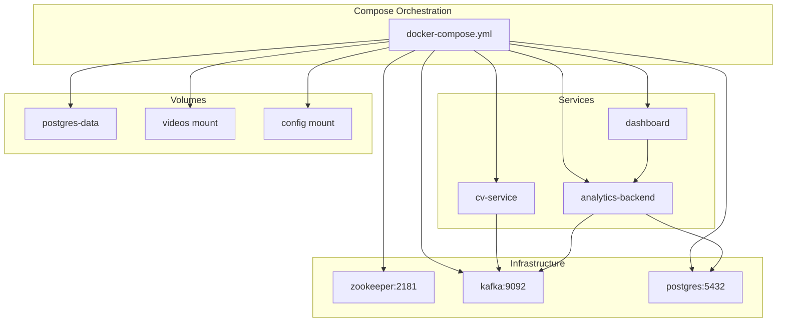
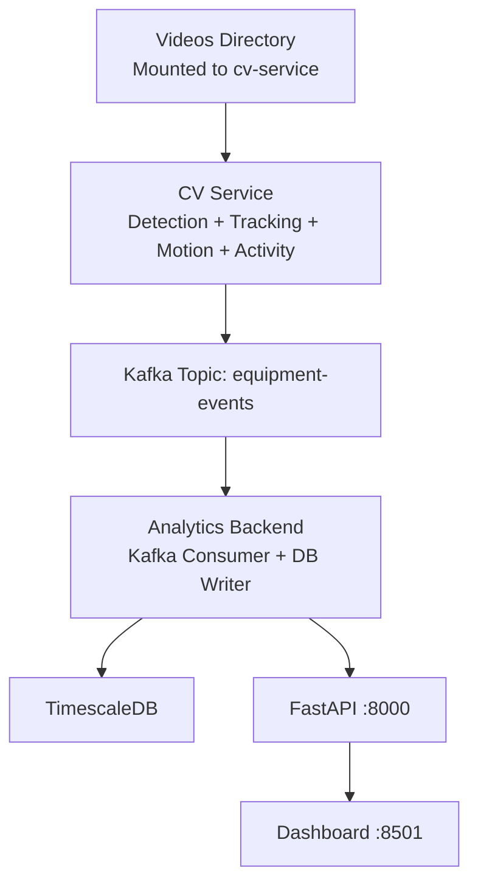
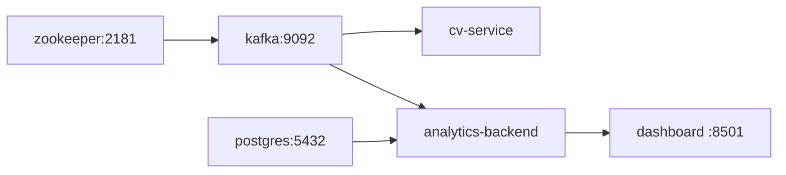

# Deployment Guide

<cite>
**Referenced Files in This Document**
- [docker-compose.yml](file://docker-compose.yml)
- [README.md](file://README.md)
- [settings.yaml](file://config/settings.yaml)
- [cv-service Dockerfile](file://services/cv_service/Dockerfile)
- [analytics-backend Dockerfile](file://services/analytics_backend/Dockerfile)
- [dashboard Dockerfile](file://services/dashboard/Dockerfile)
- [cv-service requirements.txt](file://services/cv_service/requirements.txt)
- [analytics-backend requirements.txt](file://services/analytics_backend/requirements.txt)
- [dashboard requirements.txt](file://services/dashboard/requirements.txt)
- [cv-service main.py](file://services/cv_service/src/main.py)
- [analytics-backend main.py](file://services/analytics_backend/src/main.py)
- [dashboard app.py](file://services/dashboard/src/app.py)
- [urls.txt](file://videos/urls.txt)
</cite>

## Table of Contents
1. [Introduction](#introduction)
2. [Project Structure](#project-structure)
3. [Core Components](#core-components)
4. [Architecture Overview](#architecture-overview)
5. [Detailed Component Analysis](#detailed-component-analysis)
6. [Dependency Analysis](#dependency-analysis)
7. [Performance Considerations](#performance-considerations)
8. [Security and Access Control](#security-and-access-control)
9. [Monitoring, Logging, and Alerting](#monitoring-logging-and-alerting)
10. [Production Deployment Procedures](#production-deployment-procedures)
11. [Upgrade, Rollback, and Maintenance](#upgrade-rollback-and-maintenance)
12. [Troubleshooting Guide](#troubleshooting-guide)
13. [Backup, Disaster Recovery, and Data Persistence](#backup-disaster-recovery-and-data-persistence)
14. [Conclusion](#conclusion)

## Introduction
This guide provides a comprehensive, production-ready deployment plan for the equipment monitoring system. It covers Docker Compose orchestration, service dependencies, container configuration, environment setup, networking, volume mounting, resource allocation, scaling, performance optimization, security, monitoring/logging/alerting, upgrades/rollbacks, and disaster recovery. The system is composed of a CV service, an analytics backend, a dashboard, Apache Kafka, ZooKeeper, and TimescaleDB.

## Project Structure
The deployment is orchestrated by a single Docker Compose file that defines services, networks, volumes, and environment variables. Configuration is centralized in a YAML file mounted into services at runtime. The CV service consumes video assets from a mounted directory and publishes events to Kafka. The analytics backend consumes Kafka events, persists to TimescaleDB, and exposes a FastAPI endpoint. The dashboard queries the backend for real-time visualization.

**Diagram sources**
- [docker-compose.yml:1-95](file://docker-compose.yml#L1-L95)

**Section sources**
- [docker-compose.yml:1-95](file://docker-compose.yml#L1-L95)
- [README.md:84-118](file://README.md#L84-L118)

## Core Components
- ZooKeeper: Coordination for Kafka.
- Kafka: Event streaming for equipment events.
- Postgres (TimescaleDB): Time-series data storage.
- CV Service: Video ingestion and event generation, publishing to Kafka.
- Analytics Backend: Kafka consumer, persistence, FastAPI endpoints.
- Dashboard: Streamlit UI querying the backend.

Key runtime characteristics:
- Services depend on health checks before starting.
- Configuration is loaded from mounted YAML.
- CV service reads videos from a mounted directory and writes logs to stdout.
- Analytics backend initializes the database and starts a Uvicorn server.
- Dashboard polls backend endpoints at a configurable interval.

**Section sources**
- [docker-compose.yml:1-95](file://docker-compose.yml#L1-L95)
- [settings.yaml:1-59](file://config/settings.yaml#L1-L59)
- [cv-service main.py:500-571](file://services/cv_service/src/main.py#L500-L571)
- [analytics-backend main.py:64-149](file://services/analytics_backend/src/main.py#L64-L149)
- [dashboard app.py:26-57](file://services/dashboard/src/app.py#L26-L57)

## Architecture Overview
The system follows a streaming pipeline:
- Video ingestion and processing in the CV service.
- Event publishing to Kafka.
- Backend consumption and persistence to TimescaleDB.
- API exposure via FastAPI.
- Real-time visualization via Streamlit.

**Diagram sources**
- [settings.yaml:41-59](file://config/settings.yaml#L41-L59)
- [cv-service main.py:323-421](file://services/cv_service/src/main.py#L323-L421)
- [analytics-backend main.py:104-106](file://services/analytics_backend/src/main.py#L104-L106)
- [dashboard app.py:100-160](file://services/dashboard/src/app.py#L100-L160)

## Detailed Component Analysis

### Docker Compose Orchestration
- Services define images or build contexts, environment variables, ports, volumes, and health checks.
- Dependencies use health checks to ensure startup order.
- ZooKeeper and Kafka are exposed on host ports for local testing; adjust for production isolation.
- Postgres uses a named volume for durable storage.
- CV and analytics backend mount the config directory; CV additionally mounts videos.

Operational notes:
- Use external networks and restrict port exposure in production.
- Replace hardcoded credentials with secrets management.
- Consider resource limits and restart policies.

**Section sources**
- [docker-compose.yml:1-95](file://docker-compose.yml#L1-L95)

### Container Images and Dependencies
- Python slim base images with targeted system packages installed.
- Dependencies pinned via requirements files.
- CV service installs OpenCV and FFmpeg; backend installs psycopg2 and FastAPI; dashboard installs Streamlit and plotting libraries.

Best practices:
- Pin base images and dependencies.
- Use multi-stage builds to minimize attack surface.
- Scan images regularly.

**Section sources**
- [cv-service Dockerfile:1-23](file://services/cv_service/Dockerfile#L1-L23)
- [analytics-backend Dockerfile:1-23](file://services/analytics_backend/Dockerfile#L1-L23)
- [dashboard Dockerfile:1-17](file://services/dashboard/Dockerfile#L1-L17)
- [cv-service requirements.txt:1-7](file://services/cv_service/requirements.txt#L1-L7)
- [analytics-backend requirements.txt:1-8](file://services/analytics_backend/requirements.txt#L1-L8)
- [dashboard requirements.txt:1-6](file://services/dashboard/requirements.txt#L1-L6)

### Configuration Management
- Centralized YAML configuration is mounted into services.
- Services attempt multiple config paths to support both container and local development.
- Kafka and database connection details are configured centrally.

Recommendations:
- Externalize secrets and environment overrides via Compose profiles or secret files.
- Validate configuration on startup and fail fast on missing keys.

**Section sources**
- [settings.yaml:1-59](file://config/settings.yaml#L1-L59)
- [cv-service main.py:69-102](file://services/cv_service/src/main.py#L69-L102)
- [analytics-backend main.py:29-61](file://services/analytics_backend/src/main.py#L29-L61)
- [dashboard app.py:26-48](file://services/dashboard/src/app.py#L26-L48)

### Service Startup and Health
- ZooKeeper and Kafka expose health checks using shell commands and CLI tools respectively.
- Postgres health check uses pg_isready.
- CV service and analytics backend handle graceful shutdown via signal handlers.
- Dashboard polls backend health and data endpoints with timeouts.

Production hardening:
- Tune health check intervals/timeouts.
- Add readiness probes for API services.
- Implement circuit breaker patterns in the dashboard.

**Section sources**
- [docker-compose.yml:9-13](file://docker-compose.yml#L9-L13)
- [docker-compose.yml:28-33](file://docker-compose.yml#L28-L33)
- [docker-compose.yml:45-49](file://docker-compose.yml#L45-L49)
- [cv-service main.py:143-160](file://services/cv_service/src/main.py#L143-L160)
- [analytics-backend main.py:110-118](file://services/analytics_backend/src/main.py#L110-L118)
- [dashboard app.py:100-108](file://services/dashboard/src/app.py#L100-L108)

### Kafka and Database Connectivity
- Kafka advertised listeners and offsets replication factor are configured for single-node operation.
- Analytics backend loads Kafka and DB settings from configuration and initializes the database engine.
- Dashboard resolves the backend API URL from configuration.

Guidance:
- For clustered Kafka, adjust advertised listeners and replication factors.
- Use connection pooling and retry/backoff in backend.
- Ensure database migrations are handled outside the container lifecycle.

**Section sources**
- [docker-compose.yml:22-27](file://docker-compose.yml#L22-L27)
- [settings.yaml:41-59](file://config/settings.yaml#L41-L59)
- [analytics-backend main.py:82-89](file://services/analytics_backend/src/main.py#L82-L89)
- [dashboard app.py:42-56](file://services/dashboard/src/app.py#L42-L56)

## Dependency Analysis
Inter-service dependencies and data flow:

**Diagram sources**
- [docker-compose.yml:17-19](file://docker-compose.yml#L17-L19)
- [docker-compose.yml:68-72](file://docker-compose.yml#L68-L72)
- [settings.yaml:41-59](file://config/settings.yaml#L41-L59)

**Section sources**
- [docker-compose.yml:1-95](file://docker-compose.yml#L1-L95)
- [settings.yaml:1-59](file://config/settings.yaml#L1-L59)

## Performance Considerations
- CPU-centric pipeline: YOLOv8 nano, frame skipping, and resizing reduce inference cost.
- Kafka topic auto-creation enabled; tune retention and partitions for throughput.
- Postgres/TimescaleDB indexing and hypertables should be tuned for time-series workload.
- Dashboard caching reduces API pressure; adjust TTLs for freshness vs. load balance.

Recommendations:
- Scale Kafka and ZooKeeper for production throughput.
- Provision adequate CPU/RAM for CV service; consider dedicated workers.
- Use read replicas for the database if write-heavy.
- Enable compression and batching in Kafka producers.

**Section sources**
- [README.md:177-198](file://README.md#L177-L198)
- [settings.yaml:3-14](file://config/settings.yaml#L3-L14)
- [cv-service requirements.txt:1-7](file://services/cv_service/requirements.txt#L1-L7)

## Security and Access Control
- Current deployment exposes ports 2181, 9092, 5432, 8000, 8501 on host. Restrict exposure in production.
- Default credentials for Postgres are embedded in Compose and settings; replace with secrets.
- No TLS termination is configured for Kafka or Postgres; enable TLS in production.
- No API authentication is present; add authentication/authorization at the gateway or reverse proxy.

Actions:
- Move credentials to Docker secrets or external secret manager.
- Place Kafka/Postgres behind a private network; expose only necessary ports.
- Add TLS for Kafka and Postgres; configure client certificates.
- Integrate API authentication (e.g., JWT) and rate limiting.

**Section sources**
- [docker-compose.yml:7-8](file://docker-compose.yml#L7-L8)
- [docker-compose.yml:20-21](file://docker-compose.yml#L20-L21)
- [docker-compose.yml:41-42](file://docker-compose.yml#L41-L42)
- [docker-compose.yml:73-74](file://docker-compose.yml#L73-L74)
- [docker-compose.yml:86-87](file://docker-compose.yml#L86-L87)
- [settings.yaml:37-53](file://config/settings.yaml#L37-L53)

## Monitoring, Logging, and Alerting
- Services log to stdout/stderr; capture via Docker logging driver or agent.
- Health checks are defined for core services; extend with custom readiness/liveness endpoints.
- Dashboard performs periodic health checks against the backend.

Implementation tips:
- Centralize logs with a SIEM or ELK stack.
- Export metrics from backend (e.g., Prometheus) and dashboards.
- Define alerts for Kafka lag, DB connection failures, and backend downtime.
- Add structured logging with correlation IDs.

**Section sources**
- [docker-compose.yml:9-13](file://docker-compose.yml#L9-L13)
- [docker-compose.yml:28-33](file://docker-compose.yml#L28-L33)
- [docker-compose.yml:45-49](file://docker-compose.yml#L45-L49)
- [analytics-backend main.py:18-26](file://services/analytics_backend/src/main.py#L18-L26)
- [dashboard app.py:100-108](file://services/dashboard/src/app.py#L100-L108)

## Production Deployment Procedures
- Prepare environment:
  - Create a dedicated Docker network.
  - Store secrets externally (Compose secrets or external vault).
  - Provision persistent volumes for Postgres.
- Adjust Compose:
  - Remove host port bindings; use ingress proxies.
  - Add restart policies, resource limits, and ulimits.
  - Split services into separate stacks if needed (CV ingestion, analytics, dashboard).
- Deploy:
  - Bring up ZooKeeper and Kafka first, wait for health.
  - Start Postgres and run migrations.
  - Start analytics backend and verify DB connectivity.
  - Start CV service and dashboard.
- Validate:
  - Confirm health checks pass.
  - Verify Kafka topic creation and event flow.
  - Check dashboard connectivity and data freshness.

**Section sources**
- [docker-compose.yml:1-95](file://docker-compose.yml#L1-L95)
- [README.md:84-118](file://README.md#L84-L118)

## Upgrade, Rollback, and Maintenance
- Rolling upgrades:
  - Drain Kafka consumers before backend restarts.
  - Use zero-downtime deployments with multiple replicas where applicable.
- Rollback:
  - Tag images; roll back to previous image tag.
  - For DB changes, maintain reversible migrations.
- Maintenance:
  - Schedule maintenance windows for Kafka/DB upgrades.
  - Rotate secrets and update configs via rolling restarts.

**Section sources**
- [README.md:224-233](file://README.md#L224-L233)
- [analytics-backend main.py:110-118](file://services/analytics_backend/src/main.py#L110-L118)

## Troubleshooting Guide
Common issues and resolutions:
- Kafka not ready:
  - Verify ZooKeeper health and advertised listeners.
  - Check Kafka broker API versions health check.
- Postgres connection failures:
  - Confirm DB is healthy and reachable.
  - Validate credentials and URI in settings.
- CV service cannot read videos:
  - Ensure videos directory is mounted and readable.
  - Check file permissions and paths.
- Backend cannot connect to Kafka:
  - Validate bootstrap servers and topic configuration.
- Dashboard cannot reach backend:
  - Confirm backend is healthy and listening on the configured port.
  - Check network routing and DNS resolution.

**Section sources**
- [docker-compose.yml:9-13](file://docker-compose.yml#L9-L13)
- [docker-compose.yml:28-33](file://docker-compose.yml#L28-L33)
- [docker-compose.yml:45-49](file://docker-compose.yml#L45-L49)
- [settings.yaml:41-59](file://config/settings.yaml#L41-L59)
- [cv-service main.py:161-182](file://services/cv_service/src/main.py#L161-L182)
- [dashboard app.py:100-108](file://services/dashboard/src/app.py#L100-L108)

## Backup, Disaster Recovery, and Data Persistence
- Data persistence:
  - Postgres volume persists database data; back up regularly.
- Event durability:
  - Kafka retention and replication configured for single-node; scale for HA.
- Recovery:
  - Restore Postgres from backups to a new container and reattach the volume.
  - Rebuild CV service images and reprocess missing videos if needed.
- DR planning:
  - Replicate Kafka clusters across availability zones.
  - Maintain offsite backups and test restore procedures.

**Section sources**
- [docker-compose.yml:43-44](file://docker-compose.yml#L43-L44)
- [docker-compose.yml:26-27](file://docker-compose.yml#L26-L27)
- [README.md:224-233](file://README.md#L224-L233)

## Conclusion
This guide outlines a robust, production-grade deployment strategy for the equipment monitoring system. By leveraging Docker Compose for orchestration, centralizing configuration, enforcing security hardening, and implementing monitoring and disaster recovery practices, teams can operate a scalable and reliable pipeline from video ingestion to real-time dashboards.