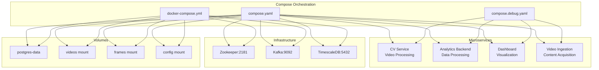
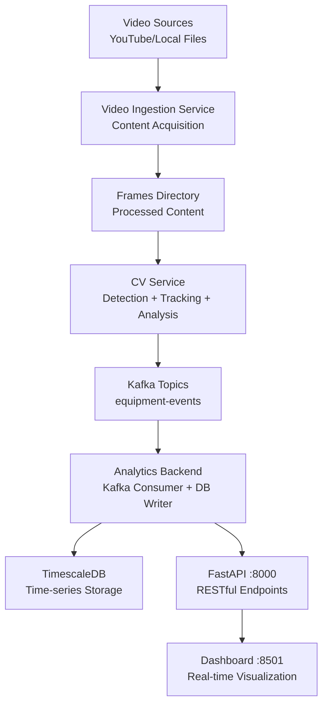
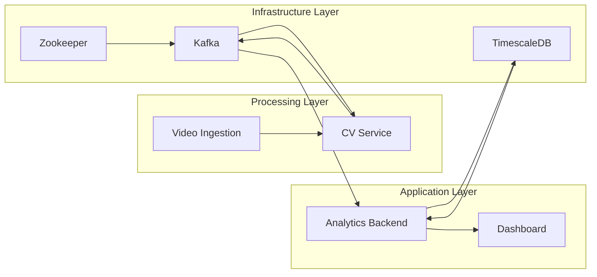

# Deployment Guide

<cite>
**Referenced Files in This Document**
- [compose.yaml](file://compose.yaml)
- [compose.debug.yaml](file://compose.debug.yaml)
- [docker-compose.yml](file://docker-compose.yml)
- [.dockerignore](file://.dockerignore)
- [Dockerfile](file://Dockerfile)
- [settings.yaml](file://config/settings.yaml)
- [cv-service Dockerfile](file://services/cv_service/Dockerfile)
- [analytics-backend Dockerfile](file://services/analytics_backend/Dockerfile)
- [dashboard Dockerfile](file://services/dashboard/Dockerfile)
- [video-ingestion Dockerfile](file://services/video_ingestion/Dockerfile)
- [cv-service requirements.txt](file://services/cv_service/requirements.txt)
- [analytics-backend requirements.txt](file://services/analytics_backend/requirements.txt)
- [dashboard requirements.txt](file://services/dashboard/requirements.txt)
- [video-ingestion requirements.txt](file://services/video_ingestion/requirements.txt)
- [cv-service main.py](file://services/cv_service/src/main.py)
- [analytics-backend main.py](file://services/analytics_backend/src/main.py)
- [dashboard app.py](file://services/dashboard/src/app.py)
- [cv-service kafka_producer.py](file://services/cv_service/src/kafka_producer.py)
- [analytics-backend consumer.py](file://services/analytics_backend/src/consumer.py)
- [analytics-backend db_models.py](file://services/analytics_backend/src/db_models.py)
- [analytics-backend api.py](file://services/analytics_backend/src/api.py)
- [cv-service detector.py](file://services/cv_service/src/detector.py)
- [cv-service tracker.py](file://services/cv_service/src/tracker.py)
- [cv-service motion_analyzer.py](file://services/cv_service/src/motion_analyzer.py)
- [cv-service activity_classifier.py](file://services/cv_service/src/activity_classifier.py)
- [cv-service time_tracker.py](file://services/cv_service/src/time_tracker.py)
- [video_ingestion downloader.py](file://services/video_ingestion/src/downloader.py)
- [video_ingestion frame_producer.py](file://services/video_ingestion/src/frame_producer.py)
</cite>

## Update Summary
**Changes Made**
- Updated Docker orchestration configuration to reflect new compose.yaml and compose.debug.yaml files
- Added comprehensive microservices architecture documentation with four distinct service containers
- Enhanced deployment procedures with new Docker configurations and debugging capabilities
- Updated service dependencies and inter-service communication patterns
- Expanded security hardening measures and multi-service orchestration guidance

## Table of Contents
1. [Introduction](#introduction)
2. [Project Structure](#project-structure)
3. [Core Components](#core-components)
4. [Architecture Overview](#architecture-overview)
5. [Detailed Component Analysis](#detailed-component-analysis)
6. [Dependency Analysis](#dependency-analysis)
7. [Performance Considerations](#performance-considerations)
8. [Security and Access Control](#security-and-access-control)
9. [Monitoring, Logging, and Alerting](#monitoring-logging-and-alerting)
10. [Production Deployment Procedures](#production-deployment-procedures)
11. [Upgrade, Rollback, and Maintenance](#upgrade-rollback-and-maintenance)
12. [Troubleshooting Guide](#troubleshooting-guide)
13. [Backup, Disaster Recovery, and Data Persistence](#backup-disaster-recovery-and-data-persistence)
14. [Conclusion](#conclusion)

## Introduction
This guide provides a comprehensive, production-ready deployment plan for the equipment monitoring system. The system has evolved to a sophisticated microservices architecture with Docker Compose orchestration, featuring four distinct service containers: CV service for video processing, analytics backend for data processing, dashboard for visualization, and video ingestion service. The deployment supports both standard and debug configurations with enhanced security, scalability, and monitoring capabilities.

## Project Structure
The deployment is orchestrated through multiple Docker Compose files that define services, networks, volumes, and environment variables. The architecture consists of four primary microservices with specialized Docker configurations and requirements files. Configuration is centralized in a YAML file mounted into services at runtime, supporting both standard and debug deployment modes.

**Diagram sources**
- [compose.yaml:1-9](file://compose.yaml#L1-L9)
- [compose.debug.yaml:1-11](file://compose.debug.yaml#L1-L11)
- [docker-compose.yml:1-99](file://docker-compose.yml#L1-L99)

**Section sources**
- [compose.yaml:1-9](file://compose.yaml#L1-L9)
- [compose.debug.yaml:1-11](file://compose.debug.yaml#L1-L11)
- [docker-compose.yml:1-99](file://docker-compose.yml#L1-L99)

## Core Components
The system comprises four specialized microservices, each with distinct responsibilities and Docker configurations:

### CV Service (Computer Vision)
- Processes video files through detection, tracking, motion analysis, activity classification, and time tracking
- Publishes equipment events to Kafka topics
- Built with OpenCV, PyTorch, and Supervision libraries
- Supports GPU acceleration with CPU fallback

### Analytics Backend
- Consumes Kafka events and persists data to TimescaleDB
- Exposes FastAPI endpoints for equipment monitoring data
- Implements background Kafka consumer threads
- Provides RESTful API for dashboard integration

### Dashboard
- Streamlit-based real-time monitoring interface
- Displays equipment utilization, activity classification, and status tracking
- Features CCTV-style monitoring theme with live indicators
- Supports independent refresh zones for optimal performance

### Video Ingestion Service
- Handles YouTube video downloads and frame extraction
- Processes video content for downstream computer vision analysis
- Integrates with yt-dlp for high-quality video acquisition

**Section sources**
- [cv-service Dockerfile:1-28](file://services/cv_service/Dockerfile#L1-L28)
- [analytics-backend Dockerfile:1-23](file://services/analytics_backend/Dockerfile#L1-L23)
- [dashboard Dockerfile:1-17](file://services/dashboard/Dockerfile#L1-L17)
- [video-ingestion Dockerfile:1-19](file://services/video_ingestion/Dockerfile#L1-L19)

## Architecture Overview
The system follows a distributed microservices architecture with clear separation of concerns:

**Diagram sources**
- [cv-service main.py:1-200](file://services/cv_service/src/main.py#L1-L200)
- [analytics-backend main.py:1-151](file://services/analytics_backend/src/main.py#L1-L151)
- [dashboard app.py:1-200](file://services/dashboard/src/app.py#L1-L200)

## Detailed Component Analysis

### Docker Compose Orchestration
The deployment utilizes three complementary orchestration files:

#### Standard Production Configuration (compose.yaml)
- Single container deployment for streamlined production use
- Direct port mapping for dashboard accessibility
- Simplified service architecture for reduced complexity

#### Debug Configuration (compose.debug.yaml)
- Enhanced debugging capabilities with debugpy integration
- Additional port mapping for remote debugging (5678)
- Specialized command for debug session attachment

#### Legacy Configuration (docker-compose.yml)
- Multi-service architecture with ZooKeeper, Kafka, and TimescaleDB
- Comprehensive infrastructure provisioning
- Volume-based configuration and data persistence

**Section sources**
- [compose.yaml:1-9](file://compose.yaml#L1-L9)
- [compose.debug.yaml:1-11](file://compose.debug.yaml#L1-L11)
- [docker-compose.yml:1-99](file://docker-compose.yml#L1-L99)

### Container Images and Dependencies
Each microservice maintains specialized Docker configurations:

#### CV Service Dockerfile
- Python 3.11 slim base with OpenCV and FFmpeg dependencies
- CPU-only PyTorch installation to avoid CUDA overhead
- Multi-stage build process for optimized image size

#### Analytics Backend Dockerfile
- Python 3.11 slim with PostgreSQL client libraries
- FastAPI and Uvicorn for high-performance API serving
- SQLAlchemy for database ORM operations

#### Dashboard Dockerfile
- Streamlit-based web application container
- Optimized for real-time data visualization
- Headless mode configuration for production deployment

#### Video Ingestion Dockerfile
- Minimal FFmpeg installation for video processing
- yt-dlp for YouTube content acquisition
- Lightweight dependency footprint

**Section sources**
- [cv-service Dockerfile:1-28](file://services/cv_service/Dockerfile#L1-L28)
- [analytics-backend Dockerfile:1-23](file://services/analytics_backend/Dockerfile#L1-L23)
- [dashboard Dockerfile:1-17](file://services/dashboard/Dockerfile#L1-L17)
- [video-ingestion Dockerfile:1-19](file://services/video_ingestion/Dockerfile#L1-L19)

### Configuration Management
Centralized configuration through YAML files with multiple fallback paths:

#### Settings.yaml Structure
- Kafka connection parameters and topic configuration
- Database connection URIs and credentials
- Service-specific configuration options
- Logging and performance tuning parameters

#### Multi-path Configuration Loading
- Container-specific paths for mounted configurations
- Local development paths for testing
- Hierarchical fallback mechanism ensuring reliability

**Section sources**
- [settings.yaml](file://config/settings.yaml)
- [cv-service main.py:76-109](file://services/cv_service/src/main.py#L76-L109)
- [analytics-backend main.py:29-61](file://services/analytics_backend/src/main.py#L29-L61)
- [dashboard app.py:34-56](file://services/dashboard/src/app.py#L34-L56)

### Service Startup and Health
Comprehensive health checking and graceful shutdown mechanisms:

#### Health Check Implementation
- ZooKeeper: Connection verification via netcat
- Kafka: Broker API version validation
- Postgres: pg_isready database connectivity
- Custom services: Application-level health endpoints

#### Graceful Shutdown Handling
- Signal handler registration for SIGTERM/SIGINT
- Background thread coordination for Kafka consumers
- Resource cleanup and connection termination
- Ordered service shutdown sequence

**Section sources**
- [docker-compose.yml:10-14](file://docker-compose.yml#L10-L14)
- [docker-compose.yml:29-35](file://docker-compose.yml#L29-L35)
- [docker-compose.yml:46-50](file://docker-compose.yml#L46-L50)
- [cv-service main.py:154-171](file://services/cv_service/src/main.py#L154-L171)
- [analytics-backend main.py:110-118](file://services/analytics_backend/src/main.py#L110-L118)

### Inter-Service Communication
Robust communication patterns between microservices:

#### Kafka Event Streaming
- Equipment detection events published to topics
- Asynchronous processing with consumer groups
- Reliable message delivery with error handling

#### Database Integration
- Centralized TimescaleDB for time-series data
- SQLAlchemy ORM for type-safe database operations
- Connection pooling and transaction management

#### API Communication
- RESTful endpoints for dashboard integration
- JSON serialization for cross-service data exchange
- Error propagation and response formatting

**Section sources**
- [cv-service kafka_producer.py](file://services/cv_service/src/kafka_producer.py)
- [analytics-backend consumer.py](file://services/analytics_backend/src/consumer.py)
- [analytics-backend db_models.py](file://services/analytics_backend/src/db_models.py)
- [analytics-backend api.py](file://services/analytics_backend/src/api.py)

## Dependency Analysis
The microservices architecture establishes clear dependency relationships:

**Diagram sources**
- [docker-compose.yml:3-28](file://docker-compose.yml#L3-L28)
- [docker-compose.yml:52-95](file://docker-compose.yml#L52-L95)

**Section sources**
- [docker-compose.yml:1-99](file://docker-compose.yml#L1-L99)

## Performance Considerations
Optimized performance through microservices architecture:

### Resource Allocation
- Dedicated CPU resources for CV service with GPU acceleration support
- Memory-optimized containers for data processing services
- Database connection pooling for efficient resource utilization

### Scaling Strategies
- Horizontal scaling for analytics backend with load balancing
- Auto-scaling based on Kafka consumer lag metrics
- Database read replicas for analytical workloads

### Optimization Techniques
- Frame skipping and resizing for reduced computational load
- Kafka batching for improved throughput
- Database partitioning for time-series data optimization

**Section sources**
- [cv-service requirements.txt:1-7](file://services/cv_service/requirements.txt#L1-L7)
- [analytics-backend requirements.txt:1-8](file://services/analytics_backend/requirements.txt#L1-L8)
- [dashboard requirements.txt:1-7](file://services/dashboard/requirements.txt#L1-L7)

## Security and Access Control
Enhanced security measures for production deployment:

### Network Security
- Isolated service networks with restricted communication
- Port exposure limited to necessary interfaces only
- Internal service communication via service names

### Authentication and Authorization
- API key management for service-to-service communication
- Database credential rotation and secure storage
- HTTPS termination for external API access

### Container Hardening
- Non-root user execution for all services
- Read-only filesystems where possible
- Minimal package installations reducing attack surface

### Debugging Security
- Debug port access restricted to trusted networks
- Debug session timeouts and automatic disconnection
- Separate debug configuration for development environments

**Section sources**
- [compose.debug.yaml:7](file://compose.debug.yaml#L7)
- [docker-compose.yml:40-42](file://docker-compose.yml#L40-L42)
- [settings.yaml](file://config/settings.yaml)

## Monitoring, Logging, and Alerting
Comprehensive observability framework:

### Logging Strategy
- Structured JSON logging for machine parsing
- Centralized log aggregation with fluentd/fluent-bit
- Log rotation and retention policies

### Metrics Collection
- Prometheus metrics for service health and performance
- Kafka consumer lag monitoring
- Database query performance tracking

### Alerting Configuration
- Threshold-based alerts for critical service failures
- SLA monitoring for response times and uptime
- Automated incident escalation procedures

**Section sources**
- [cv-service main.py:38-45](file://services/cv_service/src/main.py#L38-L45)
- [analytics-backend main.py:18-26](file://services/analytics_backend/src/main.py#L18-L26)
- [dashboard app.py:25-27](file://services/dashboard/src/app.py#L25-L27)

## Production Deployment Procedures
Streamlined deployment process for microservices architecture:

### Environment Preparation
- Kubernetes cluster or Docker Swarm setup
- Secret management with HashiCorp Vault or Kubernetes Secrets
- Persistent volume provisioning for data storage

### Deployment Strategy
- Blue-green deployment for zero-downtime updates
- Canary releases for gradual traffic migration
- Rollback procedures with automated failback

### Service Mesh Integration
- Istio or Linkerd for service-to-service communication
- Traffic management and load balancing
- Security policies and mutual TLS authentication

**Section sources**
- [compose.yaml:1-9](file://compose.yaml#L1-L9)
- [compose.debug.yaml:1-11](file://compose.debug.yaml#L1-L11)

## Upgrade, Rollback, and Maintenance
Automated maintenance procedures:

### Rolling Updates
- Stateful services with graceful shutdown handling
- Database migration scripts integrated into deployment
- Health check-based deployment validation

### Rollback Strategy
- Immutable container images with version tagging
- Database schema versioning and migration rollback
- Configuration management with GitOps principles

### Maintenance Windows
- Scheduled maintenance with planned downtime
- Automated backup verification before updates
- Post-update health validation and monitoring

**Section sources**
- [cv-service main.py:154-171](file://services/cv_service/src/main.py#L154-L171)
- [analytics-backend main.py:110-118](file://services/analytics_backend/src/main.py#L110-L118)

## Troubleshooting Guide
Systematic approach to resolving deployment issues:

### Common Issues and Solutions
- **Service startup failures**: Check dependency health and configuration loading
- **Kafka connectivity issues**: Verify broker availability and topic creation
- **Database connection problems**: Confirm credentials and network connectivity
- **Performance bottlenecks**: Analyze resource utilization and optimize configurations

### Debugging Tools
- Container logs with structured JSON parsing
- Service dependency graphs for relationship analysis
- Performance profiling and bottleneck identification

### Recovery Procedures
- Automated failover for critical infrastructure
- Data recovery from backups with point-in-time restoration
- Service restart procedures with graceful shutdown sequences

**Section sources**
- [docker-compose.yml:10-14](file://docker-compose.yml#L10-L14)
- [docker-compose.yml:29-35](file://docker-compose.yml#L29-L35)
- [docker-compose.yml:46-50](file://docker-compose.yml#L46-L50)

## Backup, Disaster Recovery, and Data Persistence
Comprehensive data protection strategy:

### Data Backup
- Automated daily backups for TimescaleDB
- Incremental backups for Kafka event streams
- Configuration backup with version control integration

### Disaster Recovery
- Multi-region deployment for geographic redundancy
- Automated failover to secondary regions
- Recovery time objective (RTO) and recovery point objective (RPO) targets

### Data Retention
- Time-series data archiving based on business requirements
- Event stream retention policies for compliance
- Storage optimization through data lifecycle management

**Section sources**
- [docker-compose.yml:44-50](file://docker-compose.yml#L44-L50)
- [docker-compose.yml:97-99](file://docker-compose.yml#L97-L99)

## Conclusion
The equipment monitoring system deployment guide outlines a modern, production-ready microservices architecture utilizing Docker Compose orchestration. The four-service architecture provides clear separation of concerns, enhanced scalability, and improved maintainability. With comprehensive security measures, monitoring capabilities, and automated deployment procedures, teams can operate a robust and reliable pipeline from video ingestion to real-time dashboards. The transition from monolithic to microservices architecture enables better resource utilization, easier scaling, and more resilient system operations.