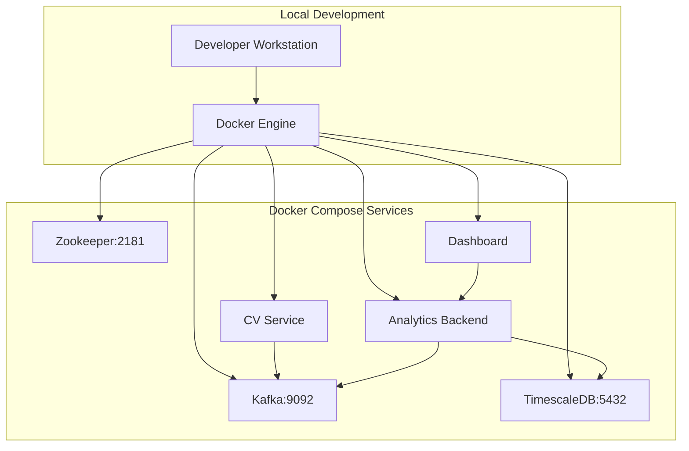
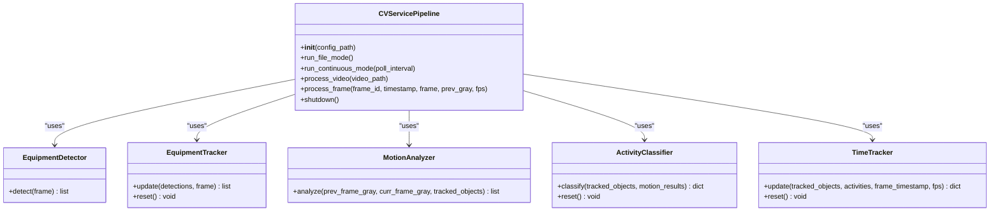
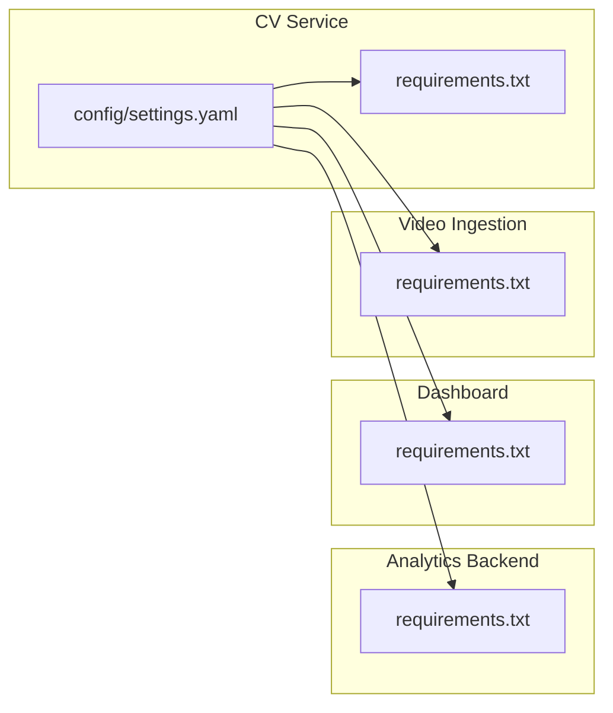

# Development Guide

<cite>
**Referenced Files in This Document**
- [README.md](file://README.md)
- [docker-compose.yml](file://docker-compose.yml)
- [config/settings.yaml](file://config/settings.yaml)
- [services/cv_service/src/main.py](file://services/cv_service/src/main.py)
- [services/cv_service/src/detector.py](file://services/cv_service/src/detector.py)
- [services/cv_service/src/tracker.py](file://services/cv_service/src/tracker.py)
- [services/cv_service/src/motion_analyzer.py](file://services/cv_service/src/motion_analyzer.py)
- [services/cv_service/src/activity_classifier.py](file://services/cv_service/src/activity_classifier.py)
- [services/cv_service/src/time_tracker.py](file://services/cv_service/src/time_tracker.py)
- [services/analytics_backend/src/main.py](file://services/analytics_backend/src/main.py)
- [services/dashboard/src/app.py](file://services/dashboard/src/app.py)
- [services/video_ingestion/src/downloader.py](file://services/video_ingestion/src/downloader.py)
- [tests/conftest.py](file://tests/conftest.py)
</cite>

## Table of Contents
1. [Introduction](#introduction)
2. [Project Structure](#project-structure)
3. [Core Components](#core-components)
4. [Architecture Overview](#architecture-overview)
5. [Detailed Component Analysis](#detailed-component-analysis)
6. [Dependency Analysis](#dependency-analysis)
7. [Performance Considerations](#performance-considerations)
8. [Troubleshooting Guide](#troubleshooting-guide)
9. [Contribution Guidelines](#contribution-guidelines)
10. [Extensibility and Feature Implementation](#extensibility-and-feature-implementation)
11. [Development Tools and Testing](#development-tools-and-testing)
12. [Conclusion](#conclusion)

## Introduction
This guide provides a comprehensive development workflow for the equipment monitoring system. It covers local environment setup, dependency management, coding standards, contribution practices, and extensibility patterns. The system is a microservices pipeline built with Docker Compose, featuring a computer vision service, an analytics backend, and a Streamlit dashboard. It leverages YOLOv8 for detection, ByteTrack for tracking, OpenCV optical flow for motion analysis, and Kafka for event streaming.

## Project Structure
The repository is organized into modular services under services/, a shared configuration directory, and a test suite. The docker-compose orchestrates six containers: Zookeeper, Kafka, TimescaleDB, CV Service, Analytics Backend, and Dashboard.



**Diagram sources**
- [docker-compose.yml:1-95](file://docker-compose.yml#L1-L95)

**Section sources**
- [README.md:340-384](file://README.md#L340-L384)
- [docker-compose.yml:1-95](file://docker-compose.yml#L1-L95)

## Core Components
- CV Service: Orchestrates detection, tracking, motion analysis, activity classification, time tracking, and Kafka publishing. See [services/cv_service/src/main.py:42-498](file://services/cv_service/src/main.py#L42-L498).
- Analytics Backend: FastAPI REST API with a Kafka consumer and TimescaleDB persistence. See [services/analytics_backend/src/main.py:64-145](file://services/analytics_backend/src/main.py#L64-L145).
- Dashboard: Streamlit UI consuming the backend API. See [services/dashboard/src/app.py:518-621](file://services/dashboard/src/app.py#L518-L621).
- Video Ingestion: YouTube downloader utility. See [services/video_ingestion/src/downloader.py:30-276](file://services/video_ingestion/src/downloader.py#L30-L276).

Key coding patterns:
- Modular components with explicit configuration-driven initialization.
- Centralized configuration via YAML for tunables and runtime paths.
- Event-driven architecture using Kafka topics for decoupling producers and consumers.

**Section sources**
- [services/cv_service/src/main.py:42-498](file://services/cv_service/src/main.py#L42-L498)
- [services/analytics_backend/src/main.py:64-145](file://services/analytics_backend/src/main.py#L64-L145)
- [services/dashboard/src/app.py:518-621](file://services/dashboard/src/app.py#L518-L621)
- [services/video_ingestion/src/downloader.py:30-276](file://services/video_ingestion/src/downloader.py#L30-L276)

## Architecture Overview
The system follows a microservices architecture with clear separation of concerns:
- CV Service: Real-time computer vision processing and event publishing.
- Analytics Backend: Consumes events, persists to TimescaleDB, and exposes a REST API.
- Dashboard: Real-time visualization powered by the backend API.

```mermaid
graph TB
subgraph "Data Sources"
Cam["Video Files<br/>.mp4"]
YT["YouTube URLs<br/>videos/urls.txt"]
end
subgraph "CV Pipeline"
Det["Detector<br/>YOLOv8"]
Trk["Tracker<br/>ByteTrack"]
Mot["Motion Analyzer<br/>Optical Flow"]
Act["Activity Classifier<br/>Rule-based"]
Tme["Time Tracker<br/>Utilization"]
Pub["Kafka Producer"]
end
subgraph "Backend"
Con["Kafka Consumer"]
DB[("TimescaleDB")]
API["FastAPI"]
end
subgraph "UI"
UI["Streamlit Dashboard"]
end
Cam --> Det
YT --> Cam
Det --> Trk --> Mot --> Act --> Tme --> Pub --> Con --> DB
Con --> API --> UI
```

**Diagram sources**
- [services/cv_service/src/main.py:323-421](file://services/cv_service/src/main.py#L323-L421)
- [services/analytics_backend/src/main.py:104-122](file://services/analytics_backend/src/main.py#L104-L122)
- [services/dashboard/src/app.py:110-160](file://services/dashboard/src/app.py#L110-L160)

## Detailed Component Analysis

### CV Service Pipeline Orchestration
The CV Service orchestrates the entire pipeline, managing configuration loading, component initialization, frame iteration, and event publishing.



**Diagram sources**
- [services/cv_service/src/main.py:42-498](file://services/cv_service/src/main.py#L42-L498)
- [services/cv_service/src/detector.py:18-170](file://services/cv_service/src/detector.py#L18-L170)
- [services/cv_service/src/tracker.py:19-341](file://services/cv_service/src/tracker.py#L19-L341)
- [services/cv_service/src/motion_analyzer.py:24-442](file://services/cv_service/src/motion_analyzer.py#L24-L442)
- [services/cv_service/src/activity_classifier.py:23-306](file://services/cv_service/src/activity_classifier.py#L23-L306)
- [services/cv_service/src/time_tracker.py:21-265](file://services/cv_service/src/time_tracker.py#L21-L265)

**Section sources**
- [services/cv_service/src/main.py:42-498](file://services/cv_service/src/main.py#L42-L498)

### Computer Vision Components

#### Detector (YOLOv8)
- Loads a YOLOv8 model and filters detections by confidence and target classes.
- Exposes a detect(frame) interface returning structured detections.

**Section sources**
- [services/cv_service/src/detector.py:18-170](file://services/cv_service/src/detector.py#L18-L170)

#### Tracker (ByteTrack via Supervision)
- Converts detection results to supervision format and applies ByteTrack.
- Assigns persistent equipment IDs with class-based prefixes and maintains per-class counters.

**Section sources**
- [services/cv_service/src/tracker.py:19-341](file://services/cv_service/src/tracker.py#L19-L341)

#### Motion Analyzer (Region-based Optical Flow)
- Splits tracked bounding boxes into upper and lower regions.
- Computes Farneback optical flow per region and classifies motion source.

**Section sources**
- [services/cv_service/src/motion_analyzer.py:24-442](file://services/cv_service/src/motion_analyzer.py#L24-L442)

#### Activity Classifier (Rule-based State Machine)
- Applies N-frame smoothing and rule-based logic to classify activities.
- Produces state and activity labels used downstream.

**Section sources**
- [services/cv_service/src/activity_classifier.py:23-306](file://services/cv_service/src/activity_classifier.py#L23-L306)

#### Time Tracker
- Accumulates active and idle durations per equipment and computes utilization percentages.

**Section sources**
- [services/cv_service/src/time_tracker.py:21-265](file://services/cv_service/src/time_tracker.py#L21-L265)

### Analytics Backend
- Initializes database and FastAPI app, starts a Kafka consumer in a background thread, and runs the Uvicorn server.
- Provides health checks and endpoints documented in the project README.

**Section sources**
- [services/analytics_backend/src/main.py:64-145](file://services/analytics_backend/src/main.py#L64-L145)
- [README.md:236-260](file://README.md#L236-L260)

### Dashboard
- Fetches data from the backend API endpoints and renders real-time equipment status and utilization metrics.

**Section sources**
- [services/dashboard/src/app.py:518-621](file://services/dashboard/src/app.py#L518-L621)
- [README.md:236-260](file://README.md#L236-L260)

### Video Ingestion
- Downloads YouTube videos using yt-dlp and supports CLI and batch modes.

**Section sources**
- [services/video_ingestion/src/downloader.py:30-276](file://services/video_ingestion/src/downloader.py#L30-L276)

## Dependency Analysis
- Python dependencies are declared per service in requirements.txt.
- Centralized configuration in settings.yaml drives behavior across components.
- Docker Compose defines service interdependencies and exposed ports.



**Diagram sources**
- [services/cv_service/requirements.txt:1-7](file://services/cv_service/requirements.txt#L1-L7)
- [services/analytics_backend/requirements.txt:1-8](file://services/analytics_backend/requirements.txt#L1-L8)
- [config/settings.yaml:1-59](file://config/settings.yaml#L1-L59)

**Section sources**
- [services/cv_service/requirements.txt:1-7](file://services/cv_service/requirements.txt#L1-L7)
- [services/analytics_backend/requirements.txt:1-8](file://services/analytics_backend/requirements.txt#L1-L8)
- [docker-compose.yml:1-95](file://docker-compose.yml#L1-L95)
- [config/settings.yaml:1-59](file://config/settings.yaml#L1-L59)

## Performance Considerations
- CPU-first design: YOLOv8 nano, frame skipping, and resizing minimize resource usage.
- Region-based optical flow reduces computational cost by limiting analysis to bounding boxes.
- Kafka decouples producers from persistence to handle bursts and enable future consumers.

Practical tuning tips:
- Increase frame_skip or reduce resize_width to lower CPU usage.
- Adjust smoothing_window to reduce flickering at the cost of responsiveness.
- Tune magnitude_threshold and flow thresholds to balance sensitivity and noise robustness.

**Section sources**
- [README.md:177-198](file://README.md#L177-L198)
- [README.md:293-312](file://README.md#L293-L312)
- [config/settings.yaml:3-59](file://config/settings.yaml#L3-L59)

## Troubleshooting Guide
Common issues and resolutions:
- Missing configuration file: The CV Service attempts multiple config paths; ensure settings.yaml exists or mount the correct volume.
- Kafka connectivity: Verify Zookeeper and Kafka health checks; confirm advertised listeners and offsets topic replication factor.
- Database readiness: Confirm TimescaleDB health checks and credentials.
- Video ingestion: Ensure videos/urls.txt is populated and accessible; check yt-dlp logs for failures.

Operational checks:
- Use docker compose healthchecks to validate service readiness.
- Inspect logs from each container for error messages.
- Validate API endpoints via curl or browser to confirm backend and dashboard availability.

**Section sources**
- [services/cv_service/src/main.py:69-102](file://services/cv_service/src/main.py#L69-L102)
- [docker-compose.yml:9-33](file://docker-compose.yml#L9-L33)
- [docker-compose.yml:45-49](file://docker-compose.yml#L45-L49)
- [docker-compose.yml:28-33](file://docker-compose.yml#L28-L33)

## Contribution Guidelines
Workflow:
- Fork and branch from the default branch.
- Make changes in feature branches; keep commits focused and descriptive.
- Update documentation and configuration as needed.
- Run tests locally before opening a pull request.

Code review standards:
- Ensure adherence to configuration-driven design and modular componentization.
- Validate that new features integrate cleanly with Kafka event schema and API endpoints.
- Confirm performance impact remains within acceptable CPU constraints.

Pull request checklist:
- All tests pass (pytest).
- README updates reflect changes to configuration or behavior.
- docker-compose builds and services start successfully.

**Section sources**
- [README.md:388-391](file://README.md#L388-L391)
- [tests/conftest.py:14-164](file://tests/conftest.py#L14-L164)

## Extensibility and Feature Implementation

### Adding New Detection Models
- Extend the Detector to support additional models or ONNX/TensorRT backends.
- Update settings.yaml to select the new model and adjust input_size/device.
- Ensure class mapping remains configurable to align with new model’s class IDs.

Integration points:
- Detector initialization and detect() method.
- Configuration sections for model path, confidence, and target classes.

**Section sources**
- [services/cv_service/src/detector.py:35-84](file://services/cv_service/src/detector.py#L35-L84)
- [config/settings.yaml:8-20](file://config/settings.yaml#L8-L20)

### Integrating Additional Equipment Types
- Modify class_names and target_classes in settings.yaml to include new equipment categories.
- If domain-specific detection is required, replace YOLOv8 with a fine-tuned model and update Detector accordingly.

**Section sources**
- [config/settings.yaml:13-20](file://config/settings.yaml#L13-L20)
- [README.md:199-223](file://README.md#L199-L223)

### Extending Activity Classification
- Introduce new rules in ActivityClassifier while preserving smoothing behavior.
- Add new activity constants and update state mapping if needed.

**Section sources**
- [services/cv_service/src/activity_classifier.py:23-125](file://services/cv_service/src/activity_classifier.py#L23-L125)

### Enhancing Motion Analysis
- Experiment with different optical flow methods or region splitting strategies.
- Calibrate thresholds in settings.yaml for improved robustness.

**Section sources**
- [services/cv_service/src/motion_analyzer.py:59-87](file://services/cv_service/src/motion_analyzer.py#L59-L87)
- [config/settings.yaml:31-40](file://config/settings.yaml#L31-L40)

### Microservices Architecture Patterns
- Keep services loosely coupled via Kafka topics and REST APIs.
- Maintain backward-compatible event schemas to avoid breaking consumers.

**Section sources**
- [README.md:263-285](file://README.md#L263-L285)
- [services/analytics_backend/src/main.py:104-122](file://services/analytics_backend/src/main.py#L104-L122)

## Development Tools and Testing

### Local Environment Setup
- Install Docker and Docker Compose.
- Prepare video URLs in videos/urls.txt.
- Build and start services with docker compose up --build.
- Access the dashboard at http://localhost:8501.

**Section sources**
- [README.md:84-118](file://README.md#L84-L118)
- [docker-compose.yml:51-91](file://docker-compose.yml#L51-L91)

### Dependency Management
- Each service declares its dependencies in requirements.txt.
- Centralize tunables in config/settings.yaml for consistent behavior across environments.

**Section sources**
- [services/cv_service/requirements.txt:1-7](file://services/cv_service/requirements.txt#L1-L7)
- [services/analytics_backend/requirements.txt:1-8](file://services/analytics_backend/requirements.txt#L1-L8)
- [config/settings.yaml:1-59](file://config/settings.yaml#L1-L59)

### Testing Requirements
- Install test dependencies and run pytest against the tests directory.
- Use coverage reporting to measure test completeness across services.

**Section sources**
- [README.md:315-337](file://README.md#L315-L337)
- [tests/conftest.py:14-164](file://tests/conftest.py#L14-L164)

### Debugging Techniques
- Enable INFO logging via the main entrypoints and inspect container logs.
- Validate Kafka connectivity and TimescaleDB readiness using health checks.
- Use curl to probe API endpoints and confirm data flow.

**Section sources**
- [services/cv_service/src/main.py:536-566](file://services/cv_service/src/main.py#L536-L566)
- [services/analytics_backend/src/main.py:137-144](file://services/analytics_backend/src/main.py#L137-L144)
- [docker-compose.yml:9-33](file://docker-compose.yml#L9-L33)
- [docker-compose.yml:45-49](file://docker-compose.yml#L45-L49)

## Conclusion
This guide outlined the development environment, coding standards, and contribution practices for the equipment monitoring system. By adhering to configuration-driven design, modular components, and microservices patterns, contributors can reliably extend detection models, integrate new equipment types, and enhance activity classification while maintaining performance and observability.