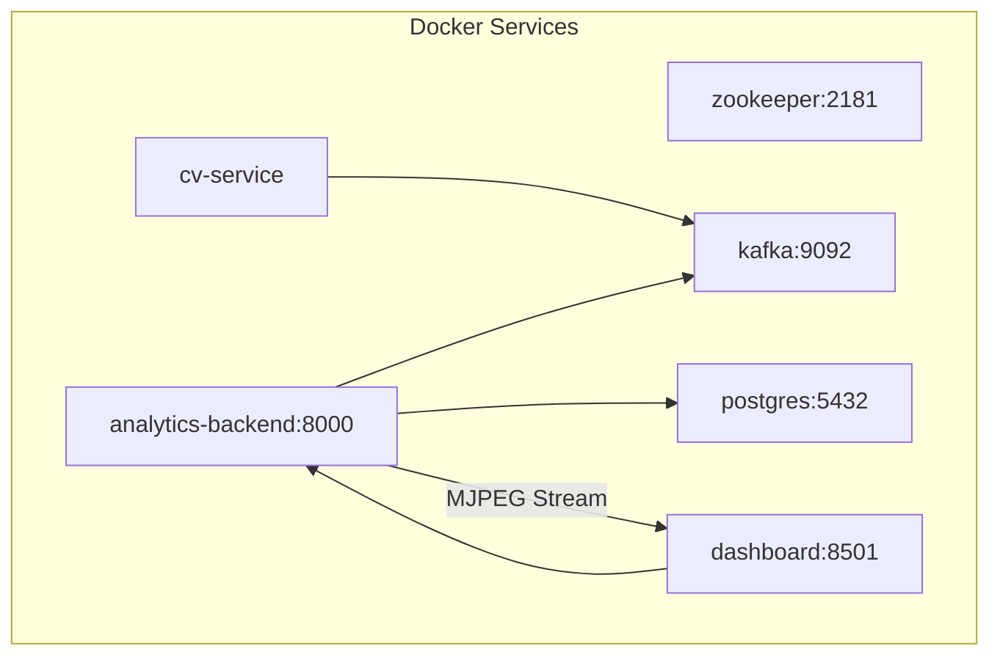

# Getting Started

<cite>
**Referenced Files in This Document**
- [README.md](file://README.md)
- [docker-compose.yml](file://docker-compose.yml)
- [compose.yaml](file://compose.yaml)
- [config/settings.yaml](file://config/settings.yaml)
- [Youtube_urls.txt](file://Youtube_urls.txt)
- [services/cv_service/Dockerfile](file://services/cv_service/Dockerfile)
- [services/analytics_backend/Dockerfile](file://services/analytics_backend/Dockerfile)
- [services/dashboard/Dockerfile](file://services/dashboard/Dockerfile)
- [services/video_ingestion/Dockerfile](file://services/video_ingestion/Dockerfile)
- [services/cv_service/requirements.txt](file://services/cv_service/requirements.txt)
- [services/analytics_backend/requirements.txt](file://services/analytics_backend/requirements.txt)
- [services/dashboard/requirements.txt](file://services/dashboard/requirements.txt)
- [services/video_ingestion/requirements.txt](file://services/video_ingestion/requirements.txt)
- [services/cv_service/src/main.py](file://services/cv_service/src/main.py)
- [services/analytics_backend/src/main.py](file://services/analytics_backend/src/main.py)
- [services/dashboard/src/app.py](file://services/dashboard/src/app.py)
- [services/analytics_backend/src/api.py](file://services/analytics_backend/src/api.py)
- [services/cv_service/src/kafka_producer.py](file://services/cv_service/src/kafka_producer.py)
- [services/video_ingestion/src/downloader.py](file://services/video_ingestion/src/downloader.py)
</cite>

## Table of Contents
1. [Introduction](#introduction)
2. [Prerequisites](#prerequisites)
3. [Installation Steps](#installation-steps)
4. [Environment Requirements and Ports](#environment-requirements-and-ports)
5. [Accessing the Dashboard](#accessing-the-dashboard)
6. [Stopping Services](#stopping-services)
7. [Initial Configuration](#initial-configuration)
8. [Evaluation & Verification Guide](#evaluation--verification-guide)
9. [Troubleshooting Guide](#troubleshooting-guide)
10. [Architecture Overview](#architecture-overview)
11. [Conclusion](#conclusion)

## Introduction
This guide helps you quickly set up and run the equipment monitoring system. It covers prerequisites, installation, configuration, service startup, dashboard access, and comprehensive evaluation procedures. The system is containerized with Docker Compose and orchestrates a real-time pipeline: video ingestion, computer vision processing, event streaming via Kafka, analytics persistence, and a Streamlit dashboard with real-time MJPEG streaming.

**Updated** Enhanced with comprehensive evaluation guide, demo section, and expanded technical documentation covering real-time MJPEG streaming, per-channel architecture, and detailed verification procedures.

## Prerequisites
- Docker Engine and Docker Compose installed and running on your machine.
- Minimum 8 GB RAM recommended for reliable CPU-based computer vision processing.
- Internet connectivity for pulling container images and downloading video content.
- YouTube video URLs ready for processing (can be added to Youtube_urls.txt or videos/urls.txt).

**Section sources**
- [README.md:92-95](file://README.md#L92-L95)
- [README.md:458-462](file://README.md#L458-L462)

## Installation Steps
Follow these steps to get the system running:

1. **Clone the repository**
   - Use your preferred Git client to clone the repository and navigate into the project directory.

2. **Add video URLs**
   - Append one or more YouTube video URLs to the file listing:
     - File: [Youtube_urls.txt](file://Youtube_urls.txt)
   - Each URL should be on its own line.
   - Alternative: [videos/urls.txt](file://videos/urls.txt) for video ingestion service.

3. **Download videos**
   - Run the video downloader service to fetch and save videos locally:
     - Command: `docker compose run --rm cv-service python -m src.downloader`
   - This executes the downloader module inside the cv-service container and mounts the videos directory for persistence.

4. **Start all services**
   - Bring up all services defined in the Compose file:
     - Command: `docker compose up --build`
   - This builds custom images if needed and starts:
     - zookeeper (port 2181)
     - kafka (port 9092)
     - postgres (port 5432)
     - cv-service (processing pipeline)
     - analytics-backend (FastAPI + Kafka consumer)
     - dashboard (Streamlit UI on port 8501)

5. **Access the dashboard**
   - Once the analytics-backend and dashboard are healthy, open:
     - http://localhost:8501

6. **Stop services**
   - To tear down the environment:
     - Command: `docker compose down`

**Section sources**
- [README.md:96-123](file://README.md#L96-L123)
- [docker-compose.yml:1-99](file://docker-compose.yml#L1-L99)
- [Youtube_urls.txt:1-20](file://Youtube_urls.txt#L1-L20)

## Environment Requirements and Ports
- Host ports exposed by services:
  - zookeeper: 2181
  - kafka: 9092
  - postgres: 5432
  - analytics-backend: 8000
  - dashboard: 8501
- Internal service communication uses service names as hostnames (e.g., kafka:9092, postgres:5432).
- Volume mounts:
  - The cv-service and video-ingestion services mount the local videos directory into /app/videos.
  - The analytics-backend and dashboard mount the config directory into /app/config.
  - Shared frames directory for MJPEG streaming between cv-service and analytics-backend.

**Section sources**
- [docker-compose.yml:36-99](file://docker-compose.yml#L36-L99)
- [config/settings.yaml:6,47-59](file://config/settings.yaml#L6,L47-L59)

## Accessing the Dashboard
- After services are healthy, open http://localhost:8501 in your browser.
- The Streamlit dashboard queries the analytics-backend API at http://analytics-backend:8000.
- The dashboard automatically attempts to connect; if it fails, verify the backend is healthy and reachable.
- Real-time MJPEG video streaming is embedded directly from the analytics-backend at /api/stream/mjpeg.

**Section sources**
- [README.md:117-119](file://README.md#L117-L119)
- [services/dashboard/src/app.py:632-685](file://services/dashboard/src/app.py#L632-L685)
- [config/settings.yaml:55-59](file://config/settings.yaml#L55-L59)

## Stopping Services
- To stop and remove containers, networks, and named volumes:
  - Command: `docker compose down`

**Section sources**
- [README.md:120-123](file://README.md#L120-L123)

## Initial Configuration
- Centralized configuration is managed in a single YAML file:
  - File: [config/settings.yaml](file://config/settings.yaml)
- Key areas:
  - video: frame_skip, resize_width, input_dir
  - detection: model, confidence_threshold, device, input_size, target_classes, class_names
  - tracking: thresholds and ID prefix mapping
  - motion: magnitude_threshold, upper_region_ratio, flow_method
  - activity: smoothing_window, vertical_flow_threshold, horizontal_flow_threshold
  - kafka: bootstrap_servers, topic, client_id, consumer_group
  - database: host, port, name, user, password, uri
  - dashboard: api_url, refresh_interval, page_title
- The dashboard reads its configuration at runtime and falls back to sensible defaults if the file is missing.

**Section sources**
- [config/settings.yaml:1-59](file://config/settings.yaml#L1-L59)
- [services/dashboard/src/app.py:34-64](file://services/dashboard/src/app.py#L34-L64)

## Evaluation & Verification Guide
This comprehensive guide provides step-by-step instructions for evaluators to verify that all assessment requirements have been met.

### Prerequisites
- Docker and Docker Compose installed
- At least 8 GB RAM available
- YouTube video files placed in ./videos/ directory (or use yt-dlp to download from Youtube_urls.txt)

### Quick Start
```bash
# 1. Build all service images
docker compose build

# 2. Start all 6 services in detached mode
docker compose up -d

# 3. Wait ~2 minutes for all services to initialize (Kafka, DB migrations, model loading)

# 4. Open the monitoring dashboard
#    → http://localhost:8501

# 5. Open the interactive API documentation
#    → http://localhost:8000/docs
```

### Verifying Each Requirement

#### 1. Equipment Detection (YOLOv8n)
- Dashboard shows detected equipment with bounding boxes overlaid on the live video feed
- Equipment IDs (e.g., DT-001, VH-003) appear as labels on each detected object
- **Verify via API:**
  ```bash
  curl http://localhost:8000/api/equipment
  ```

#### 2. Multi-Object Tracking (ByteTrack)
- Equipment IDs persist across frames — the same piece of equipment keeps the same ID
- Track a specific equipment across multiple consecutive frames in the dashboard
- **Verify via API:**
  ```bash
  curl http://localhost:8000/api/equipment/DT-001/history?limit=20
  ```

#### 3. Articulated Motion Analysis (Optical Flow)
- Region-based motion detection distinguishes arm_only vs full_body vs none
- Visible in the equipment status table under the motion_source column
- Equipment performing digging shows arm_only motion (upper region only)
- **Verify via API** — check the motion_source field in equipment history responses

#### 4. Activity Classification
- Four activity states visible: DIGGING, DUMPING, SWINGING_LOADING, WAITING
- ACTIVE state (green indicators) for DIGGING / DUMPING / SWINGING_LOADING
- INACTIVE state (red indicators) for WAITING
- N-frame smoothing (default 5 frames) prevents flickering between states

#### 5. Time Tracking & Utilization
- Utilization percentage shown per equipment in the dashboard
- Formula: Active Time / Total Tracked Time × 100 = Utilization %
- **Verify summary statistics:**
  ```bash
  curl http://localhost:8000/api/utilization/summary
  ```

#### 6. Kafka Event Streaming
- Events published to the equipment-events topic
- Payload includes frame_id, equipment_id, utilization, time_analytics, video_source
- **Verify by consuming messages directly:**
  ```bash
  docker exec -it kafka kafka-console-consumer \
    --bootstrap-server localhost:9092 \
    --topic equipment-events \
    --from-beginning --max-messages 5
  ```

#### 7. Database Persistence (PostgreSQL / TimescaleDB)
- All events are persisted in TimescaleDB for time-series querying
- **Verify:**
  ```bash
  curl http://localhost:8000/api/stats
  ```
- Time-series data available per equipment via the history endpoint

#### 8. REST API Endpoints
- Full interactive API documentation: http://localhost:8000/docs
- **Quick tests:**
  ```bash
  curl http://localhost:8000/api/health
  curl http://localhost:8000/api/equipment
  curl http://localhost:8000/api/utilization/summary
  curl "http://localhost:8000/api/equipment?channel=filename.mp4"
  ```

#### 9. Dashboard (Real-Time Monitoring UI)
- CCTV-style dark theme layout
- Live MJPEG video feed with bounding box annotations
- Channel selector dropdown (each video file = separate monitoring channel)
- Scrollable equipment status table with per-equipment metrics
- Utilization summary metrics (total equipment, active/inactive counts, avg utilization)
- Per-channel statistics — select different channels and observe stats update dynamically
- Fragment-based refresh — video stream is never interrupted when data tables refresh

#### 10. Docker Compose Orchestration
- All 6 services start with a single command: `docker compose up -d`
- Health checks configured for all services
- Proper dependency ordering: Zookeeper → Kafka → CV Service, PostgreSQL → Analytics Backend
- Shared volumes for frame relay between CV Service and Analytics Backend

**Section sources**
- [README.md:454-563](file://README.md#L454-L563)

## Troubleshooting Guide
- **Video download issues**
  - Ensure the Youtube_urls.txt or videos/urls.txt file contains valid YouTube URLs, one per line.
  - Verify network connectivity and that the downloader service can reach external sites.
  - Re-run the downloader command after confirming URLs are present.
  - Confirm the videos directory is writable and mounted into the cv-service container.

- **Kafka connectivity errors**
  - Confirm zookeeper and kafka services are healthy before starting cv-service and analytics-backend.
  - Check that the kafka bootstrap server setting matches the Compose service name and port.

- **Database connection failures**
  - Ensure postgres is healthy and accepting connections.
  - Verify the database URI and credentials in settings.yaml match the Compose configuration.

- **Backend API unavailability**
  - The dashboard expects analytics-backend to be reachable at http://analytics-backend:8000.
  - Confirm the backend service is healthy and listening on port 8000.

- **CPU resource constraints**
  - Reduce frame_skip or resize_width to lower processing load.
  - Consider increasing host memory if the system becomes sluggish.

- **Port conflicts**
  - If ports 8000, 8501, 2181, 9092, or 5432 are in use, adjust the docker-compose.yml mappings accordingly.

- **MJPEG streaming issues**
  - The analytics-backend serves MJPEG stream at /api/stream/mjpeg.
  - Dashboard embeds the stream directly from localhost:8000.
  - Client-side JavaScript handles automatic reconnection every 55 seconds.

- **Per-channel switching problems**
  - Use POST /api/videos/select to switch channels.
  - The cv-service monitors /app/frames/selected_video.txt for channel changes.
  - Ensure the selected video file exists in /app/videos/.

**Section sources**
- [README.md:92-95](file://README.md#L92-L95)
- [docker-compose.yml:36-99](file://docker-compose.yml#L36-L99)
- [config/settings.yaml:41-59](file://config/settings.yaml#L41-L59)
- [services/dashboard/src/app.py:632-685](file://services/dashboard/src/app.py#L632-L685)
- [services/analytics_backend/src/api.py:489-560](file://services/analytics_backend/src/api.py#L489-L560)

## Architecture Overview
The system runs six services orchestrated by Docker Compose. The cv-service processes video files and publishes events to Kafka. The analytics-backend consumes events and persists them to TimescaleDB, exposing a FastAPI endpoint. The Streamlit dashboard queries the backend to render real-time insights with embedded MJPEG streaming.



**Diagram sources**
- [docker-compose.yml:3-99](file://docker-compose.yml#L3-L99)

## Conclusion
You now have the foundational steps to deploy and operate the equipment monitoring system. Start with adding video URLs, downloading videos, bringing up the services, and verifying the dashboard. Use the comprehensive evaluation guide to validate all requirements have been met. The system supports real-time MJPEG streaming, per-channel architecture, and detailed verification procedures. Adjust configuration parameters in settings.yaml to tune performance and behavior for your environment.

**Section sources**
- [README.md:566-569](file://README.md#L566-L569)