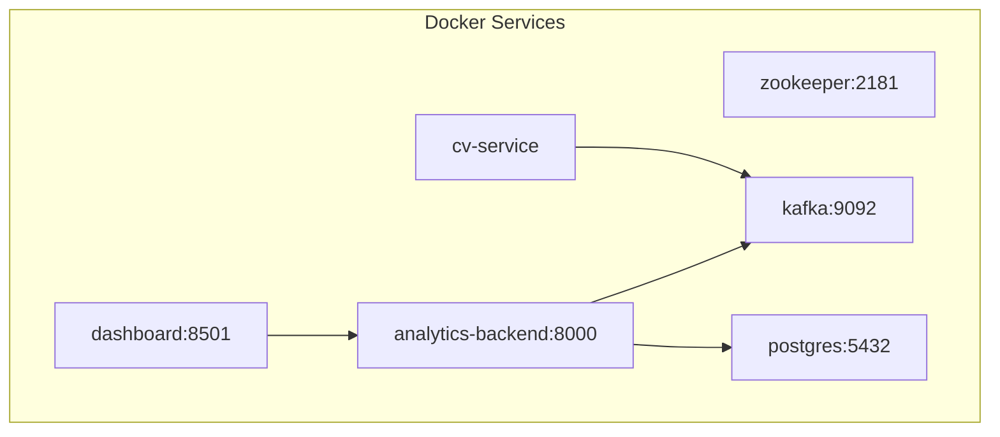

# Getting Started

<cite>
**Referenced Files in This Document**
- [README.md](file://README.md)
- [docker-compose.yml](file://docker-compose.yml)
- [config/settings.yaml](file://config/settings.yaml)
- [videos/urls.txt](file://videos/urls.txt)
- [services/cv_service/Dockerfile](file://services/cv_service/Dockerfile)
- [services/analytics_backend/Dockerfile](file://services/analytics_backend/Dockerfile)
- [services/dashboard/Dockerfile](file://services/dashboard/Dockerfile)
- [services/video_ingestion/Dockerfile](file://services/video_ingestion/Dockerfile)
- [services/cv_service/requirements.txt](file://services/cv_service/requirements.txt)
- [services/analytics_backend/requirements.txt](file://services/analytics_backend/requirements.txt)
- [services/dashboard/requirements.txt](file://services/dashboard/requirements.txt)
- [services/video_ingestion/requirements.txt](file://services/video_ingestion/requirements.txt)
- [services/cv_service/src/main.py](file://services/cv_service/src/main.py)
- [services/analytics_backend/src/main.py](file://services/analytics_backend/src/main.py)
- [services/dashboard/src/app.py](file://services/dashboard/src/app.py)
</cite>

## Table of Contents
1. [Introduction](#introduction)
2. [Prerequisites](#prerequisites)
3. [Installation Steps](#installation-steps)
4. [Environment Requirements and Ports](#environment-requirements-and-ports)
5. [Accessing the Dashboard](#accessing-the-dashboard)
6. [Stopping Services](#stopping-services)
7. [Initial Configuration](#initial-configuration)
8. [Troubleshooting Guide](#troubleshooting-guide)
9. [Architecture Overview](#architecture-overview)
10. [Conclusion](#conclusion)

## Introduction
This guide helps you quickly set up and run the equipment monitoring system. It covers prerequisites, installation, configuration, service startup, dashboard access, and common troubleshooting. The system is containerized with Docker Compose and orchestrates a real-time pipeline: video ingestion, computer vision processing, event streaming via Kafka, analytics persistence, and a Streamlit dashboard.

## Prerequisites
- Docker Engine and Docker Compose installed and running on your machine.
- Minimum 8 GB RAM recommended for reliable CPU-based computer vision processing.
- Internet connectivity for pulling container images and downloading video content.

**Section sources**
- [README.md:86-89](file://README.md#L86-L89)

## Installation Steps
Follow these steps to get the system running:

1. Clone the repository
   - Use your preferred Git client to clone the repository and navigate into the project directory.

2. Add video URLs
   - Append one or more YouTube video URLs to the file listing:
     - File: [videos/urls.txt](file://videos/urls.txt)
   - Each URL should be on its own line.

3. Download videos
   - Run the video downloader service to fetch and save videos locally:
     - Command: docker compose run --rm cv-service python -m src.downloader
   - This executes the downloader module inside the cv-service container and mounts the videos directory for persistence.

4. Start all services
   - Bring up all services defined in the Compose file:
     - Command: docker compose up --build
   - This builds custom images if needed and starts:
     - zookeeper (port 2181)
     - kafka (port 9092)
     - postgres (port 5432)
     - cv-service (processing pipeline)
     - analytics-backend (FastAPI + Kafka consumer)
     - dashboard (Streamlit UI on port 8501)

5. Access the dashboard
   - Once the analytics-backend and dashboard are healthy, open:
     - http://localhost:8501

6. Stop services
   - To tear down the environment:
     - Command: docker compose down

**Section sources**
- [README.md:90-117](file://README.md#L90-L117)
- [docker-compose.yml:1-97](file://docker-compose.yml#L1-L97)
- [videos/urls.txt:1-4](file://videos/urls.txt#L1-L4)

## Environment Requirements and Ports
- Host ports exposed by services:
  - zookeeper: 2181
  - kafka: 9092
  - postgres: 5432
  - analytics-backend: 8000
  - dashboard: 8501
- Internal service communication uses service names as hostnames (e.g., kafka:9092, postgres:5432).
- Volume mounts:
  - The cv-service and video-ingestion services mount the local videos directory into /app/videos.
  - The analytics-backend and dashboard mount the config directory into /app/config.

**Section sources**
- [docker-compose.yml:37-97](file://docker-compose.yml#L37-L97)
- [config/settings.yaml:6,48-53](file://config/settings.yaml#L6,L48-L53)

## Accessing the Dashboard
- After services are healthy, open http://localhost:8501 in your browser.
- The Streamlit dashboard queries the analytics-backend API at http://analytics-backend:8000.
- The dashboard automatically attempts to connect; if it fails, verify the backend is healthy and reachable.

**Section sources**
- [README.md:111-113](file://README.md#L111-L113)
- [services/dashboard/src/app.py:52-60](file://services/dashboard/src/app.py#L52-L60)
- [config/settings.yaml:55-59](file://config/settings.yaml#L55-L59)

## Stopping Services
- To stop and remove containers, networks, and named volumes:
  - Command: docker compose down

**Section sources**
- [README.md:114-117](file://README.md#L114-L117)

## Initial Configuration
- Centralized configuration is managed in a single YAML file:
  - File: [config/settings.yaml](file://config/settings.yaml)
- Key areas:
  - video: frame_skip, resize_width, input_dir
  - detection: model, confidence_threshold, device, input_size, target_classes, class_names
  - tracking: thresholds and ID prefix mapping
  - motion: magnitude_threshold, upper_region_ratio, flow_method
  - activity: smoothing_window, vertical_flow_threshold, horizontal_flow_threshold
  - kafka: bootstrap_servers, topic, client_id, consumer_group
  - database: host, port, name, user, password, uri
  - dashboard: api_url, refresh_interval, page_title
- The dashboard reads its configuration at runtime and falls back to sensible defaults if the file is missing.

**Section sources**
- [config/settings.yaml:1-59](file://config/settings.yaml#L1-L59)
- [services/dashboard/src/app.py:26-48](file://services/dashboard/src/app.py#L26-L48)

## Troubleshooting Guide
- Video download issues
  - Ensure the videos/urls.txt file contains valid YouTube URLs, one per line.
  - Verify network connectivity and that the downloader service can reach external sites.
  - Re-run the downloader command after confirming URLs are present.
  - Confirm the videos directory is writable and mounted into the cv-service container.

- Kafka connectivity errors
  - Confirm zookeeper and kafka services are healthy before starting cv-service and analytics-backend.
  - Check that the kafka bootstrap server setting matches the Compose service name and port.

- Database connection failures
  - Ensure postgres is healthy and accepting connections.
  - Verify the database URI and credentials in settings.yaml match the Compose configuration.

- Backend API unavailability
  - The dashboard expects analytics-backend to be reachable at http://analytics-backend:8000.
  - Confirm the backend service is healthy and listening on port 8000.

- CPU resource constraints
  - Reduce frame_skip or resize_width to lower processing load.
  - Consider increasing host memory if the system becomes sluggish.

- Port conflicts
  - If ports 8000, 8501, 2181, 9092, or 5432 are in use, adjust the docker-compose.yml mappings accordingly.

**Section sources**
- [README.md:86-89](file://README.md#L86-L89)
- [docker-compose.yml:37-97](file://docker-compose.yml#L37-L97)
- [config/settings.yaml:41-59](file://config/settings.yaml#L41-L59)
- [services/dashboard/src/app.py:52-60](file://services/dashboard/src/app.py#L52-L60)

## Architecture Overview
The system runs six services orchestrated by Docker Compose. The cv-service processes video files and publishes events to Kafka. The analytics-backend consumes events and persists them to TimescaleDB, exposing a FastAPI endpoint. The Streamlit dashboard queries the backend to render real-time insights.

**Diagram sources**
- [docker-compose.yml:3-97](file://docker-compose.yml#L3-L97)

## Conclusion
You now have the foundational steps to deploy and operate the equipment monitoring system. Start with adding video URLs, downloading videos, bringing up the services, and verifying the dashboard. Use the troubleshooting section to resolve common issues. Adjust configuration parameters in settings.yaml to tune performance and behavior for your environment.