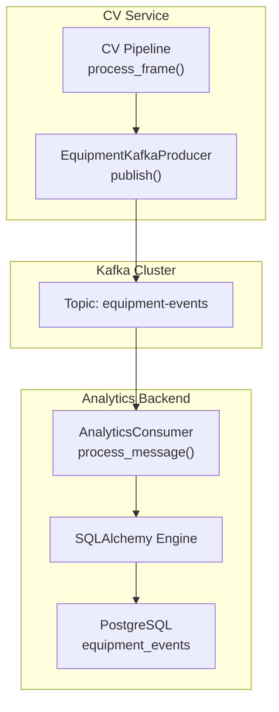
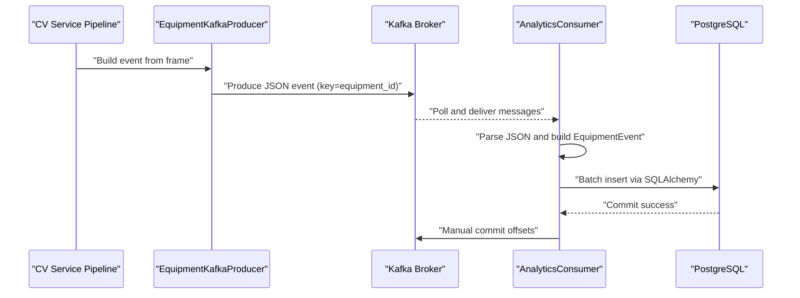
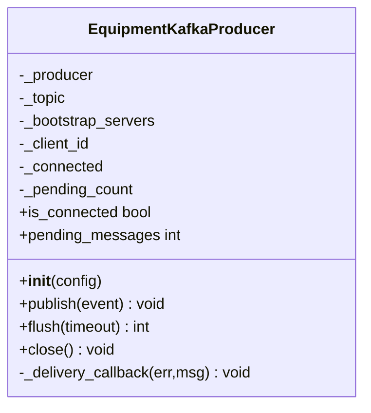
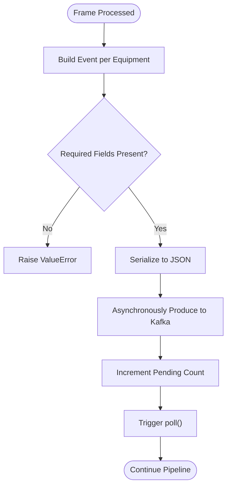
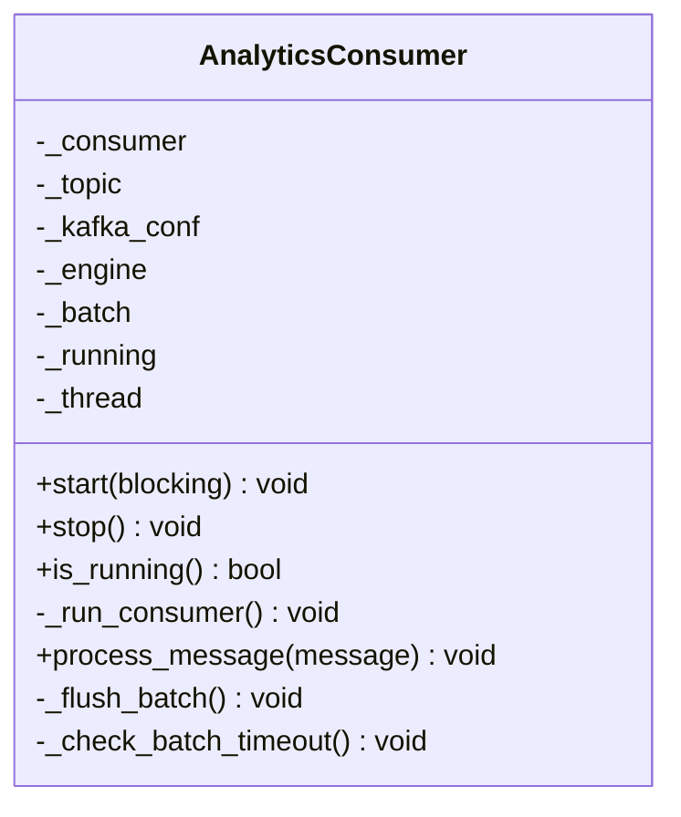
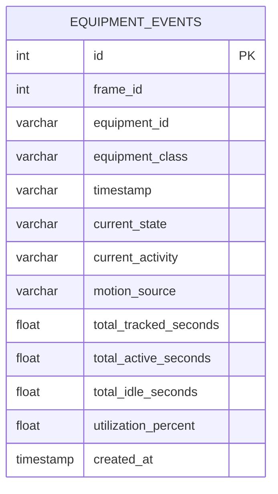
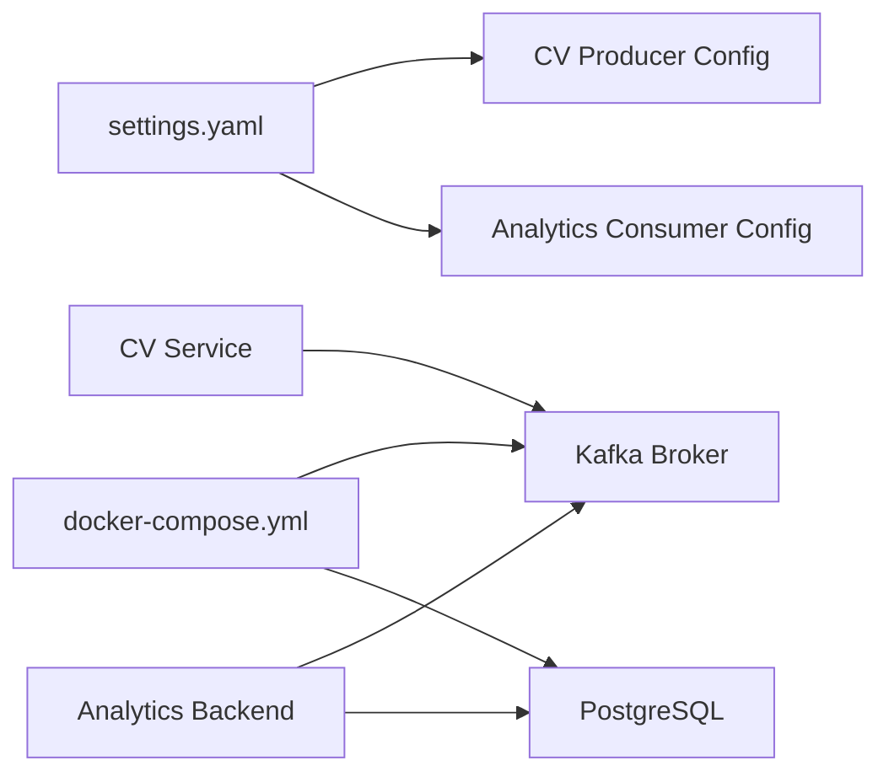
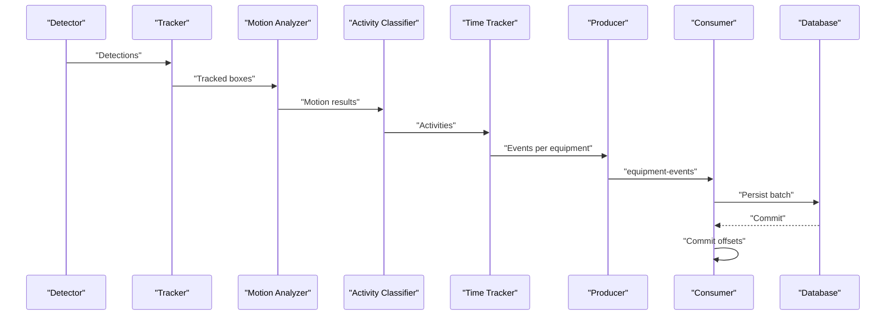

# Kafka Integration

<cite>
**Referenced Files in This Document**
- [kafka_producer.py](file://services/cv_service/src/kafka_producer.py)
- [consumer.py](file://services/analytics_backend/src/consumer.py)
- [db_models.py](file://services/analytics_backend/src/db_models.py)
- [main.py (CV Service)](file://services/cv_service/src/main.py)
- [main.py (Analytics Backend)](file://services/analytics_backend/src/main.py)
- [api.py](file://services/analytics_backend/src/api.py)
- [settings.yaml](file://config/settings.yaml)
- [docker-compose.yml](file://docker-compose.yml)
- [Dockerfile (CV Service)](file://services/cv_service/Dockerfile)
- [Dockerfile (Analytics Backend)](file://services/analytics_backend/Dockerfile)
- [requirements.txt (CV Service)](file://services/cv_service/requirements.txt)
- [requirements.txt (Analytics Backend)](file://services/analytics_backend/requirements.txt)
</cite>

## Table of Contents
1. [Introduction](#introduction)
2. [Project Structure](#project-structure)
3. [Core Components](#core-components)
4. [Architecture Overview](#architecture-overview)
5. [Detailed Component Analysis](#detailed-component-analysis)
6. [Dependency Analysis](#dependency-analysis)
7. [Performance Considerations](#performance-considerations)
8. [Troubleshooting Guide](#troubleshooting-guide)
9. [Conclusion](#conclusion)
10. [Appendices](#appendices)

## Introduction
This section documents the Apache Kafka event streaming implementation that connects the computer vision pipeline to the analytics backend. The system follows an event-driven architecture where the CV Service detects and tracks equipment, classifies activities, computes utilization metrics, and publishes structured events to a Kafka topic. The Analytics Backend consumes these events, persists them to PostgreSQL (with optional TimescaleDB time-series optimization), and exposes a REST API for dashboards and monitoring.

## Project Structure
The Kafka integration spans two services:
- Computer Vision (CV) Service: Produces equipment utilization events to Kafka.
- Analytics Backend: Consumes events from Kafka, persists to PostgreSQL, and serves a FastAPI REST API.

**Diagram sources**
- [kafka_producer.py:91-169](file://services/cv_service/src/kafka_producer.py#L91-L169)
- [consumer.py:143-228](file://services/analytics_backend/src/consumer.py#L143-L228)
- [db_models.py:22-49](file://services/analytics_backend/src/db_models.py#L22-L49)

**Section sources**
- [docker-compose.yml:15-34](file://docker-compose.yml#L15-L34)
- [settings.yaml:41-46](file://config/settings.yaml#L41-L46)

## Core Components
- Producer (CV Service):
  - Implements a reliable Kafka producer using Confluent Kafka Python client.
  - Serializes events to JSON and publishes with acknowledgment and retry.
  - Partitions by equipment_id to preserve ordering per equipment.
- Consumer (Analytics Backend):
  - Reads from the equipment-events topic using a manual commit strategy.
  - Parses JSON payloads and batches writes to PostgreSQL.
  - Commits offsets only after successful database writes.
- Database (PostgreSQL):
  - SQLAlchemy ORM model for equipment_events.
  - Optional TimescaleDB hypertable creation for time-series optimization.

**Section sources**
- [kafka_producer.py:17-228](file://services/cv_service/src/kafka_producer.py#L17-L228)
- [consumer.py:23-268](file://services/analytics_backend/src/consumer.py#L23-L268)
- [db_models.py:22-191](file://services/analytics_backend/src/db_models.py#L22-L191)

## Architecture Overview
The system uses a classic event streaming pattern:
- CV Service emits events on every processed frame for each tracked equipment.
- Kafka ensures durability and decouples producers from consumers.
- Analytics Backend consumes events, persists to PostgreSQL, and serves queries.

**Diagram sources**
- [main.py (CV Service):323-404](file://services/cv_service/src/main.py#L323-L404)
- [kafka_producer.py:91-169](file://services/cv_service/src/kafka_producer.py#L91-L169)
- [consumer.py:143-228](file://services/analytics_backend/src/consumer.py#L143-L228)

## Detailed Component Analysis

### Producer Implementation (CV Service)
- Configuration:
  - Bootstrap servers, topic, and client_id sourced from configuration.
  - Reliability settings: acks=all, retries with backoff, linger and batch size for throughput.
- Serialization:
  - Event dictionary serialized to UTF-8 JSON bytes.
  - Key is the equipment_id to ensure partitioning by equipment.
- Delivery:
  - Asynchronous produce with a delivery callback to decrement pending counters.
  - Buffer full handling retries once and logs warnings.
- Lifecycle:
  - Context manager support for safe initialization and cleanup.
  - Flush and close methods to drain pending messages.

**Diagram sources**
- [kafka_producer.py:17-228](file://services/cv_service/src/kafka_producer.py#L17-L228)

**Section sources**
- [kafka_producer.py:25-69](file://services/cv_service/src/kafka_producer.py#L25-L69)
- [kafka_producer.py:91-169](file://services/cv_service/src/kafka_producer.py#L91-L169)
- [kafka_producer.py:170-209](file://services/cv_service/src/kafka_producer.py#L170-L209)

### Message Schema and Publication Timing
- Schema:
  - Top-level fields: frame_id, equipment_id, equipment_class, timestamp.
  - Nested utilization: current_state, current_activity, motion_source.
  - Nested time_analytics: total_tracked_seconds, total_active_seconds, total_idle_seconds, utilization_percent.
- Validation:
  - Required fields enforced before publishing.
- Timing:
  - Published immediately after building per-equipment events from process_frame().
  - Flush called at the end of video processing to ensure delivery.

**Diagram sources**
- [main.py (CV Service):270-322](file://services/cv_service/src/main.py#L270-L322)
- [kafka_producer.py:125-169](file://services/cv_service/src/kafka_producer.py#L125-L169)

**Section sources**
- [main.py (CV Service):323-404](file://services/cv_service/src/main.py#L323-L404)
- [kafka_producer.py:95-120](file://services/cv_service/src/kafka_producer.py#L95-L120)

### Consumer Implementation (Analytics Backend)
- Configuration:
  - Topic, consumer group, bootstrap servers from configuration.
  - Manual commits disabled for auto-commit to gain control over offset semantics.
- Processing:
  - Subscribes to equipment-events.
  - Polls with timeouts, handles EOF and unknown topic conditions.
  - Parses JSON, extracts nested fields, and builds EquipmentEvent instances.
- Batching and Persistence:
  - Maintains a batch list and flushes on size threshold or timeout.
  - Uses bulk_save_objects and commits transaction.
  - Commits Kafka offsets synchronously after successful DB write.
- Graceful Shutdown:
  - Background thread runner with signal handlers.
  - Stops consumer and flushes remaining batch on shutdown.

**Diagram sources**
- [consumer.py:23-268](file://services/analytics_backend/src/consumer.py#L23-L268)

**Section sources**
- [consumer.py:35-78](file://services/analytics_backend/src/consumer.py#L35-L78)
- [consumer.py:93-142](file://services/analytics_backend/src/consumer.py#L93-L142)
- [consumer.py:143-228](file://services/analytics_backend/src/consumer.py#L143-L228)
- [consumer.py:230-244](file://services/analytics_backend/src/consumer.py#L230-L244)

### Database Model and Persistence Strategy
- Model:
  - EquipmentEvent mapped to equipment_events table with indexed equipment_id and created_at.
  - Includes fields for frame_id, equipment identifiers, timestamps, state/activity, motion source, and utilization metrics.
- Initialization:
  - Creates tables on startup.
  - Attempts to enable TimescaleDB extension and convert equipment_events to a hypertable on created_at.
- Sessions:
  - Session factory with autocommit/autoflush disabled for explicit control.
  - Context manager for safe session lifecycle.

**Diagram sources**
- [db_models.py:22-49](file://services/analytics_backend/src/db_models.py#L22-L49)

**Section sources**
- [db_models.py:70-101](file://services/analytics_backend/src/db_models.py#L70-L101)
- [db_models.py:103-156](file://services/analytics_backend/src/db_models.py#L103-L156)
- [db_models.py:158-191](file://services/analytics_backend/src/db_models.py#L158-L191)

### API Layer and Real-time Queries
- REST API:
  - Provides endpoints for equipment list, per-equipment history, utilization summary, latest frame, and general stats.
  - Uses SQLAlchemy ORM with dependency injection for sessions.
- CORS:
  - Enabled for cross-origin access from the dashboard.
- Health Check:
  - Validates database connectivity.

**Section sources**
- [api.py:159-444](file://services/analytics_backend/src/api.py#L159-L444)

## Dependency Analysis
- Kafka Configuration:
  - Topic name and consumer group are defined in settings.yaml and used by both producer and consumer.
  - Bootstrap servers configured in docker-compose for internal service discovery.
- Docker Compose:
  - Defines Zookeeper, Kafka, PostgreSQL, CV Service, Analytics Backend, and Dashboard services.
  - CV Service and Analytics Backend depend on Kafka health checks.
- Dependencies:
  - CV Service requires confluent-kafka for producer.
  - Analytics Backend requires confluent-kafka, SQLAlchemy, psycopg2, FastAPI, Uvicorn.

**Diagram sources**
- [settings.yaml:41-46](file://config/settings.yaml#L41-L46)
- [docker-compose.yml:15-34](file://docker-compose.yml#L15-L34)
- [requirements.txt (CV Service):4](file://services/cv_service/requirements.txt#L4)
- [requirements.txt (Analytics Backend):1](file://services/analytics_backend/requirements.txt#L1)

**Section sources**
- [settings.yaml:41-53](file://config/settings.yaml#L41-L53)
- [docker-compose.yml:51-78](file://docker-compose.yml#L51-L78)
- [requirements.txt (CV Service):1-7](file://services/cv_service/requirements.txt#L1-L7)
- [requirements.txt (Analytics Backend):1-8](file://services/analytics_backend/requirements.txt#L1-L8)

## Performance Considerations
- Partitioning Strategy:
  - Producer uses equipment_id as the partition key to ensure ordering per equipment. This enables predictable consumption order and simplifies deduplication at the consumer level if needed.
- Throughput Tuning:
  - Producer linger.ms and batch.size balance latency and throughput.
  - Consumer batch size and timeout control commit cadence and memory usage.
- Time-series Optimization:
  - TimescaleDB hypertable on created_at improves query performance for time-series analytics.
- Resource Limits:
  - Consumer group and session timeouts configured to handle long-running tasks.
- Idempotency:
  - Ordering per equipment is preserved; idempotent processing can be achieved by de-duplicating on (equipment_id, frame_id) at the consumer.

[No sources needed since this section provides general guidance]

## Troubleshooting Guide
- Kafka Connectivity Issues:
  - Verify bootstrap.servers in settings.yaml match docker-compose advertised listeners.
  - Check Kafka health checks and Zookeeper readiness.
  - Confirm topic existence and permissions.
- Consumer Errors:
  - Unknown topic or partition EOF handled with warnings and retries.
  - JSON decode errors logged; inspect message payloads.
  - Manual commit failures require rollback and reprocessing.
- Producer Errors:
  - Delivery callbacks log failures; buffer full triggers flush and retry.
  - Acknowledgment settings ensure durability; monitor pending message count.
- Database Issues:
  - TimescaleDB setup is attempted automatically; fallback to standard tables if unavailable.
  - Session factory and context managers ensure proper resource cleanup.
- Monitoring:
  - Use Kafka admin client to inspect topic partitions and consumer lag.
  - Monitor consumer thread status and batch sizes.
  - Use API health endpoints to validate backend readiness.

**Section sources**
- [consumer.py:110-142](file://services/analytics_backend/src/consumer.py#L110-L142)
- [kafka_producer.py:70-90](file://services/cv_service/src/kafka_producer.py#L70-L90)
- [db_models.py:103-156](file://services/analytics_backend/src/db_models.py#L103-L156)

## Conclusion
The Kafka integration provides a robust, scalable event streaming backbone for the computer vision pipeline. The CV Service produces well-structured, ordered events keyed by equipment_id, while the Analytics Backend consumes, persists, and serves analytics with strong durability and performance characteristics. The system is containerized and orchestrated via Docker Compose, enabling easy deployment and scaling.

[No sources needed since this section summarizes without analyzing specific files]

## Appendices

### Practical Event Flow Example
- Detection and Tracking:
  - The CV pipeline detects equipment, tracks bounding boxes, and computes motion.
- Activity Classification and Time Tracking:
  - Activities are classified and time statistics aggregated per equipment.
- Event Construction:
  - An event is built for each tracked equipment with utilization and time analytics.
- Publishing:
  - The event is serialized and produced to the equipment-events topic with equipment_id as key.
- Consumption and Persistence:
  - The consumer parses the event, batches writes, commits the transaction, and commits Kafka offsets.

**Diagram sources**
- [main.py (CV Service):323-404](file://services/cv_service/src/main.py#L323-L404)
- [kafka_producer.py:91-169](file://services/cv_service/src/kafka_producer.py#L91-L169)
- [consumer.py:143-228](file://services/analytics_backend/src/consumer.py#L143-L228)

### Kafka Configuration Reference
- Topic: equipment-events
- Producer:
  - acks: all
  - retries: 3
  - linger.ms: 5
  - batch.size: 16384
  - socket.timeout.ms: 30000
  - request.timeout.ms: 30000
- Consumer:
  - enable.auto.commit: false
  - max.poll.interval.ms: 300000
  - session.timeout.ms: 30000
  - auto.offset.reset: earliest

**Section sources**
- [settings.yaml:41-46](file://config/settings.yaml#L41-L46)
- [kafka_producer.py:40-53](file://services/cv_service/src/kafka_producer.py#L40-L53)
- [consumer.py:52-59](file://services/analytics_backend/src/consumer.py#L52-L59)