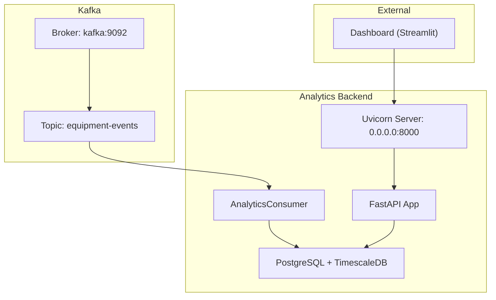
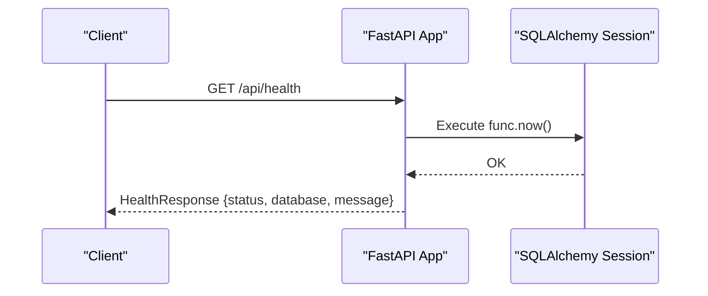
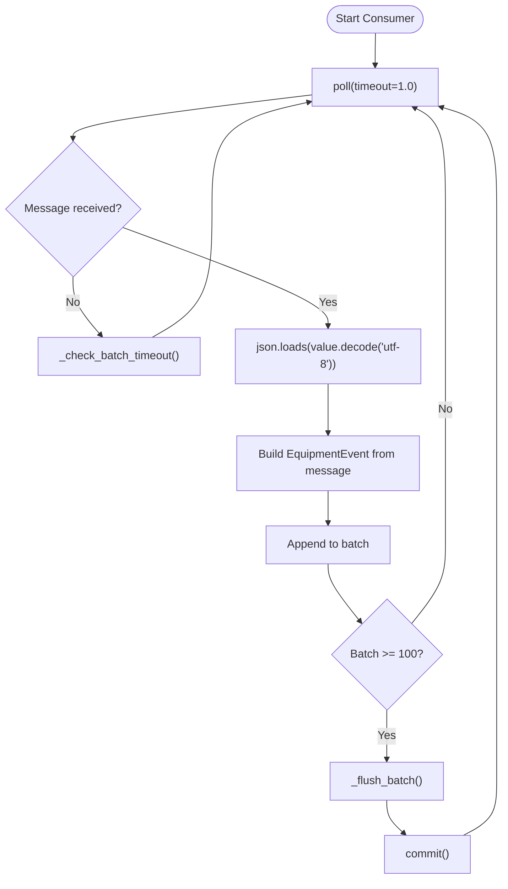
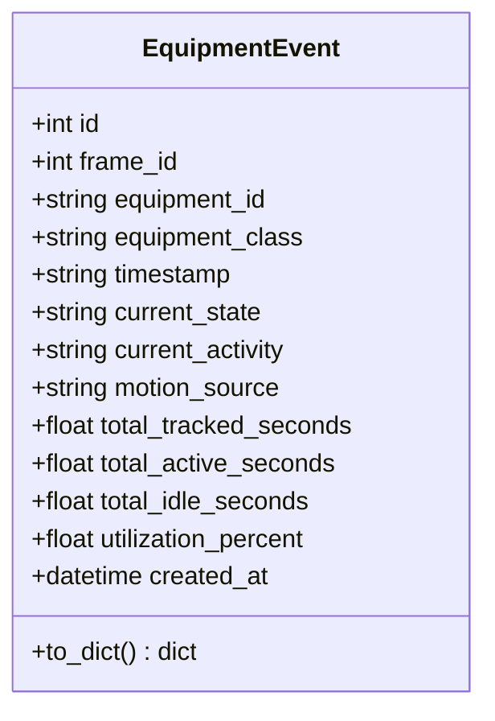
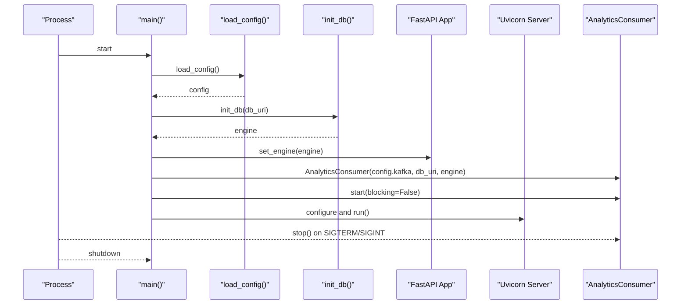
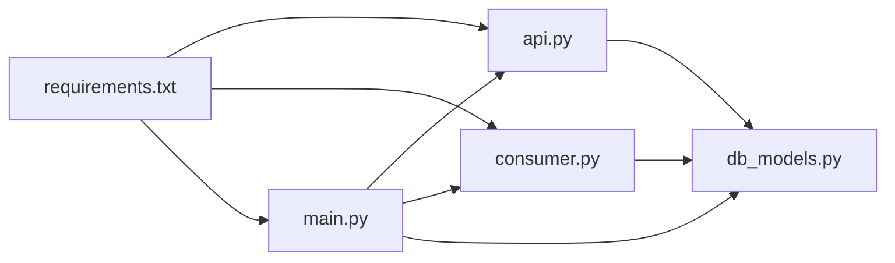

# Analytics Backend

<cite>
**Referenced Files in This Document**
- [main.py](file://services/analytics_backend/src/main.py)
- [api.py](file://services/analytics_backend/src/api.py)
- [consumer.py](file://services/analytics_backend/src/consumer.py)
- [db_models.py](file://services/analytics_backend/src/db_models.py)
- [settings.yaml](file://config/settings.yaml)
- [Dockerfile](file://services/analytics_backend/Dockerfile)
- [requirements.txt](file://services/analytics_backend/requirements.txt)
- [docker-compose.yml](file://docker-compose.yml)
- [README.md](file://README.md)
</cite>

## Table of Contents
1. [Introduction](#introduction)
2. [Project Structure](#project-structure)
3. [Core Components](#core-components)
4. [Architecture Overview](#architecture-overview)
5. [Detailed Component Analysis](#detailed-component-analysis)
6. [Dependency Analysis](#dependency-analysis)
7. [Performance Considerations](#performance-considerations)
8. [Troubleshooting Guide](#troubleshooting-guide)
9. [Conclusion](#conclusion)
10. [Appendices](#appendices)

## Introduction
This document describes the Analytics Backend microservice responsible for:
- Providing a FastAPI REST API for equipment analytics and monitoring
- Persisting equipment events from Kafka into PostgreSQL with TimescaleDB optimization
- Supporting real-time dashboards and historical analytics

The service integrates Kafka event consumption, SQL persistence, and a FastAPI server with health checks, equipment retrieval, utilization summaries, and latest frame access endpoints.

## Project Structure
The Analytics Backend is organized into four core modules under services/analytics_backend/src/, plus configuration and containerization assets.

```mermaid
graph TB
subgraph "Analytics Backend Service"
M["main.py<br/>Entrypoint"]
A["api.py<br/>FastAPI Endpoints"]
C["consumer.py<br/>Kafka Consumer"]
D["db_models.py<br/>SQLAlchemy Models"]
end
subgraph "Configuration"
S["settings.yaml<br/>Kafka, DB, Dashboard"]
end
subgraph "Deployment"
DF["Dockerfile"]
DC["docker-compose.yml"]
RQ["requirements.txt"]
end
M --> A
M --> C
M --> D
A --> D
C --> D
M --> S
DF --> RQ
DC --> M
```

**Diagram sources**
- [main.py:64-149](file://services/analytics_backend/src/main.py#L64-L149)
- [api.py:24-444](file://services/analytics_backend/src/api.py#L24-L444)
- [consumer.py:23-268](file://services/analytics_backend/src/consumer.py#L23-L268)
- [db_models.py:22-191](file://services/analytics_backend/src/db_models.py#L22-L191)
- [settings.yaml:41-59](file://config/settings.yaml#L41-L59)
- [Dockerfile:1-23](file://services/analytics_backend/Dockerfile#L1-L23)
- [docker-compose.yml:64-79](file://docker-compose.yml#L64-L79)
- [requirements.txt:1-8](file://services/analytics_backend/requirements.txt#L1-L8)

**Section sources**
- [main.py:64-149](file://services/analytics_backend/src/main.py#L64-L149)
- [api.py:24-444](file://services/analytics_backend/src/api.py#L24-L444)
- [consumer.py:23-268](file://services/analytics_backend/src/consumer.py#L23-L268)
- [db_models.py:22-191](file://services/analytics_backend/src/db_models.py#L22-L191)
- [settings.yaml:41-59](file://config/settings.yaml#L41-L59)
- [Dockerfile:1-23](file://services/analytics_backend/Dockerfile#L1-L23)
- [docker-compose.yml:64-79](file://docker-compose.yml#L64-L79)
- [requirements.txt:1-8](file://services/analytics_backend/requirements.txt#L1-L8)

## Core Components
- FastAPI REST API with health checks, equipment listing, history retrieval, utilization summary, latest frame, and statistics endpoints
- Kafka consumer that reads equipment events, deserializes JSON, batches persistence, and commits offsets
- SQLAlchemy models for EquipmentEvent with TimescaleDB hypertable setup
- Orchestration in main.py for startup, shutdown, and service lifecycle

Key responsibilities:
- API server startup and graceful shutdown handling
- Kafka consumer initialization and background processing
- Database engine initialization and TimescaleDB optimization
- Request/response models and error handling strategies

**Section sources**
- [api.py:159-444](file://services/analytics_backend/src/api.py#L159-L444)
- [consumer.py:23-268](file://services/analytics_backend/src/consumer.py#L23-L268)
- [db_models.py:22-191](file://services/analytics_backend/src/db_models.py#L22-L191)
- [main.py:64-149](file://services/analytics_backend/src/main.py#L64-L149)

## Architecture Overview
The Analytics Backend integrates Kafka, PostgreSQL/TimescaleDB, and FastAPI into a cohesive microservice.

**Diagram sources**
- [settings.yaml:41-46](file://config/settings.yaml#L41-L46)
- [main.py:124-139](file://services/analytics_backend/src/main.py#L124-L139)
- [api.py:24-444](file://services/analytics_backend/src/api.py#L24-L444)
- [consumer.py:96-141](file://services/analytics_backend/src/consumer.py#L96-L141)
- [db_models.py:70-100](file://services/analytics_backend/src/db_models.py#L70-L100)
- [docker-compose.yml:15-33](file://docker-compose.yml#L15-L33)

## Detailed Component Analysis

### FastAPI REST API Design
Endpoints and behaviors:
- Health check validates API and DB connectivity
- Equipment listing returns latest state per equipment
- History endpoint retrieves time-series for a specific equipment with pagination
- Utilization summary aggregates counts and averages
- Latest frame endpoint returns current frame’s equipment states
- Statistics endpoint provides DB-wide counts and frame range

Request/response models:
- EquipmentSummary, EquipmentEventResponse, EquipmentUtilizationSummary, UtilizationSummaryResponse, HealthResponse, LatestFrameEquipment, LatestFrameResponse

Error handling:
- HTTP exceptions raised for DB errors, missing data, and internal failures
- Logging for all error paths

CORS:
- Enabled for "*" origins to support dashboard and other frontends

**Section sources**
- [api.py:159-444](file://services/analytics_backend/src/api.py#L159-L444)

#### API Endpoints and Contracts
- GET /api/health
  - Response: HealthResponse
  - Behavior: Executes a DB query to verify connectivity
- GET /api/equipment
  - Response: List[EquipmentSummary]
  - Behavior: Latest record per equipment_id using a subquery join
- GET /api/equipment/{equipment_id}/history
  - Path param: equipment_id
  - Query: limit (default 100, max 1000)
  - Response: List[EquipmentEventResponse]
- GET /api/utilization/summary
  - Response: UtilizationSummaryResponse
  - Behavior: Aggregates latest per-equipment states and computes totals/averages
- GET /api/latest-frame
  - Response: LatestFrameResponse
  - Behavior: Retrieves all equipment in the latest frame_id
- GET /api/stats
  - Response: Dict with total_events, unique_equipment, frame_range

**Section sources**
- [api.py:159-444](file://services/analytics_backend/src/api.py#L159-L444)

#### API Call Flow (Health Check)

**Diagram sources**
- [api.py:159-177](file://services/analytics_backend/src/api.py#L159-L177)

### Kafka Consumer Implementation
Responsibilities:
- Subscribe to equipment-events topic
- Deserialize JSON messages
- Map fields to EquipmentEvent model
- Batch insert with bulk_save_objects
- Commit offsets after successful DB write
- Graceful shutdown handling

Batching:
- Batch size: 100 messages
- Timeout: 5.0 seconds
- Manual commit disabled for Kafka auto-commit to ensure DB-first ordering

Error handling:
- JSON decode errors, Kafka errors, and DB exceptions are logged and handled without crashing the consumer

**Section sources**
- [consumer.py:23-268](file://services/analytics_backend/src/consumer.py#L23-L268)

#### Consumer Processing Flow

**Diagram sources**
- [consumer.py:93-229](file://services/analytics_backend/src/consumer.py#L93-L229)

### SQLAlchemy Database Models
EquipmentEvent table schema:
- Columns: id (PK), frame_id, equipment_id (indexed), equipment_class, timestamp, current_state, current_activity, motion_source, total_tracked_seconds, total_active_seconds, total_idle_seconds, utilization_percent, created_at (indexed)
- Indexes: equipment_id, created_at
- Validation: String length constraints via String(N) types; Float defaults to 0.0; timestamps stored as strings

Initialization:
- init_db creates engine with pooling and pre-ping
- Creates all tables defined in Base.metadata
- Attempts TimescaleDB setup: creates extension if missing, converts table to hypertable on created_at

Session management:
- get_session returns sessionmaker bound to engine
- get_db dependency supplies per-request sessions
- get_db_session context manager ensures commit/rollback and close

**Section sources**
- [db_models.py:22-191](file://services/analytics_backend/src/db_models.py#L22-L191)

#### EquipmentEvent Class Diagram

**Diagram sources**
- [db_models.py:22-68](file://services/analytics_backend/src/db_models.py#L22-L68)

### Service Orchestration in main.py
Responsibilities:
- Load configuration from YAML (supports multiple paths)
- Initialize database engine and set it globally for API
- Create and start AnalyticsConsumer in a background thread
- Configure and run Uvicorn server on port 8000
- Register signal handlers for SIGTERM/SIGINT to coordinate graceful shutdown
- Stop consumer and log shutdown completion

Logging:
- INFO-level logs for initialization, configuration, and lifecycle events

**Section sources**
- [main.py:64-149](file://services/analytics_backend/src/main.py#L64-L149)

#### Startup and Shutdown Sequence

**Diagram sources**
- [main.py:64-149](file://services/analytics_backend/src/main.py#L64-L149)

## Dependency Analysis
External dependencies:
- confluent-kafka for event streaming
- sqlalchemy for ORM and PostgreSQL connectivity
- psycopg2-binary for PostgreSQL adapter
- fastapi and uvicorn for REST API server
- pydantic for request/response models
- pyyaml for configuration parsing

Internal dependencies:
- api.py depends on db_models for EquipmentEvent and session management
- consumer.py depends on db_models for EquipmentEvent and session creation
- main.py depends on api, consumer, and db_models for orchestration

**Diagram sources**
- [api.py:19-20](file://services/analytics_backend/src/api.py#L19-L20)
- [consumer.py:18-18](file://services/analytics_backend/src/consumer.py#L18-L18)
- [db_models.py:12-16](file://services/analytics_backend/src/db_models.py#L12-L16)
- [requirements.txt:1-8](file://services/analytics_backend/requirements.txt#L1-L8)

**Section sources**
- [requirements.txt:1-8](file://services/analytics_backend/requirements.txt#L1-L8)
- [api.py:19-20](file://services/analytics_backend/src/api.py#L19-L20)
- [consumer.py:18-18](file://services/analytics_backend/src/consumer.py#L18-L18)
- [db_models.py:12-16](file://services/analytics_backend/src/db_models.py#L12-L16)

## Performance Considerations
- Kafka consumer batching: 100 messages or 5 seconds to reduce DB round-trips
- TimescaleDB hypertable on created_at for efficient time-series queries
- SQLAlchemy pooling with pre-ping to handle connection churn
- Indexes on equipment_id and created_at to optimize frequent queries
- FastAPI async server with Uvicorn for concurrency

Operational tips:
- Adjust batch size and timeout for throughput vs latency
- Monitor Kafka lag and DB commit latency
- Tune database pool size and TimescaleDB retention policies

[No sources needed since this section provides general guidance]

## Troubleshooting Guide
Common issues and resolutions:
- Health check fails: Verify database connectivity and credentials; check logs for SQL exceptions
- Kafka topic not found: Confirm topic exists and consumer group is configured; ensure Kafka is healthy
- JSON decode errors: Validate producer message schema; ensure UTF-8 encoding
- Consumer not committing: Ensure DB writes succeed; manual commit occurs after successful bulk insert
- Graceful shutdown hangs: Check background thread join timeouts; ensure signal handlers are registered

Relevant code locations:
- Health endpoint DB test and error propagation
- Consumer poll loop and error handling
- Batch flush and commit logic
- Signal handlers and shutdown coordination

**Section sources**
- [api.py:159-177](file://services/analytics_backend/src/api.py#L159-L177)
- [consumer.py:93-141](file://services/analytics_backend/src/consumer.py#L93-L141)
- [consumer.py:206-229](file://services/analytics_backend/src/consumer.py#L206-L229)
- [main.py:110-119](file://services/analytics_backend/src/main.py#L110-L119)

## Conclusion
The Analytics Backend provides a robust foundation for equipment analytics:
- A FastAPI REST API with comprehensive endpoints for monitoring and querying
- A Kafka consumer that reliably persists events with batching and error handling
- SQLAlchemy models with TimescaleDB optimization for time-series analytics
- Clear orchestration and logging for production readiness

[No sources needed since this section summarizes without analyzing specific files]

## Appendices

### API Endpoint Specifications
- GET /api/health
  - Response: HealthResponse
  - Notes: Validates DB connectivity
- GET /api/equipment
  - Response: List[EquipmentSummary]
  - Notes: Latest record per equipment_id
- GET /api/equipment/{equipment_id}/history?limit=N
  - Response: List[EquipmentEventResponse]
  - Notes: Descending order by created_at; default limit 100, max 1000
- GET /api/utilization/summary
  - Response: UtilizationSummaryResponse
  - Notes: Active/inactive counts, average utilization, per-equipment metrics
- GET /api/latest-frame
  - Response: LatestFrameResponse
  - Notes: All equipment in the latest frame_id
- GET /api/stats
  - Response: Dict with total_events, unique_equipment, frame_range

**Section sources**
- [api.py:159-444](file://services/analytics_backend/src/api.py#L159-L444)

### Kafka Message Schema
- Topic: equipment-events
- Fields: frame_id, equipment_id, equipment_class, timestamp, utilization (current_state, current_activity, motion_source), time_analytics (total_tracked_seconds, total_active_seconds, total_idle_seconds, utilization_percent)

**Section sources**
- [consumer.py:143-200](file://services/analytics_backend/src/consumer.py#L143-L200)
- [README.md:263-285](file://README.md#L263-L285)

### Database Transaction Management
- Sessions are created per request and closed automatically
- Bulk inserts are committed atomically; rollback on exceptions
- Consumer uses explicit session for batch writes and commits Kafka offsets after successful DB write

**Section sources**
- [api.py:56-71](file://services/analytics_backend/src/api.py#L56-L71)
- [db_models.py:171-191](file://services/analytics_backend/src/db_models.py#L171-L191)
- [consumer.py:206-229](file://services/analytics_backend/src/consumer.py#L206-L229)

### Practical Usage Examples
- Start the service: docker compose up analytics-backend
- Health check: curl http://localhost:8000/api/health
- Latest equipment states: curl http://localhost:8000/api/equipment
- Equipment history: curl "http://localhost:8000/api/equipment/DT-001/history?limit=100"
- Utilization summary: curl http://localhost:8000/api/utilization/summary
- Latest frame: curl http://localhost:8000/api/latest-frame
- Stats: curl http://localhost:8000/api/stats

**Section sources**
- [docker-compose.yml:64-79](file://docker-compose.yml#L64-L79)
- [api.py:159-444](file://services/analytics_backend/src/api.py#L159-L444)

### Service Configuration and Logging
- Configuration: settings.yaml contains Kafka, database, and dashboard settings
- Logging: INFO-level logs for initialization, configuration, and lifecycle events
- Containerization: Dockerfile installs Python dependencies and exposes port 8000

**Section sources**
- [settings.yaml:41-59](file://config/settings.yaml#L41-L59)
- [main.py:18-26](file://services/analytics_backend/src/main.py#L18-L26)
- [Dockerfile:1-23](file://services/analytics_backend/Dockerfile#L1-L23)