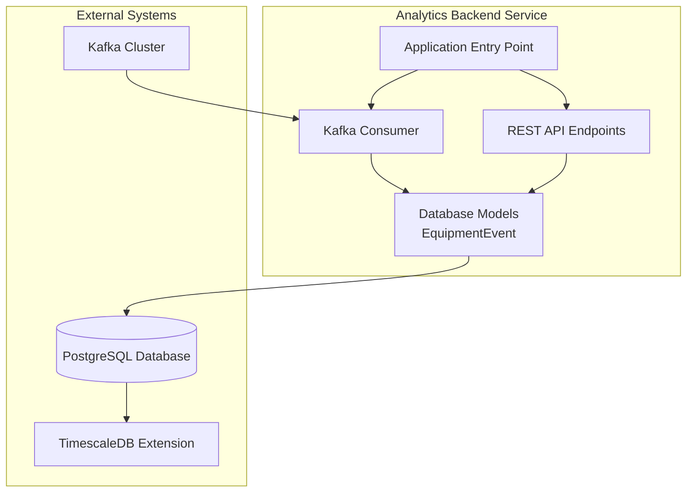
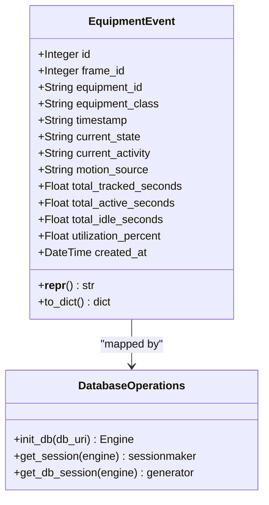
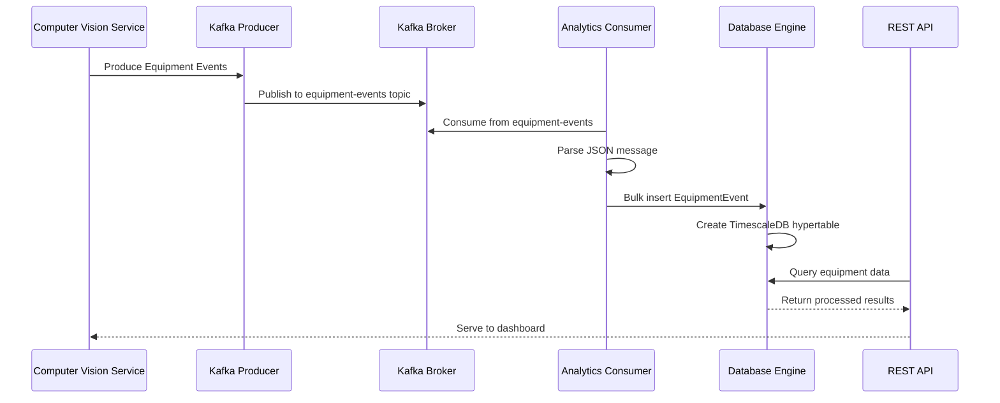
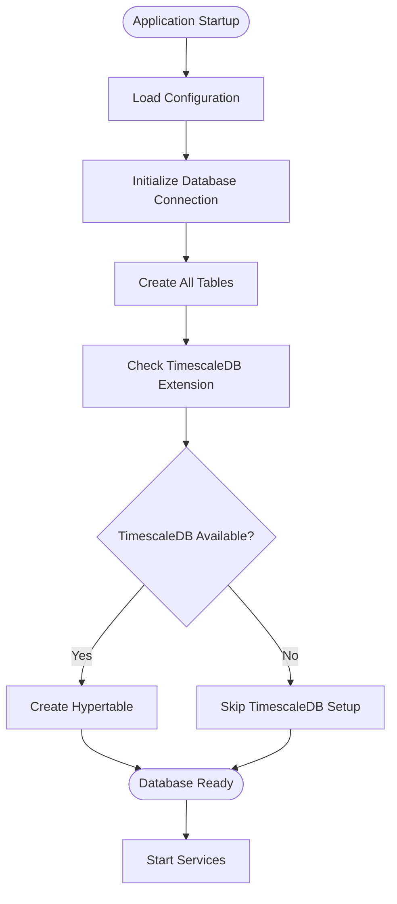
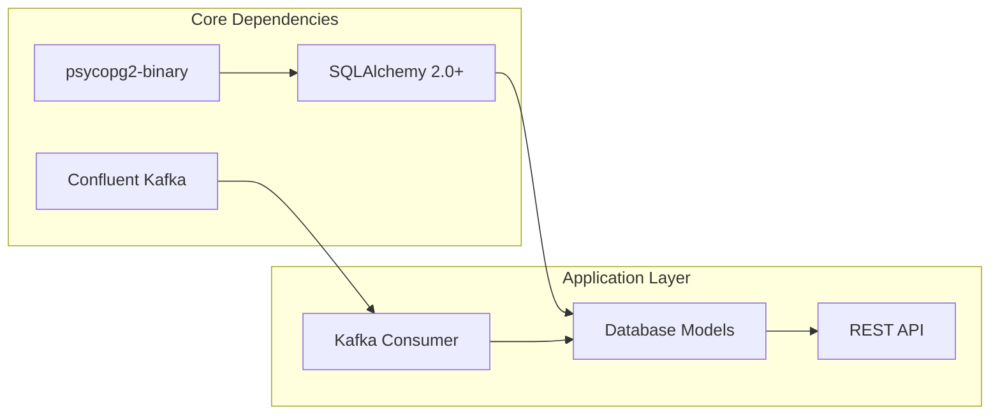

# Database Models and Schema

<cite>
**Referenced Files in This Document**
- [db_models.py](file://services/analytics_backend/src/db_models.py)
- [api.py](file://services/analytics_backend/src/api.py)
- [consumer.py](file://services/analytics_backend/src/consumer.py)
- [main.py](file://services/analytics_backend/src/main.py)
- [settings.yaml](file://config/settings.yaml)
- [docker-compose.yml](file://docker-compose.yml)
- [requirements.txt](file://services/analytics_backend/requirements.txt)
</cite>

## Table of Contents
1. [Introduction](#introduction)
2. [Project Structure](#project-structure)
3. [Core Components](#core-components)
4. [Architecture Overview](#architecture-overview)
5. [Detailed Component Analysis](#detailed-component-analysis)
6. [Dependency Analysis](#dependency-analysis)
7. [Performance Considerations](#performance-considerations)
8. [Troubleshooting Guide](#troubleshooting-guide)
9. [Conclusion](#conclusion)

## Introduction
This document provides comprehensive data model documentation for the SQLAlchemy EquipmentEvent model and related database schemas used in the Equipment Utilization & Activity Classification system. The system captures equipment tracking events from computer vision processing and stores them in a PostgreSQL database with optional TimescaleDB optimization for time-series data.

The EquipmentEvent model serves as the central data structure representing equipment state snapshots with utilization metrics, enabling real-time monitoring and historical analysis of construction equipment activities.

## Project Structure
The database layer is organized within the analytics backend service, with clear separation between data models, API endpoints, and data ingestion components.

**Diagram sources**
- [db_models.py:22-49](file://services/analytics_backend/src/db_models.py#L22-L49)
- [api.py:24-28](file://services/analytics_backend/src/api.py#L24-L28)
- [consumer.py:23-78](file://services/analytics_backend/src/consumer.py#L23-L78)

**Section sources**
- [db_models.py:1-191](file://services/analytics_backend/src/db_models.py#L1-L191)
- [api.py:1-444](file://services/analytics_backend/src/api.py#L1-L444)
- [consumer.py:1-268](file://services/analytics_backend/src/consumer.py#L1-L268)

## Core Components

### EquipmentEvent Model
The EquipmentEvent model represents individual equipment state snapshots captured from video frames processed by the computer vision pipeline.

**Diagram sources**
- [db_models.py:22-67](file://services/analytics_backend/src/db_models.py#L22-L67)
- [db_models.py:70-100](file://services/analytics_backend/src/db_models.py#L70-L100)

### Database Schema Design
The EquipmentEvent table follows a normalized design optimized for time-series equipment monitoring:

| Field Name | Data Type | Constraints | Purpose |
|------------|-----------|-------------|---------|
| id | Integer | PRIMARY KEY, AUTO_INCREMENT | Unique identifier for each event record |
| frame_id | Integer | NOT NULL | Video frame number for temporal ordering |
| equipment_id | String(20) | NOT NULL, INDEX | Equipment identifier (e.g., "DT-001") |
| equipment_class | String(50) | NOT NULL | Equipment category (e.g., "truck", "excavator") |
| timestamp | String(20) | NOT NULL | Video timestamp "HH:MM:SS.mmm" |
| current_state | String(10) | NOT NULL | Equipment operational state (ACTIVE/INACTIVE) |
| current_activity | String(30) | NOT NULL | Current activity classification |
| motion_source | String(20) | NOT NULL | Motion detection source (full_body/arm_only/none) |
| total_tracked_seconds | Float | DEFAULT 0.0 | Total time period tracked |
| total_active_seconds | Float | DEFAULT 0.0 | Time equipment was actively operating |
| total_idle_seconds | Float | DEFAULT 0.0 | Time equipment was idle |
| utilization_percent | Float | DEFAULT 0.0 | Percentage utilization calculation |
| created_at | DateTime | DEFAULT NOW, INDEX | Timestamp of record creation |

**Section sources**
- [db_models.py:22-49](file://services/analytics_backend/src/db_models.py#L22-L49)

## Architecture Overview

### Data Flow Architecture
The system implements a streaming architecture with Kafka as the message broker and PostgreSQL/TimescaleDB for persistent storage.

**Diagram sources**
- [consumer.py:143-200](file://services/analytics_backend/src/consumer.py#L143-L200)
- [db_models.py:103-156](file://services/analytics_backend/src/db_models.py#L103-L156)
- [api.py:179-284](file://services/analytics_backend/src/api.py#L179-L284)

### Database Initialization Process
The system initializes the database with automatic table creation and optional TimescaleDB optimization.

**Diagram sources**
- [db_models.py:70-100](file://services/analytics_backend/src/db_models.py#L70-L100)
- [db_models.py:103-156](file://services/analytics_backend/src/db_models.py#L103-L156)
- [main.py:95-102](file://services/analytics_backend/src/main.py#L95-L102)

**Section sources**
- [db_models.py:70-191](file://services/analytics_backend/src/db_models.py#L70-L191)
- [main.py:64-145](file://services/analytics_backend/src/main.py#L64-L145)

## Detailed Component Analysis

### EquipmentEvent Model Implementation
The EquipmentEvent model implements a comprehensive data structure for equipment monitoring with robust validation and serialization capabilities.

#### Field Definitions and Validation
Each field serves a specific purpose in equipment monitoring and analysis:

- **Primary Identifiers**: `id`, `frame_id`, `equipment_id` form the core identification system
- **Classification Fields**: `equipment_class`, `current_state`, `current_activity` categorize equipment data
- **Temporal Fields**: `timestamp`, `created_at` provide precise timing information
- **Metric Fields**: `total_tracked_seconds`, `total_active_seconds`, `total_idle_seconds`, `utilization_percent` enable utilization calculations

#### Relationship Configuration
The model establishes the following implicit relationships:
- Equipment-to-Events: One-to-Many relationship via `equipment_id`
- Frame-to-Events: One-to-Many relationship via `frame_id`
- Temporal Ordering: Natural ordering through `created_at` timestamp

**Section sources**
- [db_models.py:22-67](file://services/analytics_backend/src/db_models.py#L22-L67)

### Database Initialization and Migration Strategy
The system implements a flexible initialization process supporting both standard PostgreSQL and TimescaleDB environments.

#### Connection Pool Configuration
The database connection uses optimized pooling parameters:
- Pool Size: 10 concurrent connections
- Overflow: 20 additional connections during peak load
- Pre-ping: Connection validation before use
- Echo: Disabled for production performance

#### TimescaleDB Integration
The system automatically detects and configures TimescaleDB for optimal time-series performance:
- Automatic extension detection and creation
- Hypertable conversion with time-based partitioning
- Data migration from standard tables to hypertables

**Section sources**
- [db_models.py:70-100](file://services/analytics_backend/src/db_models.py#L70-L100)
- [db_models.py:103-156](file://services/analytics_backend/src/db_models.py#L103-L156)

### Data Ingestion Pipeline
The Kafka consumer implements efficient batch processing for high-throughput data ingestion.

#### Batch Processing Strategy
- **Batch Size**: 100 records per commit
- **Timeout**: 5-second flush interval
- **Manual Commit**: Controlled offset management
- **Error Handling**: Graceful handling of malformed JSON and processing errors

#### Message Processing Workflow
The consumer transforms incoming Kafka messages into EquipmentEvent records with structured validation and error handling.

**Section sources**
- [consumer.py:23-78](file://services/analytics_backend/src/consumer.py#L23-L78)
- [consumer.py:143-200](file://services/analytics_backend/src/consumer.py#L143-L200)

### REST API Endpoints and Query Patterns
The API provides multiple query patterns optimized for different monitoring scenarios.

#### Equipment Monitoring Endpoints
- **Current Equipment Status**: `/api/equipment` - Returns latest state for all equipment
- **Equipment History**: `/api/equipment/{equipment_id}/history` - Historical time-series data
- **Utilization Summary**: `/api/utilization/summary` - Aggregate statistics across all equipment
- **Latest Frame Data**: `/api/latest-frame` - Real-time equipment state snapshot

#### Query Optimization Techniques
The API implements several optimization strategies:
- Subquery-based latest record retrieval
- Efficient aggregation queries for summary statistics
- Parameterized limits for pagination control
- Proper indexing utilization for filtering operations

**Section sources**
- [api.py:179-444](file://services/analytics_backend/src/api.py#L179-L444)

## Dependency Analysis

### External Dependencies
The system relies on several key external libraries for database operations and messaging:

**Diagram sources**
- [requirements.txt:1-8](file://services/analytics_backend/requirements.txt#L1-L8)
- [db_models.py:12-15](file://services/analytics_backend/src/db_models.py#L12-L15)

### Internal Component Dependencies
The system exhibits clear dependency relationships with well-defined interfaces:

- **API Layer**: Depends on Database Models for data access
- **Consumer Layer**: Depends on Database Models for persistence
- **Main Application**: Coordinates initialization of both API and Consumer
- **Configuration**: Provides centralized settings for all components

**Section sources**
- [requirements.txt:1-8](file://services/analytics_backend/requirements.txt#L1-L8)
- [main.py:91-98](file://services/analytics_backend/src/main.py#L91-L98)

## Performance Considerations

### Indexing Strategy
The EquipmentEvent model implements strategic indexing for optimal query performance:

- **equipment_id**: Indexed for frequent filtering operations
- **created_at**: Indexed for time-series queries and sorting
- **Composite Queries**: Optimized for common query patterns

### Connection Pool Management
The system uses connection pooling to handle concurrent database operations efficiently:
- **Pool Size**: Balanced for typical workload patterns
- **Connection Validation**: Prevents stale connections
- **Automatic Cleanup**: Ensures proper resource management

### Batch Processing Optimization
The Kafka consumer implements several performance optimizations:
- **Bulk Operations**: Reduces database round-trips
- **Batch Commit Strategy**: Balances throughput and reliability
- **Memory Management**: Controls batch size and timeout

### TimescaleDB Benefits
When available, TimescaleDB provides significant advantages for time-series data:
- **Time-based Partitioning**: Automatic data partitioning by time
- **Compression**: Automatic compression for historical data
- **Advanced Aggregation**: Optimized time-series aggregations

**Section sources**
- [db_models.py:33,43](file://services/analytics_backend/src/db_models.py#L33,L43)
- [db_models.py:85-91](file://services/analytics_backend/src/db_models.py#L85-L91)
- [consumer.py:31-33](file://services/analytics_backend/src/consumer.py#L31-L33)

## Troubleshooting Guide

### Common Database Issues
- **Connection Failures**: Verify PostgreSQL connectivity and credentials
- **Table Creation Errors**: Check database permissions and schema privileges
- **TimescaleDB Setup**: Ensure TimescaleDB extension availability

### Kafka Integration Problems
- **Consumer Not Starting**: Verify Kafka broker connectivity and topic existence
- **Message Processing Errors**: Check JSON message format and field validation
- **Batch Commit Issues**: Review batch size configuration and memory limits

### API Endpoint Troubleshooting
- **Health Check Failures**: Verify database connectivity and query execution
- **Query Performance**: Monitor slow query logs and optimize indexes
- **Response Time Issues**: Check connection pool utilization and database load

### Database Administration Tasks
- **Backup Procedures**: Regular PostgreSQL logical backups with pg_dump
- **Monitoring**: Track connection pool usage, query performance, and disk space
- **Maintenance**: Regular VACUUM/ANALYZE operations for optimal performance

**Section sources**
- [db_models.py:158-191](file://services/analytics_backend/src/db_models.py#L158-L191)
- [consumer.py:134-141](file://services/analytics_backend/src/consumer.py#L134-L141)
- [api.py:159-177](file://services/analytics_backend/src/api.py#L159-L177)

## Conclusion
The EquipmentEvent model and associated database schema provide a robust foundation for equipment utilization monitoring and analysis. The design balances real-time processing requirements with historical data retention through strategic use of TimescaleDB for time-series optimization.

Key strengths of the implementation include:
- **Scalable Architecture**: Kafka-based streaming with efficient batch processing
- **Optimized Data Model**: Well-designed fields and indexes for common query patterns
- **Flexible Deployment**: Support for both standard PostgreSQL and TimescaleDB environments
- **Production-Ready Features**: Comprehensive error handling, connection pooling, and monitoring

The system provides a solid foundation for equipment monitoring applications, with clear pathways for extending functionality and optimizing performance based on specific deployment requirements.