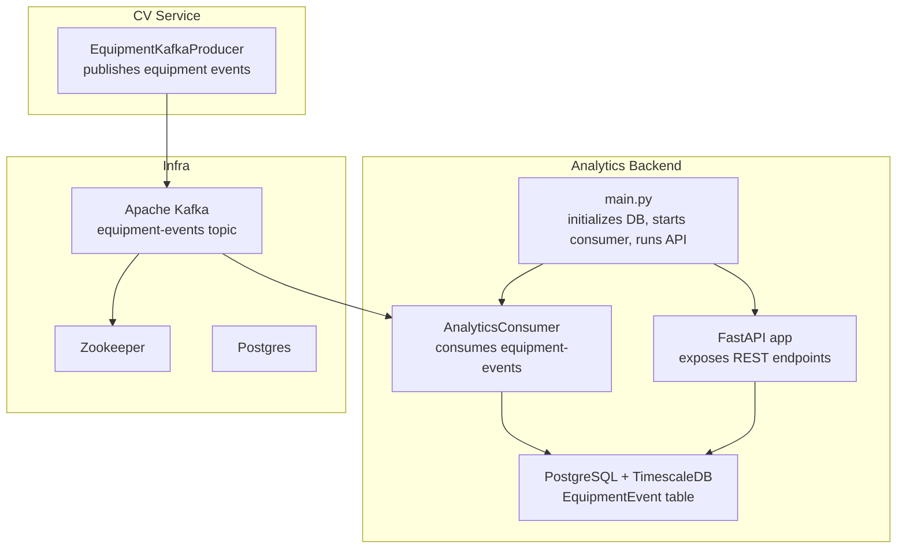
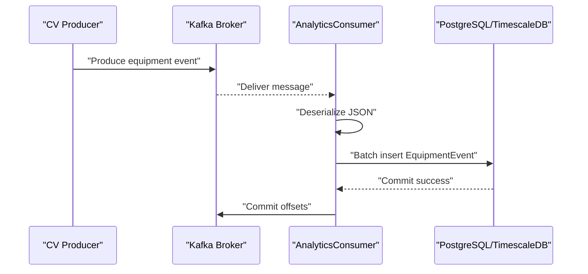
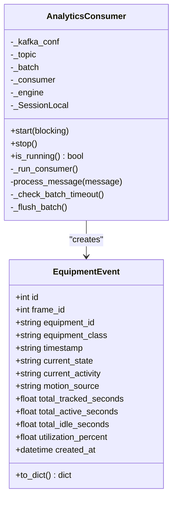
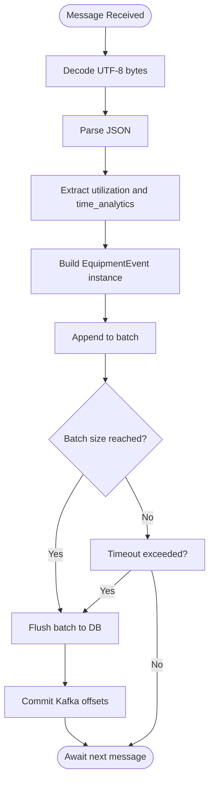
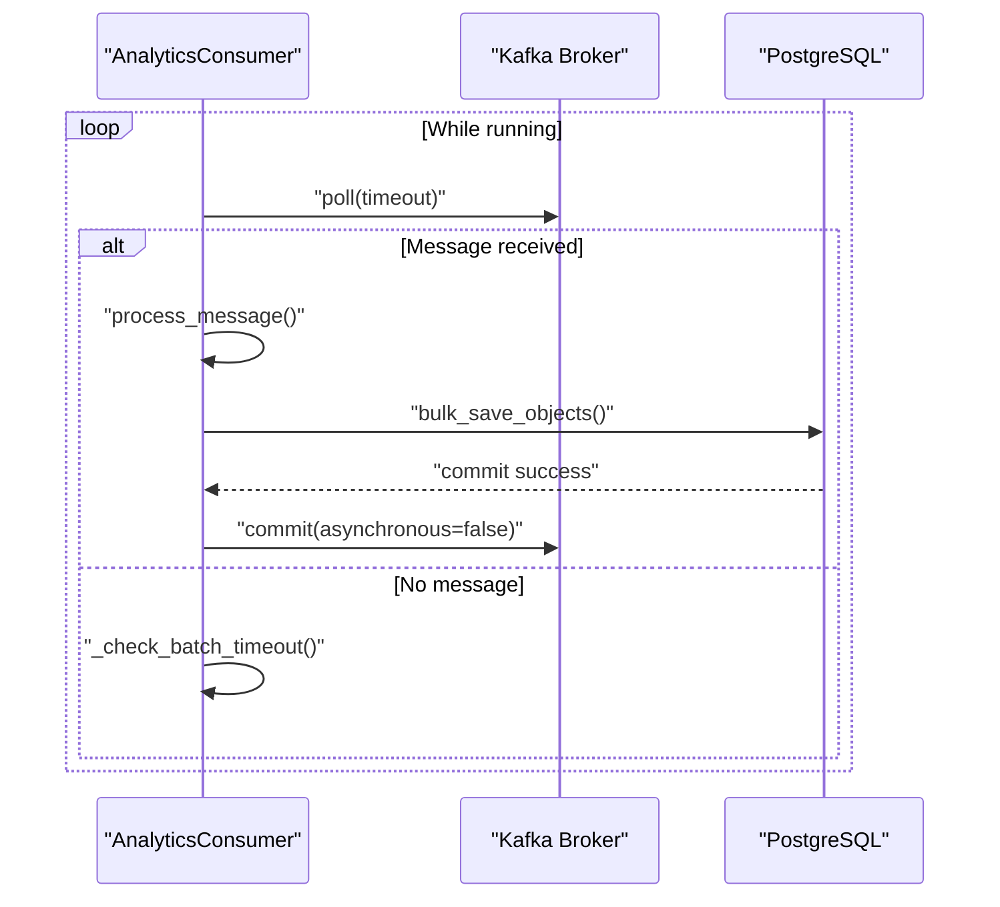
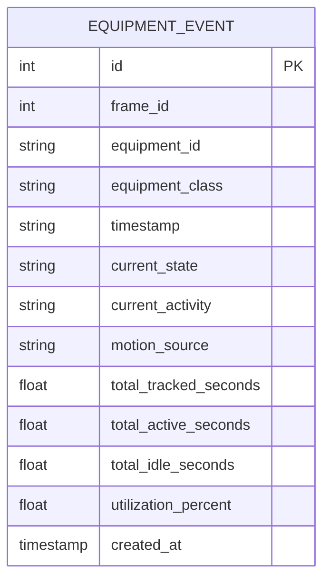
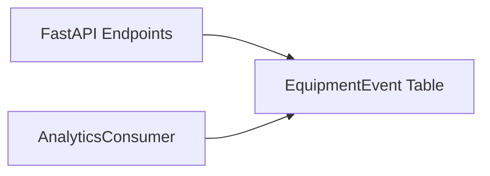
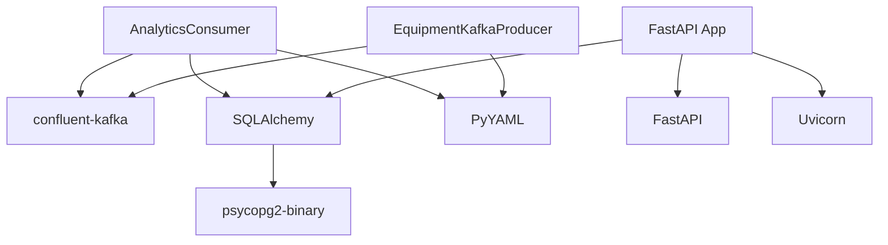

# Kafka Consumer Implementation

<cite>
**Referenced Files in This Document**
- [consumer.py](file://services/analytics_backend/src/consumer.py)
- [db_models.py](file://services/analytics_backend/src/db_models.py)
- [api.py](file://services/analytics_backend/src/api.py)
- [main.py](file://services/analytics_backend/src/main.py)
- [kafka_producer.py](file://services/cv_service/src/kafka_producer.py)
- [settings.yaml](file://config/settings.yaml)
- [docker-compose.yml](file://docker-compose.yml)
- [requirements.txt](file://services/analytics_backend/requirements.txt)
</cite>

## Table of Contents
1. [Introduction](#introduction)
2. [Project Structure](#project-structure)
3. [Core Components](#core-components)
4. [Architecture Overview](#architecture-overview)
5. [Detailed Component Analysis](#detailed-component-analysis)
6. [Dependency Analysis](#dependency-analysis)
7. [Performance Considerations](#performance-considerations)
8. [Troubleshooting Guide](#troubleshooting-guide)
9. [Conclusion](#conclusion)

## Introduction
This document explains the Kafka consumer implementation that processes equipment events produced by the computer vision pipeline. It covers consumer configuration, topic subscription, message deserialization, event routing, consumer group management, offset handling, error recovery, and the end-to-end event processing workflow from Kafka to the database. It also describes how the consumer integrates with the analytics backend’s REST API and the producer service that emits equipment events.

## Project Structure
The analytics backend service is composed of:
- A Kafka consumer that subscribes to the equipment-events topic and persists events to PostgreSQL
- SQLAlchemy models and TimescaleDB setup for efficient time-series storage
- A FastAPI application exposing endpoints for querying equipment state and utilization metrics
- An entrypoint that initializes the database, starts the consumer in a background thread, and runs the API server

**Diagram sources**
- [consumer.py](file://services/analytics_backend/src/consumer.py)
- [db_models.py](file://services/analytics_backend/src/db_models.py)
- [api.py](file://services/analytics_backend/src/api.py)
- [main.py](file://services/analytics_backend/src/main.py)
- [kafka_producer.py](file://services/cv_service/src/kafka_producer.py)
- [docker-compose.yml](file://docker-compose.yml)

**Section sources**
- [main.py](file://services/analytics_backend/src/main.py)
- [consumer.py](file://services/analytics_backend/src/consumer.py)
- [db_models.py](file://services/analytics_backend/src/db_models.py)
- [api.py](file://services/analytics_backend/src/api.py)
- [docker-compose.yml](file://docker-compose.yml)

## Core Components
- AnalyticsConsumer: Manages Kafka consumption, JSON deserialization, batched persistence, and offset commits
- EquipmentEvent model: Defines the database schema and provides conversion helpers
- FastAPI endpoints: Serve equipment state, history, and utilization metrics
- Producer service: Emits equipment events to Kafka with partitioning by equipment_id

Key responsibilities:
- Consume from equipment-events topic with manual offset management
- Deserialize JSON payloads and map to EquipmentEvent records
- Persist in batches to PostgreSQL with TimescaleDB hypertable optimization
- Provide REST API for dashboards and integrations

**Section sources**
- [consumer.py](file://services/analytics_backend/src/consumer.py)
- [db_models.py](file://services/analytics_backend/src/db_models.py)
- [api.py](file://services/analytics_backend/src/api.py)
- [kafka_producer.py](file://services/cv_service/src/kafka_producer.py)

## Architecture Overview
The consumer participates in an event-driven pipeline:
- CV service produces equipment events to Kafka with equipment_id as partition key
- Analytics consumer subscribes to equipment-events, processes messages, and writes to PostgreSQL
- FastAPI serves queries for equipment status and utilization metrics
- TimescaleDB optimizes time-series queries on the equipment_events table

**Diagram sources**
- [kafka_producer.py](file://services/cv_service/src/kafka_producer.py)
- [consumer.py](file://services/analytics_backend/src/consumer.py)
- [db_models.py](file://services/analytics_backend/src/db_models.py)

## Detailed Component Analysis

### AnalyticsConsumer
The consumer encapsulates Kafka consumption, JSON parsing, and batched persistence:
- Configuration: bootstrap_servers, topic, consumer_group, auto.offset.reset, enable.auto.commit disabled, poll intervals
- Subscription: subscribes to equipment-events topic
- Poll loop: reads messages with timeouts, handles EOF and unknown topic errors
- Deserialization: decodes UTF-8 bytes and parses JSON
- Routing: extracts utilization and time_analytics fields into EquipmentEvent instances
- Persistence: accumulates events in a batch and flushes via bulk_save_objects
- Offset handling: commits offsets synchronously after successful DB writes
- Graceful shutdown: signal handlers trigger stop(), thread join, and final flush/close

**Diagram sources**
- [consumer.py](file://services/analytics_backend/src/consumer.py)
- [db_models.py](file://services/analytics_backend/src/db_models.py)

**Section sources**
- [consumer.py](file://services/analytics_backend/src/consumer.py)
- [db_models.py](file://services/analytics_backend/src/db_models.py)

### Message Deserialization and Event Routing
- Topic: equipment-events (configured in settings)
- Partitioning: CV producer uses equipment_id as partition key to ensure ordering per equipment
- Payload schema: includes frame_id, equipment_id, equipment_class, timestamp, utilization, and time_analytics
- Consumer routing: extracts nested fields and constructs EquipmentEvent attributes

**Diagram sources**
- [consumer.py](file://services/analytics_backend/src/consumer.py)
- [kafka_producer.py](file://services/cv_service/src/kafka_producer.py)

**Section sources**
- [consumer.py](file://services/analytics_backend/src/consumer.py)
- [kafka_producer.py](file://services/cv_service/src/kafka_producer.py)

### Consumer Group Management and Offset Handling
- Consumer group: analytics-consumer (from settings)
- Manual commits: enable.auto.commit disabled; offsets committed after successful DB writes
- Session and poll timeouts: configured to handle long-running processing
- Error handling: EOF and unknown topic handled gracefully; other errors logged and retried

**Diagram sources**
- [consumer.py](file://services/analytics_backend/src/consumer.py)

**Section sources**
- [consumer.py](file://services/analytics_backend/src/consumer.py)
- [settings.yaml](file://config/settings.yaml)

### Database Integration and TimescaleDB Setup
- SQLAlchemy models define EquipmentEvent table with indexes for equipment_id and created_at
- init_db creates tables and attempts to convert equipment_events to a TimescaleDB hypertable on created_at
- get_session provides a session factory; _flush_batch uses bulk_save_objects and synchronous commit

**Diagram sources**
- [db_models.py](file://services/analytics_backend/src/db_models.py)

**Section sources**
- [db_models.py](file://services/analytics_backend/src/db_models.py)

### REST API Integration
- FastAPI app exposes endpoints for equipment status, history, utilization summary, latest frame, and stats
- Database engine is injected at startup so the API can query persisted events
- The consumer and API share the same database engine and table schema

**Diagram sources**
- [api.py](file://services/analytics_backend/src/api.py)
- [db_models.py](file://services/analytics_backend/src/db_models.py)

**Section sources**
- [api.py](file://services/analytics_backend/src/api.py)
- [db_models.py](file://services/analytics_backend/src/db_models.py)

### Producer Relationship and Message Ordering
- Producer partitions by equipment_id to preserve ordering per equipment
- Consumer group reads from the same topic; ordering is maintained per partition
- This enables accurate time-series aggregation and latest-state queries

**Section sources**
- [kafka_producer.py](file://services/cv_service/src/kafka_producer.py)
- [consumer.py](file://services/analytics_backend/src/consumer.py)

## Dependency Analysis
External dependencies and runtime relationships:
- confluent-kafka for consumer and producer
- SQLAlchemy for ORM and PostgreSQL connectivity
- psycopg2-binary for PostgreSQL adapter
- FastAPI and Uvicorn for REST API
- PyYAML for configuration loading
- TimescaleDB extension for time-series optimization

**Diagram sources**
- [consumer.py](file://services/analytics_backend/src/consumer.py)
- [kafka_producer.py](file://services/cv_service/src/kafka_producer.py)
- [api.py](file://services/analytics_backend/src/api.py)
- [requirements.txt](file://services/analytics_backend/requirements.txt)

**Section sources**
- [requirements.txt](file://services/analytics_backend/requirements.txt)
- [consumer.py](file://services/analytics_backend/src/consumer.py)
- [kafka_producer.py](file://services/cv_service/src/kafka_producer.py)
- [api.py](file://services/analytics_backend/src/api.py)

## Performance Considerations
- Batch processing: Consumer buffers up to 100 messages or flushes every 5 seconds to reduce DB round-trips
- Manual commits: Ensures exactly-once semantics per batch by committing offsets after successful writes
- TimescaleDB: Hypertable on created_at improves time-series query performance
- CPU optimization: Consumer avoids heavy processing; most work is in CV service
- Backpressure: Kafka prevents producer backpressure during bursts; consumer can catch up later

[No sources needed since this section provides general guidance]

## Troubleshooting Guide
Common issues and solutions:
- Consumer lag
  - Symptoms: rising lag in Kafka consumer groups
  - Causes: slow DB writes, large batches, insufficient throughput
  - Solutions: reduce batch size, increase batch timeout, scale consumers horizontally, optimize DB indexing
- Message ordering
  - Expectation: ordering preserved per equipment_id due to partitioning by equipment_id
  - Verification: ensure producer uses equipment_id as partition key
- Failure scenarios
  - DB failures: _flush_batch rolls back and logs errors; consumer continues polling
  - Kafka exceptions: caught and logged; consumer flushes and closes cleanly
  - Graceful shutdown: signal handlers initiate stop(), join threads, and flush remaining batches
- Topic availability
  - Unknown topic: consumer waits and retries; ensure topic exists or auto-create is enabled
  - EOF: not treated as error; consumer continues

Operational checks:
- Verify Kafka topic exists and is healthy
- Confirm consumer group membership and lag
- Monitor DB connection pool and TimescaleDB setup
- Validate configuration values for bootstrap_servers, topic, and consumer_group

**Section sources**
- [consumer.py](file://services/analytics_backend/src/consumer.py)
- [settings.yaml](file://config/settings.yaml)
- [docker-compose.yml](file://docker-compose.yml)

## Conclusion
The Kafka consumer is a robust, batch-oriented processor that transforms CV-produced equipment events into durable, time-series data stored in PostgreSQL with TimescaleDB optimization. It integrates tightly with the analytics backend’s REST API, enabling real-time dashboards and historical analytics. Its design emphasizes reliability, scalability, and maintainability within the event-driven architecture, with clear separation of concerns between the producer, consumer, and API layers.