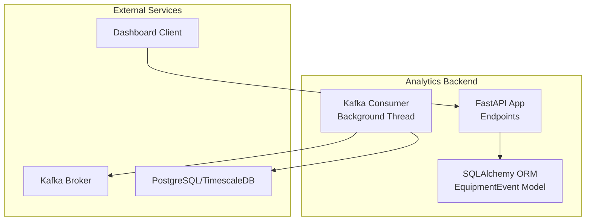
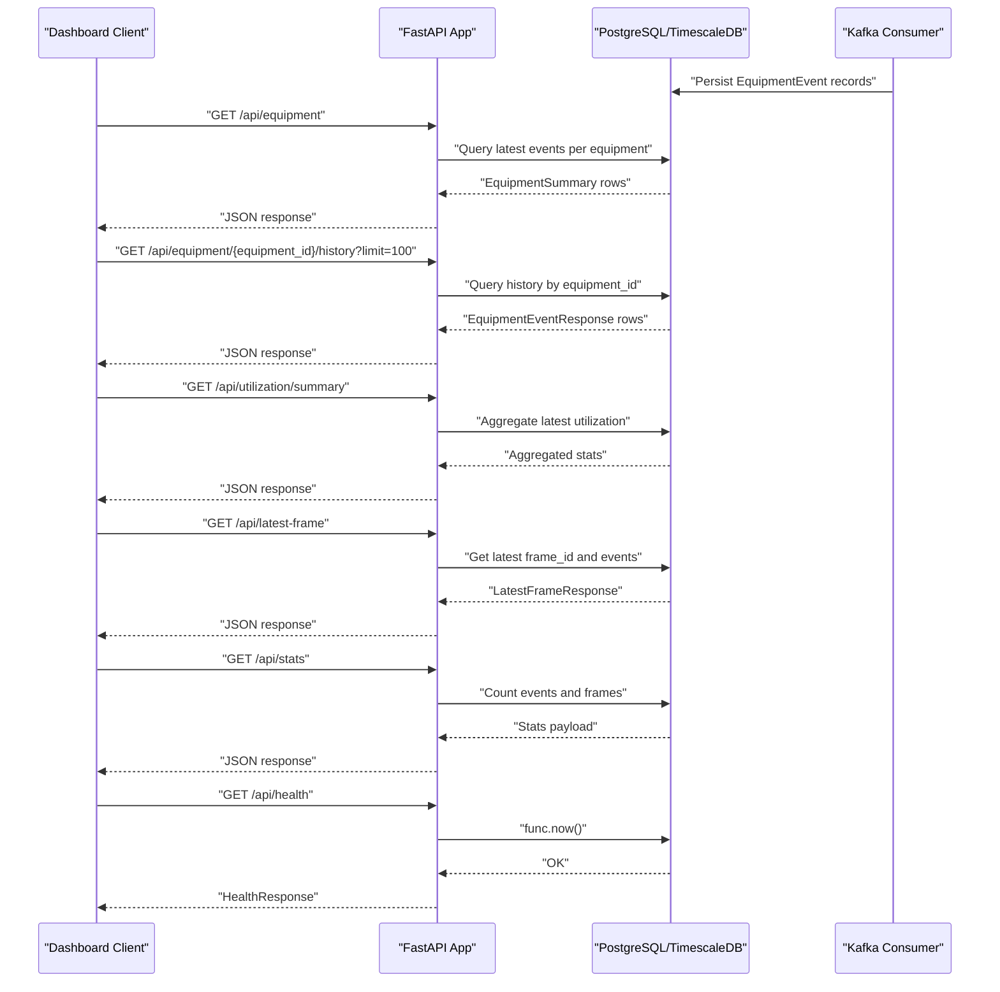
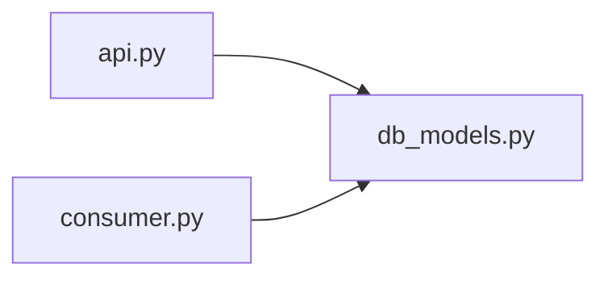

# REST API Endpoints

<cite>
**Referenced Files in This Document**
- [api.py](file://services/analytics_backend/src/api.py)
- [db_models.py](file://services/analytics_backend/src/db_models.py)
- [main.py](file://services/analytics_backend/src/main.py)
- [consumer.py](file://services/analytics_backend/src/consumer.py)
- [settings.yaml](file://config/settings.yaml)
- [Dockerfile](file://services/analytics_backend/Dockerfile)
- [docker-compose.yml](file://docker-compose.yml)
</cite>

## Table of Contents
1. [Introduction](#introduction)
2. [Project Structure](#project-structure)
3. [Core Components](#core-components)
4. [Architecture Overview](#architecture-overview)
5. [Detailed Component Analysis](#detailed-component-analysis)
6. [Dependency Analysis](#dependency-analysis)
7. [Performance Considerations](#performance-considerations)
8. [Troubleshooting Guide](#troubleshooting-guide)
9. [Conclusion](#conclusion)
10. [Appendices](#appendices)

## Introduction
This document provides comprehensive REST API documentation for the Analytics Backend service. It covers all HTTP endpoints exposed by the FastAPI application, including health checks, equipment listing, historical time-series retrieval, aggregate utilization statistics, real-time status display, and general database statistics. For each endpoint, you will find HTTP methods, URL patterns, request parameters, response schemas using Pydantic models, error handling strategies, and authentication requirements. Practical examples, parameter validation rules, CORS configuration, and client implementation guidelines for dashboard applications are included.

## Project Structure
The Analytics Backend is implemented as a FastAPI application with SQLAlchemy ORM for PostgreSQL persistence. Kafka consumers ingest equipment event streams and persist them into the database. The service exposes a REST API for dashboards and clients to query equipment analytics.

**Diagram sources**
- [api.py:159-444](file://services/analytics_backend/src/api.py#L159-L444)
- [db_models.py:22-67](file://services/analytics_backend/src/db_models.py#L22-L67)
- [consumer.py:23-244](file://services/analytics_backend/src/consumer.py#L23-L244)
- [docker-compose.yml:64-79](file://docker-compose.yml#L64-L79)

**Section sources**
- [api.py:159-444](file://services/analytics_backend/src/api.py#L159-L444)
- [db_models.py:22-67](file://services/analytics_backend/src/db_models.py#L22-L67)
- [main.py:64-149](file://services/analytics_backend/src/main.py#L64-L149)
- [consumer.py:23-244](file://services/analytics_backend/src/consumer.py#L23-L244)
- [docker-compose.yml:64-79](file://docker-compose.yml#L64-L79)

## Core Components
- FastAPI Application: Defines endpoints, response models, and CORS configuration.
- SQLAlchemy EquipmentEvent Model: Represents persisted equipment snapshots with time-series fields.
- Database Initialization: Creates tables and attempts TimescaleDB hypertable setup.
- Kafka Consumer: Background thread that consumes equipment events and writes to the database.
- Uvicorn Server: Runs the FastAPI app on port 8000.

Key implementation references:
- Endpoint definitions and response models: [api.py:159-444](file://services/analytics_backend/src/api.py#L159-L444)
- EquipmentEvent model fields and indices: [db_models.py:22-67](file://services/analytics_backend/src/db_models.py#L22-L67)
- Database initialization and TimescaleDB setup: [db_models.py:70-156](file://services/analytics_backend/src/db_models.py#L70-L156)
- Kafka consumer and batch processing: [consumer.py:23-244](file://services/analytics_backend/src/consumer.py#L23-L244)
- Server startup and port exposure: [main.py:124-136](file://services/analytics_backend/src/main.py#L124-L136), [Dockerfile:19-20](file://services/analytics_backend/Dockerfile#L19-L20)

**Section sources**
- [api.py:159-444](file://services/analytics_backend/src/api.py#L159-L444)
- [db_models.py:22-156](file://services/analytics_backend/src/db_models.py#L22-L156)
- [main.py:124-136](file://services/analytics_backend/src/main.py#L124-L136)
- [Dockerfile:19-20](file://services/analytics_backend/Dockerfile#L19-L20)

## Architecture Overview
The Analytics Backend integrates Kafka streaming ingestion with a FastAPI REST API and a persistent PostgreSQL database. The Kafka consumer runs in a background thread, continuously writing equipment events to the database. The API exposes read-only endpoints for dashboards and clients.

**Diagram sources**
- [api.py:159-444](file://services/analytics_backend/src/api.py#L159-L444)
- [db_models.py:22-67](file://services/analytics_backend/src/db_models.py#L22-L67)
- [consumer.py:23-244](file://services/analytics_backend/src/consumer.py#L23-L244)

## Detailed Component Analysis

### Endpoint Catalog and Specifications

#### GET /api/health
- Purpose: Health check to verify API availability and database connectivity.
- Authentication: Not required.
- Request parameters: None.
- Response schema: HealthResponse
  - Fields: status (string), database (string), message (string)
- Error handling:
  - 503 Service Unavailable if database is uninitialized.
  - 503 Service Unavailable if database connectivity fails.
- Example request:
  - curl http://analytics-backend:8000/api/health
- Example response:
  - {
      "status": "healthy",
      "database": "connected",
      "message": "Equipment Analytics API is running"
    }

**Section sources**
- [api.py:159-177](file://services/analytics_backend/src/api.py#L159-L177)

#### GET /api/equipment
- Purpose: List all tracked equipment with their latest recorded state.
- Authentication: Not required.
- Request parameters: None.
- Response schema: List of EquipmentSummary
  - Fields: equipment_id (string), equipment_class (string), current_state (string), current_activity (string), utilization_percent (float), last_seen (string|null)
- Error handling:
  - 500 Internal Server Error on database failures.
- Example request:
  - curl http://analytics-backend:8000/api/equipment
- Example response:
  - [
      {
        "equipment_id": "DT-001",
        "equipment_class": "truck",
        "current_state": "ACTIVE",
        "current_activity": "LOADING",
        "utilization_percent": 75.5,
        "last_seen": "2025-01-01T12:00:00Z"
      },
      ...
    ]

**Section sources**
- [api.py:179-223](file://services/analytics_backend/src/api.py#L179-L223)

#### GET /api/equipment/{equipment_id}/history
- Purpose: Retrieve time-series history for a specific equipment, ordered by creation time descending.
- Authentication: Not required.
- Path parameters:
  - equipment_id (string): Equipment identifier (e.g., "DT-001").
- Query parameters:
  - limit (integer, default 100, min 1, max 1000): Number of records to return.
- Response schema: List of EquipmentEventResponse
  - Fields: id (int), frame_id (int), equipment_id (string), equipment_class (string), timestamp (string), current_state (string), current_activity (string), motion_source (string), total_tracked_seconds (float), total_active_seconds (float), total_idle_seconds (float), utilization_percent (float), created_at (string|null)
- Error handling:
  - 404 Not Found if no events exist for the equipment.
  - 500 Internal Server Error on database failures.
- Example request:
  - curl "http://analytics-backend:8000/api/equipment/DT-001/history?limit=50"
- Example response:
  - [
      {
        "id": 12345,
        "frame_id": 1001,
        "equipment_id": "DT-001",
        "equipment_class": "truck",
        "timestamp": "12:00:00.123",
        "current_state": "ACTIVE",
        "current_activity": "LOADING",
        "motion_source": "full_body",
        "total_tracked_seconds": 120.5,
        "total_active_seconds": 90.2,
        "total_idle_seconds": 30.3,
        "utilization_percent": 75.2,
        "created_at": "2025-01-01T12:00:00Z"
      },
      ...
    ]

**Section sources**
- [api.py:225-284](file://services/analytics_backend/src/api.py#L225-L284)

#### GET /api/utilization/summary
- Purpose: Aggregate utilization statistics across all equipment, including active/inactive counts, average utilization, and per-equipment summaries.
- Authentication: Not required.
- Request parameters: None.
- Response schema: UtilizationSummaryResponse
  - Fields:
    - total_equipment (int)
    - active_count (int)
    - inactive_count (int)
    - avg_utilization (float)
    - equipment (List of EquipmentUtilizationSummary)
      - equipment_id (string)
      - equipment_class (string)
      - total_tracked_seconds (float)
      - total_active_seconds (float)
      - total_idle_seconds (float)
      - utilization_percent (float)
      - event_count (int)
- Error handling:
  - 500 Internal Server Error on database failures.
- Example request:
  - curl http://analytics-backend:8000/api/utilization/summary
- Example response:
  - {
      "total_equipment": 10,
      "active_count": 7,
      "inactive_count": 3,
      "avg_utilization": 68.5,
      "equipment": [
        {
          "equipment_id": "DT-001",
          "equipment_class": "truck",
          "total_tracked_seconds": 120.5,
          "total_active_seconds": 90.2,
          "total_idle_seconds": 30.3,
          "utilization_percent": 75.2,
          "event_count": 120
        },
        ...
      ]
    }

**Section sources**
- [api.py:286-368](file://services/analytics_backend/src/api.py#L286-L368)

#### GET /api/latest-frame
- Purpose: Retrieve the latest processed frame’s equipment snapshot for real-time dashboard updates.
- Authentication: Not required.
- Request parameters: None.
- Response schema: LatestFrameResponse
  - Fields:
    - frame_id (int)
    - equipment (List of LatestFrameEquipment)
      - equipment_id (string)
      - equipment_class (string)
      - current_state (string)
      - current_activity (string)
      - motion_source (string)
      - utilization_percent (float)
      - timestamp (string)
      - frame_id (int)
- Error handling:
  - 500 Internal Server Error on database failures.
- Example request:
  - curl http://analytics-backend:8000/api/latest-frame
- Example response:
  - {
      "frame_id": 1001,
      "equipment": [
        {
          "equipment_id": "DT-001",
          "equipment_class": "truck",
          "current_state": "ACTIVE",
          "current_activity": "LOADING",
          "motion_source": "full_body",
          "utilization_percent": 75.2,
          "timestamp": "12:00:00.123",
          "frame_id": 1001
        },
        ...
      ]
    }

**Section sources**
- [api.py:370-416](file://services/analytics_backend/src/api.py#L370-L416)

#### GET /api/stats
- Purpose: General statistics about the events stored in the database (counts and frame range).
- Authentication: Not required.
- Request parameters: None.
- Response schema: Dictionary-like payload
  - Fields:
    - total_events (int)
    - unique_equipment (int)
    - frame_range (object)
      - min (int)
      - max (int)
- Error handling:
  - 500 Internal Server Error on database failures.
- Example request:
  - curl http://analytics-backend:8000/api/stats
- Example response:
  - {
      "total_events": 12345,
      "unique_equipment": 10,
      "frame_range": {
        "min": 1,
        "max": 1001
      }
    }

**Section sources**
- [api.py:418-444](file://services/analytics_backend/src/api.py#L418-L444)

### Response Models Reference
- HealthResponse: status, database, message
- EquipmentSummary: equipment_id, equipment_class, current_state, current_activity, utilization_percent, last_seen
- EquipmentEventResponse: id, frame_id, equipment_id, equipment_class, timestamp, current_state, current_activity, motion_source, total_tracked_seconds, total_active_seconds, total_idle_seconds, utilization_percent, created_at
- EquipmentUtilizationSummary: equipment_id, equipment_class, total_tracked_seconds, total_active_seconds, total_idle_seconds, utilization_percent, event_count
- UtilizationSummaryResponse: total_equipment, active_count, inactive_count, avg_utilization, equipment
- LatestFrameEquipment: equipment_id, equipment_class, current_state, current_activity, motion_source, utilization_percent, timestamp, frame_id
- LatestFrameResponse: frame_id, equipment

These models are defined in the API module and validated automatically by FastAPI.

**Section sources**
- [api.py:77-153](file://services/analytics_backend/src/api.py#L77-L153)

### Parameter Validation Rules
- GET /api/equipment/{equipment_id}/history
  - limit: integer, default 100, min 1, max 1000
- Path parameter equipment_id: string (non-empty), validated by FastAPI routing
- Other endpoints: No query parameters; path parameters validated by FastAPI routing

**Section sources**
- [api.py:230-233](file://services/analytics_backend/src/api.py#L230-L233)

### Error Handling Strategies
- Database initialization errors: 503 Service Unavailable when engine/session is not configured.
- Database connectivity failures: 503 Service Unavailable on health check failure.
- Query failures: 500 Internal Server Error with detailed message.
- Resource not found: 404 Not Found when equipment history is empty.
- Parameter validation: FastAPI enforces limits and types; invalid types produce 422 Unprocessable Entity.

**Section sources**
- [api.py:63-70](file://services/analytics_backend/src/api.py#L63-L70)
- [api.py:166-176](file://services/analytics_backend/src/api.py#L166-L176)
- [api.py:254-258](file://services/analytics_backend/src/api.py#L254-L258)
- [api.py:281-283](file://services/analytics_backend/src/api.py#L281-L283)
- [api.py:365-367](file://services/analytics_backend/src/api.py#L365-L367)
- [api.py:441-443](file://services/analytics_backend/src/api.py#L441-L443)

### Authentication Requirements
- No authentication is implemented for any endpoint.
- CORS is enabled to allow cross-origin requests from dashboards and other frontends.

**Section sources**
- [api.py:30-37](file://services/analytics_backend/src/api.py#L30-L37)

### CORS Configuration
- Origins: Allow all origins ("*")
- Methods and headers: Allow all methods and headers
- Credentials: Allowed

This enables flexible frontend integration, including Streamlit dashboards and other web clients.

**Section sources**
- [api.py:30-37](file://services/analytics_backend/src/api.py#L30-L37)

### Rate Limiting Considerations
- No built-in rate limiting middleware is present.
- Clients should implement client-side throttling and caching strategies.
- Recommended refresh intervals for dashboards are configured in settings (e.g., 1 second).

**Section sources**
- [settings.yaml:57-58](file://config/settings.yaml#L57-L58)

### Client Implementation Guidelines
- Base URL: http://analytics-backend:8000
- Endpoints to poll:
  - GET /api/health (periodic)
  - GET /api/latest-frame (real-time updates)
  - GET /api/equipment (equipment list)
  - GET /api/equipment/{equipment_id}/history?limit=N (historical charts)
  - GET /api/utilization/summary (aggregate stats)
  - GET /api/stats (monitoring)
- Refresh intervals:
  - Real-time: every 1–5 seconds depending on UI responsiveness needs
  - Historical: larger intervals to reduce load
- Caching:
  - Cache latest-frame responses per frame_id to avoid redundant queries
  - Cache equipment lists periodically
- Error handling:
  - Retry on 5xx with exponential backoff
  - Fallback to cached data on transient failures
- Frontend integration:
  - Use fetch/fetch-like libraries
  - Respect CORS configuration and handle credentials if needed
  - Consider pagination for long histories if needed

**Section sources**
- [settings.yaml:55-58](file://config/settings.yaml#L55-L58)
- [api.py:30-37](file://services/analytics_backend/src/api.py#L30-L37)

## Dependency Analysis
The API module depends on:
- SQLAlchemy ORM for database operations
- Pydantic models for response serialization
- FastAPI for routing and validation
- Database engine/session injected at runtime

**Diagram sources**
- [api.py:19-19](file://services/analytics_backend/src/api.py#L19-L19)
- [db_models.py:12-15](file://services/analytics_backend/src/db_models.py#L12-L15)
- [consumer.py:16-18](file://services/analytics_backend/src/consumer.py#L16-L18)

**Section sources**
- [api.py:19-19](file://services/analytics_backend/src/api.py#L19-L19)
- [db_models.py:12-15](file://services/analytics_backend/src/db_models.py#L12-L15)
- [consumer.py:16-18](file://services/analytics_backend/src/consumer.py#L16-L18)

## Performance Considerations
- Database indexing:
  - equipment_id is indexed; created_at is indexed for time-series queries.
- TimescaleDB:
  - Hypertable creation is attempted on equipment_events.created_at for time-series optimization.
- Query patterns:
  - Latest-event per equipment uses a subquery to minimize scans.
  - History queries order by created_at descending and limit results.
- Batch writes:
  - Kafka consumer batches writes and commits offsets after successful writes.
- Recommendations:
  - Use limit on history queries to cap payload sizes.
  - Prefer latest-frame for real-time dashboards to reduce DB load.
  - Consider adding pagination for large datasets if needed.

**Section sources**
- [db_models.py:33-43](file://services/analytics_backend/src/db_models.py#L33-L43)
- [db_models.py:103-156](file://services/analytics_backend/src/db_models.py#L103-L156)
- [api.py:188-206](file://services/analytics_backend/src/api.py#L188-L206)
- [api.py:246-252](file://services/analytics_backend/src/api.py#L246-L252)
- [consumer.py:194-196](file://services/analytics_backend/src/consumer.py#L194-L196)

## Troubleshooting Guide
- Health check failing:
  - Verify database initialization and connectivity.
  - Check logs for database errors.
- Empty equipment history:
  - Confirm equipment_id exists and has events.
  - Verify Kafka consumer is running and writing to DB.
- Slow queries:
  - Ensure TimescaleDB is available and hypertable is created.
  - Use smaller limit values for history queries.
- CORS issues:
  - Confirm frontend origin is allowed by CORS configuration.
- Port conflicts:
  - Ensure port 8000 is free or adjust container port mapping.

**Section sources**
- [api.py:166-176](file://services/analytics_backend/src/api.py#L166-L176)
- [api.py:254-258](file://services/analytics_backend/src/api.py#L254-L258)
- [db_models.py:103-156](file://services/analytics_backend/src/db_models.py#L103-L156)
- [consumer.py:194-228](file://services/analytics_backend/src/consumer.py#L194-L228)
- [Dockerfile:19-20](file://services/analytics_backend/Dockerfile#L19-L20)

## Conclusion
The Analytics Backend provides a robust, low-friction REST API for equipment analytics. It offers real-time and historical insights with minimal configuration, enabling dashboard developers to build responsive monitoring interfaces. The absence of authentication simplifies integration, while CORS and rate-limiting recommendations help ensure reliable client experiences.

## Appendices

### Endpoint Summary Table
- GET /api/health: Health status and database connectivity
- GET /api/equipment: Latest equipment states
- GET /api/equipment/{equipment_id}/history: Equipment history with limit
- GET /api/utilization/summary: Aggregate utilization statistics
- GET /api/latest-frame: Latest frame equipment snapshot
- GET /api/stats: Database statistics

**Section sources**
- [api.py:159-444](file://services/analytics_backend/src/api.py#L159-L444)