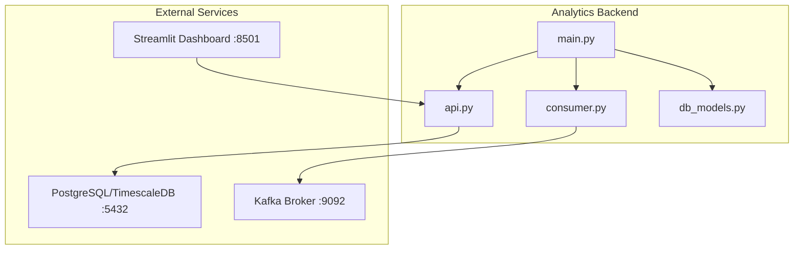
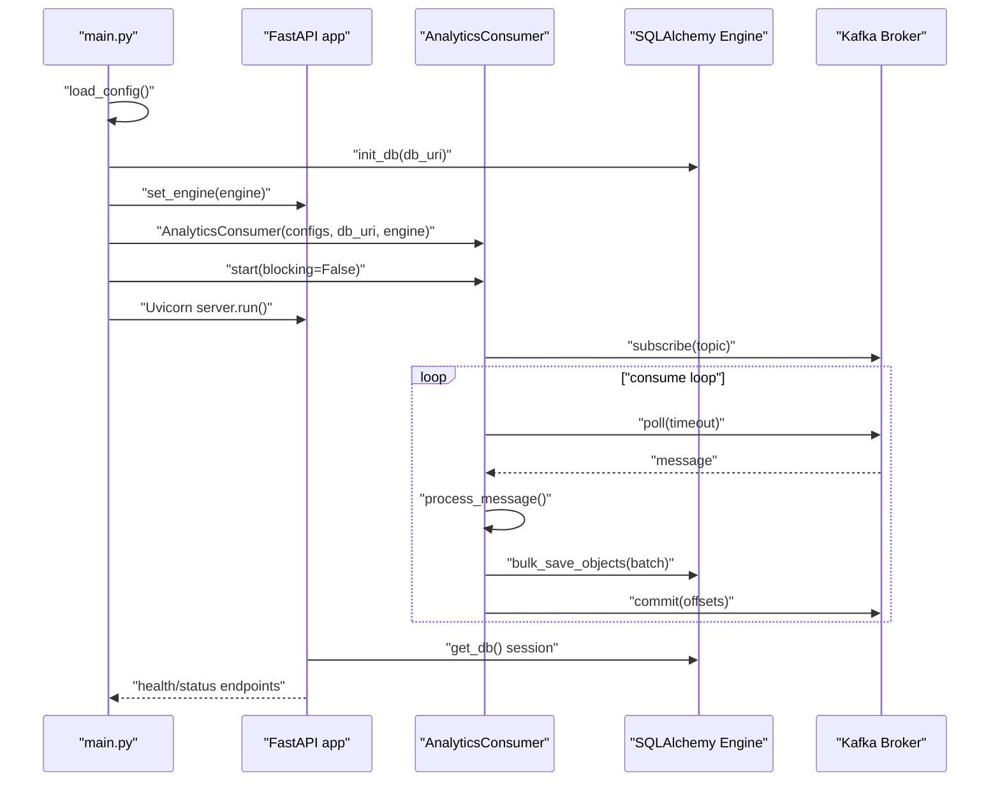
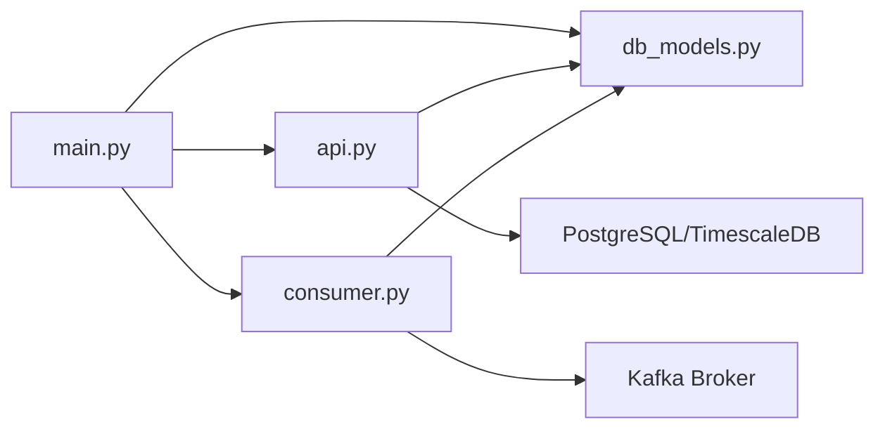

# Service Orchestration and Main Module

<cite>
**Referenced Files in This Document**
- [main.py](file://services/analytics_backend/src/main.py)
- [api.py](file://services/analytics_backend/src/api.py)
- [consumer.py](file://services/analytics_backend/src/consumer.py)
- [db_models.py](file://services/analytics_backend/src/db_models.py)
- [settings.yaml](file://config/settings.yaml)
- [Dockerfile](file://services/analytics_backend/Dockerfile)
- [requirements.txt](file://services/analytics_backend/requirements.txt)
- [docker-compose.yml](file://docker-compose.yml)
- [README.md](file://README.md)
</cite>

## Table of Contents
1. [Introduction](#introduction)
2. [Project Structure](#project-structure)
3. [Core Components](#core-components)
4. [Architecture Overview](#architecture-overview)
5. [Detailed Component Analysis](#detailed-component-analysis)
6. [Dependency Analysis](#dependency-analysis)
7. [Performance Considerations](#performance-considerations)
8. [Troubleshooting Guide](#troubleshooting-guide)
9. [Conclusion](#conclusion)
10. [Appendices](#appendices)

## Introduction
This document explains the Analytics Backend service orchestration with a focus on the main entrypoint and startup sequence. It covers FastAPI application initialization, dependency injection setup, database engine configuration and session management, Kafka consumer integration, and graceful shutdown procedures. Practical guidance is included for configuration, environment variables, logging, service discovery, monitoring hooks, and deployment/scaling considerations.

## Project Structure
The Analytics Backend is a Python service packaged as a FastAPI application with an embedded Kafka consumer. It is containerized and orchestrated via Docker Compose alongside Kafka, PostgreSQL (with TimescaleDB), the CV service, and the Streamlit dashboard.

**Diagram sources**
- [main.py:64-149](file://services/analytics_backend/src/main.py#L64-L149)
- [api.py:24-71](file://services/analytics_backend/src/api.py#L24-L71)
- [consumer.py:35-78](file://services/analytics_backend/src/consumer.py#L35-L78)
- [db_models.py:70-100](file://services/analytics_backend/src/db_models.py#L70-L100)

**Section sources**
- [README.md:56-66](file://README.md#L56-L66)
- [docker-compose.yml:64-79](file://docker-compose.yml#L64-L79)

## Core Components
- FastAPI application with CORS middleware and health endpoint
- Dependency injection for database sessions
- Kafka consumer for equipment events with batched writes and manual commits
- SQLAlchemy engine with connection pooling and TimescaleDB hypertable setup
- Uvicorn server configured for production-like operation
- Graceful shutdown via signal handlers and thread-safe stop mechanisms

Key implementation references:
- Application initialization and DI: [api.py:24-71](file://services/analytics_backend/src/api.py#L24-L71)
- Database engine creation and TimescaleDB setup: [db_models.py:70-100](file://services/analytics_backend/src/db_models.py#L70-L100), [db_models.py:103-156](file://services/analytics_backend/src/db_models.py#L103-L156)
- Kafka consumer lifecycle and batch processing: [consumer.py:35-78](file://services/analytics_backend/src/consumer.py#L35-L78), [consumer.py:143-229](file://services/analytics_backend/src/consumer.py#L143-L229)
- Startup sequence and signal handling: [main.py:64-149](file://services/analytics_backend/src/main.py#L64-L149)

**Section sources**
- [api.py:24-71](file://services/analytics_backend/src/api.py#L24-L71)
- [db_models.py:70-100](file://services/analytics_backend/src/db_models.py#L70-L100)
- [consumer.py:35-78](file://services/analytics_backend/src/consumer.py#L35-L78)
- [main.py:64-149](file://services/analytics_backend/src/main.py#L64-L149)

## Architecture Overview
The Analytics Backend coordinates two concurrent tasks:
- A FastAPI REST API serving real-time analytics and historical queries
- A background Kafka consumer persisting incoming equipment events to PostgreSQL/TimescaleDB

**Diagram sources**
- [main.py:64-149](file://services/analytics_backend/src/main.py#L64-L149)
- [api.py:44-71](file://services/analytics_backend/src/api.py#L44-L71)
- [consumer.py:79-142](file://services/analytics_backend/src/consumer.py#L79-L142)
- [db_models.py:70-100](file://services/analytics_backend/src/db_models.py#L70-L100)

## Detailed Component Analysis

### FastAPI Application Initialization and Dependency Injection
- Application definition and CORS configuration are established early.
- A global engine reference is set at startup and used to construct a session factory for dependency injection.
- The dependency provider yields a scoped session and ensures cleanup.

Implementation highlights:
- Application creation and CORS: [api.py:24-37](file://services/analytics_backend/src/api.py#L24-L37)
- Engine setter and session factory binding: [api.py:44-53](file://services/analytics_backend/src/api.py#L44-L53)
- Session dependency with error handling: [api.py:56-71](file://services/analytics_backend/src/api.py#L56-L71)
- Health endpoint verifying database connectivity: [api.py:159-177](file://services/analytics_backend/src/api.py#L159-L177)

Operational notes:
- The dependency injection pattern centralizes session lifecycle and simplifies endpoint logic.
- The health endpoint performs a simple database operation to confirm connectivity.

**Section sources**
- [api.py:24-71](file://services/analytics_backend/src/api.py#L24-L71)
- [api.py:159-177](file://services/analytics_backend/src/api.py#L159-L177)

### Database Engine Configuration, Session Management, and Connection Pooling
- The engine is created with explicit pool sizing and pre-ping enabled for robustness.
- Tables are created at startup; TimescaleDB extension and hypertable conversion are attempted with safe fallbacks.
- A sessionmaker is bound to the engine and used by the dependency provider.

Key references:
- Engine creation with pool settings: [db_models.py:85-91](file://services/analytics_backend/src/db_models.py#L85-L91)
- Table creation: [db_models.py:94](file://services/analytics_backend/src/db_models.py#L94)
- TimescaleDB setup and fallback: [db_models.py:103-156](file://services/analytics_backend/src/db_models.py#L103-L156)
- Session factory and context manager: [db_models.py:158-191](file://services/analytics_backend/src/db_models.py#L158-L191)

Connection pooling characteristics:
- Pool size and overflow are tuned for moderate concurrency.
- Pre-ping helps detect stale connections in long-running deployments.

**Section sources**
- [db_models.py:70-100](file://services/analytics_backend/src/db_models.py#L70-L100)
- [db_models.py:103-156](file://services/analytics_backend/src/db_models.py#L103-L156)
- [db_models.py:158-191](file://services/analytics_backend/src/db_models.py#L158-L191)

### Kafka Consumer Integration and Batch Processing
- The consumer subscribes to the configured topic and processes messages asynchronously.
- Messages are parsed and transformed into ORM objects, accumulated in a batch, and written to the database.
- Offsets are committed after successful writes to ensure at-least-once delivery semantics.

Key references:
- Consumer initialization and configuration: [consumer.py:35-68](file://services/analytics_backend/src/consumer.py#L35-L68)
- Background start and main loop: [consumer.py:79-142](file://services/analytics_backend/src/consumer.py#L79-L142)
- Message parsing and batch accumulation: [consumer.py:143-200](file://services/analytics_backend/src/consumer.py#L143-L200)
- Batch flush and offset commit: [consumer.py:206-229](file://services/analytics_backend/src/consumer.py#L206-L229)
- Graceful shutdown and thread join: [consumer.py:230-239](file://services/analytics_backend/src/consumer.py#L230-L239)

Batching strategy:
- Commit on batch size or periodic timeout to balance throughput and latency.

**Section sources**
- [consumer.py:35-78](file://services/analytics_backend/src/consumer.py#L35-L78)
- [consumer.py:143-229](file://services/analytics_backend/src/consumer.py#L143-L229)
- [consumer.py:230-239](file://services/analytics_backend/src/consumer.py#L230-L239)

### Service Startup Sequence and Graceful Shutdown
- Configuration loading from YAML with multiple fallback paths.
- Database initialization and engine wiring to the API.
- Consumer started in a background thread; Uvicorn server runs in the main thread.
- Signal handlers coordinate shutdown across components.

Startup and shutdown references:
- Configuration loading and logging: [main.py:29-61](file://services/analytics_backend/src/main.py#L29-L61)
- Database initialization and engine wiring: [main.py:90-103](file://services/analytics_backend/src/main.py#L90-L103)
- Consumer instantiation and background start: [main.py:104-122](file://services/analytics_backend/src/main.py#L104-L122)
- Uvicorn server configuration and run: [main.py:124-138](file://services/analytics_backend/src/main.py#L124-L138)
- Signal handlers and shutdown orchestration: [main.py:110-144](file://services/analytics_backend/src/main.py#L110-L144)

**Section sources**
- [main.py:29-61](file://services/analytics_backend/src/main.py#L29-L61)
- [main.py:90-103](file://services/analytics_backend/src/main.py#L90-L103)
- [main.py:104-122](file://services/analytics_backend/src/main.py#L104-L122)
- [main.py:124-138](file://services/analytics_backend/src/main.py#L124-L138)
- [main.py:110-144](file://services/analytics_backend/src/main.py#L110-L144)

### Health Check Integration
- The health endpoint executes a simple database operation to verify connectivity.
- It returns structured information about API and database status.

Reference:
- Health endpoint implementation: [api.py:159-177](file://services/analytics_backend/src/api.py#L159-L177)

**Section sources**
- [api.py:159-177](file://services/analytics_backend/src/api.py#L159-L177)

### Logging Setup
- Standard library logging is configured at module level with a formatter and stdout handler.
- Loggers are used across main, API, consumer, and database modules.

References:
- Logging configuration: [main.py:18-26](file://services/analytics_backend/src/main.py#L18-L26)
- Logger usage in modules: [api.py:21](file://services/analytics_backend/src/api.py#L21), [consumer.py:20](file://services/analytics_backend/src/consumer.py#L20), [db_models.py:17](file://services/analytics_backend/src/db_models.py#L17)

**Section sources**
- [main.py:18-26](file://services/analytics_backend/src/main.py#L18-L26)
- [api.py:21](file://services/analytics_backend/src/api.py#L21)
- [consumer.py:20](file://services/analytics_backend/src/consumer.py#L20)
- [db_models.py:17](file://services/analytics_backend/src/db_models.py#L17)

### Environment Variable Handling and Configuration
- Configuration is loaded from YAML with multiple possible paths to support local and containerized environments.
- Kafka and database settings are read from the configuration and used to initialize consumers and engines.

References:
- Configuration loader and fallback paths: [main.py:29-61](file://services/analytics_backend/src/main.py#L29-L61)
- Settings schema (Kafka and database): [settings.yaml:41-58](file://config/settings.yaml#L41-L58)

**Section sources**
- [main.py:29-61](file://services/analytics_backend/src/main.py#L29-L61)
- [settings.yaml:41-58](file://config/settings.yaml#L41-L58)

### Operational Aspects: Service Discovery, Monitoring Hooks, and Maintenance
- Service discovery: The backend relies on service names defined in the compose file for Kafka and PostgreSQL URIs.
- Monitoring hooks: Health endpoint provides readiness and liveness signals; logs are emitted for operational visibility.
- Maintenance: TimescaleDB hypertable setup is handled automatically; database migrations are not present in this module.

References:
- Service names and ports: [docker-compose.yml:15-79](file://docker-compose.yml#L15-L79)
- Health endpoint: [api.py:159-177](file://services/analytics_backend/src/api.py#L159-L177)
- TimescaleDB setup: [db_models.py:103-156](file://services/analytics_backend/src/db_models.py#L103-L156)

**Section sources**
- [docker-compose.yml:15-79](file://docker-compose.yml#L15-L79)
- [api.py:159-177](file://services/analytics_backend/src/api.py#L159-L177)
- [db_models.py:103-156](file://services/analytics_backend/src/db_models.py#L103-L156)

### Deployment Configuration and Scaling Considerations
- Containerization: The service is built from a slim Python base, installs dependencies, and exposes port 8000.
- Compose orchestration: Depends on Kafka and PostgreSQL health checks before starting.
- Scaling: The current implementation runs a single consumer thread and a single API process. Horizontal scaling can be achieved by running multiple instances behind a load balancer and configuring Kafka consumer groups appropriately.

References:
- Dockerfile and CMD: [Dockerfile:1-23](file://services/analytics_backend/Dockerfile#L1-L23)
- Requirements: [requirements.txt:1-8](file://services/analytics_backend/requirements.txt#L1-L8)
- Compose dependencies and ports: [docker-compose.yml:64-79](file://docker-compose.yml#L64-L79)

**Section sources**
- [Dockerfile:1-23](file://services/analytics_backend/Dockerfile#L1-L23)
- [requirements.txt:1-8](file://services/analytics_backend/requirements.txt#L1-L8)
- [docker-compose.yml:64-79](file://docker-compose.yml#L64-L79)

## Dependency Analysis
The Analytics Backend module composition and interdependencies are straightforward and cohesive around a single entrypoint.

**Diagram sources**
- [main.py:90-103](file://services/analytics_backend/src/main.py#L90-L103)
- [api.py:19](file://services/analytics_backend/src/api.py#L19)
- [consumer.py:18](file://services/analytics_backend/src/consumer.py#L18)

**Section sources**
- [main.py:90-103](file://services/analytics_backend/src/main.py#L90-L103)
- [api.py:19](file://services/analytics_backend/src/api.py#L19)
- [consumer.py:18](file://services/analytics_backend/src/consumer.py#L18)

## Performance Considerations
- Connection pooling: The engine pool size and overflow are tuned for moderate concurrency; adjust based on expected load and database capacity.
- Batch writes: Consumer batches and bulk inserts reduce database round-trips; tune batch size and timeout for desired latency/throughput balance.
- Pre-ping: Enabled to handle stale connections; consider keepalive settings if needed.
- TimescaleDB: Hypertable setup improves time-series performance; ensure adequate disk and memory resources.

[No sources needed since this section provides general guidance]

## Troubleshooting Guide
Common issues and remedies:
- Configuration not found: Verify YAML paths and mounting in Docker; the loader tries multiple locations.
- Database initialization failure: Check PostgreSQL availability and credentials; ensure TimescaleDB extension is installed.
- Kafka consumer errors: Confirm topic existence and permissions; review consumer group configuration.
- Health check failures: Inspect database connectivity and endpoint logs.

References:
- Configuration loader and error handling: [main.py:29-61](file://services/analytics_backend/src/main.py#L29-L61)
- Database initialization and error handling: [main.py:90-103](file://services/analytics_backend/src/main.py#L90-L103)
- Consumer error handling and logging: [consumer.py:102-142](file://services/analytics_backend/src/consumer.py#L102-L142)
- Health endpoint error propagation: [api.py:167-177](file://services/analytics_backend/src/api.py#L167-L177)

**Section sources**
- [main.py:29-61](file://services/analytics_backend/src/main.py#L29-L61)
- [main.py:90-103](file://services/analytics_backend/src/main.py#L90-L103)
- [consumer.py:102-142](file://services/analytics_backend/src/consumer.py#L102-L142)
- [api.py:167-177](file://services/analytics_backend/src/api.py#L167-L177)

## Conclusion
The Analytics Backend integrates a FastAPI REST API with a Kafka consumer and PostgreSQL/TimescaleDB in a clean, modular design. The main entrypoint coordinates initialization, dependency injection, and lifecycle management, while the consumer and API modules encapsulate their responsibilities. The configuration and Docker packaging enable repeatable deployments, and the health endpoint and logging provide operational observability.

[No sources needed since this section summarizes without analyzing specific files]

## Appendices

### API Endpoints Overview
- Health: GET /api/health
- Equipment list: GET /api/equipment
- Equipment history: GET /api/equipment/{id}/history
- Utilization summary: GET /api/utilization/summary
- Latest frame: GET /api/latest-frame
- Stats: GET /api/stats

References:
- Endpoint definitions: [api.py:159-444](file://services/analytics_backend/src/api.py#L159-L444)

**Section sources**
- [api.py:159-444](file://services/analytics_backend/src/api.py#L159-L444)

### Kafka Message Schema
- Topic: equipment-events
- Fields include frame_id, equipment_id, equipment_class, timestamp, utilization, time_analytics

References:
- Consumer message parsing: [consumer.py:143-200](file://services/analytics_backend/src/consumer.py#L143-L200)
- README message example: [README.md:263-285](file://README.md#L263-L285)

**Section sources**
- [consumer.py:143-200](file://services/analytics_backend/src/consumer.py#L143-L200)
- [README.md:263-285](file://README.md#L263-L285)