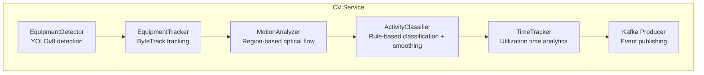
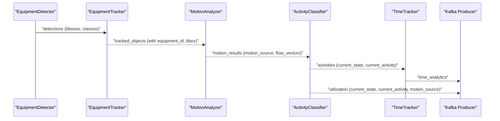
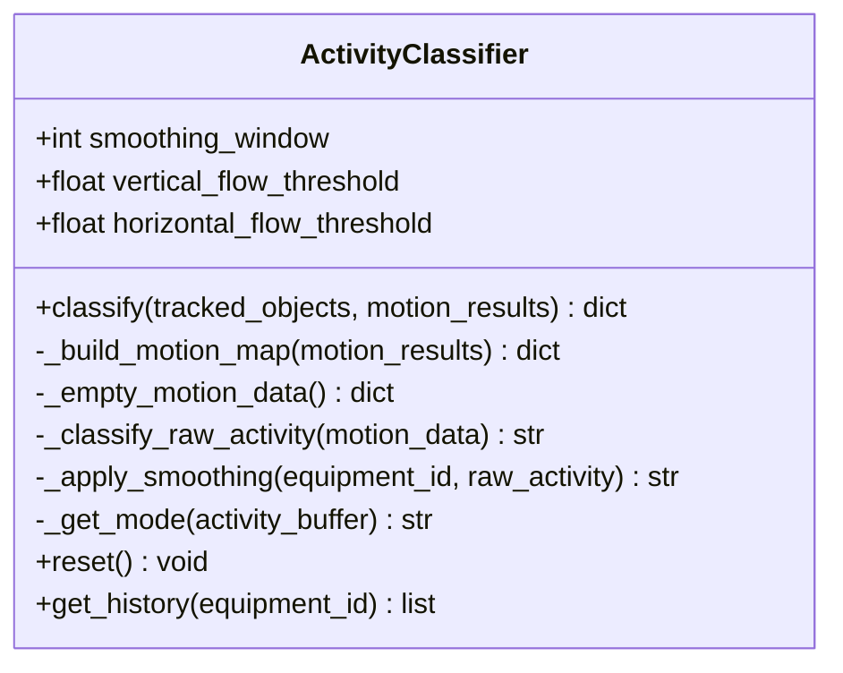
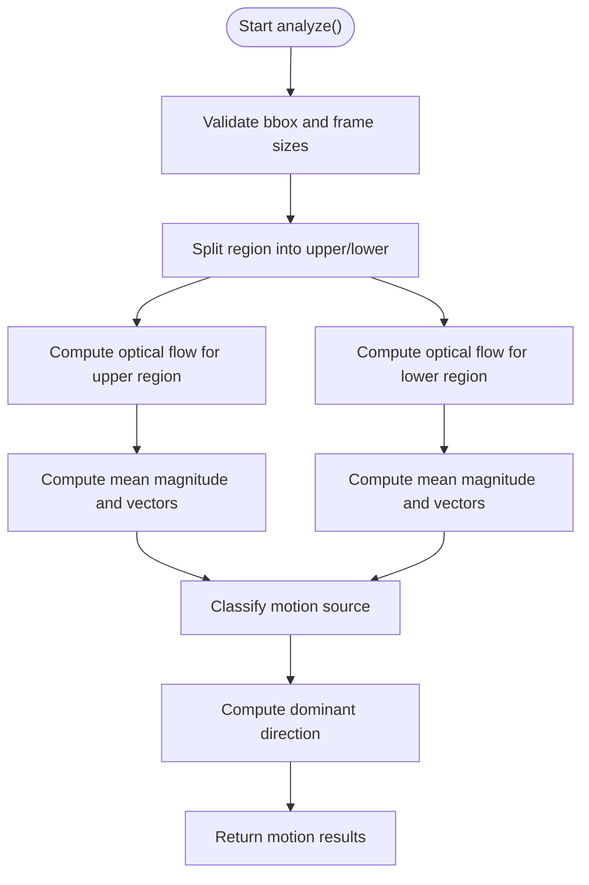
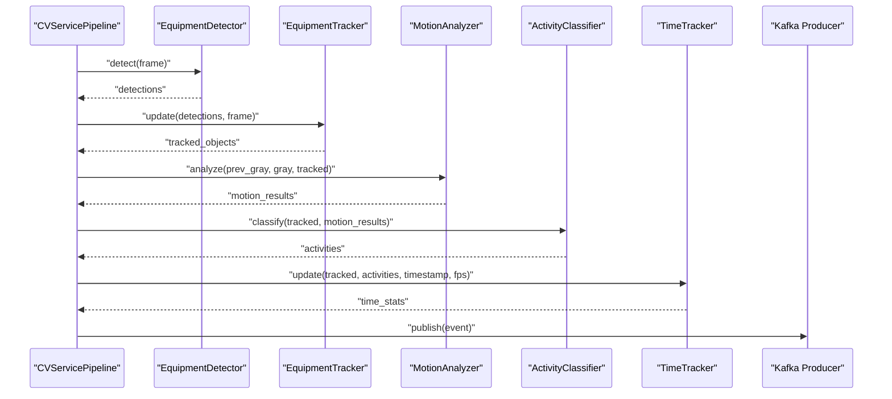
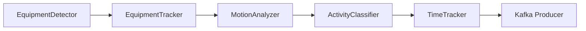

# Activity Classification

<cite>
**Referenced Files in This Document**
- [activity_classifier.py](file://services/cv_service/src/activity_classifier.py)
- [motion_analyzer.py](file://services/cv_service/src/motion_analyzer.py)
- [tracker.py](file://services/cv_service/src/tracker.py)
- [main.py](file://services/cv_service/src/main.py)
- [time_tracker.py](file://services/cv_service/src/time_tracker.py)
- [settings.yaml](file://config/settings.yaml)
- [test_activity_classifier.py](file://tests/test_activity_classifier.py)
</cite>

## Table of Contents
1. [Introduction](#introduction)
2. [Project Structure](#project-structure)
3. [Core Components](#core-components)
4. [Architecture Overview](#architecture-overview)
5. [Detailed Component Analysis](#detailed-component-analysis)
6. [Dependency Analysis](#dependency-analysis)
7. [Performance Considerations](#performance-considerations)
8. [Troubleshooting Guide](#troubleshooting-guide)
9. [Conclusion](#conclusion)

## Introduction
This document explains the Activity Classification component responsible for rule-based equipment activity categorization. It covers the ActivityClassifier class, the underlying motion analysis that informs classification, and the integration with tracking, time analytics, and event publishing. The focus is on:
- Activity categories and rule-based classification logic
- N-frame smoothing to reduce flickering
- Configuration options for thresholds and temporal windows
- Practical examples of detection scenarios, conflict resolution, and ambiguous motion handling
- Balance between simplicity and accuracy, adaptation to different equipment types, and integration with utilization tracking systems

## Project Structure
The Activity Classification pipeline is part of the Computer Vision (CV) service and integrates with detection, tracking, motion analysis, time tracking, and Kafka publishing.

**Diagram sources**
- [main.py:323-372](file://services/cv_service/src/main.py#L323-L372)
- [activity_classifier.py:23-125](file://services/cv_service/src/activity_classifier.py#L23-L125)
- [motion_analyzer.py:24-166](file://services/cv_service/src/motion_analyzer.py#L24-L166)
- [tracker.py:19-264](file://services/cv_service/src/tracker.py#L19-L264)
- [time_tracker.py:21-120](file://services/cv_service/src/time_tracker.py#L21-L120)

**Section sources**
- [main.py:104-142](file://services/cv_service/src/main.py#L104-L142)
- [settings.yaml:31-39](file://config/settings.yaml#L31-L39)

## Core Components
- ActivityClassifier: Implements rule-based activity classification and N-frame smoothing.
- MotionAnalyzer: Computes region-based optical flow to determine motion source and dominant direction.
- EquipmentTracker: Provides persistent equipment identities across frames.
- TimeTracker: Aggregates utilization metrics from activity states.
- Kafka Producer: Publishes structured events for downstream analytics.

Key configuration parameters:
- activity.smoothing_window: Number of frames for smoothing mode selection
- activity.vertical_flow_threshold: Vertical motion threshold for upward/downward classification
- activity.horizontal_flow_threshold: Horizontal motion threshold for swinging/loading
- motion.magnitude_threshold: Minimum optical flow magnitude to consider motion
- motion.upper_region_ratio: Fraction of bounding box height for upper (arm/boom) region
- motion.flow_method: Optical flow algorithm (default Farneback)

**Section sources**
- [activity_classifier.py:46-69](file://services/cv_service/src/activity_classifier.py#L46-L69)
- [motion_analyzer.py:59-86](file://services/cv_service/src/motion_analyzer.py#L59-L86)
- [settings.yaml:36-39](file://config/settings.yaml#L36-L39)
- [settings.yaml:31-34](file://config/settings.yaml#L31-L34)

## Architecture Overview
The classification workflow proceeds from tracked equipment and motion analysis results to activity determination and state transitions, then to utilization analytics and event publishing.

**Diagram sources**
- [main.py:345-372](file://services/cv_service/src/main.py#L345-L372)
- [activity_classifier.py:71-125](file://services/cv_service/src/activity_classifier.py#L71-L125)
- [motion_analyzer.py:88-166](file://services/cv_service/src/motion_analyzer.py#L88-L166)
- [time_tracker.py:53-120](file://services/cv_service/src/time_tracker.py#L53-L120)

## Detailed Component Analysis

### ActivityClassifier
The ActivityClassifier performs rule-based classification of equipment activity using motion analysis results and applies N-frame smoothing to stabilize state transitions.

- Activity categories:
  - DIGGING: arm_only motion with dominant downward vertical flow
  - SWINGING_LOADING: horizontal motion (arm_only or full_body); default for general active movement
  - DUMPING: arm_only motion with dominant upward vertical flow
  - WAITING: no significant motion detected

- Rule-based classification logic:
  - Uses motion_source and flow_vectors (upper_mean_dx/dy or averaged full-body vectors)
  - Compares absolute horizontal and vertical flow against thresholds
  - Resolves ambiguous cases by preferring horizontal dominance for SWINGING_LOADING

- N-frame smoothing:
  - Maintains a deque per equipment_id with a fixed-size window
  - Returns the mode (most frequent) activity; ties favor the most recent classification
  - Initializes buffer with the first classification to avoid immediate flips

- Output structure:
  - current_state: ACTIVE or INACTIVE derived from current_activity
  - current_activity: DIGGING, SWINGING_LOADING, DUMPING, or WAITING
  - motion_source: "arm_only", "full_body", or "none"

**Diagram sources**
- [activity_classifier.py:23-306](file://services/cv_service/src/activity_classifier.py#L23-L306)

**Section sources**
- [activity_classifier.py:36-44](file://services/cv_service/src/activity_classifier.py#L36-L44)
- [activity_classifier.py:166-231](file://services/cv_service/src/activity_classifier.py#L166-L231)
- [activity_classifier.py:233-286](file://services/cv_service/src/activity_classifier.py#L233-L286)

### MotionAnalyzer
The MotionAnalyzer computes region-based optical flow to distinguish articulated motion from whole-machine travel.

- Region splitting:
  - Upper region: top fraction of the bounding box (arm/boom)
  - Lower region: bottom fraction (tracks/base)
- Optical flow computation:
  - Uses Farneback dense optical flow with tuned parameters
  - Computes mean magnitude and mean flow vectors per region
- Motion classification:
  - "arm_only": only upper region moving
  - "full_body": both regions moving (or lower region moving alone, treated as full_body)
  - "none": neither region moving
- Dominant direction:
  - Determined from the region with higher motion magnitude
  - Axis-aligned directions: up, down, left, right, none

**Diagram sources**
- [motion_analyzer.py:88-251](file://services/cv_service/src/motion_analyzer.py#L88-L251)

**Section sources**
- [motion_analyzer.py:192-251](file://services/cv_service/src/motion_analyzer.py#L192-L251)
- [motion_analyzer.py:324-355](file://services/cv_service/src/motion_analyzer.py#L324-L355)
- [motion_analyzer.py:357-417](file://services/cv_service/src/motion_analyzer.py#L357-L417)

### Integration with Tracking and Pipeline
- EquipmentTracker assigns persistent equipment_id to tracked detections and maintains consistent identities across frames.
- The pipeline orchestrator composes detection, tracking, motion analysis, classification, time tracking, and publishing.

**Diagram sources**
- [main.py:323-372](file://services/cv_service/src/main.py#L323-L372)
- [tracker.py:159-264](file://services/cv_service/src/tracker.py#L159-L264)
- [time_tracker.py:53-120](file://services/cv_service/src/time_tracker.py#L53-L120)

**Section sources**
- [main.py:345-372](file://services/cv_service/src/main.py#L345-L372)
- [tracker.py:19-84](file://services/cv_service/src/tracker.py#L19-L84)

### Practical Examples and Scenarios
- DIGGING: arm_only motion with positive vertical flow exceeding vertical_flow_threshold
- SWINGING_LOADING: horizontal motion exceeding horizontal_flow_threshold; applies to arm_only or full_body
- DUMPING: arm_only motion with negative vertical flow below -vertical_flow_threshold
- WAITING: motion_source is "none" or insufficient motion to meet thresholds
- Ambiguous motion: When both axes exceed thresholds, the classifier prefers the axis with greater dominance; otherwise falls back to SWINGING_LOADING for full_body with motion
- Rule conflicts: The classifier prioritizes vertical motion for arm_only activities (DIGGING/DUMPING) over horizontal motion; horizontal dominates otherwise

These behaviors are validated by unit tests covering classification rules, smoothing, and result formatting.

**Section sources**
- [test_activity_classifier.py:51-130](file://tests/test_activity_classifier.py#L51-L130)
- [test_activity_classifier.py:441-543](file://tests/test_activity_classifier.py#L441-L543)

### Configuration Options
- Activity classification thresholds and smoothing:
  - smoothing_window: Controls N-frame smoothing window size
  - vertical_flow_threshold: Minimum vertical flow magnitude for upward/downward classification
  - horizontal_flow_threshold: Minimum horizontal flow magnitude for horizontal classification
- Motion analysis parameters:
  - magnitude_threshold: Minimum optical flow magnitude to consider motion
  - upper_region_ratio: Fraction of bounding box height for upper region
  - flow_method: Optical flow algorithm (default Farneback)

These parameters are loaded from the YAML configuration and passed to the respective components during initialization.

**Section sources**
- [settings.yaml:36-39](file://config/settings.yaml#L36-L39)
- [settings.yaml:31-34](file://config/settings.yaml#L31-L34)
- [activity_classifier.py:46-59](file://services/cv_service/src/activity_classifier.py#L46-L59)
- [motion_analyzer.py:59-76](file://services/cv_service/src/motion_analyzer.py#L59-L76)

### Handling Ambiguity and Smoothing
- Ambiguity resolution:
  - For full_body motion, the classifier averages upper and lower flow vectors before applying thresholds
  - Dominant direction is determined by the region with higher motion magnitude
- Smoothing:
  - Mode-based smoothing prevents rapid state flickering by selecting the most frequent activity over the last N frames
  - Tie-breaking favors the most recent classification
  - New equipment is initialized with a buffer filled by the first classification

**Section sources**
- [activity_classifier.py:233-286](file://services/cv_service/src/activity_classifier.py#L233-L286)
- [test_activity_classifier.py:219-290](file://tests/test_activity_classifier.py#L219-L290)

### Integration with Utilization Tracking
- TimeTracker aggregates utilization metrics from activity states:
  - total_tracked_seconds: Accumulates per-frame time deltas
  - total_active_seconds: Incremented when current_state is ACTIVE
  - total_idle_seconds: Incremented when current_state is INACTIVE
  - utilization_percent: Ratio of active time to total tracked time
- The pipeline builds events that include both activity classification and time analytics for downstream consumption.

**Section sources**
- [time_tracker.py:53-120](file://services/cv_service/src/time_tracker.py#L53-L120)
- [main.py:270-321](file://services/cv_service/src/main.py#L270-L321)

## Dependency Analysis
The ActivityClassifier depends on MotionAnalyzer outputs and operates independently of detection and tracking, while the pipeline orchestrator coordinates all stages.

**Diagram sources**
- [main.py:104-142](file://services/cv_service/src/main.py#L104-L142)
- [activity_classifier.py:71-125](file://services/cv_service/src/activity_classifier.py#L71-L125)
- [motion_analyzer.py:88-166](file://services/cv_service/src/motion_analyzer.py#L88-L166)
- [time_tracker.py:53-120](file://services/cv_service/src/time_tracker.py#L53-L120)

**Section sources**
- [main.py:323-372](file://services/cv_service/src/main.py#L323-L372)

## Performance Considerations
- Frame skipping: The pipeline skips frames to reduce computational load; this affects time delta calculations and smoothing effectiveness.
- Optical flow parameters: Tuned Farneback parameters balance accuracy and speed for construction equipment motion.
- Smoothing window: Larger windows increase stability but may delay state transitions; tune based on equipment dynamics and acceptable latency.
- Thresholds: Adjust vertical and horizontal thresholds to minimize false positives in varying lighting and motion conditions.

[No sources needed since this section provides general guidance]

## Troubleshooting Guide
Common issues and resolutions:
- No motion detected:
  - Verify magnitude_threshold and upper_region_ratio are appropriate for the equipment and scene
  - Ensure bounding boxes are valid and sufficiently large for reliable optical flow
- Frequent state flickering:
  - Increase smoothing_window to smooth out noise
  - Review thresholds to avoid borderline classifications
- Misclassification of arm-only vs full-body:
  - Confirm motion_source classification aligns with expected equipment behavior
  - Adjust thresholds to reflect typical motion amplitudes for the equipment type
- Missing or misaligned motion data:
  - ActivityClassifier gracefully handles missing motion data by defaulting to WAITING
  - Ensure motion results are provided in the expected format (list or dict keyed by equipment_id)

**Section sources**
- [activity_classifier.py:127-151](file://services/cv_service/src/activity_classifier.py#L127-L151)
- [test_activity_classifier.py:355-389](file://tests/test_activity_classifier.py#L355-L389)
- [motion_analyzer.py:134-166](file://services/cv_service/src/motion_analyzer.py#L134-L166)

## Conclusion
The Activity Classification component provides a robust, rule-based approach to categorizing equipment activity using region-based optical flow and N-frame smoothing. Its integration with tracking, motion analysis, time analytics, and event publishing enables accurate utilization monitoring. Proper configuration of thresholds and smoothing parameters, along with awareness of equipment-specific motion patterns, ensures reliable operation across diverse construction environments.