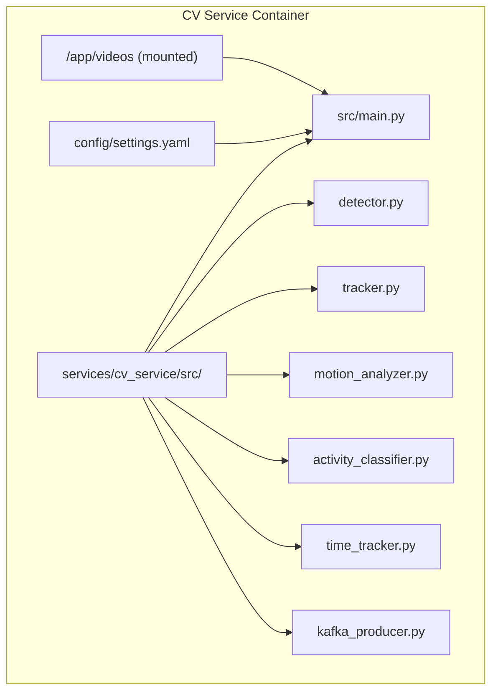
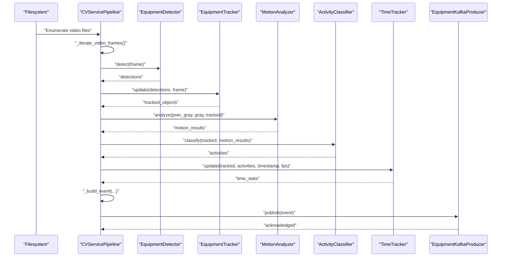
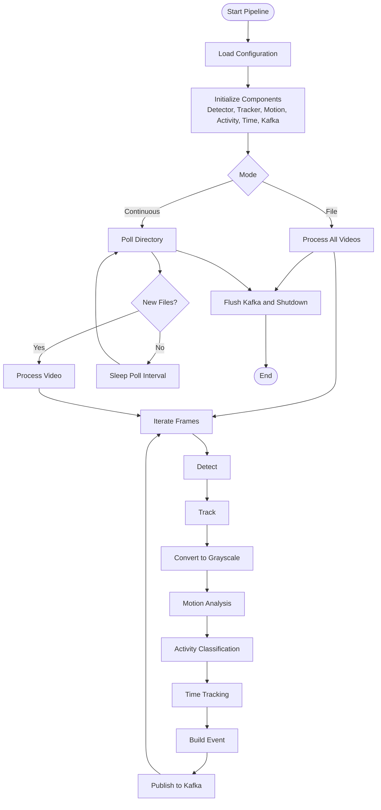
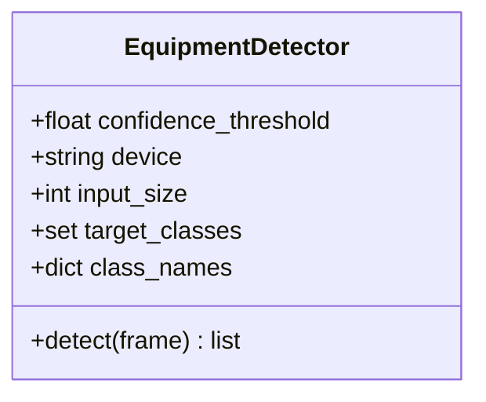
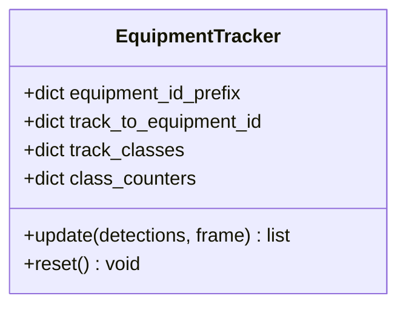
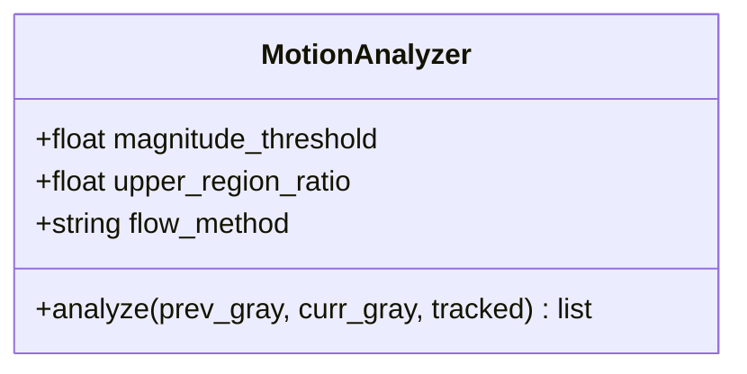
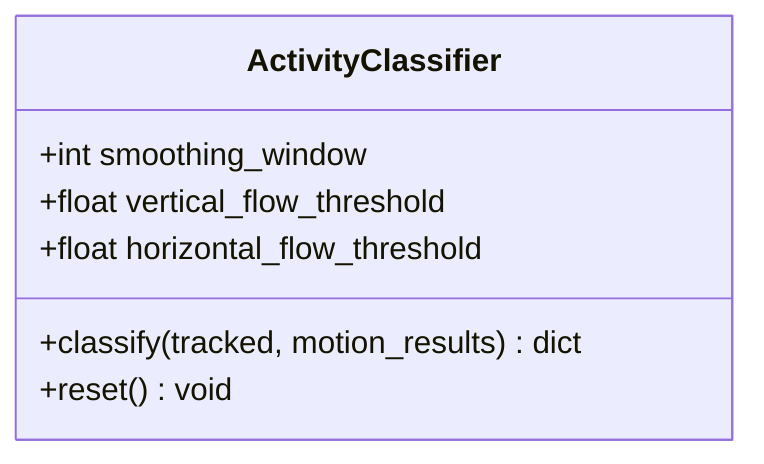
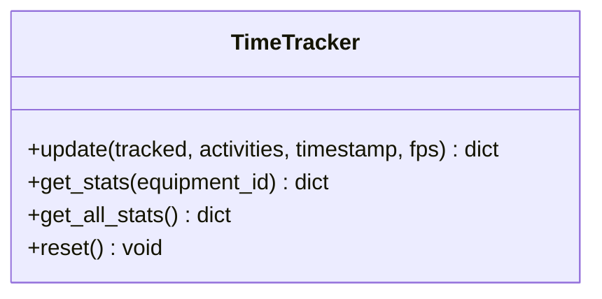
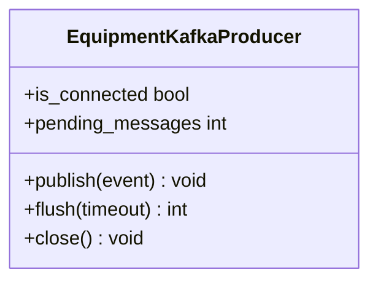
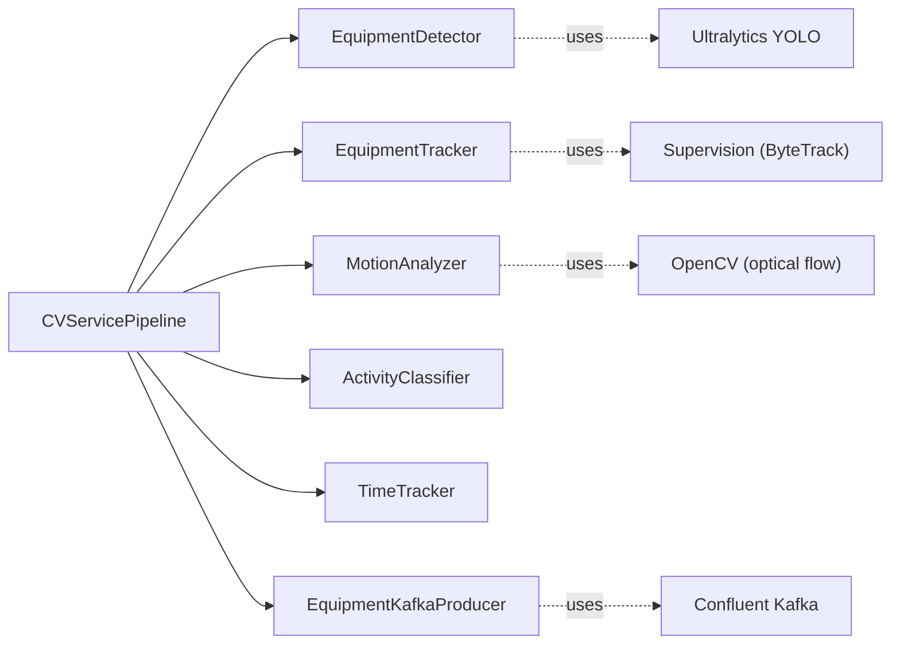

# CV Service

<cite>
**Referenced Files in This Document**
- [main.py](file://services/cv_service/src/main.py)
- [detector.py](file://services/cv_service/src/detector.py)
- [tracker.py](file://services/cv_service/src/tracker.py)
- [motion_analyzer.py](file://services/cv_service/src/motion_analyzer.py)
- [activity_classifier.py](file://services/cv_service/src/activity_classifier.py)
- [time_tracker.py](file://services/cv_service/src/time_tracker.py)
- [kafka_producer.py](file://services/cv_service/src/kafka_producer.py)
- [settings.yaml](file://config/settings.yaml)
- [Dockerfile](file://services/cv_service/Dockerfile)
- [requirements.txt](file://services/cv_service/requirements.txt)
- [docker-compose.yml](file://docker-compose.yml)
- [test_detector.py](file://tests/test_detector.py)
- [test_motion_analyzer.py](file://tests/test_motion_analyzer.py)
- [test_activity_classifier.py](file://tests/test_activity_classifier.py)
- [test_time_tracker.py](file://tests/test_time_tracker.py)
</cite>

## Table of Contents
1. [Introduction](#introduction)
2. [Project Structure](#project-structure)
3. [Core Components](#core-components)
4. [Architecture Overview](#architecture-overview)
5. [Detailed Component Analysis](#detailed-component-analysis)
6. [Dependency Analysis](#dependency-analysis)
7. [Performance Considerations](#performance-considerations)
8. [Troubleshooting Guide](#troubleshooting-guide)
9. [Conclusion](#conclusion)
10. [Appendices](#appendices)

## Introduction
This document describes the CV Service microservice responsible for orchestrating a complete computer vision pipeline that detects equipment in video, tracks it across frames, analyzes motion, classifies activities, tracks utilization over time, and publishes standardized events to Kafka for downstream analytics. The service supports two processing modes:
- File mode: Batch-process all videos in an input directory and exit.
- Continuous mode: Watch an input directory and continuously process newly added videos.

The pipeline is modular, enabling independent development and testing of each stage, and is designed for robust operation with graceful shutdown, logging, and resource cleanup.

## Project Structure
The CV Service resides under services/cv_service and exposes a single entrypoint that wires together all pipeline stages. Configuration is externalized via YAML, and the service runs inside a container with dependencies installed from requirements.txt.

**Diagram sources**
- [main.py:1-571](file://services/cv_service/src/main.py#L1-L571)
- [settings.yaml:1-59](file://config/settings.yaml#L1-L59)
- [Dockerfile:1-23](file://services/cv_service/Dockerfile#L1-L23)

**Section sources**
- [main.py:1-571](file://services/cv_service/src/main.py#L1-L571)
- [settings.yaml:1-59](file://config/settings.yaml#L1-L59)
- [Dockerfile:1-23](file://services/cv_service/Dockerfile#L1-L23)
- [requirements.txt:1-7](file://services/cv_service/requirements.txt#L1-L7)
- [docker-compose.yml:51-63](file://docker-compose.yml#L51-L63)

## Core Components
The CV Service orchestrates six core components:
- EquipmentDetector: Runs YOLOv8 inference to detect target equipment classes.
- EquipmentTracker: Assigns persistent IDs and tracks objects across frames using ByteTrack.
- MotionAnalyzer: Computes region-based optical flow to distinguish articulated arm motion from full-body travel.
- ActivityClassifier: Applies rule-based classification with smoothing to derive activities like DIGGING, SWINGING_LOADING, DUMPING, and WAITING.
- TimeTracker: Accumulates active/idle time per equipment and computes utilization percentages.
- EquipmentKafkaProducer: Serializes events and publishes them to Kafka topics.

These components are initialized by CVServicePipeline and wired together in the frame processing loop.

**Section sources**
- [main.py:42-142](file://services/cv_service/src/main.py#L42-L142)
- [detector.py:18-84](file://services/cv_service/src/detector.py#L18-L84)
- [tracker.py:19-84](file://services/cv_service/src/tracker.py#L19-L84)
- [motion_analyzer.py:24-87](file://services/cv_service/src/motion_analyzer.py#L24-L87)
- [activity_classifier.py:23-69](file://services/cv_service/src/activity_classifier.py#L23-L69)
- [time_tracker.py:21-51](file://services/cv_service/src/time_tracker.py#L21-L51)
- [kafka_producer.py:17-69](file://services/cv_service/src/kafka_producer.py#L17-L69)

## Architecture Overview
The CV Service pipeline is a linear, frame-by-frame processor that transforms raw video into structured events. The diagram below maps the actual code modules and their interactions.

**Diagram sources**
- [main.py:184-421](file://services/cv_service/src/main.py#L184-L421)
- [detector.py:85-170](file://services/cv_service/src/detector.py#L85-L170)
- [tracker.py:159-265](file://services/cv_service/src/tracker.py#L159-L265)
- [motion_analyzer.py:88-167](file://services/cv_service/src/motion_analyzer.py#L88-L167)
- [activity_classifier.py:71-126](file://services/cv_service/src/activity_classifier.py#L71-L126)
- [time_tracker.py:53-121](file://services/cv_service/src/time_tracker.py#L53-L121)
- [kafka_producer.py:91-169](file://services/cv_service/src/kafka_producer.py#L91-L169)

## Detailed Component Analysis

### CVServicePipeline: Orchestration and Modes
- Initialization:
  - Loads configuration from YAML with fallback search paths.
  - Initializes all pipeline components and Kafka producer.
  - Sets up signal handlers for SIGTERM/SIGINT to enable graceful shutdown.
- Processing modes:
  - File mode: Enumerates all video files and processes each to completion.
  - Continuous mode: Periodically polls the input directory, processes new files, and continues waiting.
- Frame processing:
  - Iterates frames with optional frame skipping and resizing.
  - Converts frames to grayscale for motion analysis.
  - Executes the full pipeline: detection → tracking → motion analysis → activity classification → time tracking → event building → Kafka publishing.
- Shutdown:
  - Signals are handled to stop processing cleanly.
  - Kafka producer is flushed and closed.

**Diagram sources**
- [main.py:42-498](file://services/cv_service/src/main.py#L42-L498)

**Section sources**
- [main.py:42-498](file://services/cv_service/src/main.py#L42-L498)

### EquipmentDetector: YOLOv8-based Equipment Detection
- Validates configuration keys and loads the YOLOv8 model.
- Filters detections by target classes and confidence threshold.
- Returns detection dictionaries with bounding boxes, confidence, class ID, and class name.

**Diagram sources**
- [detector.py:18-84](file://services/cv_service/src/detector.py#L18-L84)
- [detector.py:85-170](file://services/cv_service/src/detector.py#L85-L170)

**Section sources**
- [detector.py:18-170](file://services/cv_service/src/detector.py#L18-L170)

### EquipmentTracker: Multi-Object Tracking with ByteTrack
- Uses supervision’s ByteTrack to associate detections across frames.
- Generates persistent equipment IDs with class-specific prefixes.
- Provides mapping from internal track IDs to friendly equipment IDs.

**Diagram sources**
- [tracker.py:19-84](file://services/cv_service/src/tracker.py#L19-L84)
- [tracker.py:159-265](file://services/cv_service/src/tracker.py#L159-L265)

**Section sources**
- [tracker.py:19-341](file://services/cv_service/src/tracker.py#L19-L341)

### MotionAnalyzer: Region-Based Optical Flow
- Splits each tracked object’s bounding box into upper and lower regions.
- Computes optical flow separately for each region using Farneback.
- Classifies motion source as full_body, arm_only, or none.
- Determines dominant direction based on the region with higher motion magnitude.

**Diagram sources**
- [motion_analyzer.py:24-87](file://services/cv_service/src/motion_analyzer.py#L24-L87)
- [motion_analyzer.py:88-167](file://services/cv_service/src/motion_analyzer.py#L88-L167)

**Section sources**
- [motion_analyzer.py:24-442](file://services/cv_service/src/motion_analyzer.py#L24-L442)

### ActivityClassifier: Rule-Based Activity Classification
- Applies rules to motion results to classify activities:
  - DIGGING: arm_only with downward motion.
  - DUMPING: arm_only with upward motion.
  - SWINGING_LOADING: horizontal motion (includes full_body).
  - WAITING: no motion.
- Uses N-frame smoothing to reduce flickering between states.

**Diagram sources**
- [activity_classifier.py:23-69](file://services/cv_service/src/activity_classifier.py#L23-L69)
- [activity_classifier.py:71-126](file://services/cv_service/src/activity_classifier.py#L71-L126)

**Section sources**
- [activity_classifier.py:23-306](file://services/cv_service/src/activity_classifier.py#L23-L306)

### TimeTracker: Utilization Metrics
- Tracks cumulative time per equipment: total_tracked_seconds, total_active_seconds, total_idle_seconds.
- Computes utilization_percent as total_active_seconds / total_tracked_seconds.
- Persists statistics across frame gaps and supports aggregate totals.

**Diagram sources**
- [time_tracker.py:21-51](file://services/cv_service/src/time_tracker.py#L21-L51)
- [time_tracker.py:53-121](file://services/cv_service/src/time_tracker.py#L53-L121)

**Section sources**
- [time_tracker.py:21-265](file://services/cv_service/src/time_tracker.py#L21-L265)

### EquipmentKafkaProducer: Event Streaming
- Serializes events to JSON and publishes to Kafka with equipment_id as partition key.
- Implements delivery callbacks, buffering, retry/backoff, and graceful flush/close.

**Diagram sources**
- [kafka_producer.py:17-69](file://services/cv_service/src/kafka_producer.py#L17-L69)
- [kafka_producer.py:91-169](file://services/cv_service/src/kafka_producer.py#L91-L169)

**Section sources**
- [kafka_producer.py:17-228](file://services/cv_service/src/kafka_producer.py#L17-L228)

## Dependency Analysis
- Internal dependencies:
  - CVServicePipeline depends on all five processing modules and the Kafka producer.
  - Each stage depends only on the preceding stage’s outputs, maintaining modularity.
- External dependencies:
  - Computer vision: OpenCV, Ultralytics YOLO, supervision.
  - Streaming: Confluent Kafka Python client.
  - Configuration: PyYAML.
- Deployment:
  - Dockerfile installs system and Python dependencies and mounts config and videos directories.

**Diagram sources**
- [main.py:24-29](file://services/cv_service/src/main.py#L24-L29)
- [requirements.txt:1-7](file://services/cv_service/requirements.txt#L1-L7)

**Section sources**
- [main.py:24-29](file://services/cv_service/src/main.py#L24-L29)
- [requirements.txt:1-7](file://services/cv_service/requirements.txt#L1-L7)
- [Dockerfile:6-14](file://services/cv_service/Dockerfile#L6-L14)

## Performance Considerations
- Frame skipping and resizing:
  - The pipeline skips frames and resizes to balance throughput and accuracy.
  - Effective FPS is computed as base FPS divided by frame_skip.
- Model and device selection:
  - The detector uses a lightweight model and CPU by default; adjust device and input_size for performance.
- Motion analysis:
  - Region-based optical flow reduces noise by focusing on relevant parts of tracked objects.
- Kafka batching:
  - Producer settings enable batching and linger to improve throughput.

Practical tips:
- Increase frame_skip for long videos to reduce CPU load.
- Tune magnitude_threshold and thresholds in motion and activity configs to reduce false positives.
- Ensure Kafka brokers are reachable and tune linger.ms and batch.size for your workload.

[No sources needed since this section provides general guidance]

## Troubleshooting Guide
Common issues and resolutions:
- Missing configuration file:
  - The pipeline searches multiple locations and raises a clear error if not found.
- Detector model load failures:
  - Ensure the model path is correct and accessible; check device availability.
- Video directory not found:
  - The pipeline logs a warning and continues; mount the correct directory.
- Frame iteration errors:
  - Video capture failures are logged; verify video integrity and permissions.
- Kafka connectivity:
  - Producer initialization errors are raised; confirm broker addresses and network access.
- Graceful shutdown:
  - SIGTERM/SIGINT triggers shutdown; Kafka is flushed and closed.

Operational checks:
- Verify docker-compose health checks for Kafka and Zookeeper.
- Confirm volumes for config and videos are mounted correctly.
- Inspect logs for “Received signal” and “Shutting down” to confirm clean termination.

**Section sources**
- [main.py:69-102](file://services/cv_service/src/main.py#L69-L102)
- [main.py:149-160](file://services/cv_service/src/main.py#L149-L160)
- [main.py:161-183](file://services/cv_service/src/main.py#L161-L183)
- [main.py:200-204](file://services/cv_service/src/main.py#L200-L204)
- [kafka_producer.py:59-69](file://services/cv_service/src/kafka_producer.py#L59-L69)
- [docker-compose.yml:1-95](file://docker-compose.yml#L1-L95)

## Conclusion
The CV Service provides a robust, modular pipeline for equipment detection, tracking, motion analysis, activity classification, and time tracking, culminating in Kafka event publishing. Its design supports independent development and testing of each stage, offers two processing modes for diverse workloads, and includes comprehensive logging, error handling, and graceful shutdown. With proper configuration and deployment, it integrates seamlessly into a broader analytics ecosystem.

[No sources needed since this section summarizes without analyzing specific files]

## Appendices

### Configuration Management
Key configuration areas and their roles:
- video: frame_skip, resize_width, input_dir
- detection: model, confidence_threshold, device, input_size, target_classes, class_names
- tracking: track_thresh, track_buffer, match_thresh, equipment_id_prefix
- motion: magnitude_threshold, upper_region_ratio, flow_method
- activity: smoothing_window, vertical_flow_threshold, horizontal_flow_threshold
- kafka: bootstrap_servers, topic, client_id, consumer_group
- database and dashboard: auxiliary services’ configuration

**Section sources**
- [settings.yaml:1-59](file://config/settings.yaml#L1-L59)
- [main.py:69-142](file://services/cv_service/src/main.py#L69-L142)

### Logging Strategies
- Centralized logging configuration sets level and format.
- Modules log warnings for recoverable issues (e.g., empty frames, missing directories).
- Info logs indicate lifecycle events (initialization, processing progress, shutdown).
- Error logs include exception details for debugging.

**Section sources**
- [main.py:31-39](file://services/cv_service/src/main.py#L31-L39)
- [detector.py:116-126](file://services/cv_service/src/detector.py#L116-L126)
- [tracker.py:205-210](file://services/cv_service/src/tracker.py#L205-L210)
- [motion_analyzer.py:291-293](file://services/cv_service/src/motion_analyzer.py#L291-L293)
- [activity_classifier.py:106-108](file://services/cv_service/src/activity_classifier.py#L106-L108)
- [time_tracker.py:114-118](file://services/cv_service/src/time_tracker.py#L114-L118)
- [kafka_producer.py:80-90](file://services/cv_service/src/kafka_producer.py#L80-L90)

### Error Handling Patterns
- Validation-first initialization with explicit exceptions for missing keys or invalid ranges.
- Defensive checks for empty inputs and invalid bounding boxes.
- Graceful degradation: empty results returned when inference fails or frames are invalid.
- Producer-side buffering and retry/backoff with delivery callbacks.

**Section sources**
- [detector.py:54-60](file://services/cv_service/src/detector.py#L54-L60)
- [motion_analyzer.py:77-82](file://services/cv_service/src/motion_analyzer.py#L77-L82)
- [tracker.py:192-195](file://services/cv_service/src/tracker.py#L192-L195)
- [motion_analyzer.py:134-139](file://services/cv_service/src/motion_analyzer.py#L134-L139)
- [kafka_producer.py:153-169](file://services/cv_service/src/kafka_producer.py#L153-L169)

### Resource Cleanup Procedures
- Signal handlers set a shutdown flag to stop processing loops.
- Kafka producer is flushed and closed to deliver pending messages.
- Video capture resources are released in the frame iterator.

**Section sources**
- [main.py:143-160](file://services/cv_service/src/main.py#L143-L160)
- [main.py:251-254](file://services/cv_service/src/main.py#L251-L254)
- [main.py:486-498](file://services/cv_service/src/main.py#L486-L498)
- [kafka_producer.py:193-209](file://services/cv_service/src/kafka_producer.py#L193-L209)

### Practical Examples

- Service startup:
  - File mode: python -m src.main --mode file --config /app/config/settings.yaml
  - Continuous mode: python -m src.main --mode continuous --poll-interval 5.0
  - Adjust log level with --log-level INFO/WARNING/ERROR

- Configuration options:
  - Modify settings.yaml to change detection thresholds, tracking parameters, motion sensitivity, activity smoothing, and Kafka endpoints.
  - Mount config and videos directories via docker-compose volumes.

- Operational characteristics:
  - Continuous mode polls every poll-interval seconds and processes new files.
  - Frame skipping reduces CPU load; resizing controls inference cost.
  - Kafka topic and bootstrap servers are configurable.

**Section sources**
- [main.py:500-567](file://services/cv_service/src/main.py#L500-L567)
- [settings.yaml:3-45](file://config/settings.yaml#L3-L45)
- [docker-compose.yml:58-63](file://docker-compose.yml#L58-L63)

### Testing Guidance
- Unit tests validate:
  - Detector initialization and detection correctness.
  - Motion analyzer region splitting, optical flow computation, and classification logic.
  - Activity classifier smoothing and rule-based classification.
  - Time tracker accumulation, utilization calculation, and reset behavior.
- Tests use fixtures and mocks to isolate behavior and avoid external dependencies.

**Section sources**
- [test_detector.py:18-63](file://tests/test_detector.py#L18-L63)
- [test_motion_analyzer.py:19-51](file://tests/test_motion_analyzer.py#L19-L51)
- [test_activity_classifier.py:18-41](file://tests/test_activity_classifier.py#L18-L41)
- [test_time_tracker.py:18-38](file://tests/test_time_tracker.py#L18-L38)