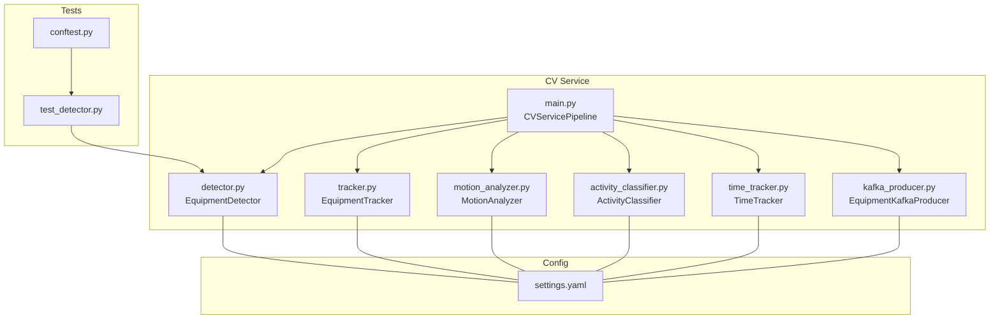
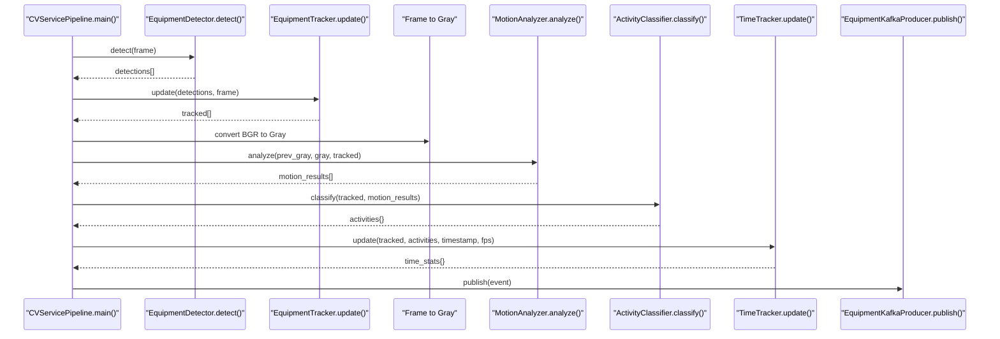
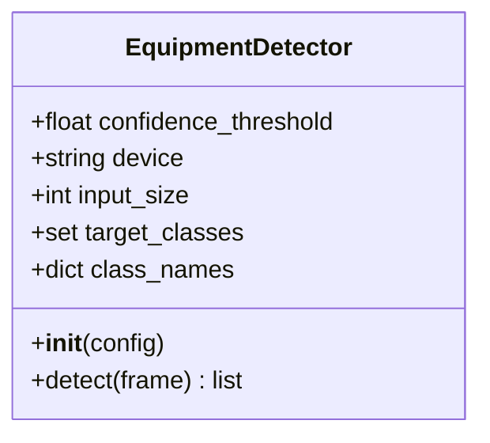
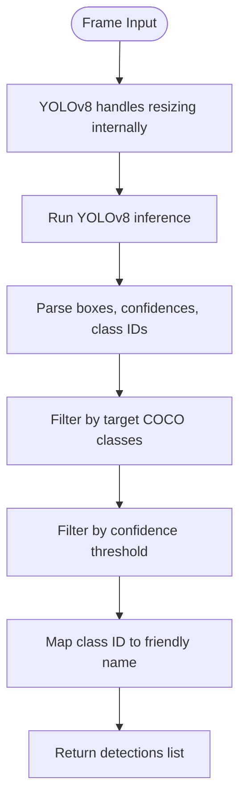
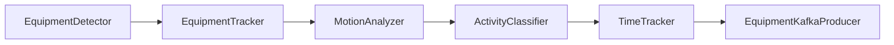
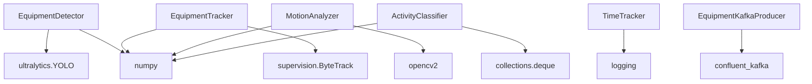

# Equipment Detection

<cite>
**Referenced Files in This Document**
- [detector.py](file://services/cv_service/src/detector.py)
- [main.py](file://services/cv_service/src/main.py)
- [settings.yaml](file://config/settings.yaml)
- [test_detector.py](file://tests/test_detector.py)
- [tracker.py](file://services/cv_service/src/tracker.py)
- [motion_analyzer.py](file://services/cv_service/src/motion_analyzer.py)
- [activity_classifier.py](file://services/cv_service/src/activity_classifier.py)
- [time_tracker.py](file://services/cv_service/src/time_tracker.py)
- [kafka_producer.py](file://services/cv_service/src/kafka_producer.py)
- [conftest.py](file://tests/conftest.py)
</cite>

## Table of Contents
1. [Introduction](#introduction)
2. [Project Structure](#project-structure)
3. [Core Components](#core-components)
4. [Architecture Overview](#architecture-overview)
5. [Detailed Component Analysis](#detailed-component-analysis)
6. [Dependency Analysis](#dependency-analysis)
7. [Performance Considerations](#performance-considerations)
8. [Troubleshooting Guide](#troubleshooting-guide)
9. [Conclusion](#conclusion)
10. [Appendices](#appendices)

## Introduction
This document explains the Equipment Detection component responsible for YOLOv8-based object detection of construction equipment (vehicles such as cars, buses, and trucks). It covers the EquipmentDetector class implementation, model initialization, COCO class filtering, detection parameter configuration, and the end-to-end inference pipeline. It also documents the detection workflow from frame preprocessing to bounding box filtering and confidence thresholding, along with configuration options, model loading strategies, performance tuning, and integration with downstream pipeline stages. Practical examples of detection result interpretation, coordinate transformations, and common optimization strategies are included.

## Project Structure
The Equipment Detection feature is part of the Computer Vision (CV) service pipeline. The relevant files are organized under services/cv_service/src, with configuration centralized in config/settings.yaml and tests under tests/.

**Diagram sources**
- [detector.py:18-170](file://services/cv_service/src/detector.py#L18-L170)
- [main.py:42-498](file://services/cv_service/src/main.py#L42-L498)
- [settings.yaml:1-59](file://config/settings.yaml#L1-L59)
- [test_detector.py:1-249](file://tests/test_detector.py#L1-L249)
- [conftest.py:1-164](file://tests/conftest.py#L1-L164)

**Section sources**
- [main.py:42-68](file://services/cv_service/src/main.py#L42-L68)
- [settings.yaml:8-20](file://config/settings.yaml#L8-L20)

## Core Components
- EquipmentDetector: Loads a YOLOv8 model and performs inference on frames, filtering detections by COCO class IDs and confidence threshold. It returns structured detection results with bounding boxes, confidence scores, and class names.
- EquipmentTracker: Assigns persistent equipment IDs to tracked objects across frames using ByteTrack via supervision, enabling downstream analytics.
- MotionAnalyzer: Computes region-based optical flow to distinguish articulated motion (e.g., excavator arm) from whole-body motion (e.g., driving), enabling accurate activity classification.
- ActivityClassifier: Applies rule-based classification with smoothing to derive activity states (e.g., DIGGING, SWINGING_LOADING, DUMPING, WAITING).
- TimeTracker: Aggregates utilization metrics (active vs idle time) per equipment over time.
- EquipmentKafkaProducer: Publishes standardized event payloads to Kafka for downstream analytics.

**Section sources**
- [detector.py:18-170](file://services/cv_service/src/detector.py#L18-L170)
- [tracker.py:19-341](file://services/cv_service/src/tracker.py#L19-L341)
- [motion_analyzer.py:24-442](file://services/cv_service/src/motion_analyzer.py#L24-L442)
- [activity_classifier.py:23-306](file://services/cv_service/src/activity_classifier.py#L23-L306)
- [time_tracker.py:21-265](file://services/cv_service/src/time_tracker.py#L21-L265)
- [kafka_producer.py:17-228](file://services/cv_service/src/kafka_producer.py#L17-L228)

## Architecture Overview
The CV pipeline orchestrator coordinates detection, tracking, motion analysis, activity classification, time tracking, and event publishing. The EquipmentDetector is the first stage, producing filtered detections that feed the tracker and subsequent stages.

**Diagram sources**
- [main.py:323-372](file://services/cv_service/src/main.py#L323-L372)
- [detector.py:85-170](file://services/cv_service/src/detector.py#L85-L170)
- [tracker.py:159-264](file://services/cv_service/src/tracker.py#L159-L264)
- [motion_analyzer.py:88-166](file://services/cv_service/src/motion_analyzer.py#L88-L166)
- [activity_classifier.py:71-125](file://services/cv_service/src/activity_classifier.py#L71-L125)
- [time_tracker.py:53-121](file://services/cv_service/src/time_tracker.py#L53-L121)
- [kafka_producer.py:91-169](file://services/cv_service/src/kafka_producer.py#L91-L169)

## Detailed Component Analysis

### EquipmentDetector
The EquipmentDetector encapsulates YOLOv8-based detection with configurable parameters and robust error handling.

- Model initialization
  - Validates required configuration keys and raises ValueError if missing.
  - Loads the YOLOv8 model from the specified path and logs device assignment.
  - Raises RuntimeError on model load failures.

- Detection pipeline
  - Accepts a BGR frame as input and returns a list of detection dictionaries.
  - Runs inference with imgsz, device, and verbose parameters.
  - Parses YOLO results to extract bounding boxes, confidences, and class IDs.
  - Filters detections by target COCO class IDs and confidence threshold.
  - Maps class IDs to friendly names and returns structured results.

- Output format
  - Each detection includes bbox (pixel coordinates), confidence, class_id, and class_name.

**Diagram sources**
- [detector.py:18-84](file://services/cv_service/src/detector.py#L18-L84)
- [detector.py:85-170](file://services/cv_service/src/detector.py#L85-L170)

**Section sources**
- [detector.py:35-84](file://services/cv_service/src/detector.py#L35-L84)
- [detector.py:114-170](file://services/cv_service/src/detector.py#L114-L170)
- [settings.yaml:8-20](file://config/settings.yaml#L8-L20)

### Detection Workflow
End-to-end detection from frame to filtered results:

**Diagram sources**
- [detector.py:114-165](file://services/cv_service/src/detector.py#L114-L165)

**Section sources**
- [detector.py:142-165](file://services/cv_service/src/detector.py#L142-L165)

### Configuration Options
Key configuration parameters for EquipmentDetector and the broader pipeline are defined in settings.yaml:

- Detection
  - model: Path to YOLOv8 weights (e.g., yolov8n.pt)
  - confidence_threshold: Minimum confidence for valid detections
  - device: Computing device ("cpu" or "cuda")
  - input_size: Input image size for inference
  - target_classes: COCO class IDs to detect (e.g., [2, 5, 7] for car, bus, truck)
  - class_names: Mapping from class IDs to friendly names

- Tracking
  - track_thresh: Detection confidence threshold for track activation
  - track_buffer: Frames to keep lost tracks alive
  - match_thresh: IOU threshold for matching detections to tracks
  - equipment_id_prefix: Prefix mapping per class and default

- Motion
  - magnitude_threshold: Minimum optical flow magnitude to consider motion
  - upper_region_ratio: Fraction of bbox height for upper region
  - flow_method: Optical flow method (e.g., farneback)

- Activity
  - smoothing_window: N-frame smoothing window
  - vertical_flow_threshold: Vertical motion threshold
  - horizontal_flow_threshold: Horizontal motion threshold

- Kafka
  - bootstrap_servers, topic, client_id, consumer_group

- Video
  - frame_skip, resize_width, input_dir

**Section sources**
- [settings.yaml:8-59](file://config/settings.yaml#L8-L59)

### Integration with Subsequent Pipeline Stages
- Detection feeds EquipmentTracker, which assigns persistent equipment IDs and maintains track-to-equipment mappings.
- Grayscale conversion enables MotionAnalyzer to compute optical flow on upper and lower regions of tracked equipment.
- ActivityClassifier applies rule-based classification with smoothing to derive activity states.
- TimeTracker aggregates utilization metrics per equipment.
- Kafka producer publishes standardized events for downstream analytics.

**Diagram sources**
- [main.py:345-372](file://services/cv_service/src/main.py#L345-L372)
- [tracker.py:159-264](file://services/cv_service/src/tracker.py#L159-L264)
- [motion_analyzer.py:88-166](file://services/cv_service/src/motion_analyzer.py#L88-L166)
- [activity_classifier.py:71-125](file://services/cv_service/src/activity_classifier.py#L71-L125)
- [time_tracker.py:53-121](file://services/cv_service/src/time_tracker.py#L53-L121)
- [kafka_producer.py:91-169](file://services/cv_service/src/kafka_producer.py#L91-L169)

**Section sources**
- [main.py:323-372](file://services/cv_service/src/main.py#L323-L372)

## Dependency Analysis
- EquipmentDetector depends on Ultralytics YOLOv8 for inference and NumPy for array operations.
- EquipmentTracker depends on supervision ByteTrack for multi-object tracking and NumPy for conversions.
- MotionAnalyzer depends on OpenCV for optical flow and NumPy for statistics.
- ActivityClassifier depends on collections.deque for smoothing and NumPy for vector operations.
- TimeTracker depends on standard typing and logging.
- EquipmentKafkaProducer depends on confluent-kafka for event publishing.

**Diagram sources**
- [detector.py:12](file://services/cv_service/src/detector.py#L12)
- [tracker.py:13](file://services/cv_service/src/tracker.py#L13)
- [motion_analyzer.py:17](file://services/cv_service/src/motion_analyzer.py#L17)
- [activity_classifier.py:16](file://services/cv_service/src/activity_classifier.py#L16)
- [time_tracker.py:14](file://services/cv_service/src/time_tracker.py#L14)
- [kafka_producer.py:12](file://services/cv_service/src/kafka_producer.py#L12)

**Section sources**
- [detector.py:12](file://services/cv_service/src/detector.py#L12)
- [tracker.py:13](file://services/cv_service/src/tracker.py#L13)
- [motion_analyzer.py:17](file://services/cv_service/src/motion_analyzer.py#L17)
- [activity_classifier.py:16](file://services/cv_service/src/activity_classifier.py#L16)
- [time_tracker.py:14](file://services/cv_service/src/time_tracker.py#L14)
- [kafka_producer.py:12](file://services/cv_service/src/kafka_producer.py#L12)

## Performance Considerations
- Model selection and device
  - Use yolov8n.pt for CPU deployments; switch to CUDA-capable models for GPU acceleration.
  - Adjust input_size to balance accuracy and speed; smaller sizes reduce inference time.

- Frame preprocessing
  - Resize frames to reduce computational load; ensure aspect ratio preservation.
  - Apply frame skipping to lower FPS and reduce CPU/GPU usage.

- Detection thresholds
  - Increase confidence_threshold to reduce false positives at the cost of recall.
  - Tune target_classes to limit unnecessary detections.

- Tracking and motion analysis
  - Adjust track_thresh and match_thresh to improve track stability.
  - Calibrate magnitude_threshold and region ratios for the specific equipment and camera setup.

- Kafka publishing
  - Tune linger.ms and batch.size for throughput; ensure acks=all for reliability.

**Section sources**
- [settings.yaml:3-6](file://config/settings.yaml#L3-L6)
- [settings.yaml:8-20](file://config/settings.yaml#L8-L20)
- [settings.yaml:21-30](file://config/settings.yaml#L21-L30)
- [settings.yaml:31-40](file://config/settings.yaml#L31-L40)
- [kafka_producer.py:40-53](file://services/cv_service/src/kafka_producer.py#L40-L53)

## Troubleshooting Guide
- Model loading failures
  - Symptom: RuntimeError during EquipmentDetector initialization.
  - Resolution: Verify model path and availability; ensure device compatibility.

- Empty or None frames
  - Symptom: No detections returned for certain frames.
  - Resolution: Validate frame inputs; handle None or empty arrays upstream.

- Missing configuration keys
  - Symptom: ValueError indicating missing required keys.
  - Resolution: Ensure all required keys are present in settings.yaml.

- Inference errors
  - Symptom: Empty detections after inference failure.
  - Resolution: Check device availability and memory constraints; retry with reduced input_size.

- False positives
  - Symptom: Non-target classes detected.
  - Resolution: Narrow target_classes; increase confidence_threshold; refine class_names mapping.

- Tracking instability
  - Symptom: Frequent ID swaps or lost tracks.
  - Resolution: Adjust track_thresh, track_buffer, and match_thresh; verify frame quality and motion conditions.

- Motion classification anomalies
  - Symptom: Incorrect motion_source classification.
  - Resolution: Calibrate magnitude_threshold and upper_region_ratio; ensure adequate lighting and motion blur.

**Section sources**
- [detector.py:54-83](file://services/cv_service/src/detector.py#L54-L83)
- [detector.py:114-125](file://services/cv_service/src/detector.py#L114-L125)
- [tracker.py:52-83](file://services/cv_service/src/tracker.py#L52-L83)
- [motion_analyzer.py:77-86](file://services/cv_service/src/motion_analyzer.py#L77-L86)
- [activity_classifier.py:56-69](file://services/cv_service/src/activity_classifier.py#L56-L69)

## Conclusion
The Equipment Detection component provides a robust, configurable pipeline for YOLOv8-based detection of construction equipment. By combining COCO class filtering, confidence thresholding, and integration with tracking, motion analysis, activity classification, and time analytics, it delivers actionable insights for equipment utilization monitoring. Proper configuration and tuning enable high accuracy and performance across diverse deployment scenarios.

## Appendices

### Practical Examples
- Interpreting detection results
  - Each detection includes bbox coordinates, confidence, class_id, and class_name. Use class_names mapping to present friendly labels.
  - Coordinate transformations: Bounding boxes are in pixel coordinates [x1, y1, x2, y2]; ensure consistent scaling if frames were resized.

- Integration with downstream stages
  - EquipmentTracker expects detection dictionaries with bbox, confidence, class_id, and class_name.
  - MotionAnalyzer requires grayscale frames and tracked objects with equipment_id and bbox.
  - ActivityClassifier consumes motion results and tracked objects to produce activity states.
  - TimeTracker accumulates utilization metrics per equipment_id.
  - Kafka producer publishes standardized event payloads with frame_id, equipment_id, equipment_class, timestamp, utilization, and time_analytics.

- Model selection criteria
  - Choose yolov8n.pt for CPU deployments; use larger models (e.g., yolov8s) for GPU acceleration when latency permits.
  - Evaluate accuracy vs. speed trade-offs with different input_size values and confidence_threshold settings.

**Section sources**
- [detector.py:96-101](file://services/cv_service/src/detector.py#L96-L101)
- [tracker.py:170-185](file://services/cv_service/src/tracker.py#L170-L185)
- [motion_analyzer.py:108-121](file://services/cv_service/src/motion_analyzer.py#L108-L121)
- [activity_classifier.py:84-90](file://services/cv_service/src/activity_classifier.py#L84-L90)
- [time_tracker.py:74-81](file://services/cv_service/src/time_tracker.py#L74-L81)
- [kafka_producer.py:95-112](file://services/cv_service/src/kafka_producer.py#L95-L112)