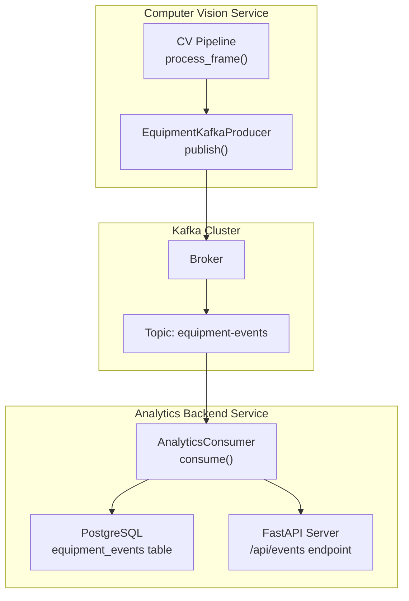
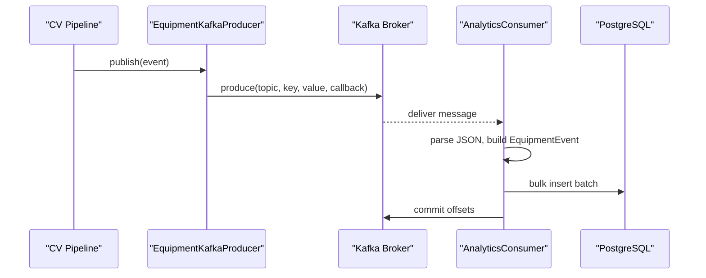
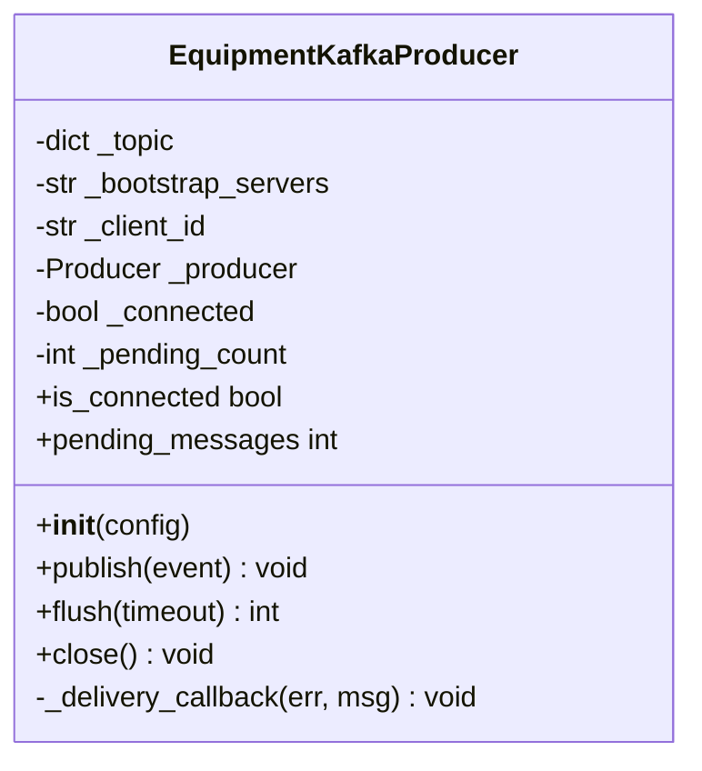
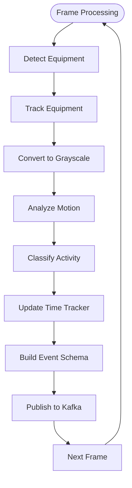
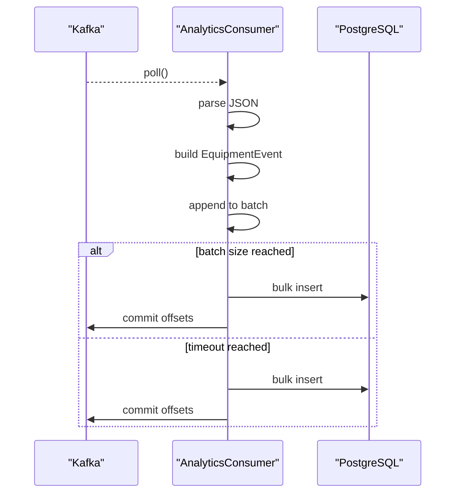
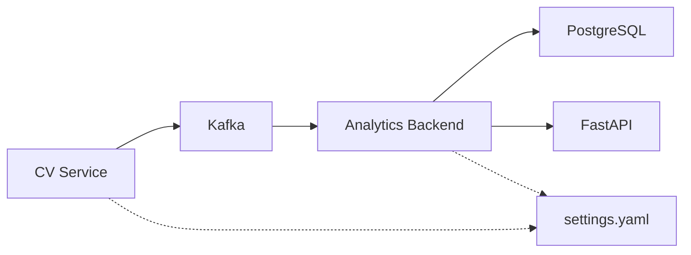

# Kafka Integration

<cite>
**Referenced Files in This Document**
- [kafka_producer.py](file://services/cv_service/src/kafka_producer.py)
- [main.py](file://services/cv_service/src/main.py)
- [settings.yaml](file://config/settings.yaml)
- [consumer.py](file://services/analytics_backend/src/consumer.py)
- [db_models.py](file://services/analytics_backend/src/db_models.py)
- [main.py](file://services/analytics_backend/src/main.py)
- [docker-compose.yml](file://docker-compose.yml)
- [requirements.txt](file://services/cv_service/requirements.txt)
- [requirements.txt](file://services/analytics_backend/requirements.txt)
</cite>

## Table of Contents
1. [Introduction](#introduction)
2. [Project Structure](#project-structure)
3. [Core Components](#core-components)
4. [Architecture Overview](#architecture-overview)
5. [Detailed Component Analysis](#detailed-component-analysis)
6. [Dependency Analysis](#dependency-analysis)
7. [Performance Considerations](#performance-considerations)
8. [Troubleshooting Guide](#troubleshooting-guide)
9. [Conclusion](#conclusion)
10. [Appendices](#appendices)

## Introduction
This document provides comprehensive technical documentation for the Kafka Integration component responsible for event streaming and message publishing in the Equipment Utilization and Activity Classification system. It focuses on the EquipmentKafkaProducer class implementation, Kafka client configuration, topic management, message serialization, and the end-to-end event publishing pipeline. It also covers configuration options, reliability considerations, message ordering, partitioning strategies, integration with the analytics backend service, and monitoring and debugging approaches.

## Project Structure
The Kafka integration spans two services:
- Computer Vision (CV) Service: Produces equipment utilization and activity events to Kafka.
- Analytics Backend Service: Consumes events from Kafka, persists them to PostgreSQL, and exposes them via a FastAPI endpoint.

**Diagram sources**
- [main.py:323-372](file://services/cv_service/src/main.py#L323-L372)
- [kafka_producer.py:91-169](file://services/cv_service/src/kafka_producer.py#L91-L169)
- [consumer.py:93-141](file://services/analytics_backend/src/consumer.py#L93-L141)
- [db_models.py:22-49](file://services/analytics_backend/src/db_models.py#L22-L49)
- [main.py:104-122](file://services/analytics_backend/src/main.py#L104-L122)

**Section sources**
- [main.py:1-571](file://services/cv_service/src/main.py#L1-L571)
- [kafka_producer.py:1-228](file://services/cv_service/src/kafka_producer.py#L1-L228)
- [consumer.py:1-268](file://services/analytics_backend/src/consumer.py#L1-L268)
- [db_models.py:1-191](file://services/analytics_backend/src/db_models.py#L1-L191)
- [settings.yaml:41-46](file://config/settings.yaml#L41-L46)
- [docker-compose.yml:1-95](file://docker-compose.yml#L1-L95)

## Core Components
- EquipmentKafkaProducer: Asynchronous Kafka producer with delivery callbacks, buffering, and retry logic. It serializes events to JSON and publishes them to the configured topic using equipment_id as the partition key.
- CVServicePipeline: Orchestrates the computer vision pipeline and builds events from processing results. It invokes EquipmentKafkaProducer.publish for each tracked equipment event.
- AnalyticsConsumer: Kafka consumer that reads events from the topic, deserializes JSON, and batches writes to PostgreSQL.
- Database Models: SQLAlchemy models and TimescaleDB setup for efficient time-series storage of equipment events.
- Configuration: Centralized YAML configuration for Kafka brokers, topic names, and consumer groups.

Key responsibilities:
- Producer: Serialization, partitioning, delivery guarantees, and error handling.
- Consumer: Deserialization, batch persistence, manual commit, and graceful shutdown.
- Pipeline: Event construction from pipeline results and publishing orchestration.

**Section sources**
- [kafka_producer.py:17-228](file://services/cv_service/src/kafka_producer.py#L17-L228)
- [main.py:270-321](file://services/cv_service/src/main.py#L270-L321)
- [consumer.py:23-244](file://services/analytics_backend/src/consumer.py#L23-L244)
- [db_models.py:22-191](file://services/analytics_backend/src/db_models.py#L22-L191)
- [settings.yaml:41-46](file://config/settings.yaml#L41-L46)

## Architecture Overview
The system follows a publish-subscribe pattern:
- CV Service publishes equipment events to Kafka with equipment_id as the partition key to ensure per-equipment ordering.
- Analytics Backend consumes events, persists them to PostgreSQL (with TimescaleDB hypertable optimization), and serves them via FastAPI.

**Diagram sources**
- [main.py:396-404](file://services/cv_service/src/main.py#L396-L404)
- [kafka_producer.py:140-149](file://services/cv_service/src/kafka_producer.py#L140-L149)
- [consumer.py:124-132](file://services/analytics_backend/src/consumer.py#L124-L132)
- [db_models.py:177-190](file://services/analytics_backend/src/db_models.py#L177-L190)

## Detailed Component Analysis

### EquipmentKafkaProducer Implementation
The EquipmentKafkaProducer encapsulates Kafka client configuration, message serialization, and delivery handling.

- Initialization and Configuration
  - Reads bootstrap_servers, topic, and client_id from configuration.
  - Sets producer configuration for reliability and performance:
    - acks: "all" for leader and in-sync replica acknowledgment.
    - retries and retry.backoff.ms for transient failures.
    - linger.ms and batch.size for batching optimization.
    - socket.timeout.ms and request.timeout.ms for connection stability.
  - Creates a confluent_kafka.Producer instance and logs initialization.

- Event Publishing Pipeline
  - Validates required fields: frame_id, equipment_id, equipment_class, timestamp.
  - Uses equipment_id as the message key to ensure per-equipment ordering.
  - Serializes the event dictionary to UTF-8 JSON bytes.
  - Asynchronously produces the message with a delivery callback.
  - Polls the producer to trigger callbacks without blocking.
  - Handles BufferError by flushing and retrying once.

- Delivery Callback and Monitoring
  - Tracks pending_count and updates it on callback invocation.
  - Logs errors with topic and key details; logs successful deliveries with partition and offset.

- Reliability and Lifecycle
  - flush(timeout): Blocks until pending messages are delivered or timeout.
  - close(): Ensures flush with generous timeout, logs remaining undelivered messages, and resets state.
  - Properties: is_connected and pending_messages for monitoring.

- Error Handling Strategies
  - Initialization failures raise exceptions with error logging.
  - Publish handles KafkaException and BufferError with warnings and retry.
  - Delivery callback logs delivery failures and successes.

**Diagram sources**
- [kafka_producer.py:17-228](file://services/cv_service/src/kafka_producer.py#L17-L228)

**Section sources**
- [kafka_producer.py:25-69](file://services/cv_service/src/kafka_producer.py#L25-L69)
- [kafka_producer.py:91-169](file://services/cv_service/src/kafka_producer.py#L91-L169)
- [kafka_producer.py:170-209](file://services/cv_service/src/kafka_producer.py#L170-L209)

### Event Building and Publishing Pipeline
The CVServicePipeline constructs events from pipeline results and publishes them to Kafka.

- Event Schema Definition
  - Frame metadata: frame_id, equipment_id, equipment_class, timestamp.
  - Utilization: current_state, current_activity, motion_source.
  - Time Analytics: total_tracked_seconds, total_active_seconds, total_idle_seconds, utilization_percent.

- Event Construction
  - process_frame(...) orchestrates detection, tracking, motion analysis, activity classification, and time tracking.
  - _build_event(...) aggregates results into the event schema, deriving current_state from activity and extracting time analytics.

- Publishing Orchestration
  - For each tracked equipment, _build_event(...) produces an event dictionary.
  - The pipeline calls EquipmentKafkaProducer.publish(event) and increments counters.
  - On completion, flush() ensures all pending messages are delivered.

**Diagram sources**
- [main.py:342-372](file://services/cv_service/src/main.py#L342-L372)
- [main.py:270-321](file://services/cv_service/src/main.py#L270-L321)

**Section sources**
- [main.py:270-321](file://services/cv_service/src/main.py#L270-L321)
- [main.py:323-372](file://services/cv_service/src/main.py#L323-L372)
- [main.py:400-410](file://services/cv_service/src/main.py#L400-L410)

### AnalyticsConsumer and Database Persistence
The AnalyticsConsumer consumes events from Kafka, deserializes them, and persists to PostgreSQL with batch optimization.

- Consumer Configuration
  - Reads bootstrap_servers, topic, and consumer_group from configuration.
  - Manual commit enabled for precise control; auto.offset.reset set to earliest.
  - Session and poll timeouts configured for robust operation.

- Message Processing
  - poll(timeout=1.0) retrieves messages; handles EOF and unknown topic conditions.
  - JSON decoding with error logging; extracts nested utilization and time_analytics fields.
  - Builds EquipmentEvent instances and appends to a batch.

- Batch Persistence and Commit
  - Commits every BATCH_SIZE (100) messages or after BATCH_TIMEOUT (5.0 seconds).
  - Uses bulk_save_objects for efficient writes; commits Kafka offsets after successful DB write.
  - Graceful shutdown flushes remaining batch and closes consumer.

**Diagram sources**
- [consumer.py:93-141](file://services/analytics_backend/src/consumer.py#L93-L141)
- [consumer.py:143-200](file://services/analytics_backend/src/consumer.py#L143-L200)
- [consumer.py:206-228](file://services/analytics_backend/src/consumer.py#L206-L228)

**Section sources**
- [consumer.py:35-78](file://services/analytics_backend/src/consumer.py#L35-L78)
- [consumer.py:93-141](file://services/analytics_backend/src/consumer.py#L93-L141)
- [consumer.py:143-200](file://services/analytics_backend/src/consumer.py#L143-L200)
- [consumer.py:206-228](file://services/analytics_backend/src/consumer.py#L206-L228)

### Database Models and TimescaleDB Setup
EquipmentEvent model stores per-frame snapshots of equipment state and utilization metrics. The system attempts to convert the table into a TimescaleDB hypertable for time-series optimization.

- Model Fields
  - Identifiers and timestamps: frame_id, equipment_id, equipment_class, timestamp.
  - State and activity: current_state, current_activity, motion_source.
  - Time analytics: total_tracked_seconds, total_active_seconds, total_idle_seconds, utilization_percent.
  - Metadata: created_at with index for efficient querying.

- TimescaleDB Hypertable
  - init_db(...) creates tables and attempts to enable TimescaleDB extension.
  - create_hypertable(...) converts equipment_events to a hypertable on created_at if not already present.

**Section sources**
- [db_models.py:22-67](file://services/analytics_backend/src/db_models.py#L22-L67)
- [db_models.py:70-100](file://services/analytics_backend/src/db_models.py#L70-L100)
- [db_models.py:103-155](file://services/analytics_backend/src/db_models.py#L103-L155)

## Dependency Analysis
- Producer Dependencies
  - confluent-kafka for asynchronous producer and error handling.
  - json for serialization; logging for observability.
  - numpy arrays are not serialized; only dictionaries are produced.

- Consumer Dependencies
  - confluent-kafka for consumer and manual commit.
  - SQLAlchemy for ORM and session management.
  - psycopg2-binary for PostgreSQL connectivity.
  - pydantic for potential data validation (not used in consumer).

- Cross-Service Dependencies
  - Both services depend on shared configuration for Kafka bootstrap_servers, topic, and consumer_group.
  - Docker Compose defines the Kafka and PostgreSQL services and their health checks.

**Diagram sources**
- [requirements.txt:1-7](file://services/cv_service/requirements.txt#L1-L7)
- [requirements.txt:1-8](file://services/analytics_backend/requirements.txt#L1-L8)
- [settings.yaml:41-46](file://config/settings.yaml#L41-L46)
- [docker-compose.yml:1-95](file://docker-compose.yml#L1-L95)

**Section sources**
- [requirements.txt:1-7](file://services/cv_service/requirements.txt#L1-L7)
- [requirements.txt:1-8](file://services/analytics_backend/requirements.txt#L1-L8)
- [settings.yaml:41-46](file://config/settings.yaml#L41-L46)
- [docker-compose.yml:1-95](file://docker-compose.yml#L1-L95)

## Performance Considerations
- Producer Tuning
  - acks: "all" ensures durability; consider "1" for lower latency if acceptable.
  - retries and retry.backoff.ms balance reliability and throughput.
  - linger.ms and batch.size reduce network overhead; adjust based on message rate.
  - socket.timeout.ms and request.timeout.ms improve resilience under network issues.

- Consumer Tuning
  - Manual commit enables exactly-once semantics when combined with idempotent producers.
  - BATCH_SIZE and BATCH_TIMEOUT control write frequency and latency.
  - max.poll.interval.ms and session.timeout.ms prevent rebalancing storms.

- Partitioning Strategy
  - Using equipment_id as the partition key ensures per-equipment ordering.
  - Choose a high cardinality key to distribute load across partitions effectively.

- Serialization Overhead
  - JSON serialization is straightforward; consider Avro with schema registry for schema evolution and smaller payloads.

- Monitoring
  - Track pending_messages and delivery callback logs to monitor producer health.
  - Monitor consumer lag and batch commit intervals to tune performance.

[No sources needed since this section provides general guidance]

## Troubleshooting Guide
- Producer Issues
  - Initialization failures: Verify bootstrap_servers and topic availability; check Kafka health.
  - BufferError: Reduce message rate or increase linger.ms/batch.size; ensure periodic polling.
  - Delivery failures: Inspect KafkaError details; confirm topic exists and permissions are correct.

- Consumer Issues
  - Unknown topic or partition: Ensure topic creation and replication; check auto.create.topics.enable.
  - JSON decode errors: Validate producer serialization; confirm event schema consistency.
  - Batch commit failures: Review database connectivity and transaction logs.

- Database and TimescaleDB
  - TimescaleDB setup skipped: Extension may not be available; continue with standard tables.
  - Hypertable conversion: Ensure TimescaleDB is installed and enabled.

- Operational Checks
  - Docker Compose health checks: Confirm Kafka and PostgreSQL readiness before starting services.
  - Logging levels: Increase verbosity during debugging; use INFO for production.

**Section sources**
- [kafka_producer.py:66-68](file://services/cv_service/src/kafka_producer.py#L66-L68)
- [kafka_producer.py:153-168](file://services/cv_service/src/kafka_producer.py#L153-L168)
- [consumer.py:110-132](file://services/analytics_backend/src/consumer.py#L110-L132)
- [consumer.py:129-132](file://services/analytics_backend/src/consumer.py#L129-L132)
- [consumer.py:212-224](file://services/analytics_backend/src/consumer.py#L212-L224)
- [db_models.py:113-154](file://services/analytics_backend/src/db_models.py#L113-L154)
- [docker-compose.yml:28-33](file://docker-compose.yml#L28-L33)
- [docker-compose.yml:45-49](file://docker-compose.yml#L45-L49)

## Conclusion
The Kafka Integration component provides a robust, reliable foundation for streaming equipment utilization and activity events. The EquipmentKafkaProducer offers strong delivery guarantees and efficient batching, while the AnalyticsConsumer ensures durable persistence with batched writes and manual commit control. Together with TimescaleDB optimization and centralized configuration, the system delivers scalable event streaming suitable for real-time analytics and monitoring.

[No sources needed since this section summarizes without analyzing specific files]

## Appendices

### Configuration Options
- Kafka Producer
  - bootstrap_servers: Kafka broker addresses.
  - topic: Target topic name.
  - client_id: Producer client identifier.
  - acks: "all" for durability; "1" for lower latency.
  - retries and retry.backoff.ms: Retries for transient failures.
  - linger.ms and batch.size: Batching configuration.
  - socket.timeout.ms and request.timeout.ms: Connection timeouts.

- Kafka Consumer
  - bootstrap_servers: Kafka broker addresses.
  - topic: Topic to consume from.
  - consumer_group: Consumer group ID.
  - auto.offset.reset: "earliest" to replay from start.
  - enable.auto.commit: False for manual commit control.

- Database
  - host, port, name, user, password: PostgreSQL connection details.
  - uri: Full connection URI for SQLAlchemy.

**Section sources**
- [settings.yaml:41-53](file://config/settings.yaml#L41-L53)
- [kafka_producer.py:40-53](file://services/cv_service/src/kafka_producer.py#L40-L53)
- [consumer.py:52-59](file://services/analytics_backend/src/consumer.py#L52-L59)
- [db_models.py:70-91](file://services/analytics_backend/src/db_models.py#L70-L91)

### Practical Examples
- Event Schema Definition
  - Frame metadata: frame_id, equipment_id, equipment_class, timestamp.
  - Utilization: current_state, current_activity, motion_source.
  - Time Analytics: total_tracked_seconds, total_active_seconds, total_idle_seconds, utilization_percent.

- Producer Configuration
  - Use settings.yaml to configure bootstrap_servers, topic, and client_id.
  - Adjust acks, retries, linger.ms, and batch.size for desired reliability and throughput.

- Error Handling Strategies
  - Producer: Catch KafkaException and BufferError; log and retry where appropriate.
  - Consumer: Handle JSON decode errors and database commit failures; ensure graceful shutdown.

**Section sources**
- [main.py:270-321](file://services/cv_service/src/main.py#L270-L321)
- [kafka_producer.py:125-129](file://services/cv_service/src/kafka_producer.py#L125-L129)
- [consumer.py:129-132](file://services/analytics_backend/src/consumer.py#L129-L132)
- [consumer.py:212-224](file://services/analytics_backend/src/consumer.py#L212-L224)