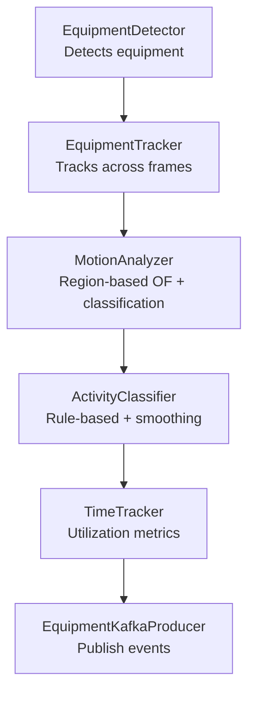
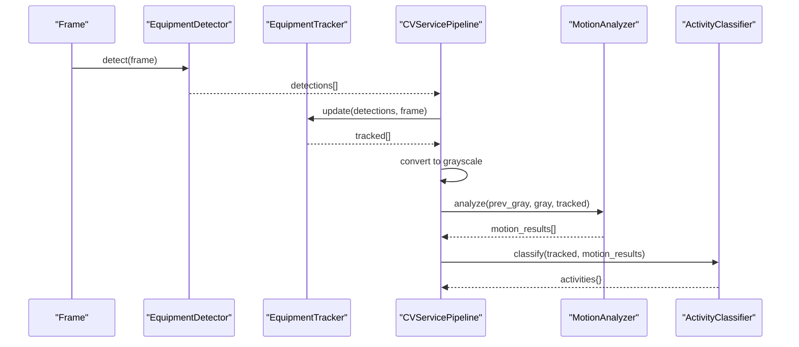
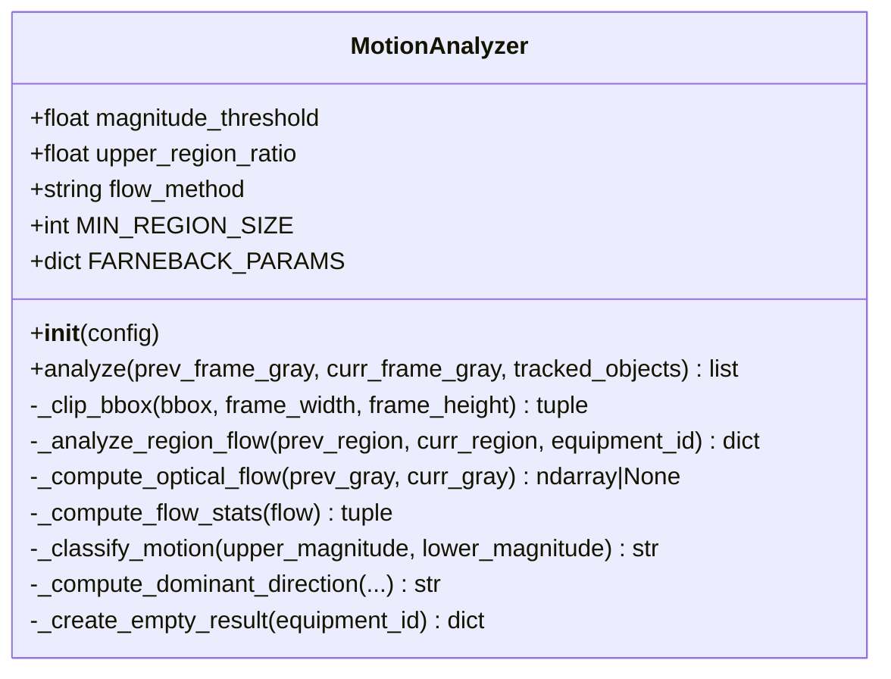
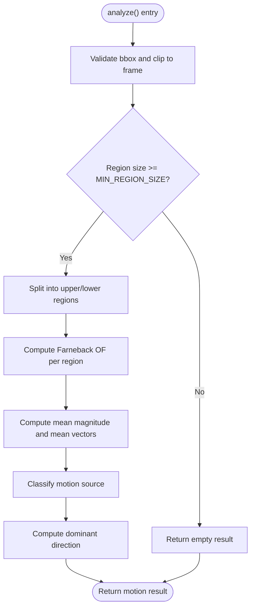
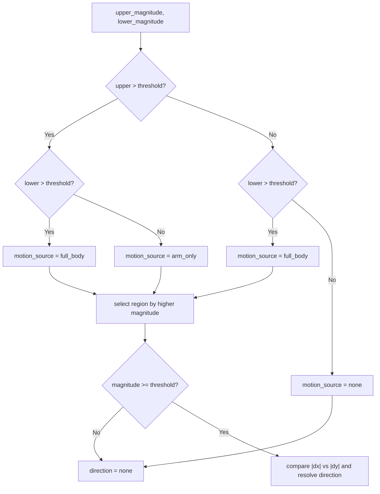
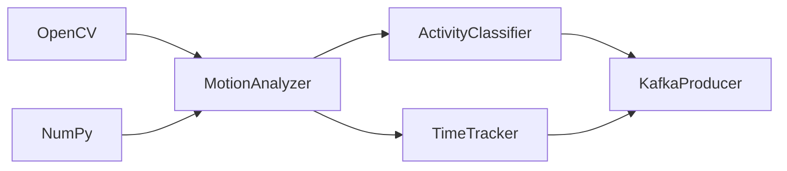

# Motion Analysis

<cite>
**Referenced Files in This Document**
- [motion_analyzer.py](file://services/cv_service/src/motion_analyzer.py)
- [settings.yaml](file://config/settings.yaml)
- [test_motion_analyzer.py](file://tests/test_motion_analyzer.py)
- [main.py](file://services/cv_service/src/main.py)
- [detector.py](file://services/cv_service/src/detector.py)
- [tracker.py](file://services/cv_service/src/tracker.py)
- [activity_classifier.py](file://services/cv_service/src/activity_classifier.py)
- [time_tracker.py](file://services/cv_service/src/time_tracker.py)
- [kafka_producer.py](file://services/cv_service/src/kafka_producer.py)
- [conftest.py](file://tests/conftest.py)
</cite>

## Table of Contents
1. [Introduction](#introduction)
2. [Project Structure](#project-structure)
3. [Core Components](#core-components)
4. [Architecture Overview](#architecture-overview)
5. [Detailed Component Analysis](#detailed-component-analysis)
6. [Dependency Analysis](#dependency-analysis)
7. [Performance Considerations](#performance-considerations)
8. [Troubleshooting Guide](#troubleshooting-guide)
9. [Conclusion](#conclusion)
10. [Appendices](#appendices)

## Introduction
This document explains the Motion Analysis component responsible for optical flow–based movement detection and analysis. It focuses on the MotionAnalyzer class, which performs region-based optical flow computation using the Farneback algorithm, extracts motion magnitudes and directions, and classifies motion sources (e.g., arm-only vs. full-body) to support activity classification. The document also covers configuration options, integration with detection and tracking, and practical guidance for tuning sensitivity, noise filtering, and handling varying conditions.

## Project Structure
The Motion Analysis component resides in the computer vision service and participates in a multi-stage pipeline:
- Detection: Identifies equipment in frames.
- Tracking: Assigns persistent IDs to equipment across frames.
- Motion Analysis: Computes optical flow per tracked object’s region and classifies motion.
- Activity Classification: Translates motion results into activity labels with smoothing.
- Time Tracking: Aggregates utilization metrics.
- Publishing: Streams events to Kafka for downstream analytics.

**Diagram sources**
- [main.py:323-372](file://services/cv_service/src/main.py#L323-L372)
- [detector.py:85-169](file://services/cv_service/src/detector.py#L85-L169)
- [tracker.py:159-264](file://services/cv_service/src/tracker.py#L159-L264)
- [motion_analyzer.py:88-166](file://services/cv_service/src/motion_analyzer.py#L88-L166)
- [activity_classifier.py:71-125](file://services/cv_service/src/activity_classifier.py#L71-L125)
- [time_tracker.py:53-120](file://services/cv_service/src/time_tracker.py#L53-L120)
- [kafka_producer.py:91-169](file://services/cv_service/src/kafka_producer.py#L91-L169)

**Section sources**
- [main.py:104-142](file://services/cv_service/src/main.py#L104-L142)
- [settings.yaml:31-39](file://config/settings.yaml#L31-L39)

## Core Components
- MotionAnalyzer: Computes dense optical flow per region, aggregates magnitudes and mean vectors, classifies motion source, and determines dominant direction.
- Configuration: Controlled via settings.yaml under the motion section for thresholds, region ratios, and method selection.
- Integration: Consumed by the main pipeline to produce motion results consumed by ActivityClassifier.

Key responsibilities:
- Region splitting: Upper (e.g., boom/arm) and lower (e.g., base/tracks) regions based on a configurable ratio.
- Optical flow: Dense Farneback computation with tuned parameters for construction equipment scenes.
- Magnitude and direction: Mean magnitude and mean flow vectors per region; dominant direction selection.
- Classification: Motion source classification (“full_body”, “arm_only”, “none”) based on thresholds.

**Section sources**
- [motion_analyzer.py:24-87](file://services/cv_service/src/motion_analyzer.py#L24-L87)
- [motion_analyzer.py:192-251](file://services/cv_service/src/motion_analyzer.py#L192-L251)
- [motion_analyzer.py:253-293](file://services/cv_service/src/motion_analyzer.py#L253-L293)
- [motion_analyzer.py:294-322](file://services/cv_service/src/motion_analyzer.py#L294-L322)
- [motion_analyzer.py:324-355](file://services/cv_service/src/motion_analyzer.py#L324-L355)
- [motion_analyzer.py:357-417](file://services/cv_service/src/motion_analyzer.py#L357-L417)
- [settings.yaml:31-34](file://config/settings.yaml#L31-L34)

## Architecture Overview
The motion analysis workflow is invoked per frame after detection and tracking. It requires a previous grayscale frame to compute optical flow between consecutive frames.

**Diagram sources**
- [main.py:345-360](file://services/cv_service/src/main.py#L345-L360)
- [detector.py:85-169](file://services/cv_service/src/detector.py#L85-L169)
- [tracker.py:159-264](file://services/cv_service/src/tracker.py#L159-L264)
- [motion_analyzer.py:88-166](file://services/cv_service/src/motion_analyzer.py#L88-L166)
- [activity_classifier.py:71-125](file://services/cv_service/src/activity_classifier.py#L71-L125)

## Detailed Component Analysis

### MotionAnalyzer Class
The MotionAnalyzer class encapsulates region-based optical flow analysis and motion classification.

Key behaviors:
- Initialization validates configuration and logs parameters.
- analyze iterates tracked objects, clips bounding boxes, checks minimum region size, splits into upper/lower regions, computes optical flow, aggregates statistics, classifies motion, and determines dominant direction.
- Region splitting uses a ratio relative to the region height.
- Optical flow uses Farneback with tuned parameters optimized for construction equipment scenes.
- Magnitude and mean flow vectors are computed per region; classification compares against a magnitude threshold.
- Dominant direction prioritizes the region with higher motion and resolves axes by comparing absolute dx and dy.

Practical implications:
- Magnitude threshold controls sensitivity to motion; increasing it reduces false positives but may miss subtle motion.
- upper_region_ratio defines the split between upper and lower regions; tuning it improves separation for articulated equipment.
- Farneback parameters balance accuracy and speed; reducing levels or winsize can improve performance at the cost of precision.

**Diagram sources**
- [motion_analyzer.py:24-87](file://services/cv_service/src/motion_analyzer.py#L24-L87)
- [motion_analyzer.py:88-166](file://services/cv_service/src/motion_analyzer.py#L88-L166)
- [motion_analyzer.py:192-251](file://services/cv_service/src/motion_analyzer.py#L192-L251)
- [motion_analyzer.py:253-293](file://services/cv_service/src/motion_analyzer.py#L253-L293)
- [motion_analyzer.py:294-322](file://services/cv_service/src/motion_analyzer.py#L294-L322)
- [motion_analyzer.py:324-355](file://services/cv_service/src/motion_analyzer.py#L324-L355)
- [motion_analyzer.py:357-417](file://services/cv_service/src/motion_analyzer.py#L357-L417)

**Section sources**
- [motion_analyzer.py:59-86](file://services/cv_service/src/motion_analyzer.py#L59-L86)
- [motion_analyzer.py:168-190](file://services/cv_service/src/motion_analyzer.py#L168-L190)
- [motion_analyzer.py:253-293](file://services/cv_service/src/motion_analyzer.py#L253-L293)
- [motion_analyzer.py:294-322](file://services/cv_service/src/motion_analyzer.py#L294-L322)
- [motion_analyzer.py:324-355](file://services/cv_service/src/motion_analyzer.py#L324-L355)
- [motion_analyzer.py:357-417](file://services/cv_service/src/motion_analyzer.py#L357-L417)

### Optical Flow Computation and Region-Based Analysis
The optical flow computation uses the Farneback algorithm with carefully chosen parameters for construction equipment scenes. The region-based approach splits each tracked object’s bounding box into upper and lower sub-regions, computing optical flow independently for each and aggregating statistics.

**Diagram sources**
- [motion_analyzer.py:130-166](file://services/cv_service/src/motion_analyzer.py#L130-L166)
- [motion_analyzer.py:192-251](file://services/cv_service/src/motion_analyzer.py#L192-L251)
- [motion_analyzer.py:253-293](file://services/cv_service/src/motion_analyzer.py#L253-L293)
- [motion_analyzer.py:294-322](file://services/cv_service/src/motion_analyzer.py#L294-L322)
- [motion_analyzer.py:324-355](file://services/cv_service/src/motion_analyzer.py#L324-L355)
- [motion_analyzer.py:357-417](file://services/cv_service/src/motion_analyzer.py#L357-L417)

**Section sources**
- [motion_analyzer.py:48-57](file://services/cv_service/src/motion_analyzer.py#L48-L57)
- [motion_analyzer.py:212-223](file://services/cv_service/src/motion_analyzer.py#L212-L223)
- [motion_analyzer.py:276-292](file://services/cv_service/src/motion_analyzer.py#L276-L292)

### Motion Classification and Dominant Direction
Motion classification combines magnitudes from upper and lower regions:
- “full_body”: either both regions exceed the threshold or lower-only is treated as full-body driving.
- “arm_only”: only the upper region exceeds the threshold.
- “none”: neither region exceeds the threshold.

Dominant direction is derived from the region with higher motion, resolving vertical vs. horizontal and positive/negative dx/dy according to OpenCV’s coordinate system.

**Diagram sources**
- [motion_analyzer.py:324-355](file://services/cv_service/src/motion_analyzer.py#L324-L355)
- [motion_analyzer.py:357-417](file://services/cv_service/src/motion_analyzer.py#L357-L417)

**Section sources**
- [motion_analyzer.py:344-355](file://services/cv_service/src/motion_analyzer.py#L344-L355)
- [motion_analyzer.py:387-417](file://services/cv_service/src/motion_analyzer.py#L387-L417)

### Integration with Activity Classification
Motion results feed the ActivityClassifier, which applies rule-based logic and N-frame smoothing to derive stable activity labels. The MotionAnalyzer provides:
- motion_source: “full_body”, “arm_only”, or “none”
- dominant_direction: “up”, “down”, “left”, “right”, or “none”
- flow_vectors: mean dx/dy per region

ActivityClassifier uses these inputs to decide:
- DIGGING: arm_only with dominant downward motion
- DUMPING: arm_only with dominant upward motion
- SWINGING_LOADING: horizontal motion (either arm_only or full_body)
- WAITING: no motion

Smoothing prevents flickering by selecting the mode over a sliding window.

**Section sources**
- [activity_classifier.py:71-125](file://services/cv_service/src/activity_classifier.py#L71-L125)
- [activity_classifier.py:166-231](file://services/cv_service/src/activity_classifier.py#L166-L231)
- [activity_classifier.py:233-286](file://services/cv_service/src/activity_classifier.py#L233-L286)

## Dependency Analysis
The MotionAnalyzer depends on:
- OpenCV for dense optical flow computation.
- NumPy for array operations and statistics.
- Logging for diagnostics and warnings.

It is consumed by:
- CVServicePipeline for per-frame processing.
- ActivityClassifier for activity labeling.
- TimeTracker for utilization metrics.
- KafkaProducer for event publishing.

**Diagram sources**
- [motion_analyzer.py:14-18](file://services/cv_service/src/motion_analyzer.py#L14-L18)
- [main.py:323-372](file://services/cv_service/src/main.py#L323-L372)
- [activity_classifier.py:71-125](file://services/cv_service/src/activity_classifier.py#L71-L125)
- [time_tracker.py:53-120](file://services/cv_service/src/time_tracker.py#L53-L120)
- [kafka_producer.py:91-169](file://services/cv_service/src/kafka_producer.py#L91-L169)

**Section sources**
- [motion_analyzer.py:14-18](file://services/cv_service/src/motion_analyzer.py#L14-L18)
- [main.py:104-142](file://services/cv_service/src/main.py#L104-L142)

## Performance Considerations
- Frame skipping: The pipeline skips frames to reduce CPU load; this affects temporal resolution and motion capture granularity.
- Resize: Frames are resized to a fixed width to reduce computation.
- Farneback parameters: Tuning levels, winsize, and iterations trades off accuracy for speed.
- Region size: Regions smaller than a minimum threshold are skipped to avoid unreliable flow estimates.
- Memory: Grayscale conversion and region extraction are lightweight; however, dense optical flow can be memory-intensive for large frames.

Recommendations:
- Increase frame_skip for resource-constrained environments.
- Reduce levels or winsize in Farneback for faster processing.
- Ensure regions are sufficiently large; adjust detection/tracking thresholds to avoid tiny bounding boxes.
- Consider ROI cropping to limit analysis to relevant areas.

**Section sources**
- [main.py:184-253](file://services/cv_service/src/main.py#L184-L253)
- [main.py:323-372](file://services/cv_service/src/main.py#L323-L372)
- [motion_analyzer.py:48-57](file://services/cv_service/src/motion_analyzer.py#L48-L57)
- [motion_analyzer.py:46](file://services/cv_service/src/motion_analyzer.py#L46)

## Troubleshooting Guide
Common issues and resolutions:
- Invalid or missing configuration:
  - upper_region_ratio must be strictly between 0 and 1; otherwise, initialization raises an error.
  - Ensure motion section is present in settings.yaml.
- Small regions:
  - Regions below the minimum size are skipped and return “none” motion with zero magnitudes.
- Invalid bounding boxes:
  - Objects with malformed or empty bounding boxes are logged and treated as “none”.
- Optical flow failures:
  - Farneback computation can fail for very small regions or invalid inputs; the analyzer catches and logs errors and returns None, leading to empty results.
- Dominant direction ambiguity:
  - When magnitudes are near threshold or equal, direction may be “none”; tune thresholds accordingly.

Validation and examples are covered by tests:
- Initialization with defaults and invalid ratio handling.
- Identical frames produce “none” motion.
- Region splitting and dominant direction detection.
- Bbox clipping and minimum region size behavior.

**Section sources**
- [motion_analyzer.py:77-86](file://services/cv_service/src/motion_analyzer.py#L77-L86)
- [motion_analyzer.py:134-154](file://services/cv_service/src/motion_analyzer.py#L134-L154)
- [motion_analyzer.py:276-292](file://services/cv_service/src/motion_analyzer.py#L276-L292)
- [test_motion_analyzer.py:19-51](file://tests/test_motion_analyzer.py#L19-L51)
- [test_motion_analyzer.py:61-80](file://tests/test_motion_analyzer.py#L61-L80)
- [test_motion_analyzer.py:231-256](file://tests/test_motion_analyzer.py#L231-L256)
- [test_motion_analyzer.py:184-201](file://tests/test_motion_analyzer.py#L184-L201)

## Conclusion
The MotionAnalyzer provides a robust, region-based optical flow pipeline tailored for construction equipment. By splitting tracked objects into upper and lower regions, computing dense optical flow, and classifying motion sources, it enables precise activity classification and utilization tracking. Proper configuration of thresholds and region ratios, combined with frame skipping and parameter tuning, allows balancing accuracy and performance across diverse operational scenarios.

## Appendices

### Configuration Options
- motion.magnitude_threshold: Minimum optical flow magnitude to consider motion (default from settings).
- motion.upper_region_ratio: Fraction of bounding box height allocated to the upper region (default from settings).
- motion.flow_method: Optical flow method (default “farneback”).
- activity.smoothing_window: Number of frames for mode-based smoothing (default from settings).
- activity.vertical_flow_threshold and activity.horizontal_flow_threshold: Direction thresholds for activity rules (default from settings).
- video.frame_skip and video.resize_width: Pipeline-wide performance controls affecting motion analysis frequency and input size.

**Section sources**
- [settings.yaml:31-39](file://config/settings.yaml#L31-L39)
- [main.py:138-141](file://services/cv_service/src/main.py#L138-L141)

### Practical Examples and Interpretation
- Interpreting motion results:
  - motion_source “arm_only” indicates articulated motion (e.g., digging, swinging); “full_body” indicates vehicle travel; “none” indicates no motion.
  - dominant_direction reflects the primary motion axis; “up” and “down” are vertical, “left” and “right” are horizontal.
  - flow_vectors provide mean dx/dy per region for downstream rule evaluation.
- Noise filtering:
  - Increase magnitude_threshold to reduce false positives in low-motion scenes.
  - Use smoothing_window to stabilize activity labels over time.
  - Ensure adequate texture in regions to improve optical flow stability.
- Integration with activity classification:
  - ActivityClassifier uses motion_source and flow_vectors to assign DIGGING, DUMPING, SWINGING_LOADING, or WAITING.
  - Smoothing prevents rapid toggling between states.
- Handling varying conditions:
  - Lighting: Optical flow is sensitive to illumination changes; consider preprocessing or adaptive thresholding if needed.
  - Camera motion: Stabilization or global motion compensation can mitigate false positives; the current implementation relies on region-based analysis to isolate equipment motion.

**Section sources**
- [activity_classifier.py:166-231](file://services/cv_service/src/activity_classifier.py#L166-L231)
- [activity_classifier.py:233-286](file://services/cv_service/src/activity_classifier.py#L233-L286)
- [motion_analyzer.py:324-355](file://services/cv_service/src/motion_analyzer.py#L324-L355)
- [motion_analyzer.py:357-417](file://services/cv_service/src/motion_analyzer.py#L357-L417)