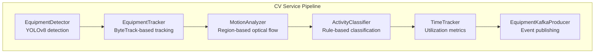
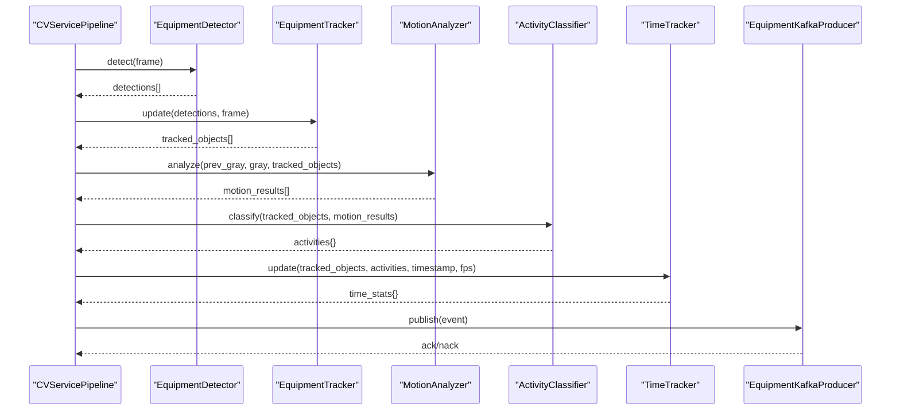
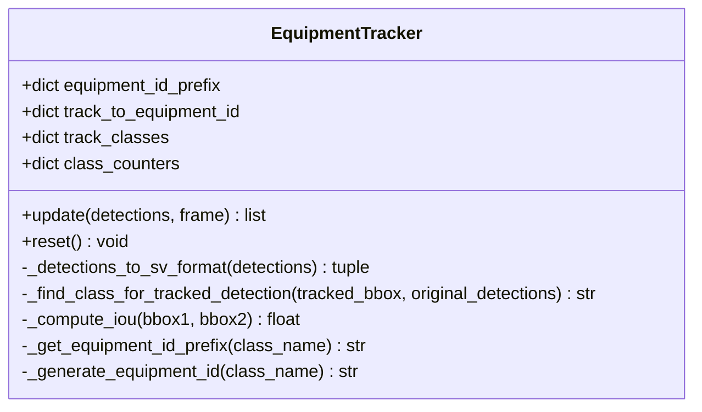
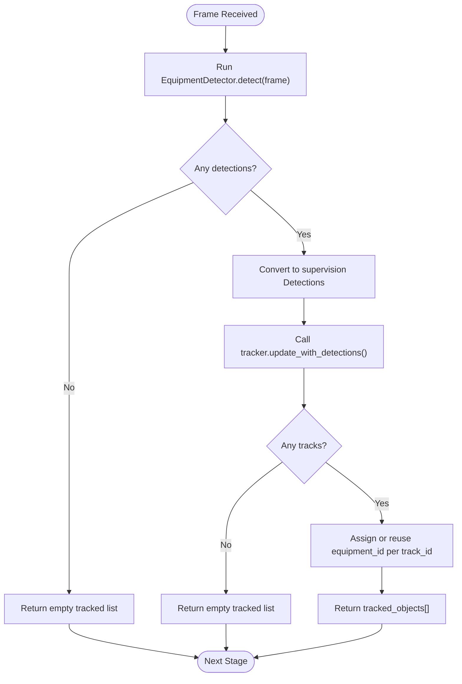
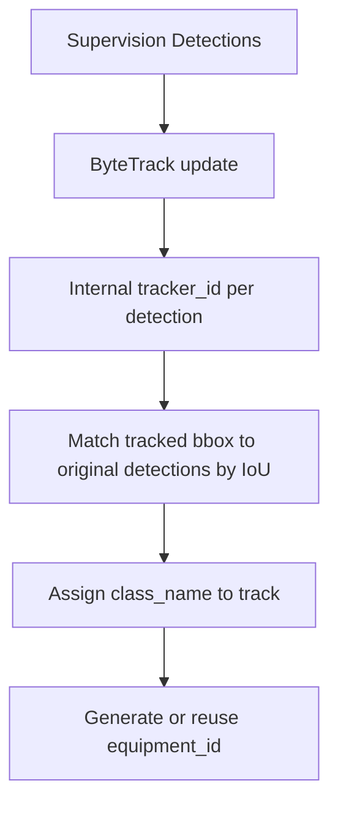
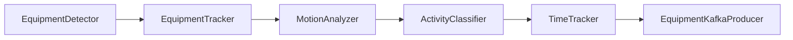

# Object Tracking

<cite>
**Referenced Files in This Document**
- [tracker.py](file://services/cv_service/src/tracker.py)
- [detector.py](file://services/cv_service/src/detector.py)
- [motion_analyzer.py](file://services/cv_service/src/motion_analyzer.py)
- [activity_classifier.py](file://services/cv_service/src/activity_classifier.py)
- [time_tracker.py](file://services/cv_service/src/time_tracker.py)
- [kafka_producer.py](file://services/cv_service/src/kafka_producer.py)
- [main.py](file://services/cv_service/src/main.py)
- [settings.yaml](file://config/settings.yaml)
- [requirements.txt](file://services/cv_service/requirements.txt)
</cite>

## Table of Contents
1. [Introduction](#introduction)
2. [Project Structure](#project-structure)
3. [Core Components](#core-components)
4. [Architecture Overview](#architecture-overview)
5. [Detailed Component Analysis](#detailed-component-analysis)
6. [Dependency Analysis](#dependency-analysis)
7. [Performance Considerations](#performance-considerations)
8. [Troubleshooting Guide](#troubleshooting-guide)
9. [Conclusion](#conclusion)
10. [Appendices](#appendices)

## Introduction
This document explains the Object Tracking component responsible for multi-object tracking with persistent IDs across video frames. It focuses on the EquipmentTracker class, detailing track initialization, ID generation strategies, track state management, and association algorithms. It also documents the end-to-end tracking workflow from detection results through track updates, ID assignment, and track termination logic. Configuration options for tracking parameters, distance metrics, and temporal consistency requirements are covered, along with practical examples of track quality assessment, ID switching scenarios, and handling occlusions. Common tracking challenges such as track fragmentation, ID collisions, and performance optimization for real-time processing are addressed, including integration with detection results and preparation for motion analysis.

## Project Structure
The Object Tracking component is part of the Computer Vision (CV) service pipeline. The pipeline orchestrates detection, tracking, motion analysis, activity classification, time tracking, and event publishing to Kafka. The tracker integrates tightly with the detector and participates in the motion analysis stage to enable activity classification.

**Diagram sources**
- [main.py:323-372](file://services/cv_service/src/main.py#L323-L372)
- [detector.py:85-169](file://services/cv_service/src/detector.py#L85-L169)
- [tracker.py:159-264](file://services/cv_service/src/tracker.py#L159-L264)
- [motion_analyzer.py:88-166](file://services/cv_service/src/motion_analyzer.py#L88-L166)
- [activity_classifier.py:71-125](file://services/cv_service/src/activity_classifier.py#L71-L125)
- [time_tracker.py:53-120](file://services/cv_service/src/time_tracker.py#L53-L120)
- [kafka_producer.py:91-169](file://services/cv_service/src/kafka_producer.py#L91-L169)

**Section sources**
- [main.py:104-142](file://services/cv_service/src/main.py#L104-L142)
- [settings.yaml:21-34](file://config/settings.yaml#L21-L34)

## Core Components
- EquipmentTracker: Implements multi-object tracking using ByteTrack via the supervision library. It converts detection results into supervision Detections, updates the tracker, assigns persistent friendly IDs, and returns tracked objects with consistent IDs across frames.
- EquipmentDetector: Provides YOLOv8-based detection of target equipment classes (car, bus, truck) with configurable confidence threshold and device selection.
- MotionAnalyzer: Performs region-based optical flow analysis to differentiate articulated motion (arm_only) from full-body motion (full_body) and determines dominant direction.
- ActivityClassifier: Applies rule-based classification with smoothing to derive activity states (DIGGING, SWINGING_LOADING, DUMPING, WAITING) from motion analysis results.
- TimeTracker: Accumulates time-based utilization metrics per tracked equipment across frames.
- EquipmentKafkaProducer: Publishes structured events to Kafka for downstream analytics.

**Section sources**
- [tracker.py:19-84](file://services/cv_service/src/tracker.py#L19-L84)
- [detector.py:18-83](file://services/cv_service/src/detector.py#L18-L83)
- [motion_analyzer.py:24-86](file://services/cv_service/src/motion_analyzer.py#L24-L86)
- [activity_classifier.py:23-69](file://services/cv_service/src/activity_classifier.py#L23-L69)
- [time_tracker.py:21-51](file://services/cv_service/src/time_tracker.py#L21-L51)
- [kafka_producer.py:17-69](file://services/cv_service/src/kafka_producer.py#L17-L69)

## Architecture Overview
The tracking workflow is orchestrated by the CVServicePipeline. It iterates video frames, performs detection, applies tracking, analyzes motion, classifies activities, tracks time, builds events, and publishes to Kafka. The EquipmentTracker integrates with supervision’s ByteTrack to maintain consistent track IDs across frames.

**Diagram sources**
- [main.py:323-372](file://services/cv_service/src/main.py#L323-L372)
- [detector.py:85-169](file://services/cv_service/src/detector.py#L85-L169)
- [tracker.py:159-264](file://services/cv_service/src/tracker.py#L159-L264)
- [motion_analyzer.py:88-166](file://services/cv_service/src/motion_analyzer.py#L88-L166)
- [activity_classifier.py:71-125](file://services/cv_service/src/activity_classifier.py#L71-L125)
- [time_tracker.py:53-120](file://services/cv_service/src/time_tracker.py#L53-L120)
- [kafka_producer.py:91-169](file://services/cv_service/src/kafka_producer.py#L91-L169)

## Detailed Component Analysis

### EquipmentTracker Implementation
The EquipmentTracker encapsulates multi-object tracking using supervision’s ByteTrack. It manages:
- Configuration validation and storage of tracking parameters.
- Conversion of detection dictionaries to supervision Detections format.
- Updating the tracker with supervision Detections.
- Assigning persistent friendly equipment IDs with class-based prefixes.
- Mapping internal track IDs to equipment IDs and classes.
- Matching tracked detections back to original detections to recover class names.

Key behaviors:
- Initialization validates required keys and constructs a ByteTrack instance with track activation threshold, buffer for lost tracks, and minimum matching threshold.
- ID generation uses class-based prefixes and sequential numbering per class to produce friendly IDs (e.g., DT-001).
- The update method converts detections to supervision format, updates the tracker, and processes tracked detections to build output objects with equipment_id, equipment_class, bbox, confidence, and track_id.
- Class name resolution for tracked detections is performed by computing IoU against original detection bboxes and selecting the best match above a threshold.

**Diagram sources**
- [tracker.py:19-341](file://services/cv_service/src/tracker.py#L19-L341)

**Section sources**
- [tracker.py:35-84](file://services/cv_service/src/tracker.py#L35-L84)
- [tracker.py:127-158](file://services/cv_service/src/tracker.py#L127-L158)
- [tracker.py:159-264](file://services/cv_service/src/tracker.py#L159-L264)
- [tracker.py:266-298](file://services/cv_service/src/tracker.py#L266-L298)
- [tracker.py:299-328](file://services/cv_service/src/tracker.py#L299-L328)
- [tracker.py:329-341](file://services/cv_service/src/tracker.py#L329-L341)

### Tracking Workflow: From Detection to Persistent IDs
End-to-end tracking workflow:
1. Detection: EquipmentDetector produces detection dictionaries with bbox, confidence, class_id, and class_name.
2. Tracking: EquipmentTracker converts detections to supervision Detections, updates the ByteTrack tracker, and returns tracked objects with persistent equipment_id and equipment_class.
3. Motion Analysis: MotionAnalyzer computes optical flow for upper and lower regions of each tracked object’s bounding box and classifies motion source.
4. Activity Classification: ActivityClassifier applies rule-based classification with smoothing to derive activity states.
5. Time Tracking: TimeTracker accumulates utilization metrics per equipment.
6. Event Publishing: CVServicePipeline builds structured events and publishes to Kafka.

**Diagram sources**
- [tracker.py:159-264](file://services/cv_service/src/tracker.py#L159-L264)
- [detector.py:85-169](file://services/cv_service/src/detector.py#L85-L169)
- [main.py:323-372](file://services/cv_service/src/main.py#L323-L372)

**Section sources**
- [main.py:323-372](file://services/cv_service/src/main.py#L323-L372)
- [tracker.py:159-264](file://services/cv_service/src/tracker.py#L159-L264)

### Configuration Options for Tracking Parameters
Tracking parameters are defined in the configuration file and consumed by EquipmentTracker:
- track_thresh: Detection confidence threshold for track activation.
- track_buffer: Number of frames to keep lost tracks alive.
- match_thresh: IOU threshold for matching detections to tracks.
- equipment_id_prefix: Mapping of class names to ID prefixes (e.g., truck: DT, car: VH, bus: BU, default: EQ).

These parameters influence:
- Track initialization: Higher track_thresh reduces false positives but may drop weak detections.
- Temporal consistency: Larger track_buffer allows smoother handling of short occlusions.
- Association stability: Higher match_thresh improves robustness to false positives but risks fragmentation.

**Section sources**
- [settings.yaml:21-29](file://config/settings.yaml#L21-L29)
- [tracker.py:35-84](file://services/cv_service/src/tracker.py#L35-L84)

### Distance Metrics and Association Algorithms
Association is handled by supervision’s ByteTrack:
- Internal association uses a combination of appearance descriptors and spatial consistency to maintain tracks across frames.
- The tracker exposes a minimum matching threshold to control association sensitivity.
- The EquipmentTracker augments this by matching tracked detections back to original detections to recover class names, using IoU as the distance metric for class assignment.

**Diagram sources**
- [tracker.py:205-264](file://services/cv_service/src/tracker.py#L205-L264)
- [tracker.py:266-298](file://services/cv_service/src/tracker.py#L266-L298)
- [tracker.py:300-328](file://services/cv_service/src/tracker.py#L300-L328)

**Section sources**
- [tracker.py:205-264](file://services/cv_service/src/tracker.py#L205-L264)
- [tracker.py:266-298](file://services/cv_service/src/tracker.py#L266-L298)
- [tracker.py:299-328](file://services/cv_service/src/tracker.py#L299-L328)

### Track State Management and Termination Logic
- Track state management:
  - Track IDs are maintained by supervision’s ByteTrack.
  - EquipmentTracker maintains mappings from internal track_id to equipment_id and class_name.
  - Class counters are maintained per class to ensure sequential ID generation.
- Track termination:
  - Lost tracks are retained for a configurable number of frames (track_buffer).
  - After the buffer expires, the track is considered terminated.
  - Reset clears all mappings and counters, restarting fresh for new videos or scene changes.

Practical implications:
- Short-term occlusions are handled by keeping tracks alive for several frames.
- Long-term disappearance triggers reinitialization of new tracks with fresh IDs.

**Section sources**
- [tracker.py:62-66](file://services/cv_service/src/tracker.py#L62-L66)
- [tracker.py:329-341](file://services/cv_service/src/tracker.py#L329-L341)

### Practical Examples

#### Track Quality Assessment
- Use IoU thresholds to assess how well tracked detections align with original detections during class assignment.
- Monitor the number of tracks and their stability across frames to evaluate tracker performance.
- Validate that equipment_id remains consistent for the same physical object across frames.

#### ID Switching Scenarios
- When two objects briefly swap positions, the tracker may temporarily switch IDs. The class-based prefix and sequential numbering help distinguish between classes and reduce ambiguity.
- If an object leaves and reappears, a new internal track_id is assigned, but EquipmentTracker generates a new equipment_id to preserve continuity for analytics.

#### Handling Occlusions
- Increase track_buffer to allow tracks to survive brief occlusions.
- Adjust match_thresh to improve robustness to partial overlaps.
- Use motion analysis to confirm whether an object is truly absent or occluded.

**Section sources**
- [tracker.py:266-298](file://services/cv_service/src/tracker.py#L266-L298)
- [tracker.py:329-341](file://services/cv_service/src/tracker.py#L329-L341)

### Integration with Detection Results and Motion Analysis Preparation
- Detection results are converted to supervision Detections for efficient processing.
- The tracker preserves the original detection metadata (class_name) by matching tracked detections back to original detections using IoU.
- Motion analysis requires grayscale frames; the pipeline converts frames to grayscale after tracking and motion analysis.

**Section sources**
- [tracker.py:127-158](file://services/cv_service/src/tracker.py#L127-L158)
- [main.py:345-372](file://services/cv_service/src/main.py#L345-L372)
- [motion_analyzer.py:88-166](file://services/cv_service/src/motion_analyzer.py#L88-L166)

## Dependency Analysis
The CV service pipeline composes multiple modules with clear dependencies. EquipmentTracker depends on supervision’s ByteTrack and relies on detection results from EquipmentDetector. MotionAnalyzer consumes tracked objects and grayscale frames. ActivityClassifier and TimeTracker consume motion and activity results respectively. KafkaProducer publishes structured events.

**Diagram sources**
- [main.py:104-142](file://services/cv_service/src/main.py#L104-L142)
- [tracker.py:19-84](file://services/cv_service/src/tracker.py#L19-L84)
- [motion_analyzer.py:24-86](file://services/cv_service/src/motion_analyzer.py#L24-L86)
- [activity_classifier.py:23-69](file://services/cv_service/src/activity_classifier.py#L23-L69)
- [time_tracker.py:21-51](file://services/cv_service/src/time_tracker.py#L21-L51)
- [kafka_producer.py:17-69](file://services/cv_service/src/kafka_producer.py#L17-L69)

**Section sources**
- [main.py:104-142](file://services/cv_service/src/main.py#L104-L142)
- [requirements.txt:1-7](file://services/cv_service/requirements.txt#L1-L7)

## Performance Considerations
- Frame skipping: The pipeline supports frame skipping to reduce computational load. This affects the effective FPS used for time calculations.
- Model device: Detection runs on CPU by default; GPU acceleration can be enabled by changing the device setting.
- Suppression of YOLO verbose output: Reduces console noise and overhead.
- Optical flow parameters: Tuning Farneback parameters balances accuracy and speed for construction equipment motion.
- Kafka batching: Producer settings optimize throughput and reliability.

Recommendations:
- Use frame_skip judiciously to balance latency and performance.
- Prefer CPU for deployment simplicity; GPU for higher throughput.
- Adjust magnitude_threshold and region ratios to minimize false positives.
- Tune smoothing_window to reduce flickering without introducing lag.

**Section sources**
- [main.py:184-253](file://services/cv_service/src/main.py#L184-L253)
- [settings.yaml:3-6](file://config/settings.yaml#L3-L6)
- [motion_analyzer.py:49-57](file://services/cv_service/src/motion_analyzer.py#L49-L57)
- [kafka_producer.py:40-53](file://services/cv_service/src/kafka_producer.py#L40-L53)

## Troubleshooting Guide
Common issues and resolutions:
- Missing configuration keys: Initialization raises ValueError if required keys are missing. Ensure track_thresh, track_buffer, match_thresh, and equipment_id_prefix are present.
- Model loading failures: EquipmentDetector raises RuntimeError if the YOLOv8 model fails to load. Verify model path and device availability.
- Empty frames or frames with no detections: Both detectors and tracker handle empty inputs gracefully by returning empty results.
- Tracker update failures: The tracker update is wrapped in a try-except; failures are logged and empty results are returned.
- Invalid bounding boxes: MotionAnalyzer clips bounding boxes to frame boundaries and skips regions smaller than a minimum size.
- Kafka connectivity: Producer initialization errors are logged; ensure bootstrap servers and topic are configured correctly.

Operational tips:
- Monitor logs for warnings and errors during processing.
- Validate configuration values for thresholds and ratios.
- Confirm that the video directory exists and contains supported formats.

**Section sources**
- [tracker.py:52-56](file://services/cv_service/src/tracker.py#L52-L56)
- [detector.py:74-76](file://services/cv_service/src/detector.py#L74-L76)
- [main.py:396-412](file://services/cv_service/src/main.py#L396-L412)
- [motion_analyzer.py:134-154](file://services/cv_service/src/motion_analyzer.py#L134-L154)
- [kafka_producer.py:60-68](file://services/cv_service/src/kafka_producer.py#L60-L68)

## Conclusion
The Object Tracking component provides robust, persistent multi-object tracking for occupational equipment using ByteTrack via supervision. It integrates seamlessly with detection, motion analysis, activity classification, and time tracking to support real-time utilization analytics. Proper configuration of tracking parameters, careful handling of occlusions, and performance tuning enable reliable operation across diverse video conditions. The design emphasizes clear separation of concerns, enabling straightforward extension and maintenance.

## Appendices

### Configuration Reference
- Tracking parameters:
  - track_thresh: Detection confidence threshold for track activation.
  - track_buffer: Frames to retain lost tracks.
  - match_thresh: IOU threshold for detection-to-track association.
  - equipment_id_prefix: Class-to-ID prefix mapping.
- Motion parameters:
  - magnitude_threshold: Minimum optical flow magnitude to consider as moving.
  - upper_region_ratio: Fraction of bbox height for upper region.
  - flow_method: Optical flow method (Farneback).
- Activity parameters:
  - smoothing_window: N-frame smoothing window.
  - vertical_flow_threshold: Threshold for vertical motion detection.
  - horizontal_flow_threshold: Threshold for horizontal motion detection.

**Section sources**
- [settings.yaml:21-40](file://config/settings.yaml#L21-L40)