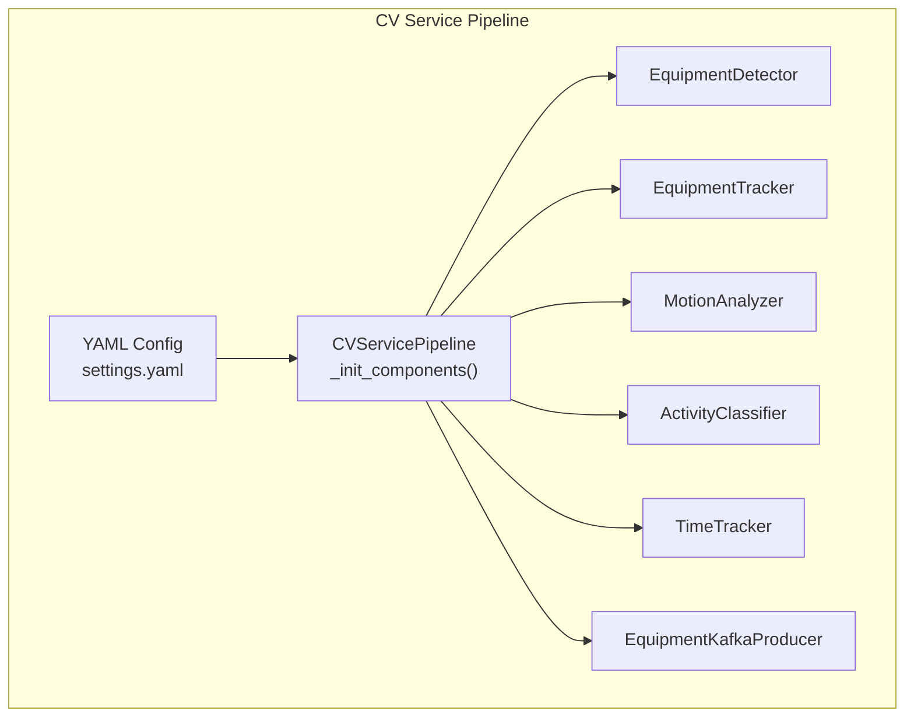
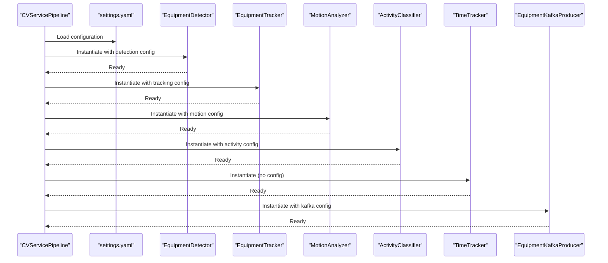
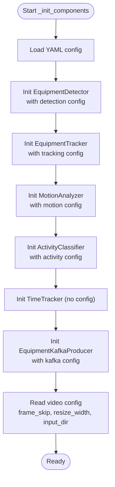
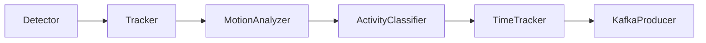
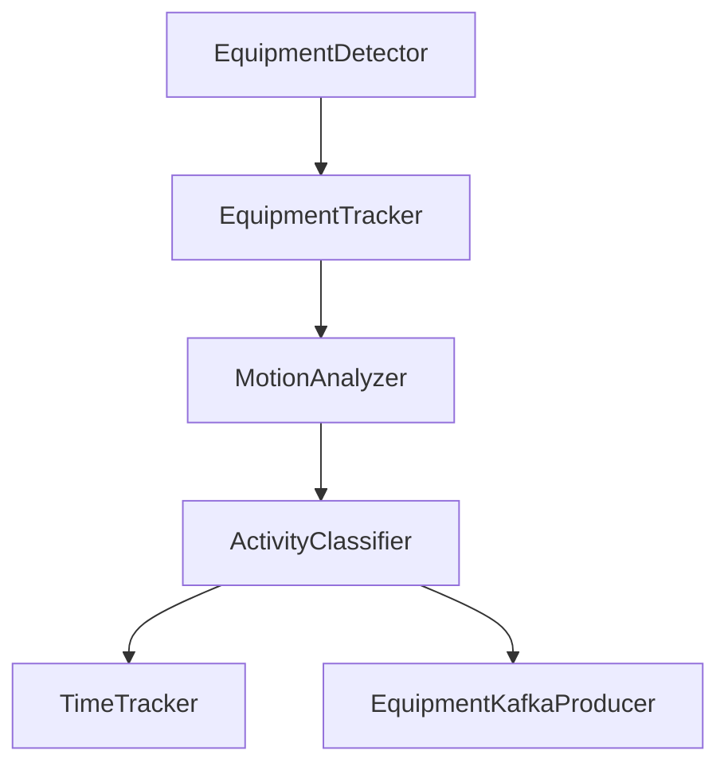

# Component Initialization

<cite>
**Referenced Files in This Document**
- [main.py](file://services/cv_service/src/main.py)
- [settings.yaml](file://config/settings.yaml)
- [detector.py](file://services/cv_service/src/detector.py)
- [tracker.py](file://services/cv_service/src/tracker.py)
- [motion_analyzer.py](file://services/cv_service/src/motion_analyzer.py)
- [activity_classifier.py](file://services/cv_service/src/activity_classifier.py)
- [time_tracker.py](file://services/cv_service/src/time_tracker.py)
- [kafka_producer.py](file://services/cv_service/src/kafka_producer.py)
- [conftest.py](file://tests/conftest.py)
</cite>

## Table of Contents
1. [Introduction](#introduction)
2. [Project Structure](#project-structure)
3. [Core Components](#core-components)
4. [Architecture Overview](#architecture-overview)
5. [Detailed Component Analysis](#detailed-component-analysis)
6. [Dependency Analysis](#dependency-analysis)
7. [Performance Considerations](#performance-considerations)
8. [Troubleshooting Guide](#troubleshooting-guide)
9. [Conclusion](#conclusion)

## Introduction
This document explains the CV Service component initialization system, focusing on the _init_components method that constructs and configures the entire computer vision pipeline. It covers how each component is instantiated using configuration parameters from the YAML settings file, the dependency hierarchy and initialization order, error handling during initialization, and the factory pattern approach used for component creation. Practical examples demonstrate how to add new components and how configuration changes affect component behavior.

## Project Structure
The CV Service orchestrates a six-stage pipeline:
- Equipment detection
- Equipment tracking
- Motion analysis
- Activity classification
- Time tracking
- Kafka publishing

The main entrypoint loads configuration, initializes components, and runs the processing loop.

**Diagram sources**
- [main.py:104-142](file://services/cv_service/src/main.py#L104-L142)
- [settings.yaml:1-59](file://config/settings.yaml#L1-L59)

**Section sources**
- [main.py:104-142](file://services/cv_service/src/main.py#L104-L142)
- [settings.yaml:1-59](file://config/settings.yaml#L1-L59)

## Core Components
This section documents each component’s role, configuration loading, and initialization behavior.

- EquipmentDetector
  - Loads a YOLOv8 model and validates required configuration keys.
  - Filters detections by confidence threshold and target classes.
  - Exposes detect(frame) returning structured detection dictionaries.

- EquipmentTracker
  - Initializes ByteTrack via supervision and manages per-class ID generation.
  - Converts detection dictionaries to supervision Detections and updates the tracker.
  - Provides update(detections, frame) returning tracked objects with consistent IDs.

- MotionAnalyzer
  - Computes region-based optical flow for upper (arm/boom) and lower (base/tracks) regions.
  - Classifies motion as full_body, arm_only, or none based on magnitude thresholds.
  - Determines dominant direction from active region flow vectors.

- ActivityClassifier
  - Implements rule-based classification with N-frame smoothing to prevent flickering.
  - Maps motion results to activities: DIGGING, SWINGING_LOADING, DUMPING, WAITING.
  - Produces current_state and current_activity per equipment.

- TimeTracker
  - Accumulates total tracked, active, and idle seconds per equipment.
  - Calculates utilization percentage and supports aggregate statistics.
  - Operates independently of configuration and uses frame-based updates.

- EquipmentKafkaProducer
  - Initializes a confluent-kafka Producer with reliability and performance settings.
  - Serializes events and publishes them to a configured topic with equipment_id partitioning.
  - Provides flush/close lifecycle management.

**Section sources**
- [detector.py:35-84](file://services/cv_service/src/detector.py#L35-L84)
- [tracker.py:35-84](file://services/cv_service/src/tracker.py#L35-L84)
- [motion_analyzer.py:59-87](file://services/cv_service/src/motion_analyzer.py#L59-L87)
- [activity_classifier.py:46-70](file://services/cv_service/src/activity_classifier.py#L46-L70)
- [time_tracker.py:37-52](file://services/cv_service/src/time_tracker.py#L37-L52)
- [kafka_producer.py:25-69](file://services/cv_service/src/kafka_producer.py#L25-L69)

## Architecture Overview
The CVServicePipeline orchestrates component initialization and runtime processing. The _init_components method extracts subsections from the YAML configuration and instantiates each component with its dedicated configuration block.

**Diagram sources**
- [main.py:104-142](file://services/cv_service/src/main.py#L104-L142)
- [settings.yaml:8-53](file://config/settings.yaml#L8-L53)

**Section sources**
- [main.py:104-142](file://services/cv_service/src/main.py#L104-L142)
- [settings.yaml:8-53](file://config/settings.yaml#L8-L53)

## Detailed Component Analysis

### Component Initialization Method
The _init_components method performs deterministic initialization order and logs readiness for each component. It reads subsections from the YAML configuration and passes them to each component constructor.

- Detection component: Reads detection subsection and instantiates EquipmentDetector.
- Tracking component: Reads tracking subsection and instantiates EquipmentTracker.
- Motion analysis component: Reads motion subsection and instantiates MotionAnalyzer.
- Activity classification component: Reads activity subsection and instantiates ActivityClassifier.
- Time tracking component: Instantiates TimeTracker with no configuration.
- Kafka producer: Reads kafka subsection and instantiates EquipmentKafkaProducer.
- Video configuration: Reads video subsection and sets frame_skip, resize_width, input_dir.

**Diagram sources**
- [main.py:104-142](file://services/cv_service/src/main.py#L104-L142)

**Section sources**
- [main.py:104-142](file://services/cv_service/src/main.py#L104-L142)

### EquipmentDetector Initialization
- Configuration keys validated: model, confidence_threshold, device, input_size, target_classes, class_names.
- Model loading performed via YOLO constructor; errors raise RuntimeError.
- Stores configuration and logs initialization details.

Practical example: To add a new model path or device, modify the detection section in settings.yaml and ensure the model file is accessible at runtime.

**Section sources**
- [detector.py:35-84](file://services/cv_service/src/detector.py#L35-L84)
- [settings.yaml:8-20](file://config/settings.yaml#L8-L20)

### EquipmentTracker Initialization
- Configuration keys validated: track_thresh, track_buffer, match_thresh, equipment_id_prefix.
- Initializes ByteTrack via supervision with provided thresholds.
- Manages ID assignment with per-class prefixes and sequential numbering.

Practical example: To change ID prefix mapping for a new vehicle class, add an entry under equipment_id_prefix in the tracking section.

**Section sources**
- [tracker.py:35-84](file://services/cv_service/src/tracker.py#L35-L84)
- [settings.yaml:21-30](file://config/settings.yaml#L21-L30)

### MotionAnalyzer Initialization
- Configuration keys: magnitude_threshold, upper_region_ratio, flow_method.
- Validates upper_region_ratio is within (0, 1); otherwise raises ValueError.
- Logs initialization with effective parameters.

Practical example: To adjust sensitivity to motion, tune magnitude_threshold in the motion section.

**Section sources**
- [motion_analyzer.py:59-87](file://services/cv_service/src/motion_analyzer.py#L59-L87)
- [settings.yaml:31-35](file://config/settings.yaml#L31-L35)

### ActivityClassifier Initialization
- Configuration keys: smoothing_window, vertical_flow_threshold, horizontal_flow_threshold.
- Initializes per-equipment activity history buffers for smoothing.
- Logs initialization with thresholds and window size.

Practical example: To reduce flickering, increase smoothing_window; to be more sensitive to motion, decrease thresholds.

**Section sources**
- [activity_classifier.py:46-70](file://services/cv_service/src/activity_classifier.py#L46-L70)
- [settings.yaml:36-40](file://config/settings.yaml#L36-L40)

### TimeTracker Initialization
- No configuration required; operates purely on frame updates.
- Maintains per-equipment counters and calculates utilization percentages.

Practical example: TimeTracker does not require changes to settings.yaml; it accumulates time based on frame updates.

**Section sources**
- [time_tracker.py:37-52](file://services/cv_service/src/time_tracker.py#L37-L52)

### EquipmentKafkaProducer Initialization
- Configuration keys: bootstrap_servers, topic, client_id.
- Initializes confluent-kafka Producer with reliability and performance settings.
- Logs initialization with server and topic details.

Practical example: To route events to a different topic or cluster, update kafka section in settings.yaml.

**Section sources**
- [kafka_producer.py:25-69](file://services/cv_service/src/kafka_producer.py#L25-L69)
- [settings.yaml:41-46](file://config/settings.yaml#L41-L46)

### Factory Pattern Approach
The CVServicePipeline acts as a factory for pipeline components by:
- Loading configuration from a single source (YAML).
- Extracting subsections for each component.
- Passing validated subsections to each component’s constructor.
- Returning a unified orchestrator that coordinates component interactions.

This approach centralizes configuration and simplifies adding new components by:
- Extending the YAML configuration with a new subsection.
- Adding a new instantiation line in _init_components.
- Updating the processing method to integrate the new component.

**Section sources**
- [main.py:104-142](file://services/cv_service/src/main.py#L104-L142)
- [settings.yaml:3-59](file://config/settings.yaml#L3-L59)

### Configuration Loading and Validation
- YAML loading occurs in _load_config with multiple fallback paths.
- Each component validates required keys in its constructor and raises explicit exceptions on missing or invalid values.
- Defaults are applied inside components when keys are absent.

Practical example: If a required key is missing in detection, EquipmentDetector raises ValueError with a descriptive message.

**Section sources**
- [main.py:69-103](file://services/cv_service/src/main.py#L69-L103)
- [detector.py:54-59](file://services/cv_service/src/detector.py#L54-L59)
- [motion_analyzer.py:77-82](file://services/cv_service/src/motion_analyzer.py#L77-L82)

### Dependency Hierarchy and Initialization Order
The initialization order is strictly enforced:
1. EquipmentDetector
2. EquipmentTracker
3. MotionAnalyzer
4. ActivityClassifier
5. TimeTracker
6. EquipmentKafkaProducer

This order ensures:
- Detector produces detections for tracker.
- Tracker produces tracked objects for motion analyzer.
- Motion analyzer produces motion results for activity classifier.
- Activity classifier produces activity states for time tracker.
- Time tracker produces time analytics for event building and Kafka publishing.

**Diagram sources**
- [main.py:104-142](file://services/cv_service/src/main.py#L104-L142)

**Section sources**
- [main.py:104-142](file://services/cv_service/src/main.py#L104-L142)

### Practical Examples: Adding a New Component
To add a new component (e.g., a new post-processing stage):
1. Define a new subsection in settings.yaml (e.g., post_process) with required keys.
2. Extend _init_components to instantiate the new component with the subsection.
3. Integrate the new component into the processing pipeline by updating process_frame to call the new component and incorporate its results into the event schema.

Example steps:
- Add a new section in settings.yaml under the appropriate category.
- Modify _init_components to read the new subsection and instantiate the component.
- Update process_frame to call the new component and merge its outputs into the event.

**Section sources**
- [main.py:104-142](file://services/cv_service/src/main.py#L104-L142)
- [settings.yaml:1-59](file://config/settings.yaml#L1-L59)

### How Configuration Changes Affect Behavior
- Detection: Adjusting confidence_threshold reduces or increases false positives; changing target_classes alters which objects are tracked.
- Tracking: Tuning track_thresh and match_thresh affects stability and ID persistence.
- Motion: Changing magnitude_threshold influences sensitivity to motion; adjusting upper_region_ratio refines arm/base segmentation.
- Activity: Modifying smoothing_window impacts flickering; thresholds control sensitivity to vertical/horizontal motion.
- Kafka: Changing topic or bootstrap_servers routes events to different clusters or topics.
- Video: frame_skip and resize_width impact performance and inference speed.

**Section sources**
- [settings.yaml:3-59](file://config/settings.yaml#L3-L59)

## Dependency Analysis
The pipeline exhibits a strict linear dependency chain with no circular dependencies. Each component depends on the previous stage’s output, and TimeTracker and KafkaProducer depend on ActivityClassifier outputs.

**Diagram sources**
- [main.py:346-372](file://services/cv_service/src/main.py#L346-L372)

**Section sources**
- [main.py:346-372](file://services/cv_service/src/main.py#L346-L372)

## Performance Considerations
- frame_skip and resize_width in the video section reduce computational load by processing fewer frames and resizing inputs.
- Device selection in detection (CPU/CUDA) affects inference speed; ensure the chosen device is available.
- Optical flow parameters in motion analysis influence accuracy and speed; tune magnitude_threshold and region ratios for the deployment environment.
- Kafka producer settings balance throughput and reliability; adjust linger.ms and batch.size for network characteristics.

[No sources needed since this section provides general guidance]

## Troubleshooting Guide
Common initialization and runtime issues:
- Missing configuration keys: Components raise ValueError or RuntimeError with descriptive messages. Verify YAML sections and required keys.
- Model loading failures: EquipmentDetector raises RuntimeError if the model cannot be loaded; ensure model path and device are correct.
- Invalid motion configuration: MotionAnalyzer raises ValueError if upper_region_ratio is out of range.
- Kafka connectivity: EquipmentKafkaProducer logs errors on initialization and delivery failures; verify bootstrap_servers and topic availability.
- Frame processing errors: The pipeline catches exceptions during frame processing and continues; inspect logs for specific frame indices.

**Section sources**
- [detector.py:54-59](file://services/cv_service/src/detector.py#L54-L59)
- [detector.py:74-76](file://services/cv_service/src/detector.py#L74-L76)
- [motion_analyzer.py:77-82](file://services/cv_service/src/motion_analyzer.py#L77-L82)
- [kafka_producer.py:66-68](file://services/cv_service/src/kafka_producer.py#L66-L68)
- [main.py:410-412](file://services/cv_service/src/main.py#L410-L412)

## Conclusion
The CV Service component initialization system follows a clear, deterministic pattern: load YAML configuration, extract subsections, and instantiate components with validated parameters. The factory-like approach in _init_components centralizes configuration and enables straightforward extension. Components are tightly coupled in a linear pipeline, with clear responsibilities and robust error handling. By adjusting settings.yaml, operators can fine-tune detection sensitivity, tracking stability, motion analysis thresholds, activity classification behavior, and event publishing targets.