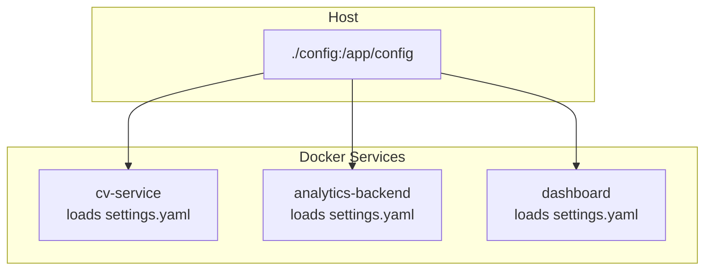
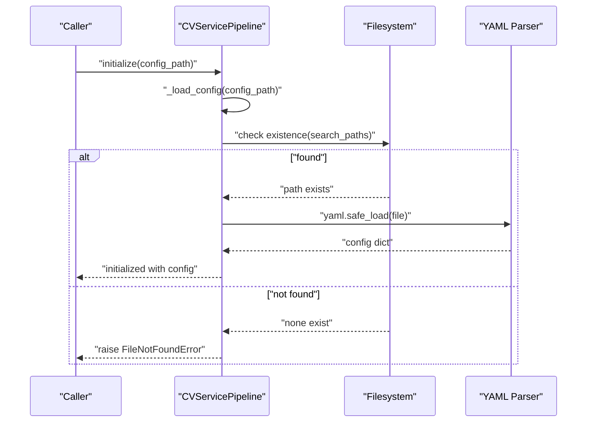
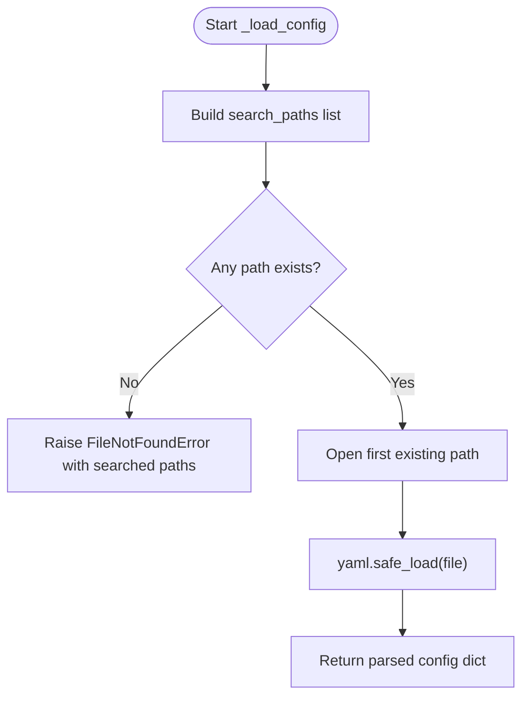
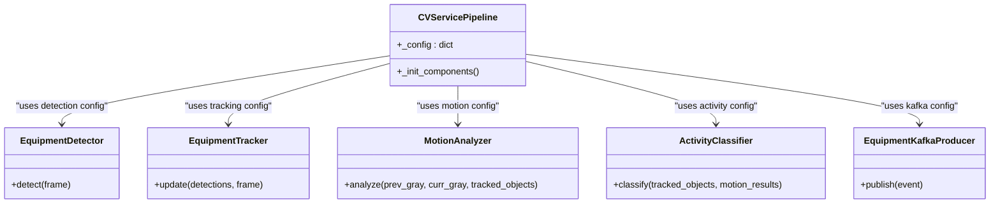
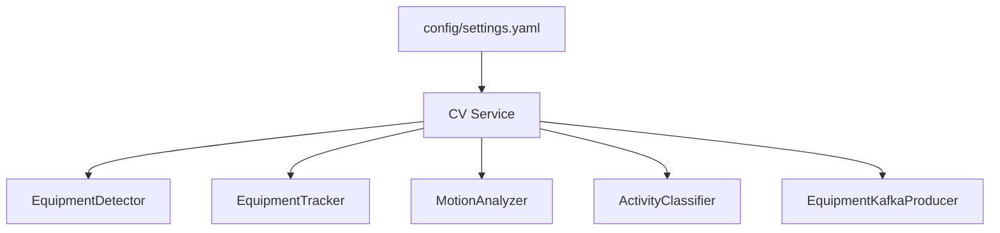

# Configuration Management

<cite>
**Referenced Files in This Document**
- [settings.yaml](file://config/settings.yaml)
- [main.py](file://services/cv_service/src/main.py)
- [detector.py](file://services/cv_service/src/detector.py)
- [tracker.py](file://services/cv_service/src/tracker.py)
- [motion_analyzer.py](file://services/cv_service/src/motion_analyzer.py)
- [activity_classifier.py](file://services/cv_service/src/activity_classifier.py)
- [kafka_producer.py](file://services/cv_service/src/kafka_producer.py)
- [docker-compose.yml](file://docker-compose.yml)
</cite>

## Table of Contents
1. [Introduction](#introduction)
2. [Project Structure](#project-structure)
3. [Core Components](#core-components)
4. [Architecture Overview](#architecture-overview)
5. [Detailed Component Analysis](#detailed-component-analysis)
6. [Dependency Analysis](#dependency-analysis)
7. [Performance Considerations](#performance-considerations)
8. [Troubleshooting Guide](#troubleshooting-guide)
9. [Conclusion](#conclusion)
10. [Appendices](#appendices)

## Introduction
This document explains the configuration management system for the CV Service. It focuses on how the configuration is loaded from multiple locations, parsed from YAML, validated, and mapped into runtime components. It also covers environment-specific deployment patterns, dynamic update considerations, and troubleshooting steps.

## Project Structure
The configuration is centralized in a single YAML file and consumed by the CV Service and related services. The repository mounts a shared config volume in Docker Compose so all services can access the same settings.

**Diagram sources**
- [docker-compose.yml:58-60](file://docker-compose.yml#L58-L60)
- [docker-compose.yml:75-77](file://docker-compose.yml#L75-L77)
- [docker-compose.yml:88-90](file://docker-compose.yml#L88-L90)

**Section sources**
- [docker-compose.yml:51-63](file://docker-compose.yml#L51-L63)
- [docker-compose.yml:64-79](file://docker-compose.yml#L64-L79)
- [docker-compose.yml:80-92](file://docker-compose.yml#L80-L92)

## Core Components
The CV Service loads configuration via a method that searches multiple candidate locations, parses YAML safely, and initializes pipeline components with validated settings.

Key behaviors:
- Search order: explicit path, container path, local relative path, parent-relative path
- YAML parsing uses safe loader
- On success, returns the parsed dictionary; otherwise raises a file-not-found error listing searched paths
- Pipeline components read subsections (e.g., detection, tracking, motion, activity, kafka, video) from the configuration

**Section sources**
- [main.py:69-102](file://services/cv_service/src/main.py#L69-L102)

## Architecture Overview
The configuration lifecycle spans discovery, parsing, validation, and consumption by pipeline components.

**Diagram sources**
- [main.py:69-102](file://services/cv_service/src/main.py#L69-L102)

## Detailed Component Analysis

### Configuration Loading Method (_load_config)
Behavior summary:
- Accepts an explicit config path argument
- Defines a list of candidate paths in priority order
- Iterates candidates and stops at the first existing file
- Parses YAML safely and returns the resulting dictionary
- Raises a file-not-found error enumerating all searched paths if none exist

Operational notes:
- The method does not perform deep validation of configuration content; it validates presence and parse correctness
- Consumers are responsible for validating required keys and values for their respective modules

**Section sources**
- [main.py:69-102](file://services/cv_service/src/main.py#L69-L102)

### YAML Configuration Sections and Component Mapping
The configuration file defines top-level sections that map to pipeline components. Each component reads only its relevant subsection.

- video
  - Used by the pipeline to configure frame processing (skip rate, resize width, input directory)
  - Keys: frame_skip, resize_width, input_dir
  - Consumption: pipeline initialization extracts subsection and applies defaults

- detection
  - Used by EquipmentDetector to configure model, device, input size, confidence threshold, and class filtering
  - Keys: model, confidence_threshold, device, input_size, target_classes, class_names
  - Validation: required keys checked during detector initialization

- tracking
  - Used by EquipmentTracker to configure ByteTrack thresholds, buffer, matching, and equipment ID prefix mapping
  - Keys: track_thresh, track_buffer, match_thresh, equipment_id_prefix
  - Validation: required keys checked during tracker initialization

- motion
  - Used by MotionAnalyzer to configure optical flow thresholds, region splitting ratio, and method
  - Keys: magnitude_threshold, upper_region_ratio, flow_method
  - Validation: ratio bounds enforced during analyzer initialization

- activity
  - Used by ActivityClassifier to configure smoothing window and directional thresholds
  - Keys: smoothing_window, vertical_flow_threshold, horizontal_flow_threshold
  - Behavior: smoothing applied to prevent flickering between activity states

- kafka
  - Used by EquipmentKafkaProducer to configure broker addresses, topic, client ID, and producer settings
  - Keys: bootstrap_servers, topic, client_id, consumer_group
  - Behavior: producer initialized with reliability and performance settings

- database
  - Defined in the configuration file; not consumed by CV Service components
  - Present for potential reuse by analytics backend or other services

- dashboard
  - Defined in the configuration file; not consumed by CV Service components
  - Present for potential reuse by dashboard service

Practical mapping:
- Pipeline initialization retrieves subsections and passes them to component constructors
- Each component enforces its own required-key validation and applies defaults where applicable

**Section sources**
- [settings.yaml:3-59](file://config/settings.yaml#L3-L59)
- [main.py:104-142](file://services/cv_service/src/main.py#L104-L142)
- [detector.py:35-83](file://services/cv_service/src/detector.py#L35-L83)
- [tracker.py:35-83](file://services/cv_service/src/tracker.py#L35-L83)
- [motion_analyzer.py:59-86](file://services/cv_service/src/motion_analyzer.py#L59-L86)
- [activity_classifier.py:46-69](file://services/cv_service/src/activity_classifier.py#L46-L69)
- [kafka_producer.py:25-68](file://services/cv_service/src/kafka_producer.py#L25-L68)

### YAML Parsing and Validation Flow

**Diagram sources**
- [main.py:69-102](file://services/cv_service/src/main.py#L69-L102)

### Component Initialization and Configuration Consumption

**Diagram sources**
- [main.py:104-142](file://services/cv_service/src/main.py#L104-L142)
- [detector.py:85-169](file://services/cv_service/src/detector.py#L85-L169)
- [tracker.py:159-264](file://services/cv_service/src/tracker.py#L159-L264)
- [motion_analyzer.py:88-166](file://services/cv_service/src/motion_analyzer.py#L88-L166)
- [activity_classifier.py:71-125](file://services/cv_service/src/activity_classifier.py#L71-L125)
- [kafka_producer.py:91-169](file://services/cv_service/src/kafka_producer.py#L91-L169)

## Dependency Analysis
- CV Service depends on the presence of a valid YAML configuration file at one of the searched locations
- Components depend on their respective subsections being present and containing required keys
- Docker Compose mounts a shared config volume to ensure consistent configuration across services

**Diagram sources**
- [settings.yaml:1-59](file://config/settings.yaml#L1-L59)
- [main.py:104-142](file://services/cv_service/src/main.py#L104-L142)

**Section sources**
- [docker-compose.yml:58-60](file://docker-compose.yml#L58-L60)
- [main.py:69-102](file://services/cv_service/src/main.py#L69-L102)

## Performance Considerations
- Frame processing is influenced by video.frame_skip and video.resize_width; adjust to balance throughput and accuracy
- Detection device selection impacts inference speed; choose cpu or cuda accordingly
- MotionAnalyzer uses dense optical flow; tune magnitude_threshold and upper_region_ratio to reduce false positives
- ActivityClassifier smoothing_window reduces flickering but adds latency; tune for responsiveness vs. stability
- Kafka producer settings balance reliability and throughput; adjust linger_ms and batch.size for your workload

[No sources needed since this section provides general guidance]

## Troubleshooting Guide
Common issues and resolutions:
- Config file not found
  - Symptom: startup fails with a file-not-found error listing searched paths
  - Resolution: ensure config/settings.yaml exists at one of the expected locations or pass an explicit --config path
  - Evidence: the loader enumerates all searched paths in the raised error

- Invalid YAML syntax
  - Symptom: YAML parsing error during load
  - Resolution: validate YAML syntax and indentation; use a linter or editor with YAML support

- Missing required keys in a component section
  - Symptom: component initialization raises a validation error indicating missing keys
  - Resolution: add required keys to the appropriate section (e.g., detection, tracking, motion, activity)
  - Evidence: components enforce required keys during initialization

- Invalid configuration values
  - Symptom: MotionAnalyzer raises a validation error for upper_region_ratio out of range
  - Resolution: ensure ratios are within (0, 1); adjust motion.upper_region_ratio accordingly

- Kafka connectivity issues
  - Symptom: producer warnings or errors when publishing events
  - Resolution: verify kafka.bootstrap_servers and topic; confirm Kafka service availability

Environment-specific checks:
- Docker Compose mounts ./config to /app/config; ensure your config file is placed under ./config
- Verify service dependencies (Kafka, Postgres) are healthy before starting CV Service

**Section sources**
- [main.py:69-102](file://services/cv_service/src/main.py#L69-L102)
- [detector.py:54-59](file://services/cv_service/src/detector.py#L54-L59)
- [motion_analyzer.py:77-81](file://services/cv_service/src/motion_analyzer.py#L77-L81)
- [kafka_producer.py:60-68](file://services/cv_service/src/kafka_producer.py#L60-L68)
- [docker-compose.yml:58-60](file://docker-compose.yml#L58-L60)

## Conclusion
The CV Service configuration system provides a robust, multi-location search mechanism for YAML-based settings, with clear separation of concerns across pipeline components. By understanding the searched paths, required keys per component, and environment mounting in Docker, operators can reliably deploy and troubleshoot configurations across diverse environments.

[No sources needed since this section summarizes without analyzing specific files]

## Appendices

### Configuration File Structure Reference
- video: frame_skip, resize_width, input_dir
- detection: model, confidence_threshold, device, input_size, target_classes, class_names
- tracking: track_thresh, track_buffer, match_thresh, equipment_id_prefix
- motion: magnitude_threshold, upper_region_ratio, flow_method
- activity: smoothing_window, vertical_flow_threshold, horizontal_flow_threshold
- kafka: bootstrap_servers, topic, client_id, consumer_group
- database: host, port, name, user, password, uri
- dashboard: api_url, refresh_interval, page_title

**Section sources**
- [settings.yaml:3-59](file://config/settings.yaml#L3-L59)

### Environment-Specific Overrides and Deployment Scenarios
- Containerized deployments
  - Mount a shared config volume to /app/config so all services can access the same settings
  - Adjust detection.device to cuda if GPU resources are available
  - Tune motion.magnitude_threshold and activity.smoothing_window for real-time performance

- Local development
  - Place config/settings.yaml in the project root or repo root depending on working directory
  - Use cpu for inference if GPU drivers are unavailable
  - Reduce video.resize_width and increase video.frame_skip to improve performance

- Multi-environment consistency
  - Keep kafka.bootstrap_servers aligned across services
  - Ensure detection.target_classes and class_names match across CV Service, analytics backend, and dashboard consumers

**Section sources**
- [docker-compose.yml:58-60](file://docker-compose.yml#L58-L60)
- [settings.yaml:3-59](file://config/settings.yaml#L3-L59)

### Dynamic Configuration Updates
- Current behavior: configuration is loaded once at startup; changes require restarting the service
- Recommended approach: for dynamic updates, externalize configuration to a centralized store (e.g., environment variables, a config server) and implement a reload mechanism in the service
- Alternative approach: implement a file watcher to detect changes to settings.yaml and reinitialize affected components

[No sources needed since this section provides general guidance]