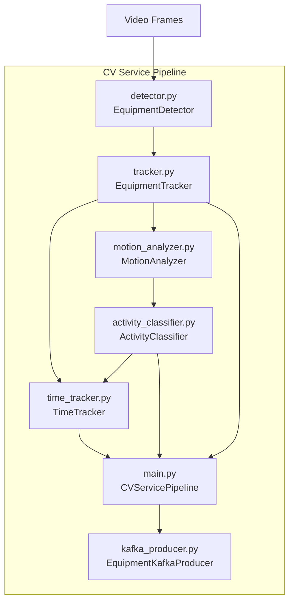
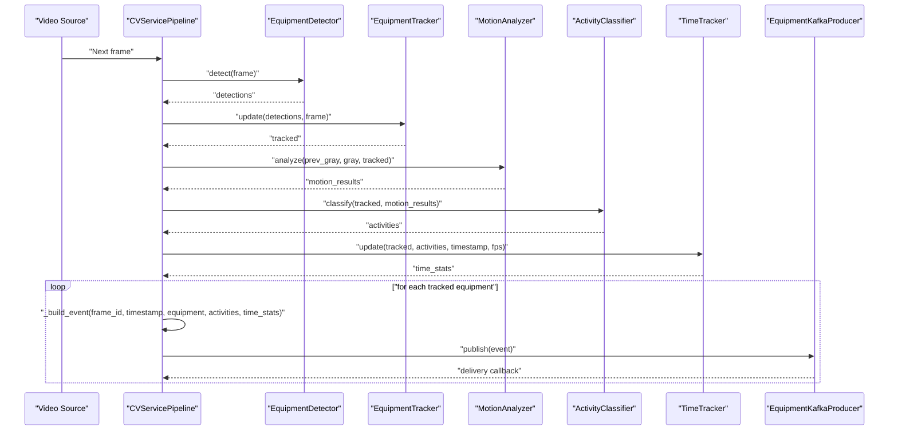
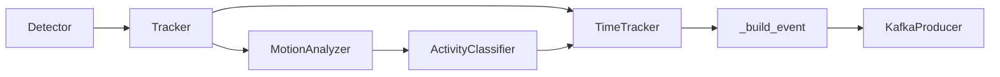

# Event Construction

<cite>
**Referenced Files in This Document**
- [main.py](file://services/cv_service/src/main.py)
- [kafka_producer.py](file://services/cv_service/src/kafka_producer.py)
- [time_tracker.py](file://services/cv_service/src/time_tracker.py)
- [activity_classifier.py](file://services/cv_service/src/activity_classifier.py)
- [motion_analyzer.py](file://services/cv_service/src/motion_analyzer.py)
- [settings.yaml](file://config/settings.yaml)
- [test_time_tracker.py](file://tests/test_time_tracker.py)
- [test_activity_classifier.py](file://tests/test_activity_classifier.py)
</cite>

## Table of Contents
1. [Introduction](#introduction)
2. [Project Structure](#project-structure)
3. [Core Components](#core-components)
4. [Architecture Overview](#architecture-overview)
5. [Detailed Component Analysis](#detailed-component-analysis)
6. [Dependency Analysis](#dependency-analysis)
7. [Performance Considerations](#performance-considerations)
8. [Troubleshooting Guide](#troubleshooting-guide)
9. [Conclusion](#conclusion)
10. [Appendices](#appendices)

## Introduction
This document explains the CV Service event construction system with a focus on the _build_event method that transforms processing results into Kafka-compatible event dictionaries. It documents the event schema, how activity classifications map to utilization states, and how time statistics are aggregated per equipment. Practical examples show customization and edge-case handling for robust event construction.

## Project Structure
The CV Service orchestrates detection, tracking, motion analysis, activity classification, time tracking, and Kafka publishing. The event construction occurs in the main pipeline and is published via a dedicated Kafka producer.

**Diagram sources**
- [main.py:42-498](file://services/cv_service/src/main.py#L42-L498)
- [detector.py:18-169](file://services/cv_service/src/detector.py#L18-L169)
- [tracker.py:19-341](file://services/cv_service/src/tracker.py#L19-L341)
- [motion_analyzer.py:24-442](file://services/cv_service/src/motion_analyzer.py#L24-L442)
- [activity_classifier.py:23-306](file://services/cv_service/src/activity_classifier.py#L23-L306)
- [time_tracker.py:21-265](file://services/cv_service/src/time_tracker.py#L21-L265)
- [kafka_producer.py:17-228](file://services/cv_service/src/kafka_producer.py#L17-L228)

**Section sources**
- [main.py:42-498](file://services/cv_service/src/main.py#L42-L498)
- [settings.yaml:1-59](file://config/settings.yaml#L1-L59)

## Core Components
- Event builder: The _build_event method constructs a Kafka-compatible event dictionary from frame metadata, tracked equipment, activity classification, and time statistics.
- Activity classifier: Maps motion analysis to activity categories and determines utilization state.
- Time tracker: Aggregates per-equipment time metrics (active, idle, tracked duration, utilization percentage).
- Kafka producer: Serializes and publishes events to Kafka with validation and delivery callbacks.

Key responsibilities:
- _build_event consolidates frame_id, timestamp, equipment identity/class, activity state/motion source, and time analytics into a normalized event schema.
- ActivityClassifier produces current_state and current_activity for each equipment.
- TimeTracker accumulates time deltas per frame and computes utilization percent.

**Section sources**
- [main.py:270-321](file://services/cv_service/src/main.py#L270-L321)
- [activity_classifier.py:71-125](file://services/cv_service/src/activity_classifier.py#L71-L125)
- [time_tracker.py:53-120](file://services/cv_service/src/time_tracker.py#L53-L120)
- [kafka_producer.py:91-169](file://services/cv_service/src/kafka_producer.py#L91-L169)

## Architecture Overview
The pipeline processes frames through detection, tracking, motion analysis, activity classification, and time tracking. For each tracked equipment, an event is built and published to Kafka.

**Diagram sources**
- [main.py:323-420](file://services/cv_service/src/main.py#L323-L420)
- [detector.py:85-169](file://services/cv_service/src/detector.py#L85-L169)
- [tracker.py:159-264](file://services/cv_service/src/tracker.py#L159-L264)
- [motion_analyzer.py:88-166](file://services/cv_service/src/motion_analyzer.py#L88-L166)
- [activity_classifier.py:71-125](file://services/cv_service/src/activity_classifier.py#L71-L125)
- [time_tracker.py:53-120](file://services/cv_service/src/time_tracker.py#L53-L120)
- [kafka_producer.py:91-169](file://services/cv_service/src/kafka_producer.py#L91-L169)

## Detailed Component Analysis

### Event Schema and _build_event Method
The _build_event method composes a Kafka-compatible event dictionary with the following top-level fields:
- frame_id: Integer frame index.
- equipment_id: String unique identifier for the equipment.
- equipment_class: String friendly class name.
- timestamp: String timestamp in HH:MM:SS.mmm format.
- utilization: Dictionary with:
  - current_state: "ACTIVE" or "INACTIVE".
  - current_activity: Activity label (e.g., "DIGGING", "SWINGING_LOADING", "DUMPING", "WAITING").
  - motion_source: Motion classification ("arm_only", "full_body", "none").
- time_analytics: Dictionary with:
  - total_tracked_seconds: Float cumulative tracked time.
  - total_active_seconds: Float time spent ACTIVE.
  - total_idle_seconds: Float time spent INACTIVE.
  - utilization_percent: Float percentage of tracked time that is active.

Mapping from activities to utilization states:
- current_state is "ACTIVE" when current_activity is not "WAITING"; otherwise "INACTIVE".

Per-equipment aggregation:
- TimeTracker accumulates time deltas per frame based on fps and current_state, then computes utilization_percent as total_active_seconds / total_tracked_seconds (with 0% default when tracked seconds is zero).

Validation and error handling:
- Kafka producer validates presence of required fields before publishing and raises errors for missing fields.
- Producer uses equipment_id as the partition key to preserve ordering per equipment.

Practical examples (paths only):
- Event construction call site: [process_frame:366-372](file://services/cv_service/src/main.py#L366-L372)
- Event schema definition and validation: [EquipmentKafkaProducer.publish:91-169](file://services/cv_service/src/kafka_producer.py#L91-L169)

**Section sources**
- [main.py:270-321](file://services/cv_service/src/main.py#L270-L321)
- [kafka_producer.py:91-169](file://services/cv_service/src/kafka_producer.py#L91-L169)
- [time_tracker.py:157-187](file://services/cv_service/src/time_tracker.py#L157-L187)
- [activity_classifier.py:109-124](file://services/cv_service/src/activity_classifier.py#L109-L124)

### Activity Classification and State Mapping
ActivityClassifier derives activity labels from motion analysis results and applies N-frame smoothing to reduce flickering. It sets:
- current_state: "ACTIVE" for any non-WAITING activity; "INACTIVE" otherwise.
- current_activity: One of "DIGGING", "SWINGING_LOADING", "DUMPING", or "WAITING".
- motion_source: "arm_only", "full_body", or "none".

Rules:
- DIGGING: arm_only motion with dominant downward vertical flow (> vertical_flow_threshold).
- DUMPING: arm_only motion with dominant upward vertical flow (< -vertical_flow_threshold).
- SWINGING_LOADING: horizontal motion dominates (|dx| > horizontal_flow_threshold) or full_body motion with horizontal flow.
- WAITING: no motion detected (motion_source == "none").

Smoothing:
- Maintains a sliding window of recent classifications and returns the mode (most frequent), preferring the most recent on ties.

Validation and tests:
- Tests confirm state mapping, smoothing behavior, and classification rules.

**Section sources**
- [activity_classifier.py:71-125](file://services/cv_service/src/activity_classifier.py#L71-L125)
- [activity_classifier.py:166-231](file://services/cv_service/src/activity_classifier.py#L166-L231)
- [activity_classifier.py:233-286](file://services/cv_service/src/activity_classifier.py#L233-L286)
- [test_activity_classifier.py:43-209](file://tests/test_activity_classifier.py#L43-L209)
- [test_activity_classifier.py:439-543](file://tests/test_activity_classifier.py#L439-L543)

### Time Statistics Aggregation
TimeTracker updates per-equipment counters for each processed frame:
- time_delta = 1.0 / max(fps, 1.0) to avoid division by zero.
- total_tracked_seconds: Always incremented by time_delta.
- total_active_seconds: Incremented when current_state is "ACTIVE".
- total_idle_seconds: Incremented when current_state is "INACTIVE".
- utilization_percent: total_active_seconds / total_tracked_seconds if tracked > 0, else 0.0.

Aggregate statistics:
- get_total_utilization computes totals across all tracked equipment and average_utilization_percent.

Edge cases handled:
- Unknown equipment returns zeros for stats.
- Zero or missing fps treated safely.
- Missing activity state defaults to "INACTIVE" (idle).

**Section sources**
- [time_tracker.py:53-120](file://services/cv_service/src/time_tracker.py#L53-L120)
- [time_tracker.py:157-187](file://services/cv_service/src/time_tracker.py#L157-L187)
- [time_tracker.py:221-264](file://services/cv_service/src/time_tracker.py#L221-L264)
- [test_time_tracker.py:187-212](file://tests/test_time_tracker.py#L187-L212)
- [test_time_tracker.py:386-482](file://tests/test_time_tracker.py#L386-L482)

### Kafka Producer Validation and Delivery
EquipmentKafkaProducer enforces:
- Required fields: frame_id, equipment_id, equipment_class, timestamp.
- Partitioning by equipment_id for per-equipment ordering.
- Asynchronous produce with delivery callbacks and buffered retries.
- Flush and close semantics with timeouts.

Error handling:
- Missing required fields raise ValueError.
- Buffer full triggers a flush and retry.
- Delivery failures logged with topic/partition/offset.

**Section sources**
- [kafka_producer.py:91-169](file://services/cv_service/src/kafka_producer.py#L91-L169)
- [kafka_producer.py:170-209](file://services/cv_service/src/kafka_producer.py#L170-L209)

### Motion Analysis Supporting Activity Classification
MotionAnalyzer splits tracked bounding boxes into upper (arm/boom) and lower (base/tracks) regions, computes optical flow for each, and classifies motion source:
- "arm_only": upper region moving while lower is not.
- "full_body": either both regions moving or lower region moving while upper is not.
- "none": neither region moving.

Dominant direction is derived from the region with higher motion magnitude.

**Section sources**
- [motion_analyzer.py:88-166](file://services/cv_service/src/motion_analyzer.py#L88-L166)
- [motion_analyzer.py:324-355](file://services/cv_service/src/motion_analyzer.py#L324-L355)
- [motion_analyzer.py:357-417](file://services/cv_service/src/motion_analyzer.py#L357-L417)

## Dependency Analysis
The event construction pipeline depends on:
- Detector and Tracker for equipment identities and bounding boxes.
- MotionAnalyzer for motion_source and flow vectors.
- ActivityClassifier for activity labels and state mapping.
- TimeTracker for per-equipment time aggregates.
- KafkaProducer for serialization and publishing.

**Diagram sources**
- [main.py:24-29](file://services/cv_service/src/main.py#L24-L29)
- [main.py:323-420](file://services/cv_service/src/main.py#L323-L420)
- [kafka_producer.py:17-228](file://services/cv_service/src/kafka_producer.py#L17-L228)

**Section sources**
- [main.py:24-29](file://services/cv_service/src/main.py#L24-L29)
- [main.py:323-420](file://services/cv_service/src/main.py#L323-L420)

## Performance Considerations
- Frame skipping and resizing reduce computational load; fps influences time delta granularity.
- Producer batching and linger settings balance throughput and latency.
- N-frame smoothing reduces false positives and flickering at the cost of minor latency.
- Region-based optical flow thresholds tune sensitivity to motion.

[No sources needed since this section provides general guidance]

## Troubleshooting Guide
Common issues and resolutions:
- Missing required fields in event: Ensure frame_id, equipment_id, equipment_class, timestamp are present before publishing.
- No motion detected: motion_source will be "none", resulting in WAITING activity and INACTIVE state.
- Zero FPS or extreme fps values: TimeTracker protects against division by zero and treats extreme values safely.
- Buffer full during publish: Producer flushes and retries automatically; monitor pending_messages and adjust linger/batch sizes.
- Incorrect activity classification: Verify thresholds and smoothing window; confirm motion_source reflects expected region movement.

**Section sources**
- [kafka_producer.py:125-169](file://services/cv_service/src/kafka_producer.py#L125-L169)
- [time_tracker.py:82-86](file://services/cv_service/src/time_tracker.py#L82-L86)
- [activity_classifier.py:56-59](file://services/cv_service/src/activity_classifier.py#L56-L59)
- [motion_analyzer.py:77-82](file://services/cv_service/src/motion_analyzer.py#L77-L82)

## Conclusion
The CV Service event construction system reliably converts processing results into Kafka-ready events. The _build_event method consolidates frame metadata, activity classification, and time analytics into a standardized schema. ActivityClassifier and TimeTracker provide robust state mapping and aggregation, while KafkaProducer ensures reliable delivery with validation and error handling.

[No sources needed since this section summarizes without analyzing specific files]

## Appendices

### Event Schema Reference
Top-level fields:
- frame_id: integer
- equipment_id: string
- equipment_class: string
- timestamp: string "HH:MM:SS.mmm"
- utilization: object
  - current_state: "ACTIVE" | "INACTIVE"
  - current_activity: "DIGGING" | "SWINGING_LOADING" | "DUMPING" | "WAITING"
  - motion_source: "arm_only" | "full_body" | "none"
- time_analytics: object
  - total_tracked_seconds: number
  - total_active_seconds: number
  - total_idle_seconds: number
  - utilization_percent: number

**Section sources**
- [kafka_producer.py:95-112](file://services/cv_service/src/kafka_producer.py#L95-L112)

### Customization Examples (Paths Only)
- Modify activity thresholds: [settings.yaml:36-39](file://config/settings.yaml#L36-L39)
- Adjust smoothing window: [settings.yaml](file://config/settings.yaml#L37)
- Tune motion analysis parameters: [settings.yaml:31-34](file://config/settings.yaml#L31-L34)
- Change Kafka topic and server: [settings.yaml:41-45](file://config/settings.yaml#L41-L45)
- Customize event fields: Extend _build_event in [main.py:270-321](file://services/cv_service/src/main.py#L270-L321)
- Override state mapping: Adjust state derivation in [main.py:299-300](file://services/cv_service/src/main.py#L299-L300)
- Add custom time metrics: Extend TimeTracker in [time_tracker.py:53-120](file://services/cv_service/src/time_tracker.py#L53-L120)

### Edge Cases and Validation Rules
- Unknown equipment: TimeTracker returns zeros; ActivityClassifier defaults to WAITING.
- Missing activity data: Defaults to WAITING with INACTIVE state.
- Zero or negative fps: TimeTracker uses safe minimum delta.
- Producer buffer full: Automatic flush and retry; monitor pending messages.

**Section sources**
- [time_tracker.py:138-146](file://services/cv_service/src/time_tracker.py#L138-L146)
- [activity_classifier.py:109-124](file://services/cv_service/src/activity_classifier.py#L109-L124)
- [test_time_tracker.py:386-482](file://tests/test_time_tracker.py#L386-L482)
- [kafka_producer.py:153-168](file://services/cv_service/src/kafka_producer.py#L153-L168)