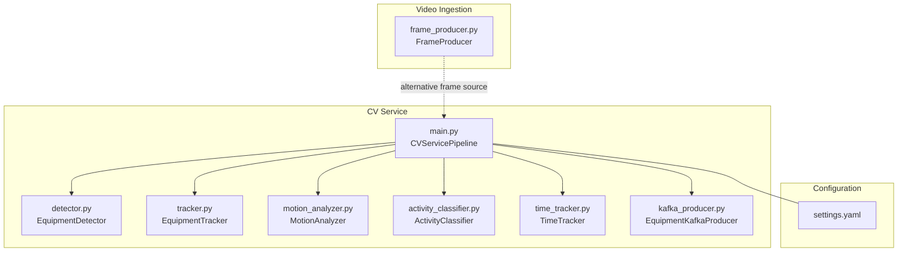
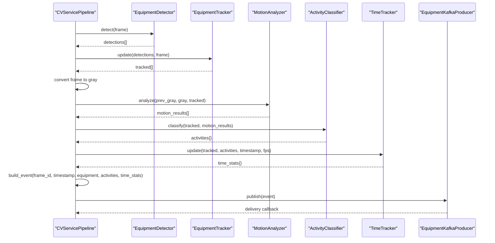
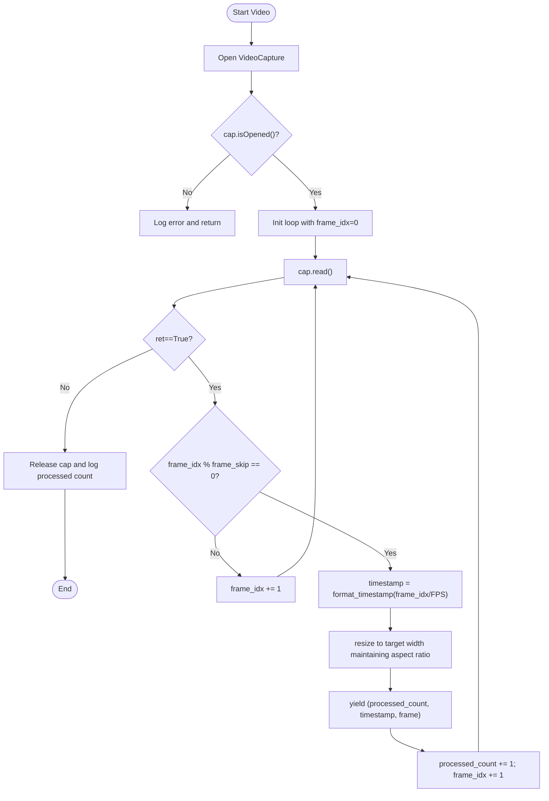
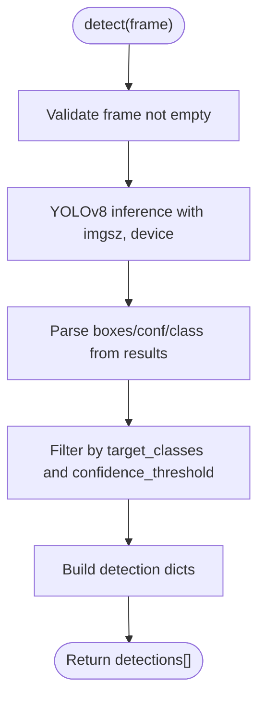
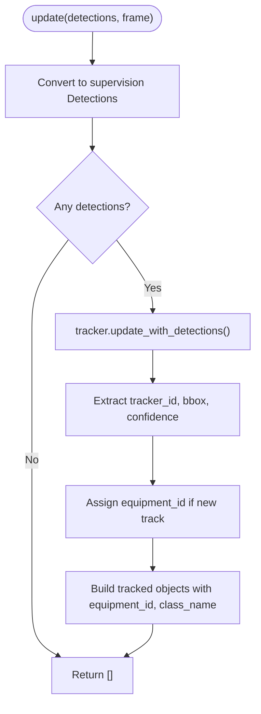
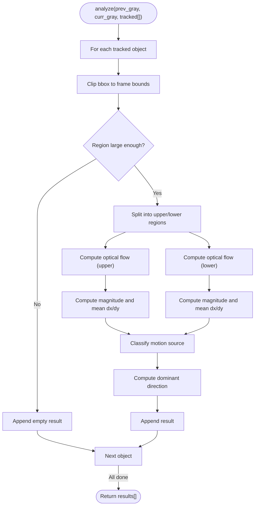
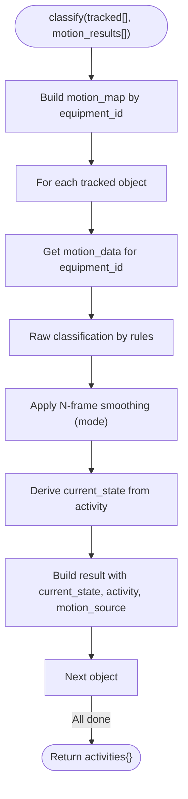
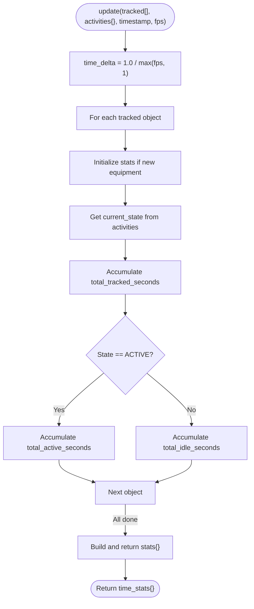
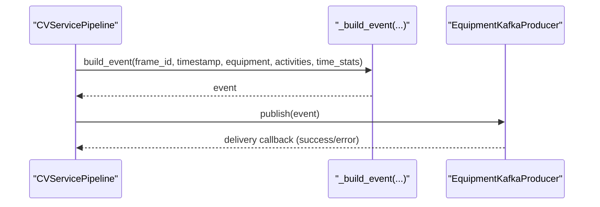
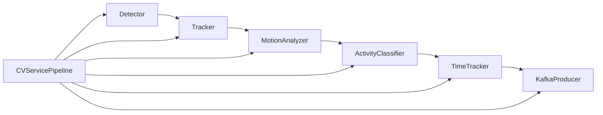

# Frame Processing Workflow

<cite>
**Referenced Files in This Document**
- [main.py](file://services/cv_service/src/main.py)
- [detector.py](file://services/cv_service/src/detector.py)
- [tracker.py](file://services/cv_service/src/tracker.py)
- [motion_analyzer.py](file://services/cv_service/src/motion_analyzer.py)
- [activity_classifier.py](file://services/cv_service/src/activity_classifier.py)
- [time_tracker.py](file://services/cv_service/src/time_tracker.py)
- [kafka_producer.py](file://services/cv_service/src/kafka_producer.py)
- [settings.yaml](file://config/settings.yaml)
- [frame_producer.py](file://services/video_ingestion/src/frame_producer.py)
- [test_activity_classifier.py](file://tests/test_activity_classifier.py)
</cite>

## Table of Contents
1. [Introduction](#introduction)
2. [Project Structure](#project-structure)
3. [Core Components](#core-components)
4. [Architecture Overview](#architecture-overview)
5. [Detailed Component Analysis](#detailed-component-analysis)
6. [Dependency Analysis](#dependency-analysis)
7. [Performance Considerations](#performance-considerations)
8. [Troubleshooting Guide](#troubleshooting-guide)
9. [Conclusion](#conclusion)
10. [Appendices](#appendices)

## Introduction
This document explains the CV Service frame processing workflow, focusing on the orchestration of the complete pipeline: detection, tracking, motion analysis, activity classification, time tracking, and event publishing. It details the process_frame method that drives the per-frame processing, the frame iteration process including frame skipping, resizing, and timestamp calculation, and the data flow between components. Practical examples, error handling strategies, and performance optimization techniques are included to help debug and tune processing for different video characteristics.

## Project Structure
The CV Service pipeline resides under services/cv_service/src and integrates with configuration from config/settings.yaml. The video ingestion service provides an alternative frame producer that mirrors the same frame processing concepts.

**Diagram sources**
- [main.py:42-498](file://services/cv_service/src/main.py#L42-L498)
- [detector.py:18-170](file://services/cv_service/src/detector.py#L18-L170)
- [tracker.py:19-341](file://services/cv_service/src/tracker.py#L19-L341)
- [motion_analyzer.py:24-442](file://services/cv_service/src/motion_analyzer.py#L24-L442)
- [activity_classifier.py:23-306](file://services/cv_service/src/activity_classifier.py#L23-L306)
- [time_tracker.py:21-265](file://services/cv_service/src/time_tracker.py#L21-L265)
- [kafka_producer.py:17-228](file://services/cv_service/src/kafka_producer.py#L17-L228)
- [settings.yaml:1-59](file://config/settings.yaml#L1-L59)
- [frame_producer.py:144-414](file://services/video_ingestion/src/frame_producer.py#L144-L414)

**Section sources**
- [main.py:42-498](file://services/cv_service/src/main.py#L42-L498)
- [settings.yaml:1-59](file://config/settings.yaml#L1-L59)
- [frame_producer.py:144-414](file://services/video_ingestion/src/frame_producer.py#L144-L414)

## Core Components
- CVServicePipeline: Orchestrates the entire pipeline, manages configuration, initializes components, iterates frames, and publishes events.
- EquipmentDetector: Runs YOLOv8 inference to detect equipment in frames.
- EquipmentTracker: Maintains persistent IDs across frames using ByteTrack.
- MotionAnalyzer: Computes region-based optical flow to distinguish articulated motion from full-body motion.
- ActivityClassifier: Applies rule-based classification with smoothing to derive activities.
- TimeTracker: Accumulates utilization metrics per equipment over time.
- EquipmentKafkaProducer: Publishes structured events to Kafka with delivery callbacks and retries.

**Section sources**
- [main.py:42-498](file://services/cv_service/src/main.py#L42-L498)
- [detector.py:18-170](file://services/cv_service/src/detector.py#L18-L170)
- [tracker.py:19-341](file://services/cv_service/src/tracker.py#L19-L341)
- [motion_analyzer.py:24-442](file://services/cv_service/src/motion_analyzer.py#L24-L442)
- [activity_classifier.py:23-306](file://services/cv_service/src/activity_classifier.py#L23-L306)
- [time_tracker.py:21-265](file://services/cv_service/src/time_tracker.py#L21-L265)
- [kafka_producer.py:17-228](file://services/cv_service/src/kafka_producer.py#L17-L228)

## Architecture Overview
The pipeline processes each frame through a deterministic sequence, passing intermediate results between components and building a Kafka event payload for each tracked equipment.

**Diagram sources**
- [main.py:323-421](file://services/cv_service/src/main.py#L323-L421)
- [detector.py:85-170](file://services/cv_service/src/detector.py#L85-L170)
- [tracker.py:159-264](file://services/cv_service/src/tracker.py#L159-L264)
- [motion_analyzer.py:88-166](file://services/cv_service/src/motion_analyzer.py#L88-L166)
- [activity_classifier.py:71-125](file://services/cv_service/src/activity_classifier.py#L71-L125)
- [time_tracker.py:53-120](file://services/cv_service/src/time_tracker.py#L53-L120)
- [kafka_producer.py:91-169](file://services/cv_service/src/kafka_producer.py#L91-L169)

## Detailed Component Analysis

### Frame Iteration and Processing Loop
- Frame iteration: The iterator reads frames from a video, applies frame skipping, calculates timestamps, resizes frames, and yields (frame_id, timestamp, frame).
- Frame skipping: Controlled by configuration to reduce computational load.
- Timestamp calculation: Derived from frame index and FPS; formatted as HH:MM:SS.mmm.
- Resizing: Maintains aspect ratio to a target width.

**Diagram sources**
- [main.py:184-253](file://services/cv_service/src/main.py#L184-L253)

**Section sources**
- [main.py:184-253](file://services/cv_service/src/main.py#L184-L253)
- [settings.yaml:3-6](file://config/settings.yaml#L3-L6)

### Detection
- Loads a YOLOv8 model and runs inference on the frame.
- Filters detections by target classes and confidence threshold.
- Returns structured detections with bounding boxes, confidence, and class info.

**Diagram sources**
- [detector.py:85-170](file://services/cv_service/src/detector.py#L85-L170)

**Section sources**
- [detector.py:85-170](file://services/cv_service/src/detector.py#L85-L170)
- [settings.yaml:8-19](file://config/settings.yaml#L8-L19)

### Tracking
- Converts detections to supervision Detections format.
- Updates ByteTrack to assign persistent track IDs.
- Generates friendly equipment IDs with class-based prefixes.
- Matches tracked detections back to original class names.

**Diagram sources**
- [tracker.py:159-264](file://services/cv_service/src/tracker.py#L159-L264)

**Section sources**
- [tracker.py:159-264](file://services/cv_service/src/tracker.py#L159-L264)
- [settings.yaml:21-29](file://config/settings.yaml#L21-L29)

### Motion Analysis
- Splits each tracked object’s bounding box into upper (arm/boom) and lower (base/tracks) regions.
- Computes optical flow for each region using Farneback.
- Computes magnitudes and mean flow vectors per region.
- Classifies motion source as full_body, arm_only, or none.
- Determines dominant direction from the active region.

**Diagram sources**
- [motion_analyzer.py:88-166](file://services/cv_service/src/motion_analyzer.py#L88-L166)
- [motion_analyzer.py:192-251](file://services/cv_service/src/motion_analyzer.py#L192-L251)

**Section sources**
- [motion_analyzer.py:88-166](file://services/cv_service/src/motion_analyzer.py#L88-L166)
- [settings.yaml:31-34](file://config/settings.yaml#L31-L34)

### Activity Classification
- Builds a motion map keyed by equipment_id.
- Applies rule-based classification:
  - DIGGING: arm_only and dominant vertical downward motion.
  - DUMPING: arm_only and dominant vertical upward motion.
  - SWINGING_LOADING: horizontal motion (arm_only or full_body).
  - WAITING: no motion.
- Applies N-frame smoothing to prevent flickering between states.

**Diagram sources**
- [activity_classifier.py:71-125](file://services/cv_service/src/activity_classifier.py#L71-L125)
- [activity_classifier.py:166-232](file://services/cv_service/src/activity_classifier.py#L166-L232)
- [activity_classifier.py:233-287](file://services/cv_service/src/activity_classifier.py#L233-L287)

**Section sources**
- [activity_classifier.py:71-125](file://services/cv_service/src/activity_classifier.py#L71-L125)
- [settings.yaml:36-39](file://config/settings.yaml#L36-L39)

### Time Tracking
- Increments counters per tracked equipment for total_tracked_seconds, total_active_seconds, and total_idle_seconds.
- Calculates utilization_percent as total_active_seconds / total_tracked_seconds.
- Uses 1/fps increments per processed frame.

**Diagram sources**
- [time_tracker.py:53-120](file://services/cv_service/src/time_tracker.py#L53-L120)
- [time_tracker.py:157-199](file://services/cv_service/src/time_tracker.py#L157-L199)

**Section sources**
- [time_tracker.py:53-120](file://services/cv_service/src/time_tracker.py#L53-L120)

### Event Building and Publishing
- Builds a structured event per tracked equipment with frame_id, equipment_id, equipment_class, timestamp, utilization, and time_analytics.
- Publishes to Kafka topic with delivery callbacks and retry/backoff behavior.

**Diagram sources**
- [main.py:270-321](file://services/cv_service/src/main.py#L270-L321)
- [kafka_producer.py:91-169](file://services/cv_service/src/kafka_producer.py#L91-L169)

**Section sources**
- [main.py:270-321](file://services/cv_service/src/main.py#L270-L321)
- [kafka_producer.py:91-169](file://services/cv_service/src/kafka_producer.py#L91-L169)
- [settings.yaml:41-45](file://config/settings.yaml#L41-L45)

## Dependency Analysis
The pipeline exhibits tight coupling among components, with clear data dependencies:
- Detector depends on YOLOv8 model and configuration.
- Tracker depends on supervision ByteTrack and configuration.
- MotionAnalyzer depends on OpenCV optical flow and configuration.
- ActivityClassifier depends on MotionAnalyzer outputs and configuration.
- TimeTracker depends on ActivityClassifier outputs and timestamping.
- KafkaProducer depends on configuration and external Kafka cluster.

**Diagram sources**
- [main.py:42-498](file://services/cv_service/src/main.py#L42-L498)
- [detector.py:18-170](file://services/cv_service/src/detector.py#L18-L170)
- [tracker.py:19-341](file://services/cv_service/src/tracker.py#L19-L341)
- [motion_analyzer.py:24-442](file://services/cv_service/src/motion_analyzer.py#L24-L442)
- [activity_classifier.py:23-306](file://services/cv_service/src/activity_classifier.py#L23-L306)
- [time_tracker.py:21-265](file://services/cv_service/src/time_tracker.py#L21-L265)
- [kafka_producer.py:17-228](file://services/cv_service/src/kafka_producer.py#L17-L228)

**Section sources**
- [main.py:42-498](file://services/cv_service/src/main.py#L42-L498)

## Performance Considerations
- Frame skipping: Reduce processing load by skipping frames (configured via frame_skip).
- Resizing: Downscale frames to a target width to reduce inference cost.
- Device selection: Use GPU acceleration when available for YOLOv8 and optical flow.
- Batch-like behavior: Kafka producer batches messages with linger.ms and batch.size.
- Smoothing window: Tune smoothing_window to balance responsiveness vs. flicker suppression.
- Region size: Ensure regions are large enough for reliable optical flow; otherwise, motion is classified conservatively.

Practical tips:
- For low-FPS or long-duration videos, increase frame_skip to reduce CPU usage.
- For high-resolution videos, adjust resize_width to fit memory constraints.
- For scenes with minimal motion, increase magnitude_threshold to avoid false positives.
- For fast-moving equipment, consider reducing smoothing_window to improve responsiveness.

**Section sources**
- [settings.yaml:3-6](file://config/settings.yaml#L3-L6)
- [settings.yaml:8-19](file://config/settings.yaml#L8-L19)
- [settings.yaml:31-39](file://config/settings.yaml#L31-L39)
- [kafka_producer.py:40-53](file://services/cv_service/src/kafka_producer.py#L40-L53)

## Troubleshooting Guide
Common issues and resolutions:
- Model loading failures: Verify model path and device availability; check logs for runtime errors.
  - See [detector.py:68-76](file://services/cv_service/src/detector.py#L68-L76)
- Empty or invalid frames: Detector and tracker handle empty frames gracefully; ensure input frames are valid.
  - See [detector.py:110-112](file://services/cv_service/src/detector.py#L110-L112), [tracker.py:192-194](file://services/cv_service/src/tracker.py#L192-L194)
- Optical flow computation errors: Farneback requires sufficient region size; results fall back to conservative defaults.
  - See [motion_analyzer.py:276-292](file://services/cv_service/src/motion_analyzer.py#L276-L292)
- Kafka delivery failures: Producer uses acks=all, retries, and callbacks; monitor pending messages and flush on shutdown.
  - See [kafka_producer.py:60-68](file://services/cv_service/src/kafka_producer.py#L60-L68), [kafka_producer.py:170-191](file://services/cv_service/src/kafka_producer.py#L170-L191)
- Activity flickering: Increase smoothing_window to stabilize classifications.
  - See [activity_classifier.py:57](file://services/cv_service/src/activity_classifier.py#L57)
- Time tracking anomalies: Ensure fps is correctly derived and passed to TimeTracker.update().
  - See [main.py:398](file://services/cv_service/src/main.py#L398), [time_tracker.py:82-86](file://services/cv_service/src/time_tracker.py#L82-L86)

Debugging examples:
- Inspect motion results for a specific equipment_id to confirm region splitting and flow computation.
  - See [motion_analyzer.py:130-166](file://services/cv_service/src/motion_analyzer.py#L130-L166)
- Validate activity history and smoothing behavior using test patterns.
  - See [test_activity_classifier.py:219-277](file://tests/test_activity_classifier.py#L219-L277)
- Confirm Kafka connectivity and event delivery by checking producer logs and pending messages.
  - See [kafka_producer.py:80-89](file://services/cv_service/src/kafka_producer.py#L80-L89), [kafka_producer.py:216](file://services/cv_service/src/kafka_producer.py#L216)

**Section sources**
- [detector.py:68-76](file://services/cv_service/src/detector.py#L68-L76)
- [detector.py:110-112](file://services/cv_service/src/detector.py#L110-L112)
- [tracker.py:192-194](file://services/cv_service/src/tracker.py#L192-L194)
- [motion_analyzer.py:276-292](file://services/cv_service/src/motion_analyzer.py#L276-L292)
- [kafka_producer.py:60-68](file://services/cv_service/src/kafka_producer.py#L60-L68)
- [kafka_producer.py:80-89](file://services/cv_service/src/kafka_producer.py#L80-L89)
- [kafka_producer.py:216](file://services/cv_service/src/kafka_producer.py#L216)
- [activity_classifier.py:57](file://services/cv_service/src/activity_classifier.py#L57)
- [time_tracker.py:82-86](file://services/cv_service/src/time_tracker.py#L82-L86)
- [test_activity_classifier.py:219-277](file://tests/test_activity_classifier.py#L219-L277)

## Conclusion
The CV Service pipeline provides a robust, modular framework for equipment detection, tracking, motion analysis, activity classification, and time analytics. The process_frame method orchestrates the end-to-end flow, while configuration-driven frame iteration, resizing, and timestamping ensure consistent processing across diverse video characteristics. With built-in error handling, delivery guarantees, and tunable performance controls, the system supports both batch and continuous processing modes.

## Appendices

### API and Data Flow Reference
- process_frame signature and return types:
  - Inputs: frame_id, timestamp, frame, prev_gray, fps
  - Outputs: events list, current gray frame
  - See [main.py:323-372](file://services/cv_service/src/main.py#L323-L372)
- Event schema published to Kafka:
  - Fields: frame_id, equipment_id, equipment_class, timestamp, utilization, time_analytics
  - See [main.py:270-321](file://services/cv_service/src/main.py#L270-L321), [kafka_producer.py:95-112](file://services/cv_service/src/kafka_producer.py#L95-L112)

**Section sources**
- [main.py:323-372](file://services/cv_service/src/main.py#L323-L372)
- [main.py:270-321](file://services/cv_service/src/main.py#L270-L321)
- [kafka_producer.py:95-112](file://services/cv_service/src/kafka_producer.py#L95-L112)