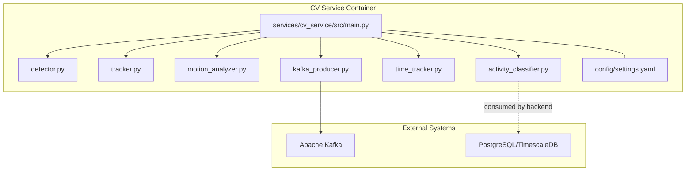
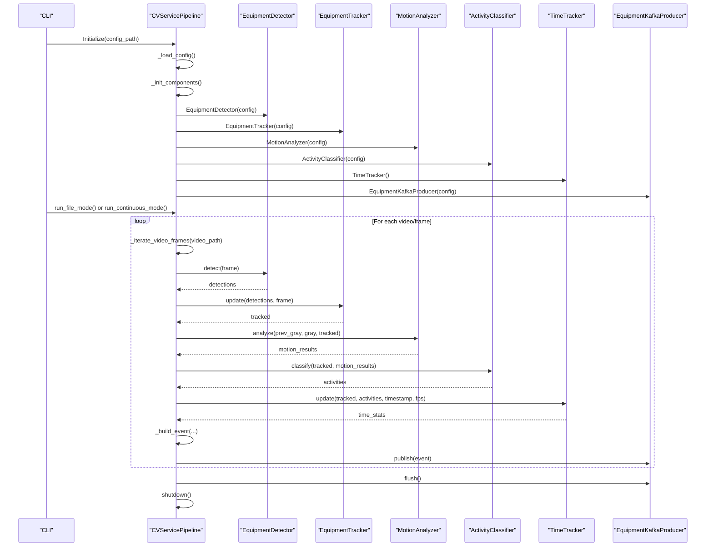
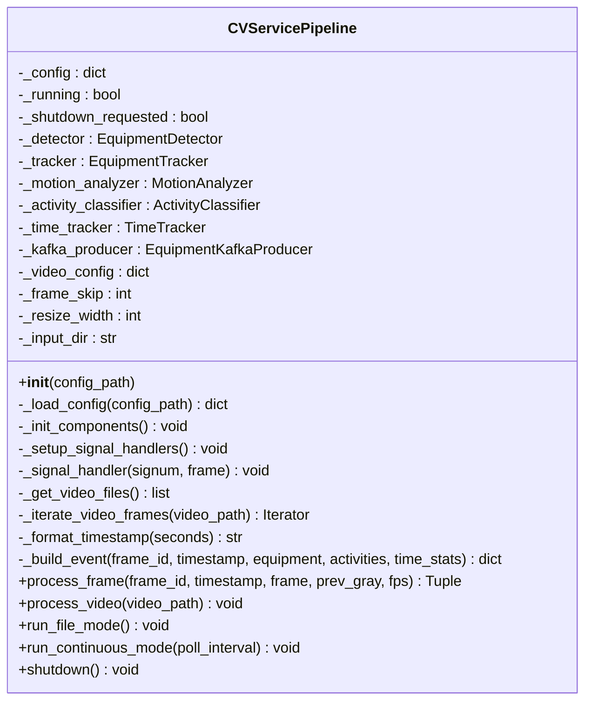
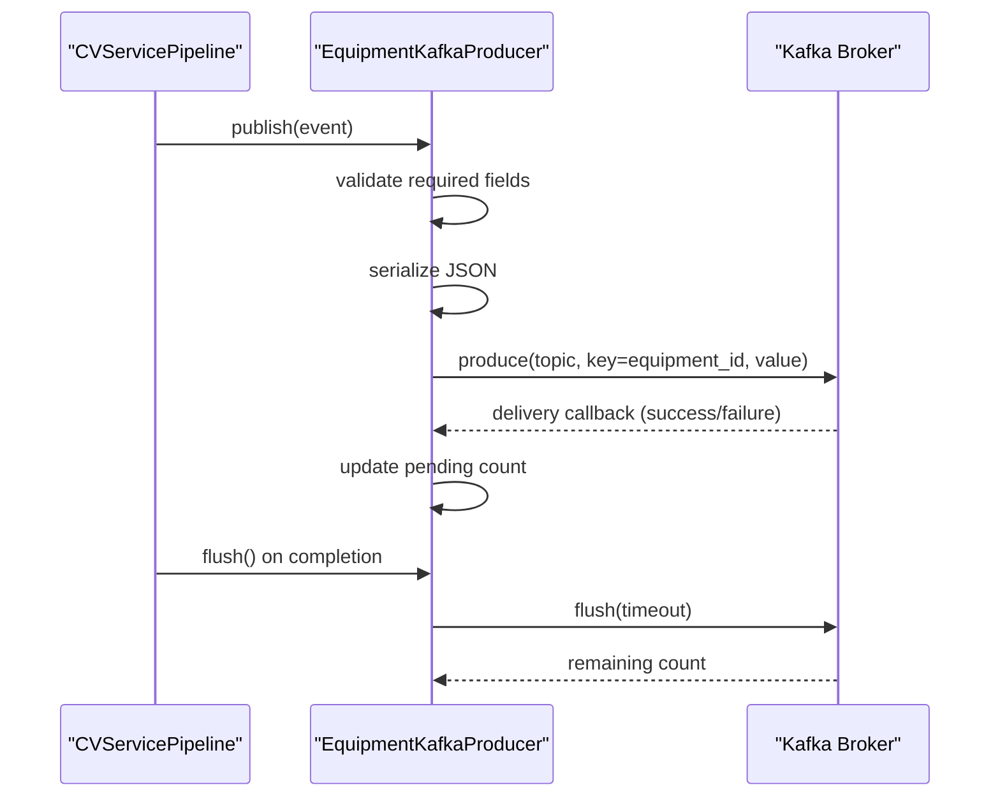
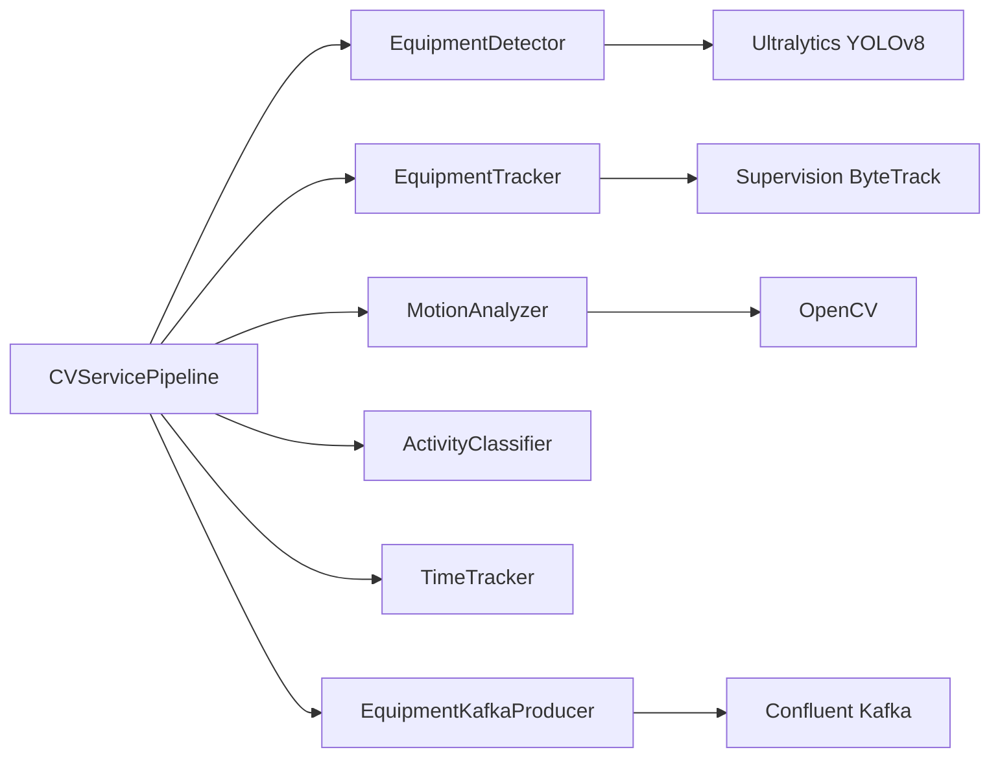

# Pipeline Orchestration

<cite>
**Referenced Files in This Document**
- [main.py](file://services/cv_service/src/main.py)
- [kafka_producer.py](file://services/cv_service/src/kafka_producer.py)
- [detector.py](file://services/cv_service/src/detector.py)
- [tracker.py](file://services/cv_service/src/tracker.py)
- [motion_analyzer.py](file://services/cv_service/src/motion_analyzer.py)
- [activity_classifier.py](file://services/cv_service/src/activity_classifier.py)
- [time_tracker.py](file://services/cv_service/src/time_tracker.py)
- [settings.yaml](file://config/settings.yaml)
- [Dockerfile](file://services/cv_service/Dockerfile)
- [docker-compose.yml](file://docker-compose.yml)
- [README.md](file://README.md)
</cite>

## Table of Contents
1. [Introduction](#introduction)
2. [Project Structure](#project-structure)
3. [Core Components](#core-components)
4. [Architecture Overview](#architecture-overview)
5. [Detailed Component Analysis](#detailed-component-analysis)
6. [Dependency Analysis](#dependency-analysis)
7. [Performance Considerations](#performance-considerations)
8. [Troubleshooting Guide](#troubleshooting-guide)
9. [Conclusion](#conclusion)
10. [Appendices](#appendices)

## Introduction
This document describes the CV Service pipeline orchestration component responsible for processing video streams through a computer vision pipeline and publishing events to Apache Kafka. It covers the CVServicePipeline class architecture, configuration loading, component initialization, signal handling for graceful shutdown, processing modes (file and continuous), frame processing workflow, logging, error handling, resource cleanup, Kafka integration, and modular design enabling independent development and testing.

## Project Structure
The CV Service pipeline resides under services/cv_service/src and integrates with shared configuration in config/settings.yaml. Docker and docker-compose define container orchestration and mounting of configuration and video directories.

**Diagram sources**
- [main.py:42-498](file://services/cv_service/src/main.py#L42-L498)
- [detector.py:18-170](file://services/cv_service/src/detector.py#L18-L170)
- [tracker.py:19-341](file://services/cv_service/src/tracker.py#L19-L341)
- [motion_analyzer.py:24-442](file://services/cv_service/src/motion_analyzer.py#L24-L442)
- [activity_classifier.py:23-306](file://services/cv_service/src/activity_classifier.py#L23-L306)
- [time_tracker.py:21-265](file://services/cv_service/src/time_tracker.py#L21-L265)
- [kafka_producer.py:17-228](file://services/cv_service/src/kafka_producer.py#L17-L228)
- [settings.yaml:1-59](file://config/settings.yaml#L1-L59)

**Section sources**
- [README.md:340-384](file://README.md#L340-L384)
- [docker-compose.yml:51-63](file://docker-compose.yml#L51-L63)

## Core Components
- CVServicePipeline: Orchestrates configuration loading, component initialization, frame iteration, pipeline processing, and shutdown handling. Supports file mode (batch) and continuous mode (watch-and-process).
- EquipmentDetector: YOLOv8-based equipment detection with configurable targets and class mapping.
- EquipmentTracker: ByteTrack-based multi-object tracking with persistent equipment IDs.
- MotionAnalyzer: Region-based optical flow analysis to distinguish articulated motion from whole-body motion.
- ActivityClassifier: Rule-based classification with N-frame smoothing to produce stable activity states.
- TimeTracker: Accumulates utilization metrics per equipment across frames.
- EquipmentKafkaProducer: Asynchronous Kafka producer with delivery callbacks, retry/backoff, and flush/close semantics.

**Section sources**
- [main.py:42-498](file://services/cv_service/src/main.py#L42-L498)
- [detector.py:18-170](file://services/cv_service/src/detector.py#L18-L170)
- [tracker.py:19-341](file://services/cv_service/src/tracker.py#L19-L341)
- [motion_analyzer.py:24-442](file://services/cv_service/src/motion_analyzer.py#L24-L442)
- [activity_classifier.py:23-306](file://services/cv_service/src/activity_classifier.py#L23-L306)
- [time_tracker.py:21-265](file://services/cv_service/src/time_tracker.py#L21-L265)
- [kafka_producer.py:17-228](file://services/cv_service/src/kafka_producer.py#L17-L228)

## Architecture Overview
The CV Service pipeline is a modular, event-driven system:
- Configuration is loaded from YAML with multiple fallback paths.
- Video frames are iterated with frame skipping and resizing.
- Each frame is processed through detection, tracking, motion analysis, activity classification, and time tracking.
- Events are built and published to Kafka with partitioning by equipment_id.
- Continuous mode monitors a directory for new videos; file mode processes existing videos and exits.

**Diagram sources**
- [main.py:42-498](file://services/cv_service/src/main.py#L42-L498)
- [kafka_producer.py:17-228](file://services/cv_service/src/kafka_producer.py#L17-L228)

## Detailed Component Analysis

### CVServicePipeline Class
Responsibilities:
- Configuration loading from YAML with multiple search paths.
- Component initialization for detector, tracker, motion analyzer, activity classifier, time tracker, and Kafka producer.
- Signal handling for SIGTERM/SIGINT to enable graceful shutdown.
- Video file discovery and iteration with frame skipping and resizing.
- End-to-end frame processing through the CV pipeline.
- Event building and publishing to Kafka.
- Two processing modes:
  - File mode: processes all videos in the input directory and exits.
  - Continuous mode: watches the input directory and processes newly added videos.

Key behaviors:
- Configuration resolution attempts multiple paths and raises a clear error if not found.
- Frame iteration calculates effective FPS based on frame_skip and resizes frames according to configuration.
- Pipeline stages are invoked in a fixed order: detect -> track -> motion -> classify -> time tracking -> build event -> publish.
- Shutdown sets a flag and ensures Kafka producer flush/close.

Operational characteristics:
- Logging at INFO level by default; supports changing log level via CLI.
- Graceful shutdown via signal handlers; processing stops when shutdown is requested.
- Resource cleanup includes releasing video capture and closing Kafka producer.

Practical examples:
- Startup in file mode: python -m src.main --mode file --config /app/config/settings.yaml --log-level INFO
- Startup in continuous mode: python -m src.main --mode continuous --poll-interval 5.0

**Section sources**
- [main.py:42-498](file://services/cv_service/src/main.py#L42-L498)
- [settings.yaml:3-6](file://config/settings.yaml#L3-L6)

#### Class Diagram

**Diagram sources**
- [main.py:42-498](file://services/cv_service/src/main.py#L42-L498)

### EquipmentKafkaProducer
Responsibilities:
- Asynchronously publish equipment events to Kafka with JSON serialization.
- Partition messages by equipment_id to preserve ordering per equipment.
- Manage producer lifecycle: initialization, delivery callbacks, flush, and close.
- Robustness against local queue pressure and Kafka exceptions.

Key behaviors:
- Producer configuration includes acks=all, retries, linger, and batch sizing for reliability and throughput.
- Delivery callback decrements pending count and logs failures.
- Publish validates required fields and handles buffer full conditions by flushing and retrying once.
- Flush waits up to a timeout and reports remaining messages.
- Close ensures flush with generous timeout and logs undelivered messages.

Operational characteristics:
- Uses confluent-kafka Python client.
- Exposes properties for connection status and pending message count.
- Context manager support via __enter__/__exit__.

**Section sources**
- [kafka_producer.py:17-228](file://services/cv_service/src/kafka_producer.py#L17-L228)
- [settings.yaml:41-45](file://config/settings.yaml#L41-L45)

#### Sequence Diagram: Event Publishing Flow

**Diagram sources**
- [main.py:374-421](file://services/cv_service/src/main.py#L374-L421)
- [kafka_producer.py:91-192](file://services/cv_service/src/kafka_producer.py#L91-L192)

### EquipmentDetector
Responsibilities:
- Load YOLOv8 model and filter detections to target classes with confidence threshold.
- Return structured detection results with bounding boxes, confidence, class_id, and class_name.

Key behaviors:
- Validates required configuration keys and raises ValueError if missing.
- Loads model with specified device and input size.
- Filters detections by target_classes and confidence_threshold.
- Converts bounding boxes to lists and class ids to friendly names.

Operational characteristics:
- Uses Ultralytics YOLOv8.
- Handles inference errors gracefully by returning empty results.

**Section sources**
- [detector.py:18-170](file://services/cv_service/src/detector.py#L18-L170)
- [settings.yaml:8-20](file://config/settings.yaml#L8-L20)

### EquipmentTracker
Responsibilities:
- Maintain persistent equipment IDs across frames using ByteTrack.
- Generate friendly IDs with class-based prefixes and sequential numbering.
- Map tracked detections back to original class names.

Key behaviors:
- Initializes ByteTrack with configurable thresholds.
- Generates equipment_id using class-specific prefixes and counters.
- Matches tracked detections to original detections by IoU to recover class names.
- Resets state to clear mappings and counters.

Operational characteristics:
- Uses Supervision ByteTrack.
- Handles empty detections and update failures gracefully.

**Section sources**
- [tracker.py:19-341](file://services/cv_service/src/tracker.py#L19-L341)
- [settings.yaml:21-30](file://config/settings.yaml#L21-L30)

### MotionAnalyzer
Responsibilities:
- Compute region-based optical flow to distinguish articulated motion from whole-body motion.
- Classify motion source per tracked equipment and summarize dominant direction.

Key behaviors:
- Splits bounding box into upper (arm/boom) and lower (base/tracks) regions.
- Computes Farneback optical flow for each region and aggregates statistics.
- Classifies motion as full_body, arm_only, or none based on magnitude thresholds.
- Determines dominant direction from active region(s).

Operational characteristics:
- Uses OpenCV calcOpticalFlowFarneback with tuned parameters.
- Validates region sizes and handles computation failures.

**Section sources**
- [motion_analyzer.py:24-442](file://services/cv_service/src/motion_analyzer.py#L24-L442)
- [settings.yaml:31-35](file://config/settings.yaml#L31-L35)

### ActivityClassifier
Responsibilities:
- Classify equipment activity using rule-based logic with N-frame smoothing.
- Map motion analysis results to activities: DIGGING, SWINGING_LOADING, DUMPING, WAITING.

Key behaviors:
- Builds a motion map keyed by equipment_id.
- Applies rules based on motion_source and flow vector thresholds.
- Uses sliding window mode voting to reduce flickering.
- Produces current_state (ACTIVE/INACTIVE) derived from smoothed activity.

Operational characteristics:
- Configurable smoothing window and directional thresholds.
- History maintained per equipment_id.

**Section sources**
- [activity_classifier.py:23-306](file://services/cv_service/src/activity_classifier.py#L23-L306)
- [settings.yaml:36-40](file://config/settings.yaml#L36-L40)

### TimeTracker
Responsibilities:
- Accumulate utilization metrics per equipment: total tracked seconds, active seconds, idle seconds, and utilization percentage.
- Update counters per frame based on activity states.

Key behaviors:
- Calculates time delta from FPS and increments counters accordingly.
- Builds per-equipment statistics including utilization_percent.
- Supports reset for new video processing sessions.

Operational characteristics:
- Operates on frame timestamps and activity states.
- Provides aggregate statistics across all tracked equipment.

**Section sources**
- [time_tracker.py:21-265](file://services/cv_service/src/time_tracker.py#L21-L265)

## Dependency Analysis
- Internal dependencies:
  - CVServicePipeline depends on all pipeline components and Kafka producer.
  - Each stage depends on the previous stage’s output (e.g., tracker depends on detector).
- External dependencies:
  - OpenCV for video I/O and optical flow.
  - NumPy for array operations.
  - YAML for configuration parsing.
  - Confluent Kafka for event streaming.
  - Ultralytics YOLOv8 and Supervision for detection and tracking.

**Diagram sources**
- [main.py:24-29](file://services/cv_service/src/main.py#L24-L29)
- [requirements.txt:1-7](file://services/cv_service/requirements.txt#L1-L7)

**Section sources**
- [requirements.txt:1-7](file://services/cv_service/requirements.txt#L1-L7)

## Performance Considerations
- CPU optimization strategies:
  - YOLOv8n (nano) model for lightweight inference.
  - Frame skipping reduces processing load (default 3).
  - Frame resizing to 640px width balances accuracy and speed.
  - Region-based optical flow limits computation to bounding boxes.
- Kafka producer tuning:
  - acks=all, retries, and linger/batch settings balance reliability and throughput.
- Practical tuning tips:
  - Increase frame_skip or reduce resize_width to save CPU.
  - Adjust smoothing_window to reduce flickering at the cost of responsiveness.
  - Tune magnitude and directional thresholds for motion sensitivity.

[No sources needed since this section provides general guidance]

## Troubleshooting Guide
Common issues and resolutions:
- Configuration not found:
  - The pipeline searches multiple paths and raises a clear error if none exist. Ensure config is mounted at /app/config/settings.yaml or specify --config explicitly.
- Video directory issues:
  - If input_dir does not exist, the pipeline logs a warning and processes no files. Mount the videos directory or adjust input_dir.
- Model loading failures:
  - Detector raises RuntimeError if model fails to load. Verify model path and device compatibility.
- Kafka connectivity:
  - Producer initialization logs errors if Kafka is unreachable. Ensure Kafka is healthy and reachable at bootstrap_servers.
- Graceful shutdown:
  - SIGTERM/SIGINT triggers shutdown; pipeline flushes Kafka and releases resources. Allow time for flush on shutdown.

**Section sources**
- [main.py:69-102](file://services/cv_service/src/main.py#L69-L102)
- [main.py:143-159](file://services/cv_service/src/main.py#L143-L159)
- [kafka_producer.py:59-68](file://services/cv_service/src/kafka_producer.py#L59-L68)

## Conclusion
The CV Service pipeline orchestration component provides a robust, modular, and efficient framework for processing video streams into actionable equipment utilization events. Its design emphasizes configurability, reliability, and maintainability, enabling independent development and testing of each pipeline stage while integrating seamlessly with Kafka for downstream analytics.

[No sources needed since this section summarizes without analyzing specific files]

## Appendices

### Configuration Management
- Search paths for settings.yaml:
  - Explicit config_path argument
  - /app/config/settings.yaml
  - config/settings.yaml
  - ../../../config/settings.yaml
- Centralized parameters:
  - video: frame_skip, resize_width, input_dir
  - detection: model, confidence_threshold, device, input_size, target_classes, class_names
  - tracking: track_thresh, track_buffer, match_thresh, equipment_id_prefix
  - motion: magnitude_threshold, upper_region_ratio, flow_method
  - activity: smoothing_window, vertical_flow_threshold, horizontal_flow_threshold
  - kafka: bootstrap_servers, topic, client_id, consumer_group
  - database and dashboard sections for related services

**Section sources**
- [main.py:69-102](file://services/cv_service/src/main.py#L69-L102)
- [settings.yaml:3-59](file://config/settings.yaml#L3-L59)

### Operational Examples
- Service startup:
  - File mode: python -m src.main --mode file --config /app/config/settings.yaml --log-level INFO
  - Continuous mode: python -m src.main --mode continuous --poll-interval 5.0
- Docker and volumes:
  - Videos directory mounted at /app/videos
  - Config directory mounted at /app/config
- Kafka topic:
  - Topic name: equipment-events

**Section sources**
- [main.py:500-571](file://services/cv_service/src/main.py#L500-L571)
- [docker-compose.yml:58-62](file://docker-compose.yml#L58-L62)
- [settings.yaml:41-45](file://config/settings.yaml#L41-L45)

### Kafka Event Schema
- Fields:
  - frame_id, equipment_id, equipment_class, timestamp
  - utilization: current_state, current_activity, motion_source
  - time_analytics: total_tracked_seconds, total_active_seconds, total_idle_seconds, utilization_percent

**Section sources**
- [main.py:270-322](file://services/cv_service/src/main.py#L270-L322)
- [kafka_producer.py:95-112](file://services/cv_service/src/kafka_producer.py#L95-L112)