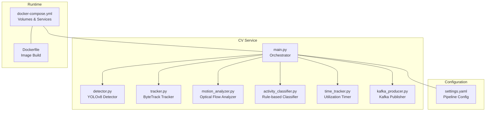
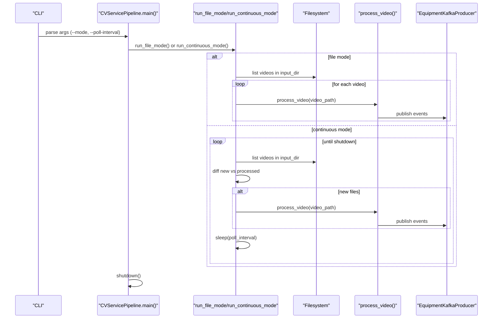
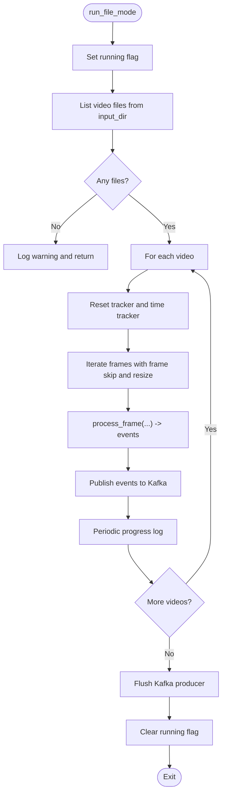
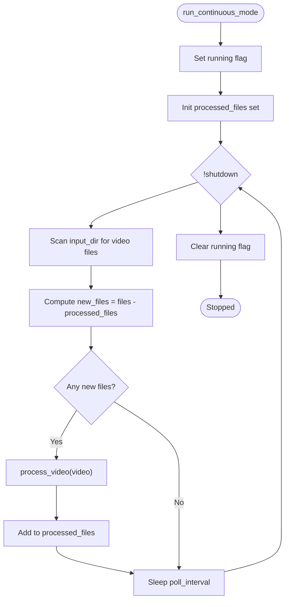
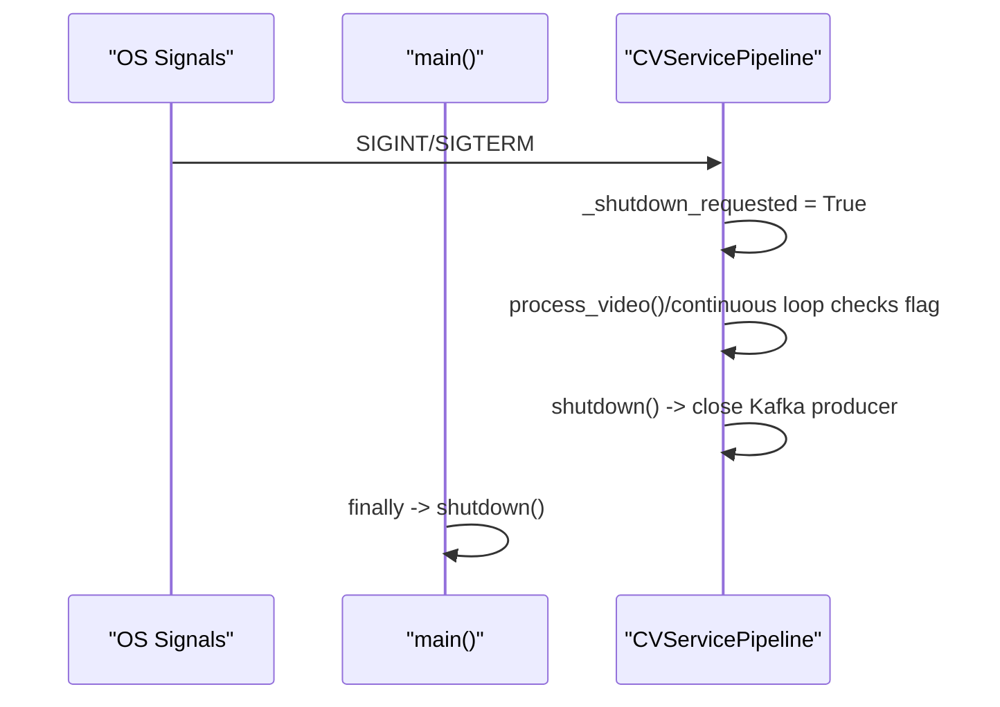
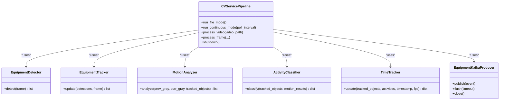
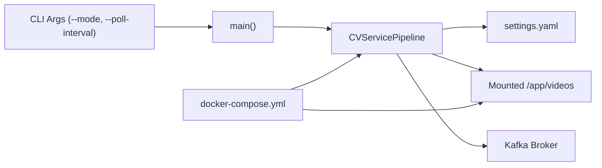

# Processing Modes

<cite>
**Referenced Files in This Document**
- [main.py](file://services/cv_service/src/main.py)
- [settings.yaml](file://config/settings.yaml)
- [docker-compose.yml](file://docker-compose.yml)
- [Dockerfile](file://services/cv_service/Dockerfile)
- [detector.py](file://services/cv_service/src/detector.py)
- [tracker.py](file://services/cv_service/src/tracker.py)
- [motion_analyzer.py](file://services/cv_service/src/motion_analyzer.py)
- [activity_classifier.py](file://services/cv_service/src/activity_classifier.py)
- [time_tracker.py](file://services/cv_service/src/time_tracker.py)
- [kafka_producer.py](file://services/cv_service/src/kafka_producer.py)
</cite>

## Table of Contents
1. [Introduction](#introduction)
2. [Project Structure](#project-structure)
3. [Core Components](#core-components)
4. [Architecture Overview](#architecture-overview)
5. [Detailed Component Analysis](#detailed-component-analysis)
6. [Dependency Analysis](#dependency-analysis)
7. [Performance Considerations](#performance-considerations)
8. [Troubleshooting Guide](#troubleshooting-guide)
9. [Conclusion](#conclusion)
10. [Appendices](#appendices)

## Introduction
This document explains the CV Service processing modes architecture with a focus on:
- File mode (batch processing): processes all existing videos and exits
- Continuous mode (watcher): monitors directories and processes new files as they appear

It documents the run_file_mode and run_continuous_mode methods, the polling mechanism, file tracking system, graceful shutdown handling, and practical guidance for selecting a mode based on deployment requirements and performance considerations.

## Project Structure
The CV Service is implemented as a modular pipeline orchestrated by a single entrypoint. The processing modes are controlled by command-line arguments and implemented in the main orchestrator.

**Diagram sources**
- [main.py:422-484](file://services/cv_service/src/main.py#L422-L484)
- [settings.yaml:1-59](file://config/settings.yaml#L1-L59)
- [docker-compose.yml:51-63](file://docker-compose.yml#L51-L63)
- [Dockerfile:1-27](file://services/cv_service/Dockerfile#L1-L27)

**Section sources**
- [main.py:500-571](file://services/cv_service/src/main.py#L500-L571)
- [settings.yaml:1-59](file://config/settings.yaml#L1-L59)
- [docker-compose.yml:51-63](file://docker-compose.yml#L51-L63)
- [Dockerfile:1-27](file://services/cv_service/Dockerfile#L1-L27)

## Core Components
- CVServicePipeline: Orchestrates the entire pipeline, loads configuration, initializes components, and exposes run_file_mode and run_continuous_mode.
- EquipmentDetector: YOLOv8-based equipment detection.
- EquipmentTracker: Multi-object tracking using ByteTrack.
- MotionAnalyzer: Region-based optical flow to distinguish articulated motion vs. travel.
- ActivityClassifier: Rule-based classification with smoothing.
- TimeTracker: Accumulates utilization metrics per equipment.
- EquipmentKafkaProducer: Publishes events to Kafka with delivery callbacks and flush/close semantics.

Key configuration parameters impacting modes:
- video.frame_skip: Controls frame sampling for performance.
- video.resize_width: Resizes frames for inference.
- video.input_dir: Directory to scan for video files.
- kafka.bootstrap_servers/topic/client_id: Kafka connectivity and event routing.

**Section sources**
- [main.py:42-142](file://services/cv_service/src/main.py#L42-L142)
- [settings.yaml:3-6](file://config/settings.yaml#L3-L6)
- [settings.yaml:41-46](file://config/settings.yaml#L41-L46)

## Architecture Overview
The CV Service runs either in batch mode or continuous mode. In both modes, the pipeline processes frames, detects and tracks equipment, analyzes motion, classifies activities, tracks time, and publishes events to Kafka. The difference lies in how new video files are discovered and processed.

**Diagram sources**
- [main.py:500-571](file://services/cv_service/src/main.py#L500-L571)
- [main.py:422-484](file://services/cv_service/src/main.py#L422-L484)

## Detailed Component Analysis

### Processing Modes: File Mode vs Continuous Mode
- File mode (run_file_mode):
  - Scans the configured input directory for all video files.
  - Processes each video to completion and exits.
  - Suitable for batch jobs, CI/CD pipelines, or offline analysis.
- Continuous mode (run_continuous_mode):
  - Polls the input directory at a configurable interval.
  - Tracks previously processed files to avoid reprocessing.
  - Processes newly detected files as they appear.
  - Suitable for live ingestion and streaming-like scenarios.

Operational characteristics:
- Graceful shutdown: Both modes honor SIGINT/SIGTERM and stop after completing current tasks.
- Polling interval: Continuous mode sleeps between scans; tune for latency vs. CPU usage trade-offs.
- File tracking: A set of processed file paths prevents duplicate processing in continuous mode.

**Section sources**
- [main.py:422-444](file://services/cv_service/src/main.py#L422-L444)
- [main.py:445-484](file://services/cv_service/src/main.py#L445-L484)

### run_file_mode Method
Behavior:
- Sets running flag, lists video files from input_dir, logs warnings if none found, and processes each video sequentially.
- Calls process_video for each file and flushes Kafka publisher at the end.
- Resets running flag and logs completion.

Key steps:
- Load configuration and initialize components.
- Enumerate video files with supported extensions.
- For each video: reset tracker and time tracker, iterate frames, process through pipeline, publish events, and periodically log progress.
- Flush Kafka producer and report timing.

**Diagram sources**
- [main.py:422-444](file://services/cv_service/src/main.py#L422-L444)
- [main.py:374-421](file://services/cv_service/src/main.py#L374-L421)

**Section sources**
- [main.py:422-444](file://services/cv_service/src/main.py#L422-L444)
- [main.py:374-421](file://services/cv_service/src/main.py#L374-L421)

### run_continuous_mode Method
Behavior:
- Initializes a set to track processed files.
- Enters a loop that:
  - Lists current video files.
  - Identifies new files by set difference.
  - Processes each new file and adds its path to the processed set.
  - Sleeps for poll_interval unless shutdown is requested.
- Handles exceptions by logging and continuing the loop.

Polling mechanism:
- Periodic scanning of input_dir.
- File tracking via a set of processed file paths.
- Shutdown handling via signal handlers and a shutdown flag.

**Diagram sources**
- [main.py:445-484](file://services/cv_service/src/main.py#L445-L484)

**Section sources**
- [main.py:445-484](file://services/cv_service/src/main.py#L445-L484)

### Graceful Shutdown Handling
- Signal handlers for SIGTERM and SIGINT set a shutdown flag.
- The shutdown flag is checked in:
  - Frame iteration loops inside process_video.
  - Continuous mode polling loop.
- The main entrypoint calls pipeline.shutdown() in finally, which closes Kafka producer and releases resources.

**Diagram sources**
- [main.py:143-160](file://services/cv_service/src/main.py#L143-L160)
- [main.py:486-498](file://services/cv_service/src/main.py#L486-L498)
- [main.py:557-567](file://services/cv_service/src/main.py#L557-L567)

**Section sources**
- [main.py:143-160](file://services/cv_service/src/main.py#L143-L160)
- [main.py:486-498](file://services/cv_service/src/main.py#L486-L498)
- [main.py:557-567](file://services/cv_service/src/main.py#L557-L567)

### Pipeline Components Involved in Both Modes
- EquipmentDetector: Loads YOLOv8 model and performs detection with configurable thresholds and device.
- EquipmentTracker: Assigns persistent equipment IDs and maintains track-to-ID mappings.
- MotionAnalyzer: Computes optical flow per region and classifies motion source.
- ActivityClassifier: Applies rule-based classification with smoothing and returns state/activity/motion source.
- TimeTracker: Updates per-equipment time counters and computes utilization percentages.
- EquipmentKafkaProducer: Serializes events and publishes to Kafka with delivery callbacks and flush/close.

**Diagram sources**
- [main.py:42-142](file://services/cv_service/src/main.py#L42-L142)
- [detector.py:18-170](file://services/cv_service/src/detector.py#L18-L170)
- [tracker.py:19-341](file://services/cv_service/src/tracker.py#L19-L341)
- [motion_analyzer.py:24-442](file://services/cv_service/src/motion_analyzer.py#L24-L442)
- [activity_classifier.py:23-306](file://services/cv_service/src/activity_classifier.py#L23-L306)
- [time_tracker.py:21-265](file://services/cv_service/src/time_tracker.py#L21-L265)
- [kafka_producer.py:17-228](file://services/cv_service/src/kafka_producer.py#L17-L228)

**Section sources**
- [main.py:42-142](file://services/cv_service/src/main.py#L42-L142)
- [detector.py:18-170](file://services/cv_service/src/detector.py#L18-L170)
- [tracker.py:19-341](file://services/cv_service/src/tracker.py#L19-L341)
- [motion_analyzer.py:24-442](file://services/cv_service/src/motion_analyzer.py#L24-L442)
- [activity_classifier.py:23-306](file://services/cv_service/src/activity_classifier.py#L23-L306)
- [time_tracker.py:21-265](file://services/cv_service/src/time_tracker.py#L21-L265)
- [kafka_producer.py:17-228](file://services/cv_service/src/kafka_producer.py#L17-L228)

## Dependency Analysis
- Command-line interface controls mode selection and poll interval.
- Configuration file drives video parameters, detection/tracking parameters, and Kafka settings.
- Docker Compose mounts the videos directory and config into the container, enabling file mode and continuous mode to access the same filesystem.

**Diagram sources**
- [main.py:500-571](file://services/cv_service/src/main.py#L500-L571)
- [settings.yaml:3-6](file://config/settings.yaml#L3-L6)
- [docker-compose.yml:58-63](file://docker-compose.yml#L58-L63)

**Section sources**
- [main.py:500-571](file://services/cv_service/src/main.py#L500-L571)
- [settings.yaml:3-6](file://config/settings.yaml#L3-L6)
- [docker-compose.yml:58-63](file://docker-compose.yml#L58-L63)

## Performance Considerations
- Frame sampling: video.frame_skip reduces CPU load by processing every Nth frame. Higher values reduce throughput but improve performance.
- Resize: video.resize_width reduces inference cost; aspect ratio is preserved.
- Device: detector.device selects CPU or CUDA; CPU builds are used in the provided Dockerfile.
- Poll interval: continuous mode --poll-interval trades off latency vs. CPU usage; smaller intervals increase responsiveness but also CPU usage.
- Kafka batching: producer linger and batch size balance throughput and latency; flush/close ensure clean shutdown.

Practical guidance:
- Batch processing (file mode):
  - Use higher frame_skip for large datasets to reduce runtime.
  - Prefer CPU-only deployments for simplicity.
  - Schedule via cron or CI/CD for nightly/offline processing.
- Live ingestion (continuous mode):
  - Use moderate frame_skip to balance accuracy and speed.
  - Tune poll_interval to match expected arrival rate of new videos.
  - Ensure Kafka and database backends can handle sustained throughput.

**Section sources**
- [settings.yaml:3-6](file://config/settings.yaml#L3-L6)
- [main.py:184-254](file://services/cv_service/src/main.py#L184-L254)
- [main.py:445-484](file://services/cv_service/src/main.py#L445-L484)
- [kafka_producer.py:39-53](file://services/cv_service/src/kafka_producer.py#L39-L53)

## Troubleshooting Guide
Common issues and resolutions:
- No video files found in file mode:
  - Verify video.input_dir mount and permissions.
  - Confirm supported extensions (.mp4, .avi, .mov, .mkv, .webm).
- Continuous mode not detecting new files:
  - Ensure the videos directory is mounted and writable.
  - Check poll_interval is reasonable for your workload.
- Kafka delivery failures:
  - Verify bootstrap_servers and topic exist.
  - Check producer buffer and flush behavior during shutdown.
- Graceful shutdown not occurring:
  - Send SIGINT/SIGTERM to the container process.
  - Ensure shutdown flag is respected in loops and frame iteration.

Operational tips:
- Use --log-level to increase verbosity for diagnostics.
- Monitor Kafka producer pending messages and flush timeouts.
- Validate detector model path and device availability.

**Section sources**
- [main.py:161-182](file://services/cv_service/src/main.py#L161-L182)
- [main.py:445-484](file://services/cv_service/src/main.py#L445-L484)
- [kafka_producer.py:170-209](file://services/cv_service/src/kafka_producer.py#L170-L209)

## Conclusion
The CV Service provides two complementary processing modes:
- File mode for batch processing of existing videos
- Continuous mode for ongoing monitoring and processing of new files

Both modes share the same robust pipeline and graceful shutdown semantics. Choose file mode for offline analysis and continuous mode for live ingestion. Tune configuration parameters and deployment settings to meet your performance and latency requirements.

## Appendices

### Mode Selection Checklist
- Deployment type:
  - Batch/offline: file mode
  - Live ingestion/streaming: continuous mode
- Performance targets:
  - Lower CPU usage: increase frame_skip, use CPU-only
  - Lower latency: decrease poll_interval (continuous mode)
- Infrastructure:
  - Ensure Kafka and database are healthy and reachable
  - Mount videos directory and config appropriately

### Parameter Configuration Reference
- video.frame_skip: Integer; default 3
- video.resize_width: Integer; default 640
- video.input_dir: String; default "/app/videos"
- kafka.bootstrap_servers: String; default "kafka:9092"
- kafka.topic: String; default "equipment-events"
- kafka.client_id: String; default "cv-service-producer"

**Section sources**
- [settings.yaml:3-6](file://config/settings.yaml#L3-L6)
- [settings.yaml:41-46](file://config/settings.yaml#L41-L46)