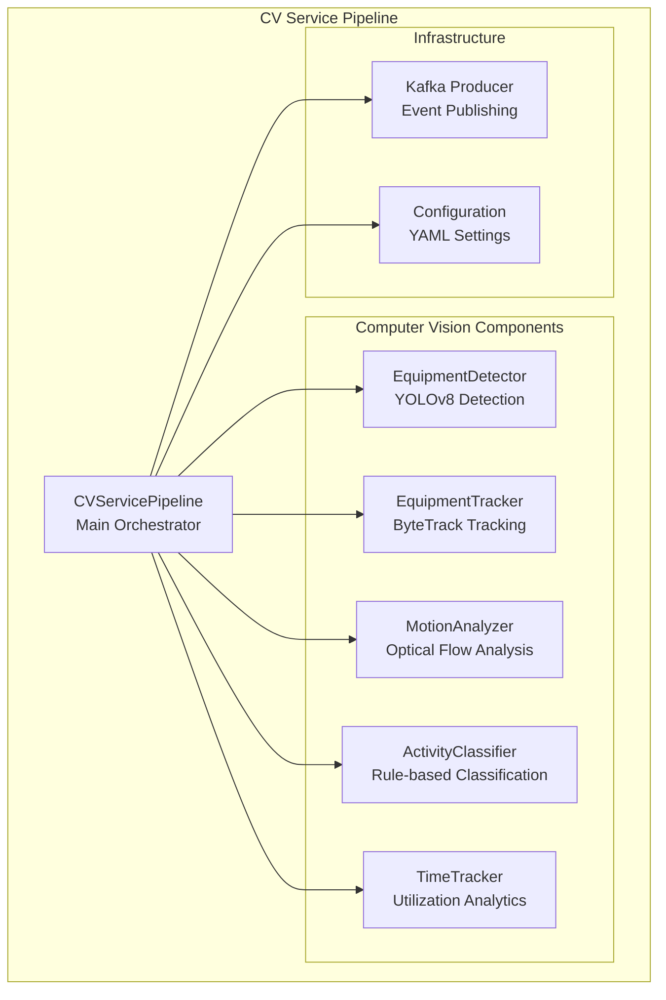
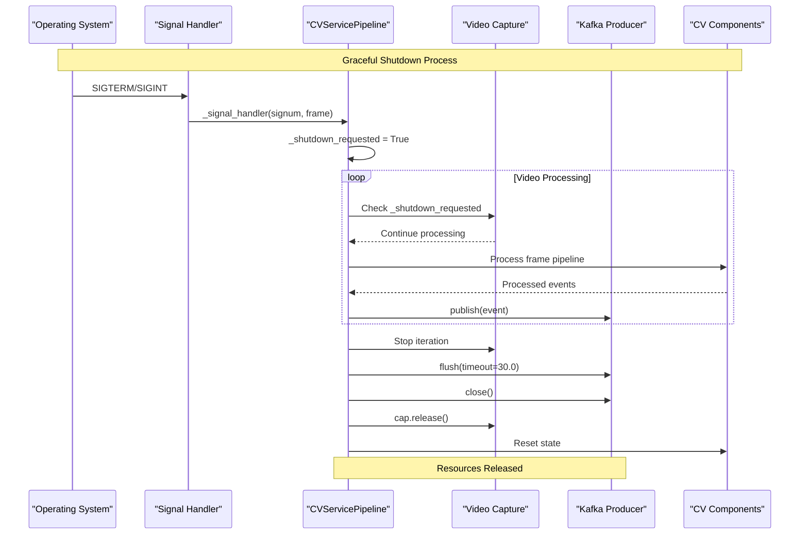
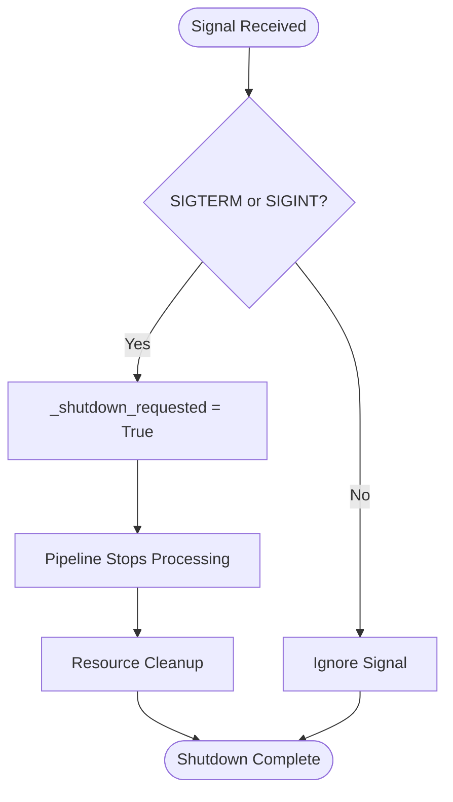
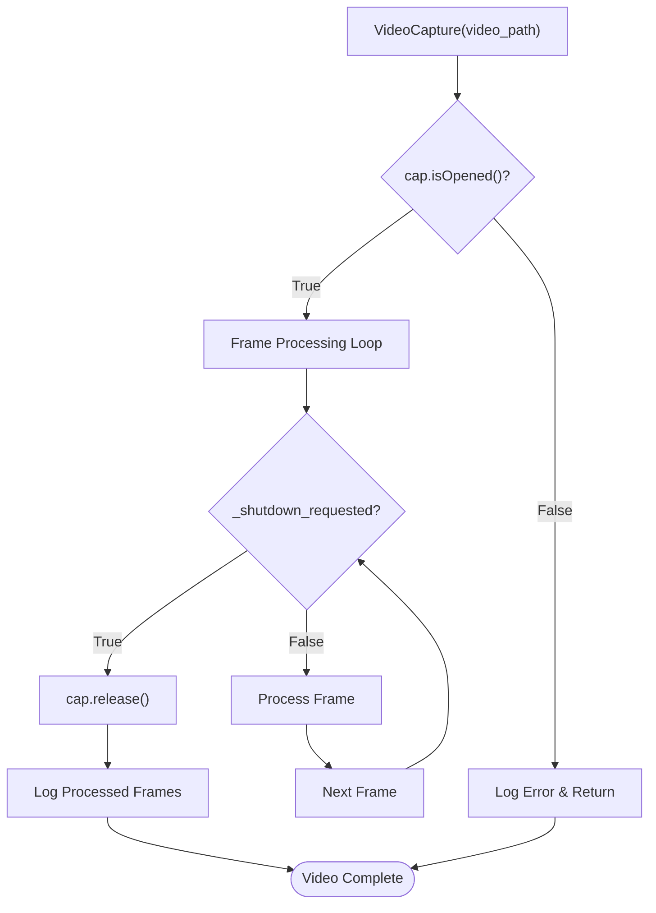
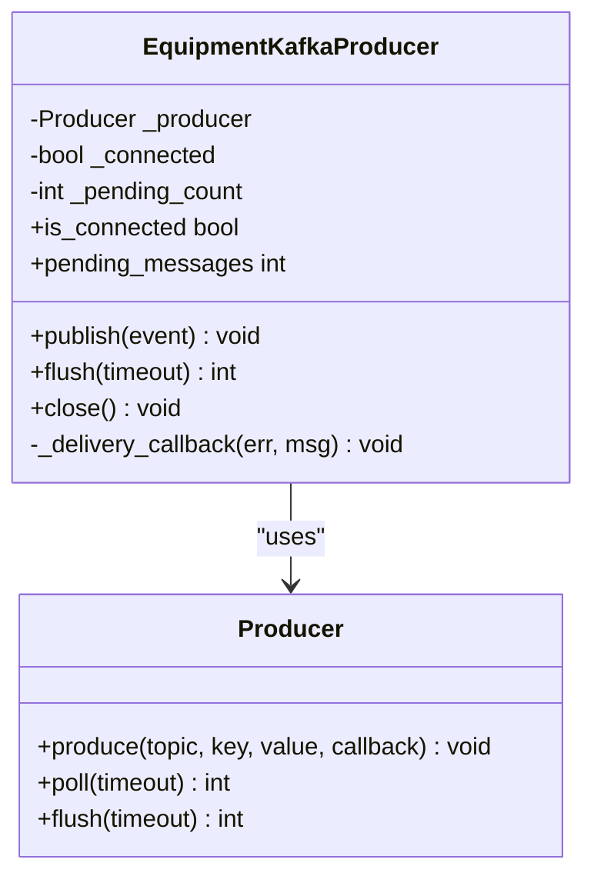
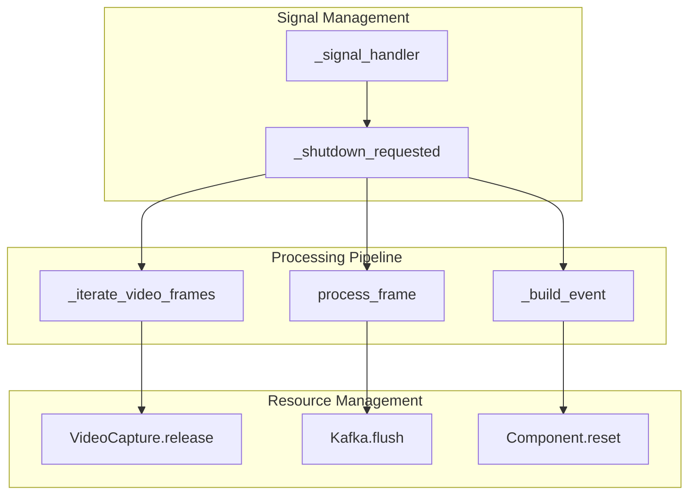

# Resource Management

<cite>
**Referenced Files in This Document**
- [main.py](file://services/cv_service/src/main.py)
- [kafka_producer.py](file://services/cv_service/src/kafka_producer.py)
- [detector.py](file://services/cv_service/src/detector.py)
- [tracker.py](file://services/cv_service/src/tracker.py)
- [motion_analyzer.py](file://services/cv_service/src/motion_analyzer.py)
- [activity_classifier.py](file://services/cv_service/src/activity_classifier.py)
- [time_tracker.py](file://services/cv_service/src/time_tracker.py)
- [settings.yaml](file://config/settings.yaml)
- [docker-compose.yml](file://docker-compose.yml)
</cite>

## Table of Contents
1. [Introduction](#introduction)
2. [Project Structure](#project-structure)
3. [Core Components](#core-components)
4. [Architecture Overview](#architecture-overview)
5. [Detailed Component Analysis](#detailed-component-analysis)
6. [Dependency Analysis](#dependency-analysis)
7. [Performance Considerations](#performance-considerations)
8. [Troubleshooting Guide](#troubleshooting-guide)
9. [Conclusion](#conclusion)

## Introduction

The CV Service resource management system implements comprehensive signal handling for graceful shutdown, video file processing cleanup, and component resource release. This system processes video files through a sophisticated computer vision pipeline while maintaining strict resource lifecycle management to prevent leaks and ensure clean termination in production environments.

The system handles long-running processes with proper signal interception, memory cleanup, and Kafka producer flushing to guarantee data integrity during shutdown scenarios.

## Project Structure

The CV Service follows a modular architecture with clear separation of concerns:

**Diagram sources**
- [main.py:42-68](file://services/cv_service/src/main.py#L42-L68)
- [settings.yaml:1-59](file://config/settings.yaml#L1-L59)

**Section sources**
- [main.py:42-68](file://services/cv_service/src/main.py#L42-L68)
- [settings.yaml:1-59](file://config/settings.yaml#L1-L59)

## Core Components

The resource management system centers around three critical components:

### Signal Handler Management
The system implements robust signal handling through the `_signal_handler` method that responds to SIGTERM and SIGINT signals, setting a shutdown flag that propagates through the entire pipeline.

### Video Capture Lifecycle
Video file processing includes proper OpenCV VideoCapture initialization, frame iteration with frame skipping, and guaranteed cleanup through the `finally` block in `_iterate_video_frames`.

### Kafka Producer Resource Management
The EquipmentKafkaProducer handles asynchronous message queuing, delivery callbacks, and proper flushing with timeout mechanisms to ensure all pending messages are delivered during shutdown.

**Section sources**
- [main.py:143-160](file://services/cv_service/src/main.py#L143-L160)
- [main.py:184-254](file://services/cv_service/src/main.py#L184-L254)
- [kafka_producer.py:170-209](file://services/cv_service/src/kafka_producer.py#L170-L209)

## Architecture Overview

The resource management architecture implements a hierarchical shutdown mechanism:

**Diagram sources**
- [main.py:149-160](file://services/cv_service/src/main.py#L149-L160)
- [main.py:374-421](file://services/cv_service/src/main.py#L374-L421)
- [kafka_producer.py:193-209](file://services/cv_service/src/kafka_producer.py#L193-L209)

## Detailed Component Analysis

### Signal Handling System

The signal handling implementation provides immediate response to shutdown requests:

**Diagram sources**
- [main.py:149-160](file://services/cv_service/src/main.py#L149-L160)

The `_signal_handler` method captures the signal name for logging and immediately sets the shutdown flag, allowing the main processing loops to exit gracefully.

**Section sources**
- [main.py:143-160](file://services/cv_service/src/main.py#L143-L160)

### Video Capture Management

Video processing implements comprehensive cleanup through proper VideoCapture lifecycle management:

**Diagram sources**
- [main.py:199-253](file://services/cv_service/src/main.py#L199-L253)

The video capture management ensures that:
- Video files are properly opened and validated
- Frame processing respects shutdown requests
- VideoCapture resources are released in all scenarios
- Frame skipping and resizing configurations are applied consistently

**Section sources**
- [main.py:184-254](file://services/cv_service/src/main.py#L184-L254)

### Kafka Producer Resource Management

The Kafka producer implements robust resource management with multiple cleanup strategies:

**Diagram sources**
- [kafka_producer.py:17-228](file://services/cv_service/src/kafka_producer.py#L17-L228)

The producer manages resources through:
- Asynchronous message queuing with delivery callbacks
- Pending message tracking for monitoring
- Timeout-based flushing during shutdown
- Proper producer state management

**Section sources**
- [kafka_producer.py:170-209](file://services/cv_service/src/kafka_producer.py#L170-L209)

### Component Resource Release

Each component implements appropriate cleanup mechanisms:

| Component | Cleanup Method | Purpose |
|-----------|----------------|---------|
| EquipmentDetector | Model cleanup handled by YOLO library | Automatic memory management |
| EquipmentTracker | State reset via `reset()` method | Clear internal mappings and counters |
| MotionAnalyzer | No persistent resources | Stateless optical flow calculations |
| ActivityClassifier | History reset via `reset()` method | Clear activity classification buffers |
| TimeTracker | Statistics reset via `reset()` method | Clear utilization time counters |

**Section sources**
- [tracker.py:329-341](file://services/cv_service/src/tracker.py#L329-L341)
- [activity_classifier.py:288-291](file://services/cv_service/src/activity_classifier.py#L288-L291)
- [time_tracker.py:201-210](file://services/cv_service/src/time_tracker.py#L201-L210)

## Dependency Analysis

The resource management system exhibits low coupling with clear dependency relationships:

**Diagram sources**
- [main.py:149-160](file://services/cv_service/src/main.py#L149-L160)
- [main.py:221-253](file://services/cv_service/src/main.py#L221-L253)
- [main.py:414-415](file://services/cv_service/src/main.py#L414-L415)

**Section sources**
- [main.py:486-498](file://services/cv_service/src/main.py#L486-L498)

## Performance Considerations

### Memory Management Strategies

The system implements several memory optimization techniques:

1. **Frame Skipping**: Configurable frame processing reduces computational load
2. **Frame Resizing**: Dynamic resizing optimizes memory usage for inference
3. **Batch Processing**: Kafka producer batching improves throughput
4. **Stateless Components**: Motion analyzer and activity classifier minimize persistent memory

### Resource Monitoring

The system provides built-in monitoring capabilities:

- **Pending Message Count**: Tracks Kafka producer queue depth
- **Frame Processing Metrics**: Logs processed frame counts and timestamps
- **Component State**: Tracks active equipment and processing statistics

**Section sources**
- [settings.yaml:3-6](file://config/settings.yaml#L3-L6)
- [kafka_producer.py:216-218](file://services/cv_service/src/kafka_producer.py#L216-L218)

## Troubleshooting Guide

### Common Shutdown Issues

| Issue | Symptoms | Solution |
|-------|----------|----------|
| Stuck Shutdown | Process doesn't terminate | Check `_shutdown_requested` propagation |
| Kafka Message Loss | Undelivered messages on shutdown | Verify `flush(timeout=30.0)` completion |
| Video Capture Leaks | Memory growth during processing | Ensure `cap.release()` in finally block |
| Component State Corruption | Inconsistent tracking results | Call `reset()` methods between videos |

### Debugging Resource Leaks

To debug potential resource leaks:

1. **Monitor Pending Messages**: Check `EquipmentKafkaProducer.pending_messages`
2. **Verify Video Cleanup**: Ensure `cap.release()` is called in all code paths
3. **Check Component Resets**: Validate `reset()` methods are called appropriately
4. **Review Signal Propagation**: Confirm `_shutdown_requested` flag is set correctly

**Section sources**
- [kafka_producer.py:193-209](file://services/cv_service/src/kafka_producer.py#L193-L209)
- [main.py:486-498](file://services/cv_service/src/main.py#L486-L498)

## Conclusion

The CV Service resource management system provides comprehensive signal handling, video file processing cleanup, and component resource release mechanisms. Through careful implementation of signal handlers, video capture lifecycle management, and Kafka producer resource management, the system ensures graceful shutdown and prevents resource leaks in production environments.

Key strengths of the implementation include:
- Immediate signal response with graceful degradation
- Comprehensive video capture cleanup guarantees
- Robust Kafka producer flushing with timeout protection
- Modular component reset mechanisms
- Built-in monitoring and logging capabilities

This architecture serves as a robust foundation for long-running computer vision applications requiring reliable resource management and clean termination.