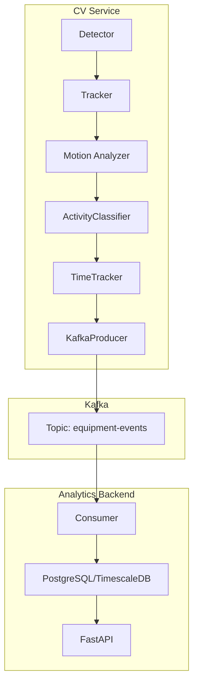
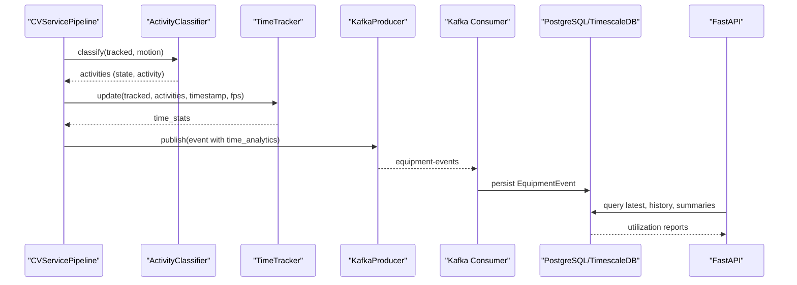
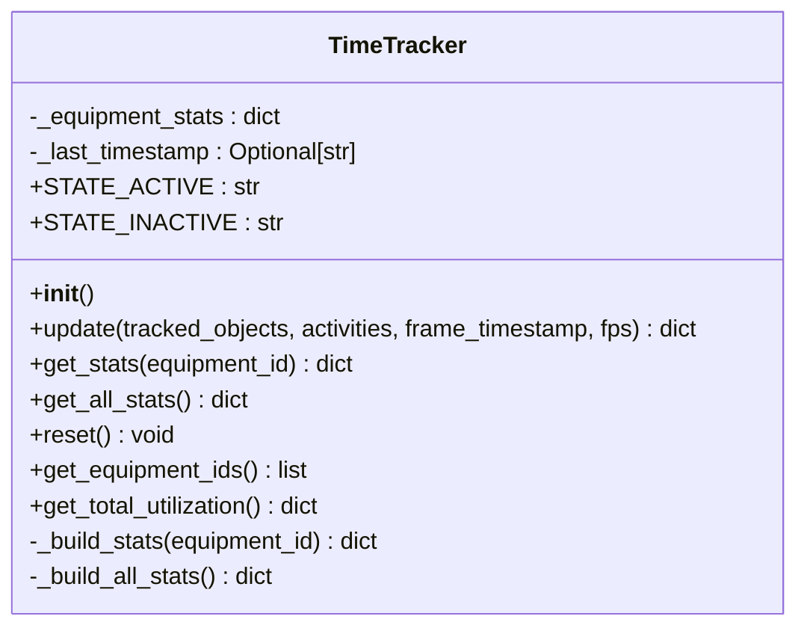
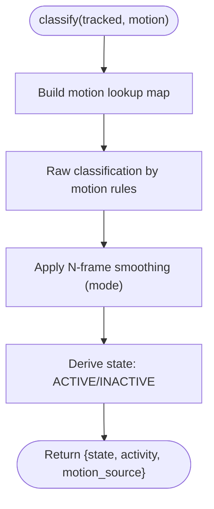
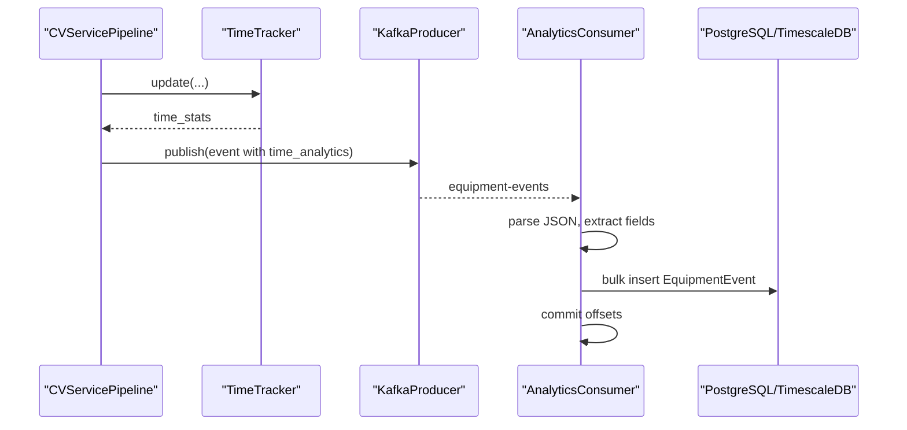
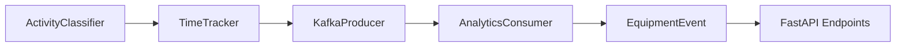

# Time Tracking

<cite>
**Referenced Files in This Document**
- [time_tracker.py](file://services/cv_service/src/time_tracker.py)
- [main.py](file://services/cv_service/src/main.py)
- [activity_classifier.py](file://services/cv_service/src/activity_classifier.py)
- [kafka_producer.py](file://services/cv_service/src/kafka_producer.py)
- [db_models.py](file://services/analytics_backend/src/db_models.py)
- [consumer.py](file://services/analytics_backend/src/consumer.py)
- [api.py](file://services/analytics_backend/src/api.py)
- [settings.yaml](file://config/settings.yaml)
- [test_time_tracker.py](file://tests/test_time_tracker.py)
- [docker-compose.yml](file://docker-compose.yml)
- [README.md](file://README.md)
</cite>

## Table of Contents
1. [Introduction](#introduction)
2. [Project Structure](#project-structure)
3. [Core Components](#core-components)
4. [Architecture Overview](#architecture-overview)
5. [Detailed Component Analysis](#detailed-component-analysis)
6. [Dependency Analysis](#dependency-analysis)
7. [Performance Considerations](#performance-considerations)
8. [Troubleshooting Guide](#troubleshooting-guide)
9. [Conclusion](#conclusion)
10. [Appendices](#appendices)

## Introduction
This document explains the Time Tracking component responsible for equipment utilization time calculation and statistics generation. It focuses on the TimeTracker class implementation, covering time-based statistics accumulation, utilization percentage computation, activity duration tracking, and performance metrics aggregation. It also documents the end-to-end workflow from activity classifications through time interval accumulation to utilization analytics, including configuration options, integration with database persistence, time synchronization considerations, handling of missing data, and performance optimization for long video processing sessions.

## Project Structure
The Time Tracking feature is part of the CV Service pipeline and integrates with Kafka and the Analytics Backend for persistence and dashboards. The key files involved are:
- TimeTracker: time accumulation and utilization computation
- ActivityClassifier: activity classification driving state transitions
- Kafka Producer: event publishing with time analytics
- Analytics Consumer: persistence of events to PostgreSQL/TimescaleDB
- API: retrieval of utilization reports and time series
- Settings: configuration for frame rate, skipping, and thresholds

**Diagram sources**
- [main.py:323-372](file://services/cv_service/src/main.py#L323-L372)
- [kafka_producer.py:91-169](file://services/cv_service/src/kafka_producer.py#L91-L169)
- [consumer.py:143-200](file://services/analytics_backend/src/consumer.py#L143-L200)
- [db_models.py:22-67](file://services/analytics_backend/src/db_models.py#L22-L67)
- [api.py:159-416](file://services/analytics_backend/src/api.py#L159-L416)

**Section sources**
- [README.md:1-54](file://README.md#L1-L54)
- [docker-compose.yml:1-95](file://docker-compose.yml#L1-L95)

## Core Components
- TimeTracker: maintains per-equipment counters for total tracked time, active time, idle time, and computes utilization percentage. It supports resetting, querying per-equipment and aggregate statistics, and is resilient to missing data and zero/negative FPS.
- ActivityClassifier: provides the activity state used by TimeTracker (ACTIVE/INACTIVE) via smoothing and motion rules.
- KafkaProducer: publishes structured events containing time analytics to Kafka.
- Analytics Consumer: consumes Kafka events and persists them to PostgreSQL/TimescaleDB.
- API: exposes endpoints to query equipment latest state, history, and utilization summaries.

Key responsibilities:
- Time accumulation: increments counters per frame based on FPS-derived delta
- Utilization computation: total active / total tracked
- Persistence: event stream to database for reporting and dashboards
- Aggregation: per-equipment and aggregate utilization across all equipment

**Section sources**
- [time_tracker.py:21-265](file://services/cv_service/src/time_tracker.py#L21-L265)
- [activity_classifier.py:23-306](file://services/cv_service/src/activity_classifier.py#L23-L306)
- [kafka_producer.py:17-228](file://services/cv_service/src/kafka_producer.py#L17-L228)
- [consumer.py:23-268](file://services/analytics_backend/src/consumer.py#L23-L268)
- [db_models.py:22-191](file://services/analytics_backend/src/db_models.py#L22-L191)
- [api.py:77-444](file://services/analytics_backend/src/api.py#L77-L444)

## Architecture Overview
The time tracking workflow is orchestrated by the CV Service pipeline:
1. Frame processing produces tracked equipment and motion analysis results.
2. ActivityClassifier derives current state (ACTIVE/INACTIVE) and activity for each equipment.
3. TimeTracker updates per-equipment counters using frame timestamps and FPS.
4. Events are built with time analytics and published to Kafka.
5. Analytics Consumer persists events to PostgreSQL/TimescaleDB.
6. API serves utilization reports and time series for dashboards.

**Diagram sources**
- [main.py:323-372](file://services/cv_service/src/main.py#L323-L372)
- [activity_classifier.py:71-125](file://services/cv_service/src/activity_classifier.py#L71-L125)
- [time_tracker.py:53-120](file://services/cv_service/src/time_tracker.py#L53-L120)
- [kafka_producer.py:91-169](file://services/cv_service/src/kafka_producer.py#L91-L169)
- [consumer.py:143-200](file://services/analytics_backend/src/consumer.py#L143-L200)
- [db_models.py:22-67](file://services/analytics_backend/src/db_models.py#L22-L67)
- [api.py:159-416](file://services/analytics_backend/src/api.py#L159-L416)

## Detailed Component Analysis

### TimeTracker Class
The TimeTracker class encapsulates time-based statistics for equipment utilization:
- Per-equipment counters: total_tracked_seconds, total_active_seconds, total_idle_seconds
- Utilization percentage computed as total_active / total_tracked (with zero-tracked protection)
- FPS-driven time delta per frame: 1/fps seconds
- State mapping: ACTIVE/INACTIVE derived from activity classification
- Robustness: handles missing equipment, missing activity data, and zero/negative FPS

**Diagram sources**
- [time_tracker.py:21-265](file://services/cv_service/src/time_tracker.py#L21-L265)

Key behaviors:
- update(): increments counters per tracked equipment; always increments total_tracked_seconds; increments active or idle based on current_state
- get_stats()/get_all_stats(): return current stats including utilization_percent
- get_total_utilization(): aggregates totals and average utilization across all equipment
- reset(): clears all stats for a new video session

**Section sources**
- [time_tracker.py:53-120](file://services/cv_service/src/time_tracker.py#L53-L120)
- [time_tracker.py:122-156](file://services/cv_service/src/time_tracker.py#L122-L156)
- [time_tracker.py:201-220](file://services/cv_service/src/time_tracker.py#L201-L220)
- [time_tracker.py:221-265](file://services/cv_service/src/time_tracker.py#L221-L265)

### ActivityClassifier Integration
ActivityClassifier determines the current_state used by TimeTracker:
- Uses N-frame smoothing to stabilize activity transitions
- Derives state from activity: ACTIVE if not WAITING, else INACTIVE
- Provides motion_source (full_body/arm_only/none) used in event building

**Diagram sources**
- [activity_classifier.py:71-125](file://services/cv_service/src/activity_classifier.py#L71-L125)
- [activity_classifier.py:166-232](file://services/cv_service/src/activity_classifier.py#L166-L232)
- [activity_classifier.py:233-286](file://services/cv_service/src/activity_classifier.py#L233-L286)

**Section sources**
- [activity_classifier.py:46-69](file://services/cv_service/src/activity_classifier.py#L46-L69)
- [activity_classifier.py:71-125](file://services/cv_service/src/activity_classifier.py#L71-L125)

### Kafka Event Publishing and Persistence
Events include time_analytics alongside utilization metadata. The KafkaProducer serializes events and partitions by equipment_id. The Analytics Consumer deserializes, constructs EquipmentEvent records, and batches writes to PostgreSQL/TimescaleDB.

**Diagram sources**
- [main.py:270-321](file://services/cv_service/src/main.py#L270-L321)
- [kafka_producer.py:91-169](file://services/cv_service/src/kafka_producer.py#L91-L169)
- [consumer.py:143-200](file://services/analytics_backend/src/consumer.py#L143-L200)
- [db_models.py:22-67](file://services/analytics_backend/src/db_models.py#L22-L67)

**Section sources**
- [main.py:270-321](file://services/cv_service/src/main.py#L270-L321)
- [kafka_producer.py:91-169](file://services/cv_service/src/kafka_producer.py#L91-L169)
- [consumer.py:143-200](file://services/analytics_backend/src/consumer.py#L143-L200)
- [db_models.py:22-67](file://services/analytics_backend/src/db_models.py#L22-L67)

### API and Reporting
The Analytics Backend FastAPI provides:
- Latest equipment states
- History for a specific equipment
- Aggregate utilization summary
- Latest frame data for real-time dashboards

These endpoints query the persisted EquipmentEvent table and compute averages and counts from the latest records.

**Section sources**
- [api.py:159-416](file://services/analytics_backend/src/api.py#L159-L416)
- [db_models.py:22-67](file://services/analytics_backend/src/db_models.py#L22-L67)

## Dependency Analysis
- TimeTracker depends on activity classification outputs for state determination.
- CVServicePipeline coordinates detection, tracking, motion analysis, activity classification, and time tracking, then publishes events.
- KafkaProducer and Analytics Consumer form the event pipeline.
- API depends on database models for queries.

**Diagram sources**
- [main.py:323-372](file://services/cv_service/src/main.py#L323-L372)
- [activity_classifier.py:71-125](file://services/cv_service/src/activity_classifier.py#L71-L125)
- [time_tracker.py:53-120](file://services/cv_service/src/time_tracker.py#L53-L120)
- [kafka_producer.py:91-169](file://services/cv_service/src/kafka_producer.py#L91-L169)
- [consumer.py:143-200](file://services/analytics_backend/src/consumer.py#L143-L200)
- [db_models.py:22-67](file://services/analytics_backend/src/db_models.py#L22-L67)
- [api.py:159-416](file://services/analytics_backend/src/api.py#L159-L416)

**Section sources**
- [main.py:323-372](file://services/cv_service/src/main.py#L323-L372)
- [time_tracker.py:53-120](file://services/cv_service/src/time_tracker.py#L53-L120)
- [kafka_producer.py:91-169](file://services/cv_service/src/kafka_producer.py#L91-L169)
- [consumer.py:143-200](file://services/analytics_backend/src/consumer.py#L143-L200)
- [db_models.py:22-67](file://services/analytics_backend/src/db_models.py#L22-L67)
- [api.py:159-416](file://services/analytics_backend/src/api.py#L159-L416)

## Performance Considerations
- Frame skipping and resizing reduce computational load; effective FPS accounts for frame_skip.
- Time delta per frame is 1/fps, protecting against zero/negative FPS.
- Kafka producer tuned for throughput with batching and retries.
- Analytics Consumer uses batched writes and manual commits for durability and performance.
- TimescaleDB hypertable optimization for time-series data.

Practical tips:
- Tune frame_skip and resize_width in settings for CPU budget.
- Adjust smoothing_window to balance responsiveness vs stability.
- Use higher smoothing_window to reduce flickering at the cost of latency.
- Monitor Kafka producer pending messages and tune linger/batch size.

**Section sources**
- [main.py:184-253](file://services/cv_service/src/main.py#L184-L253)
- [main.py:208-210](file://services/cv_service/src/main.py#L208-L210)
- [kafka_producer.py:40-53](file://services/cv_service/src/kafka_producer.py#L40-L53)
- [consumer.py:31-33](file://services/analytics_backend/src/consumer.py#L31-L33)
- [db_models.py:103-155](file://services/analytics_backend/src/db_models.py#L103-L155)

## Troubleshooting Guide
Common issues and resolutions:
- Missing current_state defaults to INACTIVE, causing idle increments. Verify activity classification outputs include current_state.
- Zero or negative FPS handled safely; time_delta becomes 1.0 for fps <= 1.
- Unknown equipment IDs return zeros; ensure equipment_id is present in tracked_objects.
- Missing activity data for an equipment treated as idle; confirm motion analysis and activity classification are functioning.
- Kafka delivery failures logged; check bootstrap servers and topic existence.
- Database persistence errors indicate malformed events or schema mismatches; validate event structure and TimescaleDB setup.

Validation references:
- Tests cover FPS protections, smoothing behavior, and aggregation correctness.
- Edge cases validated for missing data and extreme FPS values.

**Section sources**
- [time_tracker.py:177-180](file://services/cv_service/src/time_tracker.py#L177-L180)
- [time_tracker.py:86-87](file://services/cv_service/src/time_tracker.py#L86-L87)
- [test_time_tracker.py:187-212](file://tests/test_time_tracker.py#L187-L212)
- [test_time_tracker.py:389-425](file://tests/test_time_tracker.py#L389-L425)
- [test_time_tracker.py:426-482](file://tests/test_time_tracker.py#L426-L482)
- [kafka_producer.py:153-168](file://services/cv_service/src/kafka_producer.py#L153-L168)
- [consumer.py:198-200](file://services/analytics_backend/src/consumer.py#L198-L200)
- [db_models.py:113-155](file://services/analytics_backend/src/db_models.py#L113-L155)

## Conclusion
The TimeTracker component provides robust, frame-based time accumulation and utilization computation integrated tightly with activity classification and event streaming. Its design supports long-running video sessions, handles missing data gracefully, and integrates seamlessly with Kafka and PostgreSQL/TimescaleDB for persistence and dashboard reporting. Configuration options enable balancing performance and accuracy, while tests validate critical behaviors across edge cases.

## Appendices

### Configuration Options
- Video processing:
  - frame_skip: Controls frame rate for CPU savings
  - resize_width: Reduces inference cost
- Activity classification:
  - smoothing_window: N-frame smoothing for stability
  - vertical_flow_threshold, horizontal_flow_threshold: Motion sensitivity
- Kafka:
  - bootstrap_servers, topic, client_id, consumer_group
- Database:
  - host, port, name, user, password, uri

**Section sources**
- [settings.yaml:3-59](file://config/settings.yaml#L3-L59)

### Practical Examples

- Utilization report generation:
  - Use the utilization summary endpoint to get total equipment, active/inactive counts, average utilization, and per-equipment summaries.
  - Reference: [api.py:286-367](file://services/analytics_backend/src/api.py#L286-L367)

- Time series analysis:
  - Fetch history for a specific equipment to analyze trends over time.
  - Reference: [api.py:225-284](file://services/analytics_backend/src/api.py#L225-L284)

- Integration with database persistence:
  - Events are persisted as EquipmentEvent records with time analytics and created_at timestamps.
  - Reference: [db_models.py:22-67](file://services/analytics_backend/src/db_models.py#L22-L67), [consumer.py:143-200](file://services/analytics_backend/src/consumer.py#L143-L200)

- Time synchronization considerations:
  - Frame timestamps are formatted as HH:MM:SS.mmm and used for reference; effective FPS accounts for frame skipping.
  - Reference: [main.py:255-268](file://services/cv_service/src/main.py#L255-L268), [main.py:208-210](file://services/cv_service/src/main.py#L208-L210)

- Handling missing data:
  - Missing current_state defaults to INACTIVE; missing activity data treated as idle; unknown equipment returns zeros.
  - Reference: [time_tracker.py:104-105](file://services/cv_service/src/time_tracker.py#L104-L105), [time_tracker.py:177-180](file://services/cv_service/src/time_tracker.py#L177-L180), [test_time_tracker.py:389-425](file://tests/test_time_tracker.py#L389-L425)

- Performance optimization for long sessions:
  - Reduce frame_skip and resize_width; increase smoothing_window for stability; monitor Kafka producer pending messages.
  - Reference: [settings.yaml:3-59](file://config/settings.yaml#L3-L59), [kafka_producer.py:40-53](file://services/cv_service/src/kafka_producer.py#L40-L53)