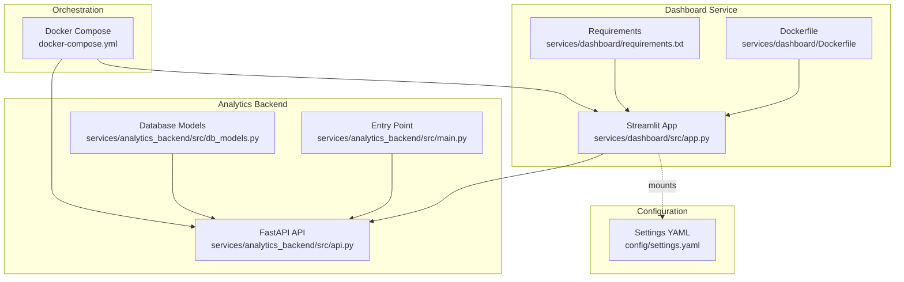
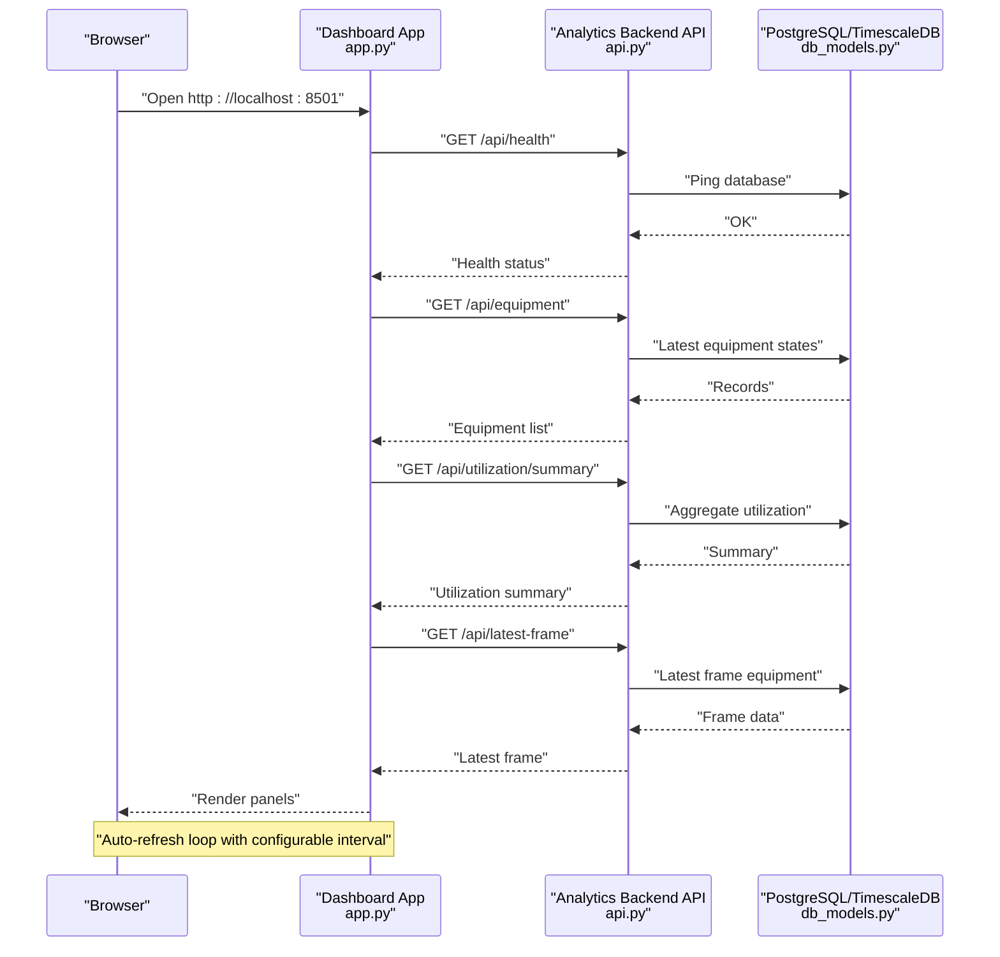
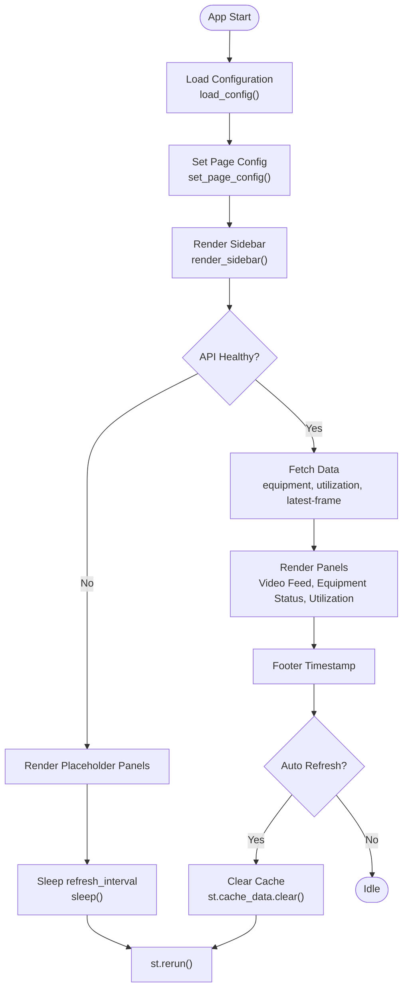
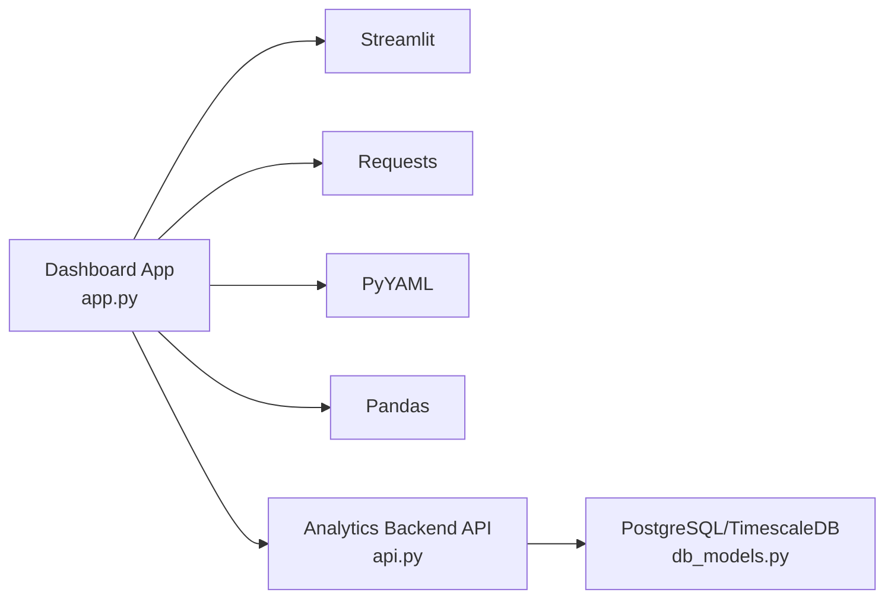

# Dashboard Service

<cite>
**Referenced Files in This Document**
- [app.py](file://services/dashboard/src/app.py)
- [settings.yaml](file://config/settings.yaml)
- [docker-compose.yml](file://docker-compose.yml)
- [Dockerfile](file://services/dashboard/Dockerfile)
- [requirements.txt](file://services/dashboard/requirements.txt)
- [api.py](file://services/analytics_backend/src/api.py)
- [main.py](file://services/analytics_backend/src/main.py)
- [db_models.py](file://services/analytics_backend/src/db_models.py)
- [README.md](file://README.md)
</cite>

## Table of Contents
1. [Introduction](#introduction)
2. [Project Structure](#project-structure)
3. [Core Components](#core-components)
4. [Architecture Overview](#architecture-overview)
5. [Detailed Component Analysis](#detailed-component-analysis)
6. [Dependency Analysis](#dependency-analysis)
7. [Performance Considerations](#performance-considerations)
8. [Troubleshooting Guide](#troubleshooting-guide)
9. [Conclusion](#conclusion)
10. [Appendices](#appendices)

## Introduction
This document describes the Dashboard Service microservice that powers a Streamlit-based real-time monitoring interface for equipment utilization and activity classification. It explains how the Streamlit application integrates with the Analytics Backend API to present live equipment status, utilization metrics, activity classifications, and historical trends. It also covers configuration options, real-time update strategies, UI design, and deployment considerations.

## Project Structure
The Dashboard Service resides under services/dashboard and exposes a Streamlit application that connects to the Analytics Backend API. The configuration is centralized in config/settings.yaml, and the service is orchestrated via docker-compose.yml.

**Diagram sources**
- [app.py:1-621](file://services/dashboard/src/app.py#L1-L621)
- [Dockerfile:1-17](file://services/dashboard/Dockerfile#L1-L17)
- [requirements.txt:1-6](file://services/dashboard/requirements.txt#L1-L6)
- [api.py:1-444](file://services/analytics_backend/src/api.py#L1-L444)
- [main.py:1-149](file://services/analytics_backend/src/main.py#L1-L149)
- [db_models.py:1-191](file://services/analytics_backend/src/db_models.py#L1-L191)
- [settings.yaml:1-59](file://config/settings.yaml#L1-L59)
- [docker-compose.yml:1-95](file://docker-compose.yml#L1-L95)

**Section sources**
- [app.py:1-621](file://services/dashboard/src/app.py#L1-L621)
- [settings.yaml:55-59](file://config/settings.yaml#L55-L59)
- [docker-compose.yml:80-92](file://docker-compose.yml#L80-L92)
- [Dockerfile:1-17](file://services/dashboard/Dockerfile#L1-L17)
- [requirements.txt:1-6](file://services/dashboard/requirements.txt#L1-L6)

## Core Components
- Streamlit application entry and UI rendering
- Configuration loader for API endpoints and display preferences
- API communication layer with caching and timeouts
- Sidebar controls for refresh intervals, manual refresh, equipment filtering, and database stats
- Dashboard panels:
  - Video feed status panel
  - Live equipment status table
  - Utilization dashboard with summary and per-equipment metrics
- Real-time update loop with auto-refresh and cache invalidation

Key responsibilities:
- Load configuration from settings.yaml with fallback defaults
- Poll Analytics Backend API endpoints at configured intervals
- Render responsive, color-coded UI panels with metrics and progress indicators
- Provide interactive filters and manual refresh controls

**Section sources**
- [app.py:26-57](file://services/dashboard/src/app.py#L26-L57)
- [app.py:100-160](file://services/dashboard/src/app.py#L100-L160)
- [app.py:166-234](file://services/dashboard/src/app.py#L166-L234)
- [app.py:236-294](file://services/dashboard/src/app.py#L236-L294)
- [app.py:296-394](file://services/dashboard/src/app.py#L296-L394)
- [app.py:396-512](file://services/dashboard/src/app.py#L396-L512)
- [app.py:518-621](file://services/dashboard/src/app.py#L518-L621)

## Architecture Overview
The Dashboard Service is a thin client that renders a real-time view of equipment analytics produced by the Analytics Backend. The backend aggregates Kafka events and exposes a FastAPI REST API backed by PostgreSQL/TimescaleDB. The Streamlit app polls the backend endpoints and displays the data in a responsive layout.

**Diagram sources**
- [app.py:100-160](file://services/dashboard/src/app.py#L100-L160)
- [app.py:518-621](file://services/dashboard/src/app.py#L518-L621)
- [api.py:159-177](file://services/analytics_backend/src/api.py#L159-L177)
- [api.py:179-223](file://services/analytics_backend/src/api.py#L179-L223)
- [api.py:286-368](file://services/analytics_backend/src/api.py#L286-L368)
- [api.py:370-416](file://services/analytics_backend/src/api.py#L370-L416)
- [db_models.py:22-68](file://services/analytics_backend/src/db_models.py#L22-L68)

## Detailed Component Analysis

### Streamlit Application and UI Panels
The Streamlit app orchestrates:
- Page configuration and custom styling
- Sidebar controls (connection status, refresh settings, equipment filter, database stats)
- Three main panels:
  - Video feed status panel
  - Live equipment status table
  - Utilization dashboard with summary and per-equipment metrics
- Auto-refresh loop with cache invalidation

**Diagram sources**
- [app.py:518-621](file://services/dashboard/src/app.py#L518-L621)
- [app.py:166-234](file://services/dashboard/src/app.py#L166-L234)
- [app.py:587-617](file://services/dashboard/src/app.py#L587-L617)

**Section sources**
- [app.py:518-621](file://services/dashboard/src/app.py#L518-L621)
- [app.py:166-234](file://services/dashboard/src/app.py#L166-L234)

### API Integration and Data Fetching
The dashboard uses Streamlit’s caching decorators to cache API responses with short TTLs to balance freshness and performance. It polls the following endpoints:
- Health check: /api/health
- Equipment list: /api/equipment
- Utilization summary: /api/utilization/summary
- Latest frame: /api/latest-frame
- General stats: /api/stats

Caching strategy:
- Health and latest frame: short TTL to reflect near-real-time status
- Equipment list and utilization summary: moderate TTL to reduce load
- Stats: cached to avoid frequent heavy queries

Timeouts:
- All requests use short timeouts to prevent UI blocking.

**Section sources**
- [app.py:100-160](file://services/dashboard/src/app.py#L100-L160)

### Dashboard Panels and Visualization Components
- Video Feed Status Panel
  - Displays current frame ID and detected equipment count
  - Renders a visual card for each detected equipment with state and activity badges
  - Supports equipment filtering from the sidebar
- Live Equipment Status Table
  - Color-coded state indicators (ACTIVE/INACTIVE)
  - Activity badges with distinct colors per activity type
  - Progress-like metrics for utilization percentage
  - Optional DataFrame view for raw inspection
- Utilization Dashboard
  - Summary metrics: total equipment, active, inactive, average utilization
  - Progress bar for average utilization
  - Per-equipment cards with working time, idle time, and utilization progress
  - Event count per equipment

**Section sources**
- [app.py:236-294](file://services/dashboard/src/app.py#L236-L294)
- [app.py:296-394](file://services/dashboard/src/app.py#L296-L394)
- [app.py:396-512](file://services/dashboard/src/app.py#L396-L512)

### Configuration Options
Centralized configuration in settings.yaml influences:
- Dashboard API endpoint and refresh behavior
- Video ingestion and detection parameters (used by the backend)
- Kafka and database connectivity (used by the backend)

Dashboard-specific keys:
- dashboard.api_url: Base URL for Analytics Backend API
- dashboard.refresh_interval: Auto-refresh interval in seconds
- dashboard.page_title: Page title shown in the browser tab

**Section sources**
- [settings.yaml:55-59](file://config/settings.yaml#L55-L59)
- [app.py:26-57](file://services/dashboard/src/app.py#L26-L57)

### Real-Time Update Strategies
- Auto-refresh loop: After rendering, the app sleeps for the configured interval and clears the cache before re-rendering
- Manual refresh: Button in the sidebar clears cache and triggers immediate rerun
- Connection health: Sidebar shows connection status and attempts to reach the API health endpoint
- Equipment filter: Selecting a specific equipment narrows the displayed data across panels

**Section sources**
- [app.py:587-617](file://services/dashboard/src/app.py#L587-L617)
- [app.py:166-234](file://services/dashboard/src/app.py#L166-L234)

### User Interface Design and Interactive Features
- Responsive layout with two-column top panels and a full-width bottom panel
- Custom CSS for metric containers, progress bars, and header styling
- Color-coded state indicators and activity badges
- Interactive sidebar controls for refresh interval, auto-refresh toggle, equipment selection, and manual refresh
- Footer timestamp and refresh interval indicator

**Section sources**
- [app.py:529-551](file://services/dashboard/src/app.py#L529-L551)
- [app.py:166-234](file://services/dashboard/src/app.py#L166-L234)

### Practical Usage Examples and Workflows
- Initial load: The app checks API health, then fetches equipment, utilization, and latest frame data to populate panels
- Monitoring workflow:
  - Observe average utilization and active equipment in the utilization dashboard
  - Drill into individual equipment via the live equipment status table
  - Filter to focus on a specific equipment ID
  - Use manual refresh to force immediate updates
- Data interpretation:
  - ACTIVE vs INACTIVE indicates whether equipment is currently operating
  - Activity types (DIGGING, SWINGING_LOADING, DUMPING, WAITING) reflect motion classification
  - Utilization percentage reflects tracked time vs active time ratios

**Section sources**
- [app.py:518-621](file://services/dashboard/src/app.py#L518-L621)
- [README.md:236-246](file://README.md#L236-L246)

## Dependency Analysis
The Dashboard Service depends on:
- Analytics Backend API for all data
- Streamlit for UI rendering and caching
- Requests for HTTP calls
- PyYAML for configuration parsing
- Pandas for optional DataFrame rendering

**Diagram sources**
- [app.py:10-16](file://services/dashboard/src/app.py#L10-L16)
- [requirements.txt:1-6](file://services/dashboard/requirements.txt#L1-L6)
- [api.py:1-444](file://services/analytics_backend/src/api.py#L1-L444)
- [db_models.py:1-191](file://services/analytics_backend/src/db_models.py#L1-L191)

**Section sources**
- [requirements.txt:1-6](file://services/dashboard/requirements.txt#L1-L6)
- [app.py:10-16](file://services/dashboard/src/app.py#L10-L16)

## Performance Considerations
- Caching: Short TTLs on frequently polled endpoints reduce backend load while keeping data fresh
- Request timeouts: Prevent UI stalls during backend unavailability
- Auto-refresh interval: Tune refresh_interval to balance responsiveness and resource usage
- Sidebar controls: Allow users to disable auto-refresh and adjust intervals for local performance
- Data rendering: HTML tables and progress bars are lightweight; DataFrame view is optional to avoid heavy client-side rendering

[No sources needed since this section provides general guidance]

## Troubleshooting Guide
Common issues and remedies:
- API connectivity failures:
  - Verify dashboard.api_url in settings.yaml matches the backend service name and port
  - Confirm the backend is healthy and reachable from the dashboard container
- Slow or blocked UI:
  - Reduce refresh_interval or disable auto-refresh
  - Clear cache manually via the sidebar button
- Missing or stale data:
  - Ensure the backend is running and Kafka consumer is active
  - Check database connectivity and TimescaleDB setup
- Configuration not applied:
  - Confirm config volume mounting in docker-compose.yml
  - Validate YAML formatting and indentation

**Section sources**
- [settings.yaml:55-59](file://config/settings.yaml#L55-L59)
- [docker-compose.yml:88-91](file://docker-compose.yml#L88-L91)
- [app.py:100-160](file://services/dashboard/src/app.py#L100-L160)
- [main.py:104-122](file://services/analytics_backend/src/main.py#L104-L122)

## Conclusion
The Dashboard Service provides a responsive, real-time monitoring interface for equipment utilization and activity classification. Its Streamlit-based architecture integrates seamlessly with the Analytics Backend API, offering configurable refresh behavior, interactive filtering, and clear visualizations. Proper configuration and deployment ensure reliable operation within the broader microservices pipeline.

[No sources needed since this section summarizes without analyzing specific files]

## Appendices

### Deployment Considerations
- Containerization: The dashboard runs on port 8501 and mounts the config directory for settings.yaml
- Orchestration: docker-compose brings up the dashboard and depends on the analytics-backend service
- Networking: Ensure the dashboard can resolve the backend service name and port

**Section sources**
- [Dockerfile:14-17](file://services/dashboard/Dockerfile#L14-L17)
- [docker-compose.yml:80-92](file://docker-compose.yml#L80-L92)

### API Endpoints Consumed by the Dashboard
- GET /api/health: Health check
- GET /api/equipment: Latest equipment states
- GET /api/utilization/summary: Aggregate utilization metrics
- GET /api/latest-frame: Latest frame equipment data
- GET /api/stats: Database statistics

**Section sources**
- [app.py:100-160](file://services/dashboard/src/app.py#L100-L160)
- [api.py:159-177](file://services/analytics_backend/src/api.py#L159-L177)
- [api.py:179-223](file://services/analytics_backend/src/api.py#L179-L223)
- [api.py:286-368](file://services/analytics_backend/src/api.py#L286-L368)
- [api.py:370-416](file://services/analytics_backend/src/api.py#L370-L416)
- [api.py:419-444](file://services/analytics_backend/src/api.py#L419-L444)