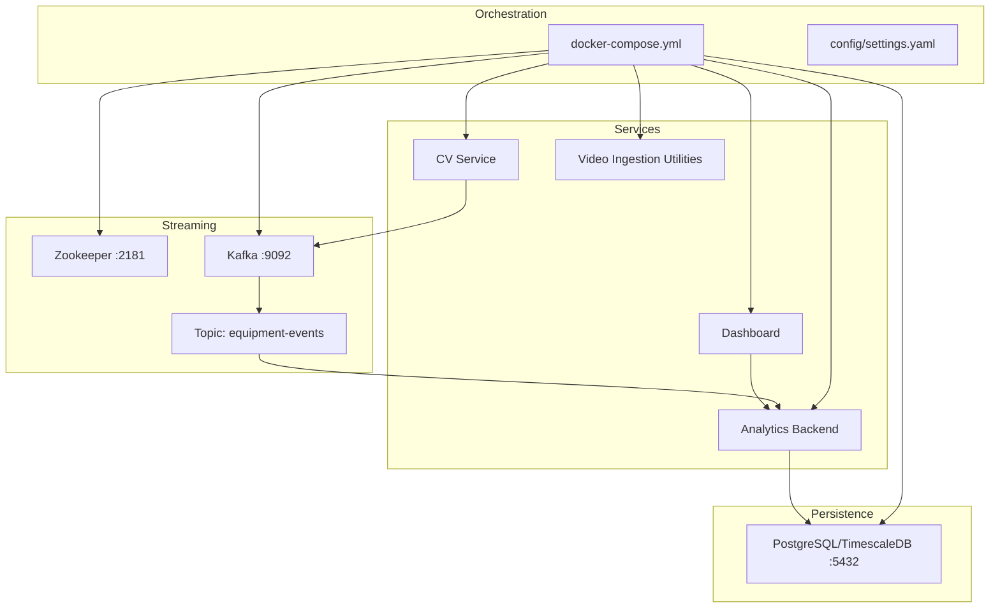
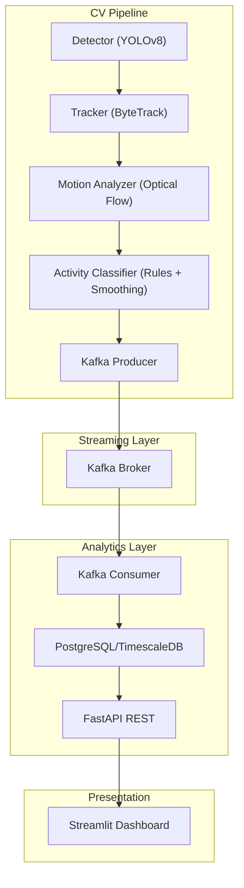
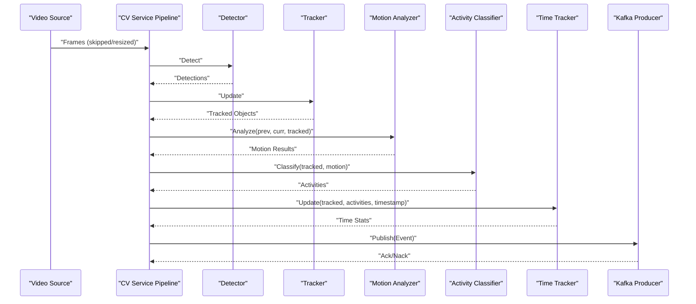
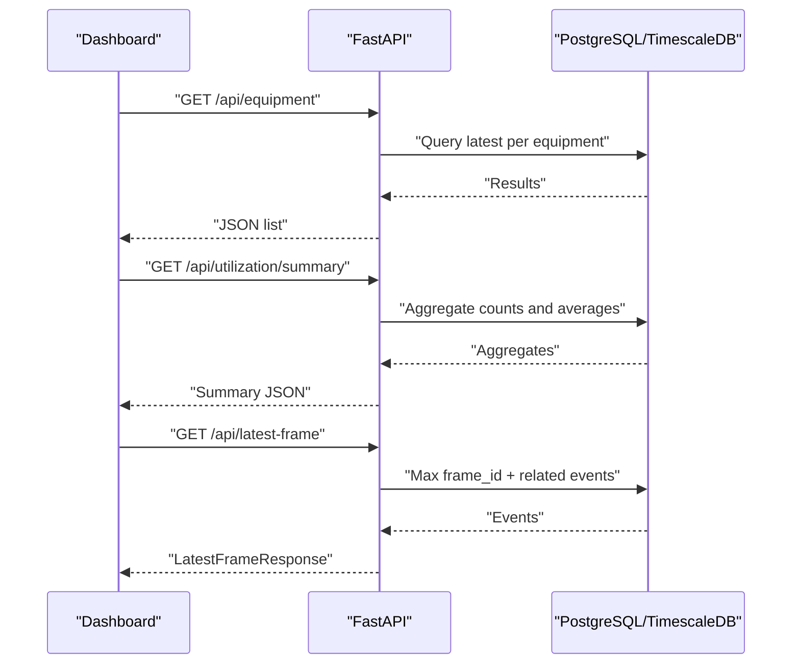
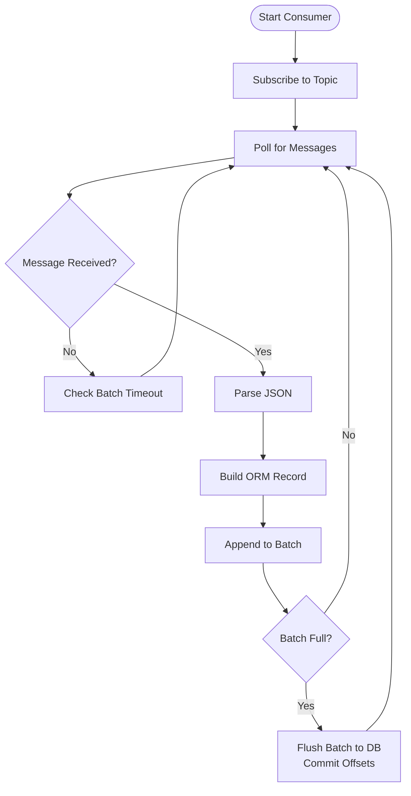
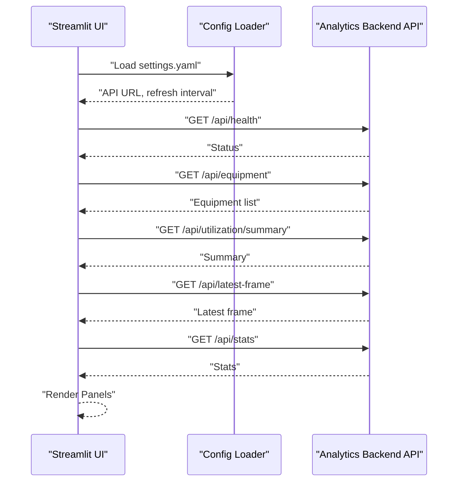
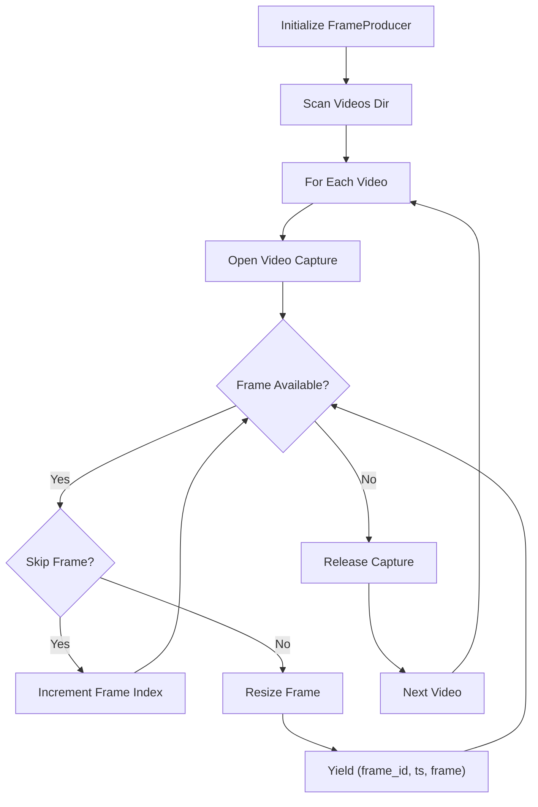
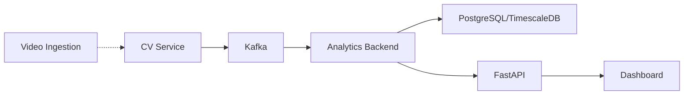

# Microservices Architecture

<cite>
**Referenced Files in This Document**
- [README.md](file://README.md)
- [docker-compose.yml](file://docker-compose.yml)
- [settings.yaml](file://config/settings.yaml)
- [cv_service main.py](file://services/cv_service/src/main.py)
- [cv_service kafka_producer.py](file://services/cv_service/src/kafka_producer.py)
- [cv_service detector.py](file://services/cv_service/src/detector.py)
- [cv_service tracker.py](file://services/cv_service/src/tracker.py)
- [cv_service motion_analyzer.py](file://services/cv_service/src/motion_analyzer.py)
- [cv_service activity_classifier.py](file://services/cv_service/src/activity_classifier.py)
- [analytics_backend main.py](file://services/analytics_backend/src/main.py)
- [analytics_backend api.py](file://services/analytics_backend/src/api.py)
- [analytics_backend consumer.py](file://services/analytics_backend/src/consumer.py)
- [analytics_backend db_models.py](file://services/analytics_backend/src/db_models.py)
- [dashboard app.py](file://services/dashboard/src/app.py)
- [video_ingestion frame_producer.py](file://services/video_ingestion/src/frame_producer.py)
</cite>

## Table of Contents
1. [Introduction](#introduction)
2. [Project Structure](#project-structure)
3. [Core Components](#core-components)
4. [Architecture Overview](#architecture-overview)
5. [Detailed Component Analysis](#detailed-component-analysis)
6. [Dependency Analysis](#dependency-analysis)
7. [Performance Considerations](#performance-considerations)
8. [Troubleshooting Guide](#troubleshooting-guide)
9. [Conclusion](#conclusion)
10. [Appendices](#appendices)

## Introduction
This document explains the microservices-based architecture for the equipment monitoring system. The pipeline separates concerns across distinct services:
- CV Service: real-time computer vision processing and event publishing
- Apache Kafka: event streaming and decoupling producers from consumers
- Analytics Backend: persistent storage, REST API, and Kafka consumer
- Streamlit Dashboard: real-time visualization and analytics
- Video ingestion utilities: frame extraction and preparation

The design emphasizes fault isolation, scalability, and maintainability through event-driven communication, centralized configuration, and modular service responsibilities.

## Project Structure
The repository organizes code by service and shared configuration. The Docker Compose orchestration defines six containers: Zookeeper, Kafka, PostgreSQL (TimescaleDB), CV Service, Analytics Backend, and the Dashboard.

**Diagram sources**
- [docker-compose.yml:1-95](file://docker-compose.yml#L1-L95)
- [settings.yaml:1-59](file://config/settings.yaml#L1-L59)

**Section sources**
- [README.md:56-66](file://README.md#L56-L66)
- [docker-compose.yml:1-95](file://docker-compose.yml#L1-L95)
- [settings.yaml:1-59](file://config/settings.yaml#L1-L59)

## Core Components
- CV Service: Orchestrates detection, tracking, motion analysis, activity classification, time tracking, and Kafka publishing. Supports batch and continuous modes.
- Analytics Backend: Runs a FastAPI server and a Kafka consumer. Persists events to PostgreSQL/TimescaleDB and exposes REST endpoints.
- Streamlit Dashboard: Queries the Analytics Backend REST API to render live equipment status, utilization metrics, and video frame overlays.
- Video Ingestion Utilities: Provides a reusable frame producer for CPU-friendly video processing with configurable frame skipping and resizing.
- Configuration: Centralized settings via YAML for all services and components.

Responsibilities and data exchange patterns:
- CV Service publishes structured events to Kafka topic “equipment-events”.
- Analytics Backend consumes from the same topic, persists to the database, and serves queries.
- Dashboard pulls data from Analytics Backend endpoints for real-time visualization.

**Section sources**
- [cv_service main.py:42-498](file://services/cv_service/src/main.py#L42-L498)
- [analytics_backend main.py:64-148](file://services/analytics_backend/src/main.py#L64-L148)
- [analytics_backend api.py:159-444](file://services/analytics_backend/src/api.py#L159-L444)
- [analytics_backend consumer.py:23-244](file://services/analytics_backend/src/consumer.py#L23-L244)
- [dashboard app.py:100-160](file://services/dashboard/src/app.py#L100-L160)
- [settings.yaml:41-59](file://config/settings.yaml#L41-L59)

## Architecture Overview
The system follows an event-driven microservices pattern:
- CV Service performs computer vision and emits events to Kafka.
- Analytics Backend consumes events, stores them, and exposes a REST API.
- Dashboard consumes the REST API to visualize equipment status and utilization.

**Diagram sources**
- [cv_service main.py:323-421](file://services/cv_service/src/main.py#L323-L421)
- [cv_service kafka_producer.py:91-169](file://services/cv_service/src/kafka_producer.py#L91-L169)
- [analytics_backend consumer.py:93-142](file://services/analytics_backend/src/consumer.py#L93-L142)
- [analytics_backend api.py:159-444](file://services/analytics_backend/src/api.py#L159-L444)
- [dashboard app.py:110-160](file://services/dashboard/src/app.py#L110-L160)

**Section sources**
- [README.md:9-54](file://README.md#L9-L54)
- [settings.yaml:41-59](file://config/settings.yaml#L41-L59)

## Detailed Component Analysis

### CV Service Orchestration
The CV Service is the orchestrator that wires together detection, tracking, motion analysis, activity classification, time tracking, and event publishing. It supports:
- File mode: processes all videos in the input directory and exits.
- Continuous mode: watches for new video files and processes them as they arrive.

Key processing steps:
1. Detect equipment with YOLOv8.
2. Track across frames with ByteTrack.
3. Compute optical flow per region and classify motion.
4. Classify activity using rule-based logic with N-frame smoothing.
5. Update time tracking and build events.
6. Publish events to Kafka.

**Diagram sources**
- [cv_service main.py:323-421](file://services/cv_service/src/main.py#L323-L421)
- [cv_service detector.py:85-170](file://services/cv_service/src/detector.py#L85-L170)
- [cv_service tracker.py:159-265](file://services/cv_service/src/tracker.py#L159-L265)
- [cv_service motion_analyzer.py:88-167](file://services/cv_service/src/motion_analyzer.py#L88-L167)
- [cv_service activity_classifier.py:71-125](file://services/cv_service/src/activity_classifier.py#L71-L125)
- [cv_service kafka_producer.py:91-169](file://services/cv_service/src/kafka_producer.py#L91-L169)

**Section sources**
- [cv_service main.py:42-498](file://services/cv_service/src/main.py#L42-L498)
- [cv_service detector.py:18-170](file://services/cv_service/src/detector.py#L18-L170)
- [cv_service tracker.py:19-341](file://services/cv_service/src/tracker.py#L19-L341)
- [cv_service motion_analyzer.py:24-442](file://services/cv_service/src/motion_analyzer.py#L24-L442)
- [cv_service activity_classifier.py:23-306](file://services/cv_service/src/activity_classifier.py#L23-L306)
- [cv_service kafka_producer.py:17-228](file://services/cv_service/src/kafka_producer.py#L17-L228)

### Analytics Backend REST API Design
The Analytics Backend exposes a FastAPI REST API with:
- Health check endpoint verifying database connectivity.
- Equipment listing with latest state.
- Equipment history retrieval.
- Aggregated utilization summary.
- Latest frame data for real-time dashboards.
- General statistics endpoint.

**Diagram sources**
- [analytics_backend api.py:159-444](file://services/analytics_backend/src/api.py#L159-L444)
- [analytics_backend db_models.py:22-68](file://services/analytics_backend/src/db_models.py#L22-L68)

**Section sources**
- [analytics_backend api.py:159-444](file://services/analytics_backend/src/api.py#L159-L444)
- [analytics_backend db_models.py:22-191](file://services/analytics_backend/src/db_models.py#L22-L191)

### Kafka Consumer and Persistence
The Analytics Consumer:
- Subscribes to the “equipment-events” topic.
- Parses JSON messages and constructs ORM records.
- Batches writes and commits offsets manually for reliability.
- Integrates with the main process via background thread and signal handling.

**Diagram sources**
- [analytics_backend consumer.py:93-205](file://services/analytics_backend/src/consumer.py#L93-L205)
- [analytics_backend db_models.py:22-68](file://services/analytics_backend/src/db_models.py#L22-L68)

**Section sources**
- [analytics_backend consumer.py:23-244](file://services/analytics_backend/src/consumer.py#L23-L244)
- [analytics_backend db_models.py:70-191](file://services/analytics_backend/src/db_models.py#L70-L191)
- [analytics_backend main.py:64-148](file://services/analytics_backend/src/main.py#L64-L148)

### Streamlit Dashboard Implementation
The Dashboard:
- Loads configuration for API URL and refresh intervals.
- Periodically queries health, equipment list, utilization summary, latest frame, and stats.
- Renders live equipment status, utilization metrics, and a video frame overlay panel.
- Provides filtering by equipment and manual/auto refresh controls.

**Diagram sources**
- [dashboard app.py:26-57](file://services/dashboard/src/app.py#L26-L57)
- [dashboard app.py:110-160](file://services/dashboard/src/app.py#L110-L160)
- [dashboard app.py:236-617](file://services/dashboard/src/app.py#L236-L617)

**Section sources**
- [dashboard app.py:26-621](file://services/dashboard/src/app.py#L26-L621)
- [settings.yaml:55-59](file://config/settings.yaml#L55-L59)

### Video Ingestion Utilities
The video ingestion utilities provide:
- A reusable FrameProducer class for iterating frames from video files with configurable frame skipping and resizing.
- Support for multiple video formats and safe handling of missing or corrupted files.

**Diagram sources**
- [video_ingestion frame_producer.py:222-325](file://services/video_ingestion/src/frame_producer.py#L222-L325)

**Section sources**
- [video_ingestion frame_producer.py:144-414](file://services/video_ingestion/src/frame_producer.py#L144-L414)

## Dependency Analysis
Inter-service dependencies and coupling:
- CV Service depends on Kafka for event publishing and on configuration for model and processing parameters.
- Analytics Backend depends on Kafka for consumption and on PostgreSQL/TimescaleDB for persistence.
- Dashboard depends on Analytics Backend REST API.
- Video ingestion utilities are independent and reusable across tasks.

**Diagram sources**
- [cv_service kafka_producer.py:35-53](file://services/cv_service/src/kafka_producer.py#L35-L53)
- [analytics_backend consumer.py:52-59](file://services/analytics_backend/src/consumer.py#L52-L59)
- [analytics_backend api.py:24-37](file://services/analytics_backend/src/api.py#L24-L37)
- [dashboard app.py:52-57](file://services/dashboard/src/app.py#L52-L57)

**Section sources**
- [cv_service kafka_producer.py:17-228](file://services/cv_service/src/kafka_producer.py#L17-L228)
- [analytics_backend consumer.py:23-244](file://services/analytics_backend/src/consumer.py#L23-L244)
- [analytics_backend api.py:24-37](file://services/analytics_backend/src/api.py#L24-L37)
- [dashboard app.py:26-57](file://services/dashboard/src/app.py#L26-L57)

## Performance Considerations
- CPU optimization strategies:
  - Use YOLOv8n (nano) model for lightweight CPU inference.
  - Frame skipping reduces processing load.
  - Resize frames to a smaller width.
  - Crop-based optical flow avoids full-frame computation.
- Kafka producer tuning:
  - Acknowledgments set to “all”, small linger.ms, and tuned batch size for throughput and durability.
- Database optimization:
  - TimescaleDB hypertable on the equipment_events table for time-series performance.
  - Bulk insertions and manual offset commits in the consumer.
- Dashboard refresh:
  - Configurable refresh interval to balance responsiveness and API load.

**Section sources**
- [README.md:177-187](file://README.md#L177-L187)
- [README.md:224-234](file://README.md#L224-L234)
- [cv_service kafka_producer.py:40-53](file://services/cv_service/src/kafka_producer.py#L40-L53)
- [analytics_backend db_models.py:103-156](file://services/analytics_backend/src/db_models.py#L103-L156)
- [analytics_backend consumer.py:31-34](file://services/analytics_backend/src/consumer.py#L31-L34)
- [dashboard app.py:184-194](file://services/dashboard/src/app.py#L184-L194)

## Troubleshooting Guide
Common issues and strategies:
- Kafka connectivity:
  - Verify bootstrap servers and topic existence. The consumer logs unknown topic or partition errors and retries.
- Database readiness:
  - The Analytics Backend health endpoint checks database connectivity; failures return HTTP 503.
- Event delivery:
  - The Kafka producer uses delivery callbacks and flushes pending messages on shutdown.
- Graceful shutdown:
  - Both CV Service and Analytics Backend register signal handlers to stop processing cleanly.
- Logging:
  - Centralized INFO-level logging with timestamps and module names across services.

Operational tips:
- Confirm service dependencies are healthy before starting dependent services (Compose healthchecks).
- Inspect Kafka consumer lag and offsets via broker APIs.
- Monitor database connection pool and TimescaleDB setup.

**Section sources**
- [analytics_backend consumer.py:110-141](file://services/analytics_backend/src/consumer.py#L110-L141)
- [analytics_backend api.py:159-177](file://services/analytics_backend/src/api.py#L159-L177)
- [cv_service kafka_producer.py:70-90](file://services/cv_service/src/kafka_producer.py#L70-L90)
- [cv_service main.py:149-160](file://services/cv_service/src/main.py#L149-L160)
- [analytics_backend main.py:110-119](file://services/analytics_backend/src/main.py#L110-L119)

## Conclusion
The microservices architecture achieves clear separation of concerns:
- CV Service focuses on real-time computer vision and event emission.
- Analytics Backend decouples persistence and API from CV processing.
- Dashboard remains thin and reactive to API responses.
- Kafka enables scalability, replayability, and fault isolation.
With centralized configuration, robust error handling, and performance optimizations, the system is suitable for CPU-only environments and can be scaled horizontally by adding more workers or partitions.

## Appendices

### Docker Compose Orchestration and Dependencies
- Services: zookeeper, kafka, postgres, cv-service, analytics-backend, dashboard.
- Dependencies:
  - cv-service depends on kafka.
  - analytics-backend depends on kafka and postgres.
  - dashboard depends on analytics-backend.
- Volumes and environment variables are configured for persistence and runtime behavior.

**Section sources**
- [docker-compose.yml:1-95](file://docker-compose.yml#L1-L95)

### Kafka Message Schema
- Topic: equipment-events
- Fields include frame_id, equipment_id, equipment_class, timestamp, utilization (current_state, current_activity, motion_source), and time_analytics (tracked, active, idle, utilization_percent).

**Section sources**
- [README.md:263-285](file://README.md#L263-L285)
- [cv_service kafka_producer.py:95-112](file://services/cv_service/src/kafka_producer.py#L95-L112)

### API Endpoints Summary
- GET /api/health: Health check with database status.
- GET /api/equipment: Latest equipment states.
- GET /api/equipment/{id}/history: Time-series history.
- GET /api/utilization/summary: Aggregated utilization.
- GET /api/latest-frame: Current frame equipment data.
- GET /api/stats: Database statistics.

**Section sources**
- [README.md:236-246](file://README.md#L236-L246)
- [analytics_backend api.py:159-444](file://services/analytics_backend/src/api.py#L159-L444)