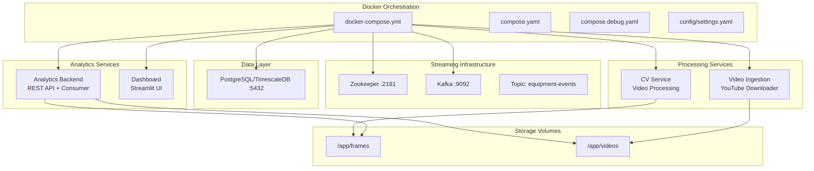
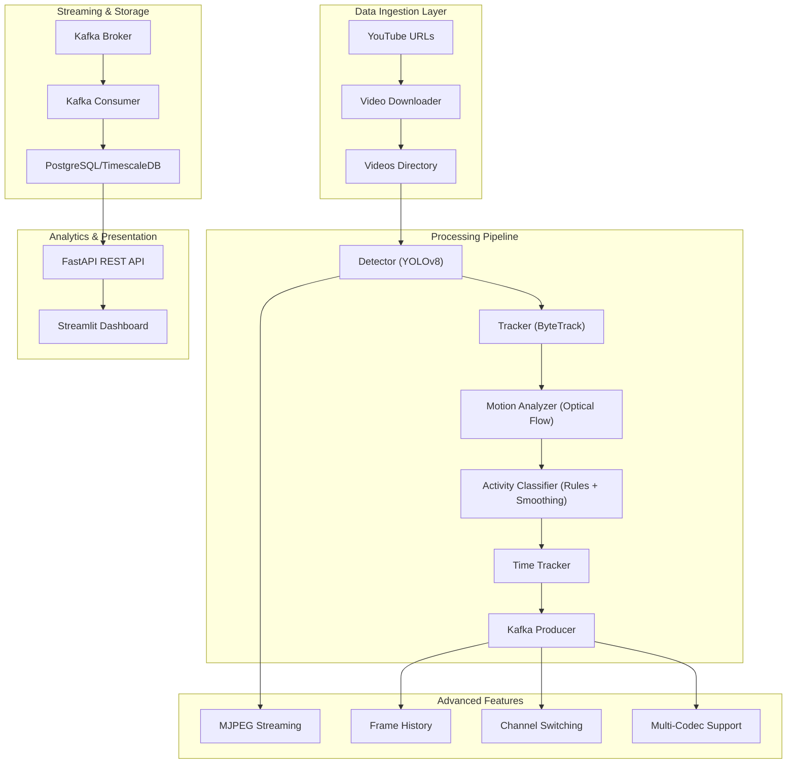
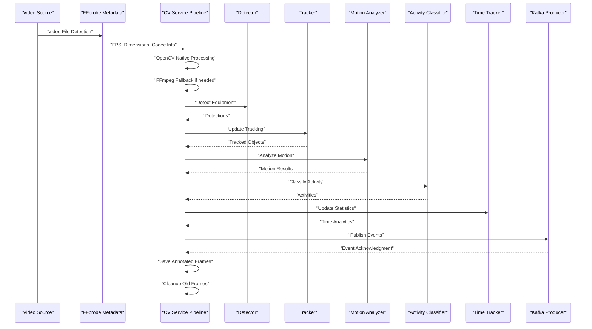
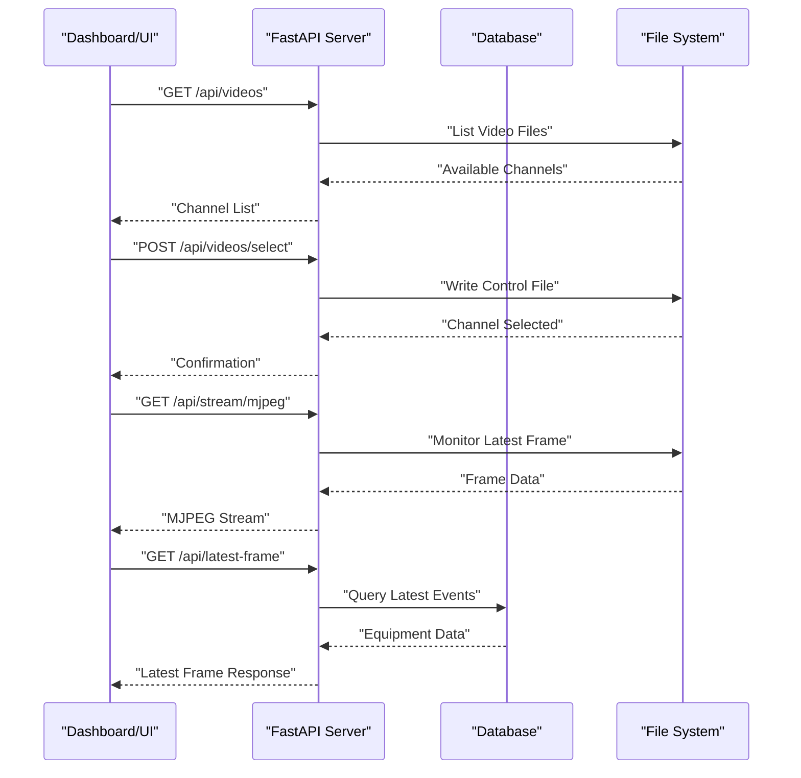
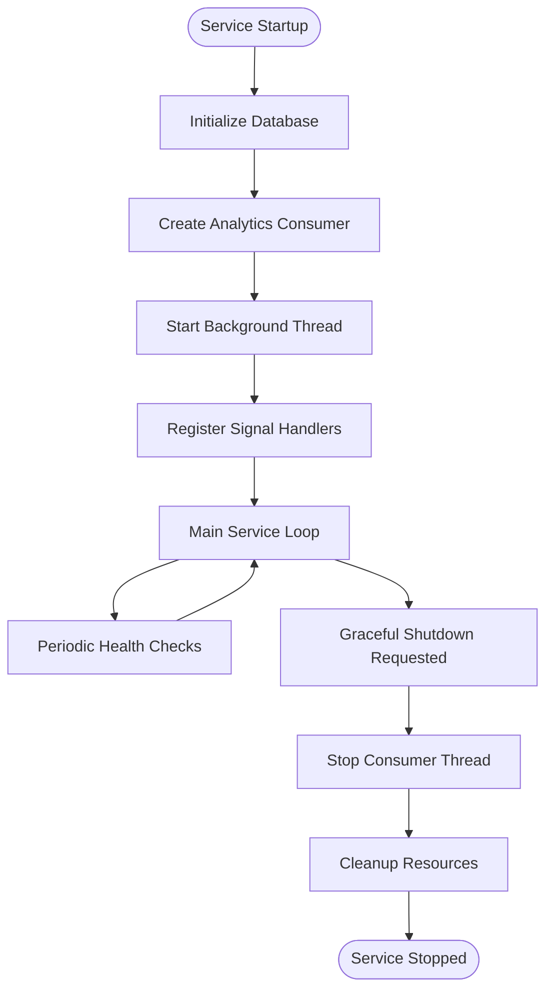
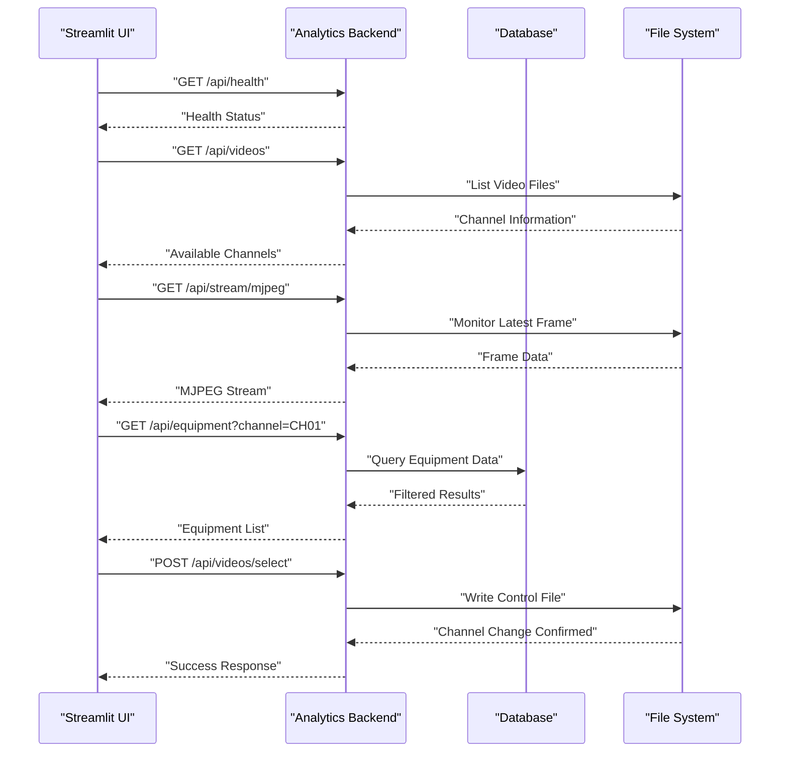
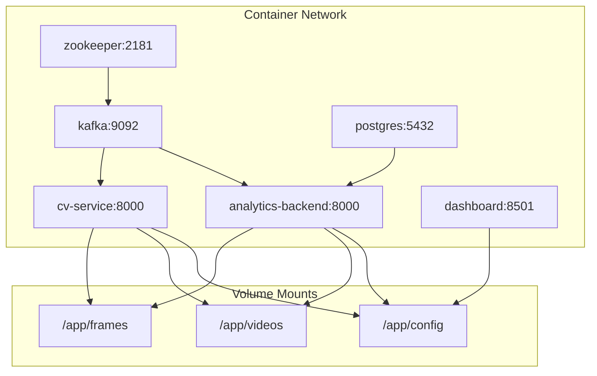

# Microservices Architecture

<cite>
**Referenced Files in This Document**
- [docker-compose.yml](file://docker-compose.yml)
- [compose.yaml](file://compose.yaml)
- [compose.debug.yaml](file://compose.debug.yaml)
- [settings.yaml](file://config/settings.yaml)
- [cv_service main.py](file://services/cv_service/src/main.py)
- [cv_service Dockerfile](file://services/cv_service/Dockerfile)
- [cv_service kafka_producer.py](file://services/cv_service/src/kafka_producer.py)
- [cv_service detector.py](file://services/cv_service/src/detector.py)
- [cv_service tracker.py](file://services/cv_service/src/tracker.py)
- [cv_service motion_analyzer.py](file://services/cv_service/src/motion_analyzer.py)
- [cv_service activity_classifier.py](file://services/cv_service/src/activity_classifier.py)
- [analytics_backend main.py](file://services/analytics_backend/src/main.py)
- [analytics_backend Dockerfile](file://services/analytics_backend/Dockerfile)
- [analytics_backend api.py](file://services/analytics_backend/src/api.py)
- [analytics_backend consumer.py](file://services/analytics_backend/src/consumer.py)
- [analytics_backend db_models.py](file://services/analytics_backend/src/db_models.py)
- [dashboard app.py](file://services/dashboard/src/app.py)
- [dashboard Dockerfile](file://services/dashboard/Dockerfile)
- [video_ingestion Dockerfile](file://services/video_ingestion/Dockerfile)
- [video_ingestion downloader.py](file://services/video_ingestion/src/downloader.py)
</cite>

## Update Summary
**Changes Made**
- Enhanced CV Service with advanced video processing capabilities including multiple codec support and dynamic video channel switching
- Expanded Analytics Backend with sophisticated API endpoints for video channel management and frame history
- Added comprehensive Docker Compose orchestration with health checks and volume mounting
- Implemented MJPEG streaming support for real-time video feed visualization
- Enhanced frame history management with configurable retention limits
- Added debug mode support for development workflow

## Table of Contents
1. [Introduction](#introduction)
2. [Project Structure](#project-structure)
3. [Core Components](#core-components)
4. [Architecture Overview](#architecture-overview)
5. [Detailed Component Analysis](#detailed-component-analysis)
6. [Docker Orchestration and Deployment](#docker-orchestration-and-deployment)
7. [Advanced Features and Capabilities](#advanced-features-and-capabilities)
8. [Performance Considerations](#performance-considerations)
9. [Troubleshooting Guide](#troubleshooting-guide)
10. [Conclusion](#conclusion)
11. [Appendices](#appendices)

## Introduction
This document explains the comprehensive microservices-based architecture for the equipment monitoring system. The pipeline implements a sophisticated event-driven architecture with six core services that work together to provide real-time equipment detection, tracking, and analytics capabilities.

The system emphasizes fault isolation, scalability, and maintainability through Docker-based orchestration, Apache Kafka event streaming, and modular service responsibilities. Key enhancements include support for multiple video codecs, dynamic video channel switching, frame history management, and advanced MJPEG streaming for real-time visualization.

## Project Structure
The repository organizes code by service with comprehensive Docker orchestration. The architecture consists of six interconnected services with centralized configuration management and persistent storage.

**Diagram sources**
- [docker-compose.yml:1-99](file://docker-compose.yml#L1-L99)
- [compose.yaml:1-9](file://compose.yaml#L1-L9)
- [compose.debug.yaml:1-11](file://compose.debug.yaml#L1-L11)

**Section sources**
- [docker-compose.yml:1-99](file://docker-compose.yml#L1-L99)
- [compose.yaml:1-9](file://compose.yaml#L1-L9)
- [compose.debug.yaml:1-11](file://compose.debug.yaml#L1-L11)
- [settings.yaml:1-59](file://config/settings.yaml#L1-L59)

## Core Components
The system comprises six specialized microservices, each with distinct responsibilities in the equipment monitoring pipeline:

### CV Service (Enhanced)
- **Primary Function**: Real-time computer vision processing with advanced video codec support
- **Capabilities**: Multi-format video decoding (MP4, AVI, MOV, MKV, WebM), dynamic channel switching, frame history management
- **Processing Pipeline**: Detection → Tracking → Motion Analysis → Activity Classification → Time Tracking → Kafka Publishing
- **Advanced Features**: FFmpeg fallback for unsupported codecs, configurable frame skipping, dynamic video selection

### Analytics Backend (Expanded)
- **Primary Function**: Persistent storage, REST API, and Kafka consumer with sophisticated endpoints
- **Capabilities**: Video channel management, frame history retrieval, MJPEG streaming, comprehensive analytics
- **API Endpoints**: Health checks, equipment listing, utilization summaries, latest frame data, statistics, and streaming endpoints
- **Database Integration**: TimescaleDB hypertable optimization for time-series performance

### Streamlit Dashboard (Enhanced)
- **Primary Function**: Real-time visualization with advanced monitoring capabilities
- **Capabilities**: CCTV-style interface, MJPEG video streaming, equipment filtering, channel selection
- **Features**: Live status monitoring, utilization metrics, equipment tracking, historical frame viewing

### Video Ingestion Service
- **Primary Function**: YouTube video downloading and preprocessing
- **Capabilities**: Batch processing, URL management, format conversion, quality optimization
- **Integration**: Seamless integration with CV service pipeline

### Kafka Infrastructure
- **Primary Function**: Event streaming and decoupling producers from consumers
- **Configuration**: Auto-topic creation, replication factors, health monitoring
- **Topics**: Single equipment-events topic for all processing stages

### Database Layer
- **Primary Function**: Persistent storage for equipment events and analytics data
- **Technology**: PostgreSQL with TimescaleDB extension for time-series optimization
- **Features**: Automatic hypertable creation, bulk operations, connection pooling

**Section sources**
- [cv_service main.py:48-721](file://services/cv_service/src/main.py#L48-L721)
- [analytics_backend main.py:64-147](file://services/analytics_backend/src/main.py#L64-L147)
- [analytics_backend api.py:162-648](file://services/analytics_backend/src/api.py#L162-L648)
- [dashboard app.py:34-800](file://services/dashboard/src/app.py#L34-L800)
- [video_ingestion downloader.py:30-276](file://services/video_ingestion/src/downloader.py#L30-L276)

## Architecture Overview
The system follows a sophisticated event-driven microservices pattern with comprehensive service orchestration and real-time processing capabilities.

**Diagram sources**
- [cv_service main.py:229-397](file://services/cv_service/src/main.py#L229-L397)
- [cv_service main.py:643-721](file://services/cv_service/src/main.py#L643-L721)
- [analytics_backend api.py:466-561](file://services/analytics_backend/src/api.py#L466-L561)
- [analytics_backend api.py:567-622](file://services/analytics_backend/src/api.py#L567-L622)

**Section sources**
- [cv_service main.py:48-721](file://services/cv_service/src/main.py#L48-L721)
- [analytics_backend api.py:162-648](file://services/analytics_backend/src/api.py#L162-L648)
- [settings.yaml:1-59](file://config/settings.yaml#L1-L59)

## Detailed Component Analysis

### Enhanced CV Service Orchestration
The CV Service has been significantly enhanced with advanced video processing capabilities and dynamic channel management:

#### Advanced Video Processing Features
- **Multi-Codec Support**: Automatic fallback from OpenCV to FFmpeg for unsupported codecs (AV1/dav1d)
- **Dynamic Channel Switching**: Real-time video source selection via control file mechanism
- **Frame History Management**: Configurable retention with automatic cleanup (MAX_FRAME_HISTORY = 100)
- **Performance Optimization**: Configurable frame skipping, resizing, and CPU-friendly processing

#### Processing Pipeline Enhancements
1. **Video Metadata Detection**: FFprobe integration for accurate FPS and dimension detection
2. **Robust Frame Iteration**: Dual-path processing with OpenCV native support and FFmpeg fallback
3. **State Management**: Clean component reset for each video channel to prevent cross-contamination
4. **Real-time Monitoring**: Continuous frame annotation and MJPEG stream generation

**Diagram sources**
- [cv_service main.py:195-397](file://services/cv_service/src/main.py#L195-L397)
- [cv_service main.py:467-517](file://services/cv_service/src/main.py#L467-L517)
- [cv_service main.py:643-721](file://services/cv_service/src/main.py#L643-L721)

**Section sources**
- [cv_service main.py:195-397](file://services/cv_service/src/main.py#L195-L397)
- [cv_service main.py:467-517](file://services/cv_service/src/main.py#L467-L517)
- [cv_service main.py:643-721](file://services/cv_service/src/main.py#L643-L721)

### Expanded Analytics Backend REST API
The Analytics Backend now provides comprehensive API endpoints for advanced monitoring and management:

#### Core API Endpoints
- **Health Management**: `/api/health` - Database connectivity verification
- **Equipment Monitoring**: `/api/equipment` - Latest equipment states with channel filtering
- **Historical Data**: `/api/equipment/{id}/history` - Time-series event history
- **Utilization Analytics**: `/api/utilization/summary` - Aggregate statistics with channel support
- **Real-time Data**: `/api/latest-frame` - Current frame equipment information
- **Statistics**: `/api/stats` - Database metrics and event counts

#### Advanced Features
- **Video Channel Management**: `/api/videos`, `/api/videos/select` for dynamic channel switching
- **Frame Retrieval**: `/api/frame/{id}` for historical frame access
- **Streaming Support**: `/api/stream/mjpeg` for real-time video feed
- **Image Serving**: `/api/latest-frame-image` for annotated frame delivery

**Diagram sources**
- [analytics_backend api.py:567-622](file://services/analytics_backend/src/api.py#L567-L622)
- [analytics_backend api.py:466-561](file://services/analytics_backend/src/api.py#L466-L561)
- [analytics_backend api.py:374-423](file://services/analytics_backend/src/api.py#L374-L423)

**Section sources**
- [analytics_backend api.py:162-648](file://services/analytics_backend/src/api.py#L162-L648)
- [analytics_backend db_models.py:22-191](file://services/analytics_backend/src/db_models.py#L22-L191)

### Kafka Consumer and Persistence Enhancement
The Analytics Consumer has been enhanced with improved reliability and performance:

#### Consumer Improvements
- **Background Thread Management**: Coordinated shutdown through threading.Event
- **Signal Handling**: Graceful shutdown on SIGTERM/SIGINT signals
- **Database Integration**: SQLAlchemy engine injection for session management
- **Health Monitoring**: Integrated with main service lifecycle

**Diagram sources**
- [analytics_backend main.py:104-147](file://services/analytics_backend/src/main.py#L104-L147)
- [analytics_backend consumer.py:93-205](file://services/analytics_backend/src/consumer.py#L93-L205)

**Section sources**
- [analytics_backend main.py:64-147](file://services/analytics_backend/src/main.py#L64-L147)
- [analytics_backend consumer.py:23-244](file://services/analytics_backend/src/consumer.py#L23-L244)

### Enhanced Streamlit Dashboard Implementation
The Dashboard has been significantly enhanced with advanced monitoring capabilities:

#### Advanced Features
- **CCTV-Style Interface**: Professional dark theme with live indicators
- **MJPEG Streaming**: Real-time video feed with automatic reconnection
- **Channel Management**: Dynamic video source selection with API integration
- **Equipment Filtering**: Individual equipment highlighting and focus
- **Performance Metrics**: Real-time utilization statistics and frame counters

#### Dashboard Architecture
- **Fragment-Based Rendering**: Independent refresh zones to prevent MJPEG disruption
- **API Integration**: Comprehensive endpoint coverage for all monitoring needs
- **Responsive Design**: Optimized for various screen sizes and resolutions
- **Error Handling**: Robust error recovery and user feedback mechanisms

**Diagram sources**
- [dashboard app.py:418-442](file://services/dashboard/src/app.py#L418-L442)
- [dashboard app.py:623-686](file://services/dashboard/src/app.py#L623-L686)
- [dashboard app.py:340-442](file://services/dashboard/src/app.py#L340-L442)

**Section sources**
- [dashboard app.py:34-800](file://services/dashboard/src/app.py#L34-L800)
- [settings.yaml:55-59](file://config/settings.yaml#L55-L59)

### Enhanced Video Ingestion Service
The Video Ingestion Service provides comprehensive YouTube video downloading capabilities:

#### Key Features
- **Batch Processing**: Multiple URL support with progress tracking
- **Format Optimization**: Automatic MP4 conversion with quality settings
- **Error Resilience**: Graceful handling of download failures
- **Integration Ready**: Seamless integration with CV service pipeline

#### Download Configuration
- **Quality Selection**: Up to 720p resolution with MP4 format preference
- **Progress Monitoring**: Real-time download progress and speed reporting
- **File Management**: Automatic filename sanitization and duplicate prevention
- **Batch Operations**: Support for URL lists and individual downloads

**Section sources**
- [video_ingestion downloader.py:30-276](file://services/video_ingestion/src/downloader.py#L30-L276)

## Docker Orchestration and Deployment
The system utilizes comprehensive Docker orchestration with health checks, volume management, and service dependencies:

### Service Dependencies and Health Checks
- **Zookeeper**: Essential for Kafka coordination with readiness probes
- **Kafka**: Message broker with auto-topic creation and replication
- **PostgreSQL/TimescaleDB**: Database layer with persistent storage
- **CV Service**: Video processing with codec support and volume mounting
- **Analytics Backend**: API server with database connectivity
- **Dashboard**: Streamlit UI with port exposure and dependency management

### Volume Management Strategy
- **Persistent Data**: PostgreSQL data stored in named volumes
- **Shared Processing**: Frames directory for annotated video output
- **Video Storage**: Videos directory for input and processed content
- **Configuration**: Centralized settings accessible across services

### Environment Configuration
- **Python Unbuffered**: Ensures proper log output in containerized environment
- **Service Ports**: Exposed ports for external access and monitoring
- **Volume Mounts**: Read-write access to processing directories
- **Network Isolation**: Container-to-container communication via service names

**Diagram sources**
- [docker-compose.yml:52-95](file://docker-compose.yml#L52-L95)

**Section sources**
- [docker-compose.yml:1-99](file://docker-compose.yml#L1-L99)
- [cv_service Dockerfile:1-28](file://services/cv_service/Dockerfile#L1-L28)
- [analytics_backend Dockerfile:1-23](file://services/analytics_backend/Dockerfile#L1-L23)
- [dashboard Dockerfile:1-17](file://services/dashboard/Dockerfile#L1-L17)
- [video_ingestion Dockerfile:1-19](file://services/video_ingestion/Dockerfile#L1-L19)

## Advanced Features and Capabilities

### Multi-Codec Video Support
The CV Service now supports a comprehensive range of video formats through intelligent codec detection and fallback mechanisms:

#### Supported Formats
- **Native OpenCV Support**: MP4, AVI, MOV, MKV, WebM
- **FFmpeg Fallback**: Automatic transcoding for unsupported codecs
- **Metadata Extraction**: FFprobe integration for accurate frame rate detection
- **Format Conversion**: Seamless processing regardless of source format

#### Codec Detection Mechanism
- **OpenCV Attempt**: Primary processing using OpenCV VideoCapture
- **Fallback Logic**: Automatic transition to FFmpeg subprocess when codecs fail
- **Performance Optimization**: Direct processing when possible, transcoding only when necessary

### Dynamic Video Channel Switching
The system provides sophisticated video channel management for multi-source monitoring:

#### Channel Management Features
- **Control File Mechanism**: Text file-based channel selection signaling
- **Real-time Switching**: Immediate video source change without service restart
- **State Isolation**: Clean component reset for each video channel
- **Sequential Processing**: Automatic processing of multiple videos in order

#### Implementation Details
- **Selection Detection**: Periodic checking of control file for channel changes
- **State Management**: Component reinitialization for clean processing state
- **Cross-Channel Prevention**: Elimination of data leakage between video sources

### Enhanced Frame History Management
Comprehensive frame history tracking with configurable retention:

#### History Features
- **Configurable Limits**: MAX_FRAME_HISTORY constant controls retention
- **Automatic Cleanup**: Periodic removal of old frame files
- **Selective Access**: Individual frame retrieval by ID
- **Storage Optimization**: Efficient JPEG compression with quality settings

#### Cleanup Strategy
- **Threshold Monitoring**: Cleanup triggered every 50 processed frames
- **Retention Policy**: Maintains only recent frames based on configured limit
- **Resource Management**: Prevents disk space exhaustion from accumulated frames

### MJPEG Streaming Integration
Advanced real-time video streaming capabilities:

#### Streaming Features
- **MJPEG Protocol**: Efficient real-time video transmission
- **Automatic Reconnection**: Client-side reconnection with progressive retry
- **Timeout Management**: Server-side connection timeouts with client-side renewal
- **Performance Optimization**: Balanced frame rate and quality settings

#### Stream Configuration
- **Connection Handling**: 60-second connection lifetime with automatic renewal
- **Client Coordination**: JavaScript-based reconnection logic for seamless experience
- **Resource Efficiency**: Minimal bandwidth usage with optimized frame delivery

**Section sources**
- [cv_service main.py:195-397](file://services/cv_service/src/main.py#L195-L397)
- [cv_service main.py:608-629](file://services/cv_service/src/main.py#L608-L629)
- [cv_service main.py:630-642](file://services/cv_service/src/main.py#L630-L642)
- [analytics_backend api.py:489-561](file://services/analytics_backend/src/api.py#L489-L561)
- [dashboard app.py:623-686](file://services/dashboard/src/app.py#L623-L686)

## Performance Considerations
The enhanced architecture incorporates numerous performance optimizations for production deployment:

### CPU Optimization Strategies
- **Model Efficiency**: YOLOv8n nano model for CPU-only inference
- **Frame Skipping**: Configurable frame reduction (default: every 3rd frame)
- **Resolution Scaling**: Adjustable frame resizing for processing efficiency
- **Memory Management**: Automatic cleanup of old frame files (MAX_FRAME_HISTORY)

### Streaming and Network Optimization
- **Kafka Tuning**: Ack=all, small linger.ms, optimized batch size for throughput
- **Database Connection Pooling**: SQLAlchemy engine reuse for efficient connections
- **MJPEG Streaming**: Optimized frame delivery with automatic reconnection
- **API Concurrency**: Uvicorn configuration with 50 concurrent connections

### Storage and I/O Optimization
- **TimescaleDB Hypertables**: Time-series optimized table structure
- **Volume Mounting**: Direct filesystem access for reduced I/O overhead
- **Frame Compression**: JPEG quality settings balanced for visual fidelity vs. size
- **Cleanup Automation**: Prevents disk space exhaustion through automated cleanup

### Scalability Considerations
- **Horizontal Scaling**: Multiple CV service instances can process different video sources
- **Load Distribution**: Kafka topic partitioning enables parallel processing
- **Database Sharding**: TimescaleDB hypertable design supports time-series scaling
- **Service Independence**: Modular architecture allows independent scaling of components

**Section sources**
- [cv_service main.py:35-35](file://services/cv_service/src/main.py#L35-L35)
- [cv_service main.py:146-148](file://services/cv_service/src/main.py#L146-L148)
- [analytics_backend api.py:124-133](file://services/analytics_backend/src/api.py#L124-L133)
- [analytics_backend db_models.py:103-156](file://services/analytics_backend/src/db_models.py#L103-L156)

## Troubleshooting Guide
Comprehensive troubleshooting strategies for the enhanced microservices architecture:

### Service Health and Connectivity
- **Kafka Connectivity**: Verify Zookeeper health and topic existence; check consumer group assignment
- **Database Readiness**: Analytics Backend health endpoint validates PostgreSQL connectivity
- **Service Dependencies**: Docker health checks ensure proper startup order
- **Volume Mounts**: Verify shared directories are accessible across containers

### Video Processing Issues
- **Codec Problems**: FFmpeg fallback automatically handles unsupported codecs
- **Frame Skipping**: Adjust frame_skip configuration for performance vs. accuracy trade-offs
- **Memory Usage**: Monitor frame history cleanup and adjust MAX_FRAME_HISTORY as needed
- **Channel Switching**: Verify control file permissions and path accessibility

### API and Dashboard Problems
- **MJPEG Streaming**: Check file system permissions for /app/frames directory
- **Channel Selection**: Verify API endpoint availability and response codes
- **Equipment Filtering**: Ensure database contains expected equipment data
- **Real-time Updates**: Monitor API response times and connection stability

### Debug and Development Support
- **Debug Mode**: compose.debug.yaml enables remote debugging with debugpy
- **Development Workflow**: Separate debug configuration for local development
- **Log Levels**: Configurable logging for different operational contexts
- **Health Monitoring**: Comprehensive health checks for all service components

**Section sources**
- [analytics_backend main.py:110-119](file://services/analytics_backend/src/main.py#L110-L119)
- [cv_service main.py:149-160](file://services/cv_service/src/main.py#L149-L160)
- [compose.debug.yaml:7-11](file://compose.debug.yaml#L7-L11)

## Conclusion
The enhanced microservices architecture delivers a comprehensive, scalable solution for equipment monitoring with advanced capabilities:

### Key Achievements
- **Multi-Codec Support**: Robust video processing across diverse formats
- **Dynamic Channel Management**: Flexible video source switching without downtime
- **Real-time Streaming**: Advanced MJPEG capabilities for live monitoring
- **Comprehensive API**: Rich endpoint set for all monitoring and management needs
- **Production Ready**: Docker orchestration with health checks and scaling support

### Architectural Strengths
- **Fault Isolation**: Clear service boundaries with independent failure domains
- **Scalability**: Horizontal scaling capabilities through Kafka partitioning
- **Maintainability**: Modular design with clear separation of concerns
- **Performance**: Optimized processing pipelines with resource management
- **Monitoring**: Comprehensive health checks and observability

The system successfully balances real-time processing requirements with long-term data persistence, providing both immediate insights and historical analysis capabilities. The Docker-based deployment ensures consistent operation across different environments while supporting easy scaling and maintenance.

## Appendices

### Docker Compose Configuration Reference
Complete service definitions with their dependencies and configurations:

**Section sources**
- [docker-compose.yml:1-99](file://docker-compose.yml#L1-L99)

### Enhanced API Endpoint Reference
Comprehensive endpoint documentation with parameters and responses:

**Section sources**
- [analytics_backend api.py:162-648](file://services/analytics_backend/src/api.py#L162-L648)

### Advanced Configuration Options
Detailed configuration parameters for all system components:

**Section sources**
- [settings.yaml:1-59](file://config/settings.yaml#L1-L59)

### Debug and Development Configuration
Specialized configuration for development and debugging workflows:

**Section sources**
- [compose.debug.yaml:1-11](file://compose.debug.yaml#L1-L11)