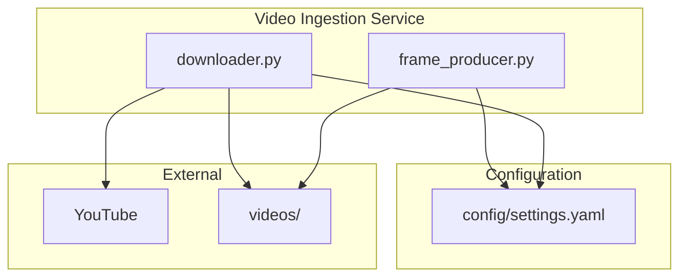
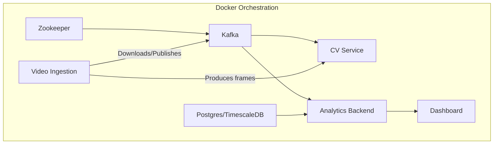
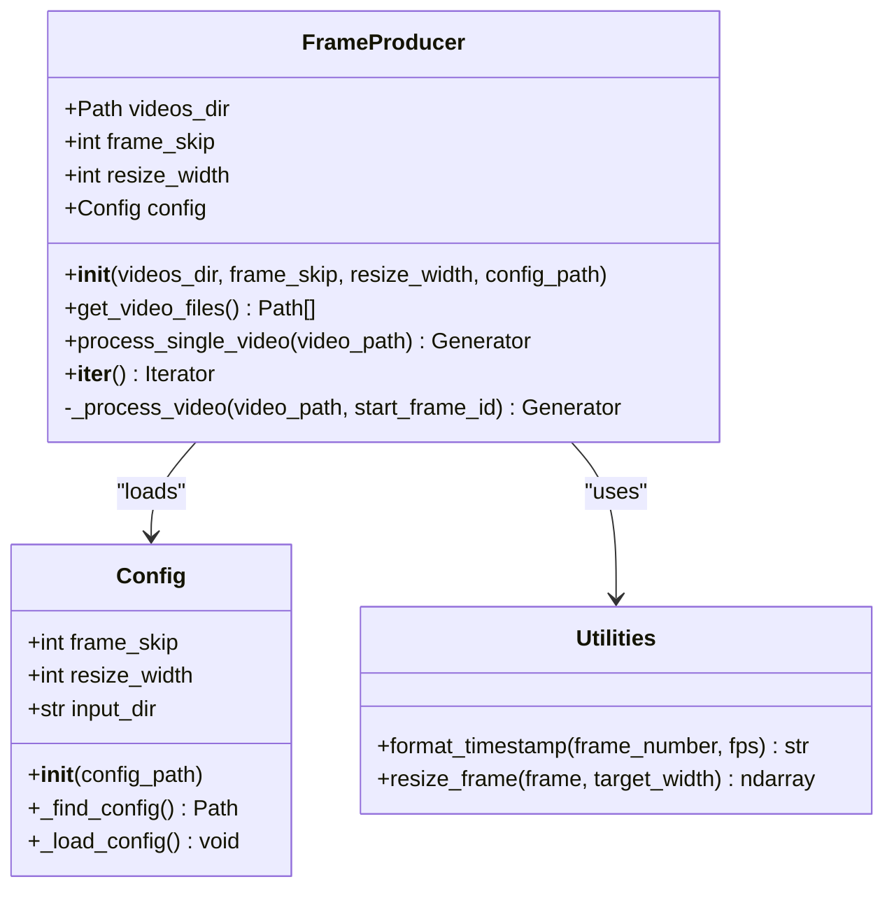
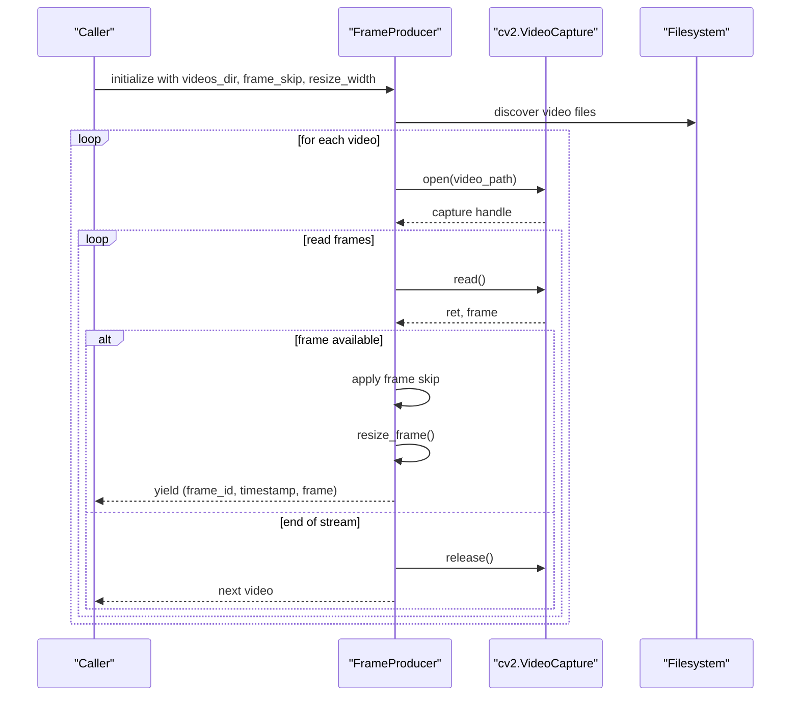
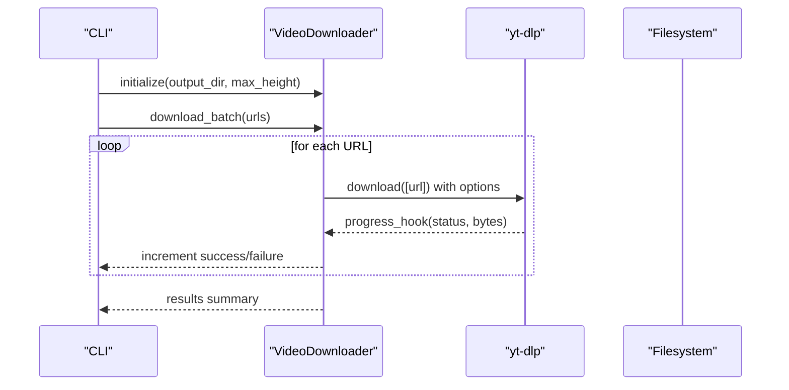
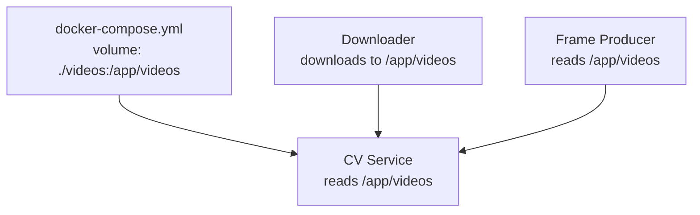
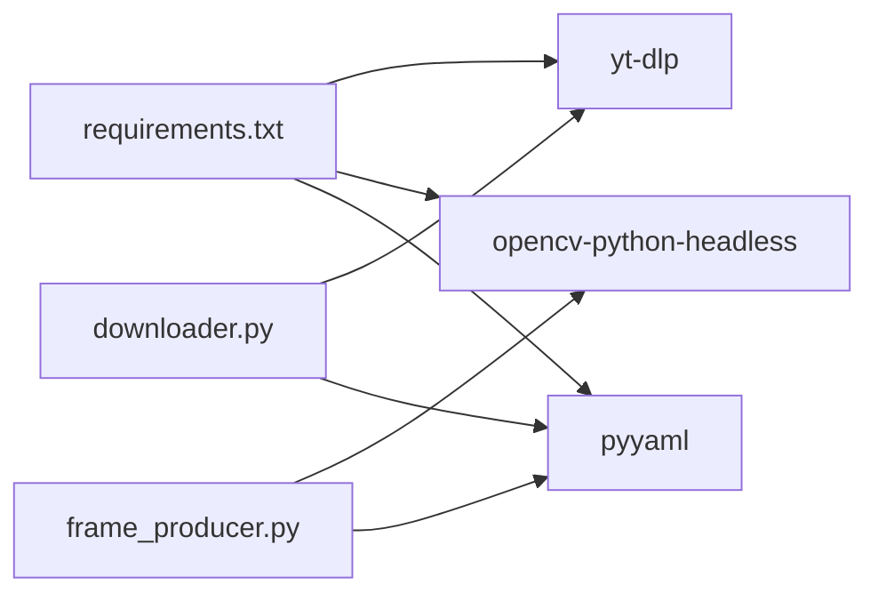

# Video Ingestion

<cite>
**Referenced Files in This Document**
- [frame_producer.py](file://services/video_ingestion/src/frame_producer.py)
- [downloader.py](file://services/video_ingestion/src/downloader.py)
- [settings.yaml](file://config/settings.yaml)
- [Dockerfile](file://services/video_ingestion/Dockerfile)
- [docker-compose.yml](file://docker-compose.yml)
- [urls.txt](file://videos/urls.txt)
- [README.md](file://README.md)
</cite>

## Table of Contents
1. [Introduction](#introduction)
2. [Project Structure](#project-structure)
3. [Core Components](#core-components)
4. [Architecture Overview](#architecture-overview)
5. [Detailed Component Analysis](#detailed-component-analysis)
6. [Dependency Analysis](#dependency-analysis)
7. [Performance Considerations](#performance-considerations)
8. [Troubleshooting Guide](#troubleshooting-guide)
9. [Conclusion](#conclusion)
10. [Appendices](#appendices)

## Introduction
This document describes the Video Ingestion microservice responsible for acquiring and preparing video content for the computer vision pipeline. It covers two primary capabilities:
- Frame extraction from local or mounted video files via a configurable frame producer
- Downloading video content from external sources (notably YouTube) using a robust downloader utility

The service integrates with the broader system by placing acquired media into a shared directory that the CV Service consumes for detection, tracking, and activity classification.

## Project Structure
The Video Ingestion service is organized around two core modules:
- Frame Producer: Extracts frames from video files with configurable frame skipping and resizing
- Downloader: Fetches videos from URLs using yt-dlp and reports progress

**Diagram sources**
- [frame_producer.py:1-414](file://services/video_ingestion/src/frame_producer.py#L1-L414)
- [downloader.py:1-276](file://services/video_ingestion/src/downloader.py#L1-L276)
- [settings.yaml:1-59](file://config/settings.yaml#L1-L59)

**Section sources**
- [README.md:340-384](file://README.md#L340-L384)
- [docker-compose.yml:51-63](file://docker-compose.yml#L51-L63)

## Core Components
- Frame Producer
  - Provides an iterator/generator interface to extract frames from video files
  - Supports configurable frame skipping and resizing to optimize CPU usage
  - Emits tuples of (frame_id, timestamp_str, frame_bgr)
  - Loads processing parameters from configuration
- Downloader
  - Downloads YouTube videos using yt-dlp with progress reporting
  - Supports single URL or batch downloads from a URLs file
  - Ensures safe filenames and avoids overwriting existing files
  - Outputs to a configurable directory (default: mounted videos/)

**Section sources**
- [frame_producer.py:144-325](file://services/video_ingestion/src/frame_producer.py#L144-L325)
- [downloader.py:30-149](file://services/video_ingestion/src/downloader.py#L30-L149)

## Architecture Overview
The Video Ingestion service participates in a multi-service pipeline orchestrated by Docker Compose. The CV Service consumes video files placed under a shared volume, while the Video Ingestion service populates that volume either by downloading content or by exposing locally stored media.

**Diagram sources**
- [docker-compose.yml:1-95](file://docker-compose.yml#L1-L95)
- [README.md:7-54](file://README.md#L7-L54)

## Detailed Component Analysis

### Frame Producer
The Frame Producer encapsulates video frame extraction with configurable parameters and robust logging.

Key behaviors:
- Configuration loading from YAML with Docker-aware fallbacks
- Video discovery within a configurable directory
- Frame iteration with frame skipping and resizing
- Timestamp formatting derived from frame number and FPS
- Safe resource cleanup via context management

Processing logic highlights:
- Validates frame_skip >= 1
- Iterates through video files in sorted order
- For each frame, applies frame skip, computes timestamp, resizes frame, and yields
- Maintains a monotonically increasing frame_id across videos

**Diagram sources**
- [frame_producer.py:34-93](file://services/video_ingestion/src/frame_producer.py#L34-L93)
- [frame_producer.py:144-325](file://services/video_ingestion/src/frame_producer.py#L144-L325)
- [frame_producer.py:95-142](file://services/video_ingestion/src/frame_producer.py#L95-L142)

**Diagram sources**
- [frame_producer.py:222-292](file://services/video_ingestion/src/frame_producer.py#L222-L292)

Configuration and defaults:
- frame_skip: default 3 (process every 3rd frame)
- resize_width: default 640
- input_dir: default "/app/videos"

Supported video formats: mp4, avi, mov, mkv, webm, m4v

**Section sources**
- [frame_producer.py:34-93](file://services/video_ingestion/src/frame_producer.py#L34-L93)
- [frame_producer.py:158-159](file://services/video_ingestion/src/frame_producer.py#L158-L159)
- [frame_producer.py:222-292](file://services/video_ingestion/src/frame_producer.py#L222-L292)
- [settings.yaml:3-6](file://config/settings.yaml#L3-L6)

### Downloader Utility
The Downloader wraps yt-dlp to fetch videos from URLs with progress reporting and batch processing.

Key behaviors:
- Configurable output directory (supports Docker-mounted path)
- yt-dlp options tailored for CPU-friendly downloads (e.g., best mp4 up to max_height)
- Progress hook reporting percentage and speed
- Batch processing with success/failure counting
- Safe filename handling and no-overwrite policy

**Diagram sources**
- [downloader.py:107-149](file://services/video_ingestion/src/downloader.py#L107-L149)
- [downloader.py:223-272](file://services/video_ingestion/src/downloader.py#L223-L272)

Operational notes:
- Default output directory is the mounted videos/ folder
- URLs can be passed as arguments or loaded from videos/urls.txt
- Ignores comments and empty lines in the URLs file
- Continues on errors and logs failures

**Section sources**
- [downloader.py:30-83](file://services/video_ingestion/src/downloader.py#L30-L83)
- [downloader.py:107-149](file://services/video_ingestion/src/downloader.py#L107-L149)
- [downloader.py:151-174](file://services/video_ingestion/src/downloader.py#L151-L174)
- [downloader.py:223-272](file://services/video_ingestion/src/downloader.py#L223-L272)
- [urls.txt:1-4](file://videos/urls.txt#L1-L4)

### Integration with CV Service
The Video Ingestion service integrates with the CV Service through shared volumes:
- The CV Service mounts the videos directory to consume downloaded or locally present media
- The Downloader writes to the mounted videos directory
- The Frame Producer reads from the same directory for local frame extraction workflows

**Diagram sources**
- [docker-compose.yml:59-59](file://docker-compose.yml#L59-L59)
- [docker-compose.yml:236-238](file://docker-compose.yml#L236-L238)

**Section sources**
- [docker-compose.yml:59-59](file://docker-compose.yml#L59-L59)
- [README.md:101-104](file://README.md#L101-L104)

## Dependency Analysis
- Python dependencies are declared in the service’s requirements file
- The Downloader relies on yt-dlp for fetching media
- The Frame Producer relies on OpenCV for video capture and NumPy for frame manipulation
- Configuration is centralized in settings.yaml and consumed by both components

**Diagram sources**
- [requirements.txt:1-4](file://services/video_ingestion/requirements.txt#L1-L4)
- [frame_producer.py:14-16](file://services/video_ingestion/src/frame_producer.py#L14-L16)
- [downloader.py:15](file://services/video_ingestion/src/downloader.py#L15)

**Section sources**
- [requirements.txt:1-4](file://services/video_ingestion/requirements.txt#L1-L4)
- [frame_producer.py:14-16](file://services/video_ingestion/src/frame_producer.py#L14-L16)
- [downloader.py:15](file://services/video_ingestion/src/downloader.py#L15)

## Performance Considerations
- Frame skipping reduces processing load by N (default 3), lowering CPU usage proportionally
- Resizing frames to a smaller width (default 640) decreases pixel count and speeds inference
- Using headless OpenCV avoids GUI overhead during batch processing
- yt-dlp selects optimal formats and merges audio/video efficiently
- Dockerized ffmpeg ensures consistent codec support across environments

Practical tuning guidelines:
- Increase frame_skip for higher CPU savings (e.g., 5)
- Reduce resize_width for more aggressive CPU optimization (e.g., 480)
- Prefer mp4 container and compatible codecs for broad decoder support

**Section sources**
- [README.md:177-198](file://README.md#L177-L198)
- [settings.yaml:3-6](file://config/settings.yaml#L3-L6)
- [Dockerfile:6](file://services/video_ingestion/Dockerfile#L6)

## Troubleshooting Guide
Common issues and resolutions:
- Configuration file not found
  - Symptom: Initialization fails with a configuration error
  - Cause: settings.yaml missing or inaccessible
  - Resolution: Ensure config is mounted or present at expected paths; verify Docker volume mapping
  - Reference: [frame_producer.py:54-76](file://services/video_ingestion/src/frame_producer.py#L54-L76), [downloader.py:235-239](file://services/video_ingestion/src/downloader.py#L235-L239)
- No video files discovered
  - Symptom: FrameProducer logs “No video files found”
  - Cause: videos directory empty or wrong path
  - Resolution: Verify mounted directory and supported extensions
  - Reference: [frame_producer.py:208-220](file://services/video_ingestion/src/frame_producer.py#L208-L220)
- Video cannot be opened
  - Symptom: Error log “Failed to open video”
  - Cause: Corrupted file, unsupported codec, or permission issue
  - Resolution: Validate file integrity and permissions; check codec support
  - Reference: [frame_producer.py:242-244](file://services/video_ingestion/src/frame_producer.py#L242-L244)
- Download failures
  - Symptom: Failed to download URL reported
  - Cause: Network issues, invalid URL, or site restrictions
  - Resolution: Retry with working URLs; check network connectivity
  - Reference: [downloader.py:122-124](file://services/video_ingestion/src/downloader.py#L122-L124)
- Progress reporting not visible
  - Symptom: No progress output during batch downloads
  - Cause: Headless environment or suppressed output
  - Resolution: Ensure terminal supports progress printing; run with interactive shell
  - Reference: [downloader.py:91-105](file://services/video_ingestion/src/downloader.py#L91-L105)

Operational tips:
- Use Docker Compose to mount the videos directory consistently across services
- Validate that the Downloader writes to the same path the CV Service reads from
- Confirm that the configuration file is readable by the service container

**Section sources**
- [frame_producer.py:54-76](file://services/video_ingestion/src/frame_producer.py#L54-L76)
- [frame_producer.py:208-220](file://services/video_ingestion/src/frame_producer.py#L208-L220)
- [frame_producer.py:242-244](file://services/video_ingestion/src/frame_producer.py#L242-L244)
- [downloader.py:122-124](file://services/video_ingestion/src/downloader.py#L122-L124)
- [downloader.py:91-105](file://services/video_ingestion/src/downloader.py#L91-L105)
- [docker-compose.yml:59-59](file://docker-compose.yml#L59-L59)

## Conclusion
The Video Ingestion microservice provides essential ingestion capabilities for the computer vision pipeline. Its Frame Producer offers flexible, CPU-efficient frame extraction with configurable frame skipping and resizing, while the Downloader reliably acquires external video content with progress tracking and batch support. Together, they integrate seamlessly with the CV Service through shared volumes, enabling scalable video processing workflows.

## Appendices

### Practical Workflows
- Download videos for processing
  - Add URLs to videos/urls.txt
  - Run the downloader inside the CV Service container to populate the videos directory
  - Reference: [README.md:96-104](file://README.md#L96-L104), [urls.txt:1-4](file://videos/urls.txt#L1-L4)
- Local batch processing
  - Place video files in the mounted videos directory
  - Use the Frame Producer to iterate frames with desired frame_skip and resize_width
  - Reference: [frame_producer.py:293-325](file://services/video_ingestion/src/frame_producer.py#L293-L325), [settings.yaml:3-6](file://config/settings.yaml#L3-L6)

### Configuration Options
- Video processing parameters
  - frame_skip: integer; default 3
  - resize_width: integer; default 640
  - input_dir: string; default “/app/videos”
- Downloader parameters
  - output_dir: string; default “/app/videos” (when mounted)
  - max_height: integer; default 720

**Section sources**
- [settings.yaml:3-6](file://config/settings.yaml#L3-L6)
- [downloader.py:40-54](file://services/video_ingestion/src/downloader.py#L40-L54)
- [frame_producer.py:161-191](file://services/video_ingestion/src/frame_producer.py#L161-L191)