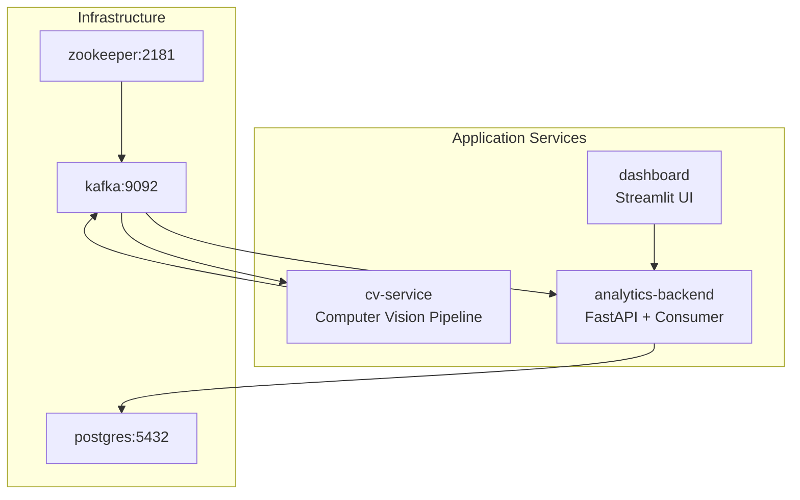
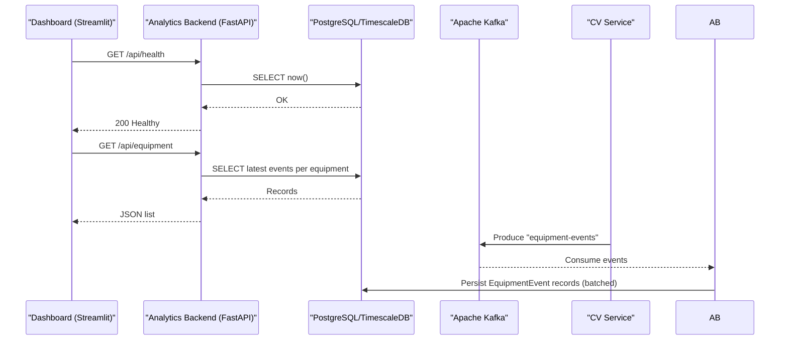
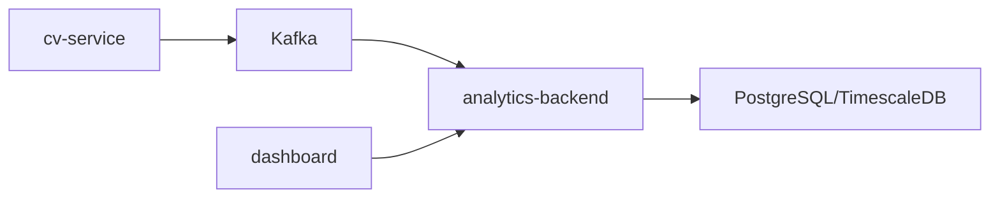

# Monitoring and Maintenance

<cite>
**Referenced Files in This Document**
- [README.md](file://README.md)
- [docker-compose.yml](file://docker-compose.yml)
- [settings.yaml](file://config/settings.yaml)
- [analytics_backend main.py](file://services/analytics_backend/src/main.py)
- [analytics_backend api.py](file://services/analytics_backend/src/api.py)
- [analytics_backend consumer.py](file://services/analytics_backend/src/consumer.py)
- [analytics_backend db_models.py](file://services/analytics_backend/src/db_models.py)
- [cv_service main.py](file://services/cv_service/src/main.py)
- [dashboard app.py](file://services/dashboard/src/app.py)
- [video_ingestion downloader.py](file://services/video_ingestion/src/downloader.py)
- [video_ingestion frame_producer.py](file://services/video_ingestion/src/frame_producer.py)
- [cv_service Dockerfile](file://services/cv_service/Dockerfile)
- [analytics_backend Dockerfile](file://services/analytics_backend/Dockerfile)
- [dashboard Dockerfile](file://services/dashboard/Dockerfile)
- [video_ingestion Dockerfile](file://services/video_ingestion/Dockerfile)
</cite>

## Table of Contents
1. [Introduction](#introduction)
2. [Project Structure](#project-structure)
3. [Core Components](#core-components)
4. [Architecture Overview](#architecture-overview)
5. [Detailed Component Analysis](#detailed-component-analysis)
6. [Dependency Analysis](#dependency-analysis)
7. [Performance Considerations](#performance-considerations)
8. [Troubleshooting Guide](#troubleshooting-guide)
9. [Conclusion](#conclusion)
10. [Appendices](#appendices)

## Introduction
This document focuses on monitoring system health, performance metrics, and operational maintenance for the equipment monitoring pipeline. It explains health check endpoints, system monitoring strategies, alerting configurations, performance monitoring for computer vision processing, database query optimization, API response times, logging strategies, log aggregation, troubleshooting methodologies, maintenance procedures for video processing and database cleanup, capacity planning, resource utilization monitoring, scaling considerations, incident response procedures, error handling strategies, system recovery processes, practical examples of monitoring dashboards and operational runbooks, and security monitoring and compliance considerations.

## Project Structure
The system is composed of six services orchestrated via Docker Compose:
- zookeeper:2181 (Kafka coordination)
- kafka:9092 (event streaming)
- postgres:5432 (TimescaleDB for time-series storage)
- cv-service: runs the computer vision pipeline
- analytics-backend: FastAPI REST API + Kafka consumer
- dashboard: Streamlit real-time monitoring UI

**Diagram sources**
- [docker-compose.yml:1-95](file://docker-compose.yml#L1-L95)

**Section sources**
- [docker-compose.yml:1-95](file://docker-compose.yml#L1-L95)
- [README.md:56-66](file://README.md#L56-L66)

## Core Components
- Health checks:
  - Analytics backend exposes a health endpoint that validates database connectivity.
  - Docker Compose defines health checks for zookeeper, kafka, and postgres.
- Monitoring and dashboards:
  - Streamlit dashboard consumes analytics backend endpoints to present real-time equipment status and utilization.
- Data persistence:
  - PostgreSQL with TimescaleDB hypertable optimization for time-series data.
- Event streaming:
  - Kafka topic “equipment-events” decouples CV processing from persistence and enables future consumers.

Key endpoints:
- GET /api/health: verifies API and database health
- GET /api/equipment: latest equipment states
- GET /api/equipment/{id}/history: per-equipment time series
- GET /api/utilization/summary: aggregate utilization statistics
- GET /api/latest-frame: current frame data for real-time display
- GET /api/stats: database statistics

**Section sources**
- [analytics_backend api.py:159-177](file://services/analytics_backend/src/api.py#L159-L177)
- [docker-compose.yml:9-13](file://docker-compose.yml#L9-L13)
- [docker-compose.yml:28-33](file://docker-compose.yml#L28-L33)
- [docker-compose.yml:45-49](file://docker-compose.yml#L45-L49)
- [README.md:236-246](file://README.md#L236-L246)

## Architecture Overview
The monitoring and maintenance architecture integrates health checks, logging, event streaming, database persistence, and a real-time dashboard.

**Diagram sources**
- [analytics_backend api.py:159-177](file://services/analytics_backend/src/api.py#L159-L177)
- [analytics_backend api.py:179-223](file://services/analytics_backend/src/api.py#L179-L223)
- [analytics_backend consumer.py:143-200](file://services/analytics_backend/src/consumer.py#L143-L200)
- [analytics_backend db_models.py:22-67](file://services/analytics_backend/src/db_models.py#L22-L67)

## Detailed Component Analysis

### Health Checks and System Monitoring
- Zookeeper health check probes the “ruok” endpoint.
- Kafka health check uses “kafka-broker-api-versions” against localhost:9092.
- Postgres health check uses “pg_isready”.
- Analytics backend health endpoint executes a simple SQL query to validate database connectivity.

Operational guidance:
- Use Docker Compose health checks to monitor service readiness.
- Monitor Kafka consumer lag and offsets to ensure timely processing.
- Track database connection pool saturation and TimescaleDB hypertable performance.

**Section sources**
- [docker-compose.yml:9-13](file://docker-compose.yml#L9-L13)
- [docker-compose.yml:28-33](file://docker-compose.yml#L28-L33)
- [docker-compose.yml:45-49](file://docker-compose.yml#L45-L49)
- [analytics_backend api.py:159-177](file://services/analytics_backend/src/api.py#L159-L177)

### Logging and Log Aggregation
- Centralized logging:
  - Analytics backend and CV service use structured logging with timestamps and severity levels.
  - FastAPI access logs are enabled.
- Log aggregation:
  - Recommended: deploy a lightweight aggregator (e.g., filebeat/fluent-bit) to ship logs to Elasticsearch/Opensearch or a SIEM.
  - Tag logs by service (cv-service, analytics-backend, kafka, zookeeper, postgres).
- Log retention:
  - Enforce rotation policies (size/time-based) to avoid disk pressure.

Best practices:
- Standardize log format and include correlation IDs for cross-service tracing.
- Separate access logs from application logs for performance and noise control.

**Section sources**
- [analytics_backend main.py:18-26](file://services/analytics_backend/src/main.py#L18-L26)
- [analytics_backend main.py:124-131](file://services/analytics_backend/src/main.py#L124-L131)
- [cv_service main.py:31-39](file://services/cv_service/src/main.py#L31-L39)

### Performance Monitoring Approaches

#### Computer Vision Processing
- Frame skipping and resizing reduce CPU load; tune via settings.yaml.
- Effective FPS is computed by dividing declared FPS by frame_skip.
- Monitor:
  - Frame processing throughput (events per second).
  - Memory usage for frame buffers and optical flow arrays.
  - CPU utilization per cv-service container.

Optimization levers:
- Increase frame_skip for very long videos.
- Reduce resize_width for constrained environments.
- Ensure adequate CPU allocation in Docker resources.

**Section sources**
- [cv_service main.py:205-210](file://services/cv_service/src/main.py#L205-L210)
- [cv_service main.py:236-244](file://services/cv_service/src/main.py#L236-L244)
- [settings.yaml:3-7](file://config/settings.yaml#L3-L7)

#### Database Query Optimization
- TimescaleDB hypertable on equipment_events for time-series optimization.
- Indexes:
  - equipment_id (already indexed)
  - created_at (hypertable partitioning key)
- Queries:
  - Use LIMIT and OFFSET for paginated history.
  - Prefer time-range filters to reduce scans.
  - Aggregate queries leverage TimescaleDB continuous aggregates if needed.

**Section sources**
- [analytics_backend db_models.py:29-43](file://services/analytics_backend/src/db_models.py#L29-L43)
- [analytics_backend db_models.py:103-156](file://services/analytics_backend/src/db_models.py#L103-L156)
- [analytics_backend api.py:186-206](file://services/analytics_backend/src/api.py#L186-L206)
- [analytics_backend api.py:299-317](file://services/analytics_backend/src/api.py#L299-L317)

#### API Response Times
- Endpoints:
  - /api/health: lightweight DB ping
  - /api/equipment: grouped latest records per equipment
  - /api/utilization/summary: aggregate computations
  - /api/latest-frame: latest frame aggregation
  - /api/stats: lightweight counts
- Latency targets:
  - Health: < 100ms
  - Equipment list: < 200ms
  - Utilization summary: < 500ms
  - Latest frame: < 200ms
  - Stats: < 100ms

Instrumentation:
- Enable FastAPI access logs and measure response times.
- Add Prometheus metrics for endpoint latency and error rates.

**Section sources**
- [analytics_backend api.py:159-177](file://services/analytics_backend/src/api.py#L159-L177)
- [analytics_backend api.py:179-223](file://services/analytics_backend/src/api.py#L179-L223)
- [analytics_backend api.py:286-367](file://services/analytics_backend/src/api.py#L286-L367)
- [analytics_backend api.py:370-416](file://services/analytics_backend/src/api.py#L370-L416)
- [analytics_backend api.py:418-444](file://services/analytics_backend/src/api.py#L418-L444)

### Kafka Event Streaming and Backpressure
- Producer: cv-service publishes “equipment-events” to Kafka.
- Consumer: analytics-backend consumes and persists in batches.
- Batch commit ensures durability and throughput.
- Monitor:
  - Consumer lag (offset lag)
  - Topic partition distribution
  - Producer failures and retries

Mitigations:
- Adjust batch size and timeouts for throughput vs latency.
- Scale consumer replicas within the consumer group for parallelism.

**Section sources**
- [cv_service main.py:401-404](file://services/cv_service/src/main.py#L401-L404)
- [analytics_backend consumer.py:143-200](file://services/analytics_backend/src/consumer.py#L143-L200)
- [analytics_backend consumer.py:206-228](file://services/analytics_backend/src/consumer.py#L206-L228)

### Real-Time Dashboard and Metrics
- Dashboard polls:
  - /api/health (connection status)
  - /api/equipment (live status)
  - /api/utilization/summary (aggregate metrics)
  - /api/latest-frame (current frame)
  - /api/stats (database stats)
- Refresh intervals:
  - Tune refresh_interval for responsiveness vs network load.

**Section sources**
- [dashboard app.py:100-108](file://services/dashboard/src/app.py#L100-L108)
- [dashboard app.py:110-160](file://services/dashboard/src/app.py#L110-L160)
- [settings.yaml:55-58](file://config/settings.yaml#L55-L58)

### Operational Maintenance Procedures

#### Video Processing
- Add video URLs to videos/urls.txt.
- Download videos using the video ingestion service.
- Run cv-service in file or continuous mode:
  - File mode: process existing videos and exit.
  - Continuous mode: watch for new videos and process them.

Maintenance tips:
- Periodically prune processed videos to control disk usage.
- Validate frame dimensions and FPS to ensure compatibility.

**Section sources**
- [README.md:96-117](file://README.md#L96-L117)
- [video_ingestion downloader.py:107-148](file://services/video_ingestion/src/downloader.py#L107-L148)
- [cv_service main.py:422-444](file://services/cv_service/src/main.py#L422-L444)
- [cv_service main.py:445-484](file://services/cv_service/src/main.py#L445-L484)

#### Database Cleanup and Optimization
- TimescaleDB hypertable:
  - Automatic retention policies can be configured at the database level.
  - Archive old data to cold storage if needed.
- Vacuum/analyze:
  - Schedule periodic maintenance for large datasets.
- Indexes:
  - Ensure equipment_id and created_at are leveraged by queries.

**Section sources**
- [analytics_backend db_models.py:103-156](file://services/analytics_backend/src/db_models.py#L103-L156)
- [analytics_backend api.py:179-223](file://services/analytics_backend/src/api.py#L179-L223)

#### Capacity Planning and Scaling
- Horizontal scaling:
  - Kafka: increase partitions and consumer replicas.
  - Analytics backend: scale consumer replicas within the consumer group.
  - CV service: scale multiple instances for multiple video sources.
- Resource allocation:
  - CPU: prioritize frame_skip and resize_width tuning.
  - Memory: monitor frame buffer growth and GC behavior.
- Storage:
  - Plan disk space for video ingestion and database growth.

**Section sources**
- [docker-compose.yml:15-33](file://docker-compose.yml#L15-L33)
- [settings.yaml:3-7](file://config/settings.yaml#L3-L7)

### Incident Response Procedures
- Immediate steps:
  - Verify service health checks (zookeeper, kafka, postgres).
  - Check analytics backend health endpoint.
  - Inspect Kafka consumer lag and offsets.
- Recovery actions:
  - Restart unhealthy containers.
  - Rebalance Kafka consumer groups.
  - Scale out services based on observed bottlenecks.
- Postmortem:
  - Capture logs, metrics, and timeline of events.
  - Update runbooks with lessons learned.

**Section sources**
- [docker-compose.yml:9-13](file://docker-compose.yml#L9-L13)
- [docker-compose.yml:28-33](file://docker-compose.yml#L28-L33)
- [docker-compose.yml:45-49](file://docker-compose.yml#L45-L49)
- [analytics_backend api.py:159-177](file://services/analytics_backend/src/api.py#L159-L177)

### Security Monitoring, Audit Trails, and Compliance
- Transport security:
  - Use TLS for Kafka and database connections in production.
- Access control:
  - Restrict API exposure; enable authentication/authorization at ingress.
- Audit logging:
  - Log administrative actions and sensitive operations.
  - Retain logs per policy requirements.
- Compliance:
  - Data retention and deletion policies aligned with regulatory needs.
  - Data classification and encryption at rest.

[No sources needed since this section provides general guidance]

## Dependency Analysis
The system exhibits clear separation of concerns:
- CV service produces events and depends on Kafka.
- Analytics backend consumes events, persists to database, and serves the API.
- Dashboard consumes the API for visualization.

**Diagram sources**
- [cv_service main.py:401-404](file://services/cv_service/src/main.py#L401-L404)
- [analytics_backend consumer.py:143-200](file://services/analytics_backend/src/consumer.py#L143-L200)
- [analytics_backend api.py:159-177](file://services/analytics_backend/src/api.py#L159-L177)

**Section sources**
- [cv_service main.py:401-404](file://services/cv_service/src/main.py#L401-L404)
- [analytics_backend consumer.py:143-200](file://services/analytics_backend/src/consumer.py#L143-L200)
- [analytics_backend api.py:159-177](file://services/analytics_backend/src/api.py#L159-L177)

## Performance Considerations
- CPU-bound CV pipeline:
  - Tune frame_skip and resize_width in settings.yaml.
  - Prefer continuous mode for ongoing ingestion.
- Database:
  - TimescaleDB hypertable improves time-series performance.
  - Use LIMIT and time-range filters to keep queries fast.
- API:
  - Minimize payload sizes; cache frequent endpoints at the dashboard.
  - Monitor endpoint latency and error rates.

[No sources needed since this section provides general guidance]

## Troubleshooting Guide
Common issues and resolutions:
- Kafka connectivity:
  - Verify zookeeper health and broker advertised listeners.
  - Confirm topic creation and permissions.
- Database connectivity:
  - Check connection string and credentials.
  - Validate TimescaleDB extension availability.
- API unavailability:
  - Review FastAPI startup logs and dependency initialization.
  - Confirm database initialization and engine binding.
- Dashboard connection:
  - Ensure analytics-backend is reachable and health endpoint responds.
  - Adjust refresh intervals to reduce load.

**Section sources**
- [docker-compose.yml:15-33](file://docker-compose.yml#L15-L33)
- [docker-compose.yml:35-50](file://docker-compose.yml#L35-L50)
- [analytics_backend main.py:90-103](file://services/analytics_backend/src/main.py#L90-L103)
- [analytics_backend api.py:159-177](file://services/analytics_backend/src/api.py#L159-L177)
- [dashboard app.py:100-108](file://services/dashboard/src/app.py#L100-L108)

## Conclusion
This monitoring and maintenance guide consolidates health checks, performance monitoring, logging, alerting, and operational runbooks for the equipment monitoring pipeline. By leveraging Docker Compose health checks, structured logging, TimescaleDB optimization, and a real-time dashboard, operators can maintain a robust, observable, and scalable system. Regular maintenance, capacity planning, and incident response procedures ensure reliable operation under varying loads.

## Appendices

### Practical Examples

#### Monitoring Dashboards
- Equipment status table with state/activity badges and utilization percentages.
- Utilization summary cards with progress bars.
- Database statistics panel (total events, unique equipment, frame range).
- Connection status indicator for API health.

**Section sources**
- [dashboard app.py:296-394](file://services/dashboard/src/app.py#L296-L394)
- [dashboard app.py:396-512](file://services/dashboard/src/app.py#L396-L512)
- [dashboard app.py:220-227](file://services/dashboard/src/app.py#L220-L227)

#### Operational Runbooks
- Health check verification:
  - Confirm zookeeper/kafka/postgres health.
  - Validate /api/health on analytics-backend.
- Kafka operations:
  - Check consumer lag and offsets.
  - Verify topic existence and partitioning.
- Database maintenance:
  - TimescaleDB retention and compression policies.
  - Vacuum/analyze schedules.

**Section sources**
- [docker-compose.yml:9-13](file://docker-compose.yml#L9-L13)
- [docker-compose.yml:28-33](file://docker-compose.yml#L28-L33)
- [docker-compose.yml:45-49](file://docker-compose.yml#L45-L49)
- [analytics_backend api.py:159-177](file://services/analytics_backend/src/api.py#L159-L177)