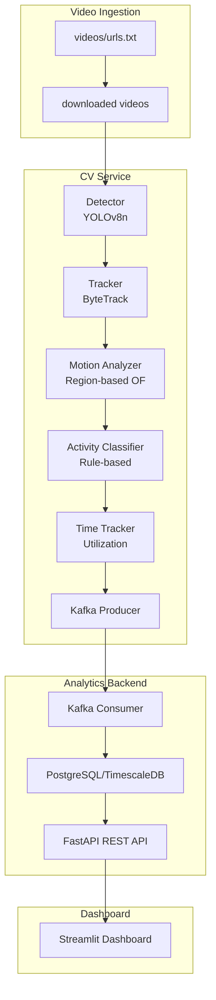
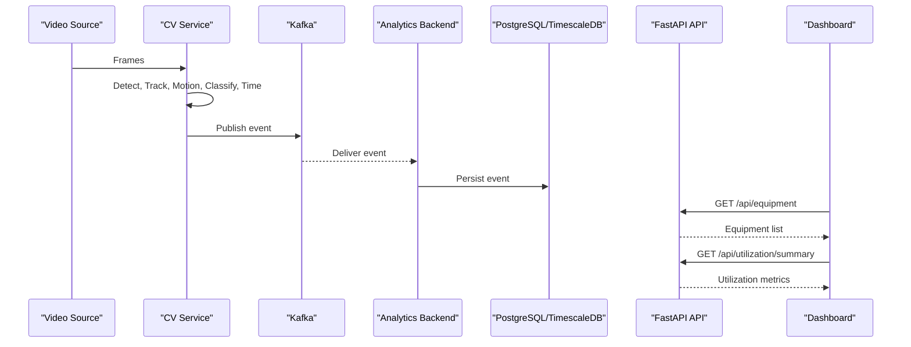
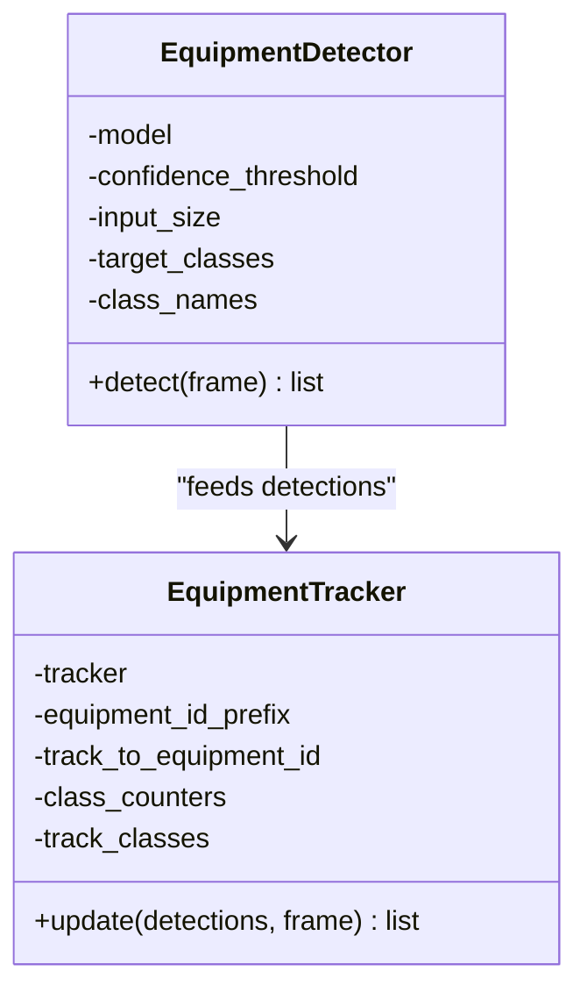
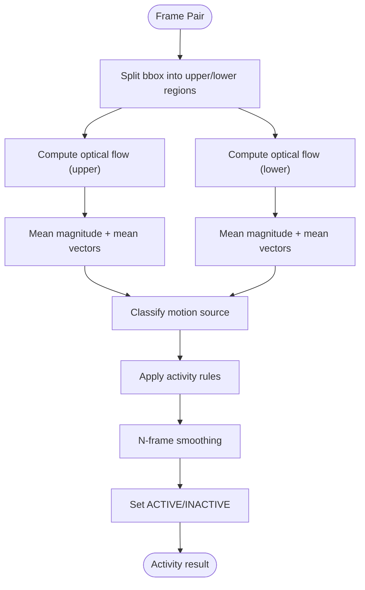
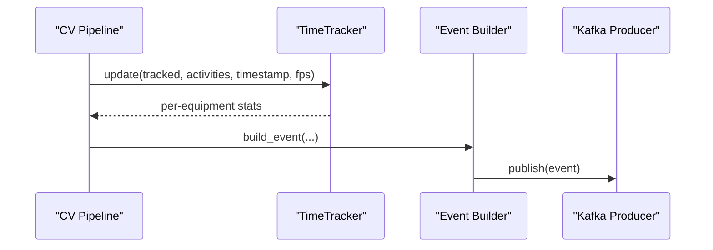
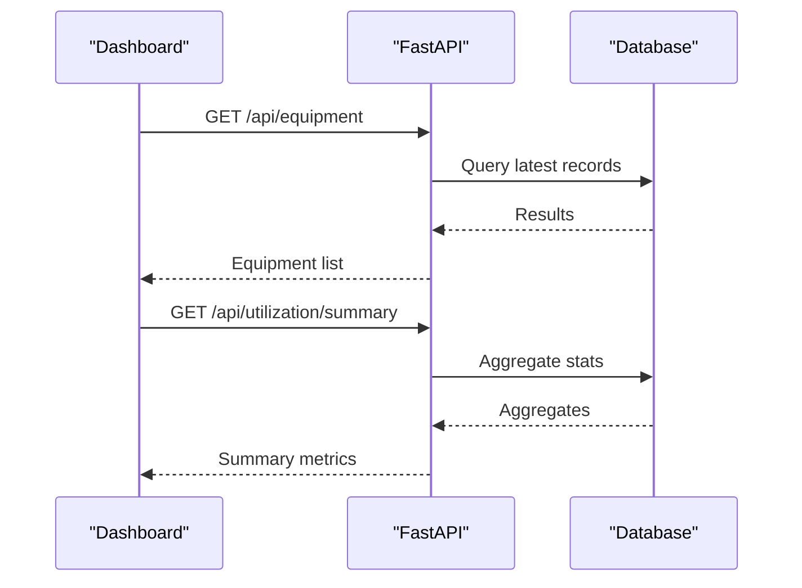

# Core Features and Capabilities

<cite>
**Referenced Files in This Document**
- [README.md](file://README.md)
- [settings.yaml](file://config/settings.yaml)
- [main.py](file://services/cv_service/src/main.py)
- [detector.py](file://services/cv_service/src/detector.py)
- [tracker.py](file://services/cv_service/src/tracker.py)
- [motion_analyzer.py](file://services/cv_service/src/motion_analyzer.py)
- [activity_classifier.py](file://services/cv_service/src/activity_classifier.py)
- [time_tracker.py](file://services/cv_service/src/time_tracker.py)
- [api.py](file://services/analytics_backend/src/api.py)
- [consumer.py](file://services/analytics_backend/src/consumer.py)
- [db_models.py](file://services/analytics_backend/src/db_models.py)
- [main.py](file://services/analytics_backend/src/main.py)
- [app.py](file://services/dashboard/src/app.py)
- [test_activity_classifier.py](file://tests/test_activity_classifier.py)
- [test_motion_analyzer.py](file://tests/test_motion_analyzer.py)
- [test_time_tracker.py](file://tests/test_time_tracker.py)
</cite>

## Table of Contents
1. [Introduction](#introduction)
2. [Project Structure](#project-structure)
3. [Core Components](#core-components)
4. [Architecture Overview](#architecture-overview)
5. [Detailed Component Analysis](#detailed-component-analysis)
6. [Dependency Analysis](#dependency-analysis)
7. [Performance Considerations](#performance-considerations)
8. [Troubleshooting Guide](#troubleshooting-guide)
9. [Conclusion](#conclusion)
10. [Appendices](#appendices)

## Introduction
This document explains the core features and capabilities of the Equipment Utilization & Activity Classification system. It covers the end-to-end workflow from video ingestion to real-time dashboards, including equipment detection, tracking, motion analysis, rule-based activity classification, and utilization metrics calculation. It also describes the zero-shot learning approach that enables accurate activity classification without requiring training data for construction equipment.

## Project Structure
The system is organized as a microservices pipeline orchestrated by Docker Compose:
- Video ingestion service downloads and prepares video sources
- CV service performs detection, tracking, motion analysis, activity classification, and publishes events to Kafka
- Analytics backend consumes Kafka events, persists them to PostgreSQL/TimescaleDB, and exposes a FastAPI REST API
- Dashboard service queries the API to render real-time monitoring panels



**Diagram sources**
- [main.py:323-421](file://services/cv_service/src/main.py#L323-L421)
- [consumer.py:79-142](file://services/analytics_backend/src/consumer.py#L79-L142)
- [api.py:159-416](file://services/analytics_backend/src/api.py#L159-L416)
- [app.py:518-621](file://services/dashboard/src/app.py#L518-L621)

**Section sources**
- [README.md:1-118](file://README.md#L1-L118)
- [README.md:340-384](file://README.md#L340-L384)

## Core Components
- Equipment Detection: Uses YOLOv8n to detect vehicles/classes mapped to construction equipment (COCO classes 2, 5, 7).
- Multi-Object Tracking: ByteTrack maintains persistent IDs across frames with configurable class-based prefixes.
- Motion Analysis: Region-based optical flow (Farneback) splits each bounding box into upper and lower regions to detect articulated motion.
- Activity Classification: Rule-based state machine with N-frame smoothing to classify activities as DIGGING, SWINGING_LOADING, DUMPING, or WAITING.
- Utilization Tracking: Time-based counters compute total tracked, active, and idle seconds, and derive utilization percentages.
- Event Streaming: Kafka publishes structured events consumed by the analytics backend.
- Analytics Backend: Stores events in PostgreSQL/TimescaleDB and exposes REST endpoints for dashboards.
- Real-Time Dashboard: Streamlit UI queries the API to display equipment status, activity, and utilization metrics.

**Section sources**
- [detector.py:18-170](file://services/cv_service/src/detector.py#L18-L170)
- [tracker.py:19-341](file://services/cv_service/src/tracker.py#L19-L341)
- [motion_analyzer.py:24-442](file://services/cv_service/src/motion_analyzer.py#L24-L442)
- [activity_classifier.py:23-306](file://services/cv_service/src/activity_classifier.py#L23-L306)
- [time_tracker.py:21-265](file://services/cv_service/src/time_tracker.py#L21-L265)
- [api.py:159-416](file://services/analytics_backend/src/api.py#L159-L416)
- [app.py:518-621](file://services/dashboard/src/app.py#L518-L621)

## Architecture Overview
The system follows a decoupled, event-driven architecture:
- CV service runs continuously, processing video frames and publishing events to Kafka
- Analytics backend consumes events and persists them to the database
- Dashboard queries the API for real-time updates



**Diagram sources**
- [main.py:374-421](file://services/cv_service/src/main.py#L374-L421)
- [consumer.py:143-200](file://services/analytics_backend/src/consumer.py#L143-L200)
- [api.py:179-416](file://services/analytics_backend/src/api.py#L179-L416)
- [app.py:110-160](file://services/dashboard/src/app.py#L110-L160)

## Detailed Component Analysis

### Equipment Detection and Tracking
- Detection: YOLOv8n with configurable confidence threshold and input size; filters COCO classes mapped to construction equipment.
- Tracking: ByteTrack maintains per-class ID prefixes and generates sequential IDs; matches detections to tracks using IoU.



**Diagram sources**
- [detector.py:18-170](file://services/cv_service/src/detector.py#L18-L170)
- [tracker.py:19-341](file://services/cv_service/src/tracker.py#L19-L341)

**Section sources**
- [detector.py:85-170](file://services/cv_service/src/detector.py#L85-L170)
- [tracker.py:159-265](file://services/cv_service/src/tracker.py#L159-L265)

### Motion Analysis and Activity Classification
- Motion Analysis: Splits each tracked bounding box into upper (arm/boom) and lower (base/tracks) regions; computes optical flow per region; classifies motion source as full_body, arm_only, or none.
- Activity Classification: Rule-based classification using dominant direction vectors and thresholds; applies N-frame smoothing to prevent flickering.



**Diagram sources**
- [motion_analyzer.py:192-251](file://services/cv_service/src/motion_analyzer.py#L192-L251)
- [activity_classifier.py:166-232](file://services/cv_service/src/activity_classifier.py#L166-L232)

**Section sources**
- [motion_analyzer.py:88-167](file://services/cv_service/src/motion_analyzer.py#L88-L167)
- [activity_classifier.py:71-126](file://services/cv_service/src/activity_classifier.py#L71-L126)

### Utilization Tracking and Metrics
- Time Tracker accumulates per-equipment totals for tracked, active, and idle seconds; computes utilization percentage; supports aggregate statistics.
- CV pipeline builds event payloads with utilization fields and publishes to Kafka.



**Diagram sources**
- [time_tracker.py:53-121](file://services/cv_service/src/time_tracker.py#L53-L121)
- [main.py:270-322](file://services/cv_service/src/main.py#L270-L322)

**Section sources**
- [time_tracker.py:53-121](file://services/cv_service/src/time_tracker.py#L53-L121)
- [main.py:270-322](file://services/cv_service/src/main.py#L270-L322)

### Real-Time Dashboard and API
- Analytics Backend FastAPI provides endpoints for equipment list, history, utilization summary, latest frame, and stats.
- Dashboard fetches data from the API and renders live panels with equipment status, activity badges, and utilization metrics.



**Diagram sources**
- [api.py:179-368](file://services/analytics_backend/src/api.py#L179-L368)
- [app.py:110-160](file://services/dashboard/src/app.py#L110-L160)

**Section sources**
- [api.py:159-416](file://services/analytics_backend/src/api.py#L159-L416)
- [app.py:518-621](file://services/dashboard/src/app.py#L518-L621)

### Zero-Shot Learning Approach
- The system avoids training data by relying on:
  - Region-based optical flow to detect articulated motion without pose annotations
  - Rule-based activity classification with thresholds and smoothing
  - COCO class mapping to recognize construction vehicles when domain-specific models are unavailable

**Section sources**
- [README.md:125-176](file://README.md#L125-L176)
- [README.md:199-223](file://README.md#L199-L223)

## Dependency Analysis
Key dependencies and relationships:
- CV pipeline components depend on configuration from settings.yaml
- Analytics backend depends on Kafka consumer and database models
- Dashboard depends on FastAPI endpoints

```mermaid
graph LR
CFG["settings.yaml"] --> DET["Detector"]
CFG --> TRK["Tracker"]
CFG --> MOT["MotionAnalyzer"]
CFG --> ACT["ActivityClassifier"]
CFG --> TIM["TimeTracker"]
DET --> TRK
TRK --> MOT
MOT --> ACT
ACT --> TIM
KAF["Kafka"] <- --> CON["AnalyticsConsumer"]
CON --> DB["DB Models"]
DB --> API["FastAPI"]
API --> DASH["Dashboard"]
```

**Diagram sources**
- [settings.yaml:3-59](file://config/settings.yaml#L3-L59)
- [main.py:104-142](file://services/cv_service/src/main.py#L104-L142)
- [consumer.py:35-78](file://services/analytics_backend/src/consumer.py#L35-L78)
- [db_models.py:22-68](file://services/analytics_backend/src/db_models.py#L22-L68)
- [api.py:24-54](file://services/analytics_backend/src/api.py#L24-L54)
- [app.py:26-57](file://services/dashboard/src/app.py#L26-L57)

**Section sources**
- [settings.yaml:3-59](file://config/settings.yaml#L3-L59)
- [main.py:104-142](file://services/cv_service/src/main.py#L104-L142)
- [consumer.py:35-78](file://services/analytics_backend/src/consumer.py#L35-L78)
- [db_models.py:70-101](file://services/analytics_backend/src/db_models.py#L70-L101)
- [api.py:24-54](file://services/analytics_backend/src/api.py#L24-L54)
- [app.py:26-57](file://services/dashboard/src/app.py#L26-L57)

## Performance Considerations
- CPU-optimized pipeline:
  - YOLOv8n (nano) model (~6.2M parameters)
  - Frame skipping and resizing to reduce inference cost
  - Crop-based optical flow to avoid full-frame computation
- Kafka batching and TimescaleDB hypertable for efficient persistence
- Streamlit caching to minimize API calls

**Section sources**
- [README.md:177-187](file://README.md#L177-L187)
- [README.md:224-234](file://README.md#L224-L234)
- [app.py:100-160](file://services/dashboard/src/app.py#L100-L160)

## Troubleshooting Guide
Common issues and resolutions:
- Missing or invalid configuration: Ensure settings.yaml paths and keys are present
- Kafka connectivity: Verify bootstrap servers and topic availability
- Database initialization: Confirm TimescaleDB extension and hypertable creation
- Dashboard connectivity: Check API URL and CORS settings
- Testing: Use pytest modules to validate individual components

**Section sources**
- [main.py:29-62](file://services/analytics_backend/src/main.py#L29-L62)
- [consumer.py:35-78](file://services/analytics_backend/src/consumer.py#L35-L78)
- [db_models.py:103-156](file://services/analytics_backend/src/db_models.py#L103-L156)
- [app.py:26-57](file://services/dashboard/src/app.py#L26-L57)
- [test_activity_classifier.py:18-42](file://tests/test_activity_classifier.py#L18-L42)
- [test_motion_analyzer.py:19-51](file://tests/test_motion_analyzer.py#L19-L51)
- [test_time_tracker.py:18-38](file://tests/test_time_tracker.py#L18-L38)

## Conclusion
The Equipment Utilization & Activity Classification system delivers a robust, zero-shot solution for construction site monitoring. By combining region-based optical flow, rule-based classification, and time-based utilization tracking, it provides actionable insights with minimal setup. The event-driven architecture and real-time dashboard enable scalable deployment and intuitive visualization for operational teams.

## Appendices

### Configuration Options and Customization
- Video processing: frame_skip, resize_width, input_dir
- Detection: model, confidence_threshold, input_size, target_classes, class_names
- Tracking: track_thresh, track_buffer, match_thresh, equipment_id_prefix
- Motion: magnitude_threshold, upper_region_ratio, flow_method
- Activity: smoothing_window, vertical_flow_threshold, horizontal_flow_threshold
- Kafka: bootstrap_servers, topic, client_id, consumer_group
- Database: host, port, name, user, password, uri
- Dashboard: api_url, refresh_interval, page_title

**Section sources**
- [settings.yaml:3-59](file://config/settings.yaml#L3-L59)

### Practical Examples
- Equipment Detection: COCO classes 2 (car), 5 (bus), 7 (truck) mapped to construction equipment
- Activity Classification: DIGGING (arm-only downward), DUMPING (arm-only upward), SWINGING_LOADING (horizontal), WAITING (no motion)
- Utilization Metrics: total_tracked_seconds, total_active_seconds, total_idle_seconds, utilization_percent
- Real-Time Dashboard: Live equipment status, activity badges, utilization progress bars, latest frame overlay

**Section sources**
- [README.md:236-286](file://README.md#L236-L286)
- [app.py:296-512](file://services/dashboard/src/app.py#L296-L512)