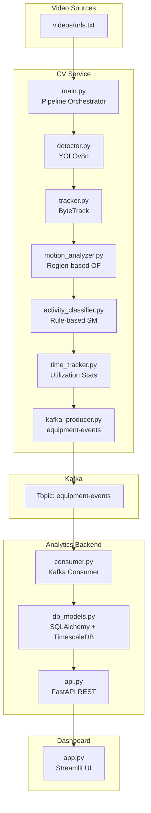
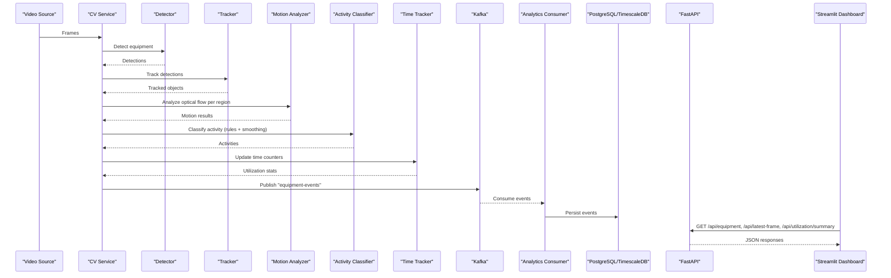
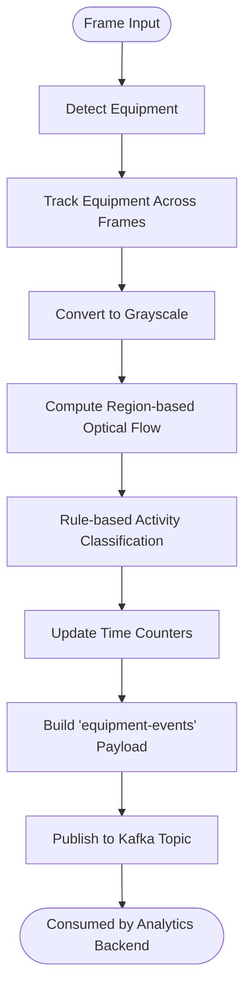
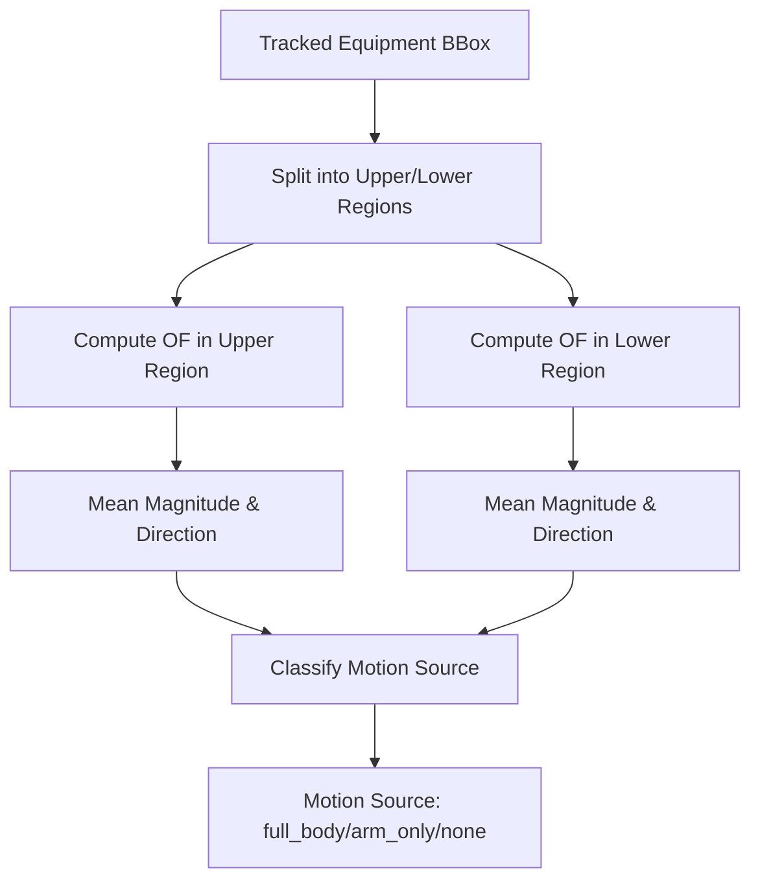
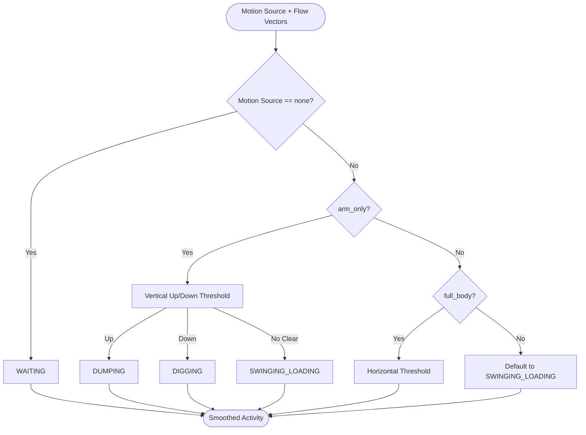
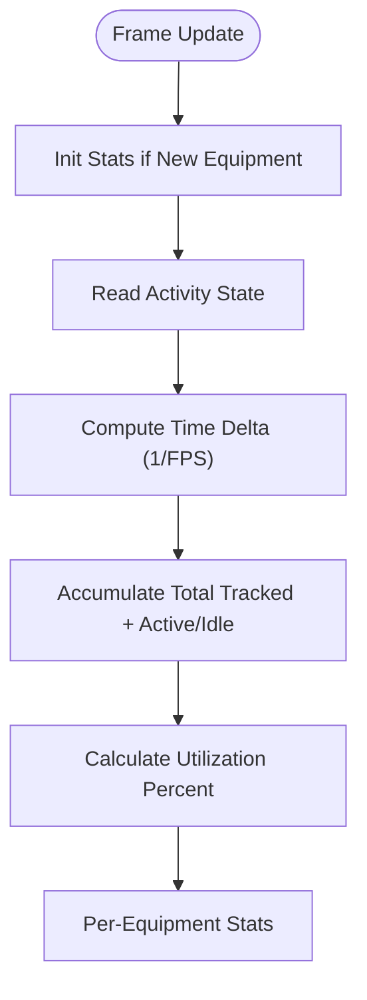
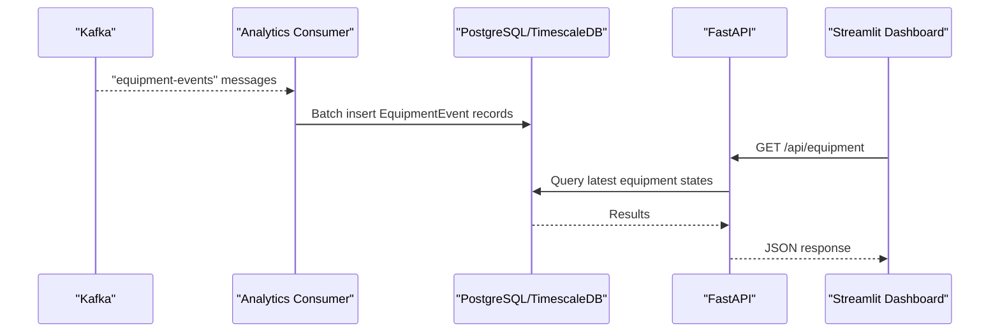
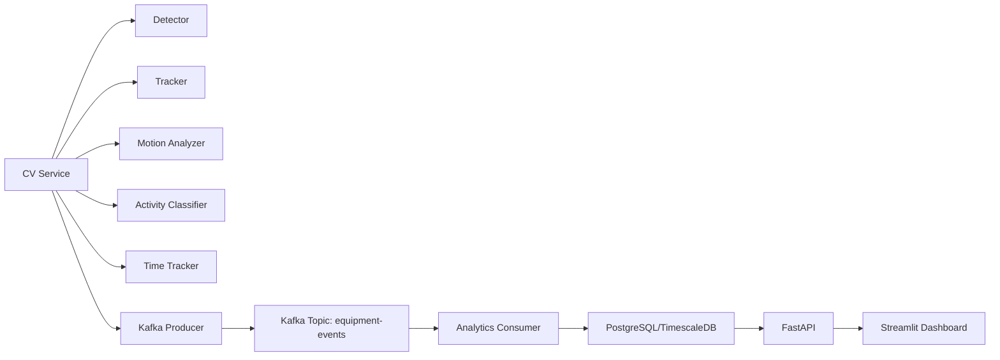

# Introduction and Purpose

<cite>
**Referenced Files in This Document**
- [README.md](file://README.md)
- [settings.yaml](file://config/settings.yaml)
- [main.py](file://services/cv_service/src/main.py)
- [detector.py](file://services/cv_service/src/detector.py)
- [tracker.py](file://services/cv_service/src/tracker.py)
- [motion_analyzer.py](file://services/cv_service/src/motion_analyzer.py)
- [activity_classifier.py](file://services/cv_service/src/activity_classifier.py)
- [time_tracker.py](file://services/cv_service/src/time_tracker.py)
- [main.py](file://services/analytics_backend/src/main.py)
- [consumer.py](file://services/analytics_backend/src/consumer.py)
- [db_models.py](file://services/analytics_backend/src/db_models.py)
- [api.py](file://services/analytics_backend/src/api.py)
- [app.py](file://services/dashboard/src/app.py)
</cite>

## Table of Contents
1. [Introduction](#introduction)
2. [Project Structure](#project-structure)
3. [Core Components](#core-components)
4. [Architecture Overview](#architecture-overview)
5. [Detailed Component Analysis](#detailed-component-analysis)
6. [Dependency Analysis](#dependency-analysis)
7. [Performance Considerations](#performance-considerations)
8. [Troubleshooting Guide](#troubleshooting-guide)
9. [Conclusion](#conclusion)
10. [Appendices](#appendices)

## Introduction
This project is a real-time computer vision system designed to monitor construction equipment activity in industrial environments. Its primary purpose is to continuously process video feeds and derive actionable insights about equipment utilization and operational activity classification. The system transforms raw video into structured “equipment-events” that capture the current state (ACTIVE/INACTIVE), the specific activity (DIGGING, SWINGING_LOADING, DUMPING, WAITING), and time-based utilization metrics such as utilization percent.

Key value propositions:
- Safety monitoring: Detects prolonged WAITING periods and unusual motion patterns to flag potential risks.
- Productivity tracking: Quantifies utilization percent to measure how much time equipment is actively working versus idle.
- Compliance reporting: Provides standardized, auditable event streams and dashboards for regulatory and internal reporting.

The system is built around a microservices architecture with a clear separation of concerns:
- A computer vision pipeline that detects, tracks, analyzes motion, classifies activities, and computes utilization.
- An analytics backend that consumes “equipment-events,” persists them, and exposes a REST API.
- A Streamlit dashboard that visualizes live equipment status, utilization metrics, and historical trends.

## Project Structure
The repository organizes functionality into six major services and a shared configuration:
- config/settings.yaml centralizes tunable parameters for video processing, detection, tracking, motion analysis, activity classification, Kafka, database, and dashboard.
- services/cv_service: Orchestrates the computer vision pipeline and publishes “equipment-events.”
- services/analytics_backend: Consumes Kafka events, persists them to PostgreSQL (with TimescaleDB support), and serves a FastAPI REST API.
- services/dashboard: A Streamlit app that queries the API and renders real-time monitoring panels.
- services/video_ingestion: Utilities for downloading and preparing video sources (YouTube links) and extracting frames.
- tests: Unit tests for core pipeline components.

**Diagram sources**
- [main.py:42-498](file://services/cv_service/src/main.py#L42-L498)
- [detector.py:18-170](file://services/cv_service/src/detector.py#L18-L170)
- [tracker.py:19-341](file://services/cv_service/src/tracker.py#L19-L341)
- [motion_analyzer.py:24-442](file://services/cv_service/src/motion_analyzer.py#L24-L442)
- [activity_classifier.py:23-306](file://services/cv_service/src/activity_classifier.py#L23-L306)
- [time_tracker.py:21-265](file://services/cv_service/src/time_tracker.py#L21-L265)
- [consumer.py:23-268](file://services/analytics_backend/src/consumer.py#L23-L268)
- [db_models.py:22-191](file://services/analytics_backend/src/db_models.py#L22-L191)
- [api.py:24-444](file://services/analytics_backend/src/api.py#L24-L444)
- [app.py:518-621](file://services/dashboard/src/app.py#L518-L621)

**Section sources**
- [README.md:1-118](file://README.md#L1-L118)
- [settings.yaml:1-59](file://config/settings.yaml#L1-L59)

## Core Components
- Computer Vision Pipeline (CV Service):
  - Detection: YOLOv8n identifies vehicles/classes mapped to construction equipment.
  - Tracking: ByteTrack maintains persistent IDs across frames.
  - Motion Analysis: Region-based optical flow separates upper (arm/boom) and lower (base/tracks) motion.
  - Activity Classification: Rule-based state machine with N-frame smoothing yields DIGGING, SWINGING_LOADING, DUMPING, WAITING.
  - Time Tracking: Accumulates total tracked, active, and idle seconds; computes utilization percent.
  - Event Publishing: Emits “equipment-events” to Kafka topic.

- Analytics Backend:
  - Kafka Consumer: Reads “equipment-events,” parses JSON, and batches inserts into PostgreSQL.
  - Database: SQLAlchemy models with TimescaleDB hypertable optimization.
  - REST API: Health checks, equipment list, history, utilization summary, latest frame, and stats.

- Dashboard:
  - Streamlit app that queries the API and displays live equipment status, utilization metrics, and per-equipment cards.

- Video Ingestion:
  - Frame producer utilities for extracting frames from local or remote video sources with configurable frame skip and resize.

**Section sources**
- [README.md:121-234](file://README.md#L121-L234)
- [settings.yaml:3-59](file://config/settings.yaml#L3-L59)
- [main.py:42-498](file://services/cv_service/src/main.py#L42-L498)
- [detector.py:18-170](file://services/cv_service/src/detector.py#L18-L170)
- [tracker.py:19-341](file://services/cv_service/src/tracker.py#L19-L341)
- [motion_analyzer.py:24-442](file://services/cv_service/src/motion_analyzer.py#L24-L442)
- [activity_classifier.py:23-306](file://services/cv_service/src/activity_classifier.py#L23-L306)
- [time_tracker.py:21-265](file://services/cv_service/src/time_tracker.py#L21-L265)
- [consumer.py:23-268](file://services/analytics_backend/src/consumer.py#L23-L268)
- [db_models.py:22-191](file://services/analytics_backend/src/db_models.py#L22-L191)
- [api.py:24-444](file://services/analytics_backend/src/api.py#L24-L444)
- [app.py:518-621](file://services/dashboard/src/app.py#L518-L621)

## Architecture Overview
The system follows a real-time event-driven architecture:
- Video ingestion produces frames.
- The CV Service runs detection, tracking, motion analysis, activity classification, and time tracking, then publishes “equipment-events” to Kafka.
- The Analytics Backend consumes events, persists them, and exposes a REST API.
- The Dashboard queries the API to render live panels.

**Diagram sources**
- [main.py:323-421](file://services/cv_service/src/main.py#L323-L421)
- [detector.py:85-170](file://services/cv_service/src/detector.py#L85-L170)
- [tracker.py:159-264](file://services/cv_service/src/tracker.py#L159-L264)
- [motion_analyzer.py:88-166](file://services/cv_service/src/motion_analyzer.py#L88-L166)
- [activity_classifier.py:71-125](file://services/cv_service/src/activity_classifier.py#L71-L125)
- [time_tracker.py:53-120](file://services/cv_service/src/time_tracker.py#L53-L120)
- [consumer.py:143-200](file://services/analytics_backend/src/consumer.py#L143-L200)
- [db_models.py:22-67](file://services/analytics_backend/src/db_models.py#L22-L67)
- [api.py:179-416](file://services/analytics_backend/src/api.py#L179-L416)
- [app.py:110-160](file://services/dashboard/src/app.py#L110-L160)

## Detailed Component Analysis

### Equipment Utilization & Activity Classification Pipeline
This pipeline is the heart of the system. It transforms video frames into “equipment-events” enriched with state, activity, and utilization metrics.

**Diagram sources**
- [main.py:323-372](file://services/cv_service/src/main.py#L323-L372)
- [detector.py:85-170](file://services/cv_service/src/detector.py#L85-L170)
- [tracker.py:159-264](file://services/cv_service/src/tracker.py#L159-L264)
- [motion_analyzer.py:88-166](file://services/cv_service/src/motion_analyzer.py#L88-L166)
- [activity_classifier.py:71-125](file://services/cv_service/src/activity_classifier.py#L71-L125)
- [time_tracker.py:53-120](file://services/cv_service/src/time_tracker.py#L53-L120)

**Section sources**
- [main.py:42-498](file://services/cv_service/src/main.py#L42-L498)
- [detector.py:18-170](file://services/cv_service/src/detector.py#L18-L170)
- [tracker.py:19-341](file://services/cv_service/src/tracker.py#L19-L341)
- [motion_analyzer.py:24-442](file://services/cv_service/src/motion_analyzer.py#L24-L442)
- [activity_classifier.py:23-306](file://services/cv_service/src/activity_classifier.py#L23-L306)
- [time_tracker.py:21-265](file://services/cv_service/src/time_tracker.py#L21-L265)

### Motion Analysis: Region-Based Optical Flow
Articulated motion detection is a key innovation. By splitting each tracked bounding box into upper and lower regions, the system distinguishes:
- full_body: Both regions moving (e.g., vehicle travel).
- arm_only: Only upper region moving (e.g., digging, dumping, swinging).
- none: Stationary equipment.

**Diagram sources**
- [motion_analyzer.py:192-251](file://services/cv_service/src/motion_analyzer.py#L192-L251)

**Section sources**
- [motion_analyzer.py:24-442](file://services/cv_service/src/motion_analyzer.py#L24-L442)
- [README.md:125-153](file://README.md#L125-L153)

### Activity Classification: Rule-Based State Machine
Activities are derived from motion source and dominant direction vectors with N-frame smoothing to reduce flickering.

**Diagram sources**
- [activity_classifier.py:166-231](file://services/cv_service/src/activity_classifier.py#L166-L231)

**Section sources**
- [activity_classifier.py:23-306](file://services/cv_service/src/activity_classifier.py#L23-L306)
- [README.md:154-176](file://README.md#L154-L176)

### Time Tracking & Utilization Percent
Time tracking accumulates per-equipment counters and computes utilization percent as a function of total active time over total tracked time.

**Diagram sources**
- [time_tracker.py:53-120](file://services/cv_service/src/time_tracker.py#L53-L120)

**Section sources**
- [time_tracker.py:21-265](file://services/cv_service/src/time_tracker.py#L21-L265)

### Analytics Backend: Kafka Consumer, Persistence, and API
The backend consumes “equipment-events,” persists them to PostgreSQL (with TimescaleDB hypertable optimization), and exposes REST endpoints for the dashboard.

**Diagram sources**
- [consumer.py:143-200](file://services/analytics_backend/src/consumer.py#L143-L200)
- [db_models.py:22-67](file://services/analytics_backend/src/db_models.py#L22-L67)
- [api.py:179-416](file://services/analytics_backend/src/api.py#L179-L416)
- [app.py:110-160](file://services/dashboard/src/app.py#L110-L160)

**Section sources**
- [main.py:64-149](file://services/analytics_backend/src/main.py#L64-L149)
- [consumer.py:23-268](file://services/analytics_backend/src/consumer.py#L23-L268)
- [db_models.py:22-191](file://services/analytics_backend/src/db_models.py#L22-L191)
- [api.py:24-444](file://services/analytics_backend/src/api.py#L24-L444)
- [app.py:518-621](file://services/dashboard/src/app.py#L518-L621)

## Dependency Analysis
High-level dependencies:
- CV Service depends on detection, tracking, motion analysis, activity classification, time tracking, and Kafka producer.
- Analytics Backend depends on Kafka consumer, SQLAlchemy models, and FastAPI.
- Dashboard depends on FastAPI endpoints and Streamlit.

**Diagram sources**
- [main.py:24-29](file://services/cv_service/src/main.py#L24-L29)
- [consumer.py:35-68](file://services/analytics_backend/src/consumer.py#L35-L68)
- [api.py:24-54](file://services/analytics_backend/src/api.py#L24-L54)
- [app.py:518-562](file://services/dashboard/src/app.py#L518-L562)

**Section sources**
- [main.py:24-29](file://services/cv_service/src/main.py#L24-L29)
- [consumer.py:35-68](file://services/analytics_backend/src/consumer.py#L35-L68)
- [api.py:24-54](file://services/analytics_backend/src/api.py#L24-L54)
- [app.py:518-562](file://services/dashboard/src/app.py#L518-L562)

## Performance Considerations
- CPU-optimized pipeline:
  - YOLOv8n (nano) for lightweight detection.
  - Frame skipping and resizing to reduce inference cost.
  - Crop-based optical flow to avoid full-frame computation.
- Event streaming decouples processing from persistence, enabling burst handling and future scaling.
- TimescaleDB hypertable for efficient time-series storage and queries.
- N-frame smoothing reduces flickering and stabilizes activity classification.

[No sources needed since this section provides general guidance]

## Troubleshooting Guide
Common issues and remedies:
- Kafka connectivity:
  - Verify topic existence and broker availability; ensure consumer group and bootstrap servers match configuration.
- Database initialization:
  - Confirm PostgreSQL/TimescaleDB is reachable and TimescaleDB extension is enabled; the backend attempts to create the extension automatically.
- API health:
  - Use the health endpoint to confirm database connectivity.
- Dashboard connectivity:
  - Ensure the dashboard’s API URL matches the backend service and port.
- Configuration drift:
  - Validate settings.yaml for correct paths, thresholds, and model parameters.

**Section sources**
- [consumer.py:93-142](file://services/analytics_backend/src/consumer.py#L93-L142)
- [db_models.py:103-156](file://services/analytics_backend/src/db_models.py#L103-L156)
- [api.py:159-177](file://services/analytics_backend/src/api.py#L159-L177)
- [app.py:100-108](file://services/dashboard/src/app.py#L100-L108)

## Conclusion
This prototype demonstrates a practical, real-time computer vision system for construction equipment monitoring. By combining region-based optical flow, rule-based activity classification, and time tracking, it delivers actionable insights as “equipment-events.” The event-driven architecture with Kafka enables scalability and future enhancements, while the REST API and Streamlit dashboard provide immediate visibility for safety, productivity, and compliance use cases.

[No sources needed since this section summarizes without analyzing specific files]

## Appendices

### Practical Examples and Value Proposition
- Safety monitoring:
  - Extended WAITING periods can indicate stalled operations or potential hazards; the system flags these for operator review.
- Productivity tracking:
  - Utilization percent quantifies active vs. idle time, enabling targeted interventions to reduce downtime.
- Compliance reporting:
  - Standardized “equipment-events” provide audit trails for regulatory submissions and internal dashboards.

[No sources needed since this section provides general guidance]