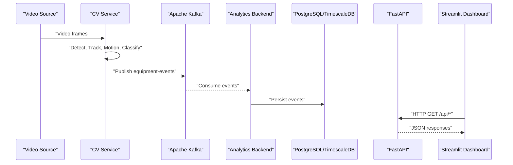
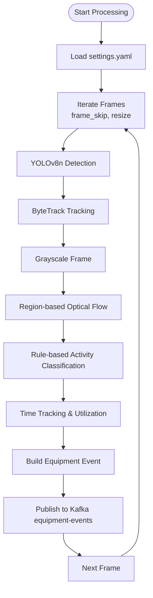
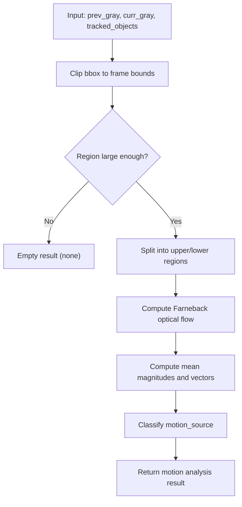
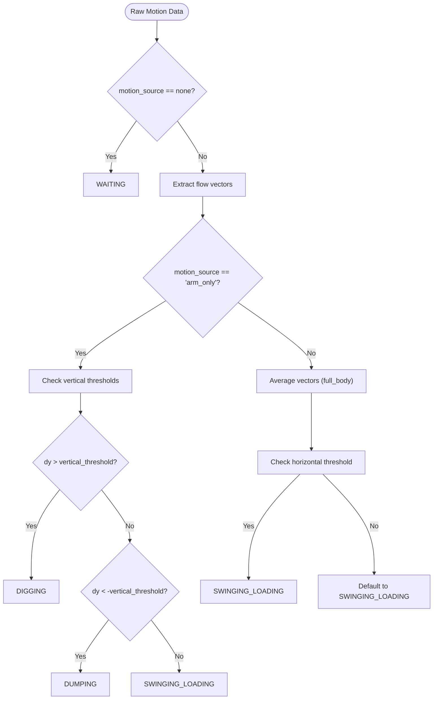
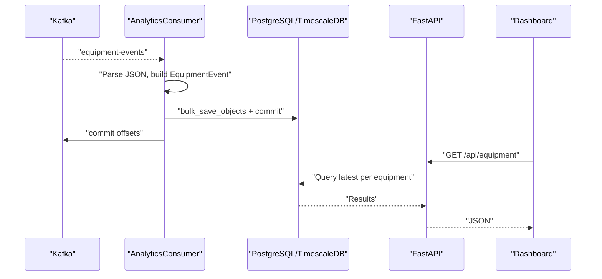
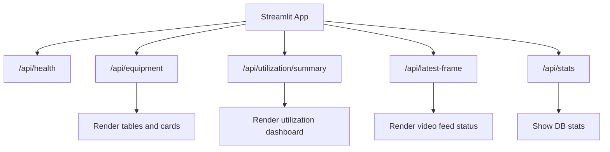
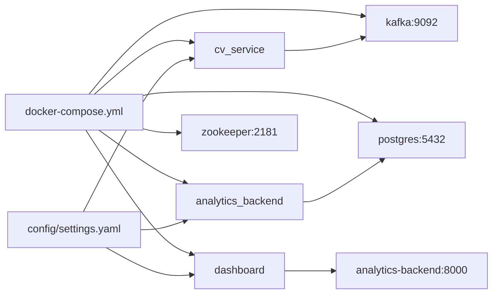

# Project Overview

<cite>
**Referenced Files in This Document**
- [README.md](file://README.md)
- [docker-compose.yml](file://docker-compose.yml)
- [config/settings.yaml](file://config/settings.yaml)
- [services/cv_service/src/main.py](file://services/cv_service/src/main.py)
- [services/cv_service/src/detector.py](file://services/cv_service/src/detector.py)
- [services/cv_service/src/motion_analyzer.py](file://services/cv_service/src/motion_analyzer.py)
- [services/cv_service/src/activity_classifier.py](file://services/cv_service/src/activity_classifier.py)
- [services/analytics_backend/src/main.py](file://services/analytics_backend/src/main.py)
- [services/analytics_backend/src/consumer.py](file://services/analytics_backend/src/consumer.py)
- [services/analytics_backend/src/db_models.py](file://services/analytics_backend/src/db_models.py)
- [services/analytics_backend/src/api.py](file://services/analytics_backend/src/api.py)
- [services/dashboard/src/app.py](file://services/dashboard/src/app.py)
- [services/video_ingestion/src/downloader.py](file://services/video_ingestion/src/downloader.py)
- [services/cv_service/Dockerfile](file://services/cv_service/Dockerfile)
- [services/analytics_backend/Dockerfile](file://services/analytics_backend/Dockerfile)
- [services/dashboard/Dockerfile](file://services/dashboard/Dockerfile)
</cite>

## Table of Contents
1. [Introduction](#introduction)
2. [Project Structure](#project-structure)
3. [Core Components](#core-components)
4. [Architecture Overview](#architecture-overview)
5. [Detailed Component Analysis](#detailed-component-analysis)
6. [Dependency Analysis](#dependency-analysis)
7. [Performance Considerations](#performance-considerations)
8. [Troubleshooting Guide](#troubleshooting-guide)
9. [Conclusion](#conclusion)

## Introduction
This project is a real-time microservices pipeline for construction equipment monitoring. It combines computer vision, Apache Kafka event streaming, and a Streamlit dashboard to detect, track, analyze motion, classify activities, and compute utilization metrics for equipment such as trucks, cars, and buses captured in video feeds. The system publishes structured events to a Kafka topic called equipment-events and exposes a FastAPI REST API consumed by the dashboard for live visualization.

Key outcomes include:
- Real-time equipment detection and tracking
- Articulated motion analysis using region-based optical flow
- Rule-based activity classification (DIGGING, SWINGING_LOADING, DUMPING, WAITING)
- Time-based utilization metrics (utilization percent, active/idle durations)
- A Streamlit dashboard for live monitoring and historical insights

## Project Structure
The repository is organized into:
- config: Centralized YAML configuration
- services: Six interconnected microservices (cv_service, analytics_backend, dashboard, video_ingestion)
- docker-compose.yml: Multi-service orchestration
- videos: Directory for video sources (mounted as a volume)
- tests: Unit tests for core modules

```mermaid
graph TB
subgraph "Orchestration"
DC["docker-compose.yml"]
end
subgraph "Data Sources"
VID["videos/urls.txt"]
end
subgraph "CV Pipeline"
CV["cv_service/src/main.py"]
DET["detector.py"]
TRK["tracker.py"]
MOT["motion_analyzer.py"]
ACT["activity_classifier.py"]
KPR["kafka_producer.py"]
end
subgraph "Streaming"
ZK["zookeeper:2181"]
KF["kafka:9092"]
TOPIC["Topic: equipment-events"]
end
subgraph "Analytics"
AB["analytics_backend/src/main.py"]
CON["consumer.py"]
API["api.py"]
DBM["db_models.py"]
PG["postgres:5432"]
end
subgraph "Visualization"
DASH["dashboard/src/app.py"]
end
VID --> CV
CV --> DET
CV --> TRK
CV --> MOT
CV --> ACT
CV --> KPR
KPR --> KF
KF --> CON
CON --> DBM
DBM --> PG
AB --> API
DASH --> API
ZK <- --> KF
```

**Diagram sources**
- [docker-compose.yml:1-97](file://docker-compose.yml#L1-L97)
- [services/cv_service/src/main.py:1-571](file://services/cv_service/src/main.py#L1-L571)
- [services/analytics_backend/src/main.py:1-149](file://services/analytics_backend/src/main.py#L1-L149)
- [services/analytics_backend/src/consumer.py:1-268](file://services/analytics_backend/src/consumer.py#L1-L268)
- [services/analytics_backend/src/db_models.py:1-191](file://services/analytics_backend/src/db_models.py#L1-L191)
- [services/analytics_backend/src/api.py:1-444](file://services/analytics_backend/src/api.py#L1-L444)
- [services/dashboard/src/app.py:1-621](file://services/dashboard/src/app.py#L1-L621)

**Section sources**
- [README.md:340-384](file://README.md#L340-L384)
- [docker-compose.yml:1-97](file://docker-compose.yml#L1-L97)

## Core Components
- CV Service (computer vision pipeline):
  - Orchestrates detection, tracking, motion analysis, activity classification, time tracking, and Kafka publishing
  - Implements region-based optical flow for articulated motion and rule-based activity classification
- Analytics Backend (event processing):
  - Runs a Kafka consumer and FastAPI server
  - Persists events to PostgreSQL/TimescaleDB and serves REST endpoints
- Dashboard (Streamlit):
  - Real-time monitoring UI that queries the API for equipment status, utilization, and latest frame data
- Video Ingestion:
  - Utility to download YouTube videos for offline processing

**Section sources**
- [services/cv_service/src/main.py:42-498](file://services/cv_service/src/main.py#L42-L498)
- [services/analytics_backend/src/main.py:64-145](file://services/analytics_backend/src/main.py#L64-L145)
- [services/dashboard/src/app.py:518-621](file://services/dashboard/src/app.py#L518-L621)
- [services/video_ingestion/src/downloader.py:30-276](file://services/video_ingestion/src/downloader.py#L30-L276)

## Architecture Overview
The system follows a decoupled microservices architecture:
- CV Service processes video frames and publishes equipment-events to Kafka
- Analytics Backend consumes events and stores them in PostgreSQL/TimescaleDB
- Dashboard queries the FastAPI endpoints to render live charts and tables



**Diagram sources**
- [services/cv_service/src/main.py:323-421](file://services/cv_service/src/main.py#L323-L421)
- [services/analytics_backend/src/consumer.py:93-142](file://services/analytics_backend/src/consumer.py#L93-L142)
- [services/analytics_backend/src/api.py:159-444](file://services/analytics_backend/src/api.py#L159-L444)
- [services/dashboard/src/app.py:100-160](file://services/dashboard/src/app.py#L100-L160)

## Detailed Component Analysis

### CV Service Pipeline
The CV Service orchestrates the end-to-end computer vision pipeline:
- Loads configuration from settings.yaml
- Iterates video frames with frame skipping and resizing
- Runs YOLOv8n detection, ByteTrack multi-object tracking, optical flow-based motion analysis, rule-based activity classification, and time tracking
- Builds structured events and publishes them to Kafka topic equipment-events



**Diagram sources**
- [services/cv_service/src/main.py:184-421](file://services/cv_service/src/main.py#L184-L421)
- [services/cv_service/src/detector.py:85-170](file://services/cv_service/src/detector.py#L85-L170)
- [services/cv_service/src/motion_analyzer.py:88-166](file://services/cv_service/src/motion_analyzer.py#L88-L166)
- [services/cv_service/src/activity_classifier.py:71-125](file://services/cv_service/src/activity_classifier.py#L71-L125)

**Section sources**
- [services/cv_service/src/main.py:42-498](file://services/cv_service/src/main.py#L42-L498)
- [config/settings.yaml:3-59](file://config/settings.yaml#L3-L59)

### Motion Analyzer (Articulated Motion Detection)
Implements region-based optical flow to distinguish between:
- full_body: Both upper and lower regions moving (vehicle traveling)
- arm_only: Only upper region moving (articulated work)
- none: No significant motion (waiting/idle)



**Diagram sources**
- [services/cv_service/src/motion_analyzer.py:88-251](file://services/cv_service/src/motion_analyzer.py#L88-L251)

**Section sources**
- [services/cv_service/src/motion_analyzer.py:24-442](file://services/cv_service/src/motion_analyzer.py#L24-L442)
- [README.md:125-153](file://README.md#L125-L153)

### Activity Classifier (Rule-Based State Machine)
Uses N-frame smoothing to stabilize activity classification:
- DIGGING: arm_only with dominant vertical downward motion
- DUMPING: arm_only with dominant vertical upward motion
- SWINGING_LOADING: horizontal motion (arm_only or full_body)
- WAITING: no motion



**Diagram sources**
- [services/cv_service/src/activity_classifier.py:166-231](file://services/cv_service/src/activity_classifier.py#L166-L231)

**Section sources**
- [services/cv_service/src/activity_classifier.py:23-306](file://services/cv_service/src/activity_classifier.py#L23-L306)
- [README.md:154-176](file://README.md#L154-L176)

### Analytics Backend (Kafka Consumer + FastAPI)
- Starts a background Kafka consumer that reads equipment-events and persists them to PostgreSQL/TimescaleDB
- Initializes database tables and attempts TimescaleDB hypertable creation
- Exposes REST endpoints for equipment status, history, utilization summary, latest frame, and stats



**Diagram sources**
- [services/analytics_backend/src/consumer.py:93-200](file://services/analytics_backend/src/consumer.py#L93-L200)
- [services/analytics_backend/src/db_models.py:22-68](file://services/analytics_backend/src/db_models.py#L22-L68)
- [services/analytics_backend/src/api.py:179-444](file://services/analytics_backend/src/api.py#L179-L444)

**Section sources**
- [services/analytics_backend/src/main.py:64-145](file://services/analytics_backend/src/main.py#L64-L145)
- [services/analytics_backend/src/consumer.py:23-268](file://services/analytics_backend/src/consumer.py#L23-L268)
- [services/analytics_backend/src/db_models.py:70-191](file://services/analytics_backend/src/db_models.py#L70-L191)
- [services/analytics_backend/src/api.py:159-444](file://services/analytics_backend/src/api.py#L159-L444)

### Dashboard (Streamlit)
- Connects to the FastAPI endpoints to fetch equipment list, utilization summary, latest frame, and stats
- Renders live equipment status, utilization metrics, and video feed indicators
- Supports filtering by equipment and auto/manual refresh



**Diagram sources**
- [services/dashboard/src/app.py:100-160](file://services/dashboard/src/app.py#L100-L160)
- [services/dashboard/src/app.py:296-607](file://services/dashboard/src/app.py#L296-L607)

**Section sources**
- [services/dashboard/src/app.py:1-621](file://services/dashboard/src/app.py#L1-L621)

### Video Ingestion (YouTube Downloader)
- Downloads YouTube videos to the videos/ directory using yt-dlp
- Supports single URL, CLI list, or batch from urls.txt

**Section sources**
- [services/video_ingestion/src/downloader.py:30-276](file://services/video_ingestion/src/downloader.py#L30-L276)
- [videos/urls.txt:1-4](file://videos/urls.txt#L1-L4)

## Dependency Analysis
- Configuration-driven design:
  - Centralized parameters in settings.yaml control detection, tracking, motion, activity, Kafka, database, and dashboard behavior
- Inter-service dependencies:
  - CV Service depends on Kafka for event publishing
  - Analytics Backend depends on Kafka and PostgreSQL/TimescaleDB
  - Dashboard depends on Analytics Backend API
- Containerization:
  - Docker Compose defines service dependencies and exposed ports
  - CV Service mounts videos and config directories
  - Analytics Backend exposes port 8000 and mounts config
  - Dashboard exposes port 8501 and mounts config



**Diagram sources**
- [config/settings.yaml:1-59](file://config/settings.yaml#L1-L59)
- [docker-compose.yml:1-97](file://docker-compose.yml#L1-L97)

**Section sources**
- [config/settings.yaml:1-59](file://config/settings.yaml#L1-L59)
- [docker-compose.yml:1-97](file://docker-compose.yml#L1-L97)

## Performance Considerations
- CPU-optimized pipeline:
  - YOLOv8n nano model (~6.2M parameters) for lightweight inference
  - Frame skipping and resizing to reduce processing load
  - Crop-based optical flow to avoid full-frame computation
- Streaming and persistence:
  - Kafka decouples CV processing from persistence
  - Batch writes with periodic commits for throughput
- Database optimization:
  - TimescaleDB hypertable on equipment_events for time-series efficiency

Practical tuning tips from settings.yaml:
- Reduce flickering: increase smoothing_window (e.g., 7–10)
- More sensitive motion: lower magnitude_threshold (e.g., 1.5)
- CPU savings: increase frame_skip (e.g., 5) or reduce resize_width (e.g., 480)

**Section sources**
- [README.md:177-198](file://README.md#L177-L198)
- [README.md:224-234](file://README.md#L224-L234)
- [config/settings.yaml:3-59](file://config/settings.yaml#L3-L59)

## Troubleshooting Guide
Common issues and resolutions:
- Kafka connectivity:
  - Verify zookeeper and kafka services are healthy and reachable
  - Confirm topic equipment-events exists and is writable
- Database readiness:
  - Ensure PostgreSQL/TimescaleDB is running and accepting connections
  - Check that tables are created and TimescaleDB extension is available
- API availability:
  - Confirm analytics-backend responds to /api/health
  - Validate dashboard can reach http://analytics-backend:8000
- Video ingestion:
  - Add YouTube URLs to videos/urls.txt
  - Run the downloader script to populate the videos directory

Operational commands:
- Start services: docker compose up --build
- Stop services: docker compose down
- Download videos: docker compose run --rm cv-service python -m src.downloader

**Section sources**
- [docker-compose.yml:11-15](file://docker-compose.yml#L11-L15)
- [docker-compose.yml:30-35](file://docker-compose.yml#L30-L35)
- [docker-compose.yml:47-51](file://docker-compose.yml#L47-L51)
- [README.md:84-117](file://README.md#L84-L117)

## Conclusion
This prototype demonstrates a scalable, real-time pipeline for construction equipment monitoring. By combining region-based optical flow, rule-based activity classification, and event streaming, it delivers actionable utilization metrics and a responsive dashboard. The modular design, centralized configuration, and containerized deployment enable quick iteration and production-like scalability.