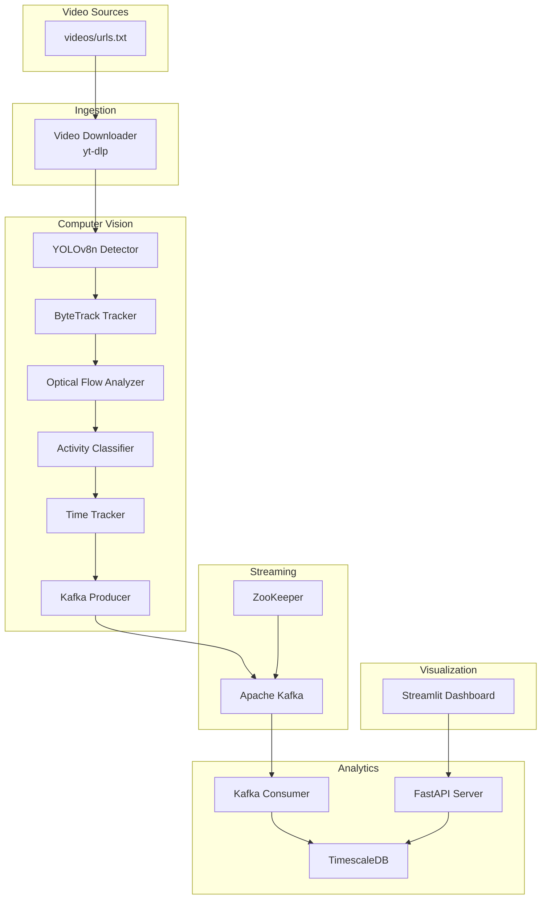

# Quick Start Guide

<cite>
**Referenced Files in This Document**
- [README.md](file://README.md)
- [docker-compose.yml](file://docker-compose.yml)
- [config/settings.yaml](file://config/settings.yaml)
- [videos/urls.txt](file://videos/urls.txt)
- [services/cv_service/Dockerfile](file://services/cv_service/Dockerfile)
- [services/analytics_backend/Dockerfile](file://services/analytics_backend/Dockerfile)
- [services/dashboard/Dockerfile](file://services/dashboard/Dockerfile)
- [services/video_ingestion/Dockerfile](file://services/video_ingestion/Dockerfile)
- [services/cv_service/requirements.txt](file://services/cv_service/requirements.txt)
- [services/analytics_backend/requirements.txt](file://services/analytics_backend/requirements.txt)
- [services/dashboard/requirements.txt](file://services/dashboard/requirements.txt)
- [services/video_ingestion/requirements.txt](file://services/video_ingestion/requirements.txt)
- [services/cv_service/src/main.py](file://services/cv_service/src/main.py)
- [services/analytics_backend/src/main.py](file://services/analytics_backend/src/main.py)
- [services/dashboard/src/app.py](file://services/dashboard/src/app.py)
</cite>

## Table of Contents
1. [Introduction](#introduction)
2. [Prerequisites](#prerequisites)
3. [Step-by-Step Setup](#step-by-step-setup)
4. [Expected Behavior After Startup](#expected-behavior-after-startup)
5. [Verification Checklist](#verification-checklist)
6. [Troubleshooting Guide](#troubleshooting-guide)
7. [Stopping Services and Cleanup](#stopping-services-and-cleanup)
8. [Hardware and Resource Recommendations](#hardware-and-resource-recommendations)
9. [Architecture Overview](#architecture-overview)

## Introduction
This Quick Start Guide helps you get the Equipment Utilization & Activity Classification system up and running quickly. The system monitors construction equipment in real time using computer vision, Apache Kafka event streaming, and a Streamlit dashboard. It detects, tracks, and classifies equipment activity states (DIGGING, SWINGING_LOADING, DUMPING, WAITING) from video feeds, providing live utilization metrics.

## Prerequisites
- Docker Engine and Docker Compose installed and running
- 8 GB+ RAM recommended for reliable CPU-based computer vision processing
- Internet access for pulling Docker images and downloading videos
- A modern web browser for accessing the dashboard

**Section sources**
- [README.md:86-89](file://README.md#L86-L89)

## Step-by-Step Setup

### Step 1: Clone the Repository
Clone the repository and navigate to the project directory.

```bash
git clone <repository-url>
cd Task-2_Technical Occupational Equipment Activity
```

**Section sources**
- [README.md:90-94](file://README.md#L90-L94)

### Step 2: Add Video URLs
Add YouTube video URLs to the `videos/urls.txt` file, one URL per line. The system will download and process these videos.

```bash
echo "https://youtube.com/watch?v=YOUR_VIDEO_ID" >> videos/urls.txt
```

Notes:
- The system supports YouTube links via yt-dlp.
- Ensure the URLs are publicly accessible.

**Section sources**
- [README.md:96-99](file://README.md#L96-L99)
- [videos/urls.txt:1-4](file://videos/urls.txt#L1-L4)

### Step 3: Download Videos
Run the video ingestion service to download videos listed in `videos/urls.txt`. The downloaded files will be placed in the mounted `videos` directory inside the container and are also accessible on your host under the `videos` folder.

```bash
docker compose run --rm cv-service python -m src.downloader
```

What happens:
- The video ingestion service reads URLs from `videos/urls.txt`.
- Downloads videos using yt-dlp.
- Saves files to the mounted `videos` volume for the CV service to process.

**Section sources**
- [README.md:101-104](file://README.md#L101-L104)
- [services/video_ingestion/Dockerfile:18](file://services/video_ingestion/Dockerfile#L18)
- [services/video_ingestion/requirements.txt:1](file://services/video_ingestion/requirements.txt#L1)

### Step 4: Start All Services
Build and start all services defined in the compose file. This launches:
- ZooKeeper
- Kafka
- TimescaleDB (PostgreSQL)
- CV Service (computer vision pipeline)
- Analytics Backend (FastAPI + Kafka consumer)
- Dashboard (Streamlit)

```bash
docker compose up --build
```

What to expect:
- Docker Compose builds custom images for services and pulls external images (e.g., Kafka, TimescaleDB).
- Services wait for dependencies (e.g., Kafka healthy before CV service starts).
- The dashboard becomes available at http://localhost:8501 after the Analytics Backend and Dashboard are ready.

**Section sources**
- [README.md:106-109](file://README.md#L106-L109)
- [docker-compose.yml:1-95](file://docker-compose.yml#L1-L95)

### Step 5: Access the Dashboard
Open your browser and navigate to:

```
http://localhost:8501
```

The dashboard displays:
- Live equipment status (ACTIVE/INACTIVE)
- Activity classification (DIGGING, SWINGING_LOADING, DUMPING, WAITING)
- Utilization metrics and per-equipment progress bars
- Video feed status and detected equipment overlay

**Section sources**
- [README.md:111-113](file://README.md#L111-L113)
- [services/dashboard/Dockerfile:16](file://services/dashboard/Dockerfile#L16)

## Expected Behavior After Startup
After successful startup:
- Kafka and ZooKeeper are healthy and listening on ports 2181 and 9092 respectively.
- TimescaleDB is initialized and accepting connections on port 5432.
- CV Service initializes detectors, trackers, and analyzers, then begins processing videos from the mounted `videos` directory.
- Analytics Backend starts a Kafka consumer thread and a FastAPI server on port 8000.
- Dashboard connects to the Analytics Backend API and renders real-time equipment metrics.

Key indicators:
- Logs show successful initialization of each service.
- The dashboard reports "API Connected" in the sidebar.
- Equipment rows appear in the live status table with utilization percentages.

**Section sources**
- [docker-compose.yml:9-13](file://docker-compose.yml#L9-L13)
- [docker-compose.yml:28-33](file://docker-compose.yml#L28-L33)
- [docker-compose.yml:45-49](file://docker-compose.yml#L45-L49)
- [services/cv_service/src/main.py:104-142](file://services/cv_service/src/main.py#L104-L142)
- [services/analytics_backend/src/main.py:95-103](file://services/analytics_backend/src/main.py#L95-L103)
- [services/dashboard/src/app.py:171-179](file://services/dashboard/src/app.py#L171-L179)

## Verification Checklist
- Confirm all containers are running:
  ```bash
  docker compose ps
  ```
- Verify Kafka health:
  ```bash
  docker compose exec kafka kafka-broker-api-versions.sh --bootstrap-server localhost:9092
  ```
- Verify TimescaleDB health:
  ```bash
  docker compose exec postgres pg_isready -U postgres
  ```
- Check CV Service logs for video processing:
  ```bash
  docker compose logs cv-service
  ```
- Check Analytics Backend logs for API and consumer:
  ```bash
  docker compose logs analytics-backend
  ```
- Confirm dashboard connectivity:
  - Visit http://localhost:8501 and ensure "API Connected" appears in the sidebar.

**Section sources**
- [docker-compose.yml:9-13](file://docker-compose.yml#L9-L13)
- [docker-compose.yml:28-33](file://docker-compose.yml#L28-L33)
- [docker-compose.yml:45-49](file://docker-compose.yml#L45-L49)
- [services/dashboard/src/app.py:171-179](file://services/dashboard/src/app.py#L171-L179)

## Troubleshooting Guide

Common issues and resolutions:

- Docker Compose fails to start services
  - Ensure Docker Engine and Docker Compose are installed and running.
  - Check firewall and port conflicts (2181, 9092, 5432, 8000, 8501).
  - Rebuild images if dependencies changed:
    ```bash
    docker compose build
    docker compose up
    ```

- Kafka not healthy
  - Confirm ZooKeeper is healthy first.
  - Check Kafka logs for configuration errors.
  - Verify advertised listeners and network settings in compose.

- TimescaleDB connection failures
  - Ensure the database volume is mounted and initialized.
  - Confirm credentials in `config/settings.yaml` match compose environment.

- CV Service cannot find videos
  - Verify URLs were added to `videos/urls.txt`.
  - Confirm the `videos` directory exists and contains downloaded files.
  - Re-run the downloader if needed:
    ```bash
    docker compose run --rm cv-service python -m src.downloader
    ```

- Analytics Backend cannot connect to Kafka or database
  - Check service dependencies and health checks in compose.
  - Verify Kafka bootstrap servers and database URI in `config/settings.yaml`.

- Dashboard shows "API Disconnected"
  - Ensure Analytics Backend is healthy and listening on port 8000.
  - Confirm the dashboard API URL matches the backend service name and port.

- Slow performance or high CPU usage
  - Reduce `frame_skip` or `resize_width` in `config/settings.yaml`.
  - Limit concurrent processing by reducing the number of videos or their length.

**Section sources**
- [docker-compose.yml:17-19](file://docker-compose.yml#L17-L19)
- [docker-compose.yml:68-72](file://docker-compose.yml#L68-L72)
- [config/settings.yaml:41-59](file://config/settings.yaml#L41-L59)
- [services/cv_service/src/main.py:161-182](file://services/cv_service/src/main.py#L161-L182)
- [services/dashboard/src/app.py:171-179](file://services/dashboard/src/app.py#L171-L179)

## Stopping Services and Cleanup

To stop all services:
```bash
docker compose down
```

To remove volumes (data retention):
```bash
docker compose down -v
```

To rebuild after changes:
```bash
docker compose build --no-cache
docker compose up
```

Notes:
- Removing volumes deletes TimescaleDB data and cached Kafka offsets.
- Use `-v` only when you intend to reset persistent data.

**Section sources**
- [README.md:114-117](file://README.md#L114-L117)
- [docker-compose.yml:93-95](file://docker-compose.yml#L93-L95)

## Hardware and Resource Recommendations

- Development workstation (local laptop/desktop)
  - CPU: Modern x64 processor (Intel i5/i7 or AMD Ryzen 5/7)
  - RAM: 16 GB+ for comfortable processing of multiple videos
  - Storage: SSD preferred for faster I/O during video processing
  - Notes: The pipeline is optimized for CPU-only operation

- Production server (single-tenant)
  - CPU: Quad-core or higher (Intel Xeon or AMD EPYC)
  - RAM: 32 GB+
  - Storage: NVMe SSD for fast video ingestion and analytics
  - Networking: Gigabit Ethernet for reliable Kafka and API communication

- Cloud deployment (containerized)
  - Container runtime: Docker Engine or Kubernetes
  - Resource requests:
    - CV Service: CPU 2-4 cores, memory 8-16 GiB
    - Analytics Backend: CPU 1-2 cores, memory 2-4 GiB
    - Dashboard: CPU 0.5-1 core, memory 1-2 GiB
    - Kafka: CPU 1-2 cores, memory 2-4 GiB
    - TimescaleDB: CPU 2-4 cores, memory 8-16 GiB
  - Persistent storage: EBS/GCS/PVC for TimescaleDB data

- Environment-specific considerations
  - CPU-only inference: Keep `device: cpu` in settings; avoid GPU-specific packages
  - Network isolation: Ensure internal DNS resolves service names (e.g., `kafka`, `postgres`)
  - Time synchronization: Keep host and container clocks synchronized for accurate timestamps

**Section sources**
- [README.md:86-89](file://README.md#L86-L89)
- [config/settings.yaml:11](file://config/settings.yaml#L11)
- [services/cv_service/Dockerfile:16](file://services/cv_service/Dockerfile#L16)

## Architecture Overview

The system follows a real-time microservices architecture with event streaming and a dashboard.



**Diagram sources**
- [README.md:7-54](file://README.md#L7-L54)
- [docker-compose.yml:1-95](file://docker-compose.yml#L1-L95)
- [services/cv_service/src/main.py:24-29](file://services/cv_service/src/main.py#L24-L29)
- [services/analytics_backend/src/main.py:92-105](file://services/analytics_backend/src/main.py#L92-L105)
- [services/dashboard/src/app.py:52-57](file://services/dashboard/src/app.py#L52-L57)