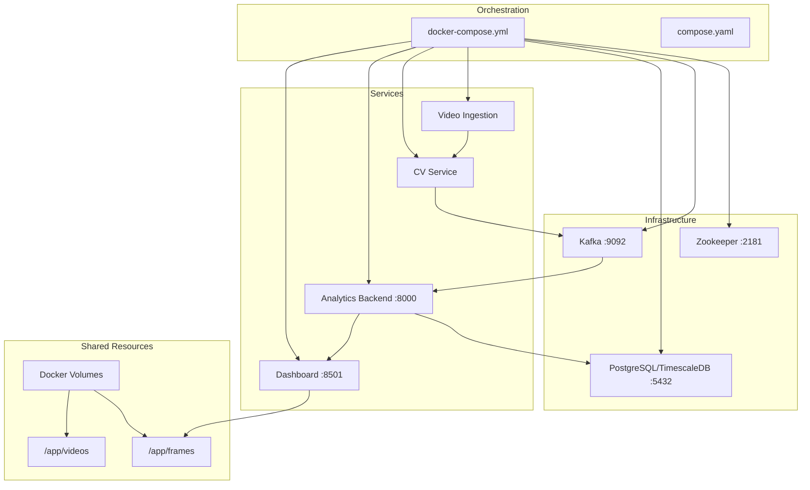
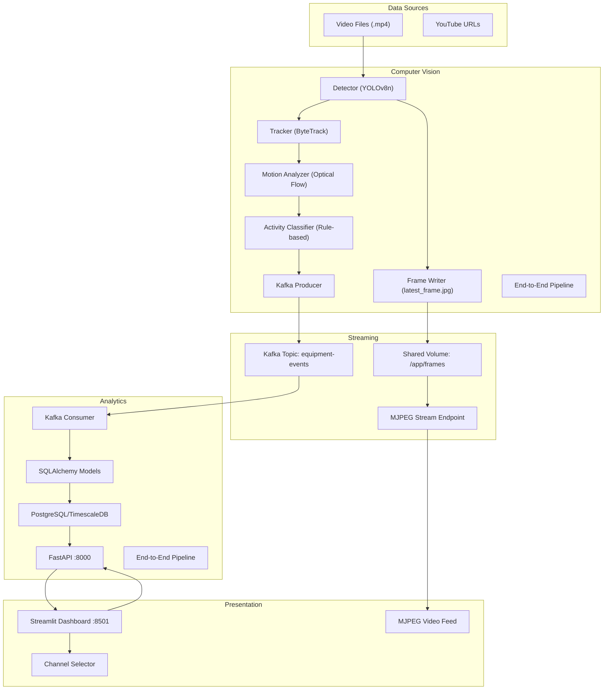
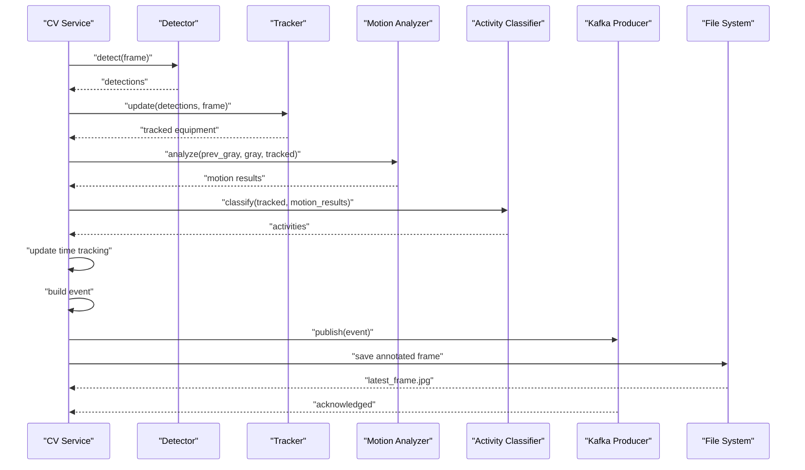
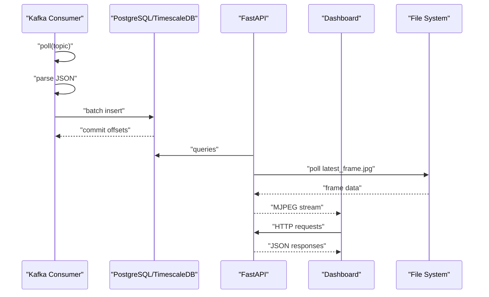
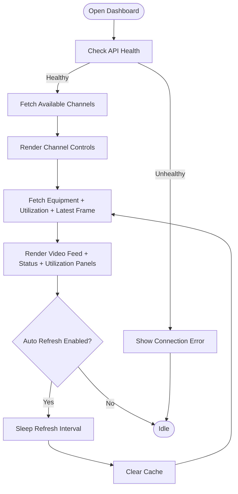
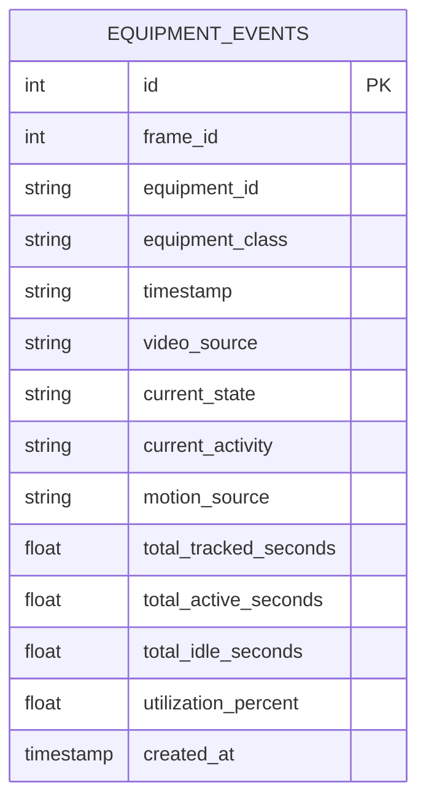
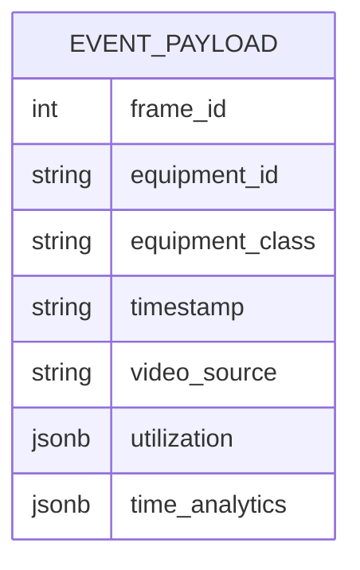
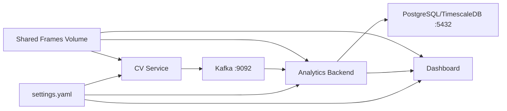

# System Architecture Overview

<cite>
**Referenced Files in This Document**
- [README.md](file://README.md)
- [docker-compose.yml](file://docker-compose.yml)
- [compose.yaml](file://compose.yaml)
- [settings.yaml](file://config/settings.yaml)
- [cv_service main.py](file://services/cv_service/src/main.py)
- [cv_service kafka_producer.py](file://services/cv_service/src/kafka_producer.py)
- [cv_service detector.py](file://services/cv_service/src/detector.py)
- [cv_service tracker.py](file://services/cv_service/src/tracker.py)
- [analytics_backend main.py](file://services/analytics_backend/src/main.py)
- [analytics_backend consumer.py](file://services/analytics_backend/src/consumer.py)
- [analytics_backend api.py](file://services/analytics_backend/src/api.py)
- [analytics_backend db_models.py](file://services/analytics_backend/src/db_models.py)
- [dashboard app.py](file://services/dashboard/src/app.py)
- [video_ingestion frame_producer.py](file://services/video_ingestion/src/frame_producer.py)
- [cv_service Dockerfile](file://services/cv_service/Dockerfile)
- [analytics_backend Dockerfile](file://services/analytics_backend/Dockerfile)
- [dashboard Dockerfile](file://services/dashboard/Dockerfile)
- [video_ingestion Dockerfile](file://services/video_ingestion/Dockerfile)
</cite>

## Update Summary
**Changes Made**
- Enhanced MJPEG streaming architecture documentation with file-based frame relay mechanism
- Added comprehensive per-channel architecture coverage including hot-switching capabilities
- Updated real-time video delivery mechanisms with Streamlit integration details
- Expanded video ingestion pipeline documentation with frame production capabilities
- Added detailed file sharing mechanisms between CV service and analytics backend

## Table of Contents
1. [Introduction](#introduction)
2. [Project Structure](#project-structure)
3. [Core Components](#core-components)
4. [Architecture Overview](#architecture-overview)
5. [Detailed Component Analysis](#detailed-component-analysis)
6. [Dependency Analysis](#dependency-analysis)
7. [Performance Considerations](#performance-considerations)
8. [Troubleshooting Guide](#troubleshooting-guide)
9. [Conclusion](#conclusion)

## Introduction
This document presents the architectural blueprint for the Equipment Monitoring Pipeline, a real-time microservices system that monitors construction equipment utilization through video ingestion, computer vision, asynchronous event streaming, analytics, and a live dashboard. The system follows an event-driven architecture pattern, decoupling producers (CV service) from consumers (Analytics Backend) and dashboards via Apache Kafka. It emphasizes scalability, fault tolerance, and real-time responsiveness while operating on CPU-only infrastructure.

**Updated** Enhanced with comprehensive MJPEG streaming solution, per-channel architecture, and real-time video delivery mechanisms.

## Project Structure
The repository organizes functionality into six primary services orchestrated by Docker Compose:
- Video ingestion utilities with frame production capabilities
- Computer Vision (CV) service with MJPEG frame annotation
- Apache Kafka (with Zookeeper)
- Analytics Backend (FastAPI + Kafka consumer + PostgreSQL/TimescaleDB)
- Streamlit Dashboard with real-time video streaming
- Centralized configuration with per-channel support

**Diagram sources**
- [docker-compose.yml:1-99](file://docker-compose.yml#L1-L99)
- [compose.yaml:1-9](file://compose.yaml#L1-L9)
- [cv_service main.py:34-35](file://services/cv_service/src/main.py#L34-L35)
- [analytics_backend api.py:463-464](file://services/analytics_backend/src/api.py#L463-L464)

**Section sources**
- [README.md:62-72](file://README.md#L62-L72)
- [docker-compose.yml:1-99](file://docker-compose.yml#L1-L99)

## Core Components
- CV Service: Orchestrates video frame processing, detection, tracking, motion analysis, activity classification, time tracking, and Kafka publishing. Features file-based frame annotation and per-channel processing.
- Apache Kafka: Central event bus for asynchronous communication, persisting equipment events on the equipment-events topic.
- Analytics Backend: FastAPI REST API plus a Kafka consumer that persists events to PostgreSQL/TimescaleDB with MJPEG streaming capabilities.
- PostgreSQL/TimescaleDB: Relational database with time-series optimization via TimescaleDB hypertables.
- Streamlit Dashboard: Real-time UI querying Analytics Backend for live equipment status, utilization metrics, and MJPEG video streams.
- Video Ingestion: Utilities for downloading and preparing video sources with frame extraction capabilities.

Key ports and endpoints:
- Kafka: 9092 (broker), 2181 (Zookeeper)
- PostgreSQL/TimescaleDB: 5432
- Analytics Backend: 8000
- Dashboard: 8501

**Section sources**
- [README.md:75-87](file://README.md#L75-L87)
- [settings.yaml:41-59](file://config/settings.yaml#L41-L59)
- [docker-compose.yml:1-99](file://docker-compose.yml#L1-L99)

## Architecture Overview
The system employs an event-driven architecture with enhanced MJPEG streaming and per-channel capabilities:
- CV Service produces equipment events and publishes them to the equipment-events Kafka topic while simultaneously writing annotated frames to shared storage.
- Analytics Backend consumes events, persists them to PostgreSQL/TimescaleDB, and serves MJPEG streams via FastAPI endpoints.
- Streamlit Dashboard queries the Analytics Backend to render real-time equipment status, utilization, and live video streams with per-channel support.

**Updated** Added comprehensive MJPEG streaming architecture and per-channel processing capabilities.

**Diagram sources**
- [README.md:240-281](file://README.md#L240-L281)
- [cv_service main.py:518-607](file://services/cv_service/src/main.py#L518-L607)
- [cv_service kafka_producer.py:17-228](file://services/cv_service/src/kafka_producer.py#L17-L228)
- [analytics_backend consumer.py:23-268](file://services/analytics_backend/src/consumer.py#L23-L268)
- [analytics_backend api.py:489-560](file://services/analytics_backend/src/api.py#L489-L560)
- [dashboard app.py:623-686](file://services/dashboard/src/app.py#L623-L686)

## Detailed Component Analysis

### Enhanced MJPEG Streaming Architecture
The system implements a sophisticated MJPEG streaming solution using file-based frame relay:

**File-Based Frame Relay Mechanism:**
- CV Service writes each annotated frame as `latest_frame.jpg` to a shared Docker volume
- FastAPI polls the file at ~10 Hz, detecting `mtime` changes and pushing new frames as `multipart/x-mixed-replace` MJPEG chunks
- Streamlit embeds the MJPEG endpoint in an `<iframe>` with automatic reconnection handling
- Streams auto-close after 60 seconds to prevent stale connection pile-up

**Trade-offs and Benefits:**
- ✅ Zero additional dependencies — browsers support MJPEG natively
- ✅ File-based decoupling — CV service and API server are independent
- ✅ Fragment-based refresh in Streamlit — video stream never interrupts when data tables update
- ⚠️ MJPEG bandwidth is higher than H.264/WebRTC (no inter-frame compression)
- ⚠️ Single-file relay means only the latest frame is available (acceptable for monitoring use case)

**Section sources**
- [README.md:240-266](file://README.md#L240-L266)
- [cv_service main.py:593-595](file://services/cv_service/src/main.py#L593-L595)
- [analytics_backend api.py:489-560](file://services/analytics_backend/src/api.py#L489-L560)
- [dashboard app.py:623-686](file://services/dashboard/src/app.py#L623-L686)

### Per-Channel Architecture (Multi-Video Support)
The system supports dynamic channel switching from the dashboard with comprehensive per-channel filtering:

**Channel Management Mechanisms:**
- `video_source` field on every Kafka event and database record enables per-channel filtering
- Channel switch via `POST /api/videos/select` writes a control file; the CV service detects it and resets its pipeline
- Dashboard uses Streamlit's fragment-based refresh (`@st.fragment`) — channel switch updates data tables and video feed independently without full page reload
- All API endpoints accept an optional `?channel=filename.mp4` query parameter to filter results per video source

**Hot-Switching Capabilities:**
- CV Service monitors `/app/frames/selected_video.txt` for channel changes
- Pipeline components are reset for clean per-channel state
- Frame counters and tracking state are reinitialized for each new channel
- Seamless transition between channels without restarting containers

**Trade-offs:**
- ✅ Clean separation of data per video source
- ✅ Hot-switching without restarting containers
- ⚠️ Only one video processed at a time (single CV pipeline instance)

**Section sources**
- [README.md:267-281](file://README.md#L267-L281)
- [cv_service main.py:630-642](file://services/cv_service/src/main.py#L630-L642)
- [cv_service main.py:747-781](file://services/cv_service/src/main.py#L747-L781)
- [analytics_backend api.py:567-622](file://services/analytics_backend/src/api.py#L567-L622)
- [dashboard app.py:509-528](file://services/dashboard/src/app.py#L509-L528)

### CV Service Pipeline
The CV Service orchestrates the end-to-end computer vision pipeline with enhanced frame management:

**Enhanced Frame Processing:**
- Loads configuration from settings.yaml
- Iterates video frames with frame skipping and resizing
- Detects equipment using YOLOv8n
- Tracks equipment across frames using ByteTrack
- Analyzes motion via region-based optical flow
- Classifies activities using rule-based logic
- Updates time tracking and builds events
- Publishes events to Kafka with equipment_id partitioning
- Saves annotated frames to shared storage for MJPEG streaming

**File Management:**
- Writes `latest_frame.jpg` for real-time streaming
- Saves historical frames as `frame_{id:06d}.jpg` for archival
- Periodic cleanup of old frames to maintain disk space
- Maintains frame counter and processing state

**Diagram sources**
- [cv_service main.py:467-517](file://services/cv_service/src/main.py#L467-L517)
- [cv_service main.py:518-607](file://services/cv_service/src/main.py#L518-L607)
- [cv_service kafka_producer.py:91-169](file://services/cv_service/src/kafka_producer.py#L91-L169)

**Section sources**
- [cv_service main.py:48-75](file://services/cv_service/src/main.py#L48-L75)
- [cv_service main.py:467-517](file://services/cv_service/src/main.py#L467-L517)
- [cv_service main.py:518-607](file://services/cv_service/src/main.py#L518-L607)
- [cv_service detector.py:18-170](file://services/cv_service/src/detector.py#L18-L170)
- [cv_service tracker.py:19-341](file://services/cv_service/src/tracker.py#L19-L341)
- [cv_service kafka_producer.py:17-228](file://services/cv_service/src/kafka_producer.py#L17-L228)

### Analytics Backend
The Analytics Backend combines a FastAPI server with a Kafka consumer and enhanced streaming capabilities:

**Enhanced Streaming Features:**
- Starts Kafka consumer in a background thread alongside the FastAPI server
- Persists events to PostgreSQL/TimescaleDB with batched commits
- Provides REST endpoints for equipment status, history, utilization summary, latest frame, and statistics
- Sets up TimescaleDB hypertable for time-series optimization
- Implements MJPEG streaming endpoint for real-time video delivery
- Supports per-channel filtering via query parameters

**MJPEG Streaming Implementation:**
- Polls `/app/frames/latest_frame.jpg` for changes at ~10Hz
- Generates `multipart/x-mixed-replace` stream with proper headers
- Implements automatic stream closure after 60 seconds
- Handles initial frame delivery and subsequent updates efficiently

**Diagram sources**
- [analytics_backend consumer.py:93-244](file://services/analytics_backend/src/consumer.py#L93-L244)
- [analytics_backend api.py:159-444](file://services/analytics_backend/src/api.py#L159-L444)
- [analytics_backend api.py:489-560](file://services/analytics_backend/src/api.py#L489-L560)
- [analytics_backend db_models.py:70-191](file://services/analytics_backend/src/db_models.py#L70-L191)
- [analytics_backend main.py:64-149](file://services/analytics_backend/src/main.py#L64-L149)

**Section sources**
- [analytics_backend main.py:64-149](file://services/analytics_backend/src/main.py#L64-L149)
- [analytics_backend consumer.py:23-268](file://services/analytics_backend/src/consumer.py#L23-L268)
- [analytics_backend api.py:159-444](file://services/analytics_backend/src/api.py#L159-L444)
- [analytics_backend api.py:489-560](file://services/analytics_backend/src/api.py#L489-L560)
- [analytics_backend db_models.py:22-191](file://services/analytics_backend/src/db_models.py#L22-L191)

### Streamlit Dashboard
The Streamlit Dashboard provides a real-time UI with enhanced video streaming capabilities:

**Enhanced Video Streaming:**
- Renders MJPEG video stream using embedded iframe with automatic reconnection
- Implements client-side JavaScript for stream recovery and periodic reconnection
- Supports per-channel filtering via query parameters
- Uses fragment-based refresh to maintain video stream during data updates

**Channel Management:**
- Queries Analytics Backend endpoints for equipment list, utilization summary, latest frame, and stats
- Renders live equipment status, activity badges, and utilization metrics
- Supports manual refresh, auto-refresh, and equipment filtering
- Dynamic channel switching without page reload interruption

**Diagram sources**
- [dashboard app.py:100-160](file://services/dashboard/src/app.py#L100-L160)
- [dashboard app.py:518-621](file://services/dashboard/src/app.py#L518-L621)
- [dashboard app.py:623-686](file://services/dashboard/src/app.py#L623-L686)

**Section sources**
- [dashboard app.py:26-621](file://services/dashboard/src/app.py#L26-L621)
- [dashboard app.py:623-686](file://services/dashboard/src/app.py#L623-L686)

### Data Models and Persistence
The Analytics Backend defines a single EquipmentEvent model persisted in PostgreSQL/TimescaleDB with enhanced per-channel support. The system attempts to convert the table into a TimescaleDB hypertable on the created_at timestamp for optimized time-series queries.

**Enhanced Event Schema:**
- Includes `video_source` field for per-channel tracking
- Supports comprehensive filtering by channel via query parameters
- Maintains historical frame data for archival and debugging

**Diagram sources**
- [analytics_backend db_models.py:22-68](file://services/analytics_backend/src/db_models.py#L22-L68)

**Section sources**
- [analytics_backend db_models.py:70-191](file://services/analytics_backend/src/db_models.py#L70-L191)

### Kafka Message Schema
Events published by the CV Service follow a structured schema aligned with the EquipmentEvent model, enabling downstream consumers to persist and query utilization metrics with per-channel support.

**Enhanced Event Payload:**
- Includes `video_source` field for channel identification
- Supports comprehensive per-channel filtering and analysis
- Maintains backward compatibility with existing consumers

**Diagram sources**
- [cv_service kafka_producer.py:95-112](file://services/cv_service/src/kafka_producer.py#L95-L112)
- [README.md:328-351](file://README.md#L328-L351)

**Section sources**
- [cv_service kafka_producer.py:91-169](file://services/cv_service/src/kafka_producer.py#L91-L169)
- [README.md:328-351](file://README.md#L328-L351)

### Video Ingestion Pipeline
The video ingestion system provides comprehensive video processing capabilities:

**Frame Production:**
- Downloads YouTube videos using yt-dlp with configurable quality settings
- Extracts frames from video files for offline processing
- Supports multiple video formats (MP4, AVI, MKV, MOV, WEBM, FLV)
- Provides frame metadata and quality metrics

**Integration Points:**
- Shared `/app/videos` directory for video storage
- Frame extraction utilities for offline analysis
- Quality assessment and format conversion capabilities

**Section sources**
- [video_ingestion frame_producer.py](file://services/video_ingestion/src/frame_producer.py)

## Dependency Analysis
The system exhibits loose coupling through Kafka and shared file systems, with explicit dependencies as follows:

**Updated** Enhanced with file system dependencies for MJPEG streaming and per-channel processing.

**Diagram sources**
- [settings.yaml:1-59](file://config/settings.yaml#L1-L59)
- [docker-compose.yml:1-99](file://docker-compose.yml#L1-L99)

**Section sources**
- [settings.yaml:41-59](file://config/settings.yaml#L41-L59)
- [docker-compose.yml:1-99](file://docker-compose.yml#L1-L99)

## Performance Considerations
- CPU-optimized CV pipeline:
  - YOLOv8 nano model for lightweight inference
  - Frame skipping and resizing to reduce processing load
  - Crop-based optical flow to avoid full-frame computation
- Streaming throughput:
  - Kafka producer tuned with linger, batch size, and acks for reliability and latency
  - Consumer batch commits and timeouts for balanced throughput and durability
  - MJPEG streaming optimized for 10Hz frame rate polling
- Database scaling:
  - TimescaleDB hypertable for time-series optimization
  - Connection pooling and pre-ping for robust connectivity
- Dashboard responsiveness:
  - Caching and TTL for frequent API calls
  - Adjustable refresh intervals to balance freshness and load
  - Fragment-based refresh to maintain video stream continuity

**Updated** Enhanced with MJPEG streaming considerations and per-channel performance implications.

**Section sources**
- [README.md:177-223](file://README.md#L177-L223)
- [cv_service kafka_producer.py:39-53](file://services/cv_service/src/kafka_producer.py#L39-L53)
- [analytics_backend consumer.py:31-34](file://services/analytics_backend/src/consumer.py#L31-L34)
- [analytics_backend db_models.py:85-91](file://services/analytics_backend/src/db_models.py#L85-L91)
- [dashboard app.py:100-160](file://services/dashboard/src/app.py#L100-L160)
- [analytics_backend api.py:489-560](file://services/analytics_backend/src/api.py#L489-L560)

## Troubleshooting Guide
Common issues and remedies:
- Kafka connectivity:
  - Verify Zookeeper and Kafka health checks in docker-compose
  - Confirm bootstrap servers and topic name in settings.yaml
- Database readiness:
  - Ensure PostgreSQL/TimescaleDB health check passes before starting Analytics Backend
  - Check TimescaleDB extension availability and hypertable creation
- Service dependencies:
  - CV Service depends on Kafka being healthy
  - Analytics Backend depends on both Kafka and PostgreSQL/TimescaleDB
  - Dashboard depends on Analytics Backend REST API
- Event delivery:
  - Producer flush and delivery callbacks indicate successful acknowledgments
  - Consumer offsets committed after batch DB writes
- MJPEG streaming issues:
  - Verify shared volume mounting for `/app/frames`
  - Check file permissions for frame directory
  - Monitor frame file updates and modification timestamps
- Per-channel switching:
  - Ensure control file `/app/frames/selected_video.txt` is writable
  - Verify CV service has read access to control file
  - Check channel filenames match actual video files

**Updated** Enhanced troubleshooting guidance for MJPEG streaming and per-channel architecture.

Operational commands:
- Start services: docker compose up --build
- Stop services: docker compose down
- Health checks: docker compose ps
- Monitor frame files: docker compose exec cv-service ls -la /app/frames

**Section sources**
- [docker-compose.yml:9-13](file://docker-compose.yml#L9-L13)
- [docker-compose.yml:28-33](file://docker-compose.yml#L28-L33)
- [docker-compose.yml:45-49](file://docker-compose.yml#L45-L49)
- [cv_service kafka_producer.py:170-192](file://services/cv_service/src/kafka_producer.py#L170-L192)
- [analytics_backend consumer.py:206-229](file://services/analytics_backend/src/consumer.py#L206-L229)

## Conclusion
The Equipment Monitoring Pipeline demonstrates a scalable, fault-tolerant, and real-time event-driven architecture with enhanced streaming and channel management capabilities. By decoupling the CV pipeline from persistence and presentation through Kafka, the system achieves high modularity, enabling independent scaling and evolution of components. The addition of MJPEG streaming with file-based frame relay and comprehensive per-channel architecture significantly enhances real-time monitoring capabilities while maintaining responsive dashboards for operational insights.

**Updated** Enhanced conclusion reflecting the improved streaming architecture and per-channel capabilities that provide superior real-time monitoring experience.