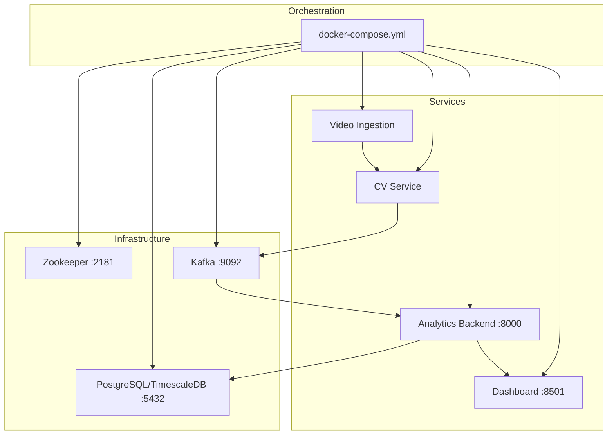
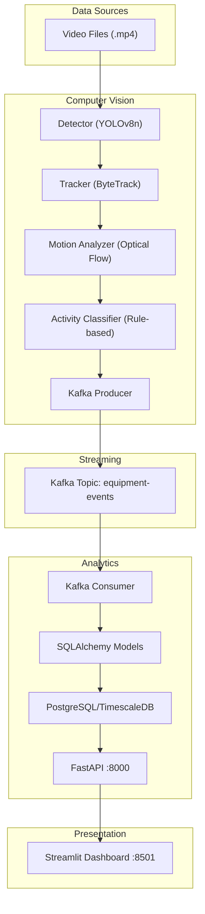
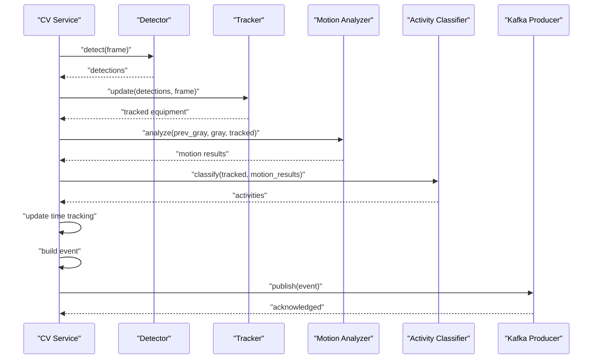
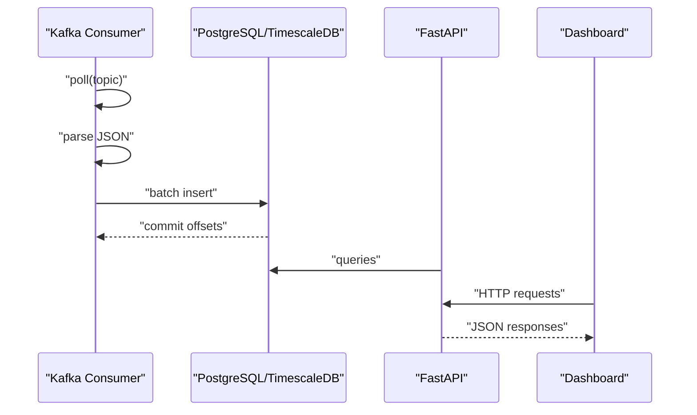
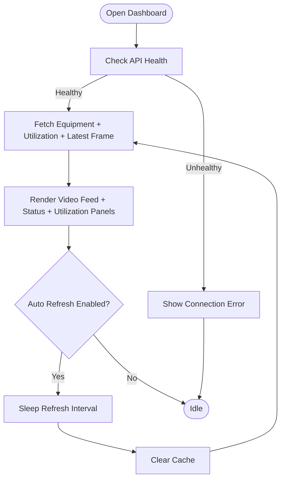
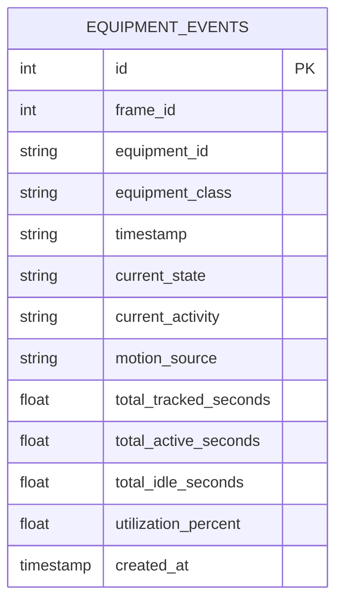
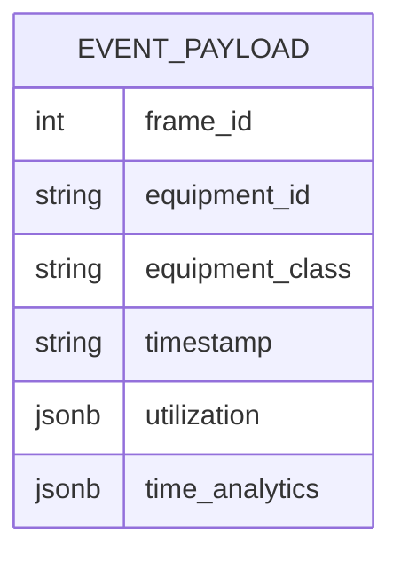
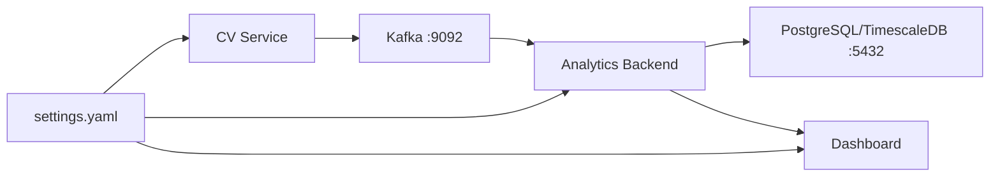

# System Architecture Overview

<cite>
**Referenced Files in This Document**
- [README.md](file://README.md)
- [docker-compose.yml](file://docker-compose.yml)
- [settings.yaml](file://config/settings.yaml)
- [cv_service main.py](file://services/cv_service/src/main.py)
- [cv_service kafka_producer.py](file://services/cv_service/src/kafka_producer.py)
- [cv_service detector.py](file://services/cv_service/src/detector.py)
- [cv_service tracker.py](file://services/cv_service/src/tracker.py)
- [analytics_backend main.py](file://services/analytics_backend/src/main.py)
- [analytics_backend consumer.py](file://services/analytics_backend/src/consumer.py)
- [analytics_backend api.py](file://services/analytics_backend/src/api.py)
- [analytics_backend db_models.py](file://services/analytics_backend/src/db_models.py)
- [dashboard app.py](file://services/dashboard/src/app.py)
- [video_ingestion frame_producer.py](file://services/video_ingestion/src/frame_producer.py)
- [cv_service Dockerfile](file://services/cv_service/Dockerfile)
- [analytics_backend Dockerfile](file://services/analytics_backend/Dockerfile)
- [dashboard Dockerfile](file://services/dashboard/Dockerfile)
- [video_ingestion Dockerfile](file://services/video_ingestion/Dockerfile)
</cite>

## Table of Contents
1. [Introduction](#introduction)
2. [Project Structure](#project-structure)
3. [Core Components](#core-components)
4. [Architecture Overview](#architecture-overview)
5. [Detailed Component Analysis](#detailed-component-analysis)
6. [Dependency Analysis](#dependency-analysis)
7. [Performance Considerations](#performance-considerations)
8. [Troubleshooting Guide](#troubleshooting-guide)
9. [Conclusion](#conclusion)

## Introduction
This document presents the architectural blueprint for the Equipment Monitoring Pipeline, a real-time microservices system that monitors construction equipment utilization through video ingestion, computer vision, asynchronous event streaming, analytics, and a live dashboard. The system follows an event-driven architecture pattern, decoupling producers (CV service) from consumers (Analytics Backend) and dashboards via Apache Kafka. It emphasizes scalability, fault tolerance, and real-time responsiveness while operating on CPU-only infrastructure.

## Project Structure
The repository organizes functionality into six primary services orchestrated by Docker Compose:
- Video ingestion utilities
- Computer Vision (CV) service
- Apache Kafka (with Zookeeper)
- Analytics Backend (FastAPI + Kafka consumer + PostgreSQL/TimescaleDB)
- Streamlit Dashboard
- Centralized configuration

**Diagram sources**
- [docker-compose.yml:1-95](file://docker-compose.yml#L1-L95)
- [cv_service main.py:1-571](file://services/cv_service/src/main.py#L1-L571)
- [analytics_backend main.py:1-149](file://services/analytics_backend/src/main.py#L1-L149)
- [dashboard app.py:1-621](file://services/dashboard/src/app.py#L1-L621)

**Section sources**
- [README.md:56-66](file://README.md#L56-L66)
- [docker-compose.yml:1-95](file://docker-compose.yml#L1-L95)

## Core Components
- CV Service: Orchestrates video frame processing, detection, tracking, motion analysis, activity classification, time tracking, and Kafka publishing.
- Apache Kafka: Central event bus for asynchronous communication, persisting equipment events on the equipment-events topic.
- Analytics Backend: FastAPI REST API plus a Kafka consumer that persists events to PostgreSQL/TimescaleDB.
- PostgreSQL/TimescaleDB: Relational database with time-series optimization via TimescaleDB hypertables.
- Streamlit Dashboard: Real-time UI querying Analytics Backend for live equipment status and utilization metrics.
- Video Ingestion: Utilities for downloading and preparing video sources.

Key ports and endpoints:
- Kafka: 9092 (broker), 2181 (Zookeeper)
- PostgreSQL/TimescaleDB: 5432
- Analytics Backend: 8000
- Dashboard: 8501

**Section sources**
- [README.md:58-66](file://README.md#L58-L66)
- [settings.yaml:41-59](file://config/settings.yaml#L41-L59)
- [docker-compose.yml:1-95](file://docker-compose.yml#L1-L95)

## Architecture Overview
The system employs an event-driven architecture:
- CV Service produces equipment events and publishes them to the equipment-events Kafka topic.
- Analytics Backend consumes events, persists them to PostgreSQL/TimescaleDB, and exposes a REST API.
- Streamlit Dashboard queries the Analytics Backend to render real-time equipment status and utilization.

**Diagram sources**
- [README.md:7-54](file://README.md#L7-L54)
- [cv_service main.py:42-421](file://services/cv_service/src/main.py#L42-L421)
- [cv_service kafka_producer.py:17-228](file://services/cv_service/src/kafka_producer.py#L17-L228)
- [analytics_backend consumer.py:23-268](file://services/analytics_backend/src/consumer.py#L23-L268)
- [analytics_backend api.py:24-444](file://services/analytics_backend/src/api.py#L24-L444)
- [analytics_backend db_models.py:22-191](file://services/analytics_backend/src/db_models.py#L22-L191)
- [dashboard app.py:1-621](file://services/dashboard/src/app.py#L1-L621)

## Detailed Component Analysis

### CV Service Pipeline
The CV Service orchestrates the end-to-end computer vision pipeline:
- Loads configuration from settings.yaml
- Iterates video frames with frame skipping and resizing
- Detects equipment using YOLOv8n
- Tracks equipment across frames using ByteTrack
- Analyzes motion via region-based optical flow
- Classifies activities using rule-based logic
- Updates time tracking and builds events
- Publishes events to Kafka with equipment_id partitioning

**Diagram sources**
- [cv_service main.py:323-421](file://services/cv_service/src/main.py#L323-L421)
- [cv_service kafka_producer.py:91-169](file://services/cv_service/src/kafka_producer.py#L91-L169)

**Section sources**
- [cv_service main.py:42-421](file://services/cv_service/src/main.py#L42-L421)
- [cv_service detector.py:18-170](file://services/cv_service/src/detector.py#L18-L170)
- [cv_service tracker.py:19-341](file://services/cv_service/src/tracker.py#L19-L341)
- [cv_service kafka_producer.py:17-228](file://services/cv_service/src/kafka_producer.py#L17-L228)

### Analytics Backend
The Analytics Backend combines a FastAPI server with a Kafka consumer:
- Starts Kafka consumer in a background thread alongside the FastAPI server
- Persists events to PostgreSQL/TimescaleDB with batched commits
- Provides REST endpoints for equipment status, history, utilization summary, latest frame, and statistics
- Sets up TimescaleDB hypertable for time-series optimization

**Diagram sources**
- [analytics_backend consumer.py:93-244](file://services/analytics_backend/src/consumer.py#L93-L244)
- [analytics_backend api.py:159-444](file://services/analytics_backend/src/api.py#L159-L444)
- [analytics_backend db_models.py:70-191](file://services/analytics_backend/src/db_models.py#L70-L191)
- [analytics_backend main.py:64-149](file://services/analytics_backend/src/main.py#L64-L149)

**Section sources**
- [analytics_backend main.py:64-149](file://services/analytics_backend/src/main.py#L64-L149)
- [analytics_backend consumer.py:23-268](file://services/analytics_backend/src/consumer.py#L23-L268)
- [analytics_backend api.py:159-444](file://services/analytics_backend/src/api.py#L159-L444)
- [analytics_backend db_models.py:22-191](file://services/analytics_backend/src/db_models.py#L22-L191)

### Streamlit Dashboard
The Streamlit Dashboard provides a real-time UI:
- Queries Analytics Backend endpoints for equipment list, utilization summary, latest frame, and stats
- Renders live equipment status, activity badges, and utilization metrics
- Supports manual refresh, auto-refresh, and equipment filtering

**Diagram sources**
- [dashboard app.py:100-160](file://services/dashboard/src/app.py#L100-L160)
- [dashboard app.py:518-621](file://services/dashboard/src/app.py#L518-L621)

**Section sources**
- [dashboard app.py:26-621](file://services/dashboard/src/app.py#L26-L621)

### Data Models and Persistence
The Analytics Backend defines a single EquipmentEvent model persisted in PostgreSQL/TimescaleDB. The system attempts to convert the table into a TimescaleDB hypertable on the created_at timestamp for optimized time-series queries.

**Diagram sources**
- [analytics_backend db_models.py:22-68](file://services/analytics_backend/src/db_models.py#L22-L68)

**Section sources**
- [analytics_backend db_models.py:70-191](file://services/analytics_backend/src/db_models.py#L70-L191)

### Kafka Message Schema
Events published by the CV Service follow a structured schema aligned with the EquipmentEvent model, enabling downstream consumers to persist and query utilization metrics.

**Diagram sources**
- [cv_service kafka_producer.py:95-112](file://services/cv_service/src/kafka_producer.py#L95-L112)
- [README.md:263-285](file://README.md#L263-L285)

**Section sources**
- [cv_service kafka_producer.py:91-169](file://services/cv_service/src/kafka_producer.py#L91-L169)
- [README.md:263-285](file://README.md#L263-L285)

## Dependency Analysis
The system exhibits loose coupling through Kafka, with explicit dependencies as follows:

**Diagram sources**
- [settings.yaml:1-59](file://config/settings.yaml#L1-L59)
- [docker-compose.yml:1-95](file://docker-compose.yml#L1-L95)

**Section sources**
- [settings.yaml:41-59](file://config/settings.yaml#L41-L59)
- [docker-compose.yml:1-95](file://docker-compose.yml#L1-L95)

## Performance Considerations
- CPU-optimized CV pipeline:
  - YOLOv8 nano model for lightweight inference
  - Frame skipping and resizing to reduce processing load
  - Crop-based optical flow to avoid full-frame computation
- Streaming throughput:
  - Kafka producer tuned with linger, batch size, and acks for reliability and latency
  - Consumer batch commits and timeouts for balanced throughput and durability
- Database scaling:
  - TimescaleDB hypertable for time-series optimization
  - Connection pooling and pre-ping for robust connectivity
- Dashboard responsiveness:
  - Caching and TTL for frequent API calls
  - Adjustable refresh intervals to balance freshness and load

**Section sources**
- [README.md:177-223](file://README.md#L177-L223)
- [cv_service kafka_producer.py:39-53](file://services/cv_service/src/kafka_producer.py#L39-L53)
- [analytics_backend consumer.py:31-34](file://services/analytics_backend/src/consumer.py#L31-L34)
- [analytics_backend db_models.py:85-91](file://services/analytics_backend/src/db_models.py#L85-L91)
- [dashboard app.py:100-160](file://services/dashboard/src/app.py#L100-L160)

## Troubleshooting Guide
Common issues and remedies:
- Kafka connectivity:
  - Verify Zookeeper and Kafka health checks in docker-compose
  - Confirm bootstrap servers and topic name in settings.yaml
- Database readiness:
  - Ensure PostgreSQL/TimescaleDB health check passes before starting Analytics Backend
  - Check TimescaleDB extension availability and hypertable creation
- Service dependencies:
  - CV Service depends on Kafka being healthy
  - Analytics Backend depends on both Kafka and PostgreSQL/TimescaleDB
  - Dashboard depends on Analytics Backend REST API
- Event delivery:
  - Producer flush and delivery callbacks indicate successful acknowledgments
  - Consumer offsets committed after batch DB writes

Operational commands:
- Start services: docker compose up --build
- Stop services: docker compose down
- Health checks: docker compose ps

**Section sources**
- [docker-compose.yml:9-13](file://docker-compose.yml#L9-L13)
- [docker-compose.yml:28-33](file://docker-compose.yml#L28-L33)
- [docker-compose.yml:45-49](file://docker-compose.yml#L45-L49)
- [cv_service kafka_producer.py:170-192](file://services/cv_service/src/kafka_producer.py#L170-L192)
- [analytics_backend consumer.py:206-229](file://services/analytics_backend/src/consumer.py#L206-L229)

## Conclusion
The Equipment Monitoring Pipeline demonstrates a scalable, fault-tolerant, and real-time event-driven architecture. By decoupling the CV pipeline from persistence and presentation through Kafka, the system achieves high modularity, enabling independent scaling and evolution of components. The combination of CPU-friendly CV optimizations, efficient streaming, and time-series database tuning supports practical deployment scenarios while maintaining responsive dashboards for operational insights.