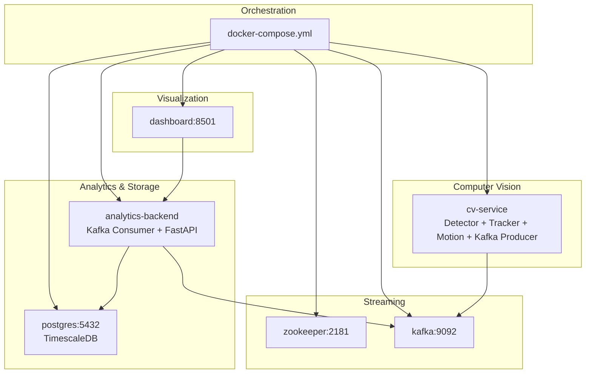
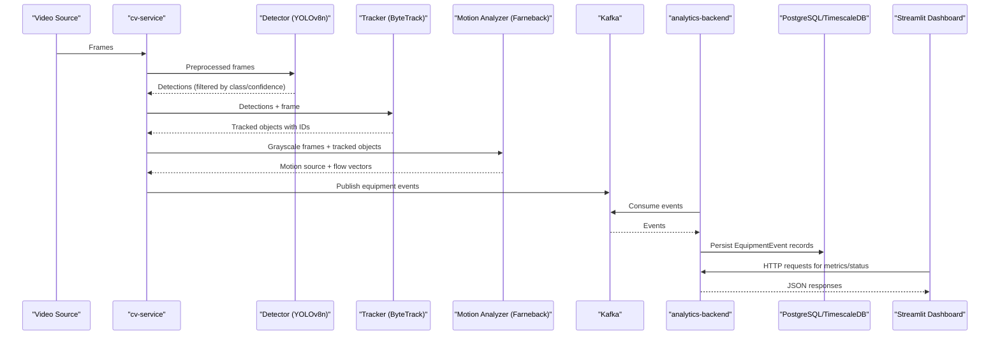
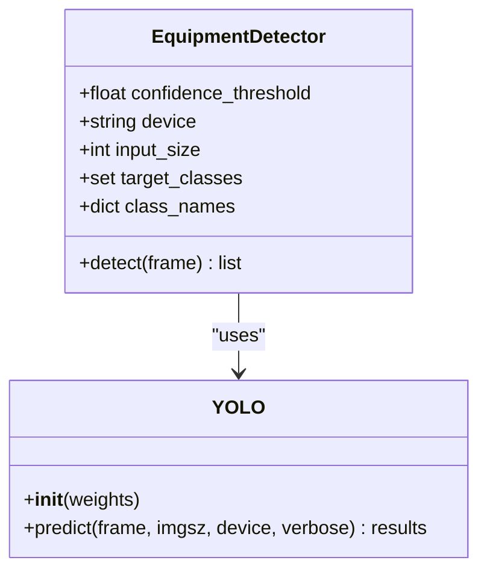
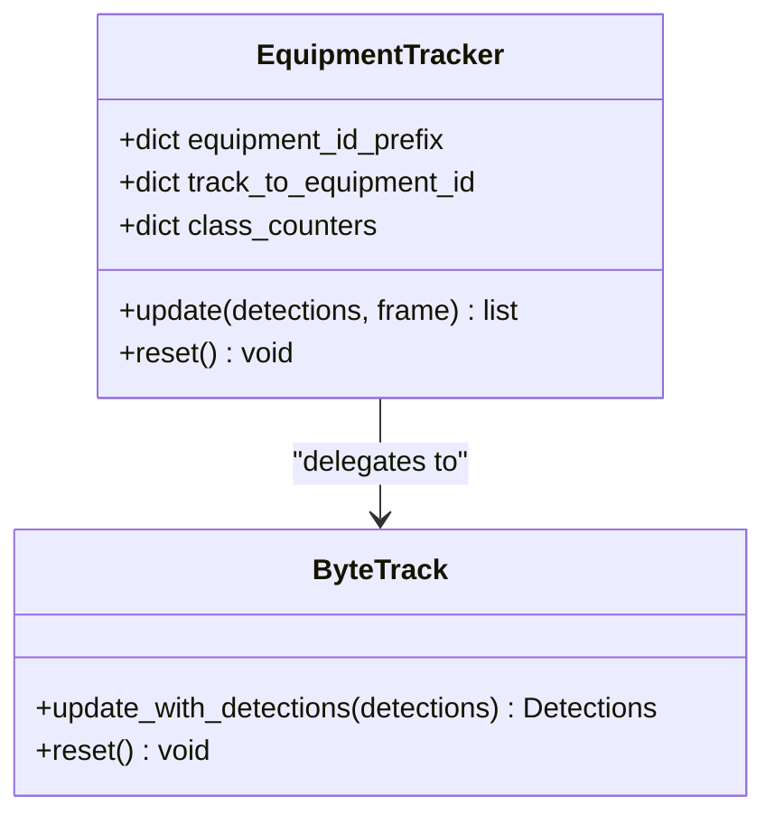
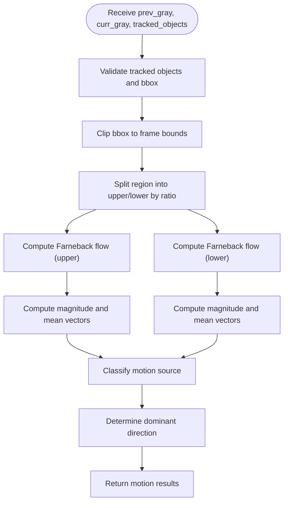
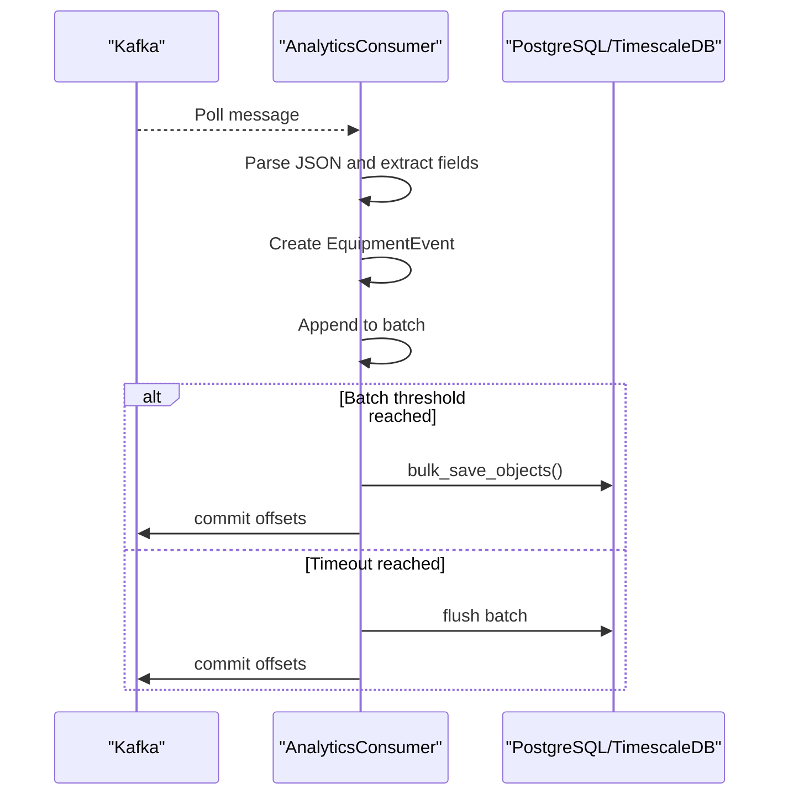
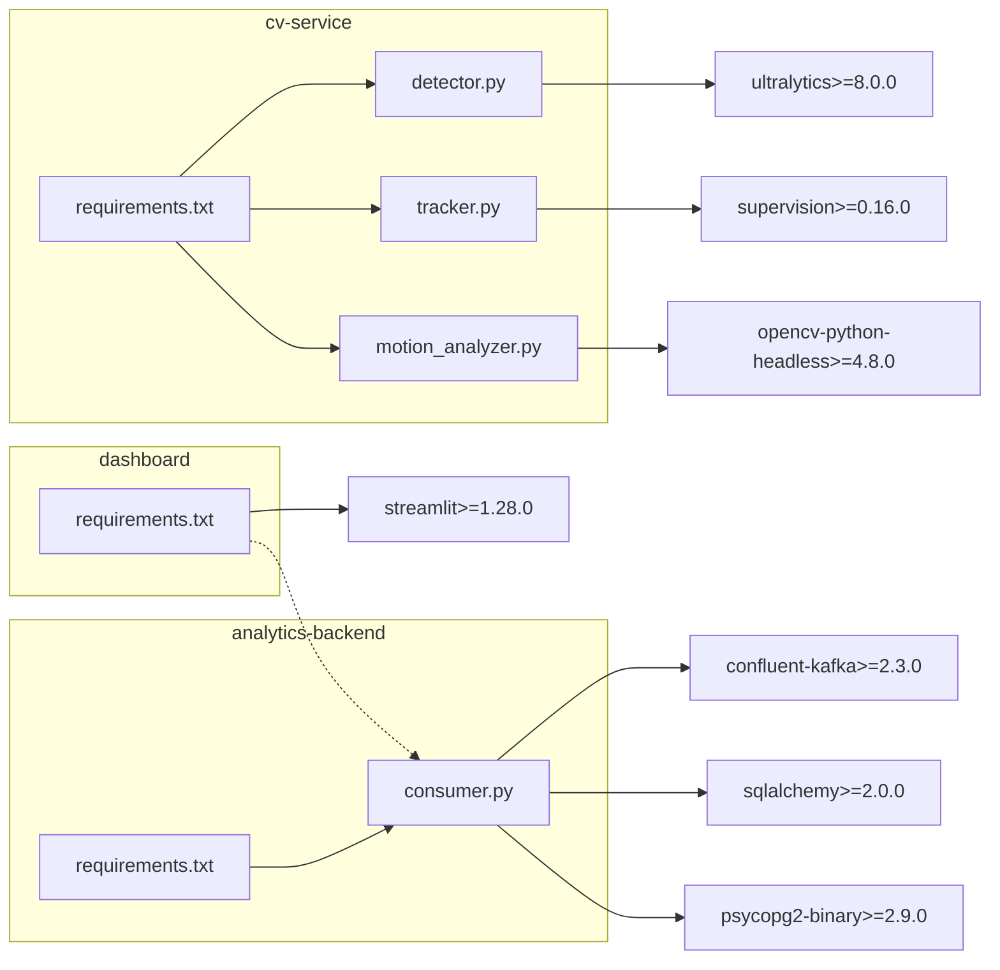

# Technology Stack

<cite>
**Referenced Files in This Document**
- [README.md](file://README.md)
- [docker-compose.yml](file://docker-compose.yml)
- [settings.yaml](file://config/settings.yaml)
- [cv_service requirements.txt](file://services/cv_service/requirements.txt)
- [analytics_backend requirements.txt](file://services/analytics_backend/requirements.txt)
- [dashboard requirements.txt](file://services/dashboard/requirements.txt)
- [video_ingestion requirements.txt](file://services/video_ingestion/requirements.txt)
- [cv_service Dockerfile](file://services/cv_service/Dockerfile)
- [analytics_backend Dockerfile](file://services/analytics_backend/Dockerfile)
- [dashboard Dockerfile](file://services/dashboard/Dockerfile)
- [video_ingestion Dockerfile](file://services/video_ingestion/Dockerfile)
- [cv_service main.py](file://services/cv_service/src/main.py)
- [cv_service detector.py](file://services/cv_service/src/detector.py)
- [cv_service tracker.py](file://services/cv_service/src/tracker.py)
- [cv_service motion_analyzer.py](file://services/cv_service/src/motion_analyzer.py)
- [analytics_backend consumer.py](file://services/analytics_backend/src/consumer.py)
</cite>

## Table of Contents
1. [Introduction](#introduction)
2. [Project Structure](#project-structure)
3. [Core Components](#core-components)
4. [Architecture Overview](#architecture-overview)
5. [Detailed Component Analysis](#detailed-component-analysis)
6. [Dependency Analysis](#dependency-analysis)
7. [Performance Considerations](#performance-considerations)
8. [Troubleshooting Guide](#troubleshooting-guide)
9. [Conclusion](#conclusion)

## Introduction
This document explains the complete technology stack used in the Equipment Utilization & Activity Classification system. It covers the rationale, performance characteristics, resource requirements, version compatibility, and how each technology integrates to enable CPU-optimized real-time processing. The stack includes YOLOv8n for object detection, ByteTrack for multi-object tracking, OpenCV Farneback for optical flow, Apache Kafka for event streaming, PostgreSQL/TimescaleDB for time-series storage, FastAPI for REST API, Streamlit for dashboards, and Docker Compose for orchestration.

## Project Structure
The system is organized as a multi-service Docker Compose application with six primary services:
- cv-service: Computer vision pipeline (YOLOv8n, ByteTrack, optical flow, Kafka producer)
- analytics-backend: Kafka consumer, PostgreSQL/TimescaleDB persistence, FastAPI REST server
- dashboard: Streamlit UI for real-time monitoring
- zookeeper and kafka: Event streaming infrastructure
- postgres: Time-series database (TimescaleDB)

**Diagram sources**
- [docker-compose.yml:1-95](file://docker-compose.yml#L1-L95)
- [cv_service main.py:1-571](file://services/cv_service/src/main.py#L1-L571)
- [analytics_backend consumer.py:1-268](file://services/analytics_backend/src/consumer.py#L1-L268)

**Section sources**
- [README.md:56-66](file://README.md#L56-L66)
- [docker-compose.yml:1-95](file://docker-compose.yml#L1-L95)

## Core Components
This section documents each technology, its role, and how it contributes to CPU-optimized real-time processing.

- YOLOv8n (nano) for object detection
  - Role: Lightweight detection of vehicles/equipment (COCO classes mapped to construction vehicles)
  - Rationale: YOLOv8n (~6.2M parameters) enables CPU-only operation with minimal latency
  - Version compatibility: ultralytics>=8.0.0
  - Resource requirements: Low memory footprint; tuned with resize and frame skip
  - Integration: Used in cv-service detector module; outputs filtered detections by class and confidence
  - Benefits: Zero-shot deployment with pre-trained weights; configurable class mapping for construction equipment
  - Alternatives: YOLOv8s for higher accuracy at increased CPU cost; custom fine-tuning for domain-specific classes

- ByteTrack for multi-object tracking
  - Role: Assigns persistent IDs to tracked equipment across frames
  - Rationale: Ensures continuity of equipment identity for time analytics and event correlation
  - Version compatibility: supervision>=0.16.0 (wrapping ByteTrack)
  - Resource requirements: Efficient CPU tracking with configurable thresholds
  - Integration: cv-service tracker module converts detections to supervision format and manages ID generation
  - Benefits: Maintains consistent IDs across occlusions and minor tracking drift
  - Alternatives: BoT-SORT or DeepSORT for potentially improved robustness; heavier but more accurate

- OpenCV Farneback for optical flow
  - Role: Dense optical flow analysis for articulated motion detection
  - Rationale: Region-based split (upper/lower) captures arm/boom motion while tracks remain still
  - Version compatibility: opencv-python-headless>=4.8.0
  - Resource requirements: Optimized Farneback parameters; crop-based flow reduces full-frame computation
  - Integration: cv-service motion analyzer module computes flow per region and classifies motion source
  - Benefits: Zero-shot approach avoids need for labeled keypoints; interpretable thresholds
  - Alternatives: Sparse optical flow for speed; deep motion estimation models for richer motion understanding

- Apache Kafka for event streaming
  - Role: Decouples CV processing from persistence and enables future extensibility
  - Rationale: Handles bursts without backpressure; supports replay and multiple consumers
  - Version compatibility: confluent-kafka>=2.3.0
  - Resource requirements: Zookeeper and Kafka containers; lightweight producer/consumer footprint
  - Integration: cv-service publishes structured events; analytics-backend consumes and persists
  - Benefits: At-least-once delivery with manual commits; replay capability for debugging
  - Alternatives: RabbitMQ or NATS for simpler setups; AWS Kinesis for cloud-native deployments

- PostgreSQL + TimescaleDB for time-series storage
  - Role: Persistent storage optimized for time-series data with efficient analytics
  - Rationale: Time-series indexing and compression for utilization metrics and historical queries
  - Version compatibility: timescaledb:latest-pg15; psycopg2-binary>=2.9.0
  - Resource requirements: Moderate memory; volumes for persistence
  - Integration: analytics-backend consumer writes EquipmentEvent records; FastAPI serves aggregated metrics
  - Benefits: SQL compatibility, rich analytical queries, and time-series extensions
  - Alternatives: InfluxDB for specialized time-series; ClickHouse for analytical performance

- FastAPI for REST API
  - Role: High-performance async API for equipment status, history, and utilization metrics
  - Rationale: Modern async framework with automatic OpenAPI docs and excellent performance
  - Version compatibility: fastapi>=0.104.0; uvicorn>=0.24.0
  - Resource requirements: Lightweight container; minimal overhead
  - Integration: analytics-backend exposes endpoints consumed by dashboard
  - Benefits: Fast startup, strong typing, and developer productivity
  - Alternatives: Flask/Falcon for simplicity; NestJS/Go for ultra-high throughput

- Streamlit for dashboard
  - Role: Interactive real-time monitoring UI for video feed, equipment status, and utilization metrics
  - Rationale: Rapid prototyping and easy deployment for data scientists and stakeholders
  - Version compatibility: streamlit>=1.28.0
  - Resource requirements: Minimal footprint; connects to FastAPI backend
  - Integration: dashboard service fetches data from analytics-backend API
  - Benefits: Live updates, simple deployment, and rich plotting libraries
  - Alternatives: Dash/Plotly for advanced interactivity; Next.js for modern web apps

- Docker Compose for orchestration
  - Role: Multi-service containerization and networking
  - Rationale: Reproducible environments; easy scaling and maintenance
  - Version compatibility: Standard Docker Compose v3.x
  - Resource requirements: Shared volumes for config and video assets
  - Integration: Each service built from dedicated Dockerfiles; health checks and port exposure
  - Benefits: Isolation, reproducibility, and simplified deployment
  - Alternatives: Kubernetes for production-scale orchestration; Docker Swarm for simpler clusters

**Section sources**
- [README.md:69-81](file://README.md#L69-L81)
- [cv_service requirements.txt:1-7](file://services/cv_service/requirements.txt#L1-L7)
- [analytics_backend requirements.txt:1-8](file://services/analytics_backend/requirements.txt#L1-L8)
- [dashboard requirements.txt:1-6](file://services/dashboard/requirements.txt#L1-L6)
- [video_ingestion requirements.txt:1-4](file://services/video_ingestion/requirements.txt#L1-L4)
- [cv_service Dockerfile:1-27](file://services/cv_service/Dockerfile#L1-L27)
- [analytics_backend Dockerfile:1-23](file://services/analytics_backend/Dockerfile#L1-L23)
- [dashboard Dockerfile:1-17](file://services/dashboard/Dockerfile#L1-L17)
- [video_ingestion Dockerfile:1-19](file://services/video_ingestion/Dockerfile#L1-L19)
- [docker-compose.yml:1-95](file://docker-compose.yml#L1-L95)

## Architecture Overview
The system follows a real-time streaming pipeline:
- Video ingestion and preprocessing in cv-service
- Detection and tracking using YOLOv8n and ByteTrack
- Region-based optical flow analysis for articulated motion
- Event publishing to Kafka
- Kafka consumption and persistence to PostgreSQL/TimescaleDB
- FastAPI serving analytics and metrics
- Streamlit dashboard rendering real-time insights

**Diagram sources**
- [cv_service main.py:323-421](file://services/cv_service/src/main.py#L323-L421)
- [cv_service detector.py:85-170](file://services/cv_service/src/detector.py#L85-L170)
- [cv_service tracker.py:159-264](file://services/cv_service/src/tracker.py#L159-L264)
- [cv_service motion_analyzer.py:88-166](file://services/cv_service/src/motion_analyzer.py#L88-L166)
- [analytics_backend consumer.py:93-142](file://services/analytics_backend/src/consumer.py#L93-L142)

**Section sources**
- [README.md:7-54](file://README.md#L7-L54)
- [cv_service main.py:1-571](file://services/cv_service/src/main.py#L1-L571)
- [analytics_backend consumer.py:1-268](file://services/analytics_backend/src/consumer.py#L1-L268)

## Detailed Component Analysis

### YOLOv8n Detector
- Implementation highlights:
  - Loads YOLOv8 nano model and applies configurable confidence and input size
  - Filters detections to target COCO classes mapped to construction vehicles
  - Returns structured detections with bounding boxes, confidence, and class names
- Performance and resource characteristics:
  - Designed for CPU-only operation; tuned via resize and frame skip
  - Minimal memory footprint suitable for edge-like deployments
- Integration points:
  - Called by cv-service pipeline; integrated with tracker and motion analyzer
- Alternatives and trade-offs:
  - Larger models increase accuracy but require GPU or significantly more CPU time
  - Domain fine-tuning improves recall for construction equipment classes

**Diagram sources**
- [cv_service detector.py:18-84](file://services/cv_service/src/detector.py#L18-L84)
- [cv_service detector.py:114-169](file://services/cv_service/src/detector.py#L114-L169)

**Section sources**
- [cv_service detector.py:1-170](file://services/cv_service/src/detector.py#L1-L170)
- [settings.yaml:8-20](file://config/settings.yaml#L8-L20)

### ByteTrack Tracker
- Implementation highlights:
  - Wraps supervision’s ByteTrack for multi-object tracking
  - Generates friendly equipment IDs with class-based prefixes
  - Manages track-to-ID mapping and class counters
- Performance and resource characteristics:
  - Efficient CPU tracking; configurable thresholds for activation and matching
  - Maintains consistent IDs across frames for downstream analytics
- Integration points:
  - Receives detections from detector; produces tracked objects for motion analysis
- Alternatives and trade-offs:
  - Alternative trackers may offer robustness improvements at higher computational cost

**Diagram sources**
- [cv_service tracker.py:19-84](file://services/cv_service/src/tracker.py#L19-L84)
- [cv_service tracker.py:205-264](file://services/cv_service/src/tracker.py#L205-L264)

**Section sources**
- [cv_service tracker.py:1-341](file://services/cv_service/src/tracker.py#L1-L341)
- [settings.yaml:21-30](file://config/settings.yaml#L21-L30)

### Motion Analyzer (Region-Based Optical Flow)
- Implementation highlights:
  - Splits tracked bounding boxes into upper and lower regions
  - Computes Farneback optical flow per region and classifies motion source
  - Determines dominant direction and summarizes flow vectors for activity classification
- Performance and resource characteristics:
  - Optimized Farneback parameters; region cropping minimizes computation
  - Threshold-based classification prevents false positives from noise
- Integration points:
  - Consumes grayscale frames and tracked objects; produces motion results for activity classification
- Alternatives and trade-offs:
  - Sparse optical flow or deep motion models could improve accuracy but add complexity and compute cost

**Diagram sources**
- [cv_service motion_analyzer.py:88-166](file://services/cv_service/src/motion_analyzer.py#L88-L166)
- [cv_service motion_analyzer.py:253-293](file://services/cv_service/src/motion_analyzer.py#L253-L293)
- [cv_service motion_analyzer.py:324-356](file://services/cv_service/src/motion_analyzer.py#L324-L356)

**Section sources**
- [cv_service motion_analyzer.py:1-442](file://services/cv_service/src/motion_analyzer.py#L1-L442)
- [settings.yaml:31-40](file://config/settings.yaml#L31-L40)

### Kafka Consumer and Persistence
- Implementation highlights:
  - Consumes equipment events from Kafka topic with manual commit control
  - Batches writes to PostgreSQL/TimescaleDB for efficiency
  - Converts JSON payloads to SQLAlchemy EquipmentEvent records
- Performance and resource characteristics:
  - Batch size and timeouts balance latency and throughput
  - Manual commits ensure idempotent processing
- Integration points:
  - Produces structured events in cv-service; consumed by analytics-backend
- Alternatives and trade-offs:
  - Other streaming systems may simplify ops; Kafka offers strong guarantees and ecosystem

**Diagram sources**
- [analytics_backend consumer.py:93-142](file://services/analytics_backend/src/consumer.py#L93-L142)
- [analytics_backend consumer.py:206-229](file://services/analytics_backend/src/consumer.py#L206-L229)

**Section sources**
- [analytics_backend consumer.py:1-268](file://services/analytics_backend/src/consumer.py#L1-L268)
- [settings.yaml:41-59](file://config/settings.yaml#L41-L59)

### FastAPI REST API and Streamlit Dashboard
- Implementation highlights:
  - FastAPI endpoints serve equipment status, history, utilization summary, and latest frame data
  - Streamlit dashboard fetches data from FastAPI and renders interactive panels
- Performance and resource characteristics:
  - Lightweight containers; minimal overhead for serving analytics
- Integration points:
  - Dashboard consumes analytics-backend endpoints; backend queries persisted data
- Alternatives and trade-offs:
  - Alternative frameworks or UI stacks may offer different UX or performance profiles

**Section sources**
- [README.md:236-261](file://README.md#L236-L261)
- [dashboard requirements.txt:1-6](file://services/dashboard/requirements.txt#L1-L6)
- [analytics_backend requirements.txt:1-8](file://services/analytics_backend/requirements.txt#L1-L8)

## Dependency Analysis
The following diagram shows key runtime dependencies among services and libraries:

**Diagram sources**
- [cv_service requirements.txt:1-7](file://services/cv_service/requirements.txt#L1-L7)
- [analytics_backend requirements.txt:1-8](file://services/analytics_backend/requirements.txt#L1-L8)
- [dashboard requirements.txt:1-6](file://services/dashboard/requirements.txt#L1-L6)
- [cv_service detector.py](file://services/cv_service/src/detector.py#L12)
- [cv_service tracker.py](file://services/cv_service/src/tracker.py#L13)
- [cv_service motion_analyzer.py](file://services/cv_service/src/motion_analyzer.py#L17)
- [analytics_backend consumer.py](file://services/analytics_backend/src/consumer.py#L15)
- [dashboard requirements.txt](file://services/dashboard/requirements.txt#L1)

**Section sources**
- [cv_service requirements.txt:1-7](file://services/cv_service/requirements.txt#L1-L7)
- [analytics_backend requirements.txt:1-8](file://services/analytics_backend/requirements.txt#L1-L8)
- [dashboard requirements.txt:1-6](file://services/dashboard/requirements.txt#L1-L6)

## Performance Considerations
- CPU optimization strategies implemented in the pipeline:
  - YOLOv8n nano model for lightweight inference
  - Frame skipping to reduce processing load
  - Frame resizing to decrease pixel count
  - Crop-based optical flow to avoid full-frame computation
- Configuration-driven tuning:
  - Centralized parameters in settings.yaml for frame skip, resize width, detection thresholds, and motion parameters
- Containerization and orchestration:
  - Python slim base images minimize footprint
  - CPU-only PyTorch installation avoids CUDA overhead
- Throughput and latency:
  - Kafka decouples producers from consumers, preventing backpressure
  - Batched writes to database improve persistence throughput
- Recommendations:
  - Adjust smoothing window and thresholds based on site conditions
  - Consider increasing frame skip or reducing resize width for constrained CPUs
  - Monitor Kafka lag and tune consumer batch sizes accordingly

**Section sources**
- [README.md:177-198](file://README.md#L177-L198)
- [settings.yaml:3-59](file://config/settings.yaml#L3-L59)
- [cv_service Dockerfile:15-18](file://services/cv_service/Dockerfile#L15-L18)
- [cv_service main.py:208-253](file://services/cv_service/src/main.py#L208-L253)

## Troubleshooting Guide
- Common issues and resolutions:
  - Model loading failures: Verify model path and device configuration; ensure CPU-only PyTorch installation
  - Missing config file: Pipeline searches multiple locations; confirm mounted config volume
  - Kafka connectivity: Check bootstrap servers and topic existence; ensure Zookeeper health
  - Database connection: Confirm credentials and network reachability; validate TimescaleDB initialization
  - Dashboard API errors: Verify analytics-backend endpoint availability and response format
- Logging and diagnostics:
  - Pipeline logs INFO/WARN/ERROR levels; adjust log level via CLI arguments
  - Consumer logs indicate batch flushes and commit offsets
- Recovery strategies:
  - Graceful shutdown via signals; pipeline flushes pending events and closes resources
  - Re-run with adjusted parameters; restart services as needed

**Section sources**
- [cv_service main.py:69-102](file://services/cv_service/src/main.py#L69-L102)
- [cv_service main.py:486-498](file://services/cv_service/src/main.py#L486-L498)
- [analytics_backend consumer.py:134-141](file://services/analytics_backend/src/consumer.py#L134-L141)

## Conclusion
The chosen technology stack balances accuracy, performance, and maintainability for CPU-optimized real-time equipment monitoring. YOLOv8n, ByteTrack, and OpenCV Farneback form a lightweight yet robust CV pipeline, while Kafka, PostgreSQL/TimescaleDB, FastAPI, and Streamlit deliver scalable streaming, persistence, APIs, and visualization. Together, they enable rapid deployment and easy tuning for construction equipment utilization and activity classification.