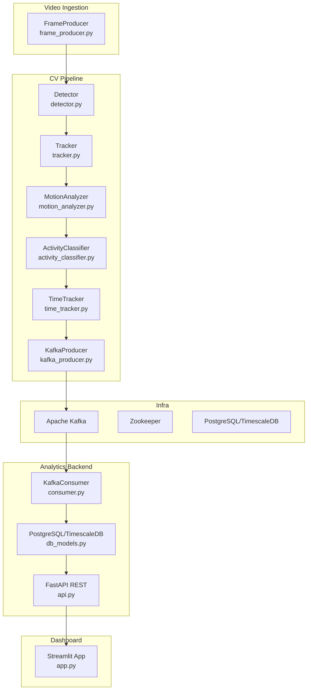
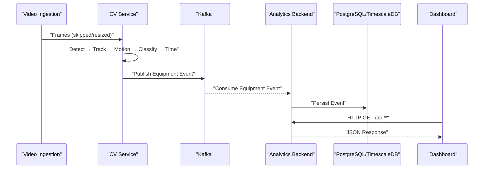
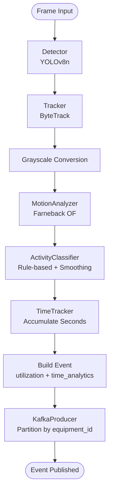
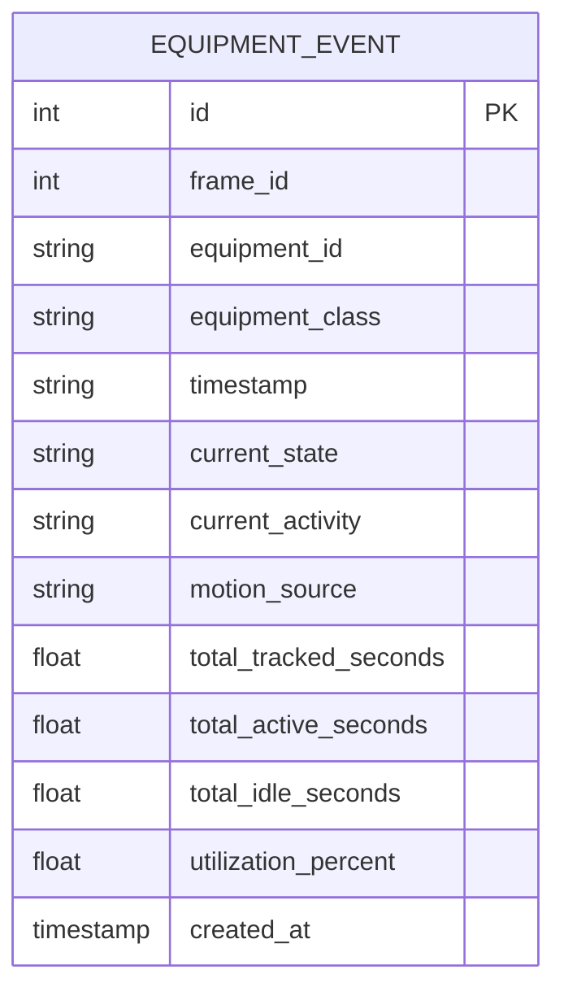
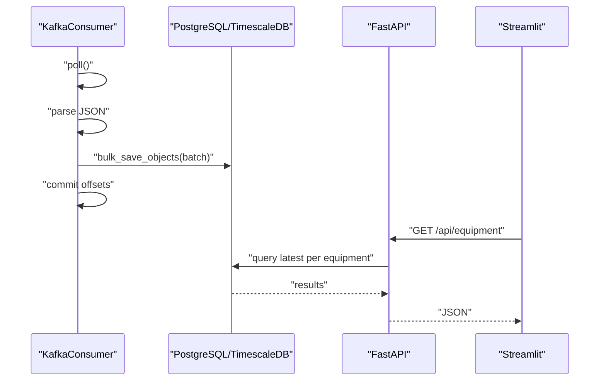
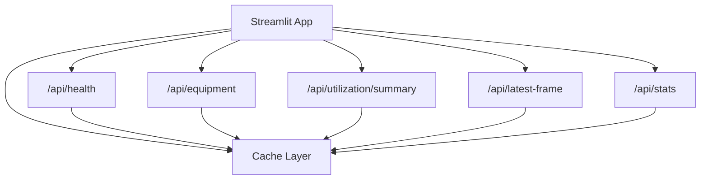
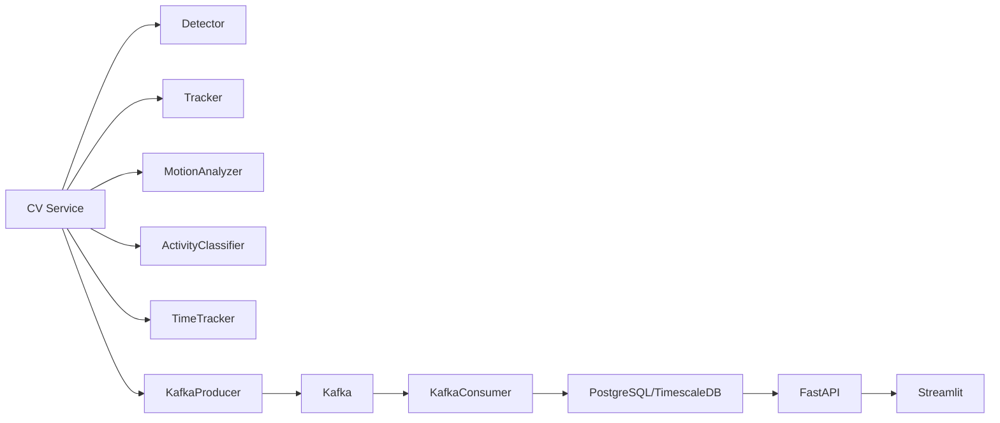

# Data Flow Patterns

<cite>
**Referenced Files in This Document**
- [README.md](file://README.md)
- [settings.yaml](file://config/settings.yaml)
- [docker-compose.yml](file://docker-compose.yml)
- [frame_producer.py](file://services/video_ingestion/src/frame_producer.py)
- [main.py](file://services/cv_service/src/main.py)
- [detector.py](file://services/cv_service/src/detector.py)
- [tracker.py](file://services/cv_service/src/tracker.py)
- [motion_analyzer.py](file://services/cv_service/src/motion_analyzer.py)
- [activity_classifier.py](file://services/cv_service/src/activity_classifier.py)
- [time_tracker.py](file://services/cv_service/src/time_tracker.py)
- [kafka_producer.py](file://services/cv_service/src/kafka_producer.py)
- [main.py](file://services/analytics_backend/src/main.py)
- [consumer.py](file://services/analytics_backend/src/consumer.py)
- [db_models.py](file://services/analytics_backend/src/db_models.py)
- [api.py](file://services/analytics_backend/src/api.py)
- [app.py](file://services/dashboard/src/app.py)
</cite>

## Table of Contents
1. [Introduction](#introduction)
2. [Project Structure](#project-structure)
3. [Core Components](#core-components)
4. [Architecture Overview](#architecture-overview)
5. [Detailed Component Analysis](#detailed-component-analysis)
6. [Dependency Analysis](#dependency-analysis)
7. [Performance Considerations](#performance-considerations)
8. [Troubleshooting Guide](#troubleshooting-guide)
9. [Conclusion](#conclusion)
10. [Appendices](#appendices)

## Introduction
This document explains the end-to-end data flow in the EagleVision system, from video ingestion through the computer vision pipeline to real-time dashboard visualization. The system uses an event-driven architecture powered by Apache Kafka for asynchronous messaging between services. It covers message formats, topic organization, transformation stages, persistence and caching strategies, and error handling in distributed flows.

## Project Structure
The system is composed of six primary services orchestrated by Docker Compose:
- Video ingestion service: extracts frames from video files
- CV service: detection, tracking, motion analysis, activity classification, time tracking, and Kafka publishing
- Analytics backend: Kafka consumer, database persistence, and FastAPI REST endpoints
- Dashboard: Streamlit UI that queries the backend REST API
- Apache Kafka: event streaming platform
- PostgreSQL with TimescaleDB: time-series data storage

**Diagram sources**
- [frame_producer.py](file://services/video_ingestion/src/frame_producer.py)
- [detector.py](file://services/cv_service/src/detector.py)
- [tracker.py](file://services/cv_service/src/tracker.py)
- [motion_analyzer.py](file://services/cv_service/src/motion_analyzer.py)
- [activity_classifier.py](file://services/cv_service/src/activity_classifier.py)
- [time_tracker.py](file://services/cv_service/src/time_tracker.py)
- [kafka_producer.py](file://services/cv_service/src/kafka_producer.py)
- [consumer.py](file://services/analytics_backend/src/consumer.py)
- [db_models.py](file://services/analytics_backend/src/db_models.py)
- [api.py](file://services/analytics_backend/src/api.py)
- [app.py](file://services/dashboard/src/app.py)
- [docker-compose.yml](file://docker-compose.yml)

**Section sources**
- [README.md](file://README.md)
- [docker-compose.yml](file://docker-compose.yml)

## Core Components
- Video ingestion: Produces frames with configurable frame skipping and resizing.
- CV pipeline: Runs detection, tracking, motion analysis, activity classification, and time tracking; publishes normalized events to Kafka.
- Analytics backend: Consumes Kafka events, persists to PostgreSQL/TimescaleDB, and exposes REST endpoints.
- Dashboard: Queries the REST API and renders real-time equipment status and utilization metrics.

Key configuration is centralized in settings.yaml, including video processing parameters, detection thresholds, motion analysis settings, activity classification parameters, Kafka connectivity, database credentials, and dashboard preferences.

**Section sources**
- [settings.yaml](file://config/settings.yaml)
- [frame_producer.py](file://services/video_ingestion/src/frame_producer.py)
- [main.py](file://services/cv_service/src/main.py)
- [detector.py](file://services/cv_service/src/detector.py)
- [tracker.py](file://services/cv_service/src/tracker.py)
- [motion_analyzer.py](file://services/cv_service/src/motion_analyzer.py)
- [activity_classifier.py](file://services/cv_service/src/activity_classifier.py)
- [time_tracker.py](file://services/cv_service/src/time_tracker.py)
- [kafka_producer.py](file://services/cv_service/src/kafka_producer.py)
- [consumer.py](file://services/analytics_backend/src/consumer.py)
- [db_models.py](file://services/analytics_backend/src/db_models.py)
- [api.py](file://services/analytics_backend/src/api.py)
- [app.py](file://services/dashboard/src/app.py)

## Architecture Overview
The system follows an event-driven pattern:
- CV service generates events per tracked equipment per processed frame.
- Kafka delivers events reliably to the analytics backend.
- Analytics backend persists events to PostgreSQL/TimescaleDB.
- Dashboard queries the REST API for real-time visualization.

**Diagram sources**
- [main.py](file://services/cv_service/src/main.py)
- [kafka_producer.py](file://services/cv_service/src/kafka_producer.py)
- [consumer.py](file://services/analytics_backend/src/consumer.py)
- [db_models.py](file://services/analytics_backend/src/db_models.py)
- [api.py](file://services/analytics_backend/src/api.py)
- [app.py](file://services/dashboard/src/app.py)

## Detailed Component Analysis

### Data Journey Through the CV Pipeline
The CV service orchestrates the computer vision pipeline and emits normalized events for each tracked equipment.

**Diagram sources**
- [main.py](file://services/cv_service/src/main.py)
- [detector.py](file://services/cv_service/src/detector.py)
- [tracker.py](file://services/cv_service/src/tracker.py)
- [motion_analyzer.py](file://services/cv_service/src/motion_analyzer.py)
- [activity_classifier.py](file://services/cv_service/src/activity_classifier.py)
- [time_tracker.py](file://services/cv_service/src/time_tracker.py)
- [kafka_producer.py](file://services/cv_service/src/kafka_producer.py)

**Section sources**
- [main.py](file://services/cv_service/src/main.py)
- [detector.py](file://services/cv_service/src/detector.py)
- [tracker.py](file://services/cv_service/src/tracker.py)
- [motion_analyzer.py](file://services/cv_service/src/motion_analyzer.py)
- [activity_classifier.py](file://services/cv_service/src/activity_classifier.py)
- [time_tracker.py](file://services/cv_service/src/time_tracker.py)
- [kafka_producer.py](file://services/cv_service/src/kafka_producer.py)

### Kafka Topic Organization and Message Schema
- Topic: equipment-events
- Partitioning: by equipment_id to ensure ordering per equipment
- Delivery semantics: at-least-once with manual commit in the consumer
- Message schema: standardized JSON envelope with utilization and time analytics

**Diagram sources**
- [db_models.py](file://services/analytics_backend/src/db_models.py)

**Section sources**
- [settings.yaml](file://config/settings.yaml)
- [kafka_producer.py](file://services/cv_service/src/kafka_producer.py)
- [consumer.py](file://services/analytics_backend/src/consumer.py)
- [db_models.py](file://services/analytics_backend/src/db_models.py)
- [README.md](file://README.md)

### Analytics Backend Persistence and REST API
- Consumer: reads from equipment-events, batches writes, commits offsets after successful DB writes
- Database: PostgreSQL with TimescaleDB hypertable on equipment_events for time-series optimization
- API: provides health, equipment list, history, utilization summary, latest frame, and stats

**Diagram sources**
- [consumer.py](file://services/analytics_backend/src/consumer.py)
- [db_models.py](file://services/analytics_backend/src/db_models.py)
- [api.py](file://services/analytics_backend/src/api.py)
- [app.py](file://services/dashboard/src/app.py)

**Section sources**
- [consumer.py](file://services/analytics_backend/src/consumer.py)
- [db_models.py](file://services/analytics_backend/src/db_models.py)
- [api.py](file://services/analytics_backend/src/api.py)
- [app.py](file://services/dashboard/src/app.py)

### Dashboard Real-Time Visualization
- Polls REST endpoints with configurable refresh intervals
- Uses caching decorators to limit API calls
- Renders equipment status, utilization metrics, and latest frame overlay

**Diagram sources**
- [app.py](file://services/dashboard/src/app.py)
- [api.py](file://services/analytics_backend/src/api.py)

**Section sources**
- [app.py](file://services/dashboard/src/app.py)
- [api.py](file://services/analytics_backend/src/api.py)

## Dependency Analysis
- CV service depends on detector, tracker, motion analyzer, activity classifier, time tracker, and Kafka producer.
- Analytics backend depends on Kafka consumer, SQLAlchemy models, and FastAPI.
- Dashboard depends on REST API endpoints.
- Infrastructure: Kafka and Zookeeper managed by Docker Compose; PostgreSQL/TimescaleDB managed by Docker Compose.

**Diagram sources**
- [main.py](file://services/cv_service/src/main.py)
- [kafka_producer.py](file://services/cv_service/src/kafka_producer.py)
- [consumer.py](file://services/analytics_backend/src/consumer.py)
- [db_models.py](file://services/analytics_backend/src/db_models.py)
- [api.py](file://services/analytics_backend/src/api.py)
- [app.py](file://services/dashboard/src/app.py)
- [docker-compose.yml](file://docker-compose.yml)

**Section sources**
- [docker-compose.yml](file://docker-compose.yml)

## Performance Considerations
- CPU optimization: YOLOv8n, frame skipping, frame resizing, crop-based optical flow
- Producer tuning: linger.ms, batch.size, acks=all for reliability
- Consumer tuning: manual commit, batch size and timeout, max.poll.interval.ms
- Database: bulk inserts, TimescaleDB hypertable for time-series efficiency
- Dashboard: client-side caching and controlled refresh intervals

[No sources needed since this section provides general guidance]

## Troubleshooting Guide
- Kafka connectivity: verify bootstrap servers and topic existence; check consumer group offsets
- Database connectivity: ensure PostgreSQL is healthy and TimescaleDB extension is available
- Producer errors: buffer full conditions trigger flush and retry; inspect delivery callbacks
- Consumer errors: JSON decode failures, batch commit exceptions, partition EOF handling
- Dashboard connectivity: health endpoint checks; fallback UI when backend is unavailable

**Section sources**
- [kafka_producer.py](file://services/cv_service/src/kafka_producer.py)
- [consumer.py](file://services/analytics_backend/src/consumer.py)
- [api.py](file://services/analytics_backend/src/api.py)
- [app.py](file://services/dashboard/src/app.py)

## Conclusion
The EagleVision system implements a robust, event-driven pipeline that transforms raw video frames into actionable equipment utilization insights. Kafka decouples producers and consumers, enabling scalability and resilience. PostgreSQL/TimescaleDB provides efficient time-series persistence, while the FastAPI backend and Streamlit dashboard deliver real-time visibility. Centralized configuration enables tuning for performance and accuracy.

[No sources needed since this section summarizes without analyzing specific files]

## Appendices

### Message Formats and Transformation Stages
- Input: video frames (skipped and resized)
- Detection: bounding boxes, class IDs, confidence
- Tracking: persistent equipment IDs with class prefixes
- Motion analysis: region-based optical flow magnitudes and directions
- Activity classification: rule-based classification with N-frame smoothing
- Time tracking: accumulated seconds and utilization percentages
- Kafka event: normalized JSON envelope for downstream processing

**Section sources**
- [README.md](file://README.md)
- [settings.yaml](file://config/settings.yaml)
- [detector.py](file://services/cv_service/src/detector.py)
- [tracker.py](file://services/cv_service/src/tracker.py)
- [motion_analyzer.py](file://services/cv_service/src/motion_analyzer.py)
- [activity_classifier.py](file://services/cv_service/src/activity_classifier.py)
- [time_tracker.py](file://services/cv_service/src/time_tracker.py)
- [kafka_producer.py](file://services/cv_service/src/kafka_producer.py)