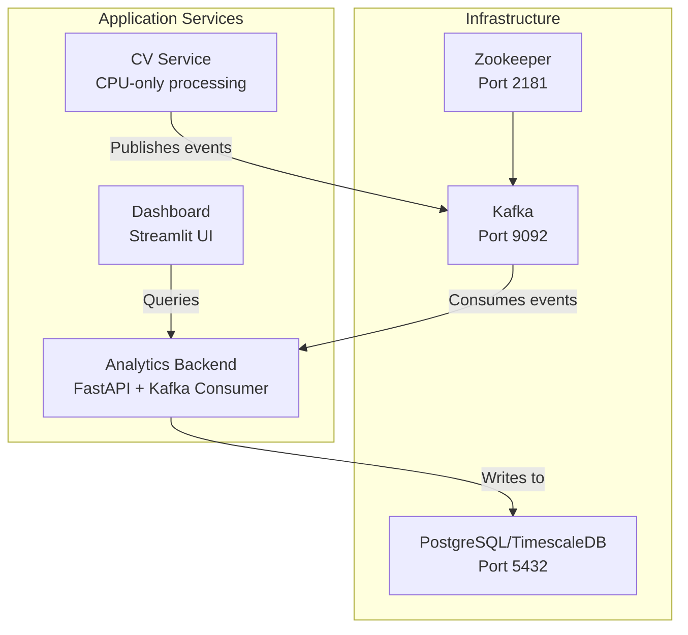
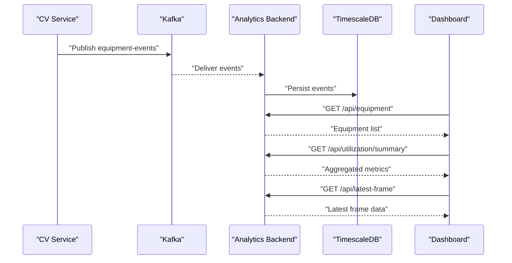
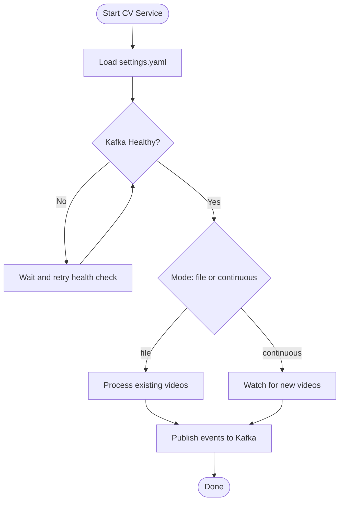
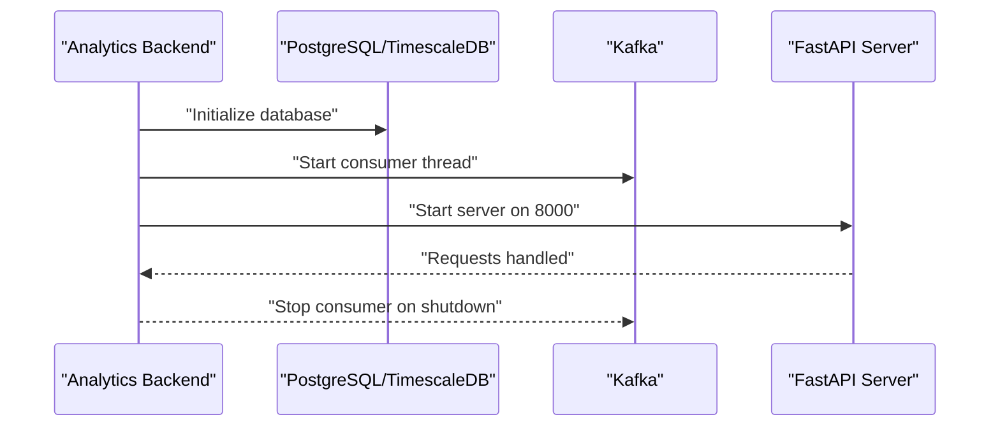
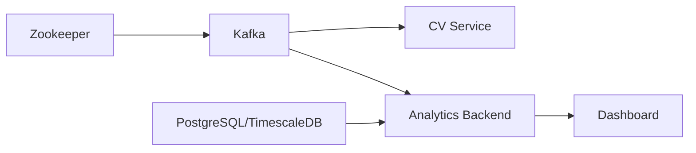

# Deployment Topology

<cite>
**Referenced Files in This Document**
- [docker-compose.yml](file://docker-compose.yml)
- [README.md](file://README.md)
- [settings.yaml](file://config/settings.yaml)
- [cv_service Dockerfile](file://services/cv_service/Dockerfile)
- [analytics_backend Dockerfile](file://services/analytics_backend/Dockerfile)
- [dashboard Dockerfile](file://services/dashboard/Dockerfile)
- [cv_service requirements.txt](file://services/cv_service/requirements.txt)
- [analytics_backend requirements.txt](file://services/analytics_backend/requirements.txt)
- [dashboard requirements.txt](file://services/dashboard/requirements.txt)
- [cv_service main.py](file://services/cv_service/src/main.py)
- [analytics_backend main.py](file://services/analytics_backend/src/main.py)
- [dashboard app.py](file://services/dashboard/src/app.py)
</cite>

## Table of Contents
1. [Introduction](#introduction)
2. [Project Structure](#project-structure)
3. [Core Components](#core-components)
4. [Architecture Overview](#architecture-overview)
5. [Detailed Component Analysis](#detailed-component-analysis)
6. [Dependency Analysis](#dependency-analysis)
7. [Performance Considerations](#performance-considerations)
8. [Troubleshooting Guide](#troubleshooting-guide)
9. [Conclusion](#conclusion)
10. [Appendices](#appendices)

## Introduction
This document describes the deployment topology and infrastructure configuration for the Equipment Utilization & Activity Classification pipeline. It covers the Docker Compose orchestration of six services: Zookeeper, Kafka, PostgreSQL/TimescaleDB, CV Service, Analytics Backend, and Dashboard. It explains service dependencies, health checks, port mappings, volumes, containerization strategy, environment variable management, configuration sharing, deployment scenarios, scaling considerations, and inter-service communication patterns.

## Project Structure
The deployment is orchestrated by a single Docker Compose file that defines all services and their runtime relationships. Configuration is centralized in a shared YAML file mounted into relevant services. The CV Service consumes video assets and publishes events to Kafka; the Analytics Backend consumes Kafka events and persists them to TimescaleDB; the Dashboard queries the Analytics Backend API for real-time visualization.

**Diagram sources**
- [docker-compose.yml:1-95](file://docker-compose.yml#L1-L95)
- [settings.yaml:41-59](file://config/settings.yaml#L41-L59)

**Section sources**
- [docker-compose.yml:1-95](file://docker-compose.yml#L1-L95)
- [README.md:56-66](file://README.md#L56-L66)

## Core Components
- Zookeeper: Centralized coordination for Kafka brokers.
- Kafka: Event streaming platform for decoupled processing.
- PostgreSQL/TimescaleDB: Time-series data storage for analytics.
- CV Service: Computer vision pipeline that detects, tracks, analyzes motion, classifies activities, and publishes events to Kafka.
- Analytics Backend: FastAPI REST service with a Kafka consumer that persists events to the database and exposes health and metrics endpoints.
- Dashboard: Streamlit UI that queries the Analytics Backend API for live monitoring.

Key runtime characteristics:
- CV Service depends on Kafka being healthy before starting.
- Analytics Backend depends on both Kafka and PostgreSQL/TimescaleDB being healthy.
- Dashboard depends on the Analytics Backend.
- Configuration is shared via a mounted config volume.

**Section sources**
- [docker-compose.yml:15-33](file://docker-compose.yml#L15-L33)
- [docker-compose.yml:35-49](file://docker-compose.yml#L35-L49)
- [docker-compose.yml:51-63](file://docker-compose.yml#L51-L63)
- [docker-compose.yml:64-81](file://docker-compose.yml#L64-L81)
- [docker-compose.yml:80-91](file://docker-compose.yml#L80-L91)
- [settings.yaml:41-59](file://config/settings.yaml#L41-L59)

## Architecture Overview
The system follows a real-time event streaming architecture:
- CV Service reads video assets, performs detection/tracking/motion analysis/activity classification, and publishes structured events to a Kafka topic.
- Analytics Backend consumes these events asynchronously, persists them to TimescaleDB, and serves a REST API.
- Dashboard connects to the Analytics Backend API to present live equipment status, utilization metrics, and video frame overlays.

**Diagram sources**
- [settings.yaml:41-46](file://config/settings.yaml#L41-L46)
- [cv_service main.py:420-484](file://services/cv_service/src/main.py#L420-L484)
- [analytics_backend main.py:104-122](file://services/analytics_backend/src/main.py#L104-L122)
- [dashboard app.py:110-160](file://services/dashboard/src/app.py#L110-L160)

## Detailed Component Analysis

### Zookeeper
- Role: Provides distributed coordination for Kafka.
- Ports: Exposed internally and externally on port 2181.
- Health checks: Uses a simple ruok echo command against the client port.
- Dependencies: Kafka depends on Zookeeper being healthy before starting.

Operational notes:
- Replication factor for internal topics is set to 1 for single-node deployment.
- Auto-creation of topics is enabled.

**Section sources**
- [docker-compose.yml:2-13](file://docker-compose.yml#L2-L13)
- [docker-compose.yml:15-28](file://docker-compose.yml#L15-L28)

### Kafka
- Role: Event streaming backbone for the pipeline.
- Ports: Exposed on 9092.
- Health checks: Verifies broker API versions via CLI.
- Dependencies: CV Service and Analytics Backend depend on Kafka being healthy.
- Configuration: Broker ID, advertised listeners, offsets replication factor, and auto-create topics.

**Section sources**
- [docker-compose.yml:15-33](file://docker-compose.yml#L15-L33)
- [settings.yaml:41-46](file://config/settings.yaml#L41-L46)

### PostgreSQL/TimescaleDB
- Role: Time-series data store for persisted events and analytics.
- Ports: Exposed on 5432.
- Health checks: Uses pg_isready to verify connectivity.
- Volumes: Persists data under postgres-data.
- Dependencies: Analytics Backend depends on database readiness.

**Section sources**
- [docker-compose.yml:35-49](file://docker-compose.yml#L35-L49)
- [settings.yaml:47-54](file://config/settings.yaml#L47-L54)

### CV Service
- Containerization: CPU-optimized build with OpenCV headless and CPU-only PyTorch; installs system dependencies for video processing.
- Dependencies: Requires Kafka to be healthy; mounts videos and config directories.
- Environment: Sets PYTHONUNBUFFERED for immediate logs.
- Behavior: Loads configuration from mounted settings.yaml; processes videos in file or continuous mode; publishes events to Kafka.

**Diagram sources**
- [cv_service Dockerfile:1-27](file://services/cv_service/Dockerfile#L1-L27)
- [cv_service main.py:500-571](file://services/cv_service/src/main.py#L500-L571)
- [docker-compose.yml:51-63](file://docker-compose.yml#L51-L63)

**Section sources**
- [cv_service Dockerfile:1-27](file://services/cv_service/Dockerfile#L1-L27)
- [cv_service main.py:420-484](file://services/cv_service/src/main.py#L420-L484)
- [docker-compose.yml:51-63](file://docker-compose.yml#L51-L63)

### Analytics Backend
- Containerization: Installs system dependencies for PostgreSQL bindings; copies application code and dependencies.
- Dependencies: Depends on Kafka and PostgreSQL/TimescaleDB being healthy; exposes port 8000.
- Environment: Sets PYTHONUNBUFFERED; mounts config.
- Behavior: Initializes database, starts Kafka consumer in a background thread, and runs FastAPI server; gracefully shuts down on signals.

**Diagram sources**
- [analytics_backend Dockerfile:1-23](file://services/analytics_backend/Dockerfile#L1-L23)
- [analytics_backend main.py:64-145](file://services/analytics_backend/src/main.py#L64-L145)
- [docker-compose.yml:64-81](file://docker-compose.yml#L64-L81)

**Section sources**
- [analytics_backend Dockerfile:1-23](file://services/analytics_backend/Dockerfile#L1-L23)
- [analytics_backend main.py:64-145](file://services/analytics_backend/src/main.py#L64-L145)
- [docker-compose.yml:64-81](file://docker-compose.yml#L64-L81)

### Dashboard
- Containerization: Minimal Streamlit image; installs dependencies and sets Streamlit to listen on 0.0.0.0.
- Dependencies: Depends on Analytics Backend; exposes port 8501.
- Environment: Sets PYTHONUNBUFFERED; mounts config.
- Behavior: Queries backend API endpoints for equipment status, utilization metrics, and latest frame data; supports manual and auto-refresh.

**Section sources**
- [dashboard Dockerfile:1-17](file://services/dashboard/Dockerfile#L1-L17)
- [dashboard app.py:518-621](file://services/dashboard/src/app.py#L518-L621)
- [docker-compose.yml:80-91](file://docker-compose.yml#L80-L91)
- [settings.yaml:55-59](file://config/settings.yaml#L55-L59)

## Dependency Analysis
Inter-service dependencies and startup order:
- Zookeeper must be healthy before Kafka starts.
- Kafka must be healthy before CV Service and Analytics Backend start.
- PostgreSQL/TimescaleDB must be healthy before Analytics Backend starts.
- Dashboard starts after Analytics Backend.

**Diagram sources**
- [docker-compose.yml:17-19](file://docker-compose.yml#L17-L19)
- [docker-compose.yml:55-57](file://docker-compose.yml#L55-L57)
- [docker-compose.yml:68-72](file://docker-compose.yml#L68-L72)
- [docker-compose.yml:84-85](file://docker-compose.yml#L84-L85)

**Section sources**
- [docker-compose.yml:17-19](file://docker-compose.yml#L17-L19)
- [docker-compose.yml:55-57](file://docker-compose.yml#L55-L57)
- [docker-compose.yml:68-72](file://docker-compose.yml#L68-L72)
- [docker-compose.yml:84-85](file://docker-compose.yml#L84-L85)

## Performance Considerations
- CPU-only optimization: CV Service uses a small YOLO model variant and frame skipping to reduce computational load.
- Video ingestion: The pipeline processes every Nth frame and resizes frames to balance accuracy and throughput.
- Kafka topic configuration: Single-replica offsets and auto-topic creation simplify local deployments but are not suitable for production scale.
- Database: TimescaleDB is optimized for time-series data; ensure adequate disk I/O and memory for analytical queries.
- Dashboard refresh: Configurable refresh intervals to balance responsiveness and API load.

[No sources needed since this section provides general guidance]

## Troubleshooting Guide
Common issues and remedies:
- Kafka not ready: Verify Zookeeper health and Kafka broker API versions; ensure advertised listeners are reachable.
- Database connection failures: Confirm credentials and URI in settings; check container health and network connectivity.
- CV Service not publishing: Validate Kafka bootstrap servers and topic name; confirm configuration mounting and file paths.
- Dashboard API errors: Ensure Analytics Backend is healthy and reachable; verify API URL configuration.

**Section sources**
- [docker-compose.yml:9-13](file://docker-compose.yml#L9-L13)
- [docker-compose.yml:28-33](file://docker-compose.yml#L28-L33)
- [docker-compose.yml:45-49](file://docker-compose.yml#L45-L49)
- [settings.yaml:41-59](file://config/settings.yaml#L41-L59)
- [dashboard app.py:100-108](file://services/dashboard/src/app.py#L100-L108)

## Conclusion
The deployment topology leverages Docker Compose to orchestrate a cohesive real-time analytics pipeline. Centralized configuration enables consistent behavior across services, while health checks and explicit dependencies ensure reliable startup ordering. The architecture supports development workflows and can be adapted for production with appropriate scaling and HA strategies.

[No sources needed since this section summarizes without analyzing specific files]

## Appendices

### Port Mappings and Volume Mounts
- Zookeeper: Port 2181
- Kafka: Port 9092
- PostgreSQL/TimescaleDB: Port 5432, persistent volume postgres-data
- CV Service: No exposed ports; mounts videos and config directories
- Analytics Backend: Port 8000; mounts config directory
- Dashboard: Port 8501; mounts config directory

**Section sources**
- [docker-compose.yml:7-8](file://docker-compose.yml#L7-L8)
- [docker-compose.yml:20-21](file://docker-compose.yml#L20-L21)
- [docker-compose.yml:41-44](file://docker-compose.yml#L41-L44)
- [docker-compose.yml:58-60](file://docker-compose.yml#L58-L60)
- [docker-compose.yml:73-74](file://docker-compose.yml#L73-L74)
- [docker-compose.yml:86-87](file://docker-compose.yml#L86-L87)

### Environment Variables Management
- Shared configuration: Mounted settings.yaml provides Kafka bootstrap servers, topic, database credentials, and dashboard API URL.
- Service-specific variables: PYTHONUNBUFFERED is set across services for immediate logging.

**Section sources**
- [settings.yaml:41-59](file://config/settings.yaml#L41-L59)
- [docker-compose.yml:61-63](file://docker-compose.yml#L61-L63)
- [docker-compose.yml:77-79](file://docker-compose.yml#L77-L79)
- [docker-compose.yml:89-91](file://docker-compose.yml#L89-L91)

### Configuration Sharing Between Services
- CV Service loads configuration from mounted settings.yaml and uses Kafka producer settings.
- Analytics Backend loads configuration for Kafka consumer and database URI.
- Dashboard loads configuration for API endpoint and refresh behavior.

**Section sources**
- [cv_service main.py:69-102](file://services/cv_service/src/main.py#L69-L102)
- [analytics_backend main.py:29-62](file://services/analytics_backend/src/main.py#L29-L62)
- [dashboard app.py:26-57](file://services/dashboard/src/app.py#L26-L57)

### Deployment Scenarios and Scaling
- Development: Use docker compose up with --build; mount local videos and config; run all services locally.
- Production: Scale individual services horizontally (e.g., multiple Analytics Backend replicas behind a load balancer); increase Kafka partitions and replication; deploy PostgreSQL/TimescaleDB with replication and backups; expose only necessary ports; manage secrets externally; enable TLS and authentication.

[No sources needed since this section provides general guidance]

### Network Topology and Inter-Container Communication
- Services communicate over Docker Compose’s default network using service names as hostnames.
- CV Service publishes to kafka:9092; Analytics Backend consumes from the same broker; Dashboard accesses analytics-backend:8000.

**Section sources**
- [settings.yaml:41-59](file://config/settings.yaml#L41-L59)
- [docker-compose.yml:17-25](file://docker-compose.yml#L17-L25)